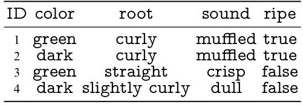
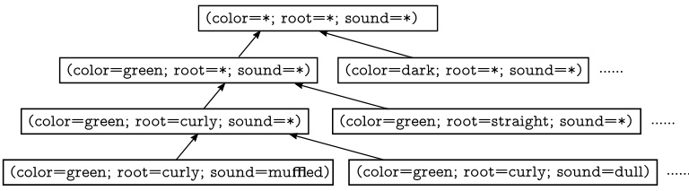
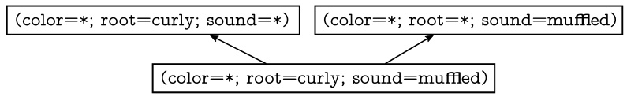
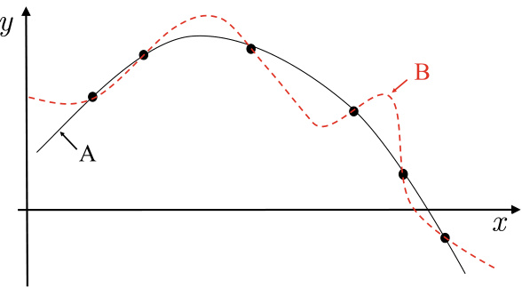
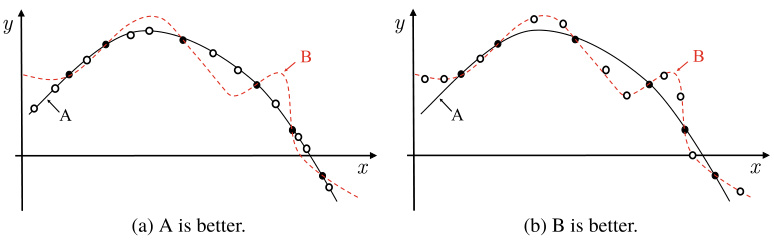

# Introduction  

## 1.1  Introduction  

Following a drizzling, we take a walk on the wet street. Feeling the gentle breeze and seeing the sunset glow, we bet the weather must be nice tomorrow. Walking to a fruit stand, we pick up a green watermelon with curly root and muffled sound; while hoping the watermelon is ripe, we also expect some good aca- demic marks this semester after all the hard work on studies. We wish readers to share the same confidence in their studies, but to begin with, let us take an informal discussion on what is machine learning .  

Taking a closer look at the scenario described above, we notice that it involves many experience-based predictions. For example, why would we expect beautiful weather tomorrow after observing the gentle breeze and sunset glow? We expect this beautiful weather because,from our experience,theweather on the following day is often beautiful when we experience such a scene in the present day. Also, why do we pick the watermelon with green color, curly root, and muffled sound? It is because we have eaten and enjoyed many watermelons, and those sat- isfying the above criteria are usually ripe. Similarly, our learn- ing experience tells us that hard work leads to good academic marks. We are confident in our predictions because we learned from experience and made experience-based decisions.  

Mitchell ( 1997 ) provides a more formal definition: ‘‘A computer program is said to learn from experience    $E$   for some class of tasks    $T$   and performance measure    $P$  , if its performance at tasks in  $T$  , as measured by    $P$  , improves with experience  $E$  .’’  

E.g., Hand et al. ( 2001 ).  

While humans learn from experience, can computers do the same? The answer is ‘‘yes’’, and machine learning is what we need. Machine learning is the technique that improves system performance by learning from experience via computational methods. In computer systems, experience exists in the form of data, and the main task of machine learning is to develop learning algorithms  that build  models  from data. By feeding the learning algorithm with experience data, we obtain a model that can make predictions (e.g., the watermelon is ripe) on new observations (e.g., an uncut watermelon). If we consider com- puter science as the subject of algorithms, then machine learn- ing is the subject of  learning algorithms .  

In this book, we use ‘‘model’’ as a general term for the out- come learned from data. In some other literature, the term ‘‘model’’may refer to the global outcome (e.g., a decision tree), while the term ‘‘pattern’’ refers to the local outcome (e.g., a single rule).  

## 1.2  Terminology  

To conduct machine learning, we must have data first. Suppose we have collected a set of watermelon records, for example, ( color  $=$   dark ;  root    $=$  curly ;  sound    $=$  muffled ) ,  ( color    $=$  green ;  root  $=$   curly ;  sound  $\mathbf{l}=\mathsf{d u l l}$  ) ,    $(\mathsf{c o l o r}=\mathsf{l i g h t}$  ;  root    $=$  straight ;  sound  $=$   crisp .  , where each pair of parentheses encloses one record and ‘‘  $^{\ast}\mathrm{=}^{\ast}$  ’’ means ‘‘takes value’’.  

Collectively, the records form a  data set , where each record contains the description of an event or object, e.g., a water- melon. A record, also called an  instance  or a  sample , describes some attributes of the event or object, e.g., the  color ,  root , and  sound  of a watermelon. These descriptions are often called attributes  or  features , and their values, such as  green  and  dark , are called  attribute values . The space spanned by attributes is called an  attribute space ,  sample space , or  input space . For example, if we consider  color ,  root , and  sound  as three axes, then they span a three-dimensional space describing watermel- ons, and we can position every watermelon in this space. Since every point in the space corresponds to a position vector, an instance is also called a  feature vector .  

The entire data set may also be seen as a ‘‘sample’’sampled from the sample space, and therefore depending on the context, according to which a ‘‘sample’’ can refer to either an individual data instance or a data set.  

More generally, let    $D~=~\{\pmb{x}_{1},\pmb{x}_{2},.\,.\,.\,,\pmb{x}_{m}\}$   be a data set containing    $m$   instances, where each instance is described by  $d$   attributes. For example, we use three attributes to describe watermelons. Each instance    $x_{i}\,=\,(x_{i1};x_{i2};.\,.\,.\,;x_{i d})\,\in\,\chi$   is a vector in the  d -dimensional sample space , where  d  is called  X the dimensionality of the instance  $\pmb{x}_{i}$  , and  $x_{i j}$   is the value of the  $j$  th attribute of the instance  $\pmb{x}_{i}$  . For example, at the beginning of this section, the second attribute of the third watermelon takes the value  straight .  

The process of using machine learning algorithms to build models from data is called  learning  or  training . The data used in the training phase is called  training data , in which each sample is a  training example , and the set of all training examples is called a  training set . Since a learned model corresponds to the under- lying rules about the data, it is also called a  hypothesis , and the actual underlying rules are called the  facts  or  ground-truth . Then, the objective of machine learning is to find or approxi- mate ground-truth. In this book, models are sometimes called learners , which are machine learning algorithms instantiated with data and parameters.  

Nevertheless, the samples in our watermelon example are not sufficient for learning a model that can determine the ripeness of uncut watermelons. In order to train an effective prediction model, the  outcome  information must also be avail- able, e.g.,  ripe  in  (( color  $=$   green ;  root  $=$   curly ;  sound  $=$  muffled ),  ripe ) . The outcome of a sample, such as  ripe  or unripe , is often called a  label , and a sample with a label is called an  example . More generally, we can write the  i th sample as    $(x_{i},y_{i})$  , where    $y_{i}\in\mathcal{Y}$   is the label of the sample    $\pmb{x}_{i}$  , and    $y$   is the set of all labels, also called the  label space  or  output space .  

When the prediction output is discrete, such as  ripe  and unripe , it is called a  classification  problem; when the prediction A training example is also called a  training instance .  

Learning algorithms often have parameters, and different parameter settings and training data lead to different learning outcomes.  

If we consider the label as part of the data sample, then  example and  sample  can be used interchangeably.  

output is continuous, such as the degree of ripeness, it is called a  regression  problem. If the prediction output has only two possible classes, then it is called a  binary classification  problem, where one class is marked as  positive  and the other is marked as negative . When more than two classes are present, it becomes a multiclass classification  problem. More generally, a prediction probl  is to establish a ma ping  $f:\mathcal{X}\mapsto\mathcal{Y}$  from the input space  $\mathcal{X}$   to the output space  by learning from a training set  X  Y

  $\{(\pmb{x}_{1},y_{1}),\,(\pmb{x}_{2},y_{2}),.\,.\,.\,,\,(\pmb{x}_{m},y_{m})\}$  . Conventionally, we let  $y=$   

  $\{-1,+1\}$   or    $\{0,1\}$   for binary classificatio lems,    $|y|>2$  for multiclass cla fication problems, and  Y  $y=\mathbb{R}$   =  for regression problems, where  R  is the set of real numbers.  

Also known as  testing instances .  

The process of making predictions with a learned model is called  testing , and the samples to be predicted are the  testing samples . For example, the label  $y$   of a testing sample  $\pmb{x}$   can be obtained via the learned model  $y=f({\pmb x})$  .  

Other than predictions, another type of learning is  cluster- ing . For example, we can group watermelons into several  clus- ters , where each cluster contains the watermelons that share some underlying concepts, such as  light color  versus  dark color , or even  locally grown  versus  imported . Clustering often provides data insights that form the basis of further analysis. However, we should note that the concepts, such as  light color or  locally grown , are unknown before clustering, and the sam- ples are usually unlabeled.  

Otherwise, the labels directly give the clusters; exceptions are discussed in Sect.  13.6 .  

More precisely, unseen samples.  

In practice, the size of a sample space is often huge. For example, given 20 variables each of which has 10 possible values, then the size of the sample space is already as large as   $10^{\bar{2}0}$  .  

Depending on whether the training data is labeled or not,we can roughly divide learning problems into two classes:  super- vised learning  (e.g., classification and regression) and  unsuper- vised learning  (e.g., clustering).  

It is worth mentioning that the objective of machine learn- ing is to learn models that can work well on the new sam- ples, rather than the training examples. The same objective also applies to unsupervised learning (e.g., clustering) since we wish the learned clusters work well on the samples outside of the training set. The ability to work on the new samples is called the  generalization  ability, and a well-generalized model should work well on the whole sample space. Although the training set is usually a tiny proportion of the sample space, we still hope the training set can, to some extent, reflect the characteristics of the whole sample space; otherwise, it would be hard for the learned model to work well on the new samples. We generally assume that all samples in a sample space follow a distribution  $\mathcal{D}$  , and all samples are independently sampled from this  dis- tribution , that is,  independent and identically distributed  ( i . i . d . ). Generally speaking, the more samples we have, the more infor- mation we know about the distribution    $\mathcal{D}$  , and consequently, the better-generalized model we can learn.  

## 1.3  Hypothesis Space  

Induction  and  deduction  are two fundamental tools of scientific reasoning. Induction is the process from specialization to  gen- eralization , that is, summarizing specific observations to gen- eralized rules. In contrast, deduction is the process from gener- alization to  specialization , that is, deriving specific cases from basic principles. For example, in axiomatic systems of mathe- matics, the process of deriving a theorem from a set of axioms is deduction. By contrast, learning from examples is an inductive process, also known as  inductive learning .  

In a broad sense, inductive learning is almost equivalent to learning from examples. In a narrow sense, inductive learning aims to learn  concepts  from training data, and hence is also called  concept learning  or  concept formation . The research and applications on concept learning are quite limited because it is usually too hard to learn generalized models with clear seman- tic meanings, whereas in real-world applications, the learned models are often  black boxes  that are difficult to interpret. Nev- ertheless, having a brief idea of concept learning is useful for understanding some basic concepts of machine learning.  

The most fundamental form of concept learning is  Boolean concept learning , which encodes target concepts as Boolean val-  

ues 1 or 0, indicating true or false. Taking the training data in  $^{\circ}$   Table 1.1  as an example, suppose we want to learn the tar- get concept of  ripe , assume that the ripeness of a watermelon entirely depends on its  color ,  root , and  sound . In other words, whether a watermelon is  ripe  or not is determined once we know the values of those three variables. Then, the concepts to be learned could be ‘‘ ripe  is watermelon with  color  $\r=X$  ,  $\mathsf{r o o t\,=\,}Y$  , and  sound  $=Z^{\ast}$  , or equivalently as the Boolean expression ‘‘ ripe    $\leftrightarrow$  ( color    ${\it\Delta\phi}=\,\!\!\operatorname{\Delta\phi}$  )    $\wedge$  ( root  ${\it\Delta\phi}=\!\!\left.\begin{array}{r l}\end{array}\right.$  )  $\wedge$  ( sound    $=\!\!$  ) ’’, where the ‘‘?’’marks are the values to be learned from training data.  

  

Readers may have recognized that the first row of    $^{\circ}$   Table 1.1  is already in the form of a concept for identifying  ripe watermelons, that is,  ripe    $\leftrightarrow\ \mathsf{\Pi}({\mathsf{c o l o r}}\ =\ \mathsf{g r e e n})$  )    $\wedge$  (  $\tt(r o o t\phi=$  curly )  $\wedge$  ( sound    $=$   muffled ) . Though the concept is valid for this particular watermelon, it does not generalize to other  

The approach of ‘‘memorizing’’ 1 training examples is called learning  (Cohen and  rote Feigenbaum  1983 ). See Sect.  1.5 .  

Here, we assume that there is no noisy data in the training examples and do not consider negation    $\neg A$  , e.g., . Note that the    $\emptyset$  hypothesis would not be applied as long as the training set contains at least one positive example.  

The search strategy is flexible. For example, we can simultaneously search using the top-down and bottom-up strategies, and only remove hypotheses that are inconsistent with the positive examples.  

unseen watermelons. If we just memorize all watermelons in the training set, then for sure, we can classify any watermelon that looks identical to those we have seen. However, what if an unseen watermelon does not look like any watermelons that we hav seen before? For example,  (  $\mathtt{(c o l o r=l i g h t)}$  )    $\wedge$  (  $\mathtt{r o o t}=$  curly )  $\wedge\,(\mathsf{s o u n d}=\mathsf{m u f i n e d})$  .  

We can think of machine learning as search in the hypoth- esis space for a hypothesis that is consistent with the training set, that is, the one that can correctly classify all watermelons in the training set. The hypothesis space, along with its size, is determined once its form is specified. In our watermelon prob- lem, the hypothesis space is the collection of all hypotheses in the form of  ( color    $=\!\!\mathrm{.}$  )  $\wedge$  ( root    $=\!\!\mathrm{.}$  )    $\wedge$  ( sound    ${\it\Delta\phi}=\!\!\left.\sum_{\lambda}\partial_{\lambda}\phi\right|$  )  for all possible values of ‘‘?’’. For example,  color  may take the value green ,  dark , or  light . Sometimes the value of  color  could be arbitrarily assigned, denoted by the wildcard val    $^{**}$  , such as  ripe  $\mathsf{\Lambda}\leftrightarrow(\mathsf{c o l o r}=\mathsf{*})\wedge(\mathsf{r o o t}=\mathsf{c u r l y})\wedge(\mathsf{s o u n d}=\mathsf{m u f f l e d})$  , which says that  ripe  is watermelon with any  color ,  curly root , and  muffled sound . Besides, we should also consider some extreme cases. For example, what if there were no  ripe  water- melon in the universe, and such a concept did not exist at all? In such cases, we use  $\emptyset$  to represent the hypothesis. In the water- melon problem, we have three possible values of  color , three possible values of  root , and three possible values of  sound , resulting in a hypothesis space of size   $4\times4\times4+1\,=\,65$  .  Figure 1.1  illustrates the hypothesis space of the watermelon problem.  

There are many strategies to search in the hypothesis space, such as top-down, general-to-specific, bottom-up, and specific- to-general. After filtering out all hypotheses that are inconsis- tent with the training examples, we may end up with one or more hypotheses that can correctly classify all training exam- ples.  

  
Fig. 1.1 The hypothesis space of the watermelon problem  

  

In practice, however, the hypothesis space is often huge, whereas the training examples are often finite. Consequently, there could be a set of hypotheses that are all consistent with the training examples, and we call such a set of hypotheses a  version space . For example,  .  Figure 1.2  shows the version space corresponding to the training examples in  .  Table 1.1 .  

## 1.4  Inductive Bias  

Since each learned model corresponds to one hypothesis in the version space, a potential problem arises here: different models may predict the new samples differently, though all hypotheses in    $^{\circ}$   Figure 1.2  are consistent with the training examples. For exa ple, the hypothesis  ripe    $\leftrightarrow$  ( color    $=$  ∗ )  ∧  $\mathtt{r o o t}=\mathtt{c u r l y}$  )  ∧  $\mathtt{(s o u n d=*)}$   classifies the unseen water- melon    $(\mathsf{c o l o r}=\mathsf{g r e e n})$   ∧ (  $\mathtt{r o o t}=\mathtt{c u r l y}$  )  $\wedge$   $(\mathtt{s o u n d}=\mathtt{d u l)}$  )  as ripe , whereas the other two hypotheses classify it as  unripe . In this case, which model (or hypothesis) should we use?  

In fact, if the training examples are only those as shown in .  Table 1.1 , then none of the three hypotheses can be justified better than the others. Nevertheless, a learning algorithm must make a choice and produce a model. In such a situation, the inductive bias  of the learning algorithm plays a decisive role. For example, if the learning algorithm prefers the model to be

 ‘‘as specific as possible’’, then it will choose  ripe    $\leftrightsquigarrow\left({\mathsf{c o l o r}}=\right.

$   $\mathsf{*})\wedge(\mathsf{r o o t}=\mathsf{c u r l y})\wedge(\mathsf{s o u n d}=\mathsf{m u f f l e d})$  ; on the other hand, if it prefers ‘‘as general as possible’’ and trusts  root  for some reasons, then it will choose  ripe    $\;\leftrightarrow\;({\mathsf{c o l o r}}\,=\,*)\,\wedge\,({\mathsf{r}}\,$  root  $=$  curly )  $\wedge\,({\mathsf{s o u n d}}=*)$  ) . The bias of a learning algorithm toward a particular class of hypotheses is called the  inductive bias  or simply  bias .  

Every effective learning algorithm must have its own induc- tive bias; otherwise, it will get into trouble when multiple hypotheses look the ‘‘same’’ on the training set, resulting in uncertain learning outcomes. Suppose there is no inductive bias, and the learned model randomly draws a hypothesis that is consistent with the training examples, then sometimes it will  

‘‘As specific as possible’’ is to minimize the number of applicable situations; ‘‘as general as possible’’ is to maximize the number of applicable situations.  

At first glance, it seems that the choice between  root  and  sound is related to  feature selection ; however, feature selection is based on the analysis of the training set, whereas the inductive bias in our example chooses  root  based on the domain knowledge. See Chap.  11  for more information about feature selection.  

  
Fig. 1.3 There are infinite curves that are consistent with the finite training set  

classify the unseen watermelon    $({\mathsf{c o l o r}}\;=\;{\mathsf{g r e e n}})\;\wedge\;({\mathsf{r o o t}}\;=\;$  curly )  $\wedge$   $(\mathtt{s o u n d}=\mathtt{d u l l})$   as  ripe  and sometimes  unripe . Such kinds of learning results are meaningless.  

The regression problem in  .  Figure 1.3  provides a more intuitive illustration of the role played by the inductive bias. In this example, each training example is shown as a point  $(x,y)$  , and the objective is to learn a curve passing through all training examples. Since there are infinite qualified curves for the finite training set, a learning algorithm must have its inductive bias to learn the ‘‘correct’’model. For example, if the learning algorithm believes that similar samples should have similar labels (e.g., watermelons with similar attributes should have similar degrees of ripeness), then it is likely to prefer the smooth curve A over the oscillating curve B.  

We can regard inductive bias as the heuristic or value phi- losophy of learning algorithms for search in potentially huge hypothesis spaces. It is natural to wonder that, does a general principle exist to help learning algorithms obtain the ‘‘correct’’ inductive bias? A fundamental and widely used principle for this question in natural science is the  Occam’s razor  principle, which says that we should choose the simplest hypothesis when there is more than one hypothesis consistent with the observa- tions. Assuming that ‘‘smoother’’is ‘‘simpler’’, then the smooth curve A in    $^{\circ}$   Figure 1.3  is the preferred choice according to the Occam’s razor principle. It turns out that the mathematical form of curve A, which is    $y=-x^{2}+6x+1$  , is much simpler than that of curve B.  

Nevertheless, Occam’s razor is not the only available prin- ciple, and even if we insist on using it, there are different under- standings. Indeed, applying Occam’s razor is non-trivial. For example, which of these two hypotheses  ripe    $\leftrightarrow\ \left({\mathsf{c o l o r}}\ =\right.

$   $\mathsf{*})\wedge(\mathsf{r o o t}=\mathsf{c u r l y})\wedge(\mathsf{s o u n d}=\mathsf{m u f l e d})$  )  and  ripe  $\leftrightarrow(\mathsf{c o l o r}=

$   $\mathsf{*})\wedge(\mathsf{r o o t}=\mathsf{c u r l y})\wedge(\mathsf{s o u n d}=\mathsf{*})$   is ‘‘simpler’’? Answering this question is not easy and needs additional domain knowledge.  

  
Fig. 1.4 There is no free lunch (  $\bullet$   are training samples;  ◦ are testing samples)  

In fact, the inductive bias, which helps the algorithm choose a hypothesis, corresponds to a hypothesis made by the learning algorithm itself. That is, what kind of models are better than the others? In practice, whether this hypothesis matches the specific problem or not usually determines the performance of the model.  

Let us revisit the example in  $^{\circ}$   Figure 1.3 . Suppose that a learning algorithm    $\mathfrak{L}_{a}$   learns the curve A model while another learning algorithm    $\mathfrak{L}_{b}$   learns the curve B model.Sinceasmoother curve,based on our intuition,is a simpler description,weexpect  $\mathfrak{L}_{a}$   to outperform    $\mathfrak{L}_{b}$  . As expected,  $\circ$  Figure 1.4 a confirms that curve A is doing better than curve B on the testing samples, that is, curve A has better generalization ability.  

Wait a moment! Though we hoped and expected    $\mathfrak{L}_{a}$   to out- perform    $\mathfrak{L}_{b}$  , is there any chance for the curve B model to be better than the curve A model like the case in    $\circ$   Figure 1.4 b? Unfortunately, this is possible. In other words, if    $\mathfrak{L}_{a}$   outper- forms    $\mathfrak{L}_{b}$   in some situations, then    $\mathfrak{L}_{b}$   will outperform    $\mathfrak{L}_{a}$   in some other situations. Interestingly, this fact applies to any algorithm, even if we let    $\mathfrak{L}_{a}$   be an advanced algorithm and let  $\mathfrak{L}_{b}$   be just random guessing. Are you surprised? Let us have a more in-depth look.  

To simplify the discussion, let both the sample space    $\mathcal{X}$   and the hypothesis space  $\mathcal{H}$   be discrete. Let  $P(h\mid X,\mathfrak{L}_{a})$   denote the probability of getting the hypothesis  h  from the algorithm  $\mathfrak{L}_{a}$   based on the training set    $X$  , and let  $f$   be the ground-truth target function that we wish to learn. Then, the  out-of-sample error  of  $\mathfrak{L}_{a}$  , that is, the error on all samples except those in the training set, is  

$$
E_{\mathrm{tot}}({\mathfrak{L}}_{a}\mid X,f)=\sum_{h}\sum_{x\in{\mathcal{X}}-X}P(x)\mathbb{I}(h(x)\neq f(x))P(h\mid X,{\mathfrak{L}}_{a}),
$$  

We only use basic mathematical knowledge here. However, readers who have ‘‘math phobia’’ can skip this part without impacting the understanding of the rest of this section, but only need to trust the unconvincing conclusion we arrived.  

where  $\mathbb{I}(\cdot)$   is the indicator function that returns 1 for true and 0 otherwise.  

In binary classification problems, the target function could be any function  $\mathcal{X}\mapsto\,\{0,1\}$   with a function space of    $\{0,1\}^{|\mathcal{X}|}$  .   Summing the errors of  $f$  with respect to uniform distribution gives  

$$
\begin{aligned}
\sum_f E_{\text {ote }}\left(\mathfrak{L}_a \mid X, f\right) & =\sum_f \sum_h \sum_{x \in \mathcal{X}-X} P(\boldsymbol{x}) \mathbb{I}(h(\boldsymbol{x}) \neq f(\boldsymbol{x})) P\left(h \mid X, \mathfrak{L}_a\right) \\
& =\sum_{\boldsymbol{x} \in \mathcal{X}-X} P(\boldsymbol{x}) \sum_h P\left(h \mid X, \mathfrak{L}_a\right) \sum_f \mathbb{I}(h(\boldsymbol{x}) \neq f(\boldsymbol{x})) \\
& =\sum_{\boldsymbol{x} \in \mathcal{X}-X} P(\boldsymbol{x}) \sum_h P\left(h \mid X, \mathfrak{L}_a\right) \frac{1}{2} 2^{|\mathcal{X}|} \\
& =\frac{1}{2} 2^{|\mathcal{X}|} \sum_{\boldsymbol{x} \in \mathcal{X}-X} P(\boldsymbol{x}) \sum_h P\left(h \mid X, \mathfrak{L}_a\right) \\
& =2^{|\mathcal{X}|-1} \sum_{\boldsymbol{x} \in \mathcal{X}-X} P(x) \cdot 1 .
\end{aligned}
$$

Equation ( 1.2 ) reveals an interesting fact: the sum of errors is independent of the learning algorithm. Hence, for any two learning algorithms    $\mathfrak{L}_{a}$   and  $\mathfrak{L}_{b}$  , we always have  

$$
\sum_{f}E_{\mathrm{ot}}({\mathfrak{L}}_{a}\mid X,f)=\sum_{f}E_{\mathrm{ot}}({\mathfrak{L}}_{b}\mid X,f).
$$  

In other words, no matter how smart    $\mathfrak{L}_{a}$   or how humble    $\mathfrak{L}_{b}$   is, their expected performance is always the same! This conclusion is known as the No Free Lunch (NFL) theorem (Wolpert  1996 ; Wolpert and Macready  1995 ).  

A rigorous proof of the NFL theorem is much more complicated than our simplified discussion here.  

Some readers may feel frustrated by the above conclusion since if the expected performance of all learning algorithms is comparable to random guessing, then why bother to learn machine learning at all?  

Indeed, we should note that the NFL theorem relies on the critical assumption that all problems are equally likely to hap- pen or are equally important. In practice, however, we only focus on the current problem (e.g., a specific task) and do not care whether the solution can apply to other problems or not, even if they are very similar. For example, biking is an excel- lent choice if we travel within our university campus, though it would be a rather inconvenient choice for traveling between cities.  

watermelon problem, we have two hypotheses: H1 : ripe $\leftrightarrow$ $($ color $=*) \wedge($ root $=$ curly $) \wedge($ sound $=$ muffled $)$ and H 2 : ripe $\leftrightarrow($ color $=*) \wedge($ root $=$ curly $) \wedge($ sound $=*)$, which are equally good according to the NFL theorem. At first glance, this seems to be correct since H 1 is better than H 2 on the example $($ ripe, $($ color $=$ green $) \wedge($ root $=$ curly $) \wedge$

The NFL theorem assumes that  $f$  is uniformly distributed, which is rarely true in practice. For example, going back to our watermelon problem, we have two hypotheses:  H1 : ripe $\leftrightarrow$ $($ color $=*) \wedge($ root $=$ curly $) \wedge($ sound $=$ muffled $)$ and $\mathtt{H2:r i p e\leftrightarrow(c o l o r=*)\wedge}$  ( root  =  curly )    $\wedge$  ( sound  $=*$  ) , which are equally good according to the NFL theorem. At first glance, this seems to be correct since  H1  is better than H2  on the example  ( ripe ,   $\mathsf{(c o l o r=g r e e n)}\wedge\mathsf{(r o o t=c u r l y)}\wedge\mathsf{\frac{\partial}{\partial t}}$   $\mathtt{(s o u n d=m u f l e d)}$   H2  is better than  H1  on the exam- ple  ( ripe , (  $({\mathsf{c o l o r}}\,=\,{\mathsf{d a r k}}$  )  $\wedge$  ( root  $=$   straight )  $\wedge$  ( sound    $=$  crisp )) . However, it turns out that  ripe  watermelons with the attributes  ( root  $=$   straight )  $\wedge$  ( sound  $=$   muffled )  are more common, whereas  ripe  watermelons with the attributes ( root  $=$   straight )  $\wedge$   $\mathtt{\setminus\,(s o u n d=c r i s p)}$   are rare or do not exist at all.  

In summary, the wisdom we learned from the NFL theorem is that debating ‘‘which learning algorithm is better’’ is mean- ingless without considering the specific task, since all learning algorithms are equally good considering all contexts. In other words, we must consider the specific learning problem when comparing different learning algorithms, and the learning algo- rithms that perform well on one class of problems possibly per- form poorly on another class of problems. Hence, whether the inductive bias matches the specific problem or not is often the decisive factor.  

## 1.5  Brief History  

We now proceed with a short overview of the development of machine learning. Machine learning is an inevitable product during the progress of artificial intelligence studies. Between the 1950s and early 1970s, artificial intelligence research was in the ‘‘reasoning age’’ when people thought a machine could get intelligence if it can do logical reasoning. Seminal works in that period include the  Logic Theorist  program developed by A. Newell and H. Simon and later on the  General Problem Solving  program. All of these works produced highly inspiring results at that time. For example, in 1952, the  Logic Theorist program successfully proved 38 theorems in the famous book Principia Mathematica  written by A. F. Whitehead and B. Rus- sell. Later on, in 1963, it proved all of the 52 theorems, and people found the Proof of the Theorem 2 . 85 was even more elegant than Whitehead and Russell’s. The research commu- nity recognized the importance of this line of work, and hence A. Newell and H. Simon received the Turing Award in 1975.  

However, as the research was advancing, people started to realize that having the ability of logical reasoning is still far away from enabling artificial intelligence.A group of researchers represented by E. A. Feigenbaum argued that machines must acquire knowledge in order to be intelligent. A new phase of development started in the mid of 1970s, where artifi- cial intelligence research entered the so-called ‘‘knowledge age’’. In this period, researchers developed a large number of expert systems with numerous successful applications in a wide range of domains. E. A. Feigenbaum, who is often regarded as the father of knowledge engineering, received the Turing Award in 1994. Nevertheless, researchers have soon reached the ‘‘Feigenbaum’s knowledge acquisition bottleneck’’, that is, it is difficult to extract and summarize knowledge into a form that computers can learn. Therefore, some researchers decided to explore the possibility of letting machines learn knowledge by themselves!  

See Sect.  1.7  for Samuel’s checkers program.  

IWML is the predecessor of the International Conference on Machine Learning (ICML).  

In fact, A. Turing had already mentioned the possibility of machine learning in his Turing test paper published in 1950. In the early 1950s, there were already some studies related to machine learning, such as the famous computer checkers program developed by A. Samuel. In the middle-late 1950s, neural-network-based connectionism learning emerged, and representative works include F. Rosenblatt’s Perceptron and B. Widrow’s Adaline. Between the 1960s and 1970s, the logic- representation-based symbolism learning has thrived, and rep- resentative works include the structural learning system pro- posed by P. Winston, the logic-based inductive learning system proposed by R. S. Michalski et al., and the concept learning sys- tem proposed by E. B. Hunt et al. Meanwhile, researchers also developed the decision-theory-based learning and reinforce- ment learning in this period, such as the learning machines proposed by N. J. Nilsson. This period has also witnessed some foundation works on the statistical learning theory,which becomes extremely popular 20 years later.  

In the summer of 1980, the First International Workshop on Machine Learning (IWML) was held at Carnegie Mellon University; in the same year, the  International Journal of Policy Analysis and Information Systems  published three consecutive special issues on machine learning. In 1983, Tioga press pub- lished a book edited by R. S. Michalski, J. G. Carbonell, and T. Mitchell called  Machine Learning: An Artificial Intelligence Approach , which summarized machine learning research in that period. In 1986,  Machine Learning , the first journal dedicated to machine learning, was established. In 1989,  Artificial Intel- ligence , the leading journal in artificial intelligence research, published a special issue on machine learning covering major research works in that period; later on, the content of this spe- cial issue appeared in the book  Machine Learning: Paradigms and Methods  edited by Carbonell ( 1990 ) and published by MIT press.Tosummarize,machine learning has become an in de pen- dent research field in the 1980s with diverse and active research directions.  

Michalski et al. ( 1983 ) divided machine learning methods into several categories:  rote learning and direct implanting of new knowledge ,  learning from instruction , and  learning from observation and discovery . In  The Handbook of Artificial Intel- ligence  (Volume III), E. A. Feigenbaum et al. divided machine learning methods into  rote learning ,  learning by being told , learning by analogy, and learning by induction . Rote learning, also known as memorization-based learning, does not perform any real learning but saves all input information as it is and retrieves it when needed. Learning by being told and learn- ing by analogy are similar to ‘‘learning from instruction’’ and ‘‘learning from observation and discovery’’ by Michalski. Since the 1980s, the most researched and applied approach is  learn- ing from examples  (or in a broad sense, learning by induction), such as supervised learning and unsupervised learning, which form the majority content of this book. Next, let us take a quick review of the evolution history of  learning from examples .  

In the 1980s, the mainstream of learning from examples is symbolism learning, represented by decision trees and logic- based learning. Decision trees rely on information theory to simulate the tree-based decision process of humans by minimiz- ing the information entropy. A representative work of logic- based learning is Inductive Logic Programming (ILP) which is an intersection between machine learning and logic program- ming. ILP employs first-order logic (i.e., predicate logic) to rep- resent knowledge, and induces data by updating and extending the logic expressions, e.g., Prolog expressions.  

See Chap.  4  for decision trees.  

See Chap.  15  for ILP.  

The reason that symbolism learning becomes the main- stream is closely related to the history of artificial intelligence. As mentioned earlier, artificial intelligence research started from the ‘‘reasoning age’’ in the 1950s and moved to the ‘‘knowledge age’’in the 1980s, where the ‘‘reasoning age’’relied on the symbolic knowledge representation for deductive rea- soning, and the ‘‘knowledge age’’ also relied on the symbolic knowledge representation for creating knowledge-based expert systems. Given that the symbolic knowledge representation is the underlying technology of the first two ‘‘ages’’, it naturally became the preferred choice in the early stage of the ‘‘learning age’’. In fact, decision trees, as a representative method of symbolism learning, are still one of the most commonly used machine learning techniques today. ILP has a great knowledge representation ability and can easily encode complex data rela- tionships together with domain knowledge. Therefore, it not only can perform domain knowledge-assisted learning but also can enhance domain knowledge through the learning process. However, since the great representation ability leads to a huge hypothesis space and model complexity,ILP is impractical even for moderately sized problems, and hence became less popular since the late 1990s.  

Until the middle 1990s, another mainstream technique of learning from examples is the neural-network-based connec- tionism learning. Though the research on connectionism learn- ing had a big leap forward in the 1950s, it did not become the mainstream since the research community still favors symbol- ism learning in the early days. For example, the Turing Award See Chap.  5  for the BP algorithm.  

See Chap.  6  for SVM and kernel methods.  

See Exercise  6.5  

winner H. Simon once said ‘‘A physical symbol system has the necessary and sufficient means for general intelligent action.’’ Besides, connectionism learning itself also encountered some challenges at that time. For example, the Turing Award win- ners M. Minsky and S. Papert pointed out in 1969 that neu- ral networks (at that time) can only handle linearly separable problems and cannot handle some simple problems such as XOR. Connectionism learning did not gain attention until J. J. Hopfield tackled the NP-hard ‘‘traveling salesman problem’’ using neural networks in 1983. Later on, D. E. Rumelhart et al. reinvented the renowned Backpropagating (BP) algorithm, which has a far-reaching influence. Unlike symbolism learn- ing, which produces explicit concepts, connectionism learning produces  black boxes , and this is clearly a weakness of connec- tionism learning from the knowledge acquisition perspective. Nevertheless, thanks to the effective BP algorithm, connection- ism learning can still do an excellent job in many real-world tasks. Nowadays, the BP algorithm is one of the most widely used machine learning algorithms. A significant limitation of connectionism learning is ‘‘trial and error’’, that is, we need to tune many parameters during the learning process, and the parameter tuning  is often manual and lacks principled guide- lines. In many cases, a tiny difference in parameter tuning can lead to significant differences in the learning outcome.  

In the middle 1990s, statistical learning, represented by Sup- port Vector Machine (SVM) (or  kernel methods  in a broader sense), has emerged as a superstar and quickly became the mainstream. However, the foundations of statistical learning theory (Vapnik  1998 ) were laid more than 20 years earlier in the 1960s− 1970s. For example, V. N. Vapnik proposed the con- cept of  support vector  in 1963, and later on, V. N. Vapnik and A. J. Chervonenkis proposed the concept of VC dimension in 1968 and the structural risk minimization principle in 1974. Though the foundations were ready, statistical learning did not become the mainstream until the middle 1990s. One reason was that although SVM was proposed in the early 1990s, its supe- riority was not recognized until its success in text classification in the middle 1990s. Another reason was that the limitations of connectionism learning were increasingly prominent at the time, forcing researchers to turn their attention to statistical learning techniques supported by statistical learning theory. In fact, statistical learning and connectionism learning are closely related. After the wide acceptance of SVM, kernel tricks have been used almost everywhere in machine learning, and kernel methods also become a fundamental content of machine learn- ing.  

Interestingly, connectionism came back to the stage in the early twenty-first century leading a new trend called  deep learn- ing . In a narrow sense, the so-called deep learning is simply neural networks with many layers. Deep learning techniques showed superior performance in many benchmarks and con- tests, especially for those involving complex data types such as audio and images. In the past, a profound understand- ing of machine learning techniques is the key for its users to achieve good performance in applications. Nevertheless, with the extreme flexibility and complexity of deep learning models, good performance can often be achieved after hard work on parameter tuning. Therefore, deep learning is easy to be accessed by machine learning practitioners, lowering the knowledge requirement threshold for its users, though the the- ory behind it is yet to be developed.  

Given that deep learning works so well, why did it not become popular earlier? There are two main reasons: the data is getting massive, and so does the computation power. On the one hand, the large number of parameters in deep learn- ing can easily lead to  overfitting  when the data is insufficient. On the other hand, given complex models and massive data, learning would not be possible without sufficient computing resources. Fortunately, we have entered the ‘‘big data era’’ in which both the data storage and the computing hardware have improved significantly, giving connectionism learning a new chance. Interestingly, the popularity of neural networks in the middle 1980s was also after the boom of computational power and the data access boosted by the advancement of the Intel  $\mathrm{x86}$   CPUs and memory devices. What is happening now to deep learning is similar to what happened to neural networks in the 1980s.  

See Sect.  5.6  for deep learning.  

See Chap.  2  for  overfitting .  

We should note that machine learning has grown into a broad research field, and what we have discussed in this section only provides a sketch on this topic. After reading the entire book, readers will gain a more comprehensive understanding of machine learning.  

## 1.6  Application Status  

The past two decades have witnessed fast and significant advances in the collection, storage, transmission, and process- ing of data. Given that we have accumulated massive data cov- ering all aspects of human life, effective and efficient methods for utilizing the data are urgently needed. Hence, it is not a sur- prise that machine learning has gained much attention since it provides solutions for unleashing the power of massive data.  

Nowadays, machine learning appears in different branches of computer science, such as multimedia, graphics, network communication, software engineering, and even architecture and chipset design. Machine learning has also become one of the most critical techniques in some ‘‘applied’’ areas, such as computer vision and natural language processing.  

Machine learning also provides support for interdisciplinary research. For example, bioinformatics is a research field that aims to employ information technology to understand biolog- ical observations and patterns, and people are excited about the human genome project and genomic medicine. In bioin- formatics, the whole process, from biological observations to pattern discovery, involves data collection, data management, data analytics, and simulations. Among these tasks, data ana- lytics is where machine learning shines, and researchers have already successfully applied various machine learning tech- niques to bioinformatics.  

NASA-JPL stands for the NASA Jet Propulsion Laboratory, who developed ‘‘Spirit’’ and ‘‘Opportunity’’ robotic rovers landed on Mars. DARPA stands for the Defense Advanced Research Projects Agency, who initiated the development of the Internet and Global Positioning System.  

Machine learning provides data analytics, clouding computing provides data processing, and crowdsourcing provides data labeling.  

In fact, the research methodology of science is shifting from ‘‘theory    $+$   experiment’’ to ‘‘theory  $^+$   experiment  $^+$   com- putation’’, and people even use the term ‘‘data science’’. The importance of machine learning is increasing since comput- ing with data is the core of both data analytics and data sci- ence. If we list the most current and eye-catching computer science technologies, then machine learning must be one of them. In 2001, scientists from NASA-JPL published an article (Mjolsness and DeCoste  2001 ) in the  Science  magazine pointed out that machine learning is playing an increasingly important role in supporting scientific research and is crucial for technol- ogy development. In 2003, DARPA started the PAL project, which puts machine learning to the level of national security. We see that the importance of machine learning is recognized by both NASA and DARPA, who often promote the most cutting-edge technologies in the U.S.  

In 2006, Carnegie Mellon University founded the world’s first school of machine learning, which is directed by Professor T.Mitchell,one of the pioneers in machine learning research.In March 2012, the Obama administration proposed the ‘‘big data research and development initiative’’ followed by a reinforce- ment project at UC Berkley led by the U.S. National Science Foundation. The initiative puts emphasis on three essential techniques: machine learning, cloud computing, and crowd- sourcing. Clearly, machine learning is an essential technique in the era of big data for a simple reason: the purpose of collect- ing, storing, transmitting, and managing big data is to utilize big data, and it will not be possible without machine learning.  

When we discuss data analytics, people may think about data mining. Here, we give a brief discussion of the relation- ship between data mining and machine learning. Data mining research formed in the 1990s under the influence of many other research fields, where the most important ones are database, machine learning, and statistics (Zhou  2003 ). Data mining is about knowledge discovering from massive data, and there- fore it involves the managing and analyzing of massive data. Roughly speaking, database research provides the data man- agement facility for data mining, while machine learning and statistics provide the facility of data analytics. Research out- comes from statistics are often turned into practical learning algorithms through machine learning research, and the learn- ing algorithms are then used by data mining. From this per- spective, statistics influences data mining via machine learning, and therefore machine learning and data management are two backbones of data mining.  

Data mining appeared in the statistics community a long time ago as a slightly negative term. The reason is that traditional statistics research focuses on elegant theories and ignores the practical utility. Recently, however, statisticians have started to investigate practical problems and get involved in machine learning and data mining research.  

Today, machine learning strongly influences our daily life. For example, analyzing data collected from satellites and sen- sors using machine learning has become essential in applica- tions such as weather forecasts, energy exploration, and envi- ronmental monitoring. In commercial applications, machine learning is now helping us to analyze sales and customer data for optimizing the inventory costs as well as designing sales strategies for targeted customer cohorts. The followings are some other aspects.  

Search engines like Google Search have been changing people’s lifestyles, such as searching for destination infor- mation before traveling and looking for a suitable hotel or restaurant.  Newsweek  once commented on Google Search as ‘‘ Positioning everyone a mouse-click away from the answers to the most arcane questions. ’’Internet search locates the requested information by analyzing data all over the network, and the search process, from the input query to the output results, relies on machine learning technologies to establish the map- ping between input and output. In fact, machine learning has made tremendous contributions to the development of Internet search that we are enjoying today, and many advanced func- tions, such as ‘‘search by photo’’, are enabled by cutting-edge machine learning techniques. All the leading technology com- panies, such as Google, Microsoft, Facebook, and Amazon, have their machine learning research teams or even research centers named after machine learning. The decisions made by these giant companies not only show the fast development and application of machine learning but also influence the future direction of the Internet industry.  

Another notable application of machine learning is autonomous vehicles, which, hopefully, can reduce traffic col- lisions significantly, saving more than a million lives each year.  

In the early 1990s, a neural-network-based system called ALVINN was developed to control autonomous vehicles; this project was discussed in Sect. 4 . 2 of the classic machine learning textbook (Mitchell 1997 ).  

We expect autonomous vehicles to be safer since computer drivers are always experienced and are not subject to fatigue driving or drunk driving. Besides, autonomous vehicles are also valuable to the military. The U.S. has started to explore autonomous vehicles since the 1980s. The greatest difficulty is that engineers are unable to consider all possible driving situations and program them, and hence autonomous vehi- cles must be able to make situational decisions by themselves. If we consider the data received by sensors as input and let the control of steering, brake, and accelerator as output, then we can abstract self-driving to a machine learning problem. In March 2004, the Stanford machine learning team led by S. Thrun won the autonomous vehicle competition hosted by DARPA. Their autonomous vehicle finished 132 miles of travel in mountain and desert areas in Nevada in   $6\,\mathrm{h}$   and   $53\,\mathrm{{min}}$  . The road was rough, and driving in such conditions can be a challenging task for experienced human drivers. Later on, S. Thrun joined Google to lead its autonomous vehicle project. It is worth mentioning that research on autonomous vehicles has made some significant progress in recent years. It has attracted large amounts of research funds from electric-automobile man- ufacturers such as Tesla, as well as traditional automotive man- ufacturers, such as General Motors, Volkswagen, and BMW. In some places, we can already see autonomous vehicles on the road. In June 2011, Nevada passed a bill and became the first state of the U.S. permitting autonomous vehicles on the road, followed by Hawaii and Florida. Hopefully, autonomous vehi- cles, driven by machine learning technologies, will be widely adopted in the near future.  

Machine learning gained its public attention for its tremen- dous contributions to intelligent data analytics. However, we should also be aware of another important aspect of machine learning, that is, assisting our understanding of ‘‘how humans learn’’. For example, when the Sparse Distributed Memory (SDM) model (Kanerva  1988 ) was proposed by P. Kanerva in the middle 1980s, there is no intentional imitation to the bio- logical structure of the human brain. However, neuroscience researchers figured out that the sparse encoding mechanism in SDM widely exists in the cortex controlling vision, hearing, and olfactory, thus inspiring more neuroscience research. The moti- vation of conducting natural science research is fundamentally due to human curiosity about the origin of the universe, the essence of the matters, the characters of life, and the aware- ness of humans ourselves. Undoubtedly, ‘‘how humans learn’’ is an essential topic of our awareness. In some sense, machine learning is not just crucial for information science, but also has some sense of exploring the universe like natural science.  