# Model Selection and Evaluation  

## 2.1  Empirical Error and Overfitting  

Accuracy is often expressed as percentages:    $(1-\frac{a}{m})\times100\%$  

Here, the ‘‘error’’ refers to the expectation of errors.  

Later chapters will introduce different learning algorithms for minimizing the empirical error.  

In general, the proportion of incorrectly classified samples to the total number of samples is called  error rate , that is, if    $a$   out of    $m$   samples are misclassified, then the error rate is    $\scriptstyle E\ =\ a/m$  ordingly,   $1-a/m$   is called  accuracy , i.e., accuracy  =  $=~1~-$   − error rate. More generally, the difference between the output predicted by the learner and the ground- truth output is called  error . The error calculated on the training set is called  training error  or  empirical error , and the error calcu- lated on the new samples is called  generalization error . Clearly, we wish to have a learner with a small generalization error. However,since the details of the new samples are unknown dur- ing the training phase, we can only try to minimize the empirical error in practice. Quite often, we obtain learners that perform well on the training set with a small or even zero empirical error, that is,   $100\%$   accuracy. However, are they the learners we need? Unfortunately, such learners are not good in most cases.  

The good learners we are looking for are those performing well on the new samples. Hence, good learners should learn general rules from the training examples such that the learned rules apply to all potential samples. However, when the learner learns the training examples ‘‘too well’’, it is likely that some peculiarities of the training examples are taken as general prop- erties that all potential samples will have, resulting in a reduc- tion in generalization performance. In machine learning, this phenomenon is known as  overfitting , and the opposite is known as  underfitting , that is, the learner failed to learn the general properties of training examples.  .  Figure 2.1  illustrates the dif- ference between overfitting and underfitting.  

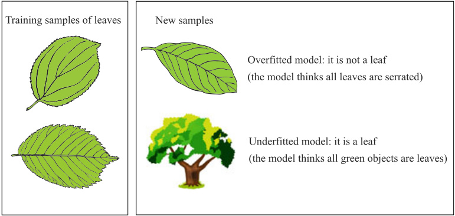  
Fig. 2.1 An intuitive analogy of overfitting and underfitting  

Among many possible reasons, the overly strong learning ability is a common cause for overfitting since such learners can learn the non-general peculiarities of training examples. By contrast, underfitting is usually due to weak learning abil- ity. In practice, underfitting is relatively easy to overcome. For example, we can do more branching in decision tree learning or adding more training epochs in neural network learning. However, as we will see later, overfitting is a fundamental diffi- culty in machine learning, and almost every learning algorithm has implemented some mechanisms to deal with overfitting. Nevertheless, we should realize that overfitting is unavoidable, and all we can do is to alleviate or reduce the risk of it. This argument can be briefly justified as follows. Machine learn- ing problems are often NP-hard or even harder, but practical learning algorithms have to finish learning within polynomial time. Hence, if overfitting is avoidable, then minimizing the empirical error will lead to the optimal solution, and there- fore we have a constructive proof of   $\scriptstyle\mathrm{P{=}N P}$  . In other words, overfitting is unavoidable as long as we believe in   $\mathrm{P\neqN P}$  .  

In practice, there are often multiple candidate learning algo- rithms, and even the same learning algorithm may produce dif- ferent models under different parameter settings. Then, which learning algorithm should we choose, and which parameter settings should we use? This problem is referred to as  model selection . The ideal solution is to evaluate all candidate models and select the one with the smallest generalization error. How- ever, as mentioned earlier, we cannot obtain the generalization error directly, while the empirical error suffers from overfitting. So, how can we evaluate and select models in practice?  

## 2.2  Evaluation Methods  

In general, we can evaluate the generalization error through testing experiments. To do so, we use a  testing set  to estimate the learner’s ability to classify the new samples, and use the testing error  as an approximation to the generalization error. Generally, we assume that the testing samples are independent and identically sampled from the ground-truth sample distri- bution. Note that the testing set and the training set should be mutually exclusive as much as possible, that is, testing samples should avoid appearing in the training set or be used anyhow in the training process.  

Here, we only consider the generalization error, but in real-world applications, we often consider more factors such as computational cost, memory cost, and interpret ability.  

Why should testing samples avoid appearing in the training set? To understand this, let us consider the following scenario. Suppose we use the same set of ten questions for both the exer- cise and exam, then does the exam reflect students’ learning outcomes? The answer is ‘‘no’’ because some students can get good grades even if they only know how to solve those ten questions. Analogously, the generalization ability we wish the model to have is the same as we want students to study and master the knowledge. Accordingly, the training examples cor- respond to the exercises, and the testing samples correspond to the exam. Hence, the estimation could be too optimistic if the testing samples are already seen in the training process.  

However,given the only data set of m samples  $D=\{({\pmb x}_{1},y_{1})$  ,  $(x_{2},y_{2}),\,.\,.\,,(x_{m},y_{m})\}$  , how can we do both tra ing and test- ing? The answer is to produce both a training set  S  and a testing set    $T$   from the data set    $D$  . We discuss a few commonly used methods as follows.  

### 2.2.1  Hold-Out  

The  hold-out  method splits the data set    $D$   into two disjoint subsets: one as the training set    $S$   and the other as the testing set    $T$  , where    $D=S\cup T$   and    $S\cap T=\emptyset$  . We train a model on the training set  $S$  and then calculate the testing error on the testing set    $T$   as an estimation of the generalization error.  

Taking binary classification problems as an example, let    $D$  be a data set with 1000 samples, and we split it into a training set  $S$   with 700 samples and a testing set    $T$   with 300 samples. After being trained on  $S$  , suppose the model misclassified 90 samples on    $T$  , then we have the error rate    $(90/300)\times100\%=30\%$  , and accordingly, the accuracy   $1-30\%=70\%$  .  

It is worth mentioning that the splitting should maintain the original data distribution to avoid introducing additional bias. Taking classification problems as an example, we should try to preserve the class ratio in different subsets, and the sampling methods that maintain the class ratio are called  stratified sam- pling . For example, suppose we have a data set    $D$   containing 500 positive examples and 500 negative examples, and we wish to split it into a training set    $S$   with  $70\%$  of the examples and a testing set    $T$  with   $30\%$   of the examples. Then, a stratified sam- pling method will ensure that  $S$   contains 350 positive examples and 350 negative examples, and    $T$   contains 150 positive exam- ples and 150 negative examples. Without stratified sampling, the different class ratios in    $S$   and    $T$   can lead to biased error estimation since the data distributions are changed.  

However, even if the class ratios match, there still exist dif- ferent ways of splitting the original data set    $D$  . For example, we can sort the samples in  $D$   and then use the first 350 samples for training with the rest for testing. Different ways of splitting will result in different training and testing sets, and accordingly, different model evaluation results. Therefore, a single trial of hold-out testing usually leads to unreliable error estimation. In practice, we often perform the hold-out testing multiple times, where each trial splits the data randomly, and we use the aver- age error as the final estimation. For example, we can randomly split the data set 100 times to produce 100 evaluation results and then take the average as the hold-out error estimation.  

The hold-out method splits  $D$   into a training set and a test- ing set, but the model we wish to evaluate is the one trained on  $D$  . Hence, we have a dilemma. If we place most samples in the training set    $S$  , then the trained model is an excellent approxi- mation to the model trained on  $D$  . However, the evaluation is less reliable due to the small size of    $T$  . On the other hand, if we place more samples in the testing set    $T$  , then the difference between the model trained on    $S$   and the model trained on    $D$  becomes substantial, that is, the fidelity of evaluation becomes lower. There is no perfect solution to this dilemma, and we must make a trade-off. One routine is to use around   $2/3$   to   $4/5$  of the examples for training and the rest for testing.  

### 2.2.2  Cross-Validation  

Cross-validation  splits data set    $D$   into    $k$   disjoint subsets with sizes, that is,    $D\,=\,D_{1}\cup D_{2}\cup\cdot\cdot\cdot\cup D_{k}$  ,    $D_{i}\cap D_{j}\;=\;$   $\emptyset(i\neq j)$   ̸= . Typically, each subset  $D_{i}$   tries to maintain the original data distribution via stratified sampling. In each trial of cross- validation, we use the union of    $k-1$   subsets as the training set to train a model and then use the remaining subset as the testing set to evaluate the model. We repeat this process  $k$  times and use each subset as the testing set precisely once. Finally, we average over    $k$   trials to obtain the evaluation result. Since the stability and fidelity of cross-validation largely depend on the value of  $k$  , it is also known as  $k$  -fold cross-validation. The most commonly used value of  $k$   is 10, and the corresponding method is called 10-fold cross-validation. Other common values of    $k$  include 5 and 20.  .  Figure 2.2  illustrates the idea of 10-fold cross-validation.  

We can also check other statistical quantities such as standard deviation.  

The dilemma can be explained with  bias-variance  which will be discussed in Sect.  2.5 . The variance of the evaluation result is large when the testing set is small, and the bias of the evaluation result is large when the training set is small.  

Generally speaking, a testing set should contain at least 30 samples (Mitchell  1997 ).  

There are special cases, such as Leave-One-Out, which will be discussed shortly.  

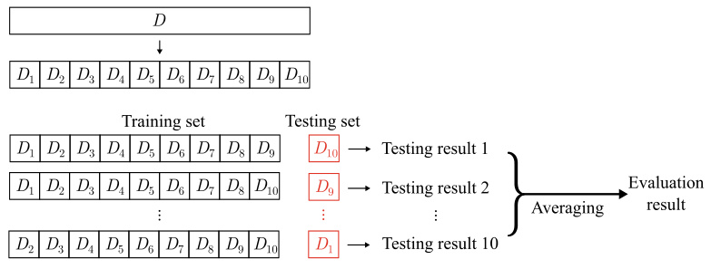  
Fig. 2.2 10-fold cross-validation  

Both ‘‘10-time 10-fold cross-validation’’ and ‘‘100-time hold-out’’ run 100 evaluation experiments.  

See Exercise  2.2 .  

See Sect.  1.4  for the NFL theorem.  

Like hold-out, there are different ways of splitting the data set  $D$   into  $k$   subsets. To decrease the error introduced by split- ting, we often repeat the random splitting  $p$   times and average the evaluation results of  $p$   times of    $k$  -fold cross-validation. For example, a common case is 10-time 10-fold cross-validation.  

For a data set    $D$   with    $m$   samples, a special case of cross- validation is Leave-One-Out (LOO), which lets  $k=m$  . In such a case, the random splitting does not matter since there is only one way of splitting the  m  samples into    $m$   subsets. In LOO, each subset contains a single sample, and the training set is only one sample less than the original data set    $D$  ; thus in most cases, the evaluation from LOO is very close to the ideal evaluation of training the model on    $D$  . Therefore, the results of LOO eval- uations are often considered accurate. However, LOO has a flaw that the computational cost of training  m  models could be prohibitive for large data sets (e.g., 1 million samples imply 1 million models), and it can be even worse if we take parame- ter tuning into consideration. Besides, LOO is not necessarily more accurate than other evaluation methods since the NFL theorem also applies to evaluation methods.  

### 2.2.3  Bootstrapping  

information about the relationship between the complexity of samples and the generalization ability. The original meaning of bootstrap is to remove the strap of boots. The term comes from a story in the eighteenth century book  Baron Munchausen’s Narrative of his Marvellous Travels and Campaigns in Russia , in which Baron Munchausen pulls himself out of a swamp with his straps. Bootstrapping is also called repeatable sampling  or  sampling with replacement .  

$e$   is Euler’s number.  

What we want to evaluate is the model trained with    $D$  . How- ever, no matter we use hold-out or cross-validation, the train- ing set is always smaller than  $D$  . Hence, the estimation bias is unavoidable due to the size difference between the training set and    $D$  . We can reduce the bias by using LOO, but its computa- tional complexity is often prohibitive. However, is it possible to reduce the impact of the small training set while still be com- putational efficient?  

One solution is  bootstrapping , which employs the bootstrap sampling technique (Efron and Tibshirani  1993 ). Given a data set  $D$   containing  $m$   samples, bootstrapping samples a data set  $D^{\prime}$    by randomly picking one sample from    $D$  , copying it to    $D^{\prime}$  , and then placing it back to    $D$   so that it still has a chance to be picked next time. Repeating this process    $m$   times results in the bootstrap sampling data set    $D^{\prime}$    containing    $m$   samples. Due to replacement, some samples in    $D$  may not appear in    $D^{\prime}$  , while others may appear more than once. Let us do a quick estimation: the chance of not being picked in    $m$   rounds is    $(1-$   ${\frac{1}{m}})^{m}$  , and hence taking the limit gives  

$$
\operatorname*{lim}_{m\to\infty}\left(1-{\frac{1}{m}}\right)^{m}={\frac{1}{e}}\approx0.368,
$$  

which means that roughly  $36.8\%$   of the original samples do not appear in the data set  $D^{\prime}$  . Then, we can use  $D^{\prime}$    as the training set and    $D\backslash D^{\prime}$    as the testing set such that both the ev ated model and the actual model that we wish to evaluate on  D  are using  m training examples. Besides, we still have a separate testing set containing about  $1/3$   of the original examples that are not used for training. The evaluation result obtained via this approach is called  out-of-bag estimate .  

Bootstrapping is particularly useful when the data set is small, or when there is no effective way of splitting training and testing sets. Besides, bootstrapping can create multiple data sets, which can be useful for methods such as ensem- ble learning. Nevertheless, since the original data distribution has changed by bootstrapping, the estimation is also biased. Therefore, when we have abundant data, hold-out and cross- validation are often used instead.  

### 2.2.4  Parameter Tuning and Final Model  

Most learning algorithms have parameters to set, and differ- ent parameter settings often lead to models with significantly different performance. Hence, the model evaluation and selec- tion is not just about selecting the learning algorithms but also about the configuration of parameters. The process of finding the right parameters is called  parameter tuning .  

Readers may think there is no essential difference between parameter tuning and algorithm selection: each parameter set- ting leads to one model, and we select the one that produces the best results as the final model. This idea is basically sound; however, there is one issue: since parameters are often real- valued, it is impossible to try all parameter settings. There- fore, in practice, we usually set a range and a step size for each parameter, e.g., a range of  [ 0 ,  0 . 2 ]  and a step size of 0 . 05, which lead to only five candidate parameter settings. Such a trade-off between computational cost and quality of estimation makes the learning feasible, though the selected parameter setting is usually not optimal. In reality, even after making such a trade- off, parameter tuning can still be quite challenging. We can make a simple estimation. Suppose that the algorithm has three parameters and each considers only five candidate values, then we need to assess   $5^{3}\,=\,125$   models for each pair of training and testing sets. Powerful learning algorithms often have quite many parameters to be configured, resulting in a heavy work- load of parameter tuning. The quality of parameter tuning is often vital in real-world applications.  

‘‘ \ ’’ is the subtraction of sets.  

See Chap.  8  for ensemble learning.  

Machine learning typically involves two types of parameters. The first one is the algorithm parameters, also known as  hyper-parameters , which are usually less than 10. The other one is the model parameters, which can be many, e.g., large-scale deep learning models can have more than 10 billion parameters. Both types of parameters are tuned similarly, that is, one generates candidate models and then selects via an evaluation method. The difference is that hyper-parameters are usually configured manually, whereas candidate models are generated by learning, e.g., parameters of neural networks that stop training at different iterations.  

We should note that the training process does not use all data since part of the data is hold-out for model evaluation and selection. Therefore, after we have determined the algorithm and parameters via model selection, the entire data set should be used to re-train a model as the final delivery.  

Last but not least, we should distinguish the data used for model selection from the testing data encountered after model selection. We often call the data set used in the model selection a  validation set . For example, we may split data into a training set for training models, a validation set for model selection and parameter tuning, and a testing set for estimating the general- ization ability of models.  

## 2.3  Performance Measure  

In order to evaluate the generalization ability of models, we need not only practical and effective estimation methods but also some performance measures that can quantify the general- ization ability. Different performance measures reflect the var- ied demands of tasks and produce different evaluation results. In other words, the quality of a model is a relative concept that depends on the algorithm and data as well as the task require- ment.  

In prediction problems, we are given a data set    $D\;\;=$   $\{(\pmb{x}_{1},y_{1}),\,(\pmb{x}_{2},y_{2}),.\,.\,.\,,\,(\pmb{x}_{m},y_{m})\}$  , where    $y_{i}$   is the ground-truth label of the sample  $\pmb{x}_{i}$  . To evaluate the performance of a learner  $f$  , we compare its prediction  $f(x)$   to the ground-truth label    $y$  .  

For regression problems, the most commonly used perfor- mance measure is the Mean Squared Error (MSE):  

$$
E(f;D)={\frac{1}{m}}\sum_{i=1}^{m}(f(x_{i})-y_{i})^{2}.
$$  

More generally, for a data distribution    $\mathcal{D}$   and a probability density function  $p(\cdot)$  , the MSE is written as  

$$
E(f;\mathcal{D})=\int_{x\sim D}(f(x)-y)^{2}p(x)d x.
$$  

The rest of this section will introduce some common per- formance measures for classification problems.  

### 2.3.1  Error Rate and Accuracy  

At the beginning of this chapter, we discussed error rate and accuracy, which are the most commonly used performance measures in classification problems, including both binary clas- sification and multiclass classification. Error rate is the propor- tion of misclassified samples to all samples, whereas accuracy is the proportion of correctly classified samples instead. Given a data set  $D$  , we define error rate as  

$$
E(f;D)={\frac{1}{m}}\sum_{i=1}^{m}\mathbb{I}(f(\pmb{x}_{i})\neq y_{i}),
$$  

and accuracy as  

$$
\begin{array}{l}{\displaystyle\mathrm{acc}(f;D)=\frac{1}{m}\sum_{i=1}^{m}\mathbb{I}(f(\pmb{x}_{i})=y_{i})}\\ {\displaystyle\quad\quad\quad\quad\quad\quad=1-E(f;D).}\end{array}
$$  

More generally, for a data distribution    $\mathcal{D}$   and a probability density function  $p(\cdot)$  , error rate and accuracy can be, respec- tively, written as  

$$
\begin{array}{r l r}{\lefteqn{E(f;\mathcal{D})=\int_{\pmb{x}\sim D}\mathbb{I}(f(\pmb{x})\neq y)p(\pmb{x})d\pmb{x},}}\\ {\mathrm{acc}(f;\mathcal{D})=\int_{\pmb{x}\sim D}\mathbb{I}(f(\pmb{x})=y)p(\pmb{x})d\pmb{x}}\\ &{}&{=1-E(f;\mathcal{D}).}\end{array}
$$  

### 2.3.2  Precision, Recall, and  F 1  

Error rate and accuracy are frequently used, but they are not suitable for all tasks. Taking our watermelon problem as an example, suppose we use a learned model to classify a new batch of watermelons. The error rate tells us the proportion of misclassified watermelons to all watermelons in this batch. However, we may want to know ‘‘What percentage of the picked watermelons are ripe?’’ or ‘‘What percentage of all ripe watermelons were picked out?’’ Unfortunately, the error rate is unable to answer such questions, and hence we need other performance measures.  

Such questions often arise in applications like information retrieval and web search. For example, in information retrieval, we often want to know ‘‘What percentage of the retrieved infor- mation is of interest to users?’’and ‘‘How much of the informa- tion the user is interested in is retrieved?’’ For such questions, precision  and  recall  are better choices.  

In binary classification problems, there are four combina- tions of the ground-truth class and the predicted class, namely true positive, false positive, true negative, and false negative, and we denote the number of samples in each case as    $T P,F P$  ,  $T N$  , and    $F N$  , respectively. Then,    $T P\,+\,F P\,+\,T N\,+\,F N\;=$  total number of samples. The four combinations can be dis- played in a  confusion matrix , as shown in    $^{\circ}$   Table 2.1 . Then, the precision    $P$   and the recall    $R$   are, respectively, defined as  

$$
\begin{array}{l c r}{P=\displaystyle\frac{T P}{T P+F P},}\\ {R=\displaystyle\frac{T P}{T P+F N}.}\end{array}
$$  

.  Tab. 2.1 The confusion matrix of binary classification  

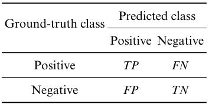  

Precision and recall are contradictory. Generally speaking, the recall is often low when the precision is high, and the pre- cision is often low when the recall is high. For example, to pick more ripe watermelons, we can increase the number of picked watermelons because, in an extreme case, if we pick all watermelons, then all ripe watermelons are picked as well. However, by doing so, the precision would be very low. On the other hand, if we wish the proportion of ripe watermelons to be high, then we should only pick watermelons that we are sure of. However, doing so could miss many ripe watermelons, and hence the recall becomes low. Typically, we can achieve high precision and high recall at the same time only in simple problems.  

Taking information retrieval as an example, the precision and recall can be calculated by sequentially returning each piece of information that the user might be interested in.  

Also called    $P R$   curve  or  PR plot  

Quite often, we can use the learner’s predictions to sort the samples by how likely they are positive. That is, the samples that are most likely to be positive are at the top of the rank- ing list, and the samples that are least likely to be positive are at the bottom. Starting from the top of the ranking list, we can incrementally label the samples as positive to calculate the precision and recall at each increment. Then, plotting the pre- cisions as y-axis and the recalls as x-axis gives the Precision- Recall Curve (P-R curve). The plots of P-R curves are called P-R plots.  .  Figure 2.3  gives an example of P-R curve.  

P-R plots intuitively show the overall precision and recall of learners. When comparing two learners, if the P-R curve of one learner entirely encloses the curve of another learner, then the performance of the first learner is superior. For example, in .  Figure 2.3 , learner A is better than learner C. However, when theP-R curves intersect,such as curve A and curve B,wecannot  

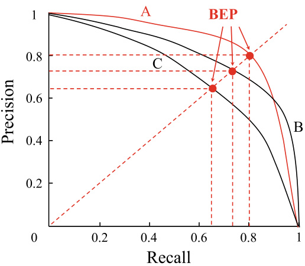  
Fig. 2.3 P-R curve and break-even points  

say which learner is generally better and can only compare them at a specific precision or recall. Nevertheless, people often insist on finding out the best learner even if there exist intersections. A reasonable solution is to compare the areas under the P-R curves, which, to some extent, represent the proportion of cases when both precision and recall are relatively high. However, the areas are not easy to compute, and hence we often seek alternative performance measures that consider precision and recall simultaneously.  

One alternative is Break-Even Point (BEP), which is the value when precision and recall are equal. For example, in .  Figure 2.3 , the BEP of learner   $\mathrm{C}$   is 0 . 64, and learner A is better than learner B, according to the BEP.  

However, BEP could be oversimplified, and a more com- monly used alternative is    $F1$  -measure:  

$$
F1={\frac{2\times P\times R}{P+R}}={\frac{2\times T P}{\mathrm{total~number~of~samples}+T P-T N}}.
$$  

$F1$   is the harmonic mean of precision and recall:  $\textstyle{\overline{{\frac{1}{F1}}}}={\frac{1}{2}}\cdot{\Big(}{\frac{1}{P}}+{\frac{1}{R}}{\Big)}.$    .  

In some applications, the importance of precision and recall are different. For example, precision is more critical in recom- mender systems since it is more desirable that the recommended content is of interest to the user and disturbs the user as little as possible. On the other hand, recall is more critical in crimi- nal information retrieval systems since we wish to miss as few criminals as possible. The general form of    $F1$  -measure is    $F_{\beta}$  , which allows us to specify our preference over precision and recall, and is defined as  

$F_{\beta}$   is the weighted harmonic mean:  $\begin{array}{r}{\frac{1}{F_{\beta}}=\frac{1}{1+\beta^{2}}\cdot\left(\frac{1}{P}+\frac{\beta^{2}}{R}\right)}\end{array}$  .  

The Harmonic mean emphasizes more on smaller values compared to the arithmetic mean    $(\textstyle{\frac{P+R}{2}})$   and the geometric mean    $({\sqrt{P\times R}})$  √  × .  

$$
F_{\beta}=\frac{(1+\beta^{2})\times P\times R}{(\beta^{2}\times P)+R},
$$  

where    $\beta\ >\ 0$   gives the relative importance of recall to pre- cision (V Rijsbergen  1979 ). When    $\beta\,=\,1$  , it reduces to the standard  $F1$  1; when  $\beta>1$  , recall is more important; when  $\beta<1$  , precision is more important.  

Sometimes we may have multiple confusion matrices in binary classification problems. For example, there is one con- fusion matrix for each round of training and testing. Also, there are multiple confusion matrices when we do training and test- ing on multiple data sets to estimate the overall performance. Besides, there is one confusion matrix for every class in multi- class classification problems. In all of these cases, we need to investigate the overall precision and recall on    $n$   binary confu- sion matrices.  

A straightforward approach is to calculate the precision and the recall for each confusion matrix, denoted by    $(P_{1},R_{1})$  ,  $(P_{2},R_{2}),.\,.\,,(P_{n},R_{n})$  . By taking the averages, we have the macro-  $\cdot P$  , the macro-  $R$  , and the macro-  $F1$  :  

$$
\begin{array}{l}{\displaystyle\mathrm{ro-}P=\frac{1}{n}\sum_{i=1}^{n}P_{i},}\\ {\displaystyle\mathrm{ro-}R=\frac{1}{n}\sum_{i=1}^{n}R_{i},}\\ {\displaystyle\mathrm{p-}F\mathrm{1}=\frac{2\times\mathrm{macro-}P\times\mathrm{macro-}R}{\mathrm{macro-}P+\mathrm{macro-}R}.}\end{array}
$$  

We can also calculate element-wise averages across the con- fusion matrices to get    $\overline{{T P}},\overline{{F P}},\overline{{T N}},\overline{{F N}}$  , and then take the aver- ages to obtain the micro-  $P$  , the micro-  $R$  , and the micro-  $.F1$  :  

$$
\begin{array}{r}{\mathrm{micro-}P=\cfrac{\overline{{T P}}}{\overline{{T P}}+\overline{{F P}}},}\\ {\mathrm{micro-}R=\cfrac{\overline{{T P}}}{\overline{{T P}}+\overline{{F N}}},}\end{array}
$$  

### 2.3.3  ROC and AUC  

Since the predictions from learners are often in the form of real values or probabilities, we can compare the predicted values against a classification threshold, that is, classify a sample as positive if the prediction value is greater than the threshold and classify it as negative otherwise. For example, typical neural networks predict real values in the interval  [ 0 . 0 ,  1 . 0 ]  for testing samples. We can compare the predicted values with 0 . 5, and classify a sample as positive if its predicted value is greater than 0 . 5, and negative otherwise. Hence, the predicted real values or probabilities directly determine the generalization ability. In practice, we sort the testing samples by the predicted real values or probabilities in descending order such that potential positive samples are at the top of the list. After that, we put a cut point  in the sorted list and classify the samples above it as positive and the rest as negative.  

The position of the cut point depends on the specific appli- cation. For example, we move the cut point toward the top of the list if precision is more critical than recall, and move it toward the bottom otherwise. Consequently, the ranking qual- ity reflects the learner’s ‘‘expected generalization ability’’ for different tasks or the generalization ability for ‘‘typical cases’’. The Receiver Operating Characteristics (ROC) curve follows the above idea to measure the generalization ability of learners.  

The ROC curve was initially developed for radar detection of enemy aircraft in World War II and then introduced to psy- chology and medical applications in the 1960s− 1970s. Later on, it was introduced to machine learning (Spackman  1989 ). Simi- lar to the P-R curve discussed in Sect.  2.3.2 , we sort the samples by the predictions and then obtain two measures by gradually moving the cut point from the top toward the bottom of the ranked list. Using those two measures as x-axis and y-axis gives the ROC curve. Unlike precision and recall in P-R curves, the y-axis in ROC curves is True Positive Rate (TPR), and the x-axis is False Positive Rate (FPR). Reusing the notations in

  $^{\circ}$   Table 2.1 , these two measures are, respectively, defined as  

$$
\begin{array}{l c r}{\mathrm{TPR}=\cfrac{T P}{T P+F N},}\\ {\mathrm{FPR}=\cfrac{F P}{T N+F P}.}\end{array}
$$  

The plot showing ROC curves is called an ROC plot.

 .  Figure 2.4 a gives an example of an ROC plot in which the diagonal corresponds to the ‘‘random guessing’’ model, and the point    $(0,1)$   corresponds to the ‘‘ideal model’’that places all positive samples before negative samples.  

In practice, we only have finite pairs of  ( FPR ,  TPR )  coor- dinates for drawing the ROC plot since the testing samples are finite. Hence, the ROC curve may not look smooth like the one in  .  Figure 2.4 a but is only an approximation, like the one shown in  .  Figure 2.4 b. The plotting process is as follows: given  $m^{+}$    positive samples and    $m^{-}$  negative samples, we first  

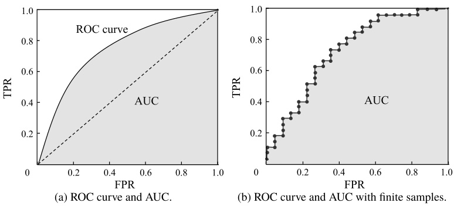  
Fig. 2.4 An illustration of ROC curve and AUC  

sort all samples by the learner’s predictions, and then set the threshold to maximum, that is, predicting all samples as neg- ative. At this moment, both TPR and FPR are 0, so we mark at coordinate    $(0,0)$  . Then, we gradually decrease the threshold to the predicted value of each sample along the sorted list, that is, the samples are classified as positive successively. Let    $(x,y)$  denote the previous coordinate, we put a mark at    $\begin{array}{r}{(x,y+\frac{1}{m^{+}})}\end{array}$  if the current samples are true positive, and we put a mark at  $\textstyle(x+{\frac{1}{m^{-}}},y)$   if the current samples are false positive. By con- necting all adjacent marked points, we have the ROC curve.  

Like P-R plots, we say learner A is better than learner B if A’s ROC curve entirely encloses B’s ROC curve. However, when there exist intersections, no learner is generally better than the other. One way of comparing intersected ROC curves is to calculate the areas under the ROC curves, that is, Area Under ROC Curve (AUC), as shown in  .  Figure 2.4 .  

By its definition, AUC can be calculated by integrating the areas under the steps of ROC curve. Suppose that the ROC curve is obtained by sequentially connecting the points  $\{(x_{1},y_{1}),(x_{2},y_{2}),.\,.\,.\,,(x_{m},y_{m})\}$  , where    $x_{1}\,=\,0$   and    $x_{m}\,=\,1$  . Then, as illustrated in  .  Figure 2.4 b, the AUC is estimated as  

$$
\mathrm{AUC}=\frac{1}{2}\sum_{i=1}^{m-1}(x_{i+1}-x_{i})\cdot(y_{i}+y_{i+1}).
$$  

AUC is closely related to ranking errors since it considers the ranking quality of predictions. Let    $m^{+}$    denote the number of positive samples,  $m^{-}$  denote the number of negative samples,  $D^{+}$    denote the set of positive samples, and    $D^{-}$  denote the set of negative samples. Then, the ranking  loss  is defined as  

$$
\ell_{\mathrm{rank}}={\frac{1}{m^{+}m^{-}}}\sum_{\substack{\mathbf{x}^{+}\in D^{+}\,\mathbf{x}^{-}\in D^{-}}}\left(\mathbb{I}(f(\mathbf{x}^{+})<f(\mathbf{x}^{-}))+{\frac{1}{2}}\mathbb{I}(f(\mathbf{x}^{+})=f(\mathbf{x}^{-}))\right).
$$  

For each pair of positive sample  $x^{+}$    and negative sample  $x^{-}$  ,the ranking loss applies a penalty of 1 if the predicted value of the positive sample is lower than that of the negative sample, and a penalty of 0 . 5 applies when the predicted values are equal. Suppose    $(x,y)$   is the coordinate of a positive sample on the ROCcurve,then  $x$   is the proportion of negative samples ranked above this positive sample (i.e., FPR). Hence, the ranking loss  $\ell_{\mathrm{rank}}$   corresponds to the area above the ROC curve, that is,  

$\mathrm{AUC}=1-\ell_{\mathrm{rank}}.$  (2.22)  

### 2.3.4  Cost-Sensitive Error Rate and Cost Curve  

In some problems, the consequences of making different errors are not the same. Taking medical diagnosis as an example, according to our earlier discussions,we receive the same amount of penalty for misclassifying someone as healthy or unhealthy. However, it turns out that misclassifying a sick patient as healthy is more serious since it risks the life of the patient. Another example is the access control system in which denying the access of normal users leads to unpleasant user experience while allowing intruders to enter causes security breach. In such cases, we need to assign  unequal costs  to different errors.  

For binary classification problems, we can leverage domain knowledge to design a  cost matrix , as shown in  .  Table 2.2 , where   $\mathrm{cos}_{i j}$   represents the cost of misclassifying a sample of class  $i$   as class  $j$  . In general,   $\mathrm{\cos}_{i i}\,=\,0$  , and   $\mathrm{\cos_{01}\,>\,\mathrm{\cos_{10}}}$  if misclassifying class 0 as class 1 costs more than the other way around. The larger the difference between the costs is, the larger the difference between cost 01  and   ${\tt c o s t}_{10}$   will be.  

.  Tab. 2.2 Cost matrix of binary classification  

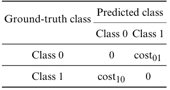  

$\mathrm{cos}_{01}:\mathrm{cos}_{10}=50:10.$  

Almost all performance measures we discussed so far imp li c- itly assumed equal-cost. For example, error rate ( 2.4 ) counts the number of errors without considering the different conse- quences. With unequal costs, however, we no longer minimize the counts but the  total cost . For binary classification prob- lems, we can call class 0 as the positive class and class 1 as the negative class. Let    $D^{+}$    and    $D^{-}$  denote, respectively, the set of positive samples and the set of negative samples. Then, based on  $\circ$   Table 2.2 , the  cost-sensitive  error rate is defined as  

$$
\begin{array}{r}{E(f;D;\mathrm{cost})=\cfrac{1}{m}\bigg(\sum_{\pmb{x}_{i}\in D^{+}}\mathbb{I}(f(\pmb{x}_{i})\neq y_{i})\times\mathrm{cost}_{01}}\\ {+\sum_{\pmb{x}_{i}\in D^{-}}\mathbb{I}(f(\pmb{x}_{i})\neq y_{i})\times\mathrm{cost}_{10}\bigg).}\end{array}
$$  

Similarly, we can also define the distribution-based cost- sensitive error rate and the cost-sensitive version of accuracy. It is also possible to define cost-sensitive performance measures for multiclass cases by allowing    $i$   and  $j$  of   $\mathrm{cos}_{i j}$   to take values other than 0 and 1.  

See Exercise  2.7  

Withunequalcosts,we findthe expectedtotalcostsof learn- ers from  cost curves  rather than ROC curves. The x-axis of cost curves is the probability cost of positive class:  

$$
P(+)\mathrm{{cos}}=\frac{p\times{\mathrm{cos}}_{01}}{p\times{\mathrm{cos}}_{01}+(1-p)\times{\mathrm{cos}}_{10}},
$$  

Normalization  is the process of mapping values from different ranges to a fixed range, e.g., [ 0 ,  1 ] . See Exercise  2.8 .  

where  $p\in[0,1]$   is the probability of a sample being positive. The y-axis is the normalized cost which takes values from  [ 0 ,  1 ] :  

$$
\mathrm{cost}_{\mathrm{norm}}=\frac{\mathrm{FNR}\times p\times\mathrm{cost}_{01}+\mathrm{FPR}\times(1-p)\times\mathrm{cost}_{10}}{p\times\mathrm{cost}_{01}+(1-p)\times\mathrm{cost}_{10}},
$$  

where FPR is the false positive rate defined in ( 2.19 ) and  $\mathrm{FNR}\,=\,1\mathrm{~-~}\mathrm{TPR}$   is the false negative rate. We can draw a cost curve as follows: since every point  ( FPR ,  TPR )  on the ROC curve corresponds to a line segment on the cost plane, we  

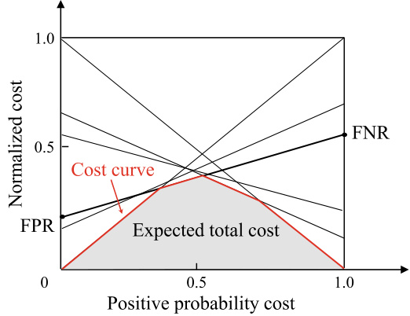  
Fig. 2.5 The cost curve and expected total cost  

can calculate the FNR and draw a line segment from  ( 0 ,  FPR ) to  ( 1 ,  FNR ) . Then, the area under the line segment represents the expected total cost for the given  $p$  , FPR, and TPR. By con- verting all points on the ROC curve to line segments on the cost plane, the expected total cost is given by the area under the lower bound of all line segments, as shown in  .  Figure 2.5 .  

## 2.4  Comparison Test  

It seems straightforward to compare learners using evaluation methods and performance measures. For example, we use an evaluation method to measure the performance of learners and then compare them. However, how should we make the ‘‘comparison’’? Should we check which of the measured values is better? Performance comparisons are indeed far more com- plicated than we thought due to the following reasons. Firstly, we wish to compare the generalization performance of learners, but evaluation methods only measure performance on testing sets, that is, the comparisons may not reflect the actual gener- alization performance. Secondly, testing performance depends on the choice of the testing set, e.g., the results on two different- sized testing sets, or two equal-sized sets but with different samples, could be different. Finally, many machine learning algorithms have some build-in random behavior, which means that we may obtain different results even for the same param- eter settings and testing set. Then, what is the appropriate way of comparing the performance of learners?  

Hypothesis testing  is one of the techniques to compare the performance of learners. Suppose that we observe learner A outperforms learner B on a testing set. Then, hypothesis test- ing can help us check whether the generalization performance of learner A is better than that of learner B in the statistical sense and how significant it is. In the following discussions, we introduce two basic hypothesis tests and several methods to compare learners’ performance. For ease of discussion, the rest of this section assumes error rate, denoted by    $\epsilon$  , to be the default performance measure.  

### 2.4.1  Hypothesis Testing  

In hypothesis testing, a hypothesis is a statement or assumption about the learner’s generalization error rate distribution, e.g.,  ${}^{**}\epsilon=\epsilon_{0}{}^{\**}$  . In practice, however, we only have the testin  error rate  ˆ  but not the generalization error rate    $\epsilon$  . Though  ˆ  and    $\epsilon$  may not be identical, they are, intuitively, likely to be close.  

Hence, we can use the testing error rate distribution to infer the generalization error rate distribution.  

A generalization error rate of    $\epsilon$  means that the learner has a probability of  $\epsilon$   to make an incorrect prediction. A testing error rate of  $\hat{\epsilon}$   means that the learner misclassified  $\hat{\epsilon}\times m$  ×  samples in a testing set of  m  samples. Suppose the testing samples are drawn i . i . d .  from the population distribution. Then, the probability that a learner with a generalization error rate of    $\epsilon$   misclassifies  $m^{\prime}$    samples and correctly classifies the rest is  $\textstyle{\binom{m}{m^{\prime}}}\epsilon^{m^{\prime}}(1\!-\!\epsilon)^{m-m^{\prime}}$  
 . Consequently, for a learner with a generalization error rate of  $\epsilon$  , the probability of misclassifying    $\hat{\epsilon}\times m$  ×  samples which is also the pr bability that the testing error rate being  ˆ  on a testing set of  m  samples, is  

$$
P(\hat{\epsilon};\epsilon)=\binom{m}{\hat{\epsilon}\times m}\epsilon^{\hat{\epsilon}\times m}(1-\epsilon)^{m-\hat{\epsilon}\times m}.
$$  

By solving    $\partial P(\hat{\epsilon};\epsilon)/\partial\epsilon=0$  ;  =  0 with the t rror rate, we observe that    $P(\hat{\epsilon};\epsilon)$  ;  is maximized when  ϵ  = ˆ , and    $P(\hat{\epsilon};\epsilon)$  ; decreases as  $|\epsilon-\hat{\epsilon}|$    increases. The o rvation follows the bino- mial distribution, and, as shown in  .  Figure 2.6 , the learner is most likely to misclassify 3 samples out of 10 samples when

  $\epsilon=0.3$  .  

We can use  binomial test  to verify hypotheses such as   $^{\ast}\epsilon\leqslant

$   $0.3"$  , that is, the generalization error rate is not greater than 0 . 3. More generally, for the hypothesis   ${}^{**}\epsilon\;\leqslant\;\epsilon_{0}{}^{\twoheadrightarrow}$  , ( 2.27 ) gives the maximum observable error rate within a probability of   $1-\alpha$  . The probability is also known as  confidence , corresponding to the non-shaded part of  .  Figure 2.6 .  

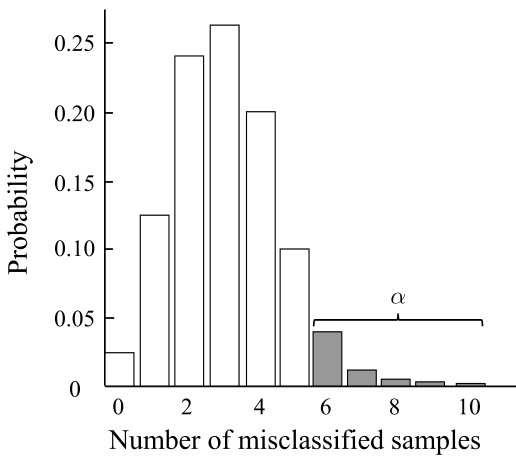  
Fig. 2.6 Binomial distribution   $(m=10,\epsilon=0.3)$  

$$
\bar{\epsilon}=\operatorname*{min}\epsilon~\mathrm{s.t.}~\sum_{i=\epsilon\times m+1}^{m}{\binom{m}{i}}\epsilon_{0}^{i}(1-\epsilon_{0})^{m-i}<\alpha.
$$  

If the testing error rate  $\hat{\epsilon}$   is greater than the critical value  ϵ , then, according to the binomial test, the hypothesis   $^{**}\epsilon\,\leqslant\,\epsilon_{0}^{\,\ast}$  cannot be rejected at the significance level of    $\alpha$  , that is, the learner’s generalization error rate is not greater than    $\epsilon_{0}$   at the confidence level of   $1-\alpha$  ; otherwise, we reject the hypothesis, that is, the learner’s generalization error rate is greater than    $\epsilon_{0}$  at the significance level of    $\alpha$  .  

We often obtain multiple testing error rates from cross- validation or by doing multiple hold-out evaluations. In such cases, we can use    $t$  -test. Let  $\hat{\epsilon}_{1},\hat{\epsilon}_{2},\ldots,\hat{\epsilon}_{k}$   ˆ  ˆ  denote the    $k$   testing error rates, then the average testing error rate    $\mu$   and variance  $\sigma^{2}$    are, respectively,  

‘‘s.t.’’ stands for ‘‘subject to’’, indicating that the expression on the right-hand side must be met while solving the expression on the left-hand side.  

We can compute the critical value with the assistance of qbinom  $(1-\alpha,m,\epsilon_{0})$   in   $\mathbf{R}$   or icdf (’ Binomial ’,  $1-\alpha,m,\epsilon_{0})$   in MATLAB.  

R is an open-source scripting language for statistical  

$\blacktriangleright$   http://www.r-project.org .  

$$
\begin{array}{l}{\displaystyle\mu=\frac{1}{k}\sum_{i=1}^{k}\hat{\epsilon}_{i},}\\ {\displaystyle\sigma^{2}=\frac{1}{k-1}\sum_{i=1}^{k}(\hat{\epsilon}_{i}-\mu)^{2}.}\end{array}
$$  

We can regard these  $k$   testing error rates as    $i.i.d$  .  samples of the generalization error rate    $\epsilon_{0}$  , and hence the variable  

$$
\tau_{t}=\frac{\sqrt{k}(\mu-\epsilon_{0})}{\sigma}
$$  

fo ws a    $t$  -distribution with  $k\!-\!1$   degrees of freedom, as shown in  .  Figure 2.7 .  

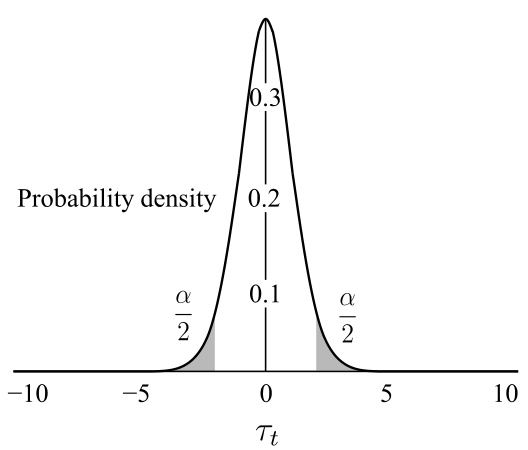  
Fig. 2.7  $t$  -distribution   $(k=10)$  )  

The critical values    $t_{\alpha/2}$   can be co puted by  qt  $(1-\overset{\cdot}{\alpha}/2,k-1)$  in R or  icdf  $\mathrm{f}(^{\prime}\mathrm{T}^{\prime},1-\alpha/2,k-1)$  in MATLAB.  

For the hypothesis ‘  $"\mu=\epsilon_{0}"$  and significance level  $\alpha$  , we can calculate the maximum observable error rate (i.e., the critical value) within a probability of   $1-\alpha$  , where    $\epsilon_{0}$   is the average testing error rate. Here, we employ a two-tailed hypothesis, and there are    $\alpha/2$   shaded areas at both tails of the distribu- tion, as shown in  $^{\circ}$  Figure 2.7 . Let    $(-\infty,t_{-\alpha/2}]$   and    $[t_{\alpha/2},\infty)$  denote the ranges of the two shaded areas, respectively. If    $\tau_{t}$   is within the critical value range    $[t_{-\alpha/2},t_{\alpha/2}]$  , then the hypothesis ‘  ${}^{*}\mu\,=\,\epsilon_{0}{}^{\**}$   cannot be rejected, that   generalization error rate is    $\epsilon_{0}$   at the confidence level of 1  $1-\alpha$   − ; otherwise, we reject the hypothesis, that is, the generalization error rate is signifi- cantly different from    $\epsilon_{0}$   at this confidence level. 0 . 05 and 0 . 1 are commonly used significance levels, and    $^{\circ}$   Table 2.3  shows some commonly used critical values for    $t$  -test.  

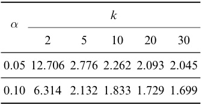  

Both methods introduced above compare the generaliza- tion performance of a single learner. In the following section, we discuss several hypothesis testing methods for comparing the generalization performance of multiple learners.  

### 2.4.2  Cross-Validated  t -Test  

For two learners A and B, let    $\epsilon_{1}^{A},\epsilon_{2}^{A},.\,.\,.\,,\epsilon_{k}^{A}$    and    $\epsilon_{1}^{B},\epsilon_{2}^{B},\ldots,$   $\epsilon_{k}^{B}$    denote their testing error rates obtained from    $k$  -fold cross- validation, where    $i$   indicates the  i th fold. Then, we can use    $k$  - fold cross-validated paired    $t$  -tests to compare the two learners. The basic idea is that if the performance of the two learners is the same, then the testing error rates should be the same on the same training and testing sets, that is,    $\epsilon_{i}^{A}=\epsilon_{i}^{B}$  .  

To be specific, for the  $k$   pairs of testing error rates obtained from the    $k$  -fold cross-validation, we calculate the difference of each pair of results as    $\Delta_{i}\,=\,\epsilon_{i}^{A}\,-\,\epsilon_{i}^{B}$    . Then, the mean of the differences should be zero if the two learners have the same performance. Consequently, based on the differences  $\Delta_{1},\,\Delta_{2},\,.\,.\,,\,\Delta_{k}$     $t$  -test on the hypothesis ‘‘learner A and learner B have the same performance’’. We calculate the mean    $\mu$   and variance    $\sigma^{2}$    of the differences, and if  

$$
\tau_{t}=\left|\frac{\sqrt{k}\mu}{\sigma}\right|
$$  

is less than the critical value    $t_{\alpha/2,k-1}$   at the significance level of  $\alpha$  , then the hypothesis cannot be rejected, that is, there is no significant difference in the learners’ performance; otherwise, these two learners have significantly different performance,and the one with the lower mean error rate is super re,  $t_{\alpha/2,k-1}$  is the critical value of a    $t$  -distribution with  $k-1$   − 1 degrees of freedom and a tail of    $\alpha/2$  .  

The above hypothesis test assumes the testing error rates are  i . i . d .  samples of the generalization error rate. However, due to the finite training data, the training sets of different rounds are often overlapped in evaluation methods such as cross-validation. Therefore, the testing error rates are indeed not independent, resulting in an overestimated probability for the hypothesis to be true. To alleviate the problem, we can use ‘‘  $5\times2$   cross-validation’’ ( ich  1998 ).  

As the name suggests, 5  $5\times2$   ×  2 cross-validation repeats two- fold cross-validation five times, where the data is randomly shuffled before each two-fold cross-validation such that the data splitting is different in the five rounds of cross-validations. For example, for two learners A and B, we obtain their testing error rates of the  i th two-fold cross-validation. Then, we cal- culate the difference between their error rates of the first fold, denoted by    $\Delta_{i}^{1}$  , and the difference between their error rates of the second fold, denoted by  $\Delta_{i}^{2}$  . To alleviate the dependency of testing error rates, we calculate the variance of each two-fold cross-validation as  $\begin{array}{r}{\sigma_{i}^{2}=\left(\Delta_{i}^{1}-\frac{\Delta_{i}^{1}+\Delta_{i}^{2}}{2}\right)^{2}+\left(\Delta_{i}^{2}-\frac{\Delta_{i}^{1}+\Delta_{i}^{2}}{2}\right)^{2}}\end{array}$  ; however, only the mean of the first two-fold cross-validation is calculated as    $\mu=0.5(\Delta_{1}^{1}+\Delta_{1}^{2})$    . The variable  

$$
\tau_{t}=\frac{\mu}{\sqrt{0.2\sum_{i=1}^{5}\sigma_{i}^{2}}}
$$  

follows a    $t$  -distribution with five degrees of freedom, where its two-tailed critical value    $t_{\alpha/2,5}$   is 2 . 5706 when    $\alpha\,=\,0.05$  , and 2 . 0150 when    $\alpha=0.1$  .  

### 2.4.3  McNemar’s Test  

For binary classification problems, the hold-out method esti- mates not only the testing error rates of both learner A and learner B, but also the classification difference of the two learn- ers, that is, the numbers of both correct, both incorrect, and one correct while the other incorrect. These numbers form a contingency table , as shown in  .  Table 2.4 .  

2 .  Tab. 2.4 The contingency table of two learners  

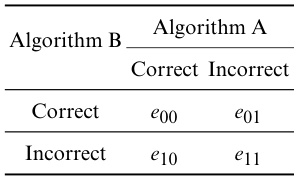  

If the performance of the two learners are the same, then we should have    $e_{01}\,=\,e_{10}$  . The variable    $|e_{01}-e_{10}|$   follows a Gaussian distribution. McNemar’s test considers the variable Since  $e_{01}+e_{10}$   is often small, we need the continuity correction, that is,    $^{-1}$   in the numerator.  

The critical values    $\chi_{\alpha}^{2}$    can be computed by qchisq  $(1-\alpha,k-1)$   in   $\mathbf{R}$   or icdf ( ′ Chisquare ′ ,  $1-\alpha,k-1)$  in MATLAB, where  $k=2$   =  2 is the number of algorithms being compared.  

$$
\tau_{\chi^{2}}=\frac{(|e_{01}-e_{10}|-1)^{2}}{e_{01}+e_{10}},
$$  

which follows a chi-square distribution with one degree of free- dom, that is, the distribution of the sum of squared standard normal random variables. At the significance level of    $\alpha$  , the hypothesis cannot be rejected if the variable is less than the crit- ical value  $\chi_{\alpha}^{2}$  , that is, there is no significant difference between the performance of those two learners; otherwise, the hypoth- esis is rejected, that is, the performance of those two learners is significantly different, and the learner with smaller average error rate is superior. The critical value of    $\chi^{2}$    test with one of freedom is 3 . 8415 when    $\alpha=0.05$   and 2 . 7055 when  $\alpha=0.1$   = 1.  

### 2.4.4  Friedman Test and Nemenyi Post-hoc Test  

Both the cross-validated    $t$  -test and McNemar’s test compare two algorithms on a single data set. However, in some cases, comparisons are made for multiple algorithms on multiple data sets. In such cases, we can compare each pair of algorithms on each data set using a cross-validated    $t\cdot$  -test or a McNemar’s test. Alternatively, we can use the following ranking-based Fried- man test to compare all algorithms on all data sets at once.  

Suppose that we are comparing algorithms A, B, and C on four data sets    $D_{1},D_{2},D_{3}$  , and    $D_{4}$  . We first use either hold-out or cross-validation to obtain each algorithm’s testing result on each data set. Then, we sort the algorithms on each data set by their testing performance and assign the ranks 1 ,  2 , . . . , accord- ingly, where the algorithms with the same testing performance share the averaged rank. For example, as shown in  .  Table 2.5 , on data sets  $D_{1}$   and  $D_{3}$  , A is the best, B is the second, and C is the last; on data set  $D_{2}$  , A is the best, and B and C have the same performance. After collecting all the ranks, we calculate the average rank of each algorithm as the last row of  .  Table 2.5 .  

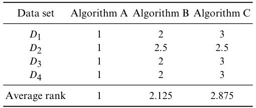  

According to the Friedman test, the algorithms with the same performance should have the same average rank. Let    $k$  denote the number of algorithms,  $N$   denote the number of data sets, and  $r_{i}$   denote the average rank of the  i th algorithm. Here, we ignore the ties to simplify our discussion. Then, the mean and the variance of    $r_{i}$   are    $(k+1)/2$   and    $(k^{2}-1)/12N$  , respec- tively. The variable  

$$
\begin{array}{c}{{\displaystyle{\tau_{\chi^{2}}=\frac{k-1}{k}\cdot\frac{12N}{k^{2}-1}\sum_{i=1}^{k}\left(r_{i}-\frac{k+1}{2}\right)^{2}}}}\\ {{\displaystyle{=\frac{12N}{k(k+1)}\left(\sum_{i=1}^{k}r_{i}^{2}-\frac{k(k+1)^{2}}{4}\right)}}}\end{array}
$$  

ollows a  $\chi^{2}$    distribution with    $k-1$   degrees of freedom when  $k$   and    $N$   are large.  

The ‘‘original Friedman test’’described above is too conser- vative, and hence the following variable is often used instead:  

$$
\tau_{F}=\frac{(N-1)\tau_{\chi}^{2}}{N(k-1)-\tau_{\chi}^{2}},
$$  

The ‘‘original Friedman test’’ requires a large    $k$  (e.g.,  $>30$  ), and tends to return no significant difference when  $k$   is small.  

where  $\tau_{\chi^{2}}$   is given by ( 2.34 ).    $\tau_{F}$   follows a    $F$  -distribution with  $k-1$   and    $(k-1)(N-1)$   degrees of freed .  $^{\circ}$   Table 2.6  shows some commonly used critical values for  F -test.  

The critical values for  $F$  -test can be computed by    ${\mathfrak{q f}}(1-\alpha,k-1$  ,  $(k-1)(N-1))$  )  in R or  icdf (  ${}^{\prime}\mathrm{F}^{\prime}$  ,  $1-\alpha,k-1$  ,   $(k-1)*(N-1))$  ) in MATLAB.  

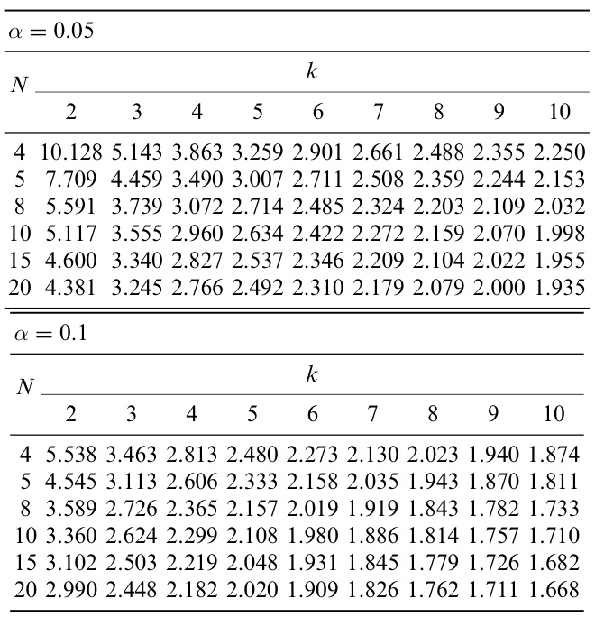  

The performance of algorithms is significantly different if the hypothesis ‘‘algorithms’ performance is the same’’ is rejected. Then, we use a  post-hoc test  to further distinguish the algorithms. A common choice is the Nemenyi post-hoc test, which calculates the critical difference    $C D$   of the average rank difference as  

$$
C D=q_{\alpha}\sqrt{\frac{k(k+1)}{6N}}.
$$  

$q_{\alpha}$   is the critical value of Tukey distribution, which can be computed by  qtukey  $(1-\alpha,k$  , inf )  /  sqrt ( 2 )  in  $\mathbf{R}$  .  

.  Table 2.7  shows some commonly used values of    $q_{\alpha}$   for

  $\alpha~=~0.05$   and    $\alpha~=~0.1$  . If the average rank difference of two algorithms is greater than the critical difference, then the hypothesis ‘‘algorithms’performance is the same’’is rejected at the corresponding confidence level.  

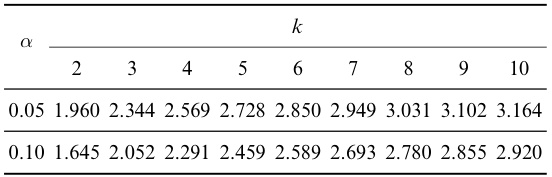  

Taking the data in    $\circ$   Table 2.5  as an example, we first cal- late    $\tau_{F}=24.429$   acc ding to ( 2.34 ) and ( 2.35 ). Then, from  $^{\circ}$   Table 2.6 , we realize  $\tau_{F}$   is greater than the critical value 5 . 143 when    $\alpha\:=\:0.05$  . Hence, the hypothesis ‘‘algorithms’ perfor-  

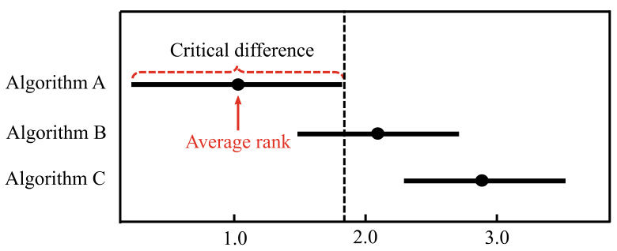  
Fig. 2.8 The plot of the Friedman test  

mance is the same’’ is rejected. We proceed with the Nemenyi oc test. From  .  Table 2.7 , we fin  $q_{0.05}\,=\,2.344$   for  $k=3$   =  3, and hence the critical difference is    $C D=1.657$   = 657 accord- ing to ( 2.36 ). Based on the average ranks in  .  Table 2.5 , neither the difference between algorithms A and B nor the difference between algorithms B and C is greater than the critical differ- ence, that is, there is no significant difference between their performance. However, the test confirms that the performance of algorithms A and C are significantly different since their difference is greater than the critical difference.  

We can use a plot to illustrate the Friedman test, e.g., .  Figure 2.8  illustrates the Friedman test for  .  Table 2.5 , where the y-axis shows the algorithms, and the x-axis shows the average ranks. The dots mark the average ranks of algorithms, and the line segments centered at the dots are the corresponding critical difference.The performance of the two algorithms is not significantly different if their line segments overlap; otherwise, their performance is significantly different. From  .  Figure 2.8 , we can easily observe that there is no significant difference between algorithms A and B since their line segments over- lap. On the other hand, algorithm A is better than algorithm C since their line segments do not overlap while A has a higher rank.  

## 2.5  Bias and Variance  

In addition to estimating the generalization performance of learning algorithms, people often wish to understand ‘‘why’’ learning algorithms have such performance. An essential tool for understanding the generalization performance of algo- rithms is the  bias-variance decomposition , which decomposes the expected generalization error of learning algorithms.  

For different training sets, the learning outcomes are often different, although the training samples are drawn from the same distribution. Let  $\pmb{x}$   be a testing sample,  $y_{D}$   be the label of  $\pmb{x}$   in the data set  $D,y$     $\pmb{x}$  , and  $f(\pmb{x};D)$   be the output of    $\pmb{x}$   predicted by the model  $f$  trained on D . Then, in regression problems, the expected prediction of a learning algorithm is  

$$
\bar{f}(\pmb{x})=\mathbb{E}_{D}\left[f(\pmb{x};D)\right].
$$  

The variance of using different equal-sized training sets is  

$$
\begin{array}{r}{\nu a r(\pmb{x})=\mathbb{E}_{D}\left[\left(f(\pmb{x};D)-\bar{f}(\pmb{x})\right)^{2}\right].}\end{array}
$$  

The noise is  

$$
\begin{array}{r}{\varepsilon^{2}=\mathbb{E}_{D}\left[(y_{D}-y)^{2}\right].}\end{array}
$$  

The difference between the expected output and the ground- truth label is called bias, that is,  

$$
b i a s^{2}(x)=\left(\bar{f}(x)-y\right)^{2}.
$$  

For ease of discussion, we assume the expectation of noise is zero, i.e.,    $\mathbb{E}_{D}[y_{D}\mathrm{~-~}y]\,=\,0$  . By expanding and combining the polynomial, we can decompose the expected generalization error as follows:  

Since the noise does not rely on  $f$   , the last term equals to 0 according to ( 2.37 ).  

The last term equals to 0 since the expectation of noise is   $0$  .  

$$
\begin{array}{r l}&{E(f\cdot D)=\mathbb{E}_{D}\left[\left(f(x,D)-f(x)\right)^{2}\right]}\\ &{\quad=\mathbb{E}_{D}\Bigg[\bigg(f(x,D)-\tilde{f}(x)+\tilde{f}(x)-x p\bigg)^{2}\Bigg]}\\ &{\quad=\mathbb{E}_{D}\Bigg[\bigg(f(x,D)-\tilde{f}(x)\bigg)^{2}\Bigg]+\mathbb{E}_{D}\Bigg[\bigg(\tilde{f}(x)-y p\bigg)^{2}\Bigg]}\\ &{\quad\quad+\mathbb{E}_{D}\Bigg[2\left(f(x,D)-f(x)\right)\left(f(x)-y p\right)\Bigg]}\\ &{\quad=\mathbb{E}_{D}\Bigg[\bigg(f(x,D)-f(x)\bigg)^{2}\Bigg]+\mathbb{E}_{D}\Bigg[\bigg(f(x)-y p\bigg)^{2}\Bigg]}\\ &{\quad=\mathbb{E}_{D}\Bigg[\bigg(f(x,D)-\tilde{f}(x)\bigg)^{2}\Bigg]+\mathbb{E}_{D}\Bigg[\bigg(\tilde{f}(x)-y+x-y p\bigg)^{2}\Bigg]}\\ &{\quad=\mathbb{E}_{D}\Bigg[\bigg(f(x,D)-\tilde{f}(x)\bigg)^{2}\Bigg]+\mathbb{E}_{D}\Bigg[\bigg(\tilde{f}(x)-y\bigg)^{2}\Bigg]}\\ &{\quad\quad+\mathbb{E}_{D}\Bigg[\bigg(f(x,D)-\tilde{f}(x)\bigg)^{2}\Bigg]+2\mathbb{E}_{D}\Bigg[\bigg(f(x)-\tilde{f}(x)\bigg)-y p\Bigg]}\\ &{\quad=\mathbb{E}_{D}\Bigg[\bigg(f(x,D)-f(x)\bigg)^{2}\Bigg]+\bigg(f(x)-y\bigg)^{2}+2\mathbb{E}_{D}\Bigg[\bigg(v p-y)^{2}\Bigg].}\end{array}
$$  

That is,  

$$
E(f;D)=b i a s^{2}({\pmb x})+\nu a r({\pmb x})+\varepsilon^{2},
$$  

which means the generalization error can be decomposed into the sum of bias, variance, and noise.  

Bias ( 2.40 ) measures the difference between the learning algorithm’s expected prediction and the ground-truth label, that is, expressing the fitting ability of the learning algorithm. Variance ( 2.38 ) measures the change of learning performance caused by changes to the equal-sized training set, that is, expressing the impact of data disturbance on the learning out- come. Noise ( 2.39 ) represents the lower bound of the expected generalization error that can be achieved by any learning algo- rithms for the given task, that is, the inherent difficulty of the learning problem. The bias-variance decomposition tells us that the generalization performance is jointly determined by the learning algorithm’s ability, data sufficiency, and the inherent difficulty of the learning problem. In order to achieve excellent generalization performance, a small bias is needed by adequately fitting the data, and the variance should also be kept small by minimizing the impact of data disturbance.  

Generally speaking, bias and variance are conflicted with each other, and this is known as the bias-variance dilemma. .  Figure 2.9  gives an illustrating example. Given a learning problem and a learner, suppose we can control the degree of training. If we limit the degree of training such that the learner is undertrained, its fitting ability is limited, and hence the data disturbances have a limited impact on the learner, that is, bias dominates the generalization error. As the training proceeds, the learner’s fitting ability improves, and hence the learner starts to learn the data disturbances, that is, variance starts to dominate the generalization error. After a large amount of training, the fitting ability of the learner becomes very strong, and hence slight disturbances in the training data will cause sig- nificant changes to the learner. At this point, the learner may start to learn the peculiarities of the training data, and hence overfitting occurs.  

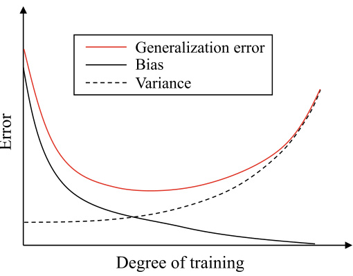  
Fig. 2.9 Relationships between generalization error, bias, and variance  
