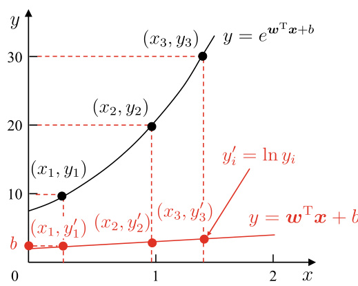
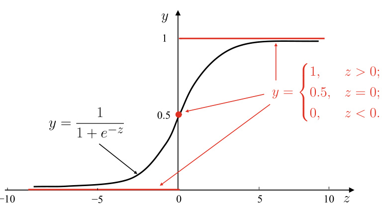
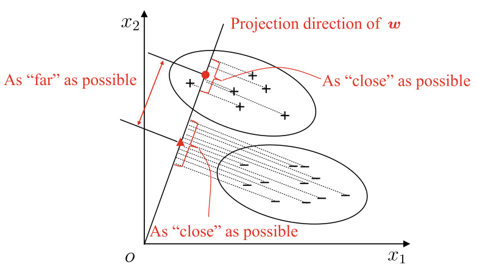
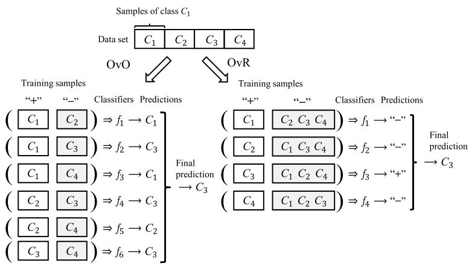
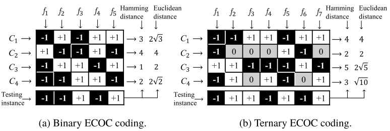

# Linear Models   

## 3.1  Basic Form  

Let  $\pmb{x}=(x_{1};x_{2};.\,.\,;x_{d})$   be a sample described by    $d$  variables, where  $\pmb{x}$   takes the value    $x_{i}$   on the  i th variable. A linear model aims to learn a function that makes predictions by a linear combination of the input variables, that is,  

$$
f({\pmb x})=w_{1}x_{1}+w_{2}x_{2}+\cdot\cdot\cdot+w_{d}x_{d}+b,
$$  

or commonly written in the vector form  

$$
\boldsymbol{f}(\pmb{x})=\pmb{w}^{\top}\pmb{x}+\boldsymbol{b},
$$  

whe    $\pmb{w}=(w_{1};\,w_{2};\,.\,.\,;\,w_{d})$  . The model is determined once    $\pmb{w}$  and  b  are learned.  

Despite its simple form and ease of modeling, the basic lin- ear model covers some important and fundamental ideas of machine learning. In fact, many powerful nonlinear models can be derived from linear models by introducing multi-layer structures or high-dimensional mapping. Besides, the learned weights    $\pmb{w}$   transparently indicate the importance of each input variable, and provide the linear model with excellent compre- hensibility. For example, suppose the linear model learned in is    $f_{\mathrm{prime}}(x)\,=\,0.2\,\cdot\,x_{\sf c o l o r}\,+\,0.5$  ·  $x_{\tt r o o t}+0.3\cdot x_{\tt s o u n d}+1$   +  +  1, which indicates that the ripeness of a watermelon can be determined by considering its  color , root , and  sound  information. From the coefficients, we know that  root  is the most important variable, and  sound  is more important than  color .  

The rest of this chapter introduces some classic linear mod- els, starting with the regression problems followed by binary classification and multiclass classification problems.  

## 3.2  Linear Regression  

Given a data set    $D=\{(\pmb{x}_{1},y_{1}),(\pmb{x}_{2},y_{2}),.\ldots,(\pmb{x}_{m},y_{m})\}$  , where  $x_{i}=(x_{i1};x_{i2};.\,.\,;x_{i d})$   and    $y_{i}\in\mathbb{R}$  . Linear regression aims to learn a linear model that can accurately predict the real-valued output labels.  

We start our discussion with the simplest case of a single input variable. To simplify the notation, we omit the subscript of variables, that is,    $D=\{(x_{i},y_{i})\}_{i=1}^{m}$  , where    $x_{i}\in\mathbb{R}$  . For dis- = crete variables, they can be converted into real-valued variables when an ordinal relationship naturally exists between values. For example, the values  tall  and  short  of  height  can be con- verted into    $\{1.0,0.0\}$  ; the values  high ,  medium  and  low  of altitude  can be converted into  { 1 . 0 ,  0 . 5 ,  0 . 0 } . When no ordi- nal relationship exists, we often convert the discrete variable with  $k$   possible values into a    $k$  -dimensional vector, e.g., for the variable  cucurbits , its values  watermelon ,  pumpkin , and cucumber  can be converted into    $(0,0,1),(0,1,0)$  , and    $(1,0,0)$  , respectively.  

Linear regression aims to learn the function  

$$
f(x)=w x+b,\ {\mathrm{such~that}}\ f(x_{i})\simeq y_{i},i=1,.\,.\,.\,,m.
$$  

To determine    $w$   and    $b$  , the key is to measure the difference between  $f(x)$   and  $y$  . For this purpose, the MSE ( 2.2 ) introduced in Sect.  2.3  is one of the most commonly used metrics. We can minimize MSE, that is,  

$$
\begin{array}{l}{{(w^{*},b^{*})=\displaystyle\arg\operatorname*{min}_{(w,b)}\sum_{i=1}^{m}\left(f(x_{i})-y_{i}\right)^{2}}}\\ {{\displaystyle\quad\quad\quad=\arg\operatorname*{min}_{(w,b)}\sum_{i=1}^{m}\left(y_{i}-w x_{i}-b\right)^{2}.}}\end{array}
$$  

MSE corresponds to the Euclidean distance and has an in tu- itive geometrical interpretation. A general method to minimize MSE is the  least squares method . For linear regression, the least squares method attempts to find a straight line such that the total Euclidean distance from all samples to the line is mini- mized.  

rching for    $w$   and  $b$   that minimize    $E_{(w,b)}=$   ${\textstyle\sum_{i=1}^{m}}(y_{i}-w x_{i}-b)^{2}$   =  −  −  is called  least squares parameter estima-  of linear regression. To be specific, we can calculate the derivatives of    $E_{(w,b)}$   with respect to    $w$   and    $b$  , respectively:  

$$
\begin{array}{r l}&{\frac{\partial E_{(w,b)}}{\partial w}=2\left(w\displaystyle\sum_{i=1}^{m}x_{i}^{2}-\displaystyle\sum_{i=1}^{m}(y_{i}-b)x_{i}\right),}\\ &{\frac{\partial E_{(w,b)}}{\partial b}=2\left(m b-\displaystyle\sum_{i=1}^{m}(y_{i}-w x_{i})\right).}\end{array}
$$  

By setting ( 3.5 ) and ( 3.6 ) equal to 0, we have the closed-form solutions of    $w$   and  $b$  :  

$$
\begin{array}{c}{{w=\displaystyle\frac{\sum_{i=1}^{m}y_{i}(x_{i}-\bar{x})}{\sum_{i=1}^{m}x_{i}^{2}-\frac{1}{m}\left(\sum_{i=1}^{m}x_{i}\right)^{2}},}}\\ {{b=\displaystyle\frac{1}{m}\sum_{i=1}^{m}(y_{i}-w x_{i}),}}\end{array}
$$  

where  ¯  $\textstyle{\bar{x}}={\frac{1}{m}}\sum_{i=1}^{m}x_{i}$   is the arithmetic mean of    $x$  . =  

We should avoid converting categorical variables into continuous variables; otherwise, the incorrectly introduced ordinal relationships can mislead subsequent calculations such as distance calculations. See Sect.  9.3 .  

Also known as  square loss .  

$w^{*}$  and    $b^{*}$  denote the solutions to    $w$   and    $b$  , respectively.  

The least squares method has a wide range of applications other than linear regression.  

Here,  $E_{(w,b)}$   is a convex function of  $w$   and    $b$  . The optimal solutions of    $w$  and    $b$   are obtained when the derivatives of  $E_{(w,b)}$   with respect to both    $w$  and    $b$   are zero. A function  $f$  is said to be a convex function on the interval

  $[a,b]$   if there is

  $\begin{array}{r}{\bar{f}(\frac{x_{1}+x_{2}}{2})\leqslant\frac{f(x_{1})+f(x_{2})}{2}}\end{array}$  for any  $x_{1}$   and    $x_{2}$   on the interval. Functions with a U-shaped curve are usually convex functions, e.g.,  $\dot{f}(x)=x^{2}$  . We can determine the convexity of a function defined over the real numbers by its second derivative: the function is convex on an interval if its second derivative is non-negative on the interval; the function is strictly convex on an interval if its second derivative is greater than 0 at all points on the interval.  

More generally, samples are described by    $d$   attributes, like the data set    $D$   at the beginning of this section. In such cases, the model becomes  

$$
\begin{array}{r}{f(\pmb{x})=\pmb{w}^{\top}\pmb{x}+b,\mathrm{~such~that~}f(\pmb{x}_{i})\simeq y_{i},i=1,.\,.\,.\,,m,}\end{array}
$$  

which is known as  multivariate linear regression .  

Similarly, the parameters    $\pmb{w}$   and    $b$   can be estimated using the least squares method. For ease of discussion, we rewrite    $\pmb{w}$  and  $b$   as  $\hat{\pmb{w}}=(\pmb{w};b)$   = ; . Accor ngly, the data set    $D$  is represented as an  $m$   by    $(d+1)$   matri  $\mathbf{X}$  , where each row corresponds  one sample with the first  d  elements to be the values of the  d variables and the last element always to be 1, that is,  

$$
\mathbf{X}=\left(\begin{array}{c}{x_{11}\ x_{12}\ \dots\ x_{1d}\ 1}\\ {x_{21}\ x_{22}\ \dots\ x_{2d}\ 1}\\ {\vdots\ \vdots\ \ddots\ \vdots\ \vdots}\\ {x_{m1}\ x_{m2}\ \dots\ x_{m d}\ 1}\end{array}\right)=\left(\begin{array}{c}{x_{1}^{\top}\ 1}\\ {x_{2}^{\top}\ 1}\\ {\vdots\ \vdots}\\ {x_{m}^{\top}\ 1}\end{array}\right).
$$  

Vectorizing the labels to  $y=(y_{1};y_{2};.\,.\,.\,;y_{m})$  , then, similar to ( 3.4 ), we have  

$$
\hat{\pmb{\mathscr{w}}}^{*}=\operatorname*{arg\,min}_{\hat{\pmb{\mathscr{w}}}}(y-\mathbf{X}\hat{\pmb{\mathscr{w}}})^{\top}(y-\mathbf{X}\hat{\pmb{\mathscr{w}}}).
$$  

Letting  $E_{\hat{\pmb{w}}}=(\mathbf{y}\!-\!\mathbf{X}\hat{\pmb{w}})^{\top}(\mathbf{y}\!-\!\mathbf{X}\hat{\pmb{w}})$    −  ˆ −  ˆ  and finding the derivative with respect to  ˆ , we have  

$$
\frac{\partial E_{\hat{\pmb{w}}}}{\partial\hat{\pmb{\hat{w}}}}=2\mathbf{X}^{\top}(\mathbf{X}\hat{\pmb{w}}-\pmb{y}).
$$  

Theclosed-formsolutionof  $\hat{\pmb{w}}$   can be obtained by making( 3.10 ) equal to 0. However, due to the matrix inverse operation, the calculation is more complicated than that of the single variable case. We provide a brief discussion as follows.  

When    $\mathbf{X}^{\top}\mathbf{X}$   is a full-rank matrix or a positive definite matrix, letting ( 3.10 ) equal to 0 gives  

$$
\hat{\pmb{w}}^{*}=(\mathbf{X}^{\top}\mathbf{X})^{-1}\mathbf{X}^{\top}\pmb{y},
$$  

where    $(\mathbf{X}^{\top}\mathbf{X})^{-1}$    is the inverse of    $\mathbf{X}^{\top}\mathbf{X}$  . Letting    $\hat{\pmb{x}}_{i}=(\pmb{x}_{i};1)$   = ; , the learned multivariate linear regression model is  

$$
f({\hat{\mathbf{x}}}_{i})={\hat{\mathbf{x}}}_{i}^{\top}(\mathbf{X}^{\top}\mathbf{X})^{-1}\mathbf{X}^{\top}\mathbf{y}.
$$  

For example, genetic circuit data in bioinformatics are often with thousands or even more attributes but only hundreds of samples.  

Nevertheless,  $\mathbf{X}^{\top}\mathbf{X}$   is often not full-rank in real-world appli- cations.Inpractice,the number of variables can be large or even larger than the number of samples, that is, more columns than rows in  X . In such cases,  $\mathbf{X}^{\top}\mathbf{X}$   is not full-rank, which means that there is more than one  $\hat{\pmb{w}}$   that can minimize the MSE. Then, the choice of  $\hat{\pmb{w}}$   is a matter of the inductive bias of the learn- ing algorithm, e.g., some algorithms introduce a regularization term.  

Linear models are simple but diverse. Taking    $(x,y)$  ,    $y\in\mathbb R$  as an example, by approximating the ground-truth label  $y$  with a linear model, we obtain the linear regression model, which can be compactly written as  

See Sect.  1.4  for inductive bias. See Sects.  6.4  and  11.4  for regularization.  

$$
\b{y}=\pmb{w}^{\top}\pmb{x}+\b{b}.
$$  

Is it possible to let the predicted value approximate a vari- able derived from    $y?$   For instance, suppose the output label changes on the exponential scale, then the logarithm of the output label can be used for approximation, that is,  

$$
\ln y={\pmb w}^{\top}{\pmb x}+b.
$$  

This is called  log-linear regression  which approximates  $y$   with  $e^{\pmb{w}^{\top}\pmb{x}+b}$  . Though ( 3.14 ) is still in the form of linear regression, it is indeed searching for a nonlinear mapping from the input space to the output space, as shown in  .  Figure 3.1 . The loga- rithm function links the predictions of linear regression to the ground-truth labels.  

More generally, for a monotonic differentiable function  $g(\cdot)$  ,  

$$
y=g^{-1}(\pmb{w}^{\top}\pmb{x}+b)
$$  

is called  generalized linear model , where the function    $g(\cdot)$   is the link function. We see that log-linear regression is a special case of generalized linear models when    $g(\cdot)=\ln(\cdot)$  .  

$g(\cdot)$   is continuous and smooth.  

Parameter estimation of generalized linear models is usually performed through weighted least squares or maximum likelihood methods.  

  
Fig. 3.1 Log-linear regression  

## 3.3  Logistic Regression  

The previous section discussed the use of linear models in regression problems, but how can we solve classification prob- lems? The answer lies in the generalized linear model ( 3.15 ): we just need to find a monotonic differentiable function    $g(\cdot)$   that links the predictions of linear regression to the ground-truth labels of the classification problem.  

For binary classification with output label    $y\,\in\,\{0,1\}$  , the ed predictions of the linear regression model    $z=$   $\pmb{w}^{\top}\pmb{x}+b$   +  need to be converted into   $0/1$  . Ideally, the unit-step function is desired:  

Also called Heaviside function.  

$$
y=\left\{\begin{array}{l l}{0,}&{z<0;}\\ {0.5,}&{z=0;}\\ {1,}&{z>0,}\end{array}\right.
$$  

which predicts positive for    $z$   greater than 0, negative for    $z$  smaller than 0, and an arbitrary output when    $z$   equals to 0. The unit-step function is plotted in  $\circ$  Figure 3.2 .  

Nevertheless,    $\circ$   Figure 3.2  shows that the unit-step func- tion is not continuous, and hence it cannot be used as    $\bar{g^{-1}}(\cdot)$   in ( 3.15 ). Therefore, we need to find a monotonic differentiable surrogate function to approximate the unit-step function, and a common choice is the logistic function:  

$$
y=\frac{1}{1+e^{-z}}.
$$  

From  $^{\circ}$   Figure 3.2 , we can see that the logistic function is a type of sigmoid function which converts    $z$   to  $y$   that is either close to 0 or 1, and the output value has a steep change near  $z=0$  . Substituting    $g^{-1}(\cdot)$   into ( 3.15 ), we have  

  
Fig. 3.2 Unit-step function and logistic function  

$$
y=\frac{1}{1+e^{-(\pmb{w}^{\top}\pmb{x}+b)}}.
$$  

Similar to ( 3.14 ), ( 3.18 ) can be transformed into  

$$
\ln{\frac{y}{1-y}}={\pmb w}^{\top}{\pmb x}+b.
$$  

Let  $y$   be the likelihood of    $x$   being a positive sample and   $1-y$  be the likelihood of being a negative sample, then the ratio  

$$
\frac{y}{1-y}
$$  

is called the  odds , indicating the relative likelihood of    $\pmb{x}$   being a positive sample. Taking the logarithm of odds gives the  log odds  (i.e.,  logit )  

$$
\ln{\frac{y}{1-y}}.
$$  

It turns out that ( 3.18 ) is using linear regression predictions to approximate the log odds of true labels. As such, the corre- sponding model is called  logistic regression , also known as  logit regression . It should be noted that logistic regression is indeed a classification model despite the term ‘‘regression’’ in its name. Logistic regression has several nice properties. For example, it directly models the label probability without requiring any prior assumptions on the data distribution and hence avoids issues such as inappropriate hypothetical data distributions. Also, it predicts labels together with associated probabilities, which is essential for tasks that use probability to aid decision- making. Finally, the objective function of logistic regression, as we will see later on, is a convex function having derivatives of all orders with many useful mathematical properties, and con- vexity makes it solvable with numerical optimization methods.  

Now we turn our attention to the estimation of    $\pmb{w}$   and  $b$   in ( 3.18 ). If we consider    $y$   in ( 3.18 ) as the posterior probability  $p(y=1\mid x)$  , then ( 3.19 ) can be rewritten as  

$$
\ln{\frac{p(y=1\mid x)}{p(y=0\mid x)}}={\pmb w}^{\top}{\pmb x}+b,
$$  

and consequently,  

$$
\begin{array}{l}{p(y=1\mid x)=\displaystyle\frac{e^{\pmb{w}^{\top}\pmb{x}+b}}{1+e^{\pmb{w}^{\top}\pmb{x}+b}},}\\ {p(y=0\mid\pmb{x})=\displaystyle\frac{1}{1+e^{\pmb{w}^{\top}\pmb{x}+b}}.}\end{array}
$$  

See Sect.  7.2  for the maximum likelihood method.  

To maximize the posterior probability, we can apply the maximum likelihood method to estimate    $\pmb{w}$   and    $b$  . Given a data set    $\{(\pmb{x}_{i},y_{i})\}_{i=1}^{m}$  , the log-likelihood to be maximized is  

$$
\ell(\pmb{w},b)=\sum_{i=1}^{m}\ln p(y_{i}\mid\pmb{x}_{i};\pmb{w},b),
$$  

i.e., maximizing the probability of each sample being predicted as the ground-truth label. For ease of discussion, we rewrite  $\pmb{w}^{\top}\pmb{x}+\bar{b}$   as    $\beta^{\top}{\hat{x}}$  , where    $\beta\,=\,({\pmb w};\,b)$   and    $\hat{\pmb{x}}\ =\ ({\pmb{x}};1)$   = ; . Also, letting  $p_{1}(\hat{\pmb{x}};\beta)=p(y=1\mid\hat{\pmb{x}};\beta)$  ;  =  =  | ˆ ;  and  $p_{0}(\hat{\pmb x};\beta)=p(y=0\mid$  ;  =  =  |  $\hat{\pmb{x}};\beta)=1-p_{1}(\hat{\pmb{x}};\beta)$  ;  =  − ˆ ; , then the likelihood term in ( 3.25 ) can be rewritten as  

$$
p(y_{i}\mid\pmb{x}_{i};\pmb{w},b)=y_{i}p_{1}(\hat{\pmb{x}}_{i};\beta)+(1-y_{i})p_{0}(\hat{\pmb{x}}_{i};\beta).
$$  

Substituting ( 3.26 ) into ( 3.25 ), then, from ( 3.23 ) and ( 3.24 ), we know that maximizing ( 3.25 ) is equivalent to minimizing  

Considering  $y_{i}\in\{0,1\}$  .  

See Appendix  B.4  for the gradient descent method.  

$$
\ell(\beta)=\sum_{i=1}^{m}\left(-y_{i}\beta^{\top}{\hat{\mathbf{x}}}_{i}+\ln\left(1+e^{\beta^{\top}{\hat{\mathbf{x}}}_{i}}\right)\right).
$$  

Because ( 3.27 ) is a higher order differentiable convex func- tion with respect to    $\beta$  , the solutions, according to the convex optimization theory (Boyd and Vandenberghe  2004 ), can be found via classic numerical optimization methods such as the gradient descent method or even Newton’s method. Hence, we have  

$$
\beta^{*}=\operatorname*{arg\,min}_{\beta}\ell(\beta).
$$  

Taking Newton’s method as an example, the update rule at the    $(t+1)$  th iteration is  

$$
\beta^{t+1}=\beta^{t}-\left(\frac{\partial^{2}\ell\left(\beta\right)}{\partial\beta\partial\beta^{\top}}\right)^{-1}\frac{\partial\ell\left(\beta\right)}{\partial\beta},
$$  

where the first- and second-order derivatives with respect to    $\beta$  are, respectively,  

$$
\begin{array}{r l}&{\frac{\partial\ell\left(\beta\right)}{\partial\beta}=-\displaystyle\sum_{i=1}^{m}\hat{\pmb{x}}_{i}\left(y_{i}-p_{1}\left(\hat{\pmb{x}}_{i};\beta\right)\right),}\\ &{\frac{\partial^{2}\ell\left(\beta\right)}{\partial\beta\partial\beta^{\top}}=\displaystyle\sum_{i=1}^{m}\hat{\pmb{x}}_{i}\hat{\pmb{x}}_{i}^{\top}p_{1}\left(\hat{\pmb{x}}_{i};\beta\right)\left(1-p_{1}\left(\hat{\pmb{x}}_{i};\beta\right)\right).}\end{array}
$$  

  
Fig. 3.3 A two-dimensional illustration of LDA. ‘‘  $+'$  ’and ‘‘ − ’’denote positive samples and negative samples, respectively. The ellipses are the boundaries of clusters; the dashed lines represent projections; the solid red dot and triangle are the centers of the projections  

## 3.4  Linear Discriminant Analysis  

Linear Discriminant Analysis (LDA) is a classic linear method, also known as Fisher’s Linear Discriminant (FLD) since it was initially proposed by Fisher ( 1936 ) for binary classifica- tion problems.  

The idea of LDA is straightforward: projecting the training samples onto a line such that samples of the same class are close to each other, while samples of different classes are far away from each other. When classifying new samples, they are projected onto the same line and their classes are determined by their projected locations.  .  Figure 3.3  gives a two-dimensional illustration.  

Strictly speaking, LDA and FLD are slightly different, where LDA assumes equal and full-rank class covariances.  

Given a data set    $D=\{(\pmb{x}_{i},y_{i})\}_{i=1}^{m}$  ,    $y_{i}\,\in\,\{0,1\}$  , let    $X_{i},\,\pmb{\mu}_{i}$  , = and    $\pmb{\Sigma}_{i}$   denote, respectively, the sample set, mean vector, and covariance matrix of the  i th class   $(i\in\{0,1\})$  ). After projecting data onto the line    $\pmb{w}$  , the centers of those two classes samples are    $\pmb{w}^{\top}\pmb{\mu_{0}}$   and    $\pmb{w}^{\top}\pmb{\mu}_{1}$  , respectively. The covariances of the two classes samples are    $\pmb{w}^{\top}\pmb{\Sigma}_{0}\pmb{w}$   and    $\pmb{w}^{\top}\pmb{\Sigma}_{1}\pmb{w}$  , respectively. Since the line is a one-dimensional space,  $\pmb{w}^{\top}\mu_{0},\pmb{w}^{\top}\bar{\mu_{1}},\pmb{w}^{\top}\bar{\Sigma_{0}}\pmb{w}$  , and  $\pmb{w}^{\top}\pmb{\Sigma}_{1}\pmb{w}$   are all real numbers.  

To make the projection points of similar samples as close as possible, we can make the covariance of the projection points of similar samples as small as possible, that is, minimizing  $\pmb{w}^{\top}\pmb{\Sigma}_{0}\pmb{w}+\pmb{w}^{\top}\bar{\pmb{\Sigma}}_{1}\pmb{w}$  . To make the projection points of exam- ples from different classes as far away as possible, we can make the distance between the class centers as large as possible, that is, maximizing    $\|\pmb{w}^{\top}\pmb{\mu}_{0}-\pmb{w}^{\top}\pmb{\mu}_{1}\|$  . Putting them together, we have the objective to be maximized:  

$$
\begin{array}{l}{J=\displaystyle\frac{\big\|\pmb{w}^{\top}\mu_{0}-\pmb{w}^{\top}\mu_{1}\big\|_{2}^{2}}{\pmb{w}^{\top}\Sigma_{0}\pmb{w}+\pmb{w}^{\top}\Sigma_{1}\pmb{w}}}\\ {\quad=\displaystyle\frac{\pmb{w}^{\top}(\mu_{0}-\mu_{1})(\mu_{0}-\mu_{1})^{\top}\pmb{w}}{\pmb{w}^{\top}(\Sigma_{0}+\Sigma_{1})\pmb{w}}.}\end{array}
$$  

By defining the  within-class scatter matrix  

$$
\begin{array}{l}{{\displaystyle{\bf S}_{w}={\pmb\Sigma}_{0}+{\pmb\Sigma}_{1}}}\\ {{\displaystyle\quad=\sum_{x\in X_{0}}({\pmb x}-{\pmb\mu}_{0})({\pmb x}-{\pmb\mu}_{0})^{\top}+\sum_{x\in X_{1}}({\pmb x}-{\pmb\mu}_{1})({\pmb x}-{\pmb\mu}_{1})^{\top}}}\end{array}
$$  

and the  between-class scatter matrix  

$$
\mathbf{S}_{b}=(\pmb{\mu}_{0}-\pmb{\mu}_{1})(\pmb{\mu}_{0}-\pmb{\mu}_{1})^{\top},
$$  

we can rewrite ( 3.32 ) as  

$$
\boldsymbol{J}=\frac{\pmb{w^{\intercal}}\mathbf{S}_{b}\pmb{w}}{\pmb{w^{\intercal}}\mathbf{S}_{w}\pmb{w}},
$$  

which is the objective of LDA to be maximized, that is, the generalized Rayleigh quotient  of  $\mathbf{S}_{b}$   and  ${\bf S}_{w}$  .  

If  $\pmb{w}$   is a solution, then  $\alpha{\pmb w}$   is also a solution of ( 3.35 ) for any constant  $\alpha$  .  

See Appendix  B.1  for the method of the Lagrange multipliers.  

$(\pmb{\mu}_{0}-\pmb{\mu}_{1})^{\top}\pmb{w}$   is a scalar.  

Then, how can we determine    $\pmb{w?}$   Since the numerator and denominator in ( 3.35 ) are both quadratic terms of    $\pmb{w}$  , the solution of ( 3.35 ) is independent of the magnitude of    $\pmb{w}$   but only about its direction. Without loss of generality, letting  $\pmb{w}^{\top}\mathbf{S}_{w}\pmb{w}=1$  , then maximizing ( 3.35 ) is equivalent to  

$$
\begin{array}{r l}&{\underset{\pmb{w}}{\operatorname*{min}}\ \ -\pmb{w}^{\top}\mathbf{S}_{b}\pmb{w}}\\ &{\mathrm{s.t.}\ \pmb{w}^{\top}\mathbf{S}_{w}\pmb{w}=1.}\end{array}
$$  

Using the method of the Lagrange multipliers, which helps find the extremum of a function subject to equality constraints, the above equation is equivalent to  

$$
\mathbf{S}_{b}\pmb{w}=\lambda\mathbf{S}_{w}\pmb{w},
$$  

where    $\lambda$   is the Lagrange multiplier. Since the direction of    ${\bf S}_{b}\pmb{w}$  is always    $\pmb{\mu}_{0}-\pmb{\mu}_{1}$  , we can let  

$$
\mathbf{S}_{b}\pmb{w}=\lambda(\pmb{\mu}_{0}-\pmb{\mu}_{1}),
$$  

and substitute it into ( 3.37 ), which gives  

$$
\pmb{w}=\mathbf{S}_{w}^{-1}(\pmb{\mu}_{0}-\pmb{\mu}_{1}).
$$  

In order to achieve the stability of numerical solutions, singular value decomposition is often applied to    ${\bf S}_{w}$   in practice, that is,  $\begin{array}{r}{\mathbf{S}_{w}=\mathbf{U}\pmb{\Sigma}\mathbf{V}^{\top}}\end{array}$  , where  $\pmb{\Sigma}$   is a real diag al matrix and its diag elements are the singular values of  ${\bf S}_{w}$  . Then, we calculate  ${\bf S}_{w}^{-1}$  as  $\mathbf{S}_{w}^{-1}=\mathbf{V}\pmb{\Sigma}^{-1}\mathbf{U}^{\top}$  .  

See Appendix  A.3  for singular value decomposition.  

It is worth mentioning that LDA can also be explained from the aspect of Bayesian decision theory,and it can be proved that we have the optimal solution of LDA when both classes follow Gaussian distribution with the same prior and covariance.  

We can extend LDA to multiclass classification problems. Suppose that there are    $N$   classes and the  i th class has  $m_{i}$   sam- ples. First, we define the  global scatter matrix  

See Exercise  7.5 .  

$$
\begin{array}{l}{{\displaystyle{\bf S}_{t}={\bf S}_{b}+{\bf S}_{w}}}\\ {{\displaystyle~~=\sum_{i=1}^{m}({\bf x}_{i}-\mu)({\bf x}_{i}-\mu)^{\top}},}\end{array}
$$  

where    $\pmb{\mu}$   is the mean vector of all samples. We redefine the within-class scatter matrix  ${\bf S}_{w}$   as the sum of scatter matrices of each class, that is,  

$$
{\bf S}_{w}=\sum_{i=1}^{N}{\bf S}_{w_{i}},
$$  

where  

$$
\mathbf{S}_{w_{i}}=\sum_{x\in X_{i}}({\pmb x}-{\pmb\mu_{i}})({\pmb x}-{\pmb\mu_{i}})^{\top}.
$$  

From ( 3.40 ) to ( 3.42 ), we have  

$$
\begin{array}{l}{{\displaystyle{\bf S}_{b}={\bf S}_{t}-{\bf S}_{w}}}\\ {{\displaystyle~~~~~~~~~=\sum_{i=1}^{N}m_{i}(\pmb{\mu}_{i}-\pmb{\mu})(\pmb{\mu}_{i}-\pmb{\mu})^{\top}}.}\end{array}
$$  

Multiclass LDA can be implemented in different ways by choosing any two from  $\mathbf{S}_{b}$  ,  ${\bf S}_{w}$  , and    $\mathbf{S}_{t}$  . A common implemen- tation is to optimize the objective  

$$
\operatorname*{max}_{\mathbf{W}}\;\;\frac{\mathrm{tr}(\mathbf{W}^{\top}\mathbf{S}_{b}\mathbf{W})}{\mathrm{tr}(\mathbf{W}^{\top}\mathbf{S}_{w}\mathbf{W})},
$$  

where    $\mathbf{W}\in\mathbf{R}^{d\times(N-1)}$  , and  $\mathrm{tr}(\cdot)$   is the trace of matrix. Equation ( 3.44 ) can be solved as a generalized eigenvalue problem:  

$$
\mathbf{S}_{b}\mathbf{W}=\lambda\mathbf{S}_{w}\mathbf{W}.
$$  

Concatenating the eigenvectors corresponding to the    $d^{\prime}$  largest non-zero eigenvalues of  $\mathbf{S}_{w}^{-1}\mathbf{S}_{b}$    leads to the closed-form solu- tion of  W , where    $d^{\prime}\leqslant N-1$  .  

There are at most  $N-1$  non-zero eigenvalues.  

See Chap.  10  for dimensionality reduction.  

If we consider  W  as a projection matrix, then multiclass LDA projects samples onto an    $d^{\prime}$  -dimensional space, where    $d^{\prime}$  is often much smaller than the number of original features    $d$  . Since the projection reduces the data dimension while consid- ering the class information, LDA is also considered as a classic supervised dimensionality reduction technique.  

## 3.5  Multiclass Classification  

For example, the extension of LDA discussed in the previous section.  

Classification learners are often called  classifiers .  

See Chap.  8  for the ensemble of multiple classifiers.  

OvR is also known as One versus All (OvA), but calling it OvA is not very accurate since we should not consider ‘‘all classes’’ as the negative class.  

We can also ensemble the classifiers based on information such as their confidence of predictions. See Sect.  8.4 .  

In practice, we often encounter multiclass classification prob- lems.Some binary classification methods can be directly extended to accommodate multiclass cases. However, a more general approach is to apply some strategies to solve multiclass classi- fication problems with any existing binary classification meth- ods.  

Without loss of generality, given  $N$   classes    $C_{1}$  ,    $C_{2},\ldots,C_{N}$  , the basic idea of multiclass learning is decomposition, that is, dividing the multiclass classification problem into several binary classification problems. We begin by decomposing the problem, and then train a binary classifier for each divided binary classification problem. In the testing phase, we ensem- ble the outputs collected from all binary classifiers into the final multiclass predictions. In this process, the key questions are how to divide multiclass classification problems and how to ensemble multiple classifiers. The rest of this section focuses on introducing three classic dividing strategies, namely One versus One (OvO), One versus Rest (OvR), and Many versus Many (MvM).  

Given a data set    $D\ =\ \{(x_{1},y_{1}),(x_{2},y_{2}),.\,.\,.\,,(x_{m},y_{m})\},$  where    $y_{i}~\in~\{C_{1},\,C_{2},\,.\,.\,.\,,\,C_{N}\}$  . OvO puts the  N  classes into pairs, resulting in  $N(N-1)/2$   − 2 binary classification problems. For example, OvO trains a classifier to distinguish class    $C_{i}$  and  $C_{j}$  , where it regards    $C_{i}$   as positive and    $C_{j}$   as negative. During testing, a new sample is classified by all classifiers, resulting in    $N(N-1)/2$   classification outputs. The final prediction can be made via voting, that is, the predicted class is the one that received the most votes.  .  Figure 3.4  gives an illustration of OvO.  

OvR trains    $N$   classifiers by considering each class as pos- itive in turn, and the rest classes are considered as negative. During testing, if there is only one classifier that predicts the new sample as positive, then it is the final classification result, as shown in  .  Figure 3.4 . However, if multiple classifiers pre- dict the new sample as positive, then the prediction confidences  

  
Fig. 3.4 Illustration of OvO and OvR  

are usually assessed, and the class with the highest confidence is used as the classification result.  

Since OvR needs    $N$   classifiers while OvO needs  $N(N-1)/2$  classifiers, the memory and testing time costs of OvO are often higher compared to that of OvR. However, each OvR classifier uses all training samples, whereas each OvO classifier uses only samples of two classes. Hence, the computational cost of train- ing OvO is lower compared to that of OvR, especially when there are many classes. As for the prediction performance, it depends on the specific data distribution, and in most cases, the two methods have similar performance.  

MvM conducts multiple trials, and each trial puts several classes as positive and several classes as negative. Note that both OvO and OvR are special cases of MvM. The construction of positive and negative classes in MvM should be carefully designed. Here we introduce one of the most commonly used MvM techniques: Error Correcting Output Codes (ECOC).  

ECOC (Dietterich and Bakiri  1995 ) introduces the idea of encoding into the dividing of classes and maintains error tol- erance in the decoding step. ECOC has two main steps:  

5  Encoding: split the    $N$   classes    $M$   times, where each time splits some classes as positive and some classes as negative. In this way, a total of    $M$   training sets are generated, and    $M$  classifiers can be trained. 5  Decoding: use the  $M$   classifiers to predict a testing sample and combine the predicted labels into a codeword. Then, the distances between the codeword and the base codeword of each class are calculated.The class with the shortest distance is returned as the final prediction.  

  
Fig. 3.5 Illustration of ECOC encoding. ‘‘  $+"$   a  ‘‘ − ’’ represent the positive and negative classes predicted by the learner  $f_{i}$  . ‘‘0’’in ternary coding indicates that the class is not used by  $f_{i}$  

The  coding matrix  determines how classes are partitioned. There are different designs of the coding matrix, and commonly used designs are binary coding (Dietterich and Bakiri  1995 ) and ternary coding (Allwein et al.  2000 ). Binary coding puts each class as either positive or negative, while ternary coding adds an additional ‘‘excluded class’’.  .  Figure 3.5  gives an example. In  .  Figure 3.5 a, classifier  $f_{2}$   considers    $C_{1}$   and    $C_{3}$   as positive and considers    $C_{2}$   and    $C_{4}$   as negative. On the other hand, clas- sifier  $f_{4}$   in  $\circ$  Figure 3.5 b considers    $C_{1}$   and    $C_{4}$   as positive and  $C_{3}$   as negative. In the decoding step, the predictions from all classifiers jointly generate the codeword for the testing sample. Then, the distances between the codeword and the base code- word of each class are calculated. The class with the shortest distance is returned as the final prediction. For example, in  $^{\circ}$   Figure 3.5 a, the prediction is    $C_{3}$   when using the Euclidean distance.  

Why is it called ‘‘Error Correcting Output Codes’’? Because the ECOC codeword has the error tolerance and correction ability in the testing phase. For example, in    $^{\circ}$   Figure 3.5 a, the correct codeword for the testing sample is  $(-1,+1,+1,-1,+1)$  Suppose that classifier  $f_{2}$   has made a mistake, and the code- word becomes    $(-1,-1,+1,-1,+1)$  , but this codeword can still make the correct prediction    $C_{3}$  . In general, for the same problem, a longer ECOC codeword produces better correction ability. Nevertheless, a longer codeword implies more classi- fiers to be trained and consequently increased computation and memory costs. Besides, since class combinations are finite for finite classes, the extra length of codeword becomes meaning- less when it reaches the limit.  

In theory, the correction ability of a fixed length code- word increases as the distances between classes increase. Fol- lowing this principle, the theoretically optimal codeword can be calculated when the codeword length is short. However, it becomes an NP-hard problem to find the optimal for long codewords. Fortunately, non-optimal codewords are often suf- ficient in practice, and the optimal codeword is rarely neces- sary. Besides, better theoretical properties are not necessarily associated with better classification performance since machine learning involves many factors. For example, when multiple classes are divided into two ‘‘class subsets’’, the different divid- ing methods lead to different class subsets with different clas- sification difficulties. Therefore, we have two codewords: one has a nice theoretical property of error correction but leads to difficult binary classification problems, and the other one has the weaker error correction ability but leads to easier binary classification problems. It is hard to tell which codeword is better.  

## 3.6  Class Imbalance Problem  

The classification methods introduced so far have made a com- mon assumption: there is no significant difference in the num- ber of samples in each class. Generally, the impact of a small difference is limited, but a large difference becomes trouble in the learning process. For example, suppose there are 998 nega- tive samples but only two positive samples, then a learner can easily achieve  $99.8\%$   accuracy by predicting every new sample as negative. Apparently, such a learner is useless since it cannot identify any positive samples.  

The scenario described above is called class imbalance, which refers to the classification problems with a significantly different number of samples for each class. Without loss of gen- erality, this section assumes that the positive class is the minor- ity, and the negative class is the majority. Class imbalance is common in practice. For example, even if the original data set is class-balanced, it is still possible that the binary classification problems made by OvR or MvM are class-imbalanced. There- fore, it is necessary to understand the basic approach to class imbalance issues.  

It is easy to understand from the perspective of linear clas- sifiers. When we use    $\boldsymbol{y}=\pmb{w}^{\top}\pmb{x}+b$   to classify a new sample  $\pmb{x}$  , we are actually comparing the predicted value with a thresh- old value, e.g., positive if    $y>0.5$   and negative otherwise. The value  $y$   represents the likelihood of being positive, and the odds  $\frac{y}{1-y}$    represent the ratio of likelihoods for being positive over negative. Setting the threshold to 0 . 5 implies that the classifier assumes the probabilities of a sample being positive or negative are equal. The decision rule of the classifier is  

Unbiased sampling means the ground-truth class ratio is maintained in the training set.  

When the classes are imbalanced, let  $m^{+}$    and  $m^{-}$  denote the number of positive and negative samples, respectively. Then, the observed class ratio  $\frac{m^{+}}{m^{-}}$  represents the ground-truth class ratio since the training set is assumed to be an unbiased sam- pling. Therefore, a new sample is classified as positive if the predicted odds are higher than the observed odds, i.e,  

$$
\mathrm{f}\;\frac{y}{1-y}>\frac{m^{+}}{m^{-}}\;\mathrm{then}\;\mathrm{mid~as~a~positive.}
$$  

However, since our classifier makes decisions via ( 3.46 ), it is necessary to adjust its prediction value so that when making a decision based on ( 3.46 ), it is actually executing ( 3.47 ). To do this, we can use  

$$
\frac{y^{\prime}}{1-y^{\prime}}=\frac{y}{1-y}\times\frac{m^{-}}{m^{+}}.
$$  

This gives a basic strategy for handling class imbalance learning— rescaling .  

Also known as  rebalance .  

Undersampling is also known as downsampling  and oversampling is also known as  upsampling .  

Though the idea of rescaling is simple, its implementation is non-trivial since the assumption ‘‘the training set is an unbi- ased sampling’’often does not hold in practice. In other words, the ratio inferred from the training set may not be accurate. Overall, there are three major rescaling approaches. The first approach is to perform  undersampling  on the negative class, that is, some negative samples are selectively dropped so that the classes are balanced. The second approach is to perform oversampling  on the positive class, that is, increase the number of positive samples. The third approach is  threshold-moving , which uses the original training set for learning but uses ( 3.48 ) in the decision process.  

Since undersampling discards negative samples, its compu- tational cost is much lower compared to oversampling, which increases the number of positive samples. It is worth mention- ing that oversampling is not simply duplicating existing sam- ples; otherwise, serious overfitting will happen. A represen- tative oversampling method is SMOTE (Chawla et al.  2002 ), which generates synthetic samples by interpolating neighbor- hood samples of the positive class. For undersampling, we may lose valuable information if the negative samples are discarded randomly. EasyEnsemble (Liu and Zhou  2009 ) is a represen- tative undersampling algorithm, which utilizes the ensemble learning mechanism. EasyEnsemble divides negative samples into several smaller subsets for different learners such that undersampling is performed for each learner, but overall there is little loss of information.  

Rescaling is also the basis for cost-sensitive learning, in which    $m^{-}/m^{+}$    in ( 3.48 ) is replaced with   $\mathrm{cos}{}^{+}/\mathrm{cos}{}^{-}$  , where  $\mathrm{{cos}^{+}}$    is the cost of misclassifying positive as negative and cost − is the cost of misclassifying negative as positive.