# Decision Trees   

## 4.1  Basic Process  

Decision trees are a popular class of machine learning meth- ods. Taking binary classification as an example, we can regard the task as deciding the answer to the question ‘‘Is this instance positive?’’As the name suggests, a decision tree makes decisions based on tree structures, which is also a common decision- making mechanism used by humans. For example, in order to answer the question ‘‘Is this watermelon  ripe ?’’ we usually go through a series of judgments or sub-decisions: we first con- sider ‘‘What is the  color ?’’If it is  green  then ‘‘What is the shape of  root ?’’ If it is  curly  then ‘‘What is the knocking  sound ?’’ Finally, based on the observations, we decide whether the watermelon is  ripe  or not. Such a decision process is illustrated in    $^{\circ}$   Figure 4.1 .  

The conclusions at the end of the decision process corre- spond to the possible classifications, e.g.,  ripe  or  unripe . Every question asked in the decision process is a test on one feature, e.g., color  $=\!\!\operatorname{\mathrm{?}}$   or  root    $=\!\!\operatorname{\mathrm{?}}$  . Every test leads to either the conclu- sion or an additional test conditioned on the current answer. For example, if the current decision is  $\mathsf{c o l o r}=\mathsf{g r e e n}$  , the next test  root  $=\!\!\operatorname{\mathrm{?}}$   considers only  green  watermelons.  

Typically, a decision tree consists of one root node, multiple internal nodes, and multiple leaf nodes. The leaf nodes corre- spond to the decision outcomes, and every other node corre- sponds to a feature test. The samples in each node are divided into child nodes according to the splitting results of features. Each path from the root node to the leaf node is a decision sequence. The goal is to produce a tree that can generalize to predict unseen samples. The construction of decision trees fol- lows the  divide-and-conquer  strategy, as shown in  .  Algorithm 4.1 .  

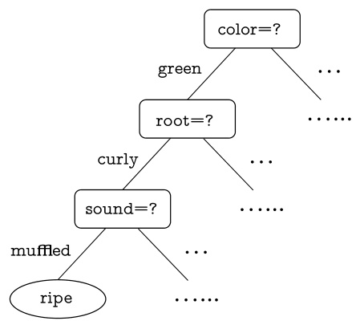  
Fig. 4.1 A decision tree of the watermelon problem  

$$
\begin{aligned}
&\text { Algorithm 4.1 Decision Tree Learning }\\
&\text { Input: Training set } D=\left\{\left(\boldsymbol{x}_1, y_1\right),\left(\boldsymbol{x}_2, y_2\right), \ldots,\left(\boldsymbol{x}_m, y_m\right)\right\}\\
&\text { Feature set } A=\left\{a_1, a_2, \ldots, a_d\right\}\\
&\text { Process: Function TreeGenerate }(D, A)\\
&\text { Generate node } i \text {; }\\
&\text { if All samples in } D \text { belong to the same class } C \text { then }\\
&\text { Mark node } i \text { as a class } C \text { leaf node; return }\\
&\text { end if }\\
&\text { if } A=\varnothing \text { OR all samples in } D \text { take the same value on } A \text { then }\\
&\text { Mark node } i \text { as a leaf node, and its class label is the majority class }\\
&\text { in } D \text {; return }\\
&\text { end if }\\
&\text { Select the optimal splitting feature } a_* \text { from } A\\
&\text { for each value } a_*^v \text { in } a_* \text { do }\\
&\text { Generate a branch for node } i \text {; Let } D_v \text { be the subset of samples }\\
&\text { taking value } a_*^v \text { on } a_* \text {; }\\
&\text { if } D_v \text { is empty then }\\
&\text { Mark this child node as a leaf node, and label it with the major- }\\
&\text { ity class in } D \text {; return }\\
&\text { else }\\
&\text { Use TreeGenerate( } \left.D_v, A \backslash\left\{a_*\right\}\right) \text { as the child node. }\\
&\text { end if }\\
&\text { end for }\\
&\text { Output: A decision tree with root node } i \text {. }
\end{aligned}
$$

As shown in  .  Algorithm 4.1 , the tree is generated recur- sively, and the recursion stops in any of the following three cases: (1) all samples in the current node belong to the same class, that is, no further splitting is needed; (2) the current fea- ture set is empty, or all samples have the same feature values, that is, not splittable; (3) there is no sample in the current node, that is, not splittable.  

In case (2), we mark the current node as a leaf node and set its label to the majority class of its samples. In case (3), we mark the current node as a leaf node but set its label to the majority class of the samples in its parent node. Note that the two cases are different: case (2) uses the posterior probability of the current node, whereas case (3) uses the class probability of the parent node as the prior probability of the current node.  

## 4.2  Split Selection  

The core of the decision tree learning algorithm is the line 8 of .  Algorithm 4.1 , that is, selecting the optimal splitting feature. Generally speaking, as the splitting process proceeds, we wish more samples within each node to belong to a single class, that is, increasing the  purity  of each node.  

### 4.2.1  Information Gain  

One of the most commonly used measures for purity is  informa- tion entropy , or simply  entropy . Let  $p_{k}$   denotes the proportion ofthe  $k$  th class in the current data set  $D$  ,where  $k=1,2,\ldots,|\mathcal{Y}|$  . Then, the entropy is defined as  

In the calculation of entropy,  $p\log_{2}p=0$   when  $p=0$  .  

The minimum of   $\operatorname{End}(D)$   is 0 and the maximum is  $\log_{2}|\mathcal{Y}|$  .  

$$
\operatorname{End}(D)=-\sum_{k=1}^{|\mathcal{Y}|}p_{k}\log_{2}p_{k}.
$$  

The lower the   $\operatorname{End}(D)$  , the higher the purity of    $D$  .  

Suppose that the discrete feature    $a$   has    $V$   possible values  $\{a^{1},a^{2},.\,.\,.\,,a^{V}\}$  . Then, splitting the data set    $D$  y feature    $a$  produces  $V$  childnodes,wherethe v thchildnode  $D^{\nu}$    includesall samples in  $D$   taking the value    $a^{\nu}$    for feature  $a$  . Then, the entropy of    $D^{\nu}$    can be calculated using ( 4.1 ). Since there are different numbers of samples in the child nodes, a weight    $\left|D^{\nu}\right|/\left|D\right|$   is assigned to reflect the importance of each node, that is, the greater the number of samples, the greater the impact of the branch node. Then, the  information gain  of splitting the data set  $D$   with feature    $a$   is calculated as  

$$
{\mathrm{Gain}}(D,a)={\mathrm{End}}(D)-\sum_{\nu=1}^{V}{\frac{|D^{\nu}|}{|D|}}{\mathrm{End}}(D^{\nu}).
$$  

In general, the higher the information gain, the more purity improvement we can expect by splitting  $D$  withfeature  $a$  .There- fore, information gain can be used for split selection, that is, using    $a_{*}=$  arg max as the splitting feature on the line 8 a ∈ A Gain ( D , a )  

The term ID in ID3 stands for Iterative Dichotomiser.  

of    $^{\circ}$   Algorithm 4.1 . The well-known decision tree algorithm ID3 Quinlan ( 1986 ) takes information gain as the guideline for selecting the splitting features.  

Let us see a more concrete example with the watermelon data set 2 . 0 in    $\circ$   Table 4.1 . This data set includes 17 training samples, which are used to train a decision tree classifier for predicting the ripeness of uncut watermelons, where  $|y|=2$  . In the beginning, the root node includes all samples in  D , where  $\textstyle p_{1}={\frac{8}{17}}$    of them are positive and  $\textstyle p_{2}={\frac{9}{17}}$    of them are negative. According to ( 4.1 ), the entropy of the root node is  

$$
\operatorname{End}(D)=-\sum_{k=1}^{2}p_{k}\log_{2}p_{k}=-\left({\frac{8}{17}}\log_{2}{\frac{8}{17}}+{\frac{9}{17}}\log_{2}{\frac{9}{17}}\right)=0.998.
$$  

Then, we need to calculate the information gain of each feature in the current feature set  { color ,  root ,  sound ,  tex- ture ,  umbilicus ,  surface } . Suppose that we have selected  color ,  

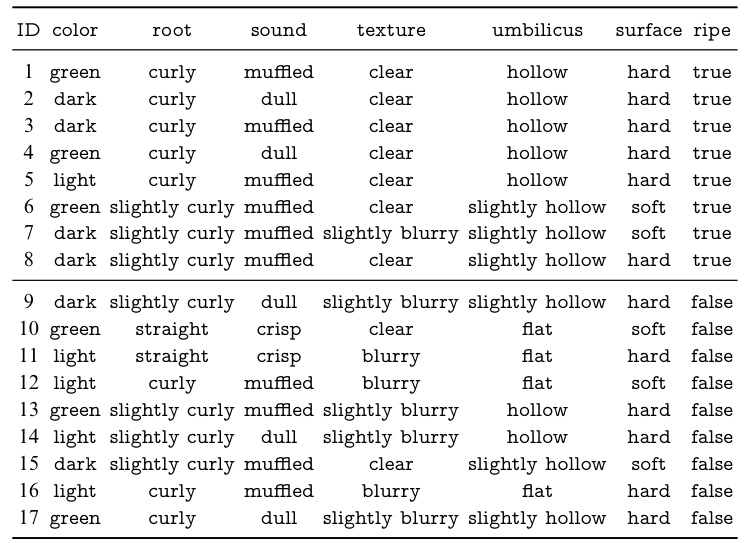  

which has three possible values  { green , rk ,  light } . If    $D$   is s by  color , then there  three subsets:  $D^{1}$    (  $\mathtt{c o l o r}=\mathtt{g r e e n)}$  ,  $D^{2}$   $({\mathsf{c o l o r}}={\mathsf{d a r k}})$  , and  $D^{3}$    (  $\mathsf{c o l o r}=\mathsf{l i g h t}$  

Subset  $D^{1}$    includes six samples  {  $\{1,4,6,10,13,17\}$  } , in which  $\textstyle p_{1}={\frac{3}{6}}$   them are positive and  $\begin{array}{r}{p_{2}=\frac{3}{6}}\end{array}$    of them are negative. ubset  $D^{2}$    includes six sam ,  3 ,  7 ,  8 ,  9 ,  15 } , in which  $p_{1}=$   $\frac{4}{6}$    of them are positive and  $\begin{array}{r}{p_{2}=\frac{2}{6}}\end{array}$    of them are negative. Subset  $D^{3}$    includes five samples  { 5 ,  11 ,  12 ,  14 ,  16 } , in which  $\textstyle p_{1}={\frac{1}{5}}$    of them are positive and  $\textstyle p_{2}={\frac{4}{5}}$    of them are negative. According to ( 4.1 ), the entropy of the three child nodes are  

$$
\begin{array}{l l}{{\displaystyle\mathrm{End}(D^{1})=-\left(\frac{3}{6}\log_{2}\frac{3}{6}+\frac{3}{6}\log_{2}\frac{3}{6}\right)=1.000,}}\\ {{\displaystyle\mathrm{End}(D^{2})=-\left(\frac{4}{6}\log_{2}\frac{4}{6}+\frac{2}{6}\log_{2}\frac{2}{6}\right)=0.918,}}\\ {{\displaystyle\mathrm{End}(D^{3})=-\left(\frac{1}{5}\log_{2}\frac{1}{5}+\frac{4}{5}\log_{2}\frac{4}{5}\right)=0.722.}}\end{array}
$$  

Then, we use ( 4.2 ) to calculate the information gain of splitting by  color  as  

$$
{\begin{array}{l}{{\mathrm{Gain}}(D,\mathsf{c o l o r})={\mathrm{End}}(D)-\displaystyle\sum_{\nu=1}^{3}{\frac{\left|D^{\nu}\right|}{|D|}}{\mathrm{End}}(D^{\nu})}\\ {\qquad\qquad=0.998-\left({\frac{6}{17}}\times1.000+{\frac{6}{17}}\times0.918+{\frac{5}{17}}\times0.722\right)}\\ {\qquad\qquad\qquad=0.109.}\end{array}}
$$  

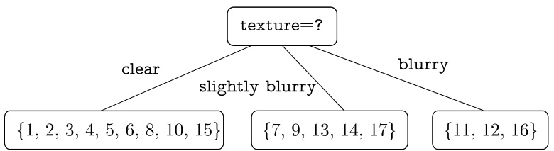  
Fig. 4.2 Splitting the root node by  texture  

Similarly, we calculate the information gain of other fea- tures:  

$$
\begin{array}{l l}{{\mathrm{Gain}(D,\mathrm{root})=0.143;}}&{{\mathrm{Gain}(D,\mathrm{sound})=0.141;}}\\ {{\mathrm{Gain}(D,\mathrm{extMC})=0.381;}}&{{\mathrm{Gain}(D,\mathrm{umbillicus})=0.289;}}\\ {{\mathrm{Gain}(D,\mathrm{surface})=0.006.}}\end{array}
$$  

Since splitting by  texture  gives the highest information gain, it is chosen as the splitting feature.  .  Figure 4.2  shows the result of splitting the root node by  texture .  

Then, each child node is further split by the decision tree algorithm. For example, the first child node (i.e.,  texture    $=$  clear ) includes nine samples:    $D^{1}\,=\,\{1,2,3,4,5,6,8,10,15\}$  , and the available feature set is  { color ,  root ,  sound ,  umbilicus , surface } . W alculate the information gains of these candidate features on  $D^{1}$  :  

$$
\begin{array}{l l}{{\mathrm{Gain}(D^{1},\mathsf{c o l o r})=0.043;}}&{{\mathrm{Gain}(D^{1},\mathsf{r o o t})=0.458;}}\\ {{\mathrm{Gain}(D^{1},\mathsf{s o u n d})=0.331;}}&{{\mathrm{Gain}(D^{1},\mathsf{u m b i l i c u s})=0.458;}}\\ {{\mathrm{Gain}(D^{1},\mathsf{s u r f a c e})=0.458.}}&{{}}\end{array}
$$  

Since  root ,  umbilicus , and  surface  lead to the highest infor- mation gains, any of them can be chosen as the splitting feature. Repeating this process for every node, we can obtain the final decision tree, as shown in  .  Figure 4.3 .  

### 4.2.2  Gain Ratio  

The process described above intentionally ignored the column ID . If we consider  ID  as a candidate splitting feature, then, from ( 4.2 ), we know its information gain is 0 . 998, which is much higher than that of any other features. This is reasonable since  ID  produces 17 child nodes, and each node has only a single sample with maximum purity. However, such a decision  

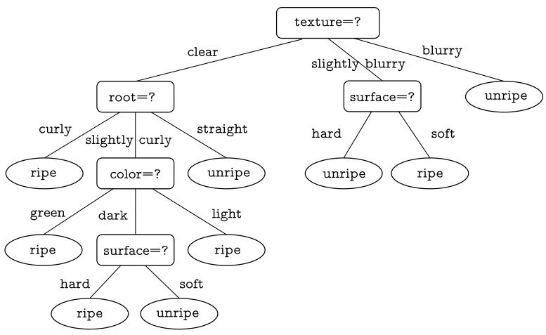  
Fig. 4.3 The information gain-based decision tree generated from    $\circ$   Table 4.1  

tree does not have generalization ability and cannot effectively predict new samples.  

It turns out that the information gain criterion is biased toward features with more possible values. To reduce this bias, the renowned decision tree algorithm C4.5 (Quinlan  1993 ) employs  gain ratio  to select features instead of employing infor- mation gain. Using a notation similar to ( 4.2 ), the gain ratio of feature  $a$   is defined as  

$$
{\mathrm{Gain}}\_{\mathrm{ratio}}(D,a)={\frac{{\mathrm{Gain}}(D,a)}{\operatorname{IV}(a)}},
$$  

where  

$$
\mathrm{IV}(a)=-\sum_{\nu=1}^{V}\frac{|D^{\nu}|}{|D|}\log_{2}{\frac{|D^{\nu}|}{|D|}}
$$  

is called the  intrinsic value  of feature  $a$   (Quinlan  1993 ).   $\operatorname{IV}(a)$   is large when feature  $a$   has many possible values (i.e., large    $V$  ). Taking the watermelon data set 2 . 0 as an example, we have: IV ( surface )  $=0.874$   (  $V=2_{c}$  ) ,   $\mathrm{IV(\mathsf{c o l o r})}=1.580$   (  $V=3)$  ) , and  $\mathrm{IV(ID)}=4.088$   (  $V=17$  ) .  

It should be noted that, in contrast to information gain, the gain ratio is biased toward features with fewer possible values. For this reason, the   $C4.5$   algorithm does not use gain ratio directly for selecting the splitting feature, but uses a heuristic method (Quinlan  1993 ): selecting the feature with the highest gain ratio from the set of candidate features with an informa- tion gain above the average.  

### 4.2.3  Gini Index  

CART stands for Classification and Regression Tree, which is a well-known decision tree algorithm applicable to both classification and regression.  

CART Breiman et al. ( 1984 ) employs the  Gini index  for select- ing the splitting feature. Using a notation similar to ( 4.1 ), the Gini value of data set    $D$   is defined as  

$$
\begin{array}{c}{{\mathrm{Gini}(D)=\displaystyle\sum_{k=1}^{|\mathcal{Y}|}\displaystyle\sum_{k^{\prime}\neq k}p_{k}p_{k^{\prime}}}}\\ {{=1-\displaystyle\sum_{k=1}^{|\mathcal{Y}|}p_{k}^{2}.}}\end{array}
$$  

Intuitively,   ${\mathrm{Gini}}(D)$   represents the likelihood of two sam- ples we randomly selected from data set    $D$   belonging to differ- ent classes. The lower the   ${\mathrm{Gini}}(D)$  , the higher the purity of data set  $D$  .  

Using a notation similar to ( 4.2 ), the Gini index of feature  $a$   is defined as  

$$
{\mathrm{Gini}}_{\mathrm{index}}(D,a)=\sum_{\nu=1}^{V}\frac{|D^{\nu}|}{|D|}{\mathrm{Gini}}(D^{\nu}).
$$  

Given a candidate feature set    $A$  , we select the feature with the lowest Gini index as the splitting feature, that is,    $a_{*}\;=$  arg   $\mathrm{min}_{a\in A}$  Gini_index  $(D,a)$  .  

## 4.3  Pruning  

See Sect.  2.1  for overfitting.  

Pruning  is the primary strategy of decision tree learning algo- rithms to deal with overfitting. To correctly classify the train- ing samples, the learner repeats the split procedure. However, if there are too many branches, then the learner may be misled by the peculiarities of the training samples and incorrectly con- sider them as the underlying truth. Hence, we can prune some of the branches to reduce the risk of overfitting.  

The general pruning strategies include  pre-pruning  and  post- pruning  (Quinlan  1993 ). Pre-pruning evaluates the improve- ment of the generalization ability of each split and cancels a split if the improvement is small, that is, the node is marked as a leaf node. In contrast, post-pruning re-examines the non-leaf nodes of a fully grown decision tree, and a node is replaced with a leaf node if the replacement leads to improved generalization ability.  

How do we know if the generalization ability has been improved? We can use the performance evaluation methods introduced in Sect.  2.2 . For example, we can use the hold-out  

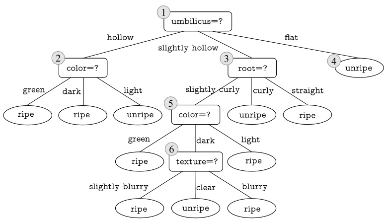  
Fig. 4.4 The unpruned decision tree generated from    $\circ$   Table 4.2  

method to reserve part of the data as a validation set for per- formance evaluation. Given the watermelon data set 2 . 0 in .  Table 4.1 , suppose the samples are randomly partitioned into a training set  $\{1,2,3,6,7,10,14,15,16,17\}$   and a valida- tion set  { 4 ,  5 ,  8 ,  9 ,  11 ,  12 ,  13 } , as shown in  .  Table 4.2 .  

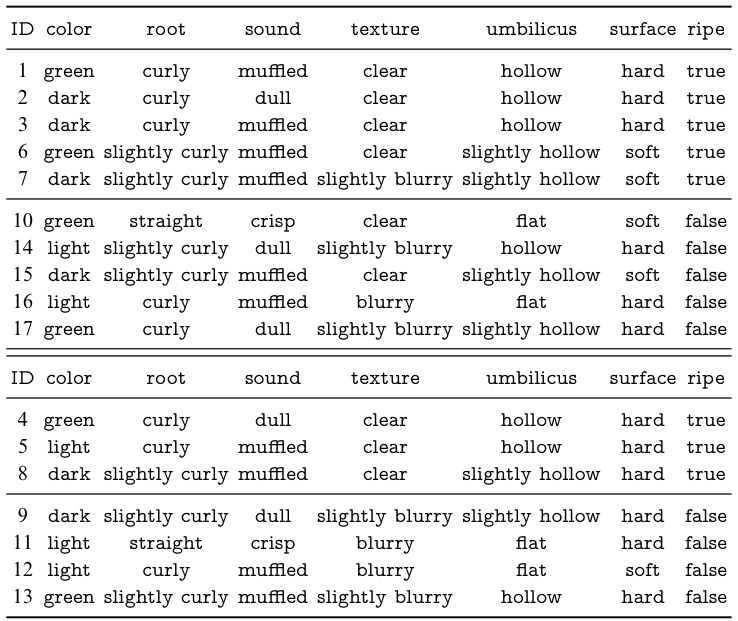  

Suppose we use the information gain criterion described in Sect.  4.2.1  for deciding the splitting features, then  .  Figure 4.4 shows the decision tree trained on the data set in  .  Table 4.2 . For ease of discussion, we numbered some nodes in the figures.  

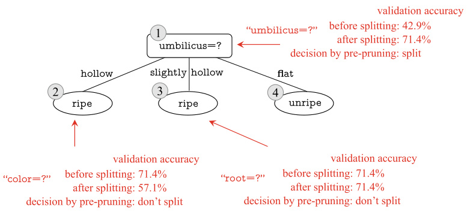  
Fig. 4.5 The pre-pruned decision tree generated from  .  Table 4.2  

### 4.3.1  Pre-pruning  

Let us take a look at pre-pruning first. According to the infor- mation gain criterion,  umbilicus  should be chosen to split the training set into three branches, as shown in  .  Figure 4.5 . However, shall we proceed with this split? Pre-pruning decides by comparing the generalization abilities before and after split- ting.  

When there is more than one class with the largest number of samples, we randomly select one of the classes.  

Prior to splitting, all samples are in the root node. When no splitting is performed, this node is marked as a leaf node according to line 6 of  .  Algorithm 4.1 , and its label is set to the majority class (i.e.,  ripe ). By evaluating this single-node decision tree using the validation set in  .  Table 4.2 , we have the samples  { 4 ,  5 ,  8 }  correctly classified and the other four samples  $42.9\%$  misclassified. Then, the validation accuracy is .    ${\begin{array}{l}{{\frac{3}{7}}\,\times\,100{\bar{\%}}\,=}\end{array}}$  

After splitting the root node by  umbilicus , the samples are placed into three child nodes, as shown in  .  Figure 4.5 : node  $\textcircled{2}$  with the samples    $\{1,2,3,14\}$  , node  $\textcircled{3}$  with the samples { 6 ,  7 ,  15 ,  17 } , and node  $\textcircled{4}$  with the samples  { 10 ,  16 } . We mark these 3 nodes as leaf nodes and set the labels to the majority classes, that is,  $\textcircled{2}$  is  ripe ,  $\textcircled{3}$  is  ripe , and  $\textcircled{4}$  is  unripe . Then, the validation accuracy is improved, the splitting using validation accuracy is    $\begin{array}{r}{\frac{5}{7}\times100\%=71.4\%>42.9\%}\end{array}$    9%. Since the  umbilicus is adopted.  

After that, the decision tree algorithm moves on to split node  $\textcircled{2}$  , and  color  is chosen based on the information gain criterion. However, since the sample  { 5 }  in the v on set is misclassified, the validation accuracy drops to 57  $57.1\%$  1%. Hence, the pre-pruning strategy stops splitting node  $\textcircled{2}$  . For node  $\textcircled{3},$  the best feature to split on is  root . However, since the validation accuracy after splitting remains the same as   $71.4\%$  , pre-pruning strategy stops splitting node  $\textcircled{3}$  . For node  $\textcircled{4}$  , no splitting is needed since all samples belong to the same class.  

Finally, the pre-pruning decision tree constructed based on the data in  .  Table 4.2  is given in  .  Figure 4.5 , and its vali- dation accuracy is   $71.4\%$  . Because there is only one splitting, such a decision tree is also called a  decision stump .  

By comparing    $\circ$   Figures 4.5  and    $\boxed{4.4}$  , we can see that applying pre-pruning reduces the branches of the decision tree, which reduces not only the risk of overfitting but also the com- putational cost of training and testing. On the other hand, although some branches are prevented by pre-pruning due to little or even negative improvement on generalization ability, it is still possible that their subsequent splits can lead to sig- nificant improvement. These branches are pruned due to the greedy nature of pre-pruning, and it may introduce the risk of underfitting.  

### 4.3.2  Post-pruning  

Post-pruning allows a decision tree to grow into a complete tree, e.g.,  $\circ$   Figure 4.4  shows a fully grown decision tree based on data in  .  Table 4.2 . The validation accuracy of this decision tree is   $42.9\%$  .  

In  .  Figure 4.4 , node  $\textcircled{6}$  is the first one examined by post- pruning. If the subtree led by node  $\textcircled{6}$  is pruned and replaced with a leaf node, then it includes the samples  { 7 ,  15 }  and its label is set to the majority class  ripe . Since the validation accuracy increases to   $57.1\%$  , the pruning is performed, resulting in the decision tree, and the result is shown in  $\circ$   Figure 4.6 .  

Next, post-pruning examines node  $\textcircled{5}$  . If the subtree led by node  $\textcircled{5}$   is replaced by a leaf node, then it includes the samples { 6 ,  7 ,  15 }  and its label is set to the majority class  ripe . Since the validation accuracy remains at   $57.1\%$  , no pruning is performed.  

If the subtree led by node  $\textcircled{2}$  is replaced by a leaf node, then it includes the samples    $\{1,2,3,14\}$   and its label is set to the majority class  ripe . Since the validation accuracy increases to  $71.4\%$  , the pruning is performed.  

For nodes  $\textcircled{3}$   and  $\textcircled{1}$  , replacing them as leaf nodes gives the validation accuracies   $71.4\%$   and  $42.9\%$  , respectively. Since there is no improvement in both cases, the nodes remain unchanged.  

Finally, the post-pruning decision tree constructe using data in  .  Table 4.2  is given in  $\circ$   Figure 4.6 , and its vali- dation accuracy is  $71.4\%$  .  

Although the accuracy of the validation set is not improved in this case, according to Occam’s razor principle, the model would be better after pruning. In fact, the actual decision tree algorithm usually needs pruning in this case. For the convenience of drawing, this book adopts a conservative strategy of not pruning.  

By comparing    $\circ$   Figs. 4.6  and  $\boxed{4.5}$  , we can see that post- pruning keeps more branches than pre-pruning. In general, post-pruning is less prone to underfitting and leads to better generalization ability compared to pre-pruning. However, the training time of post-pruning is much longer since it takes a bottom-up strategy to examine every non-leaf node in a com- pletely grown decision tree.  

## 4.4  Continuous and Missing Values  

### 4.4.1  Handling Continuous Values  

Our discussions so far are limited to discrete features. However, since continuous features are also common in practice, it is necessary to know how to incorporate continuous features into decision trees.  

We cannot directly split nodes with continuous features since their values are infinite. The discretization techniques come in handy in such cases. The most straightforward dis- cretization strategy is bi-partition, which is used by C4.5 deci- sion tree (Quinlan  1993 ).  

Given a data set  $D$   and a continuous feature    $a$  , suppose    $n$  valuesof a  areobservedin  $D$  ,andwesortthesevaluesinascend- ing order, denoted by    $\{a^{1},a^{2},.\,.\,.\,,a^{n}\}$  . With a s  point    $t$  ,    $D$   is partitioned into the subsets    $D_{t}^{-}$    and    $D_{t}^{+}$  , where  $D_{t}^{-}$    includes the samples with the value of    $a$   not greater than  $t$  , and    $D_{t}^{+}$    includes the samples with the value of    $a$  greater than    $t$  . For adjacent fea- ture values  $a^{i}$    and  $a^{i+1}$  , the partitions are identical for choosing any    $t$  in the inte  $[a^{i},a^{i+1})$  . As a result, for continuous fea- ture  a , there are  $n-1$  − 1 elements in the following set of candidate split points:  

$$
T_{a}=\left\{\frac{a^{i}+a^{i+1}}2\mid1\leqslant i\leqslant n-1\right\},
$$  

where the midpoint    $\textstyle{\frac{a^{i}+a^{i+1}}{2}}$  is used as the candidate split point for the interval  $[a^{i},a^{i+1})$  . Then, the split points are examined in the same way as discrete features, and the optimal split points  

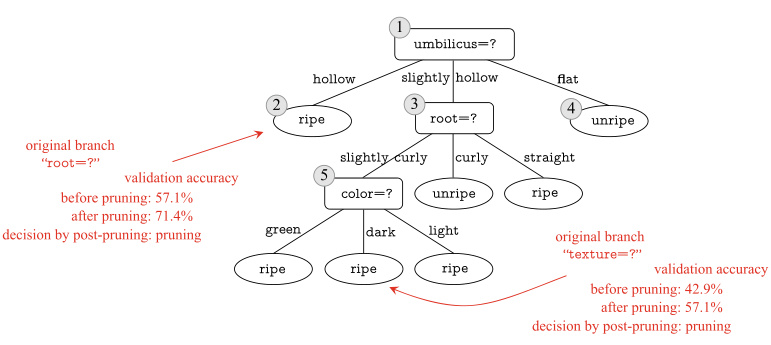  
Fig. 4.6 The post-pruned decision tree generated from  .  Table 4.2  

are selected for splitting nodes. For example, we can modify ( 4.2 ) as  

$$
\begin{array}{l l}{{\mathrm{Gain}}(D,a)=\displaystyle\operatorname*{max}_{t\in T_{a}}{\mathrm{Gain}}(D,a,t)}\\ {\quad\quad\quad\quad=\displaystyle\operatorname*{max}_{t\in T_{a}}\mathrm{End}(D)-\sum_{\lambda\in\{-,+\}}\frac{\big|D_{t}^{\lambda}\big|}{|D|}\mathrm{End}(D_{t}^{\lambda}),}\end{array}
$$  

where  ${\mathrm{Gain}}(D,a,t)$  is the information gain of bi-partitioning    $D$   by    $t$  , and the split point with the largest

  ${\mathrm{Gain}}(D,a,t)$   is selected.  

For illustration, we create the watermelon data set 3 . 0 in

 .  Table 4.3  by adding two continuous features  density  and sugar  to the watermelon data set 2 . 0. Now, we build a decision tree using this new data set.  

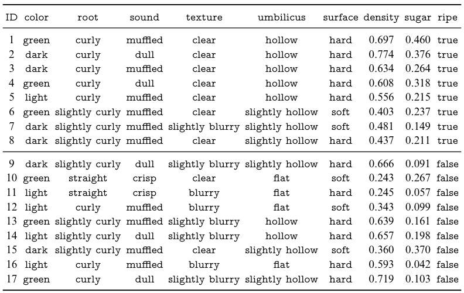  

At the beginning, all 17 training samples have different density  values. According to ( 4.7 ), the candidate split point set includes 16 values:    $T_{\mathrm{density}}=\{0.244,0.294,0.351,0.381,$  0 . 420 ,  0 . 459 , 0 . 518 ,  0 . 574 ,  0 . 600 ,  0 . 621 ,  0 . 636 ,  0 . 648 ,  0 . 661 , 0 . 681 ,  0 . 708 ,  0 . 746 } . According to ( 4.8 ), the information gain of  density  is 0 . 262, and the corresponding split point is 0 . 381.  

For the feature  sugar , its candidate split point set includes 16 values:    $T_{\mathtt{s u g a r}}=\{0.049,0.074,0.095,0.101,0.126,0.155,$  0 . 179 ,  0 . 204 ,  0 . 213 ,  0 . 226 ,  0 . 250 ,  0 . 265 ,  0 . 292 ,  0 . 344 ,  0 . 373 , 0 . 418 } . Similarly, the information gain of  sugar  is 0 . 349 accord- ing to ( 4.8 ), and the corresponding split point is 0 . 126.  

Combining the results from Sect.  4.2.1 , the information gains of features in  .  Table 4.3  are  

$$
{\begin{array}{r l r l}&{{\mathrm{Gain}}(D,{\mathrm{clow}})=0.109;}&&{{\mathrm{Gain}}(D,{\mathrm{root}})=0.143;}\\ &{{\mathrm{Gain}}(D,{\mathrm{sond}})=0.141;}&&{{\mathrm{Gain}}(D,{\mathrm{testure}})=0.381}\\ &{{\mathrm{Gain}}(D,{\mathrm{unbeliefus}})=0.289;}&&{{\mathrm{Gain}}(D,{\mathrm{surface}})=0.006;}\\ &{{\mathrm{Gain}}(D,{\mathrm{density}})=0.262;}&&{{\mathrm{Gain}}(D,{\mathrm{suspar}})=0.349.}\end{array}}
$$  

For example, using 4 density  $\leqslant0.381$   in a parent node does not forbid the use of density  $\leqslant0.294$   in a child node.  

Since splitting by  texture  has the largest information gain, it is selected as the splitting feature for the root node. The split- ting process proceeds recursively, and the final decision tree is shown in  .  Figure 4.7 .  

Unlike discrete features, a continuous feature can be used as a splitting feature more than once in a decision sequence.  

### 4.4.2  Handling Missing Values  

Inpractice,data is often incomplete,thatis,some feature values are missing in some samples. Taking medical diagnosis data as an example, feature values such as HIV test results could be unavailable due to privacy concerns. Sometimes we may have a large number of incomplete samples,especially when there are many features. Though we can simply discard the incomplete samples, it is a huge waste of data. For example,  .  Table 4.4 shows a watermelon data set with missing values. If we discard the incomplete samples, then we will have only four samples { 4, 7, 14, 16 }  left for training. Apparently, we need a method to utilize incomplete samples.  

Learning from incomplete samples raises two problems: (1) how to choose the splitting features when there are missing values? (2) how to split a sample with the splitting feature value missing?  

Given a training set    $D$   and a feature    $a$  , let  $\tilde{D}$   be the sub- set of samples in    $D$   that has values of    $a$  . For problem (1), we n simply use  $\tilde{D}$   to eva te    $a$  . Let    $\{a^{1},a^{2},\dotsc,a^{V}\}$   denote t  $V$   possible values of    $a$  ,    ${\tilde{D}}^{\nu}$  ˜   denote the subset of samples in    $\tilde{D}$  ˜  

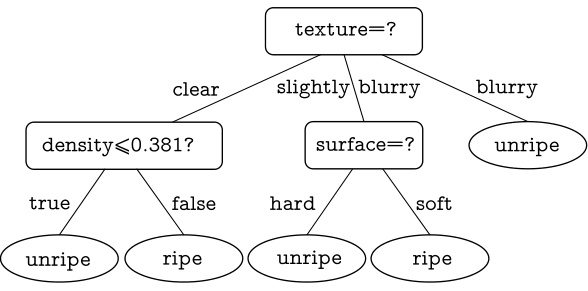  
Fig. 4.7 The information gain-based decision tree generated from  $\circ$   Table 4.3  

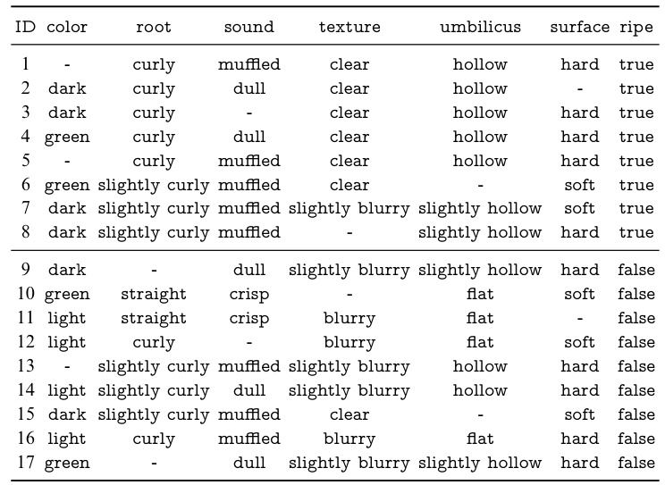  

taking the value    $a^{\nu}$  , and  ${\tilde{D}}_{k}$   denote the subset of samples in  $\tilde{D}$  belonging to the  k th class, where    $k=1,2,\ldots,|\mathcal{Y}|$  . Then, we have  $\begin{array}{r}{\bar{\tilde{D}}=\bigcup_{k=1}^{|\mathcal{V}|}\tilde{D}_{k}}\end{array}$    
  and  $\begin{array}{r}{{\tilde{D}}=\bigcup_{\nu=1}^{V}{\tilde{D}}^{\nu}}\end{array}$    
   . We assign a weight  $w_{x}$  = = to each sample  x , and define  

At the beginning of decision tree learning, the weights are initialized to 1 for all samples in the root node.  

$$
\begin{array}{r l}&{\rho=\frac{\sum_{x\in\tilde{D}}w_{x}}{\sum_{x\in D}w_{x}},}\\ &{\tilde{p}_{k}=\frac{\sum_{x\in\tilde{D}_{k}}w_{x}}{\sum_{x\in\tilde{D}}w_{x}}\quad(1\leqslant k\leqslant|\mathcal{Y}|),}\\ &{\tilde{r}_{\nu}=\frac{\sum_{x\in\tilde{D}^{\nu}}w_{x}}{\sum_{x\in\tilde{D}}w_{x}}\quad(1\leqslant\nu\leqslant V).}\end{array}
$$  

Intuitively, for the feature    $a,\,\rho$   represents the proportion of samp s without missing values,  $\tilde{p}_{k}$   represents the proportion ofthe  $k$  th class in all samples without missing values,and  $\tilde{r}_{\nu}$   rep- resents the proportion of samples taking the feature value    $a^{\nu}$    in all s ut missing values. Then, we have    $\textstyle\sum_{k=1}^{|\mathcal{Y}|}\tilde{p}_{k}=1$  =   and  $\begin{array}{r}{\sum_{\nu=1}^{V}\tilde{r}_{\nu}=1}\end{array}$   =  

With the above definitions, we extend the information gain ( 4.2 ) to  

$$
\begin{array}{l l}{{\mathrm{Gain}(D,a)=\rho\times\mathrm{Gain}(\tilde{D},a)}}\\ {{\ }}\\ {{\ }}\\ {{\ }}\\ {{\ }}\\ {{\ }}\\ {{\ }}\\ {{\ }}\\ {{\ }}\\ {{\ }}\\ {{\ }}\\ {{\ }}\\ {{\ }}\\ {{\ }}\\ {{\ }}\\ {{\ }}\\ {{\ }}\\ {{\ }}\\ {{\ }}\\ {{\ }}\\ {{\ }}\end{array}
$$  

where, according to ( 4.1 ),  

$$
\mathrm{End}(\tilde{D})=-\sum_{k=1}^{|y|}\tilde{p}_{k}\log_{2}\tilde{p}_{k}.
$$  

For problem (2), when the value of    $a$   is known, we place the sample  $\pmb{x}$   into the corresponding child node without changing its weight    $w_{x}$  . When the value of    $a$   is unknown, we place the sample    $\pmb{x}$   into all child nodes, and set its weight in the child node of value  $a^{\nu}$    to    $\tilde{r}_{\nu}\cdot w_{x}$   · . In other words, we place the same sample into different child nodes with different probabilities.  

The above solution is employed by the C 4.5algorithm(Quin- lan  1993 ), and we will use it to construct a decision tree for  $^{\circ}$   Table 4.4 .  

In the beginning, the root node includes all of the 17 samples in    $D$  , and all samples have the weight of 1. Taking  color  as an example, the set of samples without missing values of this feature includes 14 s mples  { 2, 3, 4, 6,  8, 9, 10, 11, 12, 14, 15, 16, 17 } , denoted by    $\tilde{D}$  ˜ . The entropy of    $\tilde{D}$  ˜  is calculated as  

$$
\begin{array}{l}{{\displaystyle\mathrm{End}(\tilde{D})=-\sum_{k=1}^{2}\tilde{p}_{k}\log_{2}\tilde{p}_{k}}}\\ {{\displaystyle~~~~~~~~~=-\left(\frac{6}{14}\log_{2}\frac{6}{14}+\frac{8}{14}\log_{2}\frac{8}{14}\right)=0.985}.}\end{array}
$$  

Let  $\tilde{D}^{1},\tilde{D}^{2}$  , and  ${\tilde{D}}^{3}$    be the s sets of samples with    ${\mathsf{c o l o r}}=$  green ,  color  $={\tt d a r k}$  , and  color  =  light , respectively. Then, we have  

$$
\begin{array}{l l}{{\displaystyle\mathrm{End}(\tilde{D}^{1})=-\left(\frac{2}{4}\log_{2}\frac{2}{4}+\frac{2}{4}\log_{2}\frac{2}{4}\right)=1.000,}}\\ {{\displaystyle\mathrm{End}(\tilde{D}^{2})=-\left(\frac{4}{6}\log_{2}\frac{4}{6}+\frac{2}{6}\log_{2}\frac{2}{6}\right)=0.918,}}\\ {{\displaystyle\mathrm{End}(\tilde{D}^{3})=-\left(\frac{0}{4}\log_{2}\frac{0}{4}+\frac{4}{4}\log_{2}\frac{4}{4}\right)=0.000.}}\end{array}
$$  

The information gain of  color  for subset  $\tilde{D}$   is  

$$
\begin{array}{l l}{{\mathrm{Gain}(\tilde{D},\mathsf{c o l o r})=\mathrm{End}(\tilde{D})-\displaystyle\sum_{\nu=1}^{3}\tilde{r}_{\nu}\mathrm{End}(\tilde{D}^{\nu})}}\\ {{\ \ \ \ \ \ \ \ \ \ }}\\ {{\ \ \ \ \ \ \ \ \ =0.985-\left(\frac{4}{14}\times1.000+\frac{6}{14}\times0.918+\frac{4}{14}\times0.000\right)}}\\ {{\ \ \ \ \ \ \ \ \ \ =0.306.}}\end{array}
$$  

The information gain of  color  for data set    $D$   is  

  
Fig. 4.8 The information gain-based decision tree generated from  $\circ$   Table 4.4  

$$
\mathrm{Gain}(D,\mathsf{c o l o r})=\rho\times\mathrm{Gain}(\tilde{D},\mathsf{c o l o r})=\frac{14}{17}\times0.306=0.252.
$$  

Similarly, we can calculate the information gain of all fea- tures for    $D$  :  

$$
\begin{array}{l l}{{\mathrm{Gain}(D,\mathsf{c o l o r})=0.252;}}&{{\mathrm{Gain}(D,\mathsf{r o o t})=0.171;}}\\ {{\mathrm{Gain}(D,\mathsf{s o u n d})=0.252;}}&{{\mathrm{Gain}(D,\mathsf{t e x t u r e})=0.424;}}\\ {{\mathrm{Gain}(D,\mathsf{u m b i l i c u s})=0.289;}}&{{\mathrm{Gain}(D,\mathsf{t e x t u r e})=0.006.}}\end{array}
$$  

Since splitting by  texture  has the largest information gain, it is selected for splitting the root node. Specifically, the samples  $\{1,2,3,4,5,6,15\}$   are placed into the child node of  texture  $=$  clear , the samples  { 7 ,  9 ,  13 ,  14 ,  17 }  are placed into the child node  texture  $=$   slightly blurry , and the samples  { 11 ,  12 ,  16 } are placed into the child node of  texture  $=$  blurry . The weights of these samples (i.e., 1) remain unchanged in the child nodes. However, since the value of  texture  is missing for the sample { 8 } , the sample is placed into all of the three child nodes with different weights:  ${\frac{7}{15}},\,{\frac{5}{15}}$  , and  $\frac{3}{15}$  . The sample  { 10 }  is processed similarly. The splitting process proceeds recursively, and the final constructed decision tree is shown in  .  Figure 4.8 .  

## 4.5  Multivariate Decision Trees  

If we regard each feature as a coordinate axis in the coordinate space, a sample with  $d$   features corresponds to a point in the  $d$  -dimensional space. Classifying samples is then about finding the decision boundaries in this space to separate the samples of different classes. For decision trees, the decision boundaries have a distinct characteristic: axis-parallel, that is, the decision boundaries are multiple segments parallel to the axes.  

The watermelon data set   $3.0\alpha$   is a copy of the watermelon data set 3 . 0 excluding discrete features.  

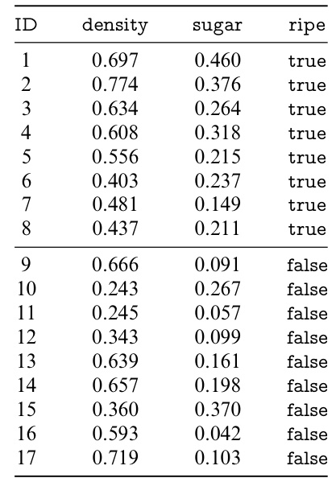  

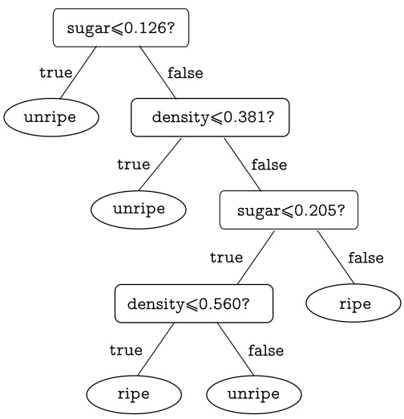  
Fig. 4.9 The decision tree generated from    $\circ$  Table 4.5  

For example,  $^{\circ}$   Figure 4.9  shows the decision tree trained on the watermelon data set   $3.0\alpha$   in  $\circ$  Table 4.5 , and the corre- sponding decision boundaries are shown in  .  Figure 4.10 .  

From  .  Figure 4.10 , we can observe that every segment is parallel to the axis. Since every segment corresponds to a specific value of a feature, such decision boundaries make the learning outcome easy to interpret. In practice, the deci- sion boundaries often need many segments for good approxi- mations, e.g.,  .  Figure 4.11 . However, such complex decision trees are often slow to make predictions since they contain many feature tests.  

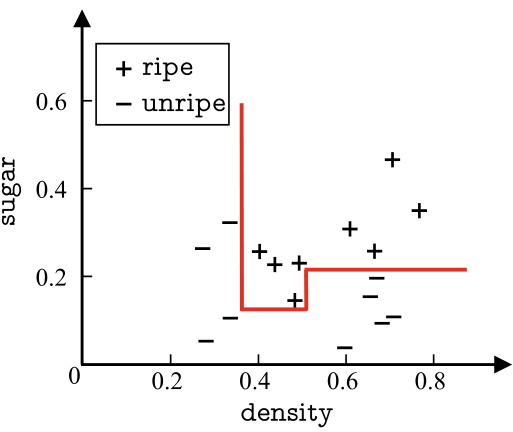  
Fig. 4.10 The decision boundaries of the decision tree in  $^{\circ}$   Figure 4.9  

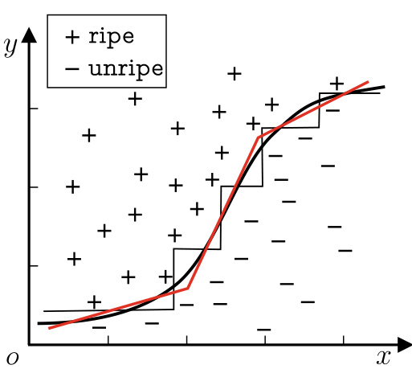  
Fig. 4.11 The piecewise approximation of complex decision boundaries  

If we can make the decision boundaries oblique, as shown bytheredlinein  .  Figure 4.11 ,then the decision tree model can be significantly simplified.  Multivariate decision tree  enables oblique partitions or even more complicated decision bound- aries. With oblique boundaries, each non-leaf node is no longer a test for a particular feature but a linear combination of features. In other words, each non-leaf node is a linear clas- sifier in the form of  $\begin{array}{r}{\sum_{i=1}^{d}w_{i}a_{a}=t}\end{array}$   = , where    $w_{i}$   is the weight of  

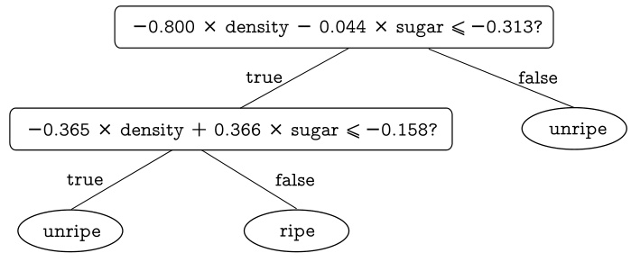  
Fig. 4.12 The multivariate decision tree generated from    $^{\circ}$   Table 4.5  

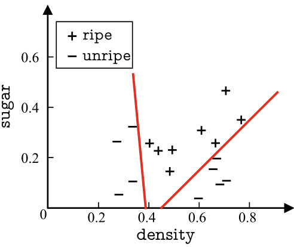  
Fig. 4.13 The decision boundaries of the decision tree in    $^{\circ}$   Figure 4.12  

See Chap.  3  for linear classifier.  

feature    $a_{i}$  , and  $w_{i}$   and    $t$   are learned from the data set and feature set of the node. Unlike the traditional univariate decision tree, the learning process of multivariate decision tree does not look for an optimal splitting feature but tries to establish a suitable linear classifier.  .  Figure 4.12  shows the multivariate decision tree learned from the watermelon data set   $3.0\alpha$  , and the corre- sponding decision boundaries are shown in  .  Figure 4.13 .