# Neural Networks  

## 5.1  Neuron Model  

In this book, neural networks refer to artificial neural networks rather than biological neural networks.  

This is the definition given by T. Kohonen in the first issue of Neural Networks  journal in 1988.  

Neuron is also known as unit.  

Threshold is also known as bias.  

Also known as the transfer function.  

Step function is a variant of the unit-step function. The logistic function is a representative sigmoid function. See Sect.  3.3 .  

For example, for 10 pairwise linked neurons, there are 100 parameters, including 90 connection weights and 10 thresholds.  

‘‘Simulation of biological neural networks’’ is an analogous interpretation of neural networks made by cognitive scientists.  

Research on neural networks started quite a long time ago, and it has become a broad and interdisciplinary research field today. Though neural networks have various definitions across disciplines, this book uses a widely adopted one: ‘‘Artificial neural networks are massively parallel interconnected net- works of simple (usually adaptive) elements and their hierar- chical organizations which are intended to interact with the objects of the real world in the same way as biological nervous systems do’’(Kohonen  1988 ). In the context of machine learn- ing, neural networks refer to ‘‘neural networks learning’’, or in other words, the intersection of machine learning research and neural networks research.  

The basic element of neural networks is neuron, which is the ‘‘simple element’’ in the above definition. In biological neural networks, the neurons, when ‘‘excited’’, send neurotransmitters to interconnected neurons to change their electric potentials. When the electric potential exceeds a  threshold , the neuron is activated (i.e., ‘‘excited’’), and it will send neurotransmitters to other neurons.  

In 1943, (McCulloch and Pitts  1943 ) abstracted the above process into a simple model called the McCulloch – Pitts model (M-P neuron model), which is still in use today. As illus- trated in  .  Figure 5.1 , each neuron in the M-P neuron model receives input signals from  n  neurons via weighted connections. The weighted sum of received signals is compared against the threshold, and the output signal is produced by the  activation function .  

The ideal activation function is the step function illus- trated in  .  Figure 5.2 a, which maps the input value to the output value   $^{\ast}0^{\ast}$   (non-excited) or   $^{\ast1^{\ast}}$   (excited). Since the step function has some undesired properties such as being discon- tinuous and non-smooth, we often use the sigmoid function instead.  .  Figure 5.2 b illustrates a typical sigmoid function that squashes the input values from a large interval into the open unit interval    $(0,1)$  , and hence also is known as the  squash- ing function .  

A neural network is derived by connecting the neurons into a layered structure. From the perspective of computer science, we can simply regard a neural network as a mathematical model with many parameters , and put aside whether it simulates the biological neural networks or not. The model consists of multi- ple functions, e.g., nesting  $\begin{array}{r}{y_{j}=f(\sum_{i}w_{i}x_{i}-\theta_{j})}\end{array}$   multiple times. Effective neural network learning algorithms are often sup- ported by mathematical proofs.  

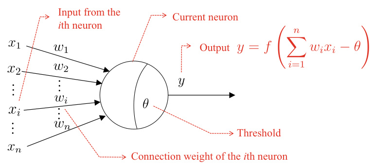  

Fig. 5.1The M-P neuron model  

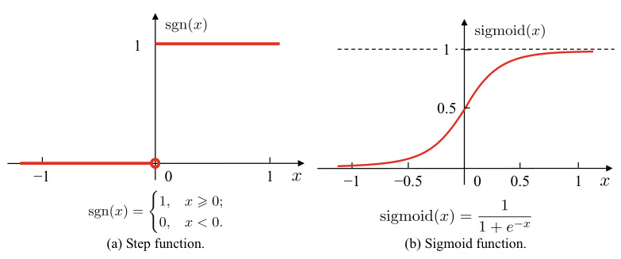  
Fig. 5.2 Typical neuron activation functions  

## 5.2  Perceptron and Multi-layer Network  

Perceptron  is a binary classifier consisting of two layers of neu- rons, as illustrated in  .  Figure 5.3 . The input layer receives external signals and transmits them to the output layer, which is an M-P neuron, also known as  threshold logic unit .  

Perceptron can easily implement the logic operations ‘‘AND’’, ‘‘OR’’, and ‘‘NOT’’. Suppose the f ction  $f$   in    $y\,=$   $f(\sum_{i}w_{i}x_{i}-\theta)$   −  is the step function shown in  .  Figure 5.2 , the logic operations can be implemented as follows:  

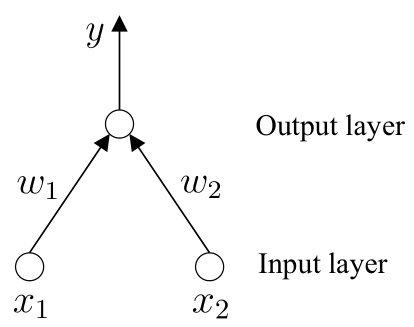  

Fig. 5.3 A perceptron with two input neurons  

$\qquad\qquad\qquad\qquad\qquad\qquad\qquad\qquad\qquad\qquad\qquad\qquad\qquad\qquad\quad\,$  etting  $w_{1}=w_{2}=1,\theta=2$   $y=$   $f(1\cdot x_{1}+1\cdot x_{2}-2)$  , an  $y=1$   $x_{1}=x_{2}=1$   =  

  $-\ ^{\ast}\mathrm{OR}^{\ast}\,(x_{1}\vee x_{2})\colon$  g  $w_{1}=w_{2}=1,\theta=0.5,$     = 5, t  $y\,=$  =  $f(1\cdot x_{1}+1\cdot x_{2}-0.5)$   −  $y=1$   $x_{1}=1$   $x_{2}=1$  =

  $\mathbf{\Gamma}=\mathbf{\Gamma}^{\ast}\mathbf{NOT}^{\ast}\left(\lnot x_{1}\right)$   $w_{1}=-0.6,w_{2}=0,\theta=-0.5,$   = then  $y=f(-0.6\cdot x_{1}+0\cdot x_{2}+0.5)$  −    ·  + , and  $y=0$   =  0 when  $x_{1}=1$   =  1 and  $y=1$   =  1 when  $x_{1}=0$  

$x_{i}$   corresponds to the value of the  i th input neuron.  

ore generally, the weight    $w_{i}\left(i=1,2,.\,.\,.\,,n\right)$   and thresh- old  θ  can be learned from training data. If we consider the threshold    $\theta$   as a  dummy node  with the connection weight    $w_{n+1}$  and fixed input    $-1.0$  , then the weight and threshold are uni- fied as weight learning. The learning of perceptron is simple: for training sample   $(x,y)$  , if the perceptron outputs  $\hat{y}$  , then the weight is updated by  

$$
w_{i}\leftarrow w_{i}+\Delta w_{i},
$$  

$$
\Delta w_{i}=\eta(y-\hat{y})x_{i},
$$  

$\eta$   is typically set to a small positive number, e.g., 0 . 1.  

‘‘Nonlinearly separable’’ means that no linear hyperplane can separate data from different classes.  

where  $\eta\in(0,1)$   is known as the  learning rate . From ( 5.1 ) we can see that the perceptron remains unchanged if it correctly predicts the sample    $(x,y)$   (i.e.,  $\hat{y}=y$   = ). Otherwise, the weight is updated based on the degree of error.  

The learning ability of perceptrons is rather weak since only the output layer has activation functions, that is, only one layer of functional neurons. In fact, the ‘‘AND’’, ‘‘OR’’, and ‘‘NOT’’problems are all linearly separable problems. Min- sky and Papert ( 1969 ) showed that there must exist a lin- ear hyperplane that can separate two classes if they are lin- early separable. This means that the perceptron learning pro- cess is guaranteed to  converge  to an appropriate weight vector  $\mathbf{w}=(w_{1};w_{2};.\,.\,.\,;w_{n+1})$  , as illustrated in  .  Figure 5.4 a – c. Oth- erwise,  fluctuation  will happen in the learning process, and no appropriate solution can be found since  w  cannot be stabilized. For example, perceptron cannot even solve simple nonlinearly separable problems like ‘‘XOR’’, as shown in  .  Figure 5.4 d.  

In order to solve nonlinearly separable problems, we can use multi-layer functional neurons. For example, the simple two-layer perceptron illustrated in  $^{\circ}$  Figure 5.5  can solve the ‘‘XOR’’ problem. In  .  Figure 5.5 a, the neuron layer between the input layer and the output layer is known as the hidden layer, which has activation functions like the output layer does.  

.  Figure 5.6  illustrates two typical multi-layer neural net- work structures, in which the neurons in each layer are fully connected with the neurons in the next layer. However, neurons within the same layer or from non-adjacent layers are  

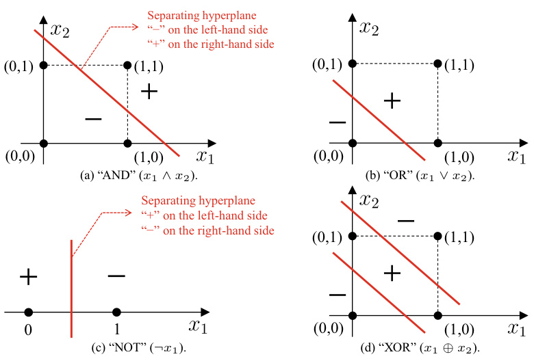  
Fig. 5.4 ‘‘AND’’, ‘‘OR’’, and ‘‘NOT’’are linearly separable problems. ‘‘XOR’’ is a nonlinearly separable problem  

  
Fig. 5.5 A two-layer perceptron that solves the ‘‘XOR’’ problem  

not connected. Neural networks following such a structure are known as  multi-layer feedforward neural networks , in which the input layer receives external signals, the hidden and out- put layers process the signals, and the output layer outputs the processed signals. In other words, the input layer has no pro- cessing function but only receives the input, whereas the hidden and output layers have functional neurons. Since only two lay- ers are functional, the neural network in  .  Figure 5.6 a is often called ‘‘two-layer neural network’’. To avoid ambiguity, we call it ‘‘single hidden layer neural network’’ in this book. For neu- ral networks with at least one hidden layer, we call them multi- layer neural networks. The learning process of neural networks is about learning from the training data to adjust the  connec- tion weights  among neurons and the thresholds of functional neurons. In other words, the ‘‘knowledge’’ learned by neural networks is in the connection weights and thresholds.  

That is, the weights of the connections between neurons.  

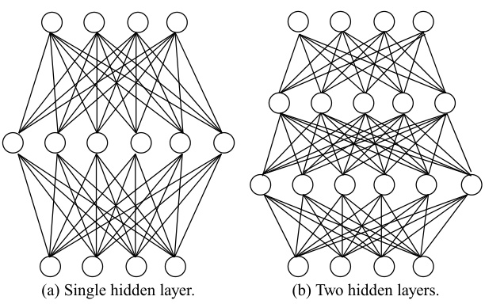  
Fig. 5.6 Muti-layer feedforward neural networks  

## 5.3  Error Backpropagation Algorithm  

The learning ability of multi-layer neural networks is much stronger than single-layer perceptrons. Nevertheless, strong learning ability requires more powerful learning algorithms rather than the simple method of ( 5.1 ). Among them, the  error Backpropagation  (BP) algorithm is a representative and by far the most successful neural network learning algorithm, which trained most neural networks in real-world applications. The BP algorithm can train not only feedforward neural networks but also other types of neural networks, such as recurrent neu- ral networks (Pineda  1987 ). However, ‘‘BP neural networks’’ usually refer to feedforward neural networks trained with the BP algorithm.  

Discrete attributes require pre-processing. If there is an ordinal relationship between attribute values, the attribute can be easily converted to continuous values. Otherwise it is usually converted into a  $k$  -dimensional vector, where  $k$   is the number of attribute values. See Sect.  3.2 .  

Next, let us take a closer look at the BP algorithm. Given a i  $D=\{({\pmb x}_{1},{\pmb y}_{1}),({\pmb x}_{2},{\pmb y}_{2}),.\,.\,.\,,({\pmb x}_{m},{\pmb y}_{m})\}$  , where  $\pmb{x}_{i}\in$   $\mathbb{R}^{d}$  ,  $\mathbf{\bar{\mathbf{\sigma}}}_{\mathbf{\mathit{y}}_{i}}\mathbf{\bar{\mathbf{\sigma}}}_{\mathbf{\mathit{\in}}}\mathbb{R}^{l}$   ∈ ,thatis,t einputsampleisdescribedby  $d$   attributes and the output is an  l -dimensional real-valued vector. For ease of discussion,    $\circ$   Figure 5.7  shows a multi-layer feedforward neural network with    $d$   input neurons,  $l$   output neurons, and    $q$  hidden neurons. Let    $\theta_{j}$   denote the threshold of the  $j^{\cdot}$  th neuron in the output layer,    $\gamma_{h}$   denote the threshold of the  h th neuron in the hidden layer,  $\nu_{i h}$   denote the connection weight between the  i th neuron of the input layer and the  h th neuron of the hidden layer,  $w_{h j}$  denote the connection weight between the  h th neuron of the hidden layer and the  $j$  th neuron of the output layer,    $\begin{array}{r}{\alpha_{h}\:=\:\sum_{i=1}^{d}\nu_{i h}x_{i}}\end{array}$   denote the input received by the  h th = neuron in the hidde layer, and    $\begin{array}{r}{\beta_{j}=\sum_{h=1}^{q}w_{h j}b_{h}}\end{array}$   denote t = input received by the  j th neuron in the output layer, where  $b_{h}$  is the output of the  h  neuron in the hidden layer. Suppose the neurons in both the hidden layer and output layer employ the sigmoid function, which was given in    $^{\circ}$   Figure   $5.2{\mathfrak{b}}$  .  

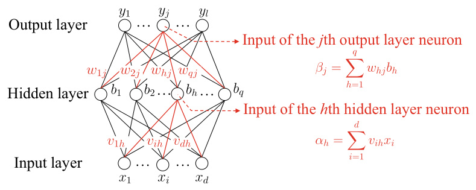  
Fig. 5.7 Notations of BP neural networks  

For training sample    $({\pmb x}_{k},{\pmb y}_{k})$  , suppose the neural network outputs    $\hat{\mathbf{y}}_{k}=(\bar{\hat{y}}_{1}^{k},\hat{y}_{2}^{k},\dots,\hat{y}_{l}^{k})$  , that is,  

$$
\hat{y}_{j}^{k}=f(\beta_{j}-\theta_{j}),
$$  

then the MSE of the neural network on sample    $({\pmb x}_{k},{\pmb y}_{k})$   is  

$$
E_{k}=\frac{1}{2}\sum_{j=1}^{l}(\hat{y}_{j}^{k}-y_{j}^{k})^{2}.
$$  

Adding   $1/2$  is for the convenience of subsequent calculations.  

The neural network in  $\circ$   Figure 5.7  has    $(d+l+1)q+$   $l$   parameters to be determined, including    $d\times q$   connection weights from the input layer to the hidden layer,    $q\times l$   con- nection weights from the hidden layer to the output layer,    $q$  thresholds of the hidden layer neurons, and  $l$   thresholds of the output layer neurons. BP is an iterative learning algorithm, and each iteration employs the general form of perceptron learning rule to estimate and update the parameter, that is, similar to ( 5.1 ), the update rule of any parameter  $\nu$   is  

$$
\nu\leftarrow\nu+\Delta\nu.
$$  

Next, we take the connection weight    as an example to  $w_{h j}$  demonstrate the derivation.  

The BP algorithm employs the  gradient descent  method and tunes the parameters toward the direction of the negative gra- dient of the objective. For the error    $E_{k}$   in ( 5.4 ) and learning rate  $\eta$  , we have  

See Appendix  B.4  for the gradient descent method.  

$$
\Delta w_{h j}=-\eta\frac{\partial E_{k}}{\partial w_{h j}}.
$$  

Note that  $w_{h j}$   first influences the input value  $\beta_{j}$   of the  j th output layer neuron, then the output value    $\hat{y}_{j}^{k}$  , and finally, the error  $E_{k}$  . Hence, we have  

The ‘‘Chain rule’’.  

$$
\frac{\partial E_{k}}{\partial w_{h j}}=\frac{\partial E_{k}}{\partial\hat{y}_{j}^{k}}\cdot\frac{\partial\hat{y}_{j}^{k}}{\partial\beta_{j}}\cdot\frac{\partial\beta_{j}}{\partial w_{h j}}.
$$  

From the definition of    $\beta_{j}$  , we have  

$$
\frac{\partial\beta_{j}}{\partial w_{h j}}=b_{h}.
$$  

The sigmoid function in  $\circ$   Figure 5.2  has the following nice property:  

$$
f^{\prime}(x)=f(x)(1-f(x)).
$$  

Hence, from ( 5.4 ) and ( 5.3 ), we have  

$$
\begin{array}{l}{g_{j}=-\displaystyle\frac{\partial E_{k}}{\partial\hat{y}_{j}^{k}}\cdot\frac{\partial\hat{y}_{j}^{k}}{\partial\beta_{j}}}\\ {\quad=-(\hat{y}_{j}^{k}-y_{j}^{k})f^{\prime}(\beta_{j}-\theta_{j})}\\ {\quad=\hat{y}_{j}^{k}(1-\hat{y}_{j}^{k})(y_{j}^{k}-\hat{y}_{j}^{k}).}\end{array}
$$  

By substituting ( 5.10 ) and ( 5.8 ) into ( 5.7 ), and then into ( 5.6 ), we have the update rule of    $w_{h j}$   as  

$$
\Delta w_{h j}=\eta g_{j}b_{h}.
$$  

Similarly we can derive  

$$
\begin{array}{r}{\Delta\theta_{j}=-\eta g_{j},}\end{array}
$$  

$$
\begin{array}{r c l}{{}}&{{}}&{{\Delta\nu_{i h}=\eta e_{h}x_{i},}}\\ {{}}&{{}}&{{}}\\ {{}}&{{}}&{{\Delta\gamma_{h}=-\eta e_{h},}}\end{array}
$$  

where  

$$
\begin{array}{r l r}{\lefteqn{e_{h}=-\frac{\partial E_{k}}{\partial b_{h}}\cdot\frac{\partial b_{h}}{\partial\alpha_{h}}}}\\ &{}&{=-\sum_{j=1}^{l}\frac{\partial E_{k}}{\partial\beta_{j}}\cdot\frac{\partial\beta_{j}}{\partial b_{h}}f^{\prime}(\alpha_{h}-\gamma_{h})}\end{array}
$$  

$$
\begin{array}{l}{{\displaystyle=\sum_{j=1}^{l}w_{h j}g_{j}f^{\prime}(\alpha_{h}-\gamma_{h})}}\\ {{\displaystyle=b_{h}(1-b_{h})\sum_{j=1}^{l}w_{h j}g_{j}.}}\end{array}
$$  

The learning rate    $\eta~\in~(0,1)$   controls the step size of the update in each round. An overly large learning rate may cause fluctuations, whereas a too small value leads to slow conver- gence. For fine-tuning purposes, we can use  $\eta_{1}$   for ( 5.11 ) and ( 5.12 ) and  $\eta_{2}$   for ( 5.13 ) and ( 5.14 ), where    $\eta_{1}$   and  $\eta_{2}$   could take different values.  

$\eta=0.1$   is a typical choice.  

The workflow of the BP algorithm is illustrated in .  Algorithm 5.1 . For each training sample, the BP algorithm executes the following operations: feeding each input sample to the input layer neurons, and then forwarding the signals layer by layer until the output layer produces results; then, the error of the output layer is calculated(lines 4 – 5 )and propagated back to the hidden layer neurons (line  6 ) for adjusting the connection weights and thresholds (line  7 ). The BP algorithm repeats the above operations until the termination condition is met, e.g., a small training error.  .  Figure 5.8  shows the BP algorithm running on a watermelon data set with five samples and two features. It shows how the parameters and decision boundaries change in different rounds.  

Algorithm 5.1  Error Backpropagation  

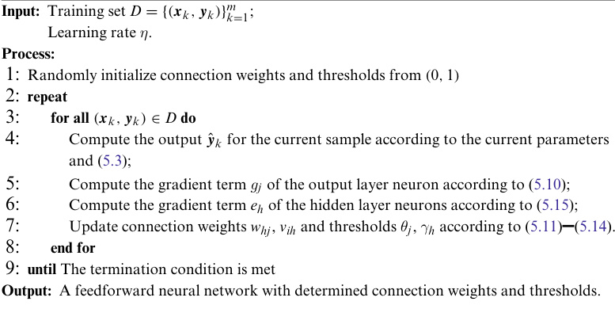  

The BP algorithm aims to minimize the accumulated error on the training set    $D$  

$$
E={\frac{1}{m}}\sum_{k=1}^{m}E_{k}.
$$  

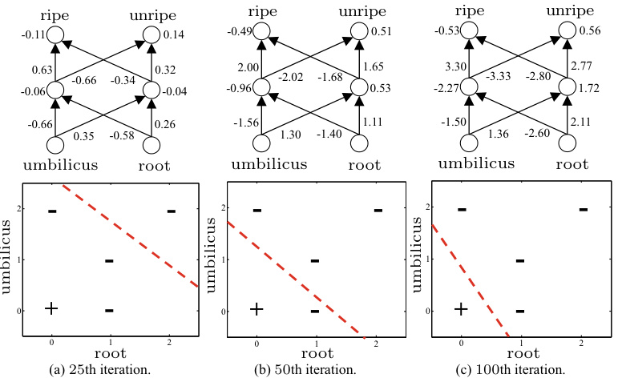  
Fig. 5.8 The changes of parameters and decision boundaries of a BP neural network running on a watermelon data set with five samples and two features  

A full scan of the training set is called  one round  of learning, also known as  one epoch .  

The difference between the standard BP algorithm and the accumulated BP algorithm is similar to the difference between the stochastic gradient descent (SGD) algorithm and the standard gradient descent algorithm.  

However, the ‘‘standard BP algorithm’’ introduced above uses only one training sample at a time to update the connection weights and thresholds. In other words, the update rules in .  Algorithm 5.1  are derived from the error    $E_{k}$   of individual samples. If we use a similar method to derive the update rules of minimizing the accumulated error, then we have the  accu- mulated error backpropagation  algorithm. Both the standard and accumulated BP algorithms are commonly used in prac- tice. Generally speaking, the parameters in the standard BP algorithm are updated frequently since each update uses one sample,and hence the updates of different samples may‘‘offset’’ each other. As a result, the standard BP algorithm often needs more iterations to achieve the same minimum error as the accumulated BP algorithm does. By contrast, the accumulated BP algorithm minimizes the accumulated error directly, and it tunes parameters less frequently since it tunes once after a full scan of the training set  $D$  . However, in some tasks, especially when the training set  $D$   is large, the accumulated BP algorithm can become slow after the accumulated error decreases to a cer- tain level. In contrast, the standard BP algorithm can achieve a reasonably good solution quicker.  

Hornik et al. ( 1989 ) proved that a feedforward neural net- work consisting of a single hidden layer with sufficient neu- rons could approximate continuous functions of any complex- ity up to arbitrary accuracy. However, there is yet no princi- pled method for setting the number of hidden layer neurons, and  trial-by-error  is usually used in practice.  

Along with the strong expressive power, BP neural net- works suffer from overfitting, that is, the training error decreases while the testing error increases. There are two gen- eral strategies to alleviate the overfitting problem of BP neu- ral networks. The first strategy is  early stopping : dividing the data into a training set and a validation set, where the train- ing set is for calculating the gradient to update the connection weights and thresholds, and the validation set is for estimating the error. Once the training error decreases while the validation error increases, the training process stops and returns the con- nection weights and thresholds corresponding to the minimum validation error. The other strategy is  regularization  (Barron 1991 , Girosi et al.  1995 ): the main idea is to add a regulariza- tion term to the objective function, describing the complexity of neural network (e.g., the sum of squared connection weights and thresholds). Let    $E_{k}$   denote the error on the  $k$  th training sample and  $w_{i}$   denote the connection weights and thresholds, then the error objective function ( 5.16 ) becomes  

Neural networks with regularization are very similar to SVM, which will be introduced in Chap.  6 .  

The regularization term makes the training process biased toward smaller connection weights and thresholds so that the output becomes ‘‘smoother’’ and the model is less prone to overfitting.  

$$
E=\lambda\frac{1}{m}\sum_{k=1}^{m}E_{k}+(1-\lambda)\sum_{i}w_{i}^{2},
$$  

where  $\lambda\in(0,1)$   is a trade-off between the empiric  error and the complexity of neural network. The value of  λ  is usually estimated by cross-validation.  

## 5.4  Global Minimum and Local Minimum  

Since    $E$   represents the training error of the neural network, it is a function of the connection weights  w  and thresholds    $\pmb{\theta}$  . From this perspective, the training process of neural networks is a parameter optimization process, that is, searching for the set of parameters in the parameter space that minimizes    $E$  .  

We often talk about two types of optimality: the  local min- imum  and the  global minimu  say    $(\mathbf{w}^{*};\mathbf{\theta}^{*})$   is a local min- imum solution if there exists  $\epsilon>0$   0 such that  

Our discussions here also apply to other machine learning models.  

$$
\begin{array}{r}{E(\mathbf{w};\mathbf{\boldsymbol{\theta}})\geqslant E(\mathbf{w}^{*};\mathbf{\boldsymbol{\theta}}^{*}),\ \forall\ (\mathbf{w};\boldsymbol{\theta})\in\{(\mathbf{w};\boldsymbol{\theta})\mid\left\|(\mathbf{w};\boldsymbol{\theta})-(\mathbf{w}^{*};\boldsymbol{\theta}^{*})\right\|\leqslant\epsilon\}.}\end{array}
$$  

On the other hand,    $(\mathbf{w}^{*};\mathbf{\theta}^{*})$   is the global minimum solution if  $E(\mathbf{w};\mathbf{\theta})\geqslant E(\mathbf{w}^{*};\mathbf{\theta}^{*})$   holds for any    $(\mathbf{w};\mathbf{\theta})$   in the parameter space. Intuitively, a local minimum solution refers to a point in the parameter space that has an error smaller than the errors of the points in its neighborhood. By contrast, the global min-  

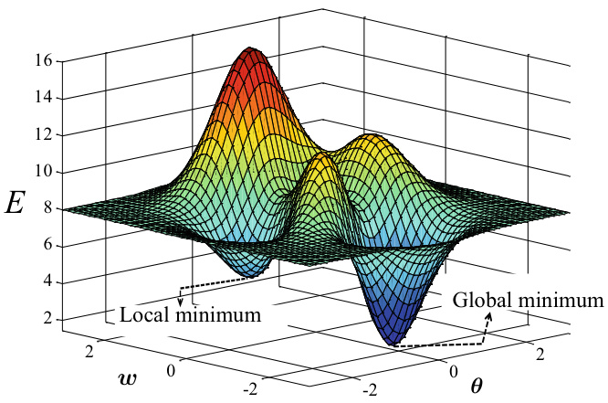  
Fig. 5.9 The global minimum and local minimum  

imum solution refers to the point with an error smaller than that of any other points in the parameter space. The errors  $E(\mathbf{w}^{*};\mathbf{\theta}^{*})$   of these two minimums are called the local mini- mum value and global minimum value of the error function.  

In the parameter space, any point with a zero gradient is a local minimum if its error is smaller than the error of any point in its neighborhood. Though there may exist multiple local minimum values, the global minimum value is always unique. In other words, the global minimum must be a local minimum, but not vice versa. For example,  .  Figure 5.9  shows two local minimums, but only one of them is the global min- imum. The objective of parameter optimization is to find the global minimum.  

The update rules of perceptron ( 5.1 ) and BP ( 5.11 ) – ( 5.14 ) are based on the gradient descent method.  

The most widely used parameter optimization methods are gradient-based search methods. These methods start from an initial solution and search for the optimal parameters itera- tively. In each round, the search direction at the current point is determined by the gradient of the error function. For exam- ple, the gradient descent method takes steps in the direction of the negative gradient since this is the direction that the func- tion value decreases the most. When the gradient turns zero, the search reaches a local minimum and stops since the update term becomes zero. This local minimum is the global minimum if the error function has only one local minimum. On the other hand, if there is more than one local minimum, the solution we found might not be the global minimum, and the parameter optimization is stuck at the local minimum, which is undesir- able.  

Inreal-world applications,we often use the following st rate- gies to ‘‘jump out’’from the local minimum to get closer to the global minimum:  

5  We can use different sets of parameters to initialize mul- tiple neural networks and take the one with the smallest error. Since the search starts from different initial points, we obtain multiple local minimums, and the smallest one among them is a closer estimation of the global minimum. 5  We can use the  simulated annealing  technique (Aarts and Korst  1989 ), which accepts a worse solution at a certain probability, and hence it can jump out from the local minimum. To maintain the algorithm’s stability, we pro- gressively decrease the probability of accepting suboptimal solutions as the search proceeds. 5  We can use the stochastic gradient descent method, which introduces random factors to the gradient calculations rather than the exact calculations used in the standard gra- dient descent method. With random factors, the gradient may not be zero even if it is a local minimum, that is, there is a chance to jump out from the local minimum.  

Besides, the  genetic algorithm  (Goldberg  1989 ) is also fre- quently used to train neural networks to better approximate the global minimum. Note that the above techniques for jumping out from local minimums are mostly heuristic methods without theoretical guarantees.  

## 5.5  Other Common Neural Networks  

Due to space limitations, we are unable to cover the numerous neural network models and algorithms, so only several com- monly used neural networks are introduced in the rest of this section.  

### 5.5.1  RBF Network  

Radial Basis Function (RBF) networks (Broomhead and Lowe 1988 )are feed forward neural networks with single hidden layer. It employs the radial basis function as the activation function for hidden layer neurons, and the output layer computes a lin- ear combination of the outputs from the hidden layer neurons. Suppose that the input is a  $d$  -dimensional vector  $\pmb{x}$   and the out- put is a real value, then the RBF network can be expressed as Using multiple hidden layers is also theoretically feasible, but typical RBF networks use single hidden layer.  

$$
\varphi(\pmb{x})=\sum_{i=1}^{q}w_{i}\rho(\pmb{x},\pmb{c}_{i}),
$$  

where    $q$   is the number of hidden layer neurons, and    $\mathbf{\Delta}c_{i}$   and  $w_{i}$   are, respectively, the center and the weight of the  i th hid- den layer neuron.    $\rho(\pmb{x},\pmb{c}_{i})$   is the radial basis function, which is a radially symmetric scalar function, generally defined as a monotonic function based on the Euclidean distance between the sample  $\pmb{x}$   and the data centroid    $\mathbf{\Delta}c_{i}$  . The commonly used Gaussian radial basis function is in the form of  

$$
\rho({\pmb x},{\pmb c}_{i})=e^{-\beta_{i}\|{\pmb x}-{\pmb c}_{i}\|^{2}}.
$$  

Park and Sandberg ( 1991 ) proved that an RBF network with sufficient hidden layer neurons can approximate continuous functions of any complexity up to arbitrary accuracy.  

RBF networks are typically trained with two steps. The first step is to identify the neuron center  $\mathbf{\Delta}c_{i}$   using methods such as random sampling and clustering, and the second step is to determine the parameters  $w_{i}$  and    $\beta_{i}$   using BP algorithms.  

### 5.5.2  ART Network  

Competitive learning  is a commonly used unsupervised learning strategy in neural networks. In this strategy, the neurons com- pete with each other, and only one of them will be the winner who can be activated while others become inactivated. Such a mechanism is also known as the ‘‘winner-take-all’’ principle.  

Pattern class can be regarded as the ‘‘sub-class’’ of a class.  

The ‘‘winner-take-all’’ principle.  

Adaptive Resonance Theory (ART) networks (Carpenter and Grossberg  1987 ) are an important representative of com- petitive learning. An ART network consists of four major com- ponents, namely the comparison layer, the recognition layer, the reset module, and the recognition threshold (a.k.a. vigi- lance parameter). Among them, the comparison layer accepts input samples and passes information to the recognition layer neurons. Each neuron in the recognition layer corresponds to a pattern class, and the number of neurons can be dynamically increased in the training process to incorporate new pattern classes.  

After receiving a signal, the recognition layer neurons com- pete with each other to become the winner neuron. The sim- plest way of competition is to calculate the distance between the input vector and the representation vector of the pattern class in each recognition layer neuron. The winner neuron is the one with the shortest distance, and it suppresses the acti- vation of other neurons in the recognition layer by sending them signals. When the similarity between the input sample and the representation vector of the winner neuron exceeds the recognition threshold, the input sample is classified as the class of the representation vector. In the meantime, the connection weights are updated such that this winner neuron is more likely to win future input samples that are similar to the current sam- ple. However, if the similarity does not exceed the recognition threshold, then the reset module will create a new neuron in the recognition layer and initialize the representation vector of it to the input vector.  

The recognition threshold has a significant impact on the performance of ART networks. When the recognition thresh- old is large, the input samples are divided into more fine- grained pattern classes. On the other hand, a small recognition threshold leads to fewer and coarse-grained pattern classes.  

ART networks offer a solution to the  stability-plasticity dilemma  in competitive learning, where plasticity refers to the ability to learn new knowledge, and stability refers to the abil- ity to maintain existing knowledge. This property gives ART networks an important advantage to be able to perform  incre- mental learning  and  online learning .  

ART networks in the early days can only handle input data of Boolean type. Later on, ART networks evolved into a family of algorithms, such as ART2 networks that can han- dle real-valued inputs, FuzzyART networks that incorporate fuzzy processing, and ARTMAP networks that can perform supervised learning.  

### 5.5.3  SOM Networks  

Self-Organizing Map (SOM) networks (Kohonen  1982 ) are unsupervised neural networks based on competitive learning. An SOM network can map high-dimensional input data to low- dimensional space (typically two-dimensional) while preserv- ing the topological structure of the data in high-dimensional space, that is, mapping samples that are similar in the high- dimensional space to neighborhood neurons in the output layer.  

Incremental learning refers to the learning of new samples after a model has already been trained. In other words, the model can update incrementally with the new samples without re-training the whole model, and the useful information that has been previously learned will not be overridden. Online learning refers to the learning of new samples one by one. Online learning is a special case of incremental learning, and incremental learning can be regarded as batch-mode online learning.  

Also known as Self-Organizing Feature Map and Kohonen Network.  

As illustrated in  .  Figure 5.10 , neurons in the output layer are placed like a matrix in the two-dimensional space. Each neuron has a weight vector that is used to determine the winner neuron based on the input vector, that is, the neuron with the  

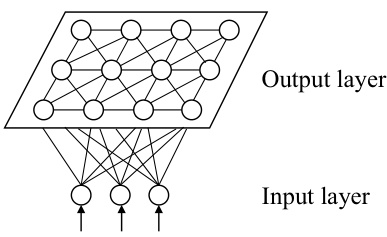  

highest similarity wins. The objective of SOM training is to find the appropriate weight vector for each neuron in the output layer such that the topological structure is preserved.  

The training process of SOM is simple: upon the arrival of a new sample, each neuron in the output layer computes the distance from its weight vector to the sample vector, and the neuron with the shortest distance (i.e., the  best matching unit ) wins. Then, the weight vectors of the best matching unit and its surrounding neurons will be updated toward the current input sample. This process repeats until converge.  

### 5.5.4  Cascade-Correlation Network  

The ART network introduced in Sect.  5.5.2  is also a constructive network since its recognition neurons are dynamically added.  

Typical neural networks have fixed network structures, and the purpose of training is to determine the appropriate parameters such as connection weights and thresholds. Constructive net- works, however, consider the construction of network struc- ture as one of the learning objectives, that is, identifying the best network structure that fits the training data. A represen- tative constructive network is the Cascade-Correlation Net- work (Fahlman and Lebiere  1990 ).  

Cascade-Correlation networks have two major components, namely ‘‘Cascading’’ and ‘‘Correlation’’. Cascading refers to the establishment of a hierarchy with hierarchical connections. At the beginning of training, the network has the minimum topology, that is, only an input layer and an output layer. As the training progresses, as shown in  .  Figure 5.11 , new hidden neurons are gradually added to create a hierarchy. When a new hidden layer neuron is added, its input connection weight will be fixed. Correlation refers to training-related parameters by maximizing the correlation between the output of new neurons and network errors.  

Since there is no configuration of the number of layers and the number of hidden neurons, cascade-correction networks  

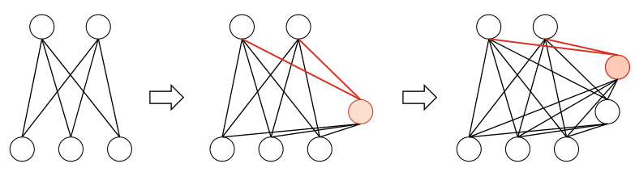  
Fig. 5.11 The training process of a Cascade-Correlation network starts with the initial state and gradually adds the first and the second hidden neurons. When adding a new hidden neuron, the weights shown in red are updated by maximizing the correlation between the new hidden neuron’s output and the network error  

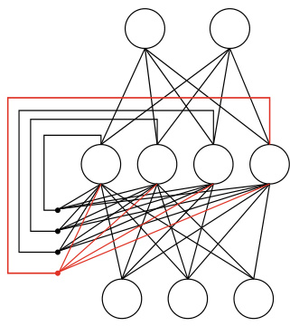  
Fig. 5.12 Elman network  

are faster to train than typical feedforward neural networks. However, cascade-correction networks are prone to overfitting on small data sets.  

### 5.5.5  Elman Network  

Unlike feedforward neural networks, Recurrent Neural Net- works (RNN) permit circular structures, in which the neurons can take output feedback as input signals. Hence, the network’s output at time  t  not only depends on the input at time  t  but also the network status at time    $t\!-\!1$  . Due to this behavior, recurrent neural networks are capable of modeling temporal dynamics.  

Also known as Recursive Neural Networks.  

One of the most widely used recurrent neural networks is the Elman network (Elman  1990 ), which, as illustrated in .  Figure 5.12 , has a similar structure to multi-layer feedfor- ward networks. However, the difference is that the outputs from hidden neurons are reused as the input to hidden neurons at the next iteration, together with signals from input neurons. Typically, hidden neurons in the Elman networks employ sig- moid activation functions, and the networks are trained with generalized BP algorithms (Pineda  1987 ).  

### 5.5.6 Boltzmann Machine  

One type of neural network model defines an  energy  for the state of the network. The network reaches the ideal state when the energy is minimized, and training such a network is to min- imize the energy function. One representative of energy-based models is the Boltzmann Machine (Ackley et al.  1985 ). As illus- trated in  .  Figure 5.13 a, a typical structure of the Boltzmann machines has two layers: the visible layer and the hidden layer. The visible layer is for representing data input and output, while the hidden layer is understood as the intrinsic represen- tation of the data. Neurons in the Boltzmann machines are Boolean-typed, that is, 0 for inactivated and 1 for activated. Let  $s\,\in\,\{0,\,1\}^{n}$    denote the states of    $n$  neurons,  $w_{i j}$   denote the con- nection weight between neuron  i  $i$   and neuron  $j$  , and    $\theta_{i}$   denote the threshold of neuron    $i$  . Then, the energy of the Boltzmann machine corresponding to the state vector    $\pmb{S}$   is defined as  

$$
E(s)=-\sum_{i=1}^{n-1}\sum_{j=i+1}^{n}w_{i j}s_{i}s_{j}-\sum_{i=1}^{n}\theta_{i}s_{i}.
$$  

The Boltzmann distribution is also known as equilibrium or stationary distribution.  

If the neurons are updated in arbitrary order independent of the inputs, then the network will eventually reach a Boltz- mann distribution, in which the probability of having the state vector  $\pmb{S}$   is solely determined by its energy and the energies of all possible state vectors:  

$$
P(s)={\frac{e^{-E(s)}}{\sum_{t}e^{-E(t)}}}.
$$  

Then, the training of a Boltzmann machine is to regard each training sample as a state vector and maximize its probability. Since the standard Boltzmann machines are fully connected graphs with high complexity, they are impractical to use in real-world applications. In practice, we often use the restricted Boltzmann machines instead. As illustrated in  .  Figure 5.13 b, a restricted Boltzmann machine keeps only the connections between the visible layer and the hidden layer and simplifies the network structure to a bipartite graph.  

The restricted Boltzmann machines are often trained using the Contrastive Divergence (CD) algorithm (Hinton  2010 ). Let  $d$   denote the number of visible neurons,    $q$   denote the number of hidden neurons, and    $\mathbf{v}$   and  $h$   denote the state vectors of the visible layer and the hidden layer, respectively. Since there is  

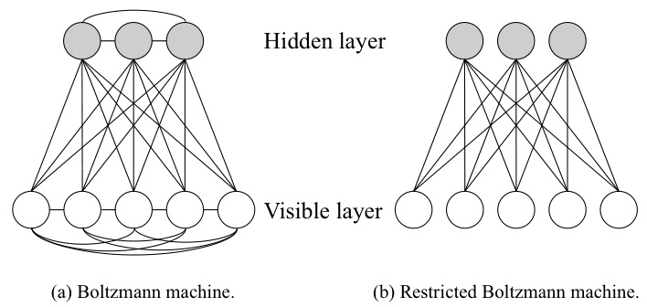  
Fig. 5.13 Boltzmann machine and restricted Boltzmann machine  

no connection within the same layer, we have  

$$
P(\mathbf{v}\mid\pmb{h})=\prod_{i=1}^{d}P(\nu_{i}\mid\pmb{h}),
$$  

$$
P(\pmb{h}\mid\mathbf{v})=\prod_{j=1}^{q}P(h_{j}\mid\mathbf{v}).
$$  

For each training sample  $\mathbf{v}$  , the CD algorithm first computes the probability distribution of hidden neurons using ( 5.23 ) and then obtains  $h$   by sampling from this distribution. Thereafter, similarly,  $\mathbf{v}^{\prime}$    is generated from    $\pmb{h}$   according to ( 5.22 ), and  $h^{\prime}$    is further generated from  $\mathbf{v}^{\prime}$  . Then, the connection weight can be updated by  

The threshold can be updated similarly.  

$$
\Delta w=\eta\left(\mathbf{v}\pmb{h}^{\top}-\mathbf{v}^{\prime}\pmb{h}^{\prime\top}\right).
$$  

## 5.6 Deep Learning  

In theory, a model with more parameters has a larger  capacity and, consequently, is more capable of handling complex learn- ing tasks. In practice, however, complex models are not favored since they are often slow to train and are prone to overfitting. Fortunately, since we have entered the age of cloud computing and big data, the significant improvement of computing power has enabled efficient training, while the big data reduces the risk of overfitting. Since the major barriers of complex models are alleviated, complex models, represented by  deep learning , have begun to attract attention.  

Typically, a deep learning model is a neural network with many layers. For neural networks, a simple method of increas- ing the model capacity is to add more hidden layers, which corresponds to more parameters such as connection weights and thresholds. The model complexity can also be increased by simply adding more hidden neurons since we have seen pre- viously that a multi-layer feedforward network with a single hidden layer already has very strong learning ability. How- ever, to increase model complexity, adding more hidden layers is more effective than adding hidden neurons since more layers not only imply more hidden neurons but also more nesting of activation functions. Multi-hidden layers neural networks are difficult to train directly with classic algorithms (such as the standard BP algorithm), because errors tend to diverge and fail to converge to a stable state when backpropagating within the multi-hidden layers.  

See Chap.  12  for the capacity of learners.  

Large-scale deep learning model can contain tens of billions of parameters.  

Here, ‘‘multi-hidden layers’’ refer to three or more hidden layers. Deep learning models typically have eight or nine, or even more hidden layers.  

One effective method of training neural networks with multi-hidden layers is  unsupervised layer-wise training , in which the hidden layers are trained one by one, that is, the outputs of the previous hidden layer are used as the inputs to train the current hidden layer, and this process is known as  pre-training . Following pre-training,  fine-tuning  is performed on the whole network. For example, in a Deep Belief Network (DBN) (Hin- ton et al.  2006 ), each layer is a restricted Boltzmann machine, that is, the network is a stack of multiple RBM models. In unsu- pervised layer-wise training, the first hidden layer is trained in the same way as in the standard RBM training. Then, the pre-trained neurons of the first hidden layer are used as the input neurons for the second hidden layer, and so on. Once pre-training is completed for each layer, the entire network is trained with BP algorithms.  

We can view ‘‘pre-training   $^+$   fine-tuning’’ as splitting the parameters into groups and then optimizing the parameters in each group locally. The locally optimized parameters are then joint together to search for the global optimum. This approach reduces the training cost without sacrificing the free- dom offered by a large number of parameters.  

Recently, the sigmoid activation function in CNN is often replaced with the linear rectifier function  

$$
f(x)={\left\{\begin{array}{l l}{0,}&{{\mathrm{if~}}x<0;}\\ {x,{\mathrm{~otherwise}},}\end{array}\right.}
$$  

and such neurons are called Rectified Linear Unit (ReLU). Besides, the typical operations in the pooling layer are ‘‘max’’ and ‘‘mean’’, which are similar to the operations in ensemble learning. See Sect.  8.4 .  

Another strategy for saving the training cost is  weight shar- ing , in which a set of neurons share the same connection weight. This strategy plays an important role in Convolutional Neu- ral Networks (CNN) (LeCun and Bengio  1995 , LeCun et al. 1998 ). To demonstrate the idea, let us take a look at how CNN is applied to the task of handwritten character recog- nition (LeCun et al.  1998 ). As illustrated in  .  Figure 5.14 , the input is a  $32\times32$   image of a handwritten digit, and the output is the recognition result. A CNN combines multiple  convolutional layers  and  pooling layers  to process the input signals and ends the mapping to the output result with the fully connected lay- ers. Each convolutional layer contains multiple  feature maps , where each feature map is a ‘‘plane’’consisting of multiple neu- rons. We can regard a feature map as a convolutional filter that performs convolution operations on the input matrix to extract convolved features. For example, the first convolutional layer in  $^{\circ}$   Figure 5.14  consists of six feature maps, where each fea- ture map is a   $28\times28$   matrix of neurons, and ea uron is responsible for extracting the local feature of a 5  $5\times5$   ×  5 region using the convolutional filter. The function of pooling layers is to use local correlations to perform sampling such that the data volume is reduced while useful information is preserved. For example, the first pooling layer in    $^{\circ}$  Figure 5.14  contains six feature maps with the size of   $14\times14$  , where each neuron on the feature map computes its output using a  $2\times2$   region on the feature map of the previously convolutional layer. The original image is mapped into a 120-dimensional feature vector through  

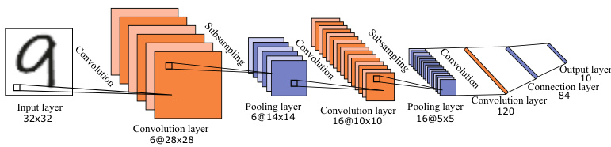  
Fig. 5.14 Handwritten character recognition using CNN (LeCun et al.  1998 )  

combinations of convolutional layers and pooling layers, and finally, a connection layer composed of 84 neurons and an out- put layer are connected to complete the recognition task. CNN can be trained using BP algorithms. However, in both convolu- tional layers and pooling layers, each set of neurons (i.e., each ‘‘plane’’ in  .  Figure 5.14 ) shares the same connection weights so that the number of parameters is significantly reduced.  

There is another perspective to understand deep learning. No matter it is a DBN or a CNN, the mechanisms are the same, that is, using multiple hidden layers to process infor- mation layer by layer. This mechanism can be viewed as pro- gressively converting the original input representation, which is not closely related to the targeted output, into a representa- tion that is closely related to the targeted output. By doing so, the mapping task of the final output layer, which used to be difficult, becomes feasible. In other words, through multi-layer processing, the low-level feature representations are converted into the high-level feature representations, which can be used by simple models for complex classifications. Therefore, deep learning can also be viewed as  feature learning  or  representation learning .  

In the past, real-world applications often require human experts to design features, known as  feature engineering . Though the features, good or bad, are vital for the general- ization ability, it is often not easy to design good features even for human experts. As feature learning can produce good fea- tures via machine learning, we are one more step toward ‘‘fully automated data analytics’’.