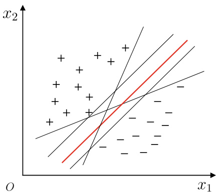
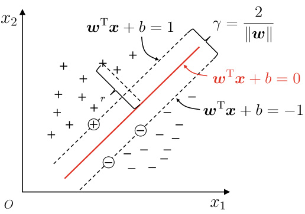
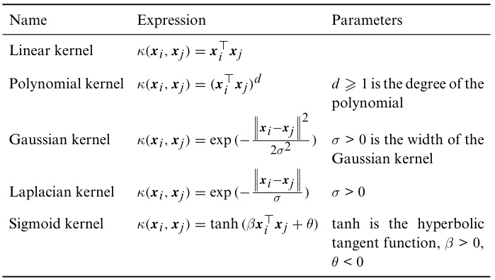
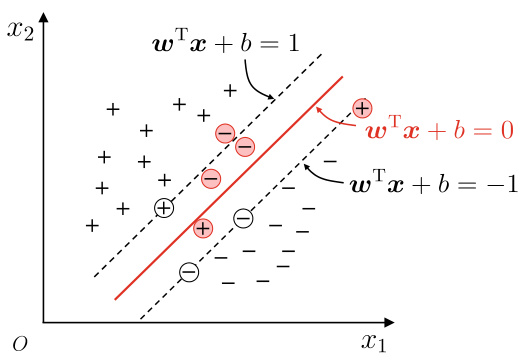
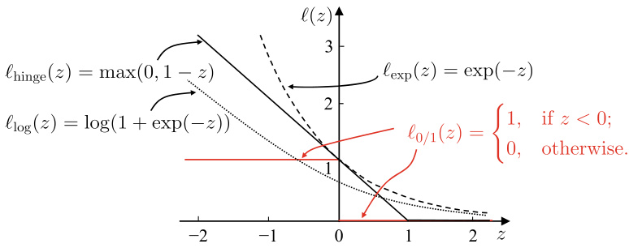
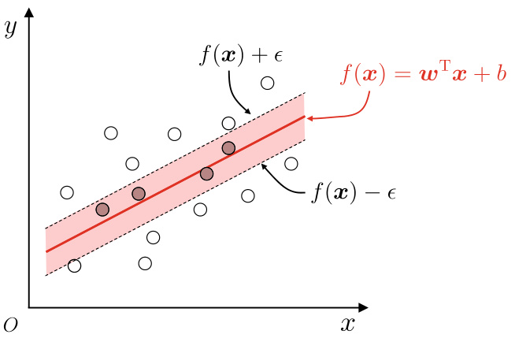
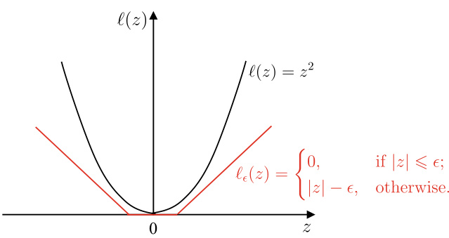

# Support Vector Machine  

## 6.1  Margin and Support Vector  

Given a training set    $D\ =\ \{(\pmb{x}_{1},y_{1}),(\pmb{x}_{2},y_{2}),.\,.\,.\,,(\pmb{x}_{m},y_{m})\},$  where  $y_{i}\in\{-1,+1\}$  . The basic idea of classification is to utilize the training set  D  to find a separating hyperplane in the sample space that can separate samples of different classes. However, there could be multiple qualified separating hyperplanes, as shown in    $^{\circ}$   Figure 6.1 , which one should be chosen?  

Intuitively, we should choose the one right in the middle of two classes, that is, the red one in  .  Figure 6.1 , since this separating hyperplane has the best ‘‘tolerance’’ to local data perturbation. For example, the samples not in the training set could be closer to the decision boundary due to the noises or limitations of the training set. As a result, many separating hyperplanes that perform well on the training set will make mistakes,whereas the red hyper plane is less likely to be affected. In other words, this separating hyperplane has the strongest generalization ability and the most robust classification results.  

A separating hyper plane in the sample space can be expressed as the following linear function:  

$$
{\pmb w}^{\top}{\pmb x}+b=0,
$$  

where  $\boldsymbol{w}=(w_{1};w_{2};.\.\,;w_{d})$   is the normal vector which con- trols the direction of the hyperplane, and  b  is the bias which controls the distance between the hyperplane and the origin. The normal vector    $\pmb{w}$   and the bias    $b$   determine the separating hyperplane, denoted by    $(w,b)$  . The distance from any point  $\pmb{x}$  in the sample space to the hyperplane    $(w,b)$   can be written as  

See Exercise  6.1 .  

$$
r={\frac{|{\boldsymbol{w}}^{\top}{\boldsymbol{x}}+b|}{\|{\boldsymbol{w}}\|}}.
$$  

  
Fig. 6.1 More than one hyperplanes can separate the training samples  

  
Fig. 6.2 Support vectors and margin  

Suppose the hyperplane    $(w,b)$   can correctly classify the traini les, th  $(x_{i},y_{i})\in D$  s  $\mathbf{\bar{\Psi}}\mathbf{\pmb{w}}^{\top}\mathbf{\pmb{x}}_{i}+\mathbf{\dot{b}}>0$  when  $y_{i}=+1$  1, and  $\pmb{w}^{\top}\pmb{x}_{i}+b<0$   0 when  $y_{i}=-1$  1. Let  

$$
\begin{array}{r}{\left\{\begin{array}{l l}{w^{\top}x_{i}+b\geqslant+1,\quad y_{i}=+1,}\\ {w^{\top}x_{i}+b\leqslant-1,\quad y_{i}=-1.}\end{array}\right.}\end{array}
$$  

As illustrated in  $^{\circ}$   Figure 6.2 , the equality in ( 6.3 ) holds for the sample points closest to the hyperplane, and these sample points are called  support vectors . The total distance from two support vectors of different classes to the hyperplane is  

If the hyperplane    $(\pmb{w}^{\prime},\pmb{b}^{\prime})$   can correctly classify the training samples, then there always exists a scaling transformations

  $\varsigma\boldsymbol{w}\mapsto\boldsymbol{w}^{\prime}$    and    $\varsigma b\mapsto b^{\prime}$    such that

 ( 6.3 ) holds.  

Each sample point corresponds to a feature vector.  

$$
\gamma={\frac{2}{\|w\|}},
$$  

which is called  margin .  

Finding the separating hyperplane with the  maximum mar- gin  is equivalent to finding the parameters    $\pmb{w}$   and    $b$   that maxi- mize  $\gamma$   subject to the constraints in ( 6.3 ), that is  

$$
\begin{array}{r l}&{\displaystyle\operatorname*{max}_{\boldsymbol{w},b}~~\frac{2}{\|\boldsymbol{w}\|}}\\ &{~~\mathrm{s.t.}~y_{i}(\boldsymbol{w^{\top}}\boldsymbol{x}_{i}+b)\geqslant1,\quad i=1,2,\ldots,m.}\end{array}
$$  

The margin can be optimized by maximizing    $\|\pmb{w}\|^{-1}$  , which is equivalent to minimizing    $\|w\|^{2}$  . Hence, we can rewrite ( 6.5 ) as  

$$
\begin{array}{r l}&{\displaystyle\operatorname*{min}_{\boldsymbol{w},b}~~\frac{1}{2}\left\|\boldsymbol{w}\right\|^{2}}\\ &{~\mathrm{s.t.}~y_{i}(\boldsymbol{w^{\top}}\boldsymbol{x}_{i}+b)\geqslant1,\quad i=1,2,\ldots,m.}\end{array}
$$  

It appears that the margin only depends on  $w$  , but    $b$   also implicitly changes the margin by influencing  $w$   through the constraints.  

This is the primal form of Support Vector Machine (SVM).  

## 6.2  Dual Problem  

We wish to solve ( 6.6 ) to obtain the maximum margin separat- ing hyperplane model  

$$
f(\pmb{x})=\pmb{w}^{\top}\pmb{x}+b,
$$  

where    $\pmb{w}$   and    $b$   are the model parameters. ( 6.6 ) is a convex quadratic programming problem, which can be solved with existing optimization packages. However, there are more effi- cient methods.  

See Appendix  B.1  for the Lagrange multiplier method.  

Applying Lagrange multipliers to ( 6.6 ) leads to its  dual prob- lem . To be specific, introducing a Lagrange multiplier    $\alpha_{i}\geqslant0$  to each constraint in ( 6.6 ) gives the Lagrange function  

$$
L(\boldsymbol{w},b,\boldsymbol{\alpha})=\frac{1}{2}\,\|\boldsymbol{w}\|^{2}+\sum_{i=1}^{m}\alpha_{i}(1-y_{i}(\boldsymbol{w}^{\top}\boldsymbol{x}_{i}+b)),
$$  

where    $\alpha=(\alpha_{1};\,\alpha_{2};\,.\,.\,;\,\alpha_{m})$  . Set ng the partial derivatives of  $L(\boldsymbol{w},b,\alpha)$   with respect to  w  and  b  to 0 gives  

$$
w=\sum_{i=1}^{m}\alpha_{i}y_{i}\pmb{x}_{i},
$$  

$$
0=\sum_{i=1}^{m}\alpha_{i}y_{i},
$$  

Substituting ( 6.9 ) into ( 6.8 ) eliminates  $\pmb{w}$   from  $L(\boldsymbol{w},b,\alpha)$  . Then, with the constraint ( 6.10 ), we have the dual problem of ( 6.6 ) as  

$$
\begin{array}{r l}&{\displaystyle\operatorname*{max}_{\boldsymbol{\alpha}}~~\sum_{i=1}^{m}\alpha_{i}-\frac{1}{2}\sum_{i=1}^{m}\sum_{j=1}^{m}\alpha_{i}\alpha_{j}y_{i}y_{j}\boldsymbol{x}_{i}^{\top}\boldsymbol{x}_{j}}\\ &{\displaystyle\mathrm{s.t.}~~\sum_{i=1}^{m}\alpha_{i}y_{i}=0,}\\ &{\displaystyle\alpha_{i}\geqslant0,~~~i=1,2,\ldots,m.}\end{array}
$$  

By solving this optimization problem, we obtain    $_{\alpha}$  , and subse- quently  $\pmb{w}$   and  $b$  . Then, we have the desired model  

$$
\begin{array}{r l}&{f(\pmb{x})=\pmb{w}^{\top}\pmb{x}+b}\\ &{\qquad\qquad\qquad=\sum_{i=1}^{m}\alpha_{i}y_{i}\pmb{x}_{i}^{\top}\pmb{x}+b.}\end{array}
$$  

The variable    $\alpha_{i}$   solved from the dual problem ( 6.11 ) is the Lagrange multiplier in ( 6.8 ), corresponding to the train- ing sample    $(x_{i},y_{i})$  . Since ( 6.6 ) is an optimization problem with inequality constraints, it must satisfy the Karush− Kuhn− Tucker (KKT) conditions  

$$
\begin{array}{r}{\left\{\begin{array}{l l}{\alpha_{i}\geqslant0;}\\ {y_{i}f(x_{i})-1\geqslant0;}\\ {\alpha_{i}(y_{i}f(x_{i})-1)=0.}\end{array}\right.}\end{array}
$$  

He y traini ple    $(x_{i},y_{i})$  , we either have    $\alpha_{i}=0$  or  $y_{i}f(\pmb{x}_{i})=1$   =  1. When  $\alpha_{i}=0$   =  0, the sample is not included  e summation in ( 6.12 ) and consequently has no impact on  $f(x)$  . On the other hand, when  $\alpha_{i}>0$  , we have  $y_{i}f(\pmb{x}_{i})=1$  , and the sample point lies on the maximum-margin hyperplanes, that is, it is a support vector . This observation reveals an important property of support vector machines: once the training com- pleted, most training samples are no longer needed since the final model only depends on the support vectors.  

How can we solve ( 6.11 )? This quadratic programming problem can be solved with quadratic programming algo- rithms. However, the computational cost is often high since the complexity is seriously affected by the number of training sam- ples. To overcome this limitation, researchers proposed many efficient algorithms by exploiting the structure of the optimiza- tion problem. Among them, Sequential Minimal Optimization (SMO) (Platt  1998 ) is a celebrated representative.  

See Appendix  B.1  

As pointed out in (Vapnik  1999 ), the naming of support vector reflects the fact that finding the solution using support vectors is the key to such learners. This also implies that the model complexity mainly depends on the number of support vectors.  

See Appendix  B.2  for quadratic programming.  

The basic idea of SMO is to iteratively find the local optimal solutions of    $\alpha_{i}$   by fixing all the other parameters as constants. Due to th cons int    $\textstyle\sum_{i=1}^{m}\alpha_{i}y_{i}=0$   =    $\alpha_{i}$   can be derived from = other fixed variables. Hence, in each iteration, SMO selects two variables  $\alpha_{i}$   and  $\alpha_{j}$   and fixes other parameters. After initializ- ing the parameters, SMO repeats the following two steps until convergence:  

5  Select two variables to be updated:    $\alpha_{i}$   and    $\alpha_{j}$  ; 5  Fix all the parameters and solve ( 6.11 ) to update  $\alpha_{i}$   and  $\alpha_{j}$  .  

The objective value will increase iteratively once any of the selected    $\alpha_{i}$   and    $\alpha_{j}$   violates the KKT conditions ( 6.13 ) (Osuna et al.  1997 ). Intuitively, the larger the magnitude of the KKT conditions being violated, the larger the possible magnitude of the increase of the objective value after updating. Following this idea, SMO should select the most violated variable as the first variable and select the one leading to the fastest increase of the objective value as the second variable. However, since it is computationally expensive to compare the increases of the objective values of variables, SMO takes a heuristic approach: select the two variables whose corresponding samples have the largest distance. Intuitively, since these two variables are very different from each other, they are more likely to lead to a significant update to the objective value compared to those two variables that are similar to each other.  

The efficiency of the SMO algorithm is a result of the effi- cient optimization of two variables by fixing the others. To be specific, if we only consider  $\alpha_{i}$   and    $\alpha_{j}$  , then we can rewrite the constraints in ( 6.11 ) as  

$$
\alpha_{i}y_{i}+\alpha_{j}y_{j}=c,\quad\alpha_{i}\geqslant0,\;\;\alpha_{j}\geqslant0,
$$  

where  

$$
c=-\sum_{k\neq i,j}\alpha_{k}y_{k}
$$  

is a cons nt such that  $\textstyle\sum_{i=1}^{m}\alpha_{i}y_{i}=0$  =  =  0 holds. Eliminating the variable  $\alpha_{j}$   from ( 6.11 ) with  

$$
\alpha_{i}y_{i}+\alpha_{j}y_{j}=c
$$  

leads to a univariate quadratic programming problem, in which the only constraint is    $\alpha_{i}\geqslant0$  . Since this kind of quadratic pro- gramming problems have closed-form solutions, no numerical optimization algorithm is needed to get the new    $\alpha_{i}$   and    $\alpha_{j}$  .  

How can we determine the bias term    $b?$   We notice that there is  $y_{s}f(\pmb{x}_{s})=1$   for every support vector    $(x_{s},y_{s})$  , that is  

$$
y_{s}\left(\sum_{i\in S}\alpha_{i}y_{i}\pmb{x}_{i}^{\top}\pmb{x}_{s}+b\right)=1,
$$  

where    $S=\{i\mid\alpha_{i}>0,i=1,2,.\,.\,.\,.\,,m\}$   is th  index set of all support vectors. Theoretically, we can find  b  by substituting anysupportvectorsto( 6.17 ).Inpractice,amorerobustmethod is taking the average of    $b$   obtained from all support vectors  

$$
b=\frac{1}{|S|}\sum_{s\in S}\left(\frac{1}{y_{s}}-\sum_{i\in S}\alpha_{i}y_{i}\pmb{x}_{i}^{\top}\pmb{x}_{s}\right).
$$  

## 6.3  Kernel Function  

Previous discussions in this chapter assumed the training sam- ples are linearly separable, that is, there exist hyperplanes that can classify all training samples correctly. However, this assumption often does not hold in practice. For example, the exclusive disjunction (i.e., XOR) problem, as shown in .  Figure 6.3 , is not linearly separable.  

In such cases, we can map the samples from the origi- nal feature space to a higher dimensional feature space. That  

  
Fig. 6.3 The XOR problem and non-linear mapping  

way the samples become linearly separable. For example, in  $^{\circ}$   Figure 6.3 , a qualified hyperplane can be found after map- ping the 2-dimensional space to a 3-dimensional space. For- tunately, if the original feature space has a finite number of features, then there must exist a higher dimensional feature space in which the samples are linearly separable.  

Let    $\phi({\pmb x})$   denote the mapped feature vector of    $\pmb{x}$  , then the separating hyperplane model in the feature space can be expressed as  

$$
\boldsymbol{f}(\pmb{x})=\pmb{w}^{\top}\boldsymbol{\phi}(\pmb{x})+\boldsymbol{b},
$$  

where  $\pmb{w}$   and    $b$   are the model parameters. Similar to ( 6.6 ), we have  

$$
\begin{array}{r l}&{\displaystyle\operatorname*{min}_{\boldsymbol{w},b}~~\frac{1}{2}\left\|\boldsymbol{w}\right\|^{2}}\\ &{~\mathrm{s.t.}~y_{i}(\boldsymbol{w}^{\top}\phi(\pmb{x}_{i})+b)\geqslant1,\quad i=1,2,\ldots,m.}\end{array}
$$  

Its dual problem is  

$$
\begin{array}{r l}&{\displaystyle\operatorname*{max}_{\alpha}~~\displaystyle\sum_{i=1}^{m}\alpha_{i}-\frac{1}{2}\displaystyle\sum_{i=1}^{m}\sum_{j=1}^{m}\alpha_{i}\alpha_{j}y_{i}y_{j}\phi(\pmb{x}_{i})^{\top}\phi(\pmb{x}_{j})}\\ &{\mathrm{~s.t.~}\displaystyle\sum_{i=1}^{m}\alpha_{i}y_{i}=0,}\\ &{\displaystyle\alpha_{i}\geqslant0,~~~i=1,2,\ldots,m.}\end{array}
$$  

Solving( 6.21 )involves the calculation of  $\phi({\pmb x}_{i})^{\top}\phi({\pmb x}_{j})$  ,which is the inner product of the mapped feature vectors of    $\pmb{x}_{i}$   and    $\pmb{x}_{j}$  . Since the mapped feature space can have very high or even infi- nite dimensionality, it is often difficult to calculate    $\phi(\pmb{x}_{i})^{\top}\phi(\pmb{x}_{j})$  directly. To avoid this difficulty, we suppose there exists a func- tion in the following form:  

$$
\kappa(\pmb{x}_{i},\pmb{x}_{j})=\left\langle\phi(\pmb{x}_{i}),\phi(\pmb{x}_{j})\right\rangle=\phi(\pmb{x}_{i})^{\top}\phi(\pmb{x}_{j}),
$$  

This is called  kernel trick which says the inner product of    $\pmb{x}_{i}$   and  $\pmb{x}_{j}$   in the feature space can be calculated in the sample space using the function    $\kappa(\cdot,\cdot)$  . With such a function, we no longer need to calculate the inner product in the feature space and can rewrite ( 6.21 ) as  

$$
\begin{array}{r l}&{\displaystyle\operatorname*{max}_{\alpha}~~\displaystyle\sum_{i=1}^{m}\alpha_{i}-\frac{1}{2}\displaystyle\sum_{i=1}^{m}\sum_{j=1}^{m}\alpha_{i}\alpha_{j}y_{i}y_{j}\kappa(\pmb{x}_{i},\pmb{x}_{j})}\\ &{\mathrm{~s.t.~}\displaystyle\sum_{i=1}^{m}\alpha_{i}y_{i}=0,}\\ &{\alpha_{i}\geqslant0,~~~i=1,2,\ldots,m.}\end{array}
$$  

Solving it gives  

$$
\begin{array}{l}{f(\pmb{x})=\pmb{w}^{\top}\phi(\pmb{x})+b}\\ {\quad\quad=\displaystyle\sum_{i=1}^{m}\alpha_{i}y_{i}\phi(\pmb{x}_{i})^{\top}\phi(\pmb{x})+b}\\ {\quad\quad=\displaystyle\sum_{i=1}^{m}\alpha_{i}y_{i}\kappa(\pmb{x},\pmb{x}_{i})+b,}\end{array}
$$  

where    $\kappa(\cdot,\cdot)$   is the  kernel function . From ( 6.24 ), we see that the optimal solution can be expanded by training samples with the kernel functions, and this is known as the  support vector expansion .  

We can derive the kernel function    $\kappa(\cdot,\cdot)$   if we know the details of the mapping    $\phi(\cdot)$  . However,    $\phi(\cdot)$   is often unknown in practice. Then, how do we know if there is a proper kernel function? What kind of functions are valid kernel functions? Let us see the following theorem:  

See (Schölkopf and Smola  2002 ) for the proof.  

Theorem 6.1  (Kernel Function)  Let    $\mathcal{X}$  denote the input space, and  $\kappa(\cdot,\cdot)$   denote a symmetric function defined in    $\mathcal X\times\mathcal X.$  . Then,    $\kappa$  is a kernel function if and only if the kernel matrix    $\mathbf{K}$   is positive semidefinite for any data set   $D=\{\pmb{x}_{1},\pmb{x}_{2},.\,.\,.\,,\pmb{x}_{m}\}$  

$$
\mathbf{K}=\left[\begin{array}{c c c c}{\kappa(\pmb{x}_{1},\pmb{x}_{1})\,\ldots\,\kappa(\pmb{x}_{1},\pmb{x}_{j})\,\ldots\,\kappa(\pmb{x}_{1},\pmb{x}_{m})}\\ {\vdots\,\quad\ddots\,\quad\vdots\,\quad\ddots\,\quad\vdots}\\ {\kappa(\pmb{x}_{i},\pmb{x}_{1})\,\ldots\,\kappa(\pmb{x}_{i},\pmb{x}_{j})\,\ldots\,\kappa(\pmb{x}_{i},\pmb{x}_{m})}\\ {\vdots\,\quad\ddots\,\quad\vdots\,\quad\ddots\,\quad\vdots}\\ {\kappa(\pmb{x}_{m},\pmb{x}_{1})\,\ldots\,\kappa(\pmb{x}_{m},\pmb{x}_{j})\,\ldots\,\kappa(\pmb{x}_{m},\pmb{x}_{m})}\end{array}\right]
$$  

Theorem  6.1  says that every symmetric function with a pos- itive semidefinite kernel matrix is a valid kernel function. For every positive semidefinite kernel matrix, there is always a cor- responding mapping    $\phi$  . In other words, every kernel function implicitly defines a feature space known as the Reproducing Kernel Hilbert Space (RKHS).  

Since we wish the samples to be linearly separable in the feature space, the quality of the feature space is vital to the performance of support vector machines. However, we do not know which kernel functions are good because we do not know the feature mapping. Therefore, the ‘‘choice of kernel’’ is the biggest uncertainty of support vector machines. A poor ker- nel will map the samples to a poor feature space, resulting in poor performance. Some common kernel functions are listed in  .  Table 6.1 .  

  

It reduces to linear kernel when  $d=1$  .  

Gaussian kernel is also called RBF kernel.  

Besides, we can construct kernel functions by function com- position, e.g.  

5  For any positive numbers  $\gamma_{1}$   and  $\gamma_{2}$  , if    $\kappa_{1}$   and  $\kappa_{2}$   are kernel functions, then their linear combination  

$$
\gamma_{1}\kappa_{1}+\gamma_{2}\kappa_{2}
$$  

is also a kernel function;  

5  If  $\kappa_{1}$   and  $\kappa_{2}$   are kernel functions, then their direct product  

$$
\kappa_{1}\otimes\kappa_{2}({\pmb x},z)=\kappa_{1}({\pmb x},z)\kappa_{2}({\pmb x},z)
$$  

is also a kernel function;  

5  If  $\kappa_{1}$   is a kernel function, then, for any function    $g(\pmb{x})$  ,  

$$
\kappa({\pmb x},z)=g({\pmb x})\kappa_{1}({\pmb x},z)g(z)
$$  

is also a kernel function.  

  
Fig. 6.4 Soft margin. The samples in red violate the constraints  

## 6.4  Soft Margin and Regularization  

Our discussions so far assumed the samples to be linearly sep- arable in either the sample space or the feature space. How- ever, it is often difficult to find an appropriate kernel function to make the training samples linearly separable in the feature space. Even if we do find such a kernel function, it is hard to tell if it is a result of overfitting.  

One way of alleviating this situation is to allow a support vector machine to make mistakes on a few samples. This idea is implemented by the concept of  soft margin , as shown in .  Figure 6.4 .  

To be specific, the previously introduced support vector machines are subject to the constraints ( 6.3 ), that is, the  hard margin  requires all samples to be correctly classified. The soft margin, however, allows the violation of the constraint  

$$
y_{i}(w^{\top}\pmb{x}_{i}+b)\geqslant1.
$$  

Of course, the number of samples violating the constraint should be minimized while maximizing the margin. Hence, the optimization objective can be written as  

$$
\operatorname*{min}_{\boldsymbol{w},\boldsymbol{b}}\ \frac{1}{2}\left\|\boldsymbol{w}\right\|^{2}+C\sum_{i=1}^{m}\ell_{0/1}(y_{i}(\boldsymbol{w}^{\top}\boldsymbol{x}_{i}+\boldsymbol{b})-1),
$$  

where    $C>0$   is a constant, and    $\ell_{0/1}$   is the   $0/1$   loss function  

$$
\ell_{0/1}(z)={\left\{\begin{array}{l l}{1,}&{{\mathrm{if}}\;z<0;}\\ {0,}&{{\mathrm{otherwise}}.}\end{array}\right.}
$$  

When    $C$   is infinitely large, ( 6.29 ) forces all samples to obey the constraint ( 6.28 ), and ( 6.29 ) is equivalent to ( 6.6 ), that is, the  

  
Fig. 6.5 Three surrogate losses, namely, hinge loss, exponential loss, and logistic loss  

hard margin. On the other hand, some samples may violate the constraint when    $C$   takes a finite value.  

Solving ( 6.29 ) directly is difficult since    $\ell_{0/1}$   has poor math- ematical properties, that is, non-convex and discontinuous. Therefore, we often replace    $\ell_{0/1}$   with some other functions, known as  surrogate loss  functions, which have nice mathemat- ical properties, e.g., convex, continuous, and are upper bound o  ${\bullet\mathrm{f}\,\ell_{0/1}.\pmb{\bigcirc}}$   Figure 6.5  illustrates three commonly used surrogate loss functions:  

hinge loss:  $\ell_{\mathrm{hinge}}(z)=\operatorname*{max}(0,1-z);$  (6.31) exponential loss:    $\ell_{\mathrm{exp}}(z)=\mathrm{exp}(-z)$  ; (6.32) logistic loss:  $\ell_{\log}(z)=\log(1+\exp(-z)).$  (6.33)  

When hinge loss is used, ( 6.29 ) becomes  

$$
\operatorname*{min}_{\boldsymbol{w},b}\ \frac{1}{2}\left\|\boldsymbol{w}\right\|^{2}+C\sum_{i=1}^{m}\operatorname*{max}(0,1-y_{i}(\boldsymbol{w}^{\top}\boldsymbol{x}_{i}+b)).
$$  

The logistic loss is a transformation of the logistic function. See Sect.  3.3 .  

Since the logistic loss is often written as    $\ell_{\mathrm{log}}(\cdot)$  , ( 3.15 ) rewrites  $\ln(\cdot)$   in ( 6.33 ) to   $\log(\cdot)$  .  

Byintroducing slackvariables    $\xi_{i}\geqslant0,(6.34)$  canberewritten as  

$$
\begin{array}{c}{\displaystyle\operatorname*{min}_{\boldsymbol{w},\boldsymbol{b}}\ \frac{1}{2}\left\|\boldsymbol{w}\right\|^{2}+C\sum_{i=1}^{m}\xi_{i}}\\ {\mathrm{~s.t.~}y_{i}(\boldsymbol{w}^{\top}\boldsymbol{x}_{i}+\boldsymbol{b})\geqslant1-\xi_{i}}\\ {\xi_{i}\geqslant0,\quad i=1,2,\ldots,m}\end{array}
$$  

which is the commonly used Soft Margin Support Vector Machine.  

In ( 6.35 ), each sample has a corresponding slack variable indicating the degree to which the constraint ( 6.28 ) is violated. Similar to ( 6.6 ), this is again a quadratic programming prob- lem. Hence, we apply the Lagrange multipliers to ( 6.35 ) to obtain the Lagrange function  

$$
\begin{array}{l}{{\displaystyle{\cal L}({\boldsymbol w},b,{\boldsymbol\alpha},{\boldsymbol\xi},{\boldsymbol\mu})=\frac{1}{2}\left\|{\boldsymbol w}\right\|^{2}+C\sum_{i=1}^{m}\xi_{i}}}\\ {{\displaystyle~~~~~~~~~+\sum_{i=1}^{m}\alpha_{i}(1-\xi_{i}-y_{i}({\boldsymbol w}^{\top}{\boldsymbol x}_{i}+b))-\sum_{i=1}^{m}\mu_{i}\xi_{i}},}\end{array}
$$  

where    $\alpha_{i}\geqslant$  and    $\mu_{i}\geqslant0$   are the Lagrange multipliers.  

Setting the partial derivatives of  $L(\pmb{w},b,\alpha,\xi,\mu)$  withrespect to  $w,b$  , and    $\xi_{i}$   to 0 gives  

$$
w=\sum_{i=1}^{m}\alpha_{i}y_{i}\pmb{x}_{i},
$$  

$$
0=\sum_{i=1}^{m}\alpha_{i}y_{i},
$$  

$$
C=\alpha_{i}+\mu_{i}.
$$  

Substituting ( 6.37 )− ( 6.39 ) into ( 6.36 ) gives the dual problem of ( 6.35 )  

$$
\begin{array}{r l}&{\displaystyle\operatorname*{max}_{\boldsymbol{\alpha}}~~\sum_{i=1}^{m}\alpha_{i}-\frac{1}{2}\sum_{i=1}^{m}\sum_{j=1}^{m}\alpha_{i}\alpha_{j}y_{i}y_{j}\boldsymbol{x}_{i}^{\top}\boldsymbol{x}_{j}}\\ &{\mathrm{~s.t.~}\displaystyle\sum_{i=1}^{m}\alpha_{i}y_{i}=0,}\\ &{\quad0\leqslant\alpha_{i}\leqslant C,\quad i=1,2,\ldots,m.}\end{array}
$$  

Comparing ( 6.40 ) with the dual problem ( 6.11 ) of hard mar- gin, we observe that the only difference is the constraint on dual variables:   $0\leqslant\alpha_{i}\leqslant C$   for soft margin and    $\alpha_{i}\geqslant0$   for hard mar- gin. Hence, ( 6.40 ) can be solved in the same way as we did in Sect.  6.2 . By introducing kernel function, we obtain the support vector expansion the same as we had in ( 6.24 ).  

Similar to ( 6.13 ), the KKT conditions for soft margin sup- port vector machines are  

$$
\begin{array}{r}{\left\{\begin{array}{l l}{\alpha_{i}\geqslant0,\quad\mu_{i}\geqslant0,}\\ {y_{i}f(\pmb{x}_{i})-1+\xi_{i}\geqslant0,}\\ {\alpha_{i}(y_{i}f(\pmb{x}_{i})-1+\xi_{i})=0,}\\ {\xi_{i}\geqslant0,\quad\mu_{i}\xi_{i}=0.}\end{array}\right.}\end{array}
$$  

He ining sa  $(x_{i},y_{i})$  , we either have    $\alpha_{i}=0$  or    $y_{i}f(\pmb{x}_{i})=1-\xi_{i}$   =   h  $\alpha_{i}=0$  ample has no impact on  $f(x)$  . When  $\alpha_{i}\,>\,0$   $y_{i}f(\pmb{x}_{i})=1-\xi_{i}$   =  − , that is, mple is a support vector. From ( 6.39 ), we know that if  $\alpha_{i}<C$   then

  $\mu_{i}>0$   and subsequently    $\xi_{i}=0$  , that is, this  point lies  maximum-margin hyperplanes. When  $\alpha_{i}=C$   = , w

  $\mu_{i}=0$   =  0, which means the sampl inside the margin if  $\xi_{i}\leqslant1$  and it is incorrectly classified if  $\xi_{i}>1$   1. This shows that the final model of soft margin support vector machine only depends on the support vectors, that is, the sparseness is preserved after using the hinge loss.  

Can we use other surrogate loss functions for ( 6.29 )? In fact, if we replace the  $0/1$   loss function of ( 6.29 ) by the logistic loss function    $\ell_{\mathrm{log}}$  , then we end up with a model that is almost the same as the logistic regression ( 3.27 ). Since the optimization objectives of support vector machine and logistic regression are similar, their performance is also similar in many cases. The main advantage of logistic regression is its output natu- rally carries probability meanings, that is, each predicted label comes with a probability. By contrast, the predictions of sup- port vector machines do not associate with probabilities, and probabilities can only be obtained with additional process- ing (Platt  2000 ). Besides, the logistic regression can be directly applied to multiclass classifications, whereas the support vec- tor machine requires extensions (Hsu and Lin  2002 ). On the other hand, from  .  Figure 6.5 , we can see there is a ‘‘flat zero region’’for hinge loss, which makes the solution of support vec- tor machines sparse. The logistic loss, which is a smooth and monotonically decreasing function, cannot derive the concept like support vectors, and hence relies on more training samples, and its prediction cost is also higher.  

We can obtain other learning models by replacing the  $0/1$  loss function of ( 6.29 ) with other surrogate functions. The obtained models depend on the choice of the surrogate func- tions, but they have one thing in common: the first term in the objective function represents the ‘‘margin’’ size of the separat- ing hyperplane and the other term    $\textstyle\sum_{i=1}^{m}\ell(f(\pmb{x}_{i}),y_{i})$   represents = the error on the training set. Hence, we can rewrite the loss in a more general form as  

$$
\operatorname*{min}_{f}~\,\Omega(f)+C\sum_{i=1}^{m}\ell(f(\pmb{x}_{i}),y_{i}),
$$  

where  $\Omega(f)$  isknownas structuralrisk ,representingsomeprop- erties of the model  $f$  . The second term  $\textstyle\sum_{i=1}^{m}\ell(f(\pmb{x}_{i}),y_{i})$   is = knownasthe empiricalrisk ,which describe show well the model matches the training data. The constant  C  makes a trade-off Typically,  structural risk  refers to the whole risk after incorporating the model structure factor. In this book, however,  structural risk  refers to the part corresponding to model structure in the total risk so that its meaning is more intuitive, and its connection to other mechanisms of machine learning becomes more apparent. See Page  169 .  

We can regard regularization as a  penalty function method  which applies penalties to undesired outcomes such that the optimization is biased towards the desired outcome. From the Bayesian inference point of view, the regularization term can be seen as a  prior  to the model.  

See Sect.  for  $\mathrm{L}_{1}$   and  $\mathrm{L}_{2}$  regularization.  

between these two risks. From the perspective of minimizing the empirical risk,    $\Omega(f)$   represents what kind of properties we would like the model to have (e.g., prefers a model with low complexity), which provides a way for incorporating domain knowledge and user’s requirements. On the other hand,    $\Omega(f)$   is also helpful for reducing the hypothesis space, which reduces the overfitting risk of minimizing the training error. From this point of view, ( 6.42 ) is a  regularization  problem, where    $\Omega(f)$   is the regularization term, and    $C$  is the regularization constant. A typical regularization term is the   $\mathrm{L}_{p}$   norm, where the   $\mathrm{L}_{2}$   norm  $\|\pmb{w}\|_{2}$   is biased towards balanced weights  $\pmb{w}$  , i.e., a dense lution with many non-zero weights. On the other hand, the L  $\mathrm{L}_{0}$   norm  $\|\pmb{w}\|_{0}$   and the  $\mathrm{L}_{1}$   norm    $\|\pmb{w}\|_{1}$   are biased towards making    $\pmb{w}$   have sparse elements, that is, with only a few non-zero elements.  

## 6.5  Support Vector Regression  

Now let us consider regression problems. Given a training set  $D=\{(\pmb{x}_{1},y_{1}),(\pmb{x}_{2},y_{2}),.\,.\,.\,,(\pmb{x}_{m},y_{m})\}$  , where  $y_{i}\in\mathbb{R}$  . Suppose we wish to learn a regression model in the form of ( 6.7 ) such that  $f(x)$   and    $y$   are as close as possible, where    $\pmb{w}$   and  $b$   are the parameters to be learned from data.  

The loss in traditional regression models is calculated from the difference between the model output  $f(x)$   and the ground- truth output  $y$  , and the loss is 0 if and only if  $f(x)$   equals to  $y$  . By contrast, Support Vector Regression (SVR) allows an error    $\epsilon$   between  $f(\pmb{x})$   and    $y$  , that is, a loss incurs only if the difference between  $f(\pmb{x})$   and    $y$   exceeds    $\epsilon$  . We can consider it as establishing a band buffer region surrounding  $f(x)$  withawidth of   $2\epsilon$  . Training samples falling within this buffer region are considered as correctly predicted,thatis,noloss(  $\bullet$  Figure 6.6 ). Formally, the SVR problem can be written as  

$$
\operatorname*{min}_{w,b}\ \frac12\,\|w\|^{2}+C\sum_{i=1}^{m}\ell_{\epsilon}(f(\pmb{x}_{i})-y_{i}),
$$  

The slackness of two sides can be different.  

where    $C$   is the regularization constant, and    $\ell_{\epsilon}$  , as illustrated in  $^{\circ}$   Figure 6.7 , is the    $\epsilon$  -insensitive loss function  

$$
\ell_{\epsilon}(z)=\left\{0,{\mathrm{~\qquad~if~}}|z|\leqslant\epsilon;\right.
$$  

With slack variables    $\xi_{i}$   and  $\hat{\xi}_{i}$  , ( 6.43 ) can be rewritten as  

  
Fig. 6.6 Support vector regression. The samples that fall into the red  $\epsilon$  -region do not incur any loss  

  
Fig. 6.7 The  $\epsilon$  -insensitive loss function  

$$
\begin{array}{r l}&{\displaystyle\operatorname*{min}_{\boldsymbol{v},b,\xi_{i},\hat{\xi}_{i}}\,\frac{1}{2}\left\|\boldsymbol{w}\right\|^{2}+C\displaystyle\sum_{i=1}^{m}(\xi_{i}+\hat{\xi}_{i})}\\ &{\quad\mathrm{~s.t.~}f(\boldsymbol{x}_{i})-y_{i}\leqslant\epsilon+\xi_{i},}\\ &{\quad\quad\quad y_{i}-f(\boldsymbol{x}_{i})\leqslant\epsilon+\hat{\xi}_{i},}\\ &{\quad\quad\quad\xi_{i}\geqslant0,\,\hat{\xi}_{i}\geqslant0,\quad i=1,2,\ldots,m.}\end{array}
$$  

Similar to ( 6.36 ), applying the Lagrange multipliers    $\mu_{i}\geqslant0$  ,  $\hat{\mu}_{i}\geqslant0,\alpha_{i}\geqslant0$  , and  $\hat{\alpha}_{i}\geqslant0$  0 to ( 6.45 ) gives its Lagrange function  

$$
\begin{array}{r l}&{L(w,b,\alpha,\hat{\alpha},\pmb{\xi},\hat{\pmb{\xi}},\pmb{\mu},\hat{\pmb{\mu}})}\\ &{\quad=\displaystyle\frac{1}{2}\,\|w\|^{2}+C\sum_{i=1}^{m}(\xi_{i}+\hat{\xi}_{i})-\sum_{i=1}^{m}\mu_{i}\xi_{i}-\sum_{i=1}^{m}\hat{\mu}_{i}\hat{\xi}_{i}}\\ &{\quad+\displaystyle\sum_{i=1}^{m}\alpha_{i}(f(\pmb{x}_{i})-y_{i}-\epsilon-\xi_{i})+\sum_{i=1}^{m}\hat{\alpha}_{i}(y_{i}-f(\pmb{x}_{i})-\epsilon-\hat{\xi}_{i}).}\end{array}
$$  

Substituting ( 6.7 ) and setting the partial derivatives of    $L(\boldsymbol{w},\boldsymbol{b}.$  ,  $\alpha,\hat{\alpha},\xi,\hat{\xi},\bar{\mu},\hat{\mu})$   with respect to    $w,b,\xi_{i}$  , and  $\hat{\xi}_{i}$   to 0, gives  

$$
\begin{array}{l}{{w=\displaystyle\sum_{i=1}^{m}(\hat{\alpha}_{i}-\alpha_{i})x}}\\ {{\mathrm{~}}}\\ {{0=\displaystyle\sum_{i=1}^{m}(\hat{\alpha}_{i}-\alpha_{i}),}}\\ {{\displaystyle C=\alpha_{i}+\mu_{i},}}\\ {{\mathrm{~}}}\\ {{C=\hat{\alpha}_{i}+\hat{\mu}_{i}.}}\end{array}
$$  

Substituting ( 6.47 )− ( 6.50 ) into ( 6.46 ) gives the dual problem of SVR as  

$$
\begin{array}{r l}{\displaystyle\operatorname*{max}_{\alpha,\hat{\alpha}}~~\displaystyle\sum_{i=1}^{m}y_{i}(\hat{\alpha}_{i}-\alpha_{i})-\epsilon(\hat{\alpha}_{i}+\alpha_{i})}&\\ {\displaystyle-\,\frac12\sum_{i=1}^{m}\sum_{j=1}^{m}(\hat{\alpha}_{i}-\alpha_{i})(\hat{\alpha}_{j}-\alpha_{j})\boldsymbol{x}_{i}^{\top}\boldsymbol{x}_{j}}\\ {\mathrm{s.t.}~~\displaystyle\sum_{i=1}^{m}(\hat{\alpha}_{i}-\alpha_{i})=0,}&\\ {0\leqslant\alpha_{i},\hat{\alpha}_{i}\leqslant C.}\end{array}
$$  

$$
\begin{array}{r}{\left\{\begin{array}{l l}{\alpha_{i}(f(\pmb{x}_{i})-y_{i}-\epsilon-\xi_{i})=0,}\\ {\hat{\alpha}_{i}(y_{i}-f(\pmb{x}_{i})-\epsilon-\hat{\xi}_{i})=0,}\\ {\alpha_{i}\hat{\alpha}_{i}=0,\quad\xi_{i}\hat{\xi}_{i}=0,}\\ {(C-\alpha_{i})\xi_{i}=0,\quad(C-\hat{\alpha}_{i})\hat{\xi}_{i}=0.}\end{array}\right.}\end{array}
$$  

52 ), w see that    $\alpha_{i}$   is non-zero if a  $f(x_{i})\_y_{i}-$   $\epsilon\!-\!\xi_{i}=0$  −  =  0, and  ˆ  $\hat{\alpha}_{i}$   is non-zero if and only if  $y_{i}\!-\!f(\pmb{x}_{i})\!-\!\epsilon\!-\!\hat{\xi}_{i}=0$  − − − ˆ  = In other words,    $\alpha_{i}$   and  $\hat{\alpha}_{i}$   take non-zero values if and only if the sample    $(x_{i},y_{i})$   falls outside of the    $\epsilon$  -insensitive region. nstraints  $f(x_{i})-y_{i}-\epsilon-\xi_{i}=0$   $y_{i}-f(\pmb{x}_{i})-\epsilon-\hat{\xi}_{i}=0$  −  =  0 cannot be true at the same time,  $\alpha_{i}$   or  $\hat{\alpha}_{i}$  ˆ  must be zero.  

Substituting ( 6.47 ) into ( 6.7 ), we have the solution of SVR as  

$$
f(\pmb{x})=\sum_{i=1}^{m}(\hat{\alpha}_{i}-\alpha_{i})\pmb{x}_{i}^{\top}\pmb{x}+b.
$$  

In ( 6.53 ), the samples are the support vectors of SVR if  $(\hat{\alpha}_{i}-\alpha_{i})\,\neq\,0$   −  ̸=  0, and they fall outside the    $\epsilon$  -insensitive region. The solution of SVR is sparse since the support vectors are only a subset of the training samples.  

The K KT conditions in( 6.52 )show that each sample  $(x_{i},y_{i})$  es    $(C-\alpha_{i})\xi_{i}=0$   and    $\begin{array}{r}{\alpha_{i}(f(\pmb{x}_{i})-y_{i}-\epsilon-\xi_{i})=0.}\end{array}$   Hence,  $\xi_{i}=0$   =  0 if 0  $0<\alpha_{i}<C$  , and consequently  

All samples fall inside of the

  $\epsilon$  -insensitive region satisfy

  $\alpha_{i}=0$   and  $\hat{\alpha}_{i}=0$  

$$
b=y_{i}+\epsilon-\sum_{j=1}^{m}(\hat{\boldsymbol{\alpha}}_{j}-\boldsymbol{\alpha}_{j})\pmb{x}_{j}^{\top}\pmb{x}_{i}.
$$  

Therefore, after obtaining    $\alpha_{i}$   by solving ( 6.51 ), we can find  $b$   by substituting any    $\alpha_{i}$   satisfying   $0\;<\;\alpha_{i}\;<\;C$   into ( 6.54 ). In practice, a more robust method is taking the average of    $b$  obtained from multiple or all    $\alpha_{i}$   satisfying   $0<\alpha_{i}<C$  .  

Similar to ( 6.19 ), after mapping to the feature space, ( 6.47 ) becomes  

$$
w=\sum_{i=1}^{m}(\hat{\alpha}_{i}-\alpha_{i})\phi(\pmb{x}_{i}).
$$  

By substituting ( 6.55 ) into ( 6.19 ), SVR can be expressed as  

$$
f({\pmb x})=\sum_{i=1}^{m}(\hat{\alpha}_{i}-\alpha_{i})\kappa({\pmb x},{\pmb x}_{i})+b.
$$  

where  $\kappa({\pmb x}_{i},{\pmb x}_{j})=\phi({\pmb x}_{i})^{\top}\phi({\pmb x}_{j})$   is the kernel function.  

## 6.6  Kernel Methods  

By revisiting ( 6.24 ) and ( 6.56 ), we see that if we do not consider the bias term    $b$  , then both the SVM and the SVR models can be expressed as linear combinations of the kernel functions  $\kappa({\pmb x},{\pmb x}_{i})$  . In fact, there is a more generalized conclusion known as the  representer theorem .  

Theorem 6.2  (Representer Theorem)  Let  H  denote the repro- ducing kernel Hilbert space associated to the kernel function    $\kappa$  , and    $\|h\|_{\mathbb{H}}$   denote the norm of   $h$   in the space    $\mathbb{H}$  . Then, for any monotonically increasing function    $\Omega\,:\,[0,\infty]\,\mapsto\,\mathbb{R}$   and any non-negative loss function    $\ell:\mathbb{R}^{m}\mapsto[0,\infty],$  , the solution to the optimization problem  

$$
\operatorname*{min}_{h\in\mathbb H}\ F(h)=\Omega(\|h\|_{\mathbb H})+\ell\ (h(\pmb{x}_{1}),h(\pmb{x}_{2}),\dots,h(\pmb{x}_{m}))
$$  

can always be written in the form of  

$$
h^{*}(x)=\sum_{i=1}^{m}\alpha_{i}\kappa(x,x_{i}).
$$  

The representer theorem has few restrictions on the loss function, and the regularization term    $\Omega$   is only required to be monotonically increasing, not even necessary to be convex. This implies that, for typical loss functions and regularization terms, the optimal solution    $h^{*}(x)$   for the optimization problem ( 6.57 ) can always be expressed as a linear combination of the kernel functions    $\kappa({\pmb x},{\pmb x}_{i})$  . This observation exhibits the great power of kernel functions.  

See Sect.  3.4  for linear discriminant analysis.  

By utilizing kernel functions, researchers developed a series of learning methods known as  kernel methods . A typical approach is to extend linear learners to non-linear learners by  kernelization , that is, introducing kernel functions. Next, we demonstrate how to apply kernelization to the linear dis- criminant analysis to obtain its non-linear extension, that is, Kernelized Linear Discriminant Analysis (KLDA).  

Suppose there is a  pping    $\phi\,:\,\mathcal{X}\mapsto\,\mathbb{F}$   that maps sam- ples into a feature space  F , and we perform linear discriminant analysis in    $\mathbb{F}$   to get  

$$
\boldsymbol{h}(\pmb{x})=\pmb{w}^{\top}\boldsymbol{\phi}(\pmb{x}).
$$  

Similar to ( 3.35 ), the learning objective of KLDA is  

$$
\operatorname*{max}_{\boldsymbol{w}}~J(\boldsymbol{w})=\frac{\boldsymbol{w^{\intercal}}\mathbf{S}_{b}^{\phi}\boldsymbol{w}}{\boldsymbol{w^{\intercal}}\mathbf{S}_{\boldsymbol{w}}^{\phi}\boldsymbol{w}},
$$  

where    $\mathbf{S}_{b}^{\phi}$    and  $\mathbf{S}_{w}^{\phi}$    are, respectively, the between-class scatter matrix and the within-class scatter matrix of training samples in the feature space    $\mathbb{F}$  . Let    $X_{i}$   denote the set of    $m_{i}$   samples of the  i th   $(i\,\in\,\{0,1\})$  ) class, and  $m\,=\,m_{0}+m_{1}$   denote the total number of samples. Then, the mean of the  i th class samples in the feature space    $\mathbb{F}$   is  

$$
{\pmb\mu}_{i}^{\phi}=\frac{1}{m_{i}}\sum_{{\pmb x}\in X_{i}}\phi({\pmb x}),
$$  

and the two scatter matrices are  

$$
\begin{array}{l}{{\mathbf{S}}_{b}^{\phi}=(\pmb{\mu}_{1}^{\phi}-\pmb{\mu}_{0}^{\phi})(\pmb{\mu}_{1}^{\phi}-\pmb{\mu}_{0}^{\phi})^{\top},}\\ {{\mathbf{S}}_{w}^{\phi}=\displaystyle\sum_{i=0}^{1}\displaystyle\sum_{x\in X_{i}}(\phi(\pmb{x})-\pmb{\mu}_{i}^{\phi})(\phi(\pmb{x})-\pmb{\mu}_{i}^{\phi})^{\top}.}\end{array}
$$  

Typically, the exact form of the mapping    $\phi$   is unknown, and hence we use the kernel function    $\kappa({\pmb x},{\pmb x}_{i})\,=\,\phi({\pmb x}_{i})^{\top}\phi({\pmb x})$  to implicitly express the mapping    $\phi$   and the feature space  F . Using  $J(w)$   as the loss function    $\ell$  in ( 6.57 ) and letting    $\Omega\equiv0$  , then, according to the representer theorem, the function    $h(x)$  can be written as  

$$
h({\pmb x})=\sum_{i=1}^{m}\alpha_{i}\kappa({\pmb x},{\pmb x}_{i}),
$$  

and, from ( 6.59 ), we have  

$$
w=\sum_{i=1}^{m}\alpha_{i}\phi({\pmb x}_{i}).
$$  

Let    $\mathbf{K}\,\in\,\mathbb{R}^{m\times m}$    denote the kernel matrix associated to the kernel function  $\kappa$  , where    $(\mathbf{K})_{i j}=\kappa(\pmb{x}_{i},\pmb{x}_{j})$  . Let  $\mathbf{1}_{i}\in\{1,0\}^{m\times1}$  denote the indicator vector of the  i th class samples, that is, the  $j$  th lement of  $\mathbf{1}_{i}$   is 1 if and only if  $x_{j}\in X_{i}$  , and the  j th element of  $\mathbf{1}_{i}$   is 0 otherwise. Letting  

$$
\begin{array}{r l r}&{\hat{\mu}_{0}=\cfrac{1}{m_{0}}\mathbf{K}\mathbf{1}_{0},}&\\ &{\hat{\mu}_{1}=\cfrac{1}{m_{1}}\mathbf{K}\mathbf{1}_{1},}&\\ &{\mathbf{M}=(\hat{\mu}_{0}-\hat{\mu}_{1})(\hat{\mu}_{0}-\hat{\mu}_{1})^{\top},}&\\ &{\mathbf{N}=\mathbf{K}\mathbf{K}^{\top}-\displaystyle\sum_{i=0}^{1}m_{i}\hat{\mu}_{i}\hat{\mu}_{i}^{\top}.}&\end{array}
$$  

Then, ( 6.60 ) is equivalent to  

$$
\operatorname*{max}_{\alpha}~~J(\alpha)=\frac{\alpha^{\top}\mathbf{M}\alpha}{\alpha^{\top}\mathbf{N}\alpha}.
$$  

which can be solved in the same way as in the linear discrimi- nant analysis. With the solution    $_{\alpha}$  , the mapping function    $h(x)$  See Sect.  3.4  for linear discriminant analysis. can be obtained using ( 6.64 ).