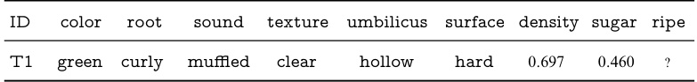
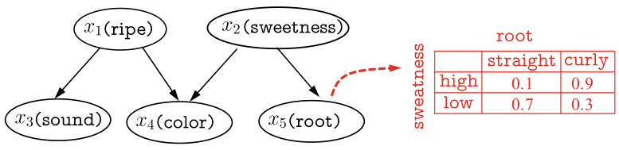
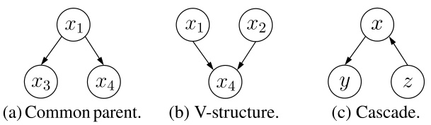
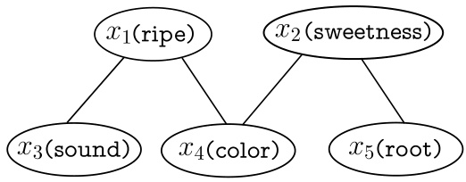
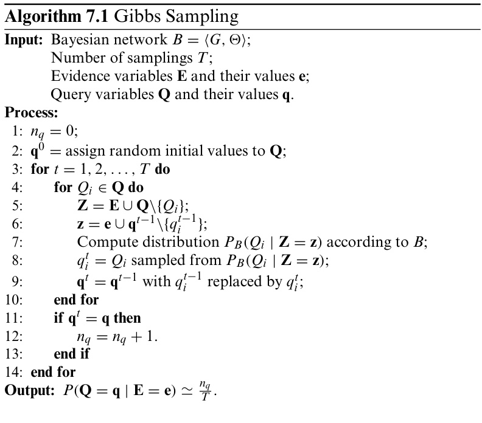

# Bayes Classifiers   

## 7.1  Bayesian Decision Theory  

Bayesian decision theory is a fundamental decision-making approach under the probability framework. In an ideal situa- tion when all relevant probabilities were known, Bayesian deci- sion theory makes optimal classification decisions based on the probabilities and costs of mis classifications. In the following, we demonstrate the basic idea of Bayesian decision theory with multiclass classification.  

In decision theory, the  expected loss  is known as the  risk .  

Let us assume that there are    $N$   distinct class labels, that is,  $y=\{c_{1},c_{2},.\,.\,.\,,c_{N}\}$  . Let    $\lambda_{i j}$   denote the cost of misclassifying a sample of class  $c_{j}$   as class  $c_{i}$  . Then, we can use the posterior probabili    $P(c_{i}\mid\pmb{x})$  to calculate the  expected loss  of classifying a sample  x  as class  $c_{i}$  , that is, the  conditional risk  of the sample  $\pmb{x}$  :  

$$
R(c_{i}\mid\pmb{x})=\sum_{j=1}^{N}\lambda_{i j}P(c_{j}\mid\pmb{x}).
$$  

Our task is to find a decision rule  $h:\mathcal X\mapsto\mathcal y$  that minimizes the overall risk  

$$
R(h)=\mathbb{E}_{x}\left[R(h(x)\mid x)\right].
$$  

The overall risk    $R(h)$   is minimized when the conditional risk  $R(h({\pmb x})\mid{\pmb x})$   of each sample  $\pmb{x}$   is minimized. This leads to the Bayes decision rule: to minimize the overall risk, classify each sample as the class that minimizes the conditional risk    $R(c\mid{\pmb x})$  :  

$$
h^{*}(x)=\underset{c\in y}{\arg\operatorname*{min}}\,R(c\mid x),
$$  

The mis classification rate corresponds to the  $0/1$   loss function in Chap.  6 .  

where  $h^{*}$  is called the  Bayes optimal classifier , and its associated overall risk    $R(h^{*})$   is called the  Bayes risk .   $1-R(h^{*})$   is the best performance that can be achieved by any classifiers, that is, the theoretically achievable upper bound of accuracy for any machine learning models.  

To be specific, if the objective is to minimize the misclassi- fication rate, then the mis classification loss    $\lambda_{i j}$   can be written as  

$$
\lambda_{i j}={\left\{\begin{array}{l l}{0,}&{{\mathrm{if~}}i=j;}\\ {1,}&{{\mathrm{otherwise}},}\end{array}\right.}
$$  

and the conditional risk is  

$$
R(c\mid{\pmb x})=1-P(c\mid{\pmb x}),
$$  

Then, the Bayes optimal classifier that minimizes the misclas- sification rate is  

$$
h^{*}({\pmb x})=\arg\operatorname*{max}_{c\in\mathcal{Y}}P(c\mid{\pmb x}),
$$  

which classifies each sample  $\pmb{x}$   as the class that maximizes its posterior probability    $P(c\mid{\pmb x})$  .  

From ( 7.6 ), we can see that the Bayes decision rule relies on the posterior probability    $P(c\mid{\pmb x})$  , which is often difficult to obtain. From this perspective, the task of machine learning is then to accurately estimate the posterior probability    $P(c\mid{\pmb x})$  from the finite training samples. Generally speaking, there are two strategies. The first strategy is to predict    $c$   by estimating  $P(c\mid{\pmb x})$   directly, and the corresponding models are known as discriminative models . The second strategy is to estimate the joint probability    $P(\pmb{x},c)$   first and then estimate    $P(c\mid{\pmb x})$  , and the corresponding models are called  generative models . The models introduced in earlier Chapters are all discriminative models, including decision trees, BP neural networks, and sup- port vector machines. For generative models, we must evaluate Note that this is just for the understanding of machine learning under the probabilistic framework. In fact, many machine learning techniques can perform accurate classifications without estimating the posterior probabilities.  

$$
P(c\mid x)={\frac{P(x,c)}{P(x)}}.
$$  

According to Bayes’ theorem,  $P(c\mid{\pmb x})$   can be written as  

$$
P(c\mid x)={\frac{P(c)P(x\mid c)}{P(x)}},
$$  

where    $P(c)$   is the  prior  probability of    $c$  ,    $P({\pmb x}\mid c)$   is the  class- conditionalprobability ,alsoknownasthe likelihood ,ofthesam- ple  $\pmb{x}$   with respect to class    $c$  , and  $P(x)$   is the  evidence  factor for normalization. Given    $\pmb{x}$  , the evidence factor    $P(x)$   is indepen- dent of the class, and thus the estimation of    $P(c\mid{\pmb x})$   is trans- formed to estimating e prior    $P(c)$   and the likelihood  $P({\pmb x}\mid c)$  from the training set  D .  

The prior probability  $P(c)$   representsthe proportionof each class in the sample space. Based on the law of large numbers,  $P(c)$   can be estimated by the frequency of each class in the training set as long as there are sufficient  i . i . d .  samples.  

It is difficult to calculate the class-conditional probability  $P({\pmb x}\mid c)$   directly since the calculation involves the joint proba- bility of all features of  $\pmb{x}$  . For example, suppose that there are  $d$   binary features in each sample, then there are   $2^{d}$    possible combinations in the sample space. In practice, the number of training samples    $m$   is usually much smaller than  $2^{d}$  , and there- fore, many combinations have never appeared in the training set. Hence, estimating  $P({\pmb x}\mid c)$   directly by the frequencies in the  $P(x)$   is the same for all classes.  

For ease of discussion, we assume all features to be discrete. For continuous features, we can replace the probability mass function    $P(\cdot)$  by the probability density function  $p(\cdot)$  .  

See Sect.  7.3 .  

training set is infeasible since ‘‘unobserved’’ and ‘‘zero proba- bility’’ are generally different.  

## 7.2  Maximum Likelihood Estimation  

$p(\pmb{x}\mid c)$   for continuous distribution.  

The ongoing debate between the Frequentist school and the Bayesian school started around the 1920s and the 1930s. These two schools have different views on many important questions and even the interpretation of probability itself. Readers who are interested in this can find more information in Efron ( 2005 ), Samaniego ( 2010 ).  

Also known as the Maximum Likelihood Method.  

A general strategy of estimating the class-conditional proba- bility is to hypothesize a fixed form of probability distribution, and then estimate the distribution parameters using the train- ing samples. To be specific, let  $P({\pmb x}\mid c)$   denote class-conditional probability of class    $c$  , and suppose    $P({\pmb x}\mid c)$   has a fixed form determined by a parameter vector    $\theta_{c}$  . Then, the task is to esti- mate    $\theta_{c}$   from a training set  $D$  . To be precise, we write    $P({\pmb x}\mid c)$  as    $P(\pmb{x}\mid\pmb{\theta}_{c})$  .  

The training process of probabilistic models is the process of parameter estimation. There are two different ways of think- ing about parameters. On the one hand, the Bayesian school thinks that the parameters are unobserved random variables following some distribution, and hence we can assume prior distributions for the parameters and estimate posterior distri- bution from observed data. On the other hand, the Frequen- tist school supports the view that parameters have fixed values though they are unknown, and hence they can be determined by some approaches such as optimizing the likelihood function. The remaining of this section discusses the Maximum Likeli- hood Estimation (MLE), which comes from the Frequentist school and is a classic method of estimating the probability distribution from samples.  

Let    $D_{c}$   denote the set of class    $c$   samples in the training set  $D$  , and further suppose the samples are  i . i . d .  samples. Then, the likelihood of    $D_{c}$   for a given parameter    $\theta_{c}$   is  

$$
P(D_{c}\mid\pmb\theta_{c})=\prod_{x\in D_{c}}P(\pmb x\mid\pmb\theta_{c}).
$$  

Applying the MLE to    $\theta_{c}$   is about finding a parameter value  $\hat{\pmb{\theta}}_{c}$  that maximizes the like ood    $P(D_{c}\mid\pmb{\theta}_{c})$  . Intuitively, the MLE aims to find a value of  $\theta_{c}$   that maximizes the ‘‘likelihood’’that the data will present.  

Since the product of a sequence in ( 7.9 ) can easily lead to underflow, we often use the  log-likelihood  instead:  

$$
\begin{array}{l}{{\displaystyle{L L(\theta_{c})=\log P(D_{c}\mid\theta_{c})}}}\\ {{\displaystyle{=\sum_{x\in D_{c}}\log P(x\mid\theta_{c})},}}\end{array}
$$  

and the MLE of    $\theta_{c}$   is  

$$
\hat{\pmb{\theta}}_{c}=\mathop{\arg\operatorname*{max}}_{\pmb{\theta}_{c}}L L(\pmb{\theta}_{c}).
$$  

For example, suppose the features are continuous and the probability density function follows the Gaussian distribution  $p(\pmb{x}\mid c)\sim\mathcal{N}(\pmb{\mu_{c}},\pmb{\sigma_{c}^{2}})$  , then the MLE of the parameters    $\pmb{\mu}_{c}$   and  $\pmb{\sigma}_{c}^{2}$    are  

$$
\begin{array}{l}{\hat{\pmb{\mu}}_{c}=\displaystyle\frac{1}{|D_{c}|}\sum_{\pmb{x}\in D_{c}}\pmb{x},}\\ {\hat{\pmb{\sigma}}_{c}^{2}=\displaystyle\frac{1}{|D_{c}|}\sum_{\pmb{x}\in D_{c}}(\pmb{x}-\hat{\pmb{\mu}}_{c})(\pmb{x}-\hat{\pmb{\mu}}_{c})^{\top}.}\end{array}
$$  

$\mathcal{N}$  is the Gaussian distribution. See Appendix  C.1.7 .  

In other words, the estimated mean of Gaussian distribution obtained by the MLE is the sample mean, and the estimated variance is the mean of    $({\pmb x}-\hat{\pmb\mu_{c}})({\pmb x}-\hat{\pmb\mu_{c}})^{\top}$  ; this conforms to our intuition. Conditional probabilities can also be estimated similarly for discrete features.  

Such kind of parametric methods simplify the estimation of posterior probabilities, but the accuracy of estimation heav- ily relies on whether the hypothetical probability distribution matches the unknown ground-truth data distribution. In prac- tice, a ‘‘guessed’’ probability distribution could lead to mis- leading results, and hence we often need domain knowledge to help hypothesize a good approximation to the ground-truth data distribution.  

## 7.3  Naïve Bayes Classifier  

When estimating the posterior probability    $P(c\mid{\pmb x})$   with the Bayesrule( 7.8 ),thereisadifficulty:itisnoteasytocalculatethe class-conditional probability    $P({\pmb x}\mid c)$   from the finite training samples since  $P({\pmb x}\mid c)$   is the joint probability on all attributes. To avoid this, the naïve Bayes classifier makes the ‘‘attribute conditional independence assumption’’: given any known class, assume all attributes are independent of each other. In other words,we assume each attribute influences the prediction result independently.  

With the attribute conditional independence assumption, we rewrite ( 7.8 ) as  

Computing the joint probability with finite training samples suffers from the combinatorial explosion problem in computation and the data sparsity problem in data. The more attributes there are, the severer the problems are.  

$$
P(c\mid x)={\frac{P(c)P(x\mid c)}{P(x)}}={\frac{P(c)}{P(x)}}\prod_{i=1}^{d}P(x_{i}\mid c),
$$  

Strictly speaking,  $x_{i}$   is an ‘‘attribute-value’’ pair, e.g., color  $=$  green . For ease of discussion, when the context is clear,  $x_{i}$   may either represent the i th attribute (e.g.,  color ) or the value of  $\pmb{x}$   on the  i th attribute (e.g.,  green ).  

where    $d$   is the number of attributes and    $x_{i}$   is the value taken on the  i th attribute of    $\pmb{x}$  

Since  $P(x)$  is the same for all classes,from the Bayes decision rule ( 7.6 ), we have  

$$
h_{\mathrm{nb}}({\pmb x})=\underset{c\in\mathcal{Y}}{\arg\operatorname*{max}}\,P(c)\prod_{i=1}^{d}P(x_{i}\mid c),
$$  

which is the formulation of the naïve Bayes classifier.  

To train a naïve Bayes classifier, we compute the prior prob- ability    $P(c)$   from the training set    $D$   and then compute the con- ditiona robability    $P(x_{i}\mid c)$    r each attribute.  

Let  $D_{c}$   denote a subset of  D  containing all samples of class  $c$  . Then, given sufficient  i . i . d .  samples, the prior probability can be easily estimated by  

$$
P(c)=\frac{|D_{c}|}{|D|}.
$$  

For discrete attributes, let  $D_{c,x_{i}}$   denote a subset of    $D_{c}$   contain- ing all samples taking the value    $x_{i}$   on the  i th attribute. Then, the conditional probability    $P(x_{i}\mid c)$   can be estimated by  

$$
P(x_{i}\mid c)={\frac{\left|D_{c,x_{i}}\right|}{\left|D_{c}\right|}}.
$$  

For continuous features, suppose    $p(x_{i}\;\mid\;c)\;\sim\;{\mathcal N}(\mu_{c,i},\sigma_{c,i}^{2})$  , where    $\mu_{c,i}$   and    $\sigma_{c,i}^{2}$    are, respectively, the mean and variance of the  i th feature of class    $c$   samples. Then, we have  

$$
p(x_{i}\mid c)=\frac{1}{\sqrt{2\pi}\sigma_{c,i}}\exp\left(-\frac{(x_{i}-\mu_{c,i})^{2}}{2\sigma_{c,i}^{2}}\right).
$$  

The watermelon data set 3 . 0 is in  $\circ$   Table 4.3 .  

Now, let us train a naïve Bayes classifier using the water- melon data set 3 . 0 and classify the following watermelon  T1 :  

  

First, we estimate the prior probability    $P(c)$  :  

$$
\begin{aligned}
& P_{\text {green } \mid \text { true }}=P(\text { color }=\text { green } \mid \text { ripe }=\text { true })=\frac{3}{8}=0.375, \\
& P_{\text {green } \mid \text { false }}=P(\text { color }=\text { green } \mid \text { ripe }=\text { false })=\frac{3}{9} \approx 0.333 \text {, } \\
& P_{\text {curly } \mid \text { true }}=P(\text { root }=\text { curly } \mid \text { ripe }=\text { true })=\frac{5}{8}=0.625, \\
& P_{\text {curly } \mid \text { false }}=P(\text { root }=\text { curly } \mid \text { ripe }=\text { false })=\frac{3}{9} \approx 0.333, \\
& P_{\text {muffled } \mid \text { true }}=P(\text { sound }=\text { muffled } \mid \text { ripe }=\text { true })=\frac{5}{8}=0.625 \text {, } \\
& P_{\text {muffled } \mid \text { false }}=P(\text { sound }=\text { muffled } \mid \text { ripe }=\text { false })=\frac{4}{9} \approx 0.444 \text {, } \\
& P_{\text {clear|true }}=P(\text { texture }=\text { clear } \mid \text { ripe }=\text { true })=\frac{7}{8}=0.875, \\
& P_{\text {clear|false }}=P(\text { texture }=\text { clear } \mid \text { ripe }=\text { false })=\frac{2}{9} \approx 0.222 \text {, } \\
& P_{\text {hollow } \mid \text { true }}=P(\text { umbilicus }=\text { hollow } \mid \text { ripe }=\text { true })=\frac{5}{8}=0.625, \\
& P_{\text {hollow } \mid \text { false }}=P(\text { umbilicus }=\text { hollow } \mid \text { ripe }=\text { false })=\frac{2}{9} \approx 0.222 \text {, } \\
& P_{\text {hard } \mid \text { true }}=P(\text { surface }=\text { hard } \mid \text { ripe }=\text { true })=\frac{6}{8}=0.750, \\
& P_{\text {hard } \mid \text { false }}=P(\text { surface }=\text { hard } \mid \text { ripe }=\text { false })=\frac{6}{9} \approx 0.667, \\
& p_{\text {density }: 0.697 \mid \text { true }}=p(\text { density }=0.697 \mid \text { ripe }=\text { true }) \\
& =\frac{1}{\sqrt{2 \pi} \cdot 0.129} \exp \left(-\frac{(0.697-0.574)^2}{2 \cdot 0.129^2}\right) \approx 1.959, \\
& \left.p_{\text {density }: 0.697 \mid \text { false }}=p \text { (density }=0.697 \mid \text { ripe }=\text { false }\right) \\
& =\frac{1}{\sqrt{2 \pi} \cdot 0.195} \exp \left(-\frac{(0.697-0.496)^2}{2 \cdot 0.195^2}\right) \approx 1.203, \\
& \left.p_{\text {sugar: } 0.460 \mid \text { true }}=p \text { (density }=0.460 \mid \text { ripe }=\text { true }\right) \\
& =\frac{1}{\sqrt{2 \pi} \cdot 0.101} \exp \left(-\frac{(0.460-0.279)^2}{2 \cdot 0.101^2}\right) \approx 0.788, \\
& p_{\text {sugar: } 0.460 \mid \text { false }}=p(\text { density }=0.460 \mid \text { ripe }=\text { false }) \\
& =\frac{1}{\sqrt{2 \pi} \cdot 0.108} \exp \left(-\frac{(0.460-0.154)^2}{2 \cdot 0.108^2}\right) \approx 0.066 . \\
&
\end{aligned}
$$

Hence, we have  

$$
\begin{array}{r l}&{P(\mathrm{two}=\mathrm{true})\times P_{\mathrm{green}|\mathrm{true}}\times P_{\mathrm{curl}|\mathrm{true}}\times P_{\mathrm{null}|\mathrm{true}}}\\ &{\qquad\qquad\times\,P_{\mathrm{cell}|\mathrm{true}}\times P_{\mathrm{hallow}|\mathrm{true}}\times P_{\mathrm{hard}|\mathrm{true}}}\\ &{\qquad\qquad\times\,p_{\mathrm{density}:0.697|\mathrm{true}}\times p_{\mathrm{suspar}:0.460|\mathrm{true}}\approx0.052,}\\ &{P(\mathrm{two}=\mathrm{false})\times P_{\mathrm{green}|\mathrm{false}}\times P_{\mathrm{curl}|\mathrm{false}}\times P_{\mathrm{null}|\mathrm{false}}}\\ &{\qquad\qquad\times\,P_{\mathrm{cell}|\mathrm{false}}\times P_{\mathrm{hallow}|\mathrm{false}}\times P_{\mathrm{hard}|\mathrm{false}}}\\ &{\qquad\qquad\times\,p_{\mathrm{density}:0.697|\mathrm{false}}\times p_{\mathrm{suspar}:0.460|\mathrm{false}}\approx6.80\times10^{-5}.}\end{array}
$$  

In practice, we often use logarithms to convert the multiplications into additions to avoid numerical underflow.  

Since  $0.052>6.80\times10^{-5}$  , the naïve Bayes classifier classi- fies the testing sample  T1  as  ripe .  

What if a feature value has never appeared together with a particular class? In such cases, it becomes problematic to use the probability ( 7.17 ) for predicting the class with ( 7.15 ). For instance, given a testing sample with  sound  $=$  crisp , the naïve Bayes classifier trained on the watermelon data set 3 . 0 will predict  

$$
P_{\mathtt{c r i s p}\mid\mathtt{t r u e}}=P(\mathtt{s o u n d}=\mathtt{c r i s p}\mid\mathtt{r i p e}=\mathtt{t r u e})=\frac{0}{8}=0.
$$  

Since the product of the sequence in ( 7.15 ) gives a probabil- ity of zero, the classification result will always be  ripe = false regardless of the values of other features, even if it is obviously a  ripe  watermelon. Such a behavior is unreasonable.  

To avoid ‘‘removing’’the information carried by other fea- tures, the probability estimation requires ‘‘smoothing’’, and a common choice is the Laplacian correction. To be specific, let  $N$   denote the number of distinct classes in the training set    $D,N_{i}$  denote the number of distinct values the  i th feature can take. Then, ( 7.16 ) and ( 7.17 ) can be, respectively, corrected as  

$$
\begin{array}{c c c}{\displaystyle{\hat{P}(c)=\frac{|D_{c}|+1}{|D|+N},}}\\ {\displaystyle{\hat{P}(x_{i}\mid c)=\frac{\left|D_{c,x_{i}}\right|+1}{|D_{c}|+N_{i}}.}}\end{array}
$$  

Taking the watermelon data set 3 . 0 as an example, the prior probabilities can be estimated as  

$$
{\begin{array}{r l}&{{\hat{P}}({\mathrm{rise}}={\mathrm{true}})={\cfrac{8+1}{17+2}}\approx0.474.}\\ &{{}}\\ &{{\hat{P}}({\mathrm{rise}}={\mathrm{false}})={\cfrac{9+1}{17+2}}\approx0.526.}\end{array}}
$$  

Similarly,  P green | true  and  P green | false  can be estimated as  

$$
\begin{array}{r l}&{\hat{P}_{\mathbf{green}|\mathbf{true}}=\hat{P}(\mathsf{c o l o r}=\mathbf{green}\mid\mathbf{rise}=\mathbf{true})=\displaystyle\frac{3+1}{8+3}\approx0.364,}\\ &{\hat{P}_{\mathbf{green}|\mathbf{false}}=\hat{P}(\mathsf{c o l o r}=\mathbf{green}\mid\mathbf{rise}=\mathbf{false})=\displaystyle\frac{3+1}{9+3}\approx0.333.}\end{array}
$$  

Also, the probability  $P_{\tt c r i s p i t r u e}$  , which was zero, is now esti- mated as  

$$
\hat{P}_{\mathtt{C r i s p l t r u e}}=\hat{P}(\mathtt{c r i s p}=\mathtt{t r u e\ |\ r i p e}=\mathtt{t r u e})=\frac{0+1}{8+3}\approx0.091.
$$  

The Laplacian correction avoids the problem of zero probabil- ities caused by insufficient training samples. The prior intro- duced by the correction will become negligible as the size of training set increases.  

There are different ways of using a naïve Bayes classifier in practice. For example, if the speed of prediction is impor- tant, then a naïve Bayes classifier can pre-calculate all relevant probabilities and save for later use. After that, the prediction can be made by looking up the saved probability table. On the other hand, if the training data changes frequently, then we can take a  lazy learning  approach, in which the probabilities are estimated once a prediction request is received, that is, no training before prediction. If we keep receiving new training samples, then we can enable incremental learning by updating only the probabilities that are related to the new samples.  

The Laplacian correction essentially assumes that the feature values and classes are evenly distributed. This is an extra prior on the data introduced in the process of naïve Bayesian learning.  

See Sect.  10.1  for lazy learning.  

See Sect.  5.5.2  for incremental learning.  

## 7.4  Semi-Naïve Bayes Classifier  

To overcome the difficulty of computing    $P(c\mid{\pmb x})$   in Bayes’ theorem, the naïve Bayes classifier makes the attribute condi- tional independence assumption, which often does not hold in practice. Hence, semi-naïve Bayes classifiers are developed to relax this assumption to some extent.  

The basic idea of semi-naïve Bayes classifiers is to consider some strong dependencies among features without calculat- ing the complete joint probabilities. A general strategy used by semi-naïve Bayes classifiers is One-Dependent Estimator (ODE). As the name suggests, ‘‘one-dependent’’ means each feature can depend on at most one feature other than the class information, that is,  

$$
P(c\mid x)\propto P(c)\prod_{i=1}^{d}P(x_{i}\mid c,p a_{i}),
$$  

where  $x_{i}$   depends on  $p a_{i}$  , and  $p a_{i}$   is called the parent feature of    $x_{i}$  . For each feature  $x_{i}$  , if the parent feature  $p a_{i}$   is known, then    $P(x_{i}\mid c,p a_{i})$   can be estimated in a similar manner as in ( 7.20 ). Hence, the key problem becomes determining the parent features, and different approaches will lead to different one-dependent classifiers.  

The most straightforward approach is called Super-Parent ODE (SPODE), which assumes that all features depend on just one feature called the  super-parent . SPODE selects the super-  

  
Fig. 7.1 Feature dependencies of naïve Bayes and semi-naïve Bayes classifiers  

parent feature using model selection methods such as cross- validation. For example, in  .  Figure 7.1b ,    $x_{1}$   is a super-parent feature.  

Tree Augmented naïve Bayes (TAN) (Friedman et al.  1997 ), which is based on maximum weighted spanning trees (Chow and Liu  1968 ), simplifies feature dependencies into a tree struc- ture, as shown in  $\circ$  Figure 7.1c , by the following steps:  

(1) Compute the conditional mutual information for each pair of features  

$$
I(x_{i},x_{j}\mid y)=\sum_{x_{i},x_{j};\,c\in y}P(x_{i},x_{j}\mid c)\log{\frac{P(x_{i},x_{j}\mid c)}{P(x_{i}\mid c)P(x_{j}\mid c)}};
$$  

(2) Construct a complete undirected graph in which the nodes are feat s. Set    $I(x_{i},x_{j}\mid\boldsymbol{y})$   as the weight of the edge between  x  and    $x_{j}$  ;

 (3) Construct a maximum weighted spanning tree and select a root feature. Set the direction of each edge outward from the root feature;

 (4) Add a class node  $y$   and add direct edges from  $y$   to other feature nodes.  

The mutu info ation  $I(x_{i},x_{j}\mid y)$   describes the correla- tion between  x  $x_{i}$   and  $x_{j}$   given the class information. Hence, via the maximum weighted spanning tree algorithm, TAN keeps only the dependencies among highly correlated features.  

Averaged One-Dependent Estimator (AODE) (Webb et al. 2005 ) is a more powerful one-dependent classifier, which takes advantage of ensemble learning. Unlike SPODE, which selects a super-parent feature via model selection, AODE tries to use each feature as a super-parent to build multiple SPODE models and then integrates those supported by sufficient training data, that is,  

$$
P(c\mid\pmb{x})\propto\sum_{i=1\atop|D_{x_{i}}|\geqslant m^{\prime}}^{d}P(c,x_{i})\prod_{j=1}^{d}P(x_{j}\mid c,x_{i}),
$$  

where    $D_{x_{i}}$   is the subset of samples taking the value  $x_{i}$   on the i th feature, and    $m^{\prime}$    is a threshold constant. AODE needs to estimate    $P(c,x_{i})$   and  $P(x_{j}\mid c,x_{i})$  . Similar to ( 7.20 ), we have  

By default,    $m^{\prime}$    is set to 30 (Webb et al.  2005 ).  

$$
\begin{array}{r}{\hat{P}(c,x_{i})=\frac{\left|D_{c,x_{i}}\right|+1}{\left|D\right|+N\times N_{i}},}\\ {\hat{P}(x_{j}\mid c,x_{i})=\frac{\left|D_{c,x_{i},x_{j}}\right|+1}{\left|D_{c,x_{i}}\right|+N_{j}},}\end{array}
$$  

where    $N$   is the number of distinct classes in  $D,N_{i}$   is the number of distinct values the    $i$  th feature can take,    $D_{c,x_{i}}$   is the subset of class    $c$   samples taking the value    $x_{i}$   on the  i th feature, and  $D_{c,x_{i},x_{j}}$   is the subset of class    $c$   samples taking the value    $x_{i}$   on the    $i$  th feature while taking the value  $x_{j}$   on the  $j$  th feature. For example, for the watermelon data set 3 . 0, we have  

$$
\begin{array}{r l r}&{}&{\hat{P}_{\mathrm{true,muffed}}=\hat{P}(\mathrm{rise}=\mathrm{true},\mathrm{sound}=\mathrm{muffed})}\\ &{}&{=\cfrac{6+1}{17+3\times2}=0.304,}\\ &{}&{\hat{P}_{\mathrm{allow,true,muffed}}=\hat{P}(\mathrm{umbelief c u s}=\mathrm{allow}\ |\ \mathrm{rise}=\mathrm{true},}\\ &{}&{\mathrm{soundcut}=\mathrm{muffed})}\\ &{}&{=\cfrac{3+1}{6+3}=0.444.}\end{array}
$$  

Similar to naïve Bayes classifiers, the training process of AODE is also about ‘‘counting’’ the number of training sam- ples satisfying some conditions. AODE does not require model selection, and hence it supports quick predictions with pre- calculations, lazy learning, and incremental learning.  

Since relaxing the attribute conditional independence as sump- tion to one-dependent assumption leads to better generaliza- tion ability, is it possible to make further improvement by con- sidering higher order dependencies? In other words, we extend ODE to the  $k\mathrm{DE}$   by replacing the feature    $p a_{i}$   in ( 7.21 ) with a feature set  ${\bf p a}_{i}$   containing  $k$   features. It is worth mentioning that the number of samples required for an accurate estimation of    $P(x_{i}\mid y,\mathbf{p}\mathbf{a}_{i})$   increases exponentially as  $k$   increases. Hence, improving the generalization performance requires abundant data; otherwise it would be difficult to calculate higher order joint probabilities.  

  
Fig. 7.2 The Bayesian network structure of the watermelon problem together with the conditional probability table of  root  

## 7.5  Bayesian Network  

The Bayesian network is a classic probabilistic graphical model. See Chap.  14  for probabilistic graphical models.  

For ease of discussion, this section assumes discrete features. For continuous features, the CPT can be generalized to probability density functions.  

The continuous feature  sugar  in the watermelon data set is converted to the discrete feature sweetness .  

Bayesian networks ,alsoknownas beliefnetworks ,utilizeDirected Acyclic Graphs (DAG) to represent dependencies among fea- ture s and build Conditional Probability Tables(CPT)todescribe the joint probabilities of features.  

To be specific, a Bayesian network    $B$   consists of structure  $G$     $\Theta$  , denoted by    $B\,=\,\langle G,\Theta\rangle$  . The structure  $G$   is a DAG in which each node corresponds to a feature. In the graph, two features with a direct dependency are connected by an edge, and, collectively, these dependencies are encoded by the parameter    $\Theta$  . Let  $\pi_{i}$   denote the parent node set of the feature  $x_{i}$   in    $G$  , then    $\Theta$   includes the CPT    $\theta_{x_{i}\mid\pi_{i}}=P_{B}(x_{i}\mid\pi_{i})$   of each feature.  

For example,  $\circ$   Figure 7.2  shows a Bayesian network struc- ture and the CPT of the feature  root . From the network struc- ture, we see that  color  directly depends on  ripe  and  sweetness , while  root  directly depends on  sweetness . From the CPT, we can further obtain a quantified dependency of  root  on  sweet- ness , e.g.,    $P(\tt r o o t=$  straight  |  sweetness  $={\tt h i g h})=0.1$  .  

### 7.5.1  Network Structure  

The Bayesian network structure effectively expresses the con- ditional independence among features. Given the sets of parent nodes, the Bayesian network assumes each feature is indepen- dent of its all non-descendant features. Hence,    $B\,=\,\langle G,\Theta\rangle$  defines the joint probability of the features    $x_{1},x_{2},\dots,x_{d}$  as  

$$
P_{B}(x_{1},x_{2},\ldots,x_{d})=\prod_{i=1}^{d}P_{B}(x_{i}\mid\pi_{i})=\prod_{i=1}^{d}\theta_{x_{i}\mid\pi_{i}}.
$$  

Taking    $\circ$   Figure 7.2  as an example, the joint probability is defined as  

$$
P(x_{1},x_{2},x_{3},x_{4},x_{5})=P(x_{1})P(x_{2})P(x_{3}\mid x_{1})P(x_{4}\mid x_{1},x_{2})P(x_{5}\mid x_{2}).
$$  

  
Fig. 7.3 Typical feature dependencies in Bayesian networks  

We can see that    $x_{3}$   and    $x_{4}$   are independent given the value of  $x_{1}$   (i.e.,    $x_{3}\perp x_{4}\mid x_{1})$   $x_{4}$  nd    $x_{5}$   are independent given the value of    $x_{2}$   (i.e.,  $x_{4}\perp x_{5}\mid x_{2})$  ).  

.  Figure 7.3  shows three typical cases of dependencies among three variables, and two of them have already appeared in ( 7.26 ).  

Not all conditional independence relationships are enumerated here.  

In the common parent structure,  $x_{3}$   and  $x_{4}$   are conditionally independent given the value of their parent node    $x_{1}$  . In the cascade structure,  $y$   and  $z$   are conditionally independent given the value of  $x$  . In the  $\mathrm{V}$  -structure,  $x_{1}$   and  $x_{2}$   are dependent given the value of    $x_{4}$  . Interestingly, when the value of  $x_{4}$   is unknown in the  $\mathrm{V}.$  -structure,    $x_{1}$   and    $x_{2}$   are independent of each other. We can make a simple validation as follows:  

$$
\begin{array}{l}{P(x_{1},x_{2})=\displaystyle\sum_{x_{4}}P(x_{1},x_{2},x_{4})}\\ {\qquad\qquad=\displaystyle\sum_{x_{4}}P(x_{4}\mid x_{1},x_{2})P(x_{1})P(x_{2})}\\ {\qquad\qquad\qquad=P(x_{1})P(x_{2}).}\end{array}
$$  

Such independence is called  marginal independence , denoted by  $x_{1}$  = . |  

In the  $\mathrm{V}$  -structure, the independence between two variables is subject to the presence of a third variable. However, this may also be the case in other structures. For example, the condi- tional indepen nce    $x_{3}\perp x_{4}\mid x_{1}$   exists in the common parent structure, but  x  $x_{3}$   and  x  $x_{4}$   are not independent when the value of  $x_{1}$   is unknown, that is,    $x_{3.}$  =  $x_{4}$   does not hold. In the cascade | structure,  $y\perp z\mid x$  , but  y =  does not hold. |  

Calculating the integration or summation of a variable is called  marginalization .  

  
Fig. 7.4 The moral graph of Fig.  7.2  

‘‘d’’ stands for ‘‘directed’’.  

The discovery of common parent structure, cascade structure, and V-structure together with the proposal of d-separation have promoted the research on causal discovery. See Pearl ( 1988 ).  

We usually prune the graph first and keep only    $x,y,z$  , and all of their ancestor variables.  

We can use    $d$  -separation  to analyze the conditional indepen- dence among variables in a directed graph. First, we convert the directed graph into an undirected graph:  

5  Find all V-structures in the directed graph and then add an undirected edge between the common parents if they share the same child node; 5  Change all directed edges to undirected edges.  

The undirected graph produced by this process is called a  moral graph , and the process of connecting common parents is called moralization  (Cowell et al.  1999 ).  

With a moral graph, the conditional independence between variables can be intuitively and efficiently located. Suppose we have a moral graph containing the variables    $x$   and    $y$   and a variable set    $\mathbf{z}=\{z_{i}\}$  . We say  $x$   and    $y$   are d-separated by    $\mathbf{z}$   (i.e.,  $x\;\perp\;y\;\mid\;{\bf z})$   if  x  and    $y$   can be separated by    $\mathbf{z}$  , that is,    $x$   and  $y$   belong to separated subgraphs after dropping  z . For exam- ple, the moral graph corresponding to    $\circ$   Figure 7.2  is given in    $\circ$   Figure 7.4 , from which we can easily find all conditional  $x_{3}\;\perp\;x_{4}\;\mid\;x_{1},\;x_{4}\;\perp\;x_{5}\;\mid\;x_{2},\;x_{3}\;\perp\;x_{2}\;\mid\;x_{1},$   $x_{3}\perp x_{5}\mid x_{1},x_{3}\perp x_{5}\mid x_{2},$   ⊥  |  ⊥  | , and so on.  

### 7.5.2  Learning  

When the network structure is known (i.e., the dependencies between variables are given), learning a Bayesian network is relatively easy as we only need to count the training samples to estimate the CPT of each node. In practice, the network struc- ture is rarely known in advance, and hence the primary task of Bayesian network learning is to find the most ‘‘appropriate’’ Bayesian network. A common method to solve this problem is score-and-search . To be specific, we first define a score function to evaluate the fitness between a Bayesian network and a train- ing set, and then use this score function to find the most optimal Bayesian network. The score function, which can be designed in different ways, carries the inductive bias of a Bayesian net- work.  

See Sect.  1.4  for inductive bias.  

Typical score functions are based on the information the- ory principle, which considers the learning problem as a data compression task. Then, the task is to find a model that can describe the training data with the minimum coding length. The coding length includes the bit length required to describe the model itself and the bit length required by the model to describe the data. For Bayesian network learning, the model is a Bayesian network that describes a probability distribution of the training data. According to the Minimum Description Length (MDL) principle, we search for the Bayesian network with the shortest combined code length.  

Given a training set    $D=\{\pmb{x}_{1},\pmb{x}_{2},.\,.\,.\,,\pmb{x}_{m}\}$  , the score func- tion of a Bayesian network    $B=\left<G,\Theta\right>$  on  D  can be written as  

$$
s(B\mid D)=f(\theta)\,|B|-L L(B\mid D),
$$  

Here, the class is also considered as a feature, that is,  $\boldsymbol{x}_{i}$  is a vector containing a sample and its class.  

where    $|B|$   is the number of parameters of the Bayesian networ ,  $f(\theta)$   is the coding length required to describe the parameter  θ , and the log-likelihood of the Bayesian network  $B$   is  

$$
L L(B\mid D)=\sum_{i=1}^{m}\log P_{B}({\pmb x}_{i}).
$$  

In ( 7.28 ), the first term is about the coding length required for describing the Bayesian network, and the second term is about how well the probability distribution  $P_{B}$   describes the data    $D$  . Hence, the learning task becomes an optimization task, that is, searching for a Bayesian network    $B$   that minimizes the score function  $s(B\mid D)$  .  

I  $\mathrm{f}f(\theta)=1$  , that is, each parameter is described by 1 coding bit, then we have the Akaike Information Criterion (AIC) score function  

In the view of statistical learning, these two terms correspond to the structural risk and the empirical risk, respectively.  

$$
\operatorname{AIC}(B\mid D)=|B|-L L(B\mid D).
$$  

If  $\textstyle f(\theta)\,=\,{\frac{1}{2}}\log m$  , that is, each parameter is described by  ${\textstyle\frac{1}{2}}\log m$   coding bits, then we have the Bayesian Information Criterion (BIC) score function  

$$
\operatorname{BIC}(B\mid D)={\frac{\log m}{2}}\left|B\right|-L L(B\mid D).
$$  

If  $f(\theta)\,=\,0$  , that is, the number of bits for describing the Bayesian network is not considered in the calculation, then the score function is reduced to the negative log-likelihood, and consequently, the learning task reduces to the maximum likelihood estimation.  

F r a Bayesian network    $B=\langle G,\Theta\rangle$  , if the netwo ture  G  is fixed, then the first term of the score function  $s(B\mid D)$   | is a constant. Hence, minimizing    $s(B\mid D)$   is eq valent to the maximum likelihood estimation with respect to   . From ( 7.29 ) and ( 7.26 ), we know that each parameter    $\theta_{x_{i}|\pi_{i}}$   can b btained by an empirical estimation based on the training set  D , that is,  

$$
\theta_{x_{i}\mid\pi_{i}}=\hat{P}_{D}(x_{i}\mid\pi_{i}),
$$  

That is, the frequency of an event in a training set.  

For example, TAN (Friedman et al.  1997 ) limits the network structure to be a tree structure (we can consider semi-naïve Bayes classifiers as a special case of Bayesian networks).  

The class can also be regarded as a feature.  

Chapter  14  provides more discussions on inferences.  

The variational inference is also frequently used. See Sect.  14.5 .  

where  $\hat{P}_{D}(\cdot)$  ·  is the empirical distribution from  $D$  . Therefore, to minimize the score function    $s(B\mid D)$  , we only need to search in the candidate network structures instead of parameters, since the optimal parameters of a candidate can be directly calculated from the training set.  

Unfortunately, searching for the optimal Bayesian network structure in all network structures is an NP-hard problem, which cannot be solved efficiently. There are two general strate- gies to find approximate solutions within finite time. The first strategy is to use greedy methods. For example, starting with a network structure and gradually updating each edge (add, delete, or change direction) until the score function does not decrease any more. The second strategy is adding constraints to reduce the size of the search space (e.g., limiting the network structure to a tree structure).  

### 7.5.3  Inference  

A trained Bayesian network can answer ‘‘queries’’, that is, infer- ring the values of other features from observed feature values. For example, we may want to know the  ripeness  and  sweet- ness  of a watermelon after observing  color  $=$  green ,  sound  $=$  muffled , and  ro  ${\mathsf{o t}}={\mathsf{c}}$  curly . The process of inferring the value of a queried feature from the observed feature values is called inference , where the observed feature values are called  evidence .  

Ideally, we wish to use the joint probability distribution defined by the Bayesian network to compute the exact poste- ri or probabilities.Unfortunately,suchan exactinference  isNP- hard (Cooper  1990 ). In other words, exact inferences are dif- ficult when the network contains many nodes with dense con- nections. In such cases, we often leverage  approximate inference methods to obtain approximate solutions within a finite time by sacrificing some accuracy. A typical approximate inference method for Bayesian networks is the  Gibbs sampling , which is a type of random sampling method. Now, let us take a closer look at the Gibbs sampling.  

Let    $\mathbf{Q}=\{Q_{1},\,Q_{2},\,.\,.\,,\,Q_{n}\}$   denote the query variables,    $\mathbf{E}=$   $\{E_{1},E_{2},.\,.\,.\,,E_{k}\}$   denote the evidence variables, whose values are  ${\bf e}=\{e_{1},e_{2},.\,.\,.\,,e_{k}\}$  . The task is to compute the posterior probability    $P(\mathbf{Q}=\mathfrak{q}\mid\mathbf{E}=\mathfrak{e})$  , where    ${\mathfrak{q}}=\{q_{1},q_{2},.\,.\,.\,,q_{n}\}$   is a set of values of the query variables. For instance, the query variables could be  $\mathbf{Q}\,=\,\mathtt{\{r i p e}}$  ,  sweetness } , and the evidence variables are    $\mathbf{E}\;=\;\{{\sf c o l o r}$  ,  sound ,  root }  with the values    $\textbf{e}=

$  { green ,  muffled ,  curly } .Then,the target values of the query are

  ${\mathfrak{q}}=\{{\mathrm{true}},{\mathrm{high}}\}$  , that is, how likely this is a  ripe  watermelon with a high level of  sweetness .  

The Gibbs sampling algorithm,asshownin  .  Algorithm 7.1 starts with a randomly generated sample  ${\bf q}^{0}$    with random val- ues assigned to non-evidence variables. Its evidence variables, however, are assigned the same values as the query sample (i.e.,  $\mathbf{E}=\mathbf{e}$  ). Then, at each step, it generates a new sample by modi- fying the non-evidence variables of the current sample, e.g., it generates  $\mathbf{q}^{1}$    from  ${\bf q}^{0}$  . More generally, at the  t th step, the algo- rithm first sets    $\mathbf{q}^{t}=\mathbf{q}^{t-1}$    and then modifies the value of each non-evidence variable one by one via sampling. The sampling probability of each value is computed using the Bayesian net- work    $B$   and the curr t values of other variables (i.e.,    $\mathbf{Z}=\mathbf{z}$  ). Suppose we sampled  T  times and obtained  $n_{q}$   samples that are consistent with the query  $\mathbf{q}$  , then the posterior probability can be approximated as  

$$
P(\mathbf{Q}=\mathfrak{q}\mid\mathbf{E}=\mathfrak{e})\simeq\frac{n_{q}}{T}.
$$  

For the joint state space of all variables in the Bayesian network, the Gibbs sampling is actually a  random walk  in the subspace that is consistent with the evidence    $\mathbf{E}=\mathbf{e}$  . Since every step only depends on the state of the previous step, the sampling generates a  Markov chain . Under certain conditions, the state distribution always converges to a stationary distribution as  $t\rightarrow\infty$  , regardless of the initial starting point. The converged distribution by Gibbs sampling happens to be    $P(\mathbf{Q}\mid\mathbf{E}=\mathbf{e})$  . Hence, the Gibbs sampling with a large  $T$   approximates a sam- pling from  $P(\mathbf{Q}\mid\mathbf{E}=\mathbf{e})$  , and consequently ensures that ( 7.33 ) converges to    $P(\mathbf{Q}=\mathfrak{q}\mid\mathbf{E}=\mathfrak{e})$  .  

Note that the convergence speed of the Gibbs sampling algorithm is usually slow since it often takes a long time for the Markov chain to converge to a stationary distribution. Besides, if the Bayesian network contains extreme probabilities like   $^{\ast}0^{\ast}$  or   $^{\ast1^{\ast}}$  , then a stationary distribution is not guaranteed by the Markov chain, and consequently, Gibbs sampling will produce an incorrect estimation.  

  

## 7.6  EM Algorithm  

The previous discussions assumed the values of all features are observed for the training samples, that is, each training sam- ple is  complete . In practice, however, we often have  incomplete training samples. For instance, the  root  of a watermelon may have been removed, so we do not know whether it is  straight or  curly , that is, the feature  root  is unknown. Then, in the pres- ence of  unobserved  features, also known as  latent variables , how can we estimate the model parameters?  

Since the ‘‘likelihood’’ is often based on exponential family functions, the natural logarithm  $\ln(\cdot)$   is generally used for log-likelihood and also in the EM algorithm.  

Let    $\mathbf{X}$   denote the set of observed variables,    $\mathbf{Z}$   denote the set of latent variables, and    $\Theta$   denote the model parameters. Then, the maximum likelihood estimation of    $\Theta$   maximizes the log-likelihood  

$$
L L(\Theta\mid\mathbf{X},\mathbf{Z})=\ln{\cal P}(\mathbf{X},\mathbf{Z}\mid\Theta).
$$  

We cannot solve ( 7.34 ) directly because    $\mathbf{Z}$   are latent variables. However, we can use the expectation of    $\mathbf{Z}$   to maximize the log marginal likelihood  of the observed data:  

$$
L L(\Theta\mid\mathbf{X})=\ln{P(\mathbf{X}\mid\Theta)}=\ln\sum_{\mathbf{Z}}P(\mathbf{X},\mathbf{Z}\mid\Theta).
$$  

The Expectation-Maximization (EM) algorithm (Dempster et al.  1977 ) is a powerful iterative method for estimating latent variables. Its basic idea is as follows: given the value of    $\Theta$  , from the training data, we can infer the expected value for each latent variable in    $\mathbf{Z}$   (the E-step); given the values of the latent variables in  $\mathbf{Z}$  , we can estimate    $\Theta$   with the maximum likelihood estimation (the M-step).  

This is only a brief description of the EM algorithm. See Sect.  9.4.3  for more concrete examples.  

To implement the above idea, we initialize ( 7.35 ) with    $\Theta^{0}$  and iteratively apply the following two steps until convergence:  

5  Infer the expectation of    $\mathbf{Z}$   with  $\Theta^{t}$  , denoted by    $\mathbf{Z}^{t}$  ; 5  Estimate  $\Theta$   with the maximum likelihood estimation based on    $\mathbf{Z}^{t}$    and the observed variables    $\mathbf{X}$  , denoted by    $\Theta^{t+1}$  .  

The above iterative process is the prototype of the EM algo- rithm. Instead of using the expectation of    $\mathbf{Z}$  , we can compute the probability distribution    $P(\mathbf{Z}\mid\mathbf{X},\Theta^{t})$   based on    $\Theta^{t}$  , and the above two steps become  

5  E-step (Expectation): infer the latent variable distribution  $P(\mathbf{Z}\mid\mathbf{X},\Theta^{t})$   based on    $\Theta^{t}$  , and then compute the exp ta- tion of the log-likelihood  $L L(\Theta\mid\mathbf{X},\mathbf{Z})$   with respect to  Z  as  

$$
Q(\Theta\mid\Theta^{t})=\mathbf{E}_{\mathbf{Z}\mid\mathbf{X},\Theta^{t}}L L(\Theta\mid\mathbf{X},\mathbf{Z}).
$$  

5  M-step (Maximization): find the parameters that maximize the expected log-likelihood, that is,  

$$
\Theta^{t+1}=\underset{\Theta}{\arg\operatorname*{max}}\;\mathcal{Q}(\Theta\mid\Theta^{t}).
$$  

In short, the EM algorithm alternatively computes the fol- lowing two steps: the expectation (E) step, which uses the cur- rent parameters to compute the expected log-likelihood; the maximization (M) step, which finds the parameters that max- imize the expected log-likelihood in the E-step. Iterating the above two steps until converging to a local optimum.  

We can also use optimization algorithms to estimate the latent variables, such as gradient descent. However, computing the gradients could be difficult since the number of terms in the summation increases exponentially as the number of latent variables increases. In contrast, the EM algorithm can be seen as a non-gradient optimization method.  

See  $\mathrm{Nu}$   ( 1983 ) for the convergence analysis of the EM algorithm.  

The EM algorithm can be seen as a coordinate descent method which maximizes the lower bound of the log-likelihood. See Appendix  B.5  for the coordinate descent method.