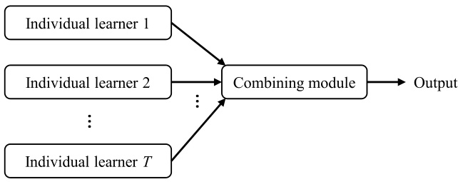
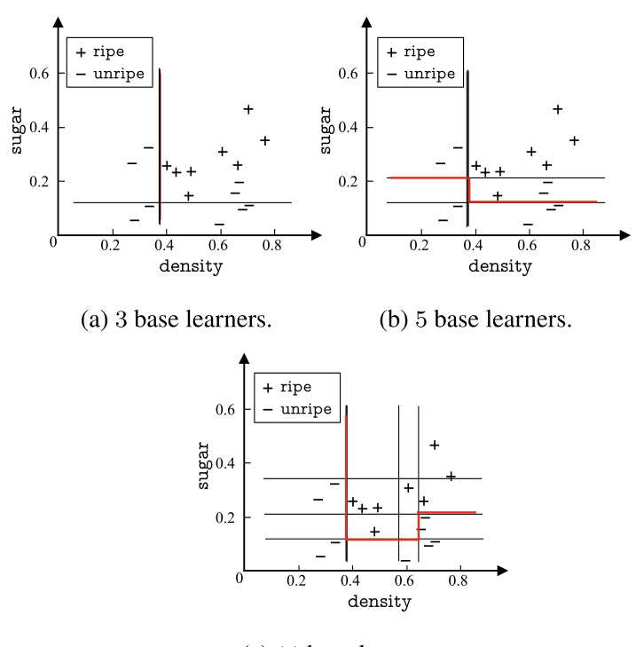
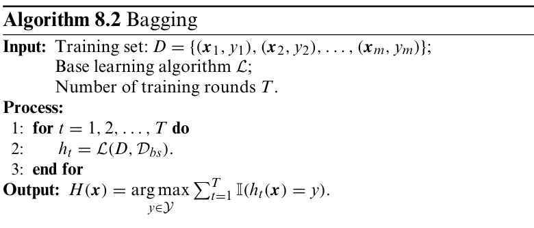
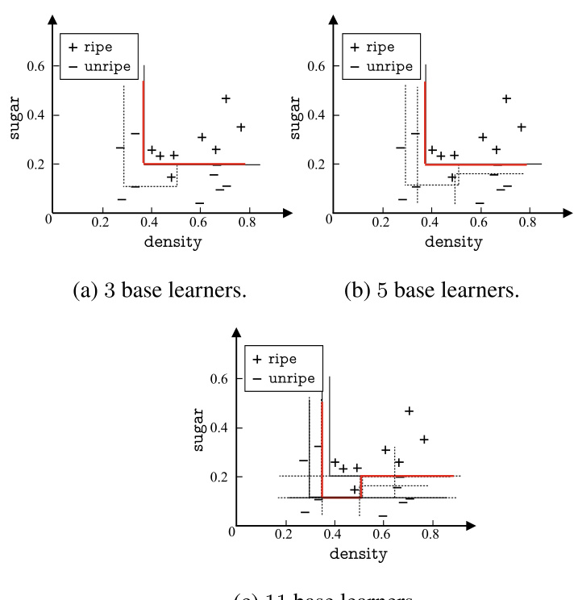
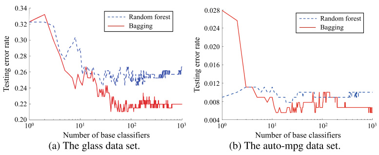
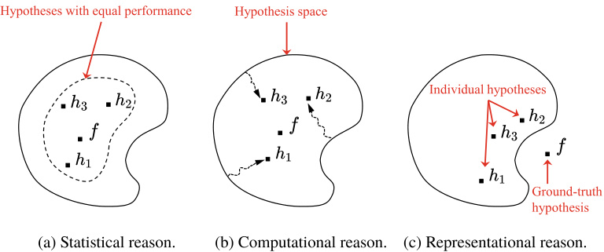
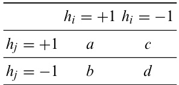
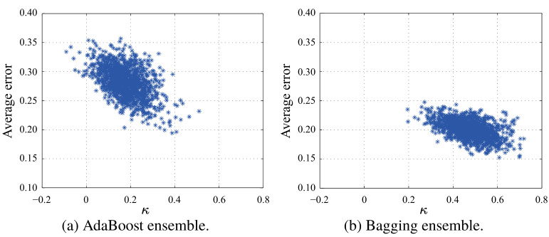
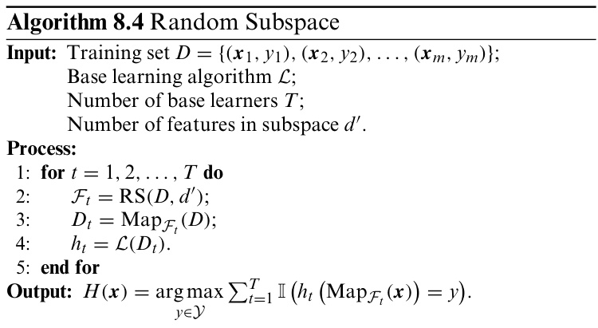

# Ensemble Learning   

## 8.1  Individual and Ensemble  

Ensemble learning, also known as multiple classifier system and committee-based learning, trains and combines multiple learners to solve a learning problem.  

As shown in  .  Figure 8.1 , the typical workflow of ensem- ble learning is training a set of individual learners first and then combining them via some strategies, where an individual learner is usually trained by an existing learning algorithm,such as the  $C4.5$   algorithm and the BP neural network algorithm. An ensemble is said to be homogeneous if all individual learners are of the same type, e.g., a ‘‘decision tree ensemble’’contains only decision trees, while a ‘‘neural network ensemble’’contains only neural networks. For homogeneous ensembles, the individual learners are called  base learners , and the corresponding learn- ing algorithms are called  base learning algorithms . In contrast, a heterogeneous ensemble contains different individual learn- ers and learning algorithms, and there is no single base learner or base learning algorithm. For heterogeneous ensembles, the individual learners are unusually called  component learners  or simply individual learners.  

Weak learners typically refer to learners with generalization ability just slightly better than random guessing, e.g., with an accuracy slightly above  $50\%$   in binary classification problems.  

By combining multiple learners, the generalization ability of an ensemble is often much stronger than that of an individual learner, and this is especially true for  weak learners . Therefore, theoretical studies on ensemble learning often focus on weak learners, and hence base learners are sometimes called weak learners. In practice, however, despite that an ensemble of weak learners can theoretically obtain good performance, people still prefer strong learners for some reasons, such as reducing the number of individual learners and reusing existing knowledge about the strong learners.  

Intuitively, mixing things with different qualities will pro- duce something better than the worst one but worse than the best one. Then, how can an ensemble produce better perfor- mance than the best individual learner?  

  
Fig. 8.1 The workflow of ensemble learning  

  

Taking binary classification as an example, suppose three classifiers are applied to three testing samples, as shown in .  Figure8.2 ,where the ticks indicate the correct classifications, and the crosses indicate the incorrect classifications. The clas- sification of ensemble learning is made by voting. In  .  Figure  $8.2\mathrm{a}$  , each classifier achieves an accuracy of   $66.6\%$  , while the ensemble achieves an accuracy of   $100\%$  . In  .  Figure   $8.2\upnu$  , the three classifiers have made identical decisions, and the ensem- ble does not improve the result. In  .  Figure   $8.2\mathrm{c}$  , each clas- sifier achieves an accuracy of   $33.3\%$  , while the ensemble gives an even worse result. From this example, we see that a good ensemble should contain individual learners that are ‘‘accurate and diverse’’. In other words, individual learners must be not bad and have  diversity  (i.e., the learners are different).  

Let us do a simple analysis with binary classification, that is,  $y\in\{-1,+1\}$  . Suppose the ground-truth function is  $f$  , and the error rate of each base learner is    $\epsilon$  . Then, for each base learner  $h_{i}$  , we have  

$$
P(h_{i}({\pmb x})\neq f({\pmb x}))=\epsilon.
$$  

Suppose ensemble learning combines the    $T$   base learners by voting, then the ensemble will make an correct classification if more than half of the base learners are correct:  

$$
F({\pmb x})=\mathrm{sign}\left(\sum_{i=1}^{T}h_{i}({\pmb x})\right).
$$  

Assuming the error rates of base learners are independent,then, from Hoeffding’s inequality, the error rate of the ensemble is  

$$
\begin{array}{r}{P(F(\pmb{x})\neq f(\pmb{x}))=\displaystyle\sum_{k=0}^{\lfloor T/2\rfloor}\binom{T}{k}(1-\epsilon)^{k}\epsilon^{T-k}}\\ {\leqslant\exp\left(-\displaystyle\frac{1}{2}\,T(1-2\epsilon)^{2}\right).}\end{array}
$$  

For ease of discussion, we assume    $T$   is odd.  

See Exercise  8.1 .  

The above equation shows that as the number of base learners  $T$   in the ensemble increases, the error rate decreases exponen- tially and eventually approaches zero.  

The above analysis makes a critical assumption that the error rates of base learners are independent. However, this assumption is invalid in practice since the learners are trained to solve the same problem and thus cannot be independent. In fact, accuracy and diversity are two conflicting properties of individual learners. Generally, when the accuracy is already high, we usually need to sacrifice some accuracy if we wish to increase diversity. It turns out that the generation and com- bination of ‘‘accurate and diverse’’ individual learners are the fundamental issues in ensemble learning.  

Current ensemble learning methods can be roughly grouped into two categories, depending on how the individual learners are generated. The first category, represented by  Boosting , cre- ates individual learners with strong correlations and generates the learners sequentially. The second category, represented by Bagging  and  Random Forest , creates individual learners inde- pendently and can parallelize the generation process.  

## 8.2  Boosting  

Boosting is a family of algorithms that convert weak learners to strong learners. Boosting algorithms start with training a base learner and then adjust the distribution of the training samples according to the result of the base learner such that incorrectly classified samples will receive more attention by subsequent base learners. After training the first base learner, the second base learner is trained with the adjusted training samples, and the result is used to adjust the training sample distribution again. Such a process repeats until the number of base learners reaches a predefined value    $T$  , and finally, these base learners are weighted and combined.  

Themostwell-known Boosting algorithm is Ada Boost(Fre- und and Schapire  1997 ), as shown in    $\circ$   Algorithm 8.1 , where  $y_{i}\in\{-1,+1\}$   and  $f$  is the ground-truth function.  

There are multiple ways to derive the AdaBoost algorithm, but one that is easy to understand is based on the additivemodel , that is, using the linear combination of base learners  

$$
H(\pmb{x})=\sum_{t=1}^{T}\alpha_{t}h_{t}(\pmb{x})
$$  

to minimize the  exponential loss function  (Friedman et al.  2000 )  

$$
\begin{aligned}
&\text { Algorithm 8.1 AdaBoost }\\
&\text { Input: Training set } D=\left\{\left(\boldsymbol{x}_1, y_1\right),\left(\boldsymbol{x}_2, y_2\right), \ldots,\left(\boldsymbol{x}_m, y_m\right)\right\} \text {; }\\
&\text { Base learner } \mathcal{L} \text {; }\\
&\text { Number of training rounds } T \text {. }\\
&\text { Process: }\\
&\mathcal{D}_1(\boldsymbol{x})=1 / m\\
&\text { for } t=1,2, \ldots, T \text { do }\\
&h_t=\mathcal{L}\left(D, \mathcal{D}_t\right)\\
&\epsilon_t=P_{\boldsymbol{x} \sim \mathcal{D}_t}\left(h_t(\boldsymbol{x}) \neq f(\boldsymbol{x})\right) \text {; }\\
&\text { if } \epsilon_t>0.5 \text { then break }\\
&\alpha_t=\frac{1}{2} \ln \left(\frac{1-\epsilon_t}{\epsilon_t}\right) \text {; }\\
&\mathcal{D}_{t+1}(\boldsymbol{x})=\frac{\mathcal{D}_t(\boldsymbol{x})}{Z_t} \times \begin{cases}\exp \left(-\alpha_t\right), & \text { if } h_t(\boldsymbol{x})=f(\boldsymbol{x}) ; \\ \exp \left(\alpha_t\right), & \text { if } h_t(\boldsymbol{x}) \neq f(\boldsymbol{x}) ;\end{cases}\\
&=\frac{\mathcal{D}_t(\boldsymbol{x}) \exp \left(-\alpha_t f(\boldsymbol{x}) h_t(\boldsymbol{x})\right)}{Z_t}\\
&\text { end for }\\
&\text { Output: } F(x)=\operatorname{sign}\left(\sum_{t=1}^T \alpha_t h_t(\boldsymbol{x})\right) \text {. }
\end{aligned}
$$

$$
\ell_{\mathrm{exp}}(H\mid\mathcal{D})=\mathbb{E}_{\mathbf{x}\sim\mathcal{D}}\left[e^{-f(\mathbf{x})H(\mathbf{x})}\right].
$$  

If    $H(x)$   minimizes the exponential loss, then we consider the partial derivative of ( 8.5 ) with respect to    $H(x)$  

$$
\frac{\partial\ell_{\exp}(H\mid\mathcal{D})}{\partial H(\pmb{x})}=-e^{-H(\pmb{x})}P(f(\pmb{x})=1\mid\pmb{x})+e^{H(\pmb{x})}P(f(\pmb{x})=-1\mid\pmb{x}),
$$  

and setting it to zero gives  

$$
H({\pmb x})=\frac{1}{2}\ln\frac{P(f({\pmb x})=1\mid{\pmb x})}{P(f({\pmb x})=-1\mid{\pmb x})}.
$$  

Hence, we have  

$$
\begin{array}{l}{{\mathrm{sign}}(H(\pmb{x}))=\mathrm{sign}\left(\displaystyle\frac{1}{2}\ln\displaystyle\frac{P(f(\pmb{x})=1\mid\pmb{x})}{P(f(\pmb{x})=-1\mid\pmb{x})}\right)}\\ {\quad\quad\quad=\displaystyle\left\{\begin{array}{l l}{1,\quad}&{P(f(\pmb{x})=1\mid\pmb{x})>P(f(\pmb{x})=-1\mid\pmb{x})}\\ {-1,}&{P(f(\pmb{x})=1\mid\pmb{x})<P(f(\pmb{x})=-1\mid\pmb{x})}\end{array}\right.}\\ {\quad\quad\quad=\displaystyle\arg\operatorname*{max}_{y\in\{-1,1\}}P(f(\pmb{x})=y\mid\pmb{x})}\end{array}
$$  

See Sect.  6.7  for the ‘‘consistency’’ of surrogate functions.  

which implies that  $\mathrm{sign}(H({\pmb x}))$   achieves the Bayes optimal error rate. In other words, the classification error rate is minimized when the exponential loss is minimized, and hence the expo- nential loss function is a consistent surrogate function of the original  $0/1$   loss function. Since this surrogate function has bet- ter mathematical properties, e.g., continuously differentiable, it is used as the optimization objective replacing the   $0/1$   loss function.  

In the AdaBoost algorithm, the base learning algorithm generates the first base classifier  $h_{1}$   from the original training data and then iteratively generates the subsequent base clas- sifiers    $h_{t}$   and associated weights    $\alpha_{t}$  . Once the classifier    $h_{t}$   is generated from the distribution    $\mathcal{D}_{t}$  , its weight    $\alpha_{t}$   is estimated by letting    $\alpha_{t}h_{t}$   minimize the exponential loss function  

$$
\begin{aligned}
\ell_{\exp }\left(\alpha_t h_t \mid \mathcal{D}_t\right) & =\mathbb{E}_{\boldsymbol{x} \sim \mathcal{D}_t}\left[e^{-f(\boldsymbol{x}) \alpha_t h_t(\boldsymbol{x})}\right] \\
& =\mathbb{E}_{\boldsymbol{x} \sim \mathcal{D}_t}\left[e^{-\alpha_t} \mathbb{I}\left(f(\boldsymbol{x})=h_t(\boldsymbol{x})\right)+e^{\alpha_t} \mathbb{I}\left(f(\boldsymbol{x}) \neq h_t(\boldsymbol{x})\right)\right] \\
& =e^{-\alpha_t} P_{\boldsymbol{x} \sim \mathcal{D}_t}\left(f(\boldsymbol{x})=h_t(\boldsymbol{x})\right)+e^{\alpha_t} P_{\boldsymbol{x} \sim \mathcal{D}_t}\left(f(\boldsymbol{x}) \neq h_t(\boldsymbol{x})\right) \\
& =e^{-\alpha_t}\left(1-\epsilon_t\right)+e^{\alpha_t} \epsilon_t,
\end{aligned}
$$ 

where    $\epsilon=P_{\pmb{x}\sim\mathcal{D}_{t}}(h_{t}(\pmb{x})\neq f(\pmb{x}))$  . Setting the derivative of the exponential loss function  

$$
\frac{\partial\ell_{\mathrm{exp}}(\alpha_{t}h_{t}\mid\mathcal{D}_{t})}{\partial\alpha_{t}}=-e^{-\alpha_{t}}(1-\epsilon_{t})+e^{\alpha_{t}}\epsilon_{t}
$$  

to zero gives the optimal    $\alpha_{t}$   as  

$$
\alpha_{t}=\frac{1}{2}\ln\left(\frac{1-\epsilon_{t}}{\epsilon_{t}}\right),
$$  

which is exactly the equation shown in line  6  of    $^{\circ}$   Algorithm 8.1 .  

The AdaBoost algorithm adjusts the sample distribution based on    $H_{t-1}$   such that the base learner  $h_{t}$   in the next round can correct some mistakes made by    $H_{t-1}$  . Ideally, we wish    $h_{t}$  to correct all mistakes made by    $H_{t-1}$  . The minimization of  $\ell_{\mathrm{exp}}(H_{t-1}+\alpha_{t}h_{t}\mid\mathcal{D})$   can be simplified to  

$$
\begin{array}{r l}&{\ell_{\exp}(H_{t-1}+h_{t}\mid\mathcal{D})=\mathbb{E}_{x\sim\mathcal{D}}\left[e^{-f(\pmb{x})(H_{t-1}(\pmb{x})+h_{t}(\pmb{x}))}\right]}\\ &{\qquad\qquad\qquad\qquad=\mathbb{E}_{x\sim\mathcal{D}}\left[e^{-f(\pmb{x})H_{t-1}(\pmb{x})}e^{-f(\pmb{x})h_{t}(\pmb{x})}\right].}\end{array}
$$  

Since  $f^{2}({\pmb x})\,=\,h_{t}^{2}({\pmb x})\,=\,1$  12 ) can be approximated using Taylor expansion of  e  $e^{-f({\pmb x})h_{t}({\pmb x})}$    as  

$$
\begin{array}{r l}&{\ell_{\exp}(H_{t-1}+h_{t}\mid\mathcal{D})\simeq\mathbb{E}_{\mathbf{x}\sim\mathcal{D}}\left[e^{-f(\mathbf{x})H_{t-1}(\mathbf{x})}\left(1-f(\mathbf{x})h_{t}(\mathbf{x})+\displaystyle\frac{f^{2}(\mathbf{x})h_{t}^{2}(\mathbf{x})}{2}\right)\right]}\\ &{\qquad\qquad\qquad=\mathbb{E}_{\mathbf{x}\sim\mathcal{D}}\left[e^{-f(\mathbf{x})H_{t-1}(\mathbf{x})}\left(1-f(\mathbf{x})h_{t}(\mathbf{x})+\frac{1}{2}\right)\right].}\end{array}
$$  

Hence, the ideal classifier is  

$$
\begin{array}{r l}&{h_{t}(\pmb{x})=\underset{h}{\arg\operatorname*{min}}\,\ell_{\exp}(H_{t-1}+h\mid\mathcal{D})}\\ &{\quad=\underset{h}{\arg\operatorname*{min}}\,\mathbb{E}_{\pmb{x}\sim\mathcal{D}}\left[e^{-f(\pmb{x})H_{t-1}(\pmb{x})}\left(1-f(\pmb{x})h(\pmb{x})+\frac{1}{2}\right)\right]}\\ &{\quad=\underset{h}{\arg\operatorname*{max}}\,\mathbb{E}_{\pmb{x}\sim\mathcal{D}}\left[e^{-f(\pmb{x})H_{t-1}(\pmb{x})}f(\pmb{x})h(\pmb{x})\right]}\\ &{\quad=\underset{h}{\arg\operatorname*{max}}\,\mathbb{E}_{\pmb{x}\sim\mathcal{D}}\left[\frac{e^{-f(\pmb{x})H_{t-1}(\pmb{x})}}{\mathbb{E}_{\pmb{x}\sim\mathcal{D}}\left[e^{-f(\pmb{x})H_{t-1}(\pmb{x})}\right]}f(\pmb{x})h(\pmb{x})\right],}\end{array}
$$  

where    $\mathbb{E}_{{\pmb x}\sim\mathcal{D}}\left[e^{-f({\pmb x})H_{t-1}({\pmb x})}\right]$  
  is a constant. Let    $\mathcal{D}_{t}$   denote a dis- tribution  

$$
\mathcal{D}_{t}(\pmb{x})=\frac{\mathcal{D}(\pmb{x})e^{-f(\pmb{x})H_{t-1}(\pmb{x})}}{\mathbb{E}_{\pmb{x}\sim\mathcal{D}}\left[e^{-f(\pmb{x})H_{t-1}(\pmb{x})}\right]}.
$$  

According to the definition of mathematical expectation, the ideal classifier is equivalent to  

$$
\begin{array}{r l}&{h_{t}(\pmb{x})=\arg\operatorname*{max}_{h}\mathbb{E}_{\pmb{x}\sim\mathcal{D}}\left[\frac{e^{-f(\pmb{x})H_{t-1}(\pmb{x})}}{\mathbb{E}_{\pmb{x}\sim\mathcal{D}}\left[e^{-f(\pmb{x})H_{t-1}(\pmb{x})}\right]}f(\pmb{x})h(\pmb{x})\right]}\\ &{\qquad\qquad=\arg\operatorname*{max}_{h}\mathbb{E}_{\pmb{x}\sim\mathcal{D}_{t}}[f(\pmb{x})h(\pmb{x})].\qquad\qquad\qquad\qquad\qquad(8.}\end{array}
$$  

Since  $f({\pmb x}),h({\pmb x})\in\{-1,+1\}$  , we have  

$$
f(\pmb{x})h(\pmb{x})=1-2\mathbb{I}(f(\pmb{x})\neq h(\pmb{x})),
$$  

and the ideal classifier is  

$$
h_{t}(\pmb{x})=\operatorname*{arg\,min}_{h}\mathbb{E}_{\pmb{x}\sim\mathcal{D}_{t}}\left[\mathbb{I}(f(\pmb{x})\neq h(\pmb{x}))\right].
$$  

From ( 8.18 ), we see that the ideal classifier    $h_{t}$   minimizes the classification error under the distribution    $\mathcal{D}_{t}$  . Therefore, the weak classifier at round    $t$   is trained on the distribution    $\mathcal{D}_{t}$  , and its classification error should be less than 0 . 5 for    $\mathcal{D}_{t}$  . This idea is similar to the  residual approximation  to some extent. Consid- ering the relationship between    $\mathcal{D}_{t}$   and    $\mathcal{D}_{t+1}$  , we have  

$$
\begin{array}{r l}&{\mathcal{D}_{t+1}(\pmb{x})=\frac{\mathcal{D}_{t}(\pmb{x})e^{-f(\pmb{x})H_{t}(\pmb{x})}}{\mathbb{E}_{\pmb{x}\sim\mathcal{D}}\left[e^{-f(\pmb{x})H_{t}(\pmb{x})}\right]}}\\ &{\qquad\qquad=\frac{\mathcal{D}_{t}(\pmb{x})e^{-f(\pmb{x})H_{t-1}(\pmb{x})}e^{-f(\pmb{x})\alpha_{t}h_{t}(\pmb{x})}}{\mathbb{E}_{\pmb{x}\sim\mathcal{D}}\left[e^{-f(\pmb{x})H_{t}(\pmb{x})}\right]}}\\ &{\qquad\qquad=\mathcal{D}_{t}(\pmb{x})\cdot e^{-f(\pmb{x})\alpha_{t}h_{t}(\pmb{x})}\frac{\mathbb{E}_{\pmb{x}\sim\mathcal{D}}\left[e^{-f(\pmb{x})H_{t-1}(\pmb{x})}\right]}{\mathbb{E}_{\pmb{x}\sim\mathcal{D}}\left[e^{-f(\pmb{x})H_{t}(\pmb{x})}\right]},}\end{array}
$$  

which is the update rule of a sample distribution as in line  7  of  $^{\circ}$   Algorithm 8.1 .  

From ( 8.11 ) and ( 8.19 ), we can see that the AdaBoost algo- rithm, as shown in    $\circ$   Algorithm 8.1 , can be derived by iter- atively optimizing the exponential loss function based on an additive model.  

Boosting algorithms require the base learners to learn from specified sample distributions, and this is often accomplished by  re-weighting ; that is, in each round, a new weight is assigned to a training sample according to the new sample distribution. For base learning algorithms that do not accept weighted sam- ples,  re-sampling  can be used; that is, in each round, a new training set is sampled from the new sample distribution. In general, there is not much difference between re-weighting and re-sampling in terms of prediction performance. Note that in each round, there is a sanity check on whether the current base learner satisfies some basic requirements. For example, line  5 of  .  Algorithm 8.1  checks whether the current base learner is better than random guessing. If the requirements are not met, the current base learner is discarded and the learning process stops. In such cases, the number of rounds could still be far from the pre-specified limit    $T$  , which may lead to unsatisfac- tory performance due to the small number of base learners in the ensemble. However, if the re-sampling method is used, there is an option to ‘‘restart’’to avoid early termination (Kohavi and Wolpert  1996 ). More specifically, a new training set is sampled according to the sample distribution again after discarding the current disqualified base learner, and then an alternative base learner is trained such that the learning process can continue to finish    $T$   rounds.  

A decision stump is a decision tree with a single layer. See Sect.  4.3 .  

The size refers to the number of base learners in an ensemble.  

From the perspective of bias-variance decomposition,Boost- ing mainly focuses on reducing bias,and this is why an ensemble of learners with weak generalization ability can be so powerful. To give a more concrete illustration, we use decision stumps as the base learner and run the AdaBoost algorithm on the water- melon data set   $3.0\alpha$   (  $\bullet$  Table 4.5 ). The decision boundaries of ensembles of different sizes together with the corresponding base learners are illustrated in    $\circ$   Figure 8.3 .  

  

## 8.3  Bagging and Random Forest  

From Sect.  8.1 , we know that the generalization ability of an ensemble depends on the independence of base learners. Though strict independence is not possible in practice, we can still make the learners as different as possible. One way of cre- ating different base learners is to partition the original training set into several non-overlapped subsets and use each subset to train a base learner. Because the training subsets are differ- ent, the trained base learners are likely to be different as well. However, if the subsets are totally different, then it implies that each subset contains only a small portion of the original train- ing set, possibly leading to poor base learners. Since a good ensemble requires each base learner to be reasonably good, we often allow the subsets to overlap such that each of them contains sufficient samples.  

### 8.3.1  Bagging  

Bagging stands for Bootstrap AGGregaING.  

See Sect.  2.2.3  for bootstrap sampling.  

That is, all base learners are equally weighted through voting or averaging.  

$\mathcal{D}_{b s}$   is the distribution of a data set generated by bootstrap.  

For AdaBoost, modifications are needed to enable multiclass classification or regression. See (Zhou  2012 ) for some variants.  

Bagging (Breiman  1996a ) is a representative method of parallel ensemble learning based on bootstrap sampling. It works as follows: given a data set with    $m$   samples, we randomly pick one sample and copy it to the sampling set; we keep it in the original data set such that it still has a chance to be picked up next time; repeating this process    $m$   times gives a data set containing  m samples, where some of the original samples may appear more than once while some may never appear. From ( 2.1 ), we know that approximately   $63.2\%$   of the original samples will appear in the data set.  

Applying the above process    $T$   times produces    $T$   data sets, and each contains    $m$   samples. Then, the base learners are trained on these data sets and combined. Such a procedure is the basic workflow of Bagging. When combining the predic- tionsofbaselearners,Baggingadoptsthesimplevotingmethod for classification tasks and the simple averaging method for regression tasks. When multiple classes receive the same num- ber of votes, we can choose one at random or further investi- gate the confidence of votes. The Bagging algorithm is given in .  Algorithm 8.2 .  

  

Suppose that the computational complexity of a base learner is    $O(m)$  , then the complexity of Bagging is roughly    $T({\cal O}(m)+$   $O(s)_{\varepsilon}$  ) , where    $O(s)$   is the complexity of voting or averaging. Since the complexity    $O(s)$   is low and    $T$  is a constant that is often not too large, Bagging has the same order of complexity as the base learner, that is, Bagging is an efficient ensemble learn- ing algorithm. Besides, unlike the standard AdaBoost, which only applies to binary classification, Bagging can be applied to multiclass classification and regression without modification.  

The bootstrap sampling brings Bagging another advantage: since each base learner only uses roughly   $63.2\%$   of the origi- nal training samples for training, the remaining   $36.8\%$   sam- ples can be used as a validation set to get an  out-of-bag esti- mate  (Breiman  1996a ; Wolpert and Macready  1999 ) of the gen- eralization ability. To get the out-of-bag estimate, we need to track the training samples used by each base learner. Let    $D_{t}$  denote the set of samples used by the learner    $h_{t}$  , and    $H^{\mathrm{oob}}({\pmb x})$  denote the out-of-bag prediction of the sample  $\pmb{x}$  , that is, con- sidering only the predictions made by base learners that did not use the sample  $\pmb{x}$   for training. Then, we have  

See Sect.  2.2.3  for out-of-bag estimate.  

$$
H^{\mathrm{oob}}(\pmb{x})=\underset{y\in y}{\arg\operatorname*{max}}\sum_{t=1}^{T}\mathbb{I}(h_{t}(\pmb{x})=y)\cdot\mathbb{I}(\pmb{x}\notin D_{t}),
$$  

and the out-of-bag estimate of the generalization error of Bag- ging is  

$$
\epsilon^{\mathrm{oob}}=\frac{1}{|D|}\sum_{(\pmb{x},y)\in D}\mathbb{I}(H^{\mathrm{oob}}(\pmb{x})\neq y).
$$  

Other than estimating the generalization errors, the out-of- bag samples also have many other uses. For example, when the base learners are decision trees, the out-of-bag samples can be used for pruning branches or estimating the posterior proba- bility of each node, and this is particularly useful when a node contains no training samples. When the base learners are neu- ral networks, the out-of-bag samples can be used to assist early stopping to reduce the risk of overfitting.  

From the perspective of bias-variance decomposition, Bag- ging helps to reduce the variance, and this is particularly useful for unpruned decision trees or neural networks that are unsta- ble to data manipulation. To give a more concrete illustration, we use decision trees based on information gain as base learn- ers to run the Bagging algorithm on the watermelon data set  $3.0\alpha$   (  $\pmb{\bigcirc}$   Table 4.5 ). The decision boundaries of ensembles of different sizes together with the respective base learners are illustrated in  .  Figure 8.4 .  

### 8.3.2  Random Forest  

Random Forest (RF) (Breiman  2001a ) is an extension of Bag- ging, where randomized feature selection is introduced on top of Bagging. Specifically, traditional decision trees select an optimal split feature from the feature set of each node, whereas RF selects from a subset of    $k$   features randomly generated from the feature set of the node. The parameter    $k$   controls the randomness, where the splitting is the same as in tradi- tional decision trees if    $k=d$  , and a split feature is randomly  

  

selected if    $k\,=\,1$  . Typically, the recommended value of    $k$   is  $k=\log_{2}d$   (Breiman  2001a ).  

See Sect.  8.5.3  for sample manipulation and feature manipulation.  

Despite its ease of implementation and low computational cost, RF often shows surprisingly good performance in real- world applications and is honored as a representative of state- of-the-art ensemble learning methods. With a small modifica- tion, RF introduces feature-based ‘‘diversity’’ to Bagging by feature manipulation, while Bagging considers sample-based diversity only. RF further enlarges the difference between base learners, which leads to ensembles with better generalization ability.  

The convergence property of RF is comparable to that of Bagging. As illustrated in  .  Figure 8.5 , RF usually starts with a poor performance at the beginning, especially when there is only one base learner in the ensemble since the feature manip- ulation reduces the performance of each base learner. Even- tually, however, RF often converges to a lower generalization error after adding more base learners to the ensemble. It is worth mentioning that it is often more efficient to train an RF than applying Bagging since RF uses ‘‘randomized’’ decision trees that evaluate subsets of features for splitting, whereas  

  
Fig. 8.5 The impact of the ensemble size on RF and Bagging on two UCI data sets  

Bagging uses ‘‘deterministic’’ decision trees that evaluate all features for splitting.  

## 8.4  Combination Strategies  

As illustrated in  .  Figure 8.6 , combining individual learners is beneficial from the following three perspectives (Dietterich 2000 ):  

5  Statistical perspective: since the hypothesis space is often large, there are usually multiple hypotheses achieving the same performance. If a single learner is chosen, then the generalization performance solely depends on the quality of this single learner. Combining multiple learners will reduce the risk of incorrectly choosing a single poor learner.  

5  Computational perspective: learning algorithms are often stuck in local optimum, which may lead to poor general- ization performance even when there is abundant training data. If choosing another way by repeating the learning pro- cess multiple times, the risk of being stuck in a terrible local  

  
Fig. 8.6 The benefits of combining learners (Dietterich  2000 )  

optimum is reduced, though it is not guaranteed to be the global optimum. 5  Representational perspective: sometimes, the ground-truth hypothesis is not represented by any candidates in the hypothesis space of the current learning algorithm. In such cases, it is for sure that a single learner will not find the ground-truth hypothesis. On the other hand, the hypothesis space extends by combining multiple learners, and hence it is more likely to find a better approximation to the ground- truth hypothesis.  

Suppose an ensemble contains    $T$  individual learners    $\{h_{1},h_{2}$  ,  $\cdot\cdot\cdot,h_{T}\}$  , where    $h_{i}({\pmb x})$   is the output of    $h_{i}$   on sample  $\pmb{x}$  . The rest of this section introduces several typical strategies for combing  $h_{i}$  .  

### 8.4.1  Averaging  

Averaging is the most commonly used combination strategy for numerical output    $h_{i}({\pmb x})\,\,\in\,\,\mathbb{R}$  . Typical averaging methods include  simple averaging  

$$
H({\pmb x})=\frac{1}{T}\sum_{i=1}^{T}h_{i}({\pmb x})
$$  

and  weighted averaging  

$$
H(\pmb{x})=\sum_{i=1}^{T}w_{i}h_{i}(\pmb{x}),
$$  

In a study of Stacking regression, (Breiman  1996b ) found that the weights must be non-negative to ensure the ensemble performs better than the best single learner. Hence, the non-negative constraint is often applied to the weights of learners.  

where    $w_{i}$   is the weight of individual learner    $h_{i}$  , and typically  $\begin{array}{r}{w_{i}\ \geqslant\ 0,\sum_{i=1}^{T}w_{i}\ =\ 1}\end{array}$  =  =  1. Si raging is a special case of weighted averaging when  $w_{i}=1/T$  .  

Weighted averaging has been widely used since the 1950s (Markowitz  1952 ), and it was first used in ensemble learn- ing in Perrone and Cooper ( 1993 ). Weighted averaging plays an important role in ensemble learning since other combina- tion methods can all be viewed as its special cases or variants. Indeed, weighted averaging can be regarded as a fundamental motivation of ensemble learning studies. Given a set of base learners, different ensemble learning methods can be regarded as different ways of assigning the weights.  

Typically, weights are learned from training data. However, the learned weights are often unreliable due to data insuffi- ciency or noise. This is particularly true for large ensembles with many base learners because trying to learn too many weights can easily lead to overfitting. In fact, many empiri- cal studies and applications have shown that weighted averag- ing is not necessarily better than simple averaging (Xu et al. 1992 ; Ho et al.  1994 ; Kittler et al.  1998 ). Generally speaking, the weighted averaging method is a better choice when individ- ual learners have considerable different performance, while the simple averaging method is preferred when individual learners share similar performance.  

For example, setting the weights inversely proportional to the estimated errors of individual learners.  

### 8.4.2  Voting  

For classification, a learner    $h_{i}$   predicts a class label from a set of    $N$   class labels    $\{c_{1},c_{2},.\,.\,.\,,c_{N}\}$  , and a commo combination strategy is voting. For ease of discussion, let the  N -dimensional vector    $\bar{(h_{i}^{1}(\pmb{x});h_{i}^{2}(\pmb{x});\ldots;h_{i}^{N}(\pmb{x}))}$   denote the output of  $h_{i}$  on the sample  $\pmb{x}$  , where  $h_{i}^{j}({\pmb x})$   is the output of    $h_{i}$   on  $\pmb{x}$   for the class label  $c_{j}$  . Then, we can define the following voting methods:  

5  Majority voting:  

$$
\begin{array}{r l}&{H(\pmb{x})=\left\{\begin{array}{l l}{c_{j},}&{\mathrm{if}\ \sum_{i=1}^{T}{h_{i}^{j}(\pmb{x})}>0.5\sum_{k=1}^{N}{\sum_{i=1}^{T}{h_{i}^{k}(\pmb{x})}};}\\ {\mathrm{reject},}&{\mathrm{otherwise}.}\end{array}\right.}\end{array}
$$  

That is, output the class label that receives more than half of the votes or refuses to predict if none of the class labels receive more than half of the votes.  

5  Plurality voting:  

$$
\begin{array}{r}{H(\pmb{x})=c_{\arg\operatorname*{max}_{j}\sum_{i=1}^{T}h_{i}^{j}(\pmb{x}).}}\end{array}
$$  

That is, output the class label that receives the most votes and randomly select one in case of a tie.  

5  Weighted voting:  

$$
H(\pmb{x})=c_{\arg\operatorname*{max}_{j}\sum_{i=1}^{T}w_{i}h_{i}^{j}(\pmb{x})}
$$  

That is, a plurality voting with weights assigned to learn- ers, where  $w_{i}$   is the weight of    $h_{i}$  , and typically    $w_{i}\geqslant0$   and  $\begin{array}{r}{\sum_{i=1}^{T}w_{i}=1}\end{array}$   1 like the constraints on  $w_{i}$   in weighted averag- = ing ( 8.23  

The standard majority voting ( 8.24 ) offers a ‘‘reject’’option, which is an effective mechanism for tasks requiring reliability (e.g., medical diagnosis). However, if it is compulsory to make a prediction, then plurality voting can be used instead. For tasks that do not allow rejections, both the majority and the plurality voting methods are called majority voting, or just voting.  

Equations ( 8.24 )− ( 8.26 ) assume no particular value type for the output    $h_{i}^{j}({\pmb x})$  , but two common value types are  

5  Class label    $h_{i}^{j}(x)\,\in\,\{0,1\}$  : the output is 1 if    $h_{i}$   predicts the sample  $\pmb{x}$   as class    $c_{j}$  , and 0 otherwise. The corresponding voting is known as  hard voting . 5  Class probability  $h_{i}^{j}(x)\in[0,\bar{1]}$  : an estimate to the posterior probability    $P(c_{j}\mid\pmb{x})$  . The corresponding voting is known as  soft voting .  

For example, a heterogeneous ensemble consists of different types of base learners.  

Different types of    $h_{i}^{j}({\pmb x})$   should not be mixed. For some learners, the class labels come with confidence values that can be converted into class probabilities. However, if the con- fidence values are unnormalized (e.g., the margin values in SVM), then, before using the confidence values as probabili- ties, we need to apply  calibration  techniques, such as Platt scal- ing (Platt  2000 ) and isotonic regression (Zadrozny and Elkan 2001 ). Interestingly, though the class probabilities are often imprecise, the performance of combining class probabilities usually outperforms that of combining class labels. Note that the class probabilities are not comparable if different types of base learners are used. In such cases, the class probabilities can be converted into class labels before voting, e.g., setting the largest  $h_{i}^{j}({\pmb x})$   as 1 and the others as 0.  

### 8.4.3  Combining by Learning  

Stacking is also a well-known ensemble learning method on its own, and many ensemble learning methods can be viewed as its special cases or variants. We introduce it here since it is also a special combination method.  

When there is abundant training data, a more powerful combi- nation strategy is  combining by learning : using a meta-learner to combine the individual learners. A representative of such methods is  Stacking  (Wolpert  1992 ; Breiman  1996b ). Here, we call the individual learners as first-level learners and call the learners performing the combination as second-level learners or meta-learners.  

Stacking starts by training the first-level learners using the original training set and then ‘‘generating’’ a new data set for training the second-level learner. In the new data set, the outputs of the first-level learners are used as the input fea- tures, while the labels from the original training set remain unchanged. The Stacking algorithm is given in  .  Algorithm 8.3 , where the first-level learners are assumed heterogeneous.  

$$
\begin{aligned}
&\text { Algorithm 8.3 Stacking }\\
&\text { Input: Training set } D=\left\{\left(\boldsymbol{x}_1, y_1\right),\left(\boldsymbol{x}_2, y_2\right), \ldots,\left(\boldsymbol{x}_m, y_m\right)\right\} \text {; }\\
&\text { First-level learning algorithms } \mathcal{L}_1, \mathcal{L}_2, \ldots, \mathcal{L}_T \text {; }\\
&\text { Second-level learning algorithm } \mathcal{L} \text {. }\\
&\text { Process: } \square\\
&\text { for } t=1,2, \ldots, T \text { do }\\
&h_t=\mathcal{L}_t(D) ;\\
&\text { end for }\\
&D^{\prime}=\varnothing \text {; }\\
&\text { for } i=1,2, \ldots, m \text { do }\\
&\text { for } t=1,2, \ldots, T \text { do }\\
&z_{i t}=h_t\left(x_i\right)\\
&\text { end for }\\
&D^{\prime}=D^{\prime} \cup\left(\left(z_{i 1}, z_{i 2}, \ldots, z_{i T}\right), y_i\right) ;\\
&\text { end for }\\
&h^{\prime}=\mathcal{L}\left(D^{\prime}\right) \text {. }\\
&\text { Output: } H(x)=h^{\prime}\left(h_1(\boldsymbol{x}), h_2(\boldsymbol{x}), \ldots, h_T(\boldsymbol{x})\right) \text {. }
\end{aligned}
$$ 

When generating the second-level training set from the first- levellearners,there would be a high risk of over fitting if the gen- erated training set contains the exact training samples used by thefirst-levellearners.Hence,we often employ cross-validation or leave-one-out methods such that the samples that have not been used for the training of the first-level learners are used for generating the training set for the second-level learner. Taking    $k$  -fold cross-validation as an example. The original training set is partitioned into  $k$   roughly equal-sized partitions  $D_{1},D_{2},.\,.\,,D_{k}$  . Denote    $D_{j}$  and    $\overline{{D}}_{j}=D\backslash D_{j}$   as the tes ng set and the training set of the  j th fold, respectively. For  T  first- level learning algorithms, the first-level learner    $h_{t}^{(j)}$  is obtained by applying the  t th learning algorithm on the subset    $\overline{{D}}_{j}$  . Let  $z_{i t}=h_{t}^{(j)}(\pmb{x}_{i})$  , then, for each sample    $\pmb{x}_{i}$   in    $D_{j}$  , the output from the first-level learners can be written as  $z_{i}=(z_{i1};z_{i2};.\.\.;z_{i T})$  , which is used as the input for the second-level learner with the original label    $y_{i}$  . By finishing the entire cross-validation process on the    $T$   first-level learners, we obtain a data set  $D^{\prime}=\{(z_{i},y_{i})\}_{i=1}^{m}$    for training the second-level learner.  

The generalization ability of a Stacking ensemble heav- ily depends on the representation of the input features for the second-level learner as well as the choice of the second- level learning algorithm. Existing studies show that the Multi- response Linear Regression (MLR) is a good second-level learning algorithm when the first-level learners output class probabilities (Ting and Witten  1999 ), and the MLR can do an even better job when different sets of features are used (Seewald 2002 ).  

Generate first-level learner  $h_{t}$  using first-level learning algorithm Generate second-level training    $\mathcal{L}_{t}$  . set.  

Generate second-level learner    $h^{\prime}$  using second-level learning algorithm on    $\mathcal{D}^{\prime}$  .  

MLR is a classifier based on linear regression. It builds a linear regression model for each class by setting the output of samples belonging to this class as 1 and 0 for the rest. Then, a testing sample is classified as the class with the highest predicted output value.  

This is how the StackingC algorithm is implemented in WEKA.  

Bayes Model Averaging (BMA) assigns weights to different learners based on posterior probabilities, and it can be regarded as a special implementation of the weighted averaging method. Clarke ( 2003 ) compared Stacking and BMA and showed that, in theory, if there is limited noise in the data and the correct data generating model is among the models under considera- tion, then BMA is guaranteed to be no worse than Stacking. In practice, however, the correct data generating model is by no way guaranteed in the models under consideration, and some- times even hard to be approximated by the models under con- sideration. Hence, Stacking usually performs better than BMA in practice since it is more robust than BMA; besides, BMA is also more sensitive to approximation errors.  

## 8.5  Diversity  

### 8.5.1  Error-Ambiguity Decomposition  

As mentioned in Sect.  8.1 , to have an ensemble with strong gen- eralization ability, the individual learners should be ‘‘accurate and diverse’’. This section is devoted to providing a brief theo- retical analysis of this aspect.  

Let us assume that the individual learners  $h_{1},h_{2},\ldots,h_{T}$  are combined via weighted averaging ( 8.23 ) into an ensemble for the regression task  $f:\mathbb{R}^{d}\mapsto\mathbf{\bar{R}}$  . Then, for the sample    $\pmb{x}$  , the ambiguity  of the learner  $h_{i}$   is defined as  

$$
A(h_{i}|{\pmb x})=(h_{i}({\pmb x})-H({\pmb x}))^{2},
$$  

and the  ambiguity  of the ensemble is defined as  

$$
\begin{array}{l}{{\displaystyle\overline{{{A}}}(h\mid\pmb{x})=\sum_{i=1}^{T}w_{i}A(h_{i}\mid\pmb{x})}}\\ {~~}\\ {{\displaystyle=\sum_{i=1}^{T}w_{i}(h_{i}(\pmb{x})-H(\pmb{x}))^{2}.}}\end{array}
$$  

The ambiguity term represents the degree of disagreement among individual learners on the sample    $\pmb{x}$  , which reflects the level of diversity in some sense. The squared errors of the indi- vidual learner  $h_{i}$   and the ensemble    $H$   are, respectively,  

$$
\begin{array}{r}{E(h_{i}\mid\pmb{x})=(f(\pmb{x})-h_{i}(\pmb{x}))^{2},}\\ {E(H\mid\pmb{x})=(f(\pmb{x})-H(\pmb{x}))^{2}.}\end{array}
$$  

Let    $\begin{array}{r}{\overline{{E}}(h\ |\ x)\,=\,\sum_{i=1}^{T}w_{i}\,\cdot\,E(h_{i}\ |\ x)}\end{array}$  =  ·  |  denote the weighted average error of individual learners, then, we have  

$$
\begin{array}{l}{{\overline{{{A}}}(h\mid\pmb{x})=\displaystyle\sum_{i=1}^{T}w_{i}E(h_{i}\mid\pmb{x})-E(H\mid\pmb{x})}}\\ {{\quad\quad\quad\quad\quad\quad\quad\quad=\overline{{{E}}}(h\mid\pmb{x})-E(H\mid\pmb{x}).}}\end{array}
$$  

Since ( 8.31 ) holds for every sample    $\pmb{x}$  , for all samples we have  

$$
\sum_{i=1}^{T}w_{i}\int A(h_{i}\mid\pmb{x})p(\pmb{x})d\pmb{x}=\sum_{i=1}^{T}w_{i}\int E(h_{i}\mid\pmb{x})p(\pmb{x})d\pmb{x}-\int E(H\mid\pmb{x})p(\pmb{x})d\pmb{x},
$$  

where  $p(\pmb{x})$   is the probability density of the sample  $\pmb{x}$  . Similarly, the generalization error and the ambiguity term of the learner  $h_{i}$   on all samples are, respectively,  

$$
\begin{array}{l}{E_{i}=\displaystyle\int E(h_{i}\mid\boldsymbol{x})p(\boldsymbol{x})d\boldsymbol{x},}\\ {A_{i}=\displaystyle\int A(h_{i}\mid\boldsymbol{x})p(\boldsymbol{x})d\boldsymbol{x}.}\end{array}
$$  

The generalization error of the ensemble is  

$$
E=\int E(H\mid x)p(x)d x.
$$  

Here, we abbreviate    $E(h_{i})$   and  $A(h_{i})$   as  $E_{i}$   and    $A_{i}$  .  

Here, we abbreviate    $E(H)$   as    $E$  .  

Let    $\begin{array}{r}{\overline{{E}}=\sum_{i=1}^{T}w_{i}E_{i}}\end{array}$   denote the weighted average error of = individual learners, and    $\begin{array}{r}{\overline{{A}}=\sum_{i=1}^{T}w_{i}A_{i}}\end{array}$   denote the weighted = average ambiguity of individual learners. Then, substituting ( 8.33 )− ( 8.35 ) into ( 8.32 ) gives  

$$
E={\overline{{E}}}-{\overline{{A}}}.
$$  

The elegant Equation ( 8.36 ) clearly shows that the generaliza- tion ability of an ensemble depends on the accuracy and diver- sity of individual learners. The above analysis is known as the error-ambiguity decomposition  (Krogh and Vedelsby  1995 ).  

Given the above analysis, some readers may propose that we can easily obtain the optimal ensemble by optimizing    ${\overline{{E}}}\!-\!{\overline{{A}}}$  directly. Unfortunately, direct optimization of    ${\overline{{E}}}\!-\!{\overline{{A}}}$   is hard in practice, not only because both terms are defined in the entire sample space but also because    $\overline{{A}}$   is not a diversity measure that is directly operable; it is only known after we have the ensemble fully constructed. Besides, we should note that the above derivation process is only applicable to regression and is difficult to extend to classification.  

### 8.5.2  Diversity Measures  

Diversity measures , as the name suggests, are for measuring the diversity of individual learners in an ensemble. A typical approach is to measure the pairwise similarity or dissimilarity between learners.  

See Sect.  2.3.2  for confusion matrix.  

Given a data set    $D=\{({\pmb x}_{1},y_{1}),({\pmb x},y_{2}),.\,.\,.\,,({\pmb x}_{m},y_{m})\}$  , the contingency table  of the classifiers    $h_{i}$   and    $h_{j}$   for binary classifi- cation (i.e.,    $y_{i}\in\{-1,+1\}$  ) is  

  

where    $a$   is the number of samples predicted as positive by both  $h_{i}$   and    $h_{j}$  , and similarly for    $b,\,c,$  , and    $d$  . With the contingency table, we list some representative diversity measures below as follows:  

5  Disagreement measure:  

$$
\mathrm{dis}_{i j}=\frac{b+c}{m},
$$  

where the range of   $\mathrm{{dis}}_{i j}$   is  [ 0 ,  1 ] , and a larger value indicates a higher diversity.  

5  Correlation coefficient:  

$$
\rho_{i j}=\frac{a d-b c}{\sqrt{(a+b)(a+c)(c+d)(b+d)}},
$$  

where the range of    $\rho_{i j}$   is    $[-1,1]$  . When    $h_{i}$   and  $h_{j}$   are unre- lated, the value is 0. The value is positive when    $h_{i}$   and    $h_{j}$  are positively correlated, and negative when    $h_{i}$   and    $h_{j}$   are negatively correlated.  

5    $\boldsymbol{Q}$  -statistic:  

$$
Q_{i j}={\frac{a d-b c}{a d+b c}},
$$  

where    $Q_{i j}$   has the same sign as the correlation coefficient  $\rho_{i j}$  , and  ${\left|{{\mathcal{Q}}_{i j}}\right|}\geqslant{\left|{{\rho}_{i j}}\right|}$  .  

5    $\kappa$  -statistic:  

$$
\kappa={\frac{p_{1}-p_{2}}{1-p_{2}}},
$$  

where  $p_{1}$   is the probability that these two classifiers agree on the prediction, and  $p_{2}$   is the probability of agreement by  

  
Fig. 8.7 The  $\kappa$  -error diagrams on the UCI  tic-tac-toe  data set; every ensemble consists of   $50\,\,{\bf C4.5}$   decision trees  

chance. Given a data set  $D$  , these two probabilities can be estimated as  

$$
\begin{array}{l}{p_{1}=\displaystyle\frac{a+d}{m},}\\ {p_{2}=\displaystyle\frac{(a+b)(a+c)+(c+d)(b+d)}{m^{2}}.}\end{array}
$$  

If the two classifiers agree on all samples in    $D$  , then    $\kappa=1$  ; if the two classifiers agree by chance, then  $\kappa=0$  . Normally,    $\kappa$  is a non-negative value, but it can be negative in rare cases where the agreement is even less than what is expected by chance.  

The aforementioned diversity measures are all pairwise measures that can be easily visualized with 2-D plots. For example, the well-known ‘‘  $\kappa$  -error diagrams’’, as illustrated in .  Figure 8.7 , plot each pair of classifiers as a point in a scatter plot, where the  $\mathbf{X}$  -axis represents their    $\kappa$   value, and the y-axis represents their average error. The closer the points to the top of the plot, the lower the accuracy of individual classifiers; the closer the points to the right-hand side of the plot, the less the diversity of individual classifiers.  

### 8.5.3  Diversity Generation  

Our previous discussions showed that effective ensemble learn- ing relies on diverse individual learners,but how can we enhance diversity? The general idea is to introduce some randomness into the learning process by manipulating the data samples, input features, output representations, and algorithm parame- ters.  

5  Data sample manipulation : given the original data set, we can manipulate it by generating multiple subsets to train different individual learners. Data sample manipulation is often based on sampling methods such as bootstrap sam- pling used by Bagging and sequential sampling used by AdaBoost. This approach is widely adopted due to its sim- plicity and effectiveness. Some base learners, such as deci- sion trees and neural networks, are called  unstable base learners  since they are sensitive to data sample manipula- tion, that is, a small change to the training samples leads to significant changes to the base learners. Hence, data sam- p ling manipulation is particularly effective for unstable base learners. On the other hand, some base learners, such as lin- ear learners, SVM, naïve Bayes, and    $k$  -nearest neighbors, are  stable base learners  that are insensitive to data sample manipulation. Hence, other mechanisms are needed, such as input feature manipulation.  

A subspace usually refers to a lower dimensional feature space mapped from the original higher dimensional feature space. The features describing the lower dimensional space are not necessarily the original features but transformed from the original features. See Chap.  10 .  

$d^{\prime}$    is smaller than the number of original features    $d$  .  

$\mathcal{F}_{t}$   includes    $d^{\prime}$    randomly selected features, and  $D_{t}$   keeps only the features in    $\mathcal{F}_{t}$  .  

5  Input feature manipulation : the training samples are usu- ally described by a set of features, where different  subspaces (subsets of features) offer different views of the data, and the individual learners trained on different subspaces will be different. The  Random Subspace  algorithm (Ho  1998 ) is a well-known ensemble method that relies on input fea- ture manipulation. As illustrated in  .  Algorithm 8.4 , the random subspace algorithm extracts multiple subsets of features and uses each subset to train a base learner. For data with many redundant features, applying the random subspace algorithm improves not only the diversity but also the efficiency. Meanwhile, due to the redundant fea- tures, the performance of learners trained with a subset of features is often acceptable. Nevertheless, the input fea- ture manipulation is often not a good choice when there is a limited number of features or low feature redundancy.  

  

5  Output representation manipulation : diversity can also be enhanced by manipulating the output representations. One method is making small changes to the class labels. For example, the Flipping Output method (Breiman  2000 ) ran- domly flips the class labels of some samples. Alternatively, we can transform the output representation. For example, the Output Smearing (Breiman  2000 ) method converts clas- sification outputs into regression outputs before construct- ing individual learners. Besides, we can also divide the orig- inal task into multiple subtasks that can be solved in paral- lel. For example, the ECOC method (Dietterich and Bakiri 1995 ) employs error-correcting output codes to divide a multiclass classification task into multiple binary classifi- cation tasks to train base learners.  

5  Algorithm Parameter Manipulation :base learning algorithms often have parameters, such as the number of hidden neu- rons and initial connection weights in neural networks. By randomly setting the parameters, we can obtain individual learners that are quite different. For example, the  Negative Correlation  method (Liu and Yao  1999 ) employs a regular- ization term to enforce individual neural networks to use different parameters. For algorithms with limited parame- ters, we can replace some internal components with alter- natives for manipulation. For example, using different split feature selection methods in individual decision trees. Note that when a single learner is to be used, we often deter- mine the best parameters by training multiple learners with different parameter settings (e.g., cross-validation), though only one of them is selected. In contrast, ensemble learning utilizes all of these trained learners, and hence the practi- cal computational cost of creating an ensemble is not much higher than creating a single learner.  

Different diversity generation mechanisms can be used together.Forexample,the random forest introduced inSect.  8.3.2 employs both the data sample manipulation and input feature manipulation.Some methods use more mechanisms at the same time (Zhou  2012 ).