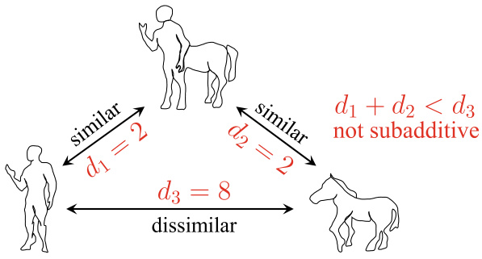
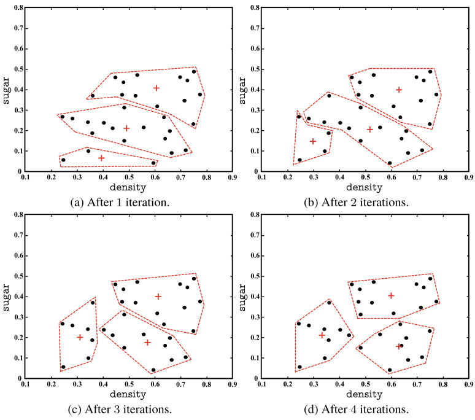
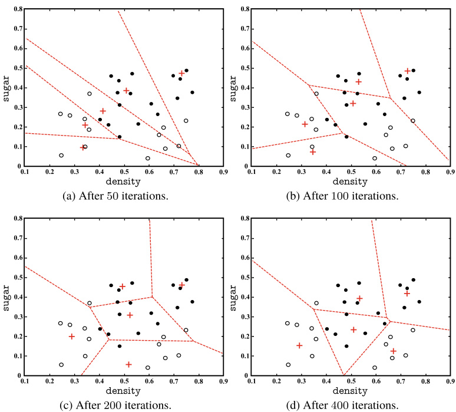
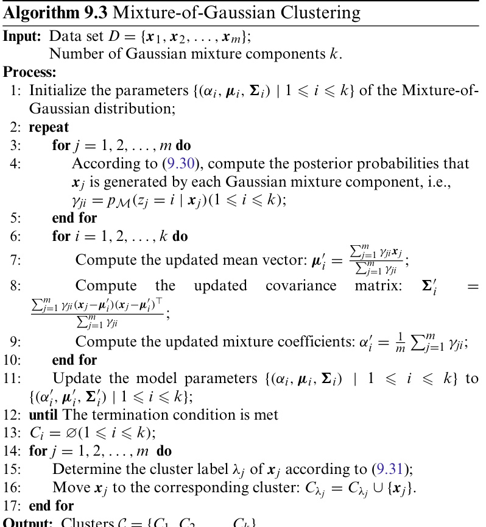
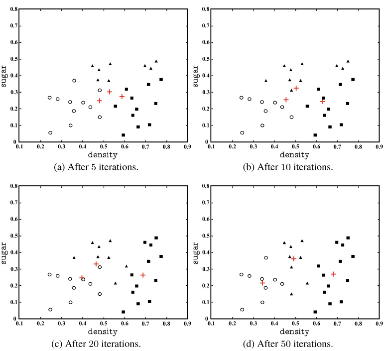
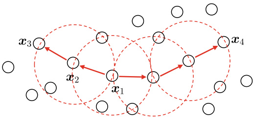
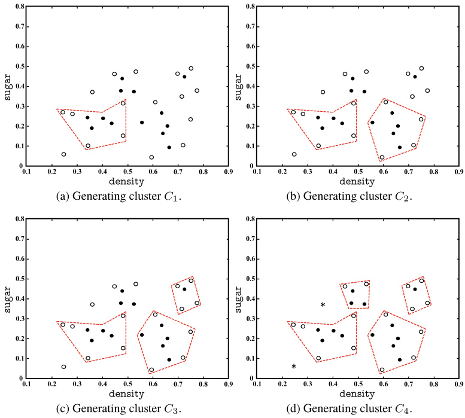
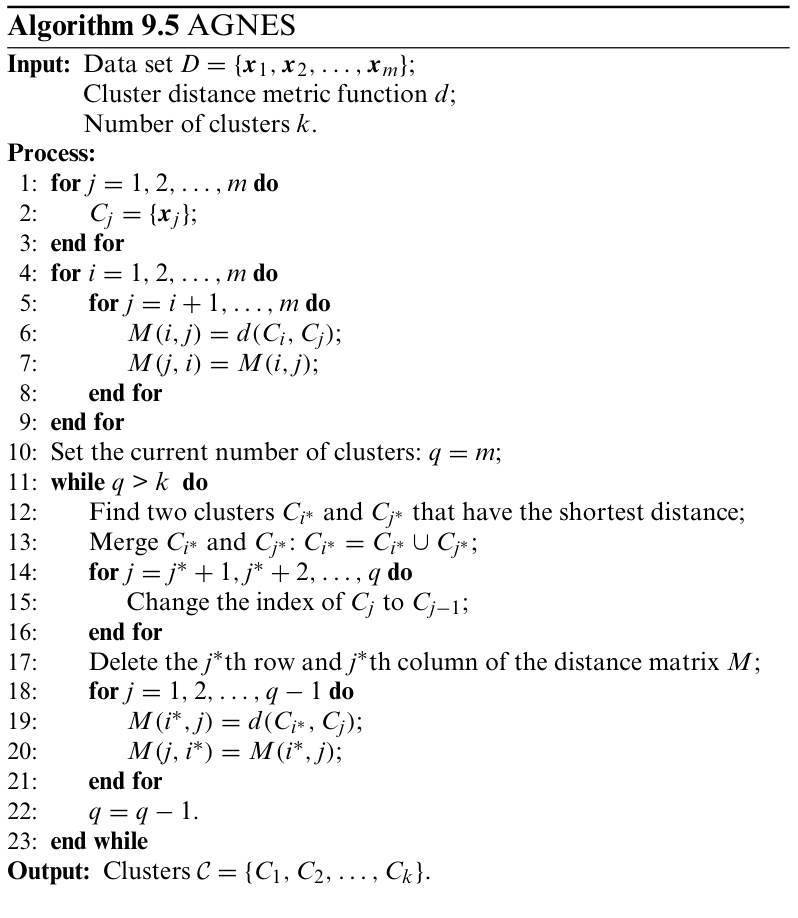
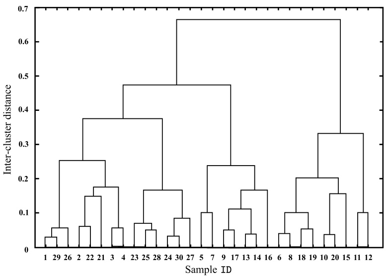
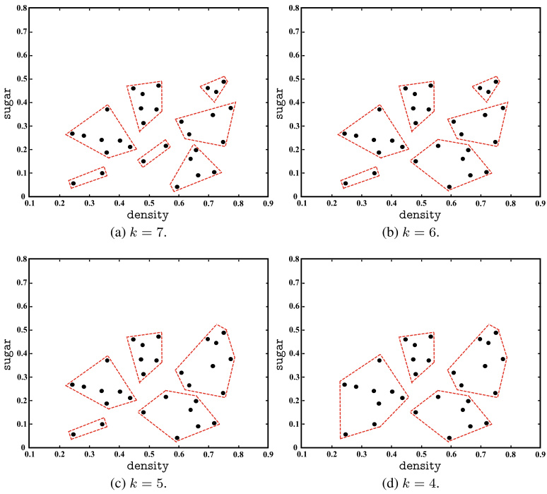

# Clustering  

## 9.1  Clustering Problem  

Unsupervised learning  aims to discover underlying properties and patterns from unlabeled training samples and lays the foundation for further data analysis. Among various unsuper- vised learning techniques, the most researched and applied one is  clustering .  

Other unsupervised learning tasks include  density estimation , anomaly detection , etc.  

For clustering algorithms, a cluster is also called a  class .  

Clustering can also use labeled samples (e.g., Sects.  9.4.2  and 13.6 ). However, the generated clusters and the class labels are different.  

Clustering aims to partition a data set into disjoint subsets, where each subset is called a  cluster . Through the partitioning, each cluster is potentially corresponding to a concept (cate- gory), such as ‘‘light green watermelon’’, ‘‘dark green water- melon’’, ‘‘seeded watermelon’’, ‘‘seedless watermelon’’, or even ‘‘locally grown watermelon’’and ‘‘imported watermelon’’. Note that clustering algorithms are unaware of such concepts before clustering and are only responsible for creating the clusters. The concept carried by each cluster, however, is interpreted by the user.  

Formally, given a data set    $D=\{\pmb{x}_{1},\pmb{x}_{2},.\,.\,.\,,\pmb{x}_{m}\}$   containing m un beledsamples,whereeachsample  $x_{i}=(x_{i1};x_{i2};.\,.\,;x_{i n})$  is an  n -dimensional vector. Then, a clustering algorithm parti- tionsth  $D$   $k$  disjoi  $\{C_{l}\mid l=1,2,\ldots,k\}$  , where    $C_{l^{\prime}}\,\cap_{l^{\prime}\neq l}\,C_{l}\,=\,\emptyset$  and  $D\,=\,\cup_{l=1}^{k}C_{l}$  . Accordingly, we =  $\lambda_{j}\in\{1,2,\ldots,k\}$   ∈{ }  as the  cluster label  of sample    $\pmb{x}_{j}$   (i.e.,  $x_{j}\,\in\,C_{\lambda_{j}},$   ∈ ). Then, th n be  presented as a cluster label vector  $\pmb{\lambda}=(\lambda_{1};\lambda_{2};\ldots;\lambda_{m})$   = ; ;  ;  with  m  elements.  

Clustering can be used by itself to identify the inherent structure of data, while it can also serve as a pre-processing technique for other learning tasks such as classification. For example, a business may want to classify new users into differ- ent ‘‘categories’’, but this may not be easy. In such a case, we can use clustering to group all users into clusters, where each cluster represents a user category. Then, a classification model can be built upon the clusters for classifying the category of new users.  

Depending on the learning strategy used, clustering algo- rithms can be divided into several categories. The representa- tive algorithms of each category will be discussed in the sec- ond half of this chapter. Before that, let us first discuss two fundamental problems involved with clustering—performance measure and distance calculation.  

## 9.2  Performance Measure  

Performance measures for clustering are also called  validity indices . As classification result is evaluated by performance measures in supervised learning, the clustering result also needs to be evaluated via some validity indices. Besides, once a valid- ity index is selected, we can embed it into the optimization objective of clustering algorithms such that the generated clus- ters are more aligned to the desired results.  

See Sect.  2.3  for performance measures in supervised learning.  

So, how does a good clustering look like? Intuitively, we wish ‘‘things of a kind come together’’; that is, samples in the same cluster should be as similar as possible while samples from different clusters should be as different as possible. In other words, we seek clusters with high  intra-cluster similarity and low  inter-cluster similarity .  

Roughly speaking, there are two types of clustering validity indices. The first type is  external index , which compares the clustering result against a  reference model . The second type is  internal index , which evaluates the clustering result without using any reference model.  

Given a data set    $D=\{\pmb{x}_{1},\pmb{x}_{2},.\,.\,.\,,\pmb{x}_{m}\}$  , suppose a cluster- ing algorithm produces the clusters    ${\mathcal{C}}=\{C_{1},\,C_{2},\,.\,.\,.\,,\,C_{k}\}$  , and a reference mod l giv the clusters    ${\mathcal{C}}^{*}\;=\;\{C_{1}^{*},\,C_{2}^{*},\,.\,.\,.\,,\,C_{s}^{*}\}$    . Accordingly, let  λ  and  $\lambda^{*}$  denote the clustering label vectors of  $\mathcal{C}$   and  $\mathcal{C}^{*}$  , respectively. Then, for each pair of samples, we can define the following four terms  

$$
a=|S S|\,,\quad S S=\{(\pmb{x}_{i},\pmb{x}_{j})\mid\lambda_{i}=\lambda_{j},\lambda_{i}^{*}=\lambda_{j}^{*},i<j\},
$$  

$$
\begin{array}{l}{{b=\left|S D\right|,\quad S D=\{(x_{i},x_{j})\mid\lambda_{i}=\lambda_{j},\lambda_{i}^{*}\neq\lambda_{j}^{*},i<j\},}}\\ {{\mathrm{}}}\\ {{c=\left|D S\right|,\quad D S=\{(x_{i},x_{j})\mid\lambda_{i}\neq\lambda_{j},\lambda_{i}^{*}=\lambda_{j}^{*},i<j\},}}\\ {{\mathrm{}}}\\ {{d=\left|D D\right|,\quad D D=\{(x_{i},x_{j})\mid\lambda_{i}\neq\lambda_{j},\lambda_{i}^{*}\neq\lambda_{j}^{*},i<j\},}}\end{array}
$$  

where the set    $S S$   includes the sample pairs that both samples belong to the same cluster in    $\mathcal{C}$   and also belong to the same cluster in  $\mathcal{C}^{*}$  ; the set    $S D$   includes sample pairs that both samples belong to the same cluster in    $\mathcal{C}$   but not in    $\mathcal{C}^{*}$  ; the sets    $D S$   and  $D D$   can be interpreted similarly. Since each sample pair    $(\pmb{x}_{i},\pmb{x}_{j})$   $(i<j)$   can only appear in one set, we have    $\displaystyle a+b+c+d=$   $m(m-1)/2$  .  

With ( 9.1 )− ( 9.4 ), some commonly used external indices can be defined as follows:  

Jaccard Coefficient (JC):  

$$
\mathrm{JC}=\frac{a}{a+b+c}.
$$  

Fowlkes and Mallows Index (FMI):  

$$
{\mathrm{FMI}}={\sqrt{\frac{a}{a+b}\cdot{\frac{a}{a+c}}}}.
$$  

Rand Index (RI):  

$$
\mathbf{R}\mathbf{I}={\frac{2(a+d)}{m(m-1)}}.
$$  

The above external validity indices take values in the interval [ 0 ,  1 ] , and a larger index value indicates better clustering qual- ity.  

Internal validity indices evaluate the clustering quality with- out using a reference model. Given the generated clusters  ${\mathcal{C}}=\{C_{1},C_{2},.\,.\,.\,,\,C_{k}\}$  , we can define the following four terms:  

$$
\begin{array}{c}{\displaystyle\mathrm{avg}(C)=\frac{2}{|C|\,(|C|-1)}\sum_{1\leqslant i<j\leqslant|C|}\mathrm{dist}(x_{i},x_{j}),}\\ {\displaystyle\mathrm{diam}(C)=\operatorname*{max}_{1\leqslant i<j\leqslant|C|}\mathrm{dist}(x_{i},x_{j}),}\\ {\displaystyle d_{\mathrm{min}}(C_{i},C_{j})=\operatorname*{min}_{x_{i}\in C_{i},x_{j}\in C_{j}}\mathrm{dist}(x_{i},x_{j}),}\\ {\displaystyle d_{\mathrm{cn}}(C_{i},C_{j})=\mathrm{dist}(\pmb{\mu}_{i},\pmb{\mu}_{j}),}\end{array}
$$  

A larger distance corresponds to a lower similarity. Distance calculations will be discussed in the next section.  

where  $\begin{array}{r}{\pmb{\mu}=\frac{1}{|C|}\sum_{1\leqslant i\leqslant|C|}\pmb{x}_{i}}\end{array}$    denotes the centroid of cluster    $C$  , and dist  $(\cdot,\cdot)$   measures the distance between two samples. Here,  $\operatorname{avg}(C)$   is the average distance between the samples in cluster  $C$  ; diam  $(C)$   is the largest distance between samples in cluster  $C$  ;  $d_{\operatorname*{min}}(C_{i},\,C_{j})$   is the distance between two nearest samples in clusters    $C_{i}$   and    $C_{j}$  ; and    $d_{\mathrm{cent}}(C_{i},\,C_{j})$   is the distance between the centroids of clusters    $C_{i}$   and    $C_{j}$  .  

With ( 9.8 )− ( 9.11 ), some commonly used internal validity indices can be defined as follows:  

Davies− Bouldin Index (DBI):  

$$
\mathbf{DBI}=\frac{1}{k}\sum_{i=1}^{k}\operatorname*{max}_{j\neq i}\left(\frac{\mathrm{avg}(C_{i})+\mathrm{avg}(C_{j})}{d_{\mathrm{pen}}(C_{i},\,C_{j})}\right).
$$  

Dunn Index (DI):  

$$
\mathrm{DI}=\operatorname*{min}_{1\leqslant i\leqslant k}\left\{\operatorname*{min}_{j\neq i}\left(\frac{d_{\operatorname*{min}}(C_{i},\,C_{j})}{\operatorname*{max}_{1\leqslant l\leqslant k}\mathrm{diam}(C_{l})}\right)\right\}.
$$  

A smaller value of DBI indicates better clustering quality, while a larger value of DI indicates better clustering quality.  

## 9.3  Distance Calculation  

Given a function   $\mathrm{{dist}}(\cdot,\cdot)$  , if it is a  distance measure , then it must have the following axioms:  

ntwosamples  $x_{i}=(x_{i1};x_{i2};.\,.\,.\,;x_{i n})$  and  $x_{j}=(x_{j1};\,x_{j2}$  ;  $\cdot\cdot\colon x_{j n})$   ; , a commonly used measure is the  Minkowski distance  

$$
\mathrm{dist}_{\mathrm{mk}}(\pmb{x}_{i},\pmb{x}_{j})=\left(\sum_{u=1}^{n}\left|x_{i u}-x_{j u}\right|^{p}\right)^{\frac{1}{p}}.
$$  

When  $p\ \geqslant\ 1$  , ( 9.18 ) satisfies the distance measure axioms ( 9.14 )− ( 9.17 ).  

When  $p=2$  ,the Minkowski distance becomes the Euclidean distance  

$$
\mathrm{dist}_{\mathrm{cd}}(\pmb{x}_{i},\pmb{x}_{j})=\left\|\pmb{x}_{i}-\pmb{x}_{j}\right\|_{2}=\sqrt{\sum_{u=1}^{n}\left|x_{i u}-x_{j u}\right|^{2}}.
$$  

When  $p\rightarrow\infty$  , it becomes the Chebyshev distance .  

When  $p=1$  , the Minkowski distance becomes the  Manhat- tan distance  

$$
\mathrm{dist}_{\mathrm{mon}}({\pmb x}_{i},{\pmb x}_{j})=\left\|{\pmb x}_{i}-{\pmb x}_{j}\right\|_{1}=\sum_{u=1}^{n}\left|x_{i u}-x_{j u}\right|.
$$  

We generally divide attributes into  continuous attributes , which have infinite domains, and  categorical attributes , which have finite domains. However, for distance calculations, it is more important to consider whether the attributes include  ordi- nal information . For example, a categorical attribute with the domain  { 1 ,  2 ,  3 }  is more like a continuous attribute since the distance can be calculated with the attribute values, that is,  $^{\ast1^{\ast}}$   is closer to   $^{\ast2^{\ast}}$   than   $^{\ast}3^{\ast}$  . Such attributes are called  ordi- nal attributes . In contrast, if the domain of an attribute is dis- crete like { aircraft ,  train ,  ship }, then the distance cannot be Also known as the  city block distance .  

Continuous attributes are also known as  numerical attributes , and categorical attributes are also known as  nominal attributes .  

directly calculated with the attribute values, and such attributes are  non-ordinal attributes . Note that the Minkowski distance is only applicable to ordinal attributes.  

When the class information is given,  $k$   is usually set to the number of classes.  

For non-ordinal attributes, the Value Difference Metric (VDM) (Stanfill and Waltz  1986 ) can be used instead. Let    $m_{u,a}$  denote the number of samples taking value    $a$  on the attribute    $u$  , and    $m_{u,a,i}$   denote the number of samples within the  i th cluster taking value    $a$   on the attribute    $u$  , and    $k$   is the number of clus- ters. Then, the VDM distance between two categorical values  $a$   and  $b$   of attribute    $u$   is  

$$
\mathrm{VDM}_{p}(a,b)=\sum_{i=1}^{k}\left|\frac{m_{u,a,i}}{m_{u,a}}-\frac{m_{u,b,i}}{m_{u,b}}\right|^{p}.
$$  

For mixed attribute types, we can combine the Minkowski distance and the VDM. Without loss of generality, we arrange ordinal attributes in front of non-ordinal attributes and let    $n_{c}$  denote the number of ordinal attributes and  $n-n_{c}$   denote the number of non-ordinal attributes. Then, the joint distance mea- sure is  

$$
\mathrm{Minkov}\mathrm{DM}_{p}(x_{i},x_{j})=\left(\sum_{u=1}^{n_{c}}\left|x_{i u}-x_{j u}\right|^{p}+\sum_{u=n_{c}+1}^{n}\mathrm{VDM}_{p}(x_{i u},x_{j u})\right)^{\frac{1}{p}}.
$$  

In cases where different attributes have different impor- tance, we can use  weighted distance . For example, the weighted Minkowski distance is  

$$
\mathrm{dist}_{\mathrm{wndk}}(x_{i},x_{j})=(w_{1}\cdot\left|x_{i1}-x_{j1}\right|^{p}+.\,.+w_{n}\cdot\left|x_{i n}-x_{j n}\right|^{p})^{\frac{1}{p}},
$$  

where the weights    $w_{i}\geqslant0$     $(i=1,2,.\ldots,n)$   represent the impor- tance of attributes, and typically  $\textstyle\sum_{i=1}^{n}w_{i}=1$  

We often define  similarity measures  via some kinds of dis- tances, and the larger the distance, the lower the similarity. However, it is worth noting that distances used in defining similarity measures are not required to satisfy all axioms of being distance measures, particularly the subadditivity ( 9.17 ). For example, we may seek a similarity measure that considers humans  and  horses  are different, but considers both are simi- lar to  centaurs . To make this happen, we need to ensure small distances from  humans  and  horses  to  centaurs , while ensuring a large distance between  humans  and  horses . Such distances, as illustrated in  .  Figure 9.1 , do not satisfy the subadditivity  

  
Fig. 9.1 An example of non-metric distance  

condition, and hence are called  non-metric distances . Last but not least, the distance calculation methods introduced in this section are defined in advance, but in some real-world tasks, it is necessary to determine the distance calculation method based on the data samples via  distance metric learning .  

## 9.4  Prototype Clustering  

Prototype clustering , also known as  prototype-based clustering , is a family of clustering algorithms that assumes the clustering structure can be represented by a set of prototypes. Typically, such algorithms start with some initial prototypes, and then iteratively update and optimize the prototypes. Many algo- rithms have been developed using different prototype repre- sentations and optimization methods. The rest of this section discusses several well-known prototype-based clustering algo- rithms.  

See Sect. 10.6 for distance metriclearning.  

A ‘‘prototype’’ refers to a representative data point in the sample space.  

### 9.4.1    $\pmb{k}$  -Means Clustering  

Given a data set  $D=\{\pmb{x}_{1},\pmb{x}_{2},.\,.\,.\,,\pmb{x}_{m}\}$  , the  $k$  -means algorithm minimizes the squared error of clusters  ${\mathcal{C}}=\{C_{1},\,C_{2},.\,.\,.\,,\,C_{k}\}$  :  

$$
E=\sum_{i=1}^{k}\sum_{\pmb{x}\in C_{i}}\|\pmb{x}-\pmb{\mu}_{i}\|_{2}^{2}\,,
$$  

where  $\begin{array}{r}{\pmb{\mu}_{i}=\frac{1}{|C_{i}|}\sum_{\pmb{x}\in C_{i}}\pmb{x}}\end{array}$   is the mean vector of cluster    $C_{i}$  . Intu- ||∈itively, ( 9.24 ) represents the closeness between the mean vector of a cluster and the samples within that cluster, where a smaller  $E$   indicates higher intra-cluster similarity.  

Nevertheless, minimizing ( 9.24 ) is not easy since it requires evaluations of all possible partitions of the data set    $D$  , which is indeed an NP-hard problem (Aloise et al.  2009 ). Hence, the  $k$  -means algorithm takes a greedy strategy and adopts an iter- ative optimization method to find an approximate solution of ( 9.24 ). The algorithm is illustrated in    $\circ$   Algorithm 9.1 , where line 1 initializes the mean vectors, and lines 4− 8 and lines 9− 16 iteratively update the clusters and mean vectors, respectively. When the clusters do not change after one iteration, the current clusters are returned.  

We take the watermelon data set 4 . 0 in    $\circ$  Table 9.1  as an example to demonstrate the    $k$  -means algorithm. For ease of discussion, let  $\pmb{x}_{i}$   represent the sample with the   $\operatorname{Im}i,$  , where  $\pmb{x}_{i}$  is a two-dimensional vector containing the attributes  density and  sugar .  

The watermelon data set   $3.0\alpha$   in  $\circ$   Table 4.5  is a subset of the watermelon data set 4 . 0. The class label of the samples 9− 21 is  ripe  $=$  false , and the class label of the rest samples is ripe  $=$  true . Since we do not use the label information in this section, the labels are omitted in the table.  

  

Suppose we set    $k=3$  , then the algorithm randomly picks up three samples    $\pmb{x}_{6}$  ,    $\pmb{x}_{12}$  , and    $\pmb{x}_{24}$   as the initial mean vectors, that is,  

$$
\pmb{\mu}_{1}=(0.403;0.237),\ \ \pmb{\mu}_{2}=(0.343;0.099),\ \ \pmb{\mu}_{3}=(0.478;0.437).
$$  

Then, for the sample    $\pmb{x}_{1}=(0.697;0.460)$  , its distances to the three current mean vectors  ${\pmb{\mu}}_{1},{\pmb{\mu}}_{2}$  , and  $\pmb{\mu}_{3}$   are 0 . 369, 0 . 506, and 0 . 220, respectively. Since its distance to    $\pmb{\mu}_{3}$   is the shortest,  $\pmb{x}_{1}$   is assigned to cluster    $C_{3}$  . Similarly, we evaluate all samples in the data set and find the following cluster assignments:  

$$
\begin{aligned}
&\text { Algorithm } 9.1 k \text {-Means Clustering }\\
&\text { Input: Data set } D=\left\{x_1, x_2, \ldots, x_m\right\}\\
&\text { Number of clusters } k \text {. }\\
&\text { Process: }\\
&\text { 1: Randomly select } k \text { samples as the initial mean vectors }\\
&\left\{\boldsymbol{\mu}_1, \boldsymbol{\mu}_2, \ldots, \boldsymbol{\mu}_k\right\}\\
&\text { repeat }\\
&C_i=\varnothing(1 \leqslant i \leqslant k) \text {; }\\
&\text { for } j=1,2, \ldots, m \text { do }\\
&\text { Compute the distance between sample } \boldsymbol{x}_j \text { and each mean }\\
&\text { vector } \boldsymbol{\mu}_i(1 \leqslant i \leqslant k): d_{j i}=\left\|\boldsymbol{x}_j-\boldsymbol{\mu}_i\right\|_2\\
&\text { According to the nearest mean vector, decide the cluster label }\\
&\text { of } \boldsymbol{x}_j: \lambda_j=\underset{i \in\{1,2, \ldots, k\}}{\arg \min } d_{j i} \text {; }\\
&\text { Move } \boldsymbol{x}_j \text { to the corresponding cluster: } C_{\lambda_j}=C_{\lambda_j} \cup\left\{\boldsymbol{x}_j\right\} ;\\
&\text { end for }\\
&\text { for } i=1,2, \ldots, k \text { do }\\
&\text { Compute the updated mean vectors: } \boldsymbol{\mu}_i^{\prime}=\frac{1}{\left|C_i\right|} \sum_{\boldsymbol{x} \in C_i} \boldsymbol{x} \text {; }\\
&\text { if } \mu_i^{\prime} \neq \mu_i \text { then }\\
&\text { Update the current mean vector } \boldsymbol{\mu}_i \text { to } \boldsymbol{\mu}_i^{\prime} \text {; }\\
&\text { else }\\
&\text { Leave the current mean vector unchanged. }\\
&\text { end if }\\
&\text { end for }\\
&\text { until All mean vectors remain unchanged }\\
&\text { Output: Clusters } \mathcal{C}=\left\{C_1, C_2, \ldots, C_k\right\} \text {. }
\end{aligned}
$$

In order to avoid long execution time, we often set a maximum number of iterations or a threshold of minimum change to stop the learning early.  

$$
\begin{array}{r l}&{C_{1}=\{x_{3},x_{5},x_{6},x_{7},x_{8},x_{9},x_{10},x_{13},x_{14},x_{17},x_{18},x_{19},x_{20},x_{23}\};}\\ &{C_{2}=\{x_{11},x_{12},x_{16}\};}\\ &{C_{3}=\{x_{1},x_{2},x_{4},x_{15},x_{21},x_{22},x_{24},x_{25},x_{26},x_{27},x_{28},x_{29},x_{30}\}.}\end{array}
$$  

From    $C_{1},\,C_{2}$   and    $C_{3}$  , we can calculate the new mean vectors  

$$
\pmb{\mu}_{1}^{\prime}=(0.493;0.207),\ \ \pmb{\mu}_{2}^{\prime}=(0.394;0.066),\ \ \pmb{\mu}_{3}^{\prime}=(0.602;0.396).
$$  

The above process repeats until convergence. For example, as illustrated in    $^{\circ}$   Figure 9.2 , the    $k$  -means algorithm finds the final cluster assignments when the 5th iteration produced the same clusters as the 4th iteration.  

### 9.4.2  Learning Vector Quantization  

Learning Vector Quantization (LVQ) is another prototype- based clustering algorithm similar to the    $k$  -means algorithm but requires labeled data samples; that is, the clustering pro- cess is assisted by supervised information.  

The clustering process can be viewed as identifying  subclasses , where each subclass corresponds to one cluster.  

  
Fig. 9.2 Results of the    $k$  -means algorithm on the watermelon data set 4 . 0 with  $k=3$  . The samples and mean vectors are represented by   $"\bullet"$   and ‘  $"+"$  , respectively. The red dashed lines are the boundaries of clusters  

Givenadataset  $D=\{({\pmb x}_{1},y_{1}),({\pmb x},y_{2}),.\,.\,.\,,({\pmb x}_{m},y_{m})\}$  ,where each sample  $\pmb{x}_{j}$   is described by an    $n$  -dimensional feature vector  $(x_{j1};\,x_{j2};\,.\,.\,;\,x_{j n})$   and a class label  $y_{j}\in\mathcal{Y}.$   learn a set of  n -dimensional prototype vectors  {  $\{p_{1},p_{2},.\,.\,.\,,p_{q}\}$  } , where each prototype vector represents one cluster and its class label is    $t_{i}\in\mathcal Y$  .  

As illustrated in  .  Algorithm 9.2 , the LVQ algorithm starts with an initialization of the prototype vectors in line 1, e.g., randomly selects a sample with class label    $t_{q}$   as the prototype vector for the  q th cluster. The prototype vectors are iteratively optimized in lines 2− 12. In each round, the algorithm randomly selects a labeled sample and finds its nearest prototype vector, and then the prototype vector is updated based on whether the selected sample has the same class label with the prototype vector. In line 12, the current prototype vectors are returned as the final result if the stopping condition is met, e.g., the maximum number of iterations is reached, or there is minor or even no update to the prototype vectors.  

$$
\begin{aligned}
&\text { Algorithm 9.2 Learning Vector Quantization }\\
&\text { Input: Training set } D=\left\{\left(\boldsymbol{x}_1, y_1\right),\left(\boldsymbol{x}_2, y_2\right), \ldots,\left(\boldsymbol{x}_m, y_m\right)\right\} \text {; }\\
&\text { Number of prototype vectors } q \text {; }\\
&\text { Initial labels of prototype vectors }\left\{t_1, t_2, \ldots, t_q\right\}\\
&\text { Learning rate } \eta \text {. }\\
&\text { Process: }\\
&\text { Initialize a set of prototype vectors }\left\{\boldsymbol{p}_1, \boldsymbol{p}_2, \ldots, \boldsymbol{p}_q\right\}\\
&\text { repeat }\\
&\text { Randomly pickup a sample }\left(\boldsymbol{x}_j, y_j\right) \text { from the data set } D \text {; }\\
&\text { Compute the distance between } \boldsymbol{x}_j \text { and } \boldsymbol{p}_i(1 \leqslant i \leqslant q): d_{j i}=\\
&\left\|\boldsymbol{x}_j-\boldsymbol{p}_i\right\|_2\\
&\text { Find the nearest prototype vector } p_{i^*} \text { for } x_j \text {, where } i^*=\\
&\arg \min d_{j i}\\
&i \in\{1,2, \ldots, q\}\\
&\text { if } y_j=t_i^* \text { then }\\
&\boldsymbol{p}^{\prime}=\boldsymbol{p}_{i^*}+\eta \cdot\left(\boldsymbol{x}_j-\boldsymbol{p}_{i^*}\right) ;\\
&\text { else }\\
&\boldsymbol{p}^{\prime}=\boldsymbol{p}_{i^*}-\eta \cdot\left(\boldsymbol{x}_j-\boldsymbol{p}_{i^*}\right) ;\\
&\text { end if }\\
&\text { Update the prototype vector } \boldsymbol{p}_{i^*} \text { to } \boldsymbol{p}^{\prime} \text {. }\\
&\text { until The termination condition is met }\\
&\text { Output: Prototype vectors }\left\{\boldsymbol{p}_1, \boldsymbol{p}_2, \ldots, \boldsymbol{p}_q\right\} \text {. }
\end{aligned}
$$

$\boldsymbol{x}_{j}$   and    $\pmb{p}_{i^{*}}$  have the same class label.  $\boldsymbol{x}_{j}$  and    $\pmb{p}_{i^{*}}$  have different class labels. E.g., the maximum number of iterations is reached.  

Lines   $_{6-10}$  10, which update the prototype vectors, are the core of LVQ. Intuitively, if the class labels of a sample  $\pmb{x}_{j}$   and its nearest prototype vector  $\pmb{p}_{i^{*}}$  are the same, then  $\pmb{p}_{i^{*}}$  is moved toward  $\pmb{x}_{j}$  . As shown in line 7, the prototype vector is updated by  

$$
\pmb{p}^{\prime}=\pmb{p}_{i^{*}}+\pmb{\eta}\cdot(\pmb{x}_{j}-\pmb{p}_{i^{*}}),
$$  

and the distance between  $p^{\prime}$    and    $\pmb{x}_{j}$   is  

$$
\begin{array}{c}{{\left\|p^{\prime}-x_{j}\right\|_{2}=\left\|p_{i^{*}}+\eta\cdot(x_{j}-p_{i^{*}})-x_{j}\right\|_{2}}}\\ {{=(1-\eta)\cdot\left\|p_{i^{*}}-x_{j}\right\|_{2}.}}\end{array}
$$  

Suppose that the learning rate  $\eta\,\in\,(0,1)$   ∈ , then the prototype vector  $\pmb{p}_{i^{*}}$  becomes closer to  $\pmb{x}_{j}$  after updating to  $p^{\prime}$  .  

Similarly, if  $\pmb{p}_{i^{*}}$  and  $\pmb{x}_{j}$   have different class labels, then the distance between updated prototype vector and  $\pmb{x}_{j}$   is increased to    $(1+\eta)\cdot\|p_{i^{*}}-x_{j}\|_{2}$  , that is, away from  $\pmb{x}_{j}$  .  

With a set of learned prototype vectors    $\{p_{1},\,p_{2},\,.\,.\,,\,p_{q}\}$  , clustering assignments can be made for the sample space    $\mathcal{X}.$  . Specifically, each sample  $\pmb{x}$   is assigned to the cluster represented by the nearest prototype vector. In other words, a prototype vector  $\pmb{p}_{i}$  defines a region  $R_{i}$  , where the distance from any sam- ple in    $R_{i}$   to  $\pmb{p}_{i}$   is not larger than the distance to any other pro- totype vector  $p_{i^{\prime}}(i^{\prime}\neq i)$  , that is,  

$$
R_{i}=\{{\pmb x}\in\mathcal{X}\,|\,\,\|{\pmb x}-{\pmb p}_{i}\|_{2}\leqslant\|{\pmb x}-{\pmb p}_{i^{\prime}}\|_{2}\,,i^{\prime}\neq i\}.
$$  

There re,    $\{R_{1},R_{2},.\,.\,,R_{q}\}$   forms a partition of the sample space , known as the  Voronoi tessellation .  X  

That is, 3 clusters for  ripe  $:=$  true , and 2 clusters for  ripe  $=$  false .  

Next, we take the watermelon data set 4 . 0 in    $^{\circ}$  Table 9.1  as an example to demonstrate the learning process of LVQ. Let  $c_{2}$   be the class label of the samples with   $\mathrm{ID}\ 9{-}21\$  21, and    $c_{1}$   be the class label for the rest of the samples. Letting    $q=5$  , that is, the goal is to find 5 prototype vectors    $\pmb{p}_{1},\,\pmb{p}_{2},\,\pmb{p}_{3},\,\pmb{p}_{4}$  , and  $\pmb{p}_{5}$  , and the corresponding class labels are    $c_{1},c_{2},c_{2},c_{1}$  , and    $c_{1}$  , respectively.  

The algorithm starts by initializing the prototype vector of each cluster to a sample that has the same class label as the pre-defined class label of the cluster. Suppose that the selected samples for these 5 clusters are  $x_{5},\,x_{12},\,x_{18},\,x_{23},$  , and    $\pmb{x}_{29}$  . In the first iteration, if the randomly selected sample is  $\pmb{x}_{1}$  , then its distances to the current prototype vectors  $\pmb{p}_{1},\,\pmb{p}_{2},\,\pmb{p}_{3},\,\pmb{p}_{4}

$   $\pmb{p}_{5}$   are 0 . 283, 0 . 506, 0 . 434, 0 . 260, and 0 . 032, respectively. Since

  $\pmb{p}_{5}$   is the nearest prototype vector to  $\pmb{x}_{1}$   and they have the same class label  $c_{1}$  , LVQ will update  $\pmb{p}_{5}$   to a new prototype vector  

$$
\begin{array}{l}{p^{\prime}=p_{5}+\eta\cdot(\pmb{x}_{1}-\pmb{x}_{5})}\\ {\quad=(0.752;0.445)+0.1\cdot((0.697;0.460)-(0.725;0.445))}\\ {\quad=(0.722;0.447),}\end{array}
$$  

where    $\eta~=~0.1$   is a pre-specified learning rate. After    $\pmb{p}_{5}$   is updatedto  $p^{\prime}$  ,the learning process continues until convergence.  $^{\circ}$   Figure 9.3  shows the clustering results after different itera- tions.  

### 9.4.3  Mixture-of-Gaussian Clustering  

Unlike    $k$  -means and LVQ, Mixture-of-Gaussian clustering does not use prototype vectors but probabilistic models to rep- resent clustering structures.  

Denoted by  $\pmb{x}\sim\mathcal{N}(\pmb{\mu},\pmb{\Sigma})$  .  

$\pmb{\Sigma}$  : symmetric positive definite matrix;

  $|\pmb{\Sigma}|$  determinant of    $\pmb{\Sigma}$  ;

  $\pmb{\Sigma}^{-1}$  : inverse of    $\pmb{\Sigma}$  . Before we discuss the technical details, let us revisit the def- inition of (multivariate) Gaussian distribution. For a random vector    $\pmb{x}$   in an    $n$  -dimensional sample space    $\mathcal{X},$  , if    $\pmb{x}$   follows a Gaussian distribution, then its probability density function is  

$$
p({\pmb x})=\frac{1}{(2\pi)^{\frac{n}{2}}\left|{\pmb\Sigma}\right|^{\frac{1}{2}}}e^{-\frac{1}{2}({\pmb x}-{\pmb\mu})^{\top}{\pmb\Sigma}^{-1}({\pmb x}-{\pmb\mu})},
$$  

where    $\pmb{\mu}$   is an    $n$  -dimensional mean vector and    $\pmb{\Sigma}$   is an    $n\times n$  covariance matrix. From ( 9.28 ), we can see that a Gaussian dis- tribution is fully determined by its mean vector    $\pmb{\mu}$   and covari-  

  
Fig. 9.3 Results of the LVQ algorithm after different iterations on the water- melon data set 4 .  $q=5$  . The symbols   $"\bullet"$  ’, ‘‘ ◦ ’’, ‘  $^{\circ}+$  ’’represent, respectively, the class  $c_{1}$   samples, the class    $c_{2}$   samples, and the prototype vectors. The red dashed lines show the Voronoi tessellation  

ance matrix    $\pmb{\Sigma}$  . To show this dependency more explicitly, we write the probability density function as    $p(\pmb{x}\mid\pmb{\mu},\pmb{\Sigma})$  .  

The Mixture-of-Gaussian distribution is defined as  

$$
p_{\mathcal{M}}(\pmb{x})=\sum_{i=1}^{k}\alpha_{i}\cdot p(\pmb{x}\mid\pmb{\mu}_{i},\pmb{\Sigma}_{i}),
$$  

which consists of  $k$   mixture components and each corresponds to a Gaussian distribution.    $\pmb{\mu}_{i}$   and    $\pmb{\Sigma}_{i}$   are the parameters of the  i th mixture component, and    $\alpha_{i}>0$   are the corresponding mixture coefficients , where  $\textstyle\sum_{i=1}^{k}\alpha_{i}=1$  

Suppose that the samples are generated from a Mixture- of-Gaussian distribution with the following process: select the Gaussian mixture components using the prior distribu- tion defined by    $\alpha_{1},\alpha_{2},.\,.\,.\,,\alpha_{k}$  , where    $\alpha_{i}$   is the probability of selecting the  i th mixture component; then, generate samples by sampling from the probability density functions of the selected mixture components.  

Let    $D=\{\pmb{x}_{1},\pmb{x}_{2},.\,.\,.\,,\pmb{x}_{m}\}$   be a training set generated from theaboveprocess,and  $z_{j}\in\{1,2,\ldots,k\}$  be the random variable of the Gaussian mixture component that generated sample  $\pmb{x}_{j}$  , where the values of  $z_{j}$   are unknown. Since the prior probability  $P(z_{j}=i)$   for    $z_{j}$    rresponds to  $\alpha_{i}(i=1,2,\ldots,k)$  , the posterior distribution of  $z_{j}$  , according to Bayes’ theorem, is  

$$
\begin{array}{r l r}&{}&{p_{\mathcal{M}}(z_{j}=i\mid\pmb{x}_{j})=\cfrac{P(z_{j}=i)\cdot p_{\mathcal{M}}(\pmb{x}_{j}\mid z_{j}=i)}{p_{\mathcal{M}}(\pmb{x}_{j})}}\\ &{}&{=\cfrac{\alpha_{i}\cdot p(\pmb{x}_{j}\mid\pmb{\mu}_{i},\pmb{\Sigma}_{i})}{\sum_{l=1}^{k}\alpha_{l}\cdot p(\pmb{x}_{j}\mid\pmb{\mu}_{l},\pmb{\Sigma}_{l})}.}\end{array}
$$  

In o r words,  $p_{\mathcal{M}}(z_{j}=i\mid\pmb{x}_{j})$   gives the posterior probability that  $\pmb{x}_{j}$   is generated by the  i th Gaussian mixture component. For ease of discussion, we denote it by  $\gamma_{j i}$  , where    $i=1,2,\dots,k$  .  

When the Mixture-of-Gaussian distribution is known, the data set  $D$   can be divided into    $k$   clusters    ${\mathcal{C}}=\{C_{1},\,C_{2},\,.\,.\,.\,,\,C_{k}\},$  and the cluster assignment  $\lambda_{j}$  for each sample  $\pmb{x}_{j}$   is given by  

$$
\lambda_{j}=\operatorname*{\arg\operatorname*{max}}_{i\in\{1,2,\ldots,k\}}\gamma_{j i}.
$$  

Hence,from the prototype clustering point of view,theMixture- of-Gaussian clustering employs probabilistic models (with Gaussian distribution) to represent the prototypes, and the cluster assignments are made by the posterior probabilities of the prototypes.  

See Sect.  7.2  for maximum likelihood estimation.  

See Sect.  7.6  for the EM algorithm.  

we optimize the model parameters    $\{(\alpha_{i},\mu_{i},\Sigma_{i})\;\;|$   $1\,\leqslant\,i\,\leqslant\,k\}$  }  in ( 9.29 )? One method is to apply the maximum likelihood estimation on the data set    $D$  , that is, maximizing the (log) likelihood  

$$
\begin{array}{l}{{\displaystyle L L(D)=\ln\left(\prod_{j=1}^{m}p_{\mathcal{M}}(\pmb{x}_{j})\right)}}\\ {{\displaystyle\qquad=\sum_{j=1}^{m}\ln\left(\sum_{i=1}^{k}\alpha_{i}\cdot p(\pmb{x}_{j}\mid\pmb{\mu}_{i},\pmb{\Sigma}_{i})\right).}}\end{array}
$$  

The optimization problem is usually solved by the EM algo- rithm. We give a brief derivation as follows.  

If the parameters    $\{(\alpha_{i},\mu_{i},\Sigma_{i})\mid1\leqslant i\leqslant k\}$   maximize ( 9.32 ), then, from    $\begin{array}{r}{\frac{\partial L L(D)}{\partial\pmb{\mu}_{i}}=\dot{0}}\end{array}$   0, we have  

$$
\sum_{j=1}^{m}\frac{\alpha_{i}\cdot p(\pmb{x}_{j}\mid\pmb{\mu}_{i},\pmb{\Sigma}_{i})}{\sum_{l=1}^{k}\alpha_{l}\cdot p(\pmb{x}_{j}\mid\pmb{\mu}_{l},\pmb{\Sigma}_{l})}(\pmb{x}_{j}-\pmb{\mu}_{i})=0.
$$  

From ( 9.30 ) and    $\gamma_{j i}=p_{\mathcal{M}}(z_{j}=i\mid\pmb{x}_{j})$  , we have  

$$
\pmb{\mu}_{i}=\frac{\sum_{j=1}^{m}\gamma_{j i}\pmb{x}_{j}}{\sum_{j=1}^{m}\gamma_{j i}}.
$$  

In other words, the mean of each mixture component can be calculated as a weighted average of the samples, where each sample is weighted by the posterior probability of this sample belonging to the given component. Similarly, from    $\begin{array}{r}{\frac{\partial L L(D)}{\partial\pmb{\Sigma}_{i}}=0}\end{array}$  we have  

$$
\pmb{\Sigma}_{i}=\frac{\sum_{j=1}^{m}\gamma_{j i}(\pmb{x}_{j}-\pmb{\mu}_{i})(\pmb{x}_{j}-\pmb{\mu}_{i})^{\top}}{\sum_{j=1}^{m}\gamma_{j i}}.
$$  

The maximization of    $L L(D)$   is subject to the constraints on the mixture coefficients  $\alpha_{i}\colon\alpha_{i}\geqslant0$  0 and    $\textstyle\sum_{i=1}^{k}\alpha_{i}=1$  =  =  1. Considering the Lagrange form of  $L L(D)$  

$$
L L(D)+\lambda\left(\sum_{i=1}^{k}\alpha_{i}-1\right),
$$  

where    $\curlywedge$   is the Lagrange multiplier. Setting the derivative of ( 9.36 ) with respect to  $\alpha_{i}$   equal to zero gives  

$$
\sum_{j=1}^{m}\frac{p(\pmb{x}_{j}\mid\pmb{\mu}_{i},\pmb{\Sigma}_{i})}{\sum_{l=1}^{k}\alpha_{l}\cdot p(\pmb{x}_{j}\mid\pmb{\mu}_{l},\pmb{\Sigma}_{l})}+\lambda=0.
$$  

If we multiply both sides of( 9.37 )by  $\alpha_{i}$  and sum overall mixture components, we obtain    $\lambda\:=\:-m$  . Substituting it into ( 9.37 ) gives  

$$
\alpha_{i}=\frac{1}{m}\sum_{j=1}^{m}\gamma_{j i},
$$  

which shows that the mixture coefficient of each Gaussian component is the average posterior probability of each sam- ple belonging to this Gaussian component.  

From the above derivation, we have the EM algorithm for the Gaussian mixture model: in each round, use the current parameters to calculate the posterior probability    $\gamma_{j i}$   that each sample is belonging to each Gaussian component (E-step), and then update the parameters    $\{(\alpha_{i},\mu_{i},\Sigma_{i})\mid1\leqslant i\leqslant k\}$   based on

 ( 9.34 ), ( 9.35 ), and ( 9.38 ) (M-step).  

The Mixture-of-Gaussian clustering algorithm is given in

 .  Algorithm9.3 .The algorithm starts by initializing the param- eters in line 1. Then, in lines 2− 12, the parameters are iteratively updated using the EM algorithm. When the maximum number of iterations is reached or the log-likelihood function    $L L(D)$   is no longer increasing (or the increment is small), the EM algo- rithm stops, and the cluster assignments are made in lines   $14-$  17.  

The E-step of the EM algorithm.  

The M-step of the EM algorithm.  

E.g., the maximum number of iterations is reached.  

  

We take the watermelon data set 4 . 0 in    $\circ$  Table 9.1  as an example to give a more concrete demonstration. Suppose that the number of Gaussian mixture components is    $k=3$  , and the algorithm starts with the following parameter initialization:

  $\bar{\alpha_{1}}=\alpha_{2}=\alpha_{3}=\textstyle\frac{1}{3}$  ;    $\pmb{\mu}_{1}=\pmb{x}_{6}$  ;  $\pmb{\mu}_{2}=\pmb{x}_{22}$  ;    $\pmb{\mu}_{3}=\pmb{x}_{27}$  ;    $\pmb{\Sigma}_{1}=\pmb{\Sigma}_{2}=

$   $\pmb{\Sigma}_{3}=\binom{0.1\ \ 0.0}{0.0\ \ 0.1}$  .  

In the first iteration, the algorithm computes the posterior probabilities of samples given that they are generated by each mixture component. Taking  $\pmb{x}_{1}$   as an example, the posterior pro mputed by ( 9.30 ) are    $\gamma_{11}=0.219$  ,    $\gamma_{12}=0.404$  , and  $\gamma_{13}=0.377$   = 377. After computing the posterior probabilities of all samples with respect to all mixture components, we obtain the following updated model parameters:  

$$
\begin{array}{c}{{\alpha_{1}^{\prime}=0.361,\ \alpha_{2}^{\prime}=0.323,\ \alpha_{3}^{\prime}=0.316}}\\ {{\pmb{\mu}_{1}^{\prime}=(0.491;\,0.251),\ \pmb{\mu}_{2}^{\prime}=(0.571;\,0.281),\ \pmb{\mu}_{3}^{\prime}=(0.534;\,0.295)}}\\ {{\pmb{\Sigma}_{1}^{\prime}=\left(\!\!\begin{array}{c c}{{0.025}}&{{0.004}}\\ {{0.004}}&{{0.016}}\end{array}\!\!\right),\ \pmb{\Sigma}_{2}^{\prime}=\left(\!\!\begin{array}{c c}{{0.023}}&{{0.004}}\\ {{0.004}}&{{0.017}}\end{array}\!\!\right),\ \pmb{\Sigma}_{3}^{\prime}=\left(\!\!\begin{array}{c c}{{0.024}}&{{0.005}}\\ {{0.005}}&{{0.016}}\end{array}\!\!\right)}}\end{array}
$$  

  
Fig. 9.4 Results of the Mixture-of-Gaussian algorithm after different itera- tions on the watermelon data set 4 . 0 with  $k=3$  . The symbols   $"{\circ}"$  , ‘‘ ■ ’’, ‘‘ ▲ ’’ represent the samples of cluster    $C_{1}$  ,  $C_{2}$  , and    $C_{3}$  , respectively. The mean vectors of Gaussian mixture components are denoted by   $"+"$  

The above updating process repeats until convergence.  .  Figure 9.4  shows the clustering results after different iterations.  

## 9.5  Density Clustering  

Density clustering , also known as  density-based clustering , is a family of clustering algorithms that assumes the clustering structure can be determined by the densities of sample distri- butions. Typically, density clustering algorithms evaluate the connectivity between samples from the density perspective and expand the clusters by adding connectable samples.  

DBSCAN (Ester et al.  1996 ) is a representative density clus- tering algorithm, which characterizes the density of sample dis- tributions by a pair of ‘‘neighborhood’’parameters ( ϵ,  MinPts ). Given a data set  $D=\{\pmb{x}_{1},\pmb{x}_{2},.\,.\,.\,,\pmb{x}_{m}\}$  , we define the following concepts:  

•  $\epsilon$  -neighborho : for  $\pmb{x}_{j}\,\in\,D$  , its    $\epsilon$  -neig orhood includ s all samples in  D  that have a distance to  $\pmb{x}_{j}$   no larger than  ϵ , that is,    $N_{\epsilon}({\pmb x}_{j})=\{{\pmb x}_{i}\in D\mid\operatorname{dist}({\pmb x}_{i},{\pmb x}_{j})\leqslant\epsilon\}$  .

 • Coreobject:  $\pmb{x}_{j}$   isacoreobjectifits  $\epsilon$  -neighborhood includes at least  MinPts  samples, that is,  $\left|N_{\epsilon}(\pmb{x}_{j})\right|\geqslant M i n P t s$  .  

In the rest of this chapter, unless otherwise stated, the distance function dist ( · ,  · )  is assumed to be the Euclidean distance.  

In general, directly density-reachable is not symmetric. Density-reachable is subadditive but not symmetric.  

Density-connected is symmetric.  

The samples in    $D$   that do not belong to any clusters are considered as noisy or anomaly samples.  

• Directly density-reachable:  $\pmb{x}_{j}$   is said to be directly density- reachable by    $\pmb{x}_{i}$   if    $\pmb{x}_{i}$   is a core object and    $\pmb{x}_{j}$   is in the    $\epsilon$  - neighborhood of  ${\pmb x}_{i}$  .

 • Density-reachable:  $\pmb{x}_{j}$   is said to be density-reachable by    $\pmb{x}_{i}$  if there exists a sequence of samples  $p_{1},p_{2},..,p_{n}$  ,wher  $p_{1}=\pmb{x}_{i}$  ,  $p_{n}=\pmb{x}_{j}$  , and  $p_{i+1}$   is rect density-reachable by  $p_{i}$  .

 • Density-connected:  $\pmb{x}_{i}$   and  $\pmb{x}_{j}$   are said to be density-connected if there exists    $\pmb{x}_{k}$   such that both    $\pmb{x}_{i}$   and    $\pmb{x}_{j}$   are density- reachable by  $\pmb{x}_{k}$  .  

The above concepts are illustrated in    $^{\circ}$   Figure 9.5 . With these concepts, the DBSCAN algorithm defines a cluster as follows: the largest set of density-connected samples derived by density-reachable relationships. Formally, given the neighborhood parameters    $(\epsilon,M i n P t s)$  , a cluster    $C\subseteq D$   is a nonempty subset with the following properties:  

Connectivity:  $x_{i}\in C,x_{j}\in C\Rightarrow x_{i}$   and  $\pmb{x}_{j}$   are density-connected ;  

(9.39)  

Maximality:  $\pmb{x}_{i}\in C,\pmb{x}_{j}$   is density-reachable by    $\pmb{x}_{i}\Rightarrow\pmb{x}_{j}\in C$  .  

(9.40)  

Then, how do we find all clusters satisfying the above prop- ties? Actually, if    $\pmb{x}$   is a core object and let    $X\,=\,\{{\pmb x}^{\prime}\,\in\,D\;|$   ${\pmb x}^{\prime}$    is density-reachable by  $_{x\}$   denote the set  samples density- reachable by  $\pmb{x}$  , then it can be proved that  X  is a cluster that satisfies both the connectivity and the maximality. Following this observation, the DBSCAN algorithm generates clusters by expanding from core objects, as illustrated in  .  Algorithm 9.4 . More specifically, lines 1− 7 find all core objects based on the given neighborhood parameters    $(\epsilon,M i n P t s)$  ; lines 10− 24 gen- erate a cluster by randomly selecting one of the core objects as a  seed  and expanding from it to include all density-reachable samples; lines   $10{-}24$  24 repeat until all core objects have been selected.  

  
Fig. 9.5 The basic concepts of DBSCAN (  $\begin{array}{r}{M i n P t s=3}\end{array}$  ): the dashed circles show the  $\epsilon$  -neighborhood;  $x_{1}$   is a core object;  $\scriptstyle{\boldsymbol{x}}_{2}$   is directly density-reachable by    ${\pmb x}_{1};{\pmb x}_{3}$   is density-reachable by  ${\pmb x}_{1};{\pmb x}_{3}$   and    $\scriptstyle{\mathbf{x}}_{4}$   are density-connected  

$$
\begin{aligned}
&\text { Algorithm 9.4 DBSCAN }\\
&\text { Input: Data set } D=\left\{\boldsymbol{x}_1, \boldsymbol{x}_2, \ldots, \boldsymbol{x}_m\right\}\\
&\text { Neighborhood parameters }(\epsilon, \text { MinPts }) \text {. }\\
&\text { Process: } \square\\
&\text { Initialize the set of core objects: } \Omega=\varnothing \text {; }\\
&\text { for } j=1,2, \ldots, m \text { do }\\
&\text { Determine the } \epsilon \text {-neighborhood } N_\epsilon\left(\boldsymbol{x}_j\right) \text { of sample } \boldsymbol{x}_j \text {; }\\
&\text { if }\left|N_\epsilon\left(\boldsymbol{x}_j\right)\right| \geqslant \text { MinPts then }\\
&\text { Add sample } \boldsymbol{x}_j \text { to the set of core objects: } \Omega=\Omega \cup\left\{\boldsymbol{x}_j\right\} \text {; }\\
&\text { end if }\\
&\text { end for }\\
&\text { Initialize the number of clusters: } k=0 \text {; }\\
&\text { Initialize the set of unprocessed samples: } \Gamma=D \text {; }\\
&\text { while } \Omega \neq \varnothing \text { do }\\
&\text { Keep a copy of the current unprocessed data set: } \Gamma_{\text {old }}=\Gamma \text {; }\\
&\text { Randomly select a core object } \boldsymbol{o} \in \Omega \text {, and initialize the queue }\\
&Q=\langle\boldsymbol{o}\rangle ;\\
&\Gamma=\Gamma \backslash\{o\} ;\\
&\text { while } Q \neq \varnothing \text { do }\\
&\text { Dequeue the first sample } \boldsymbol{q} \text { from } Q \text {; }\\
&\text { if }\left|N_\epsilon(\boldsymbol{q})\right| \geqslant \text { MinPts then }\\
&\text { Letting } \Delta=N_\epsilon(\boldsymbol{q}) \cap \Gamma \text {; }\\
&\text { Enqueue the samples in } \Delta \text { into } Q \text {; }\\
&\Gamma=\Gamma \backslash \Delta ;\\
&\text { end if }\\
&\text { end while }\\
&k=k+1 \text {, generate cluster } C_k=\Gamma_{\text {old }} \backslash \Gamma \text {; }\\
&\Omega=\Omega \backslash C_k .\\
&\text { end while }\\
&\text { Output: Clusters } \mathcal{C}=\left\{C_1, C_2, \ldots, C_k\right\} \text {. }
\end{aligned}
$$ 

We take the watermelon data set 4 . 0 in  $^{\circ}$   Table 9.1  as an example to give a more concrete demonstration. Suppose that the neighborhood parameters are  (  $\epsilon=0.11$  ,    $M i n P t s=5)$  ) . We start by finding the  $\epsilon$  -neighborhood for every sample so that we can identify the set of core objects:    $\Omega=\{\pmb{x}_{3},\pmb{x}_{5},\pmb{x}_{6},\pmb{x}_{8},\pmb{x}_{9}$  ,  ${\pmb x}_{13},{\pmb x}_{14},{\pmb x}_{18},{\pmb x}_{19},{\pmb x}_{24},{\pmb x}_{25},{\pmb x}_{28},{\pmb x}_{29}\}.$   Then, we randomly select a core object from    $\Omega$   as a seed and expand from it to include all density-reachable samples. These samples form a cluster. Without loss of generality, suppose the core object  $\pmb{x}_{8}$   is selected as the seed, then the first generated cluster is  

$$
C_{1}=\{x_{6},x_{7},x_{8},x_{10},x_{12},x_{18},x_{19},x_{20},x_{23}\}.
$$  

After that, DBSCAN removes all core objects in    $C_{1}$   from  $\Omega$  hat is,    $\Omega\;=\;\Omega\backslash C_{1}\;=\;\{x_{3},x_{5},x_{9},x_{13},x_{14},x_{24},x_{25},x_{28},$   $\boldsymbol{x}_{29}\}$  } . Then, the next cluster is generate y randomly selecting another core object from the updated  	  as seed. The process repeats until there is no more element in    $\Omega$  .  .  Figure 9.6  shows the clusters generated in different rounds. In addition to    $C_{1}$  , the other three generated clusters are  

$$
\begin{array}{r l}&{C_{2}=\{\pmb{x}_{3},\pmb{x}_{4},\pmb{x}_{5},\pmb{x}_{9},\pmb{x}_{13},\pmb{x}_{14},\pmb{x}_{16},\pmb{x}_{17},\pmb{x}_{21}\};}\\ &{C_{3}=\{\pmb{x}_{1},\pmb{x}_{2},\pmb{x}_{22},\pmb{x}_{26},\pmb{x}_{29}\};}\\ &{C_{4}=\{\pmb{x}_{24},\pmb{x}_{25},\pmb{x}_{27},\pmb{x}_{28},\pmb{x}_{30}\}.}\end{array}
$$  

  
Fig. 9.6 Re s of th DBSCAN algorithm with    $\epsilon=0.11$   and    $M i n P t s=5$  . The symbols ‘‘  $^{\ast}\bullet^{\ast}$  • ’’, ‘‘ ◦ ’’, ‘‘  $*^{*}$  ∗ ’’represent the core objects, the non-core objects, and the noisy samples, respectively. The red dashed lines show the clusters  

## 9.6  Hierarchical Clustering  

Hierarchical clustering  aims to create a tree-like clustering structure by dividing a data set at different layers. The hier- archy of clusters can be formed by taking either a bottom-up strategy or a top-down strategy.  

AGNES is a representative hierarchical clustering algo- rithm that takes the bottom-up strategy. The algorithm starts by considering each sample in the data set as an initial cluster. Then, in each round, two nearest clusters are merged as a new cluster, and this process repeats until the number of clusters meets the pre-specified value. Here, the key is how to measure the distance between clusters. Since each cluster is a set of data points, we need to define a distance measure about sets. For example, given clusters    $C_{i}$   and    $C_{j}$  , we can define the following distances:  

AGNES stands for AGglomerative NESting .  

Hausdorff distance  is often used for computing the distance between sets. See Exercise  9.2 .  

Minimum distance:  $d_{\operatorname*{min}}(C_{i},C_{j})=\operatorname*{min}_{x\in C_{i},z\in C_{j}}\mathrm{dist}(x,z),$  (9.41) Maximum distance:    $d_{\operatorname*{max}}(C_{i},\,C_{j})=\operatorname*{max}_{x\in C_{i},z\in C_{j}}\mathrm{dist}(x,z),$  (9.42) Average distance:  $d_{\mathrm{avg}}(C_{i},\,C_{j})={\frac{1}{|C_{i}|\,\left|C_{j}\right|}}\sum_{x\in C_{i}}\sum_{z\in C_{j}}\operatorname{dist}(x,z).$  

The minimum distance between two clusters is determined by their two nearest samples; the maximum distance is determined by the two farthest samples from the clusters; the average distance is determined by all samples in both clusters. When the cluster distances are measured by    $d_{\mathrm{min}}$  ,    $d_{\mathrm{max}}$  , or    $d_{\mathrm{avg}}$  , the corresponding AGNES algorithms are called  single-linkage , complete-linkage , or  average-linkage , respectively.  

Typically denoted by    $d_{\mathrm{min}}$  ,  $d_{\mathrm{max}}$  , or    $d_{\mathrm{avg}}$  ;  

Initialize single-sample clusters.  

Initialize the cluster distance matrix.  

$i^{*}<j^{*}$  .  

  

The pseudocode of AGNES is given in  .  Algorithm 9.5 . In lines 1− 9, the algorithm starts by initializing the distance matrix using the initial single-sample clusters. Then, in lines 11− 23, the algorithm finds and merges the two clusters with the shortest distance, and then update the distance matrix accord- ingly. This process repeats until the number of clusters meets the pre-specified value.  

We take the watermelon data set 4 . 0 in    $\circ$   Table 9.1  as an example to demonstrate AGNES. Suppose the algorithm repeats until all samples appear in one cluster  e.,    $k\,=\,1$  ). Then, we obtain a  dendrogram , as illustrated in  .  Figure 9.7 , where each row links a set of clusters.  

Cutting at a specified row of the dendrogram yields the corresponding clusters. For example, if we cut along the dashed line in  $^{\circ}$   Figure 9.7 , we obtain the following 7 clusters:  

$$
\begin{array}{r l r l}&{C_{1}=\{\pmb{x}_{1},\pmb{x}_{26},\pmb{x}_{29}\};}&&{C_{2}=\{\pmb{x}_{2},\pmb{x}_{3},\pmb{x}_{4},\pmb{x}_{21},\pmb{x}_{22}\};}\\ &{C_{3}=\{\pmb{x}_{23},\pmb{x}_{24},\pmb{x}_{25},\pmb{x}_{27},\pmb{x}_{28},\pmb{x}_{30}\};}&&{C_{4}=\{\pmb{x}_{5},\pmb{x}_{7}\};}\\ &{C_{5}=\{\pmb{x}_{9},\pmb{x}_{13},\pmb{x}_{14},\pmb{x}_{16},\pmb{x}_{17}\};}&&{C_{6}=\{\pmb{x}_{6},\pmb{x}_{8},\pmb{x}_{10},\pmb{x}_{15},\pmb{x}_{18},\pmb{x}_{19},\pmb{x}_{20}\};}\\ &{C_{7}=\{\pmb{x}_{11},\pmb{x}_{12}\}.}\end{array}
$$  

  
Fig. 9.7 The dendrogram (using  $d_{\mathrm{max}}$  ) generated by the AGNES algorithm on the watermelon data set 4 . 0. The   $\mathbf{X}$  -axis shows the    $I D$   of samples and the y-axis shows the distances between clusters  

  
Fig. 9.8 Results of the AGNES algorithm (using  $d_{\mathrm{max}}$  ) on the watermelon data set 4 .  $(k=7,6,5,4)$  ). The symbol ‘‘ • ’’ represents samples, and the red dashed lines show the clusters  

The higher the cutting level, the fewer clusters are produced. .  Figure 9.8  shows the clusters obtained at different cutting points of  .  Figure 9.7 .