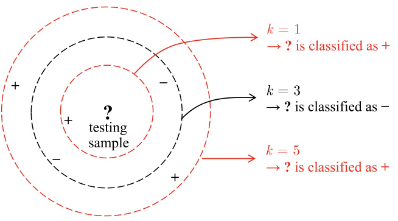
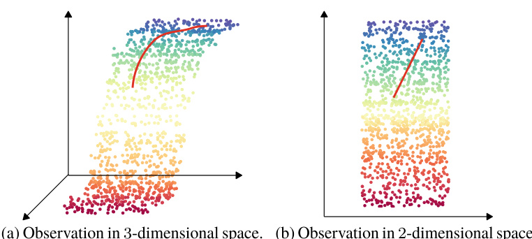
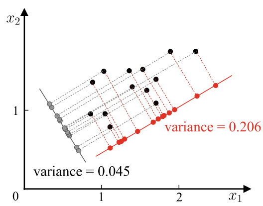
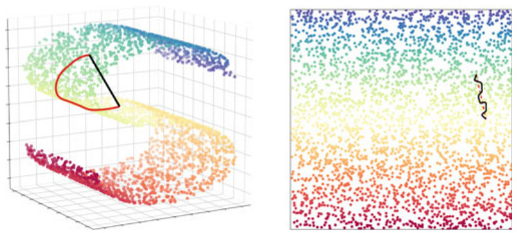
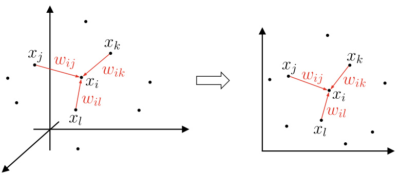
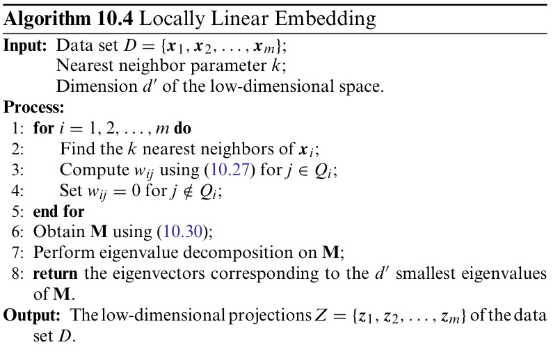

# Dimensionality Reduction and Metric Learning  

## 10.1    $\pmb{k}$  -Nearest Neighbor Learning  

The principle of  $k\mathbf{NN}$   agrees with the proverb that ‘‘One takes the behavior of one’s company.’’  

See Sect.  8.4 .  

$k$  -Nearest Neighbor   $(k\mathbf{NN})$   is a commonly used supervised learning method with a simple mechanism: given a testing sam- ple, find the  $k$   nearest training samples based on some distance metric, and then use these  $k$   ‘‘neighbors’’ to make predictions. Typically, for classification problems,  voting  canbeusedtopre- dict the testing sample as the most frequent class label in the  $k$   neighbors; for regression problems,  averaging  can be used to predict the testing sample as the average of the    $k$   real-valued outputs. Besides, the samples can be weighted by the distances in the way that a closer sample is assigned a higher weight.  

Compared to other methods that were introduced earlier,  $k$  -Nearest Neighbor has something unique: it does not have an explicit training process! In fact, it is a representative of lazy learning , which simply stores the samples in the training phase and does nothing until the testing samples are received. In contrast,  eager learning  refers to the methods that learn from samples in the training phase.  

.  Figure 10.1  provides an illustration of the    $k\mathbf{NN}$   classi- fier. We can see that the parameter    $k$   plays an important role since different    $k$   values may lead to very different classifica- tion results. In addition, different distance calculations may also lead to significantly different ‘‘neighborhood’’, and conse- quently, different classification results.  

We start our discussion with One-Nearest Neighbor Classi- fier (1NN, i.e.,  $k=1_{\cdot}$  ) for binary classification problems. Here, we assume the distance calculations are ‘‘appropriate’’such that we can identify  $k$   appropriate neighbors.  

Given a testing sample  $\pmb{x}$  , suppose its nearest neighbor is    $z$  , then the mis classification rate of 1NN is the probability that  $\pmb{x}$  and    $z$   have different class labels, that is,  

$$
P(e r r)=1-\sum_{c\in\mathcal{Y}}P(c\mid\pmb{x})P(c\mid z).
$$  

Let us assume that the samples are    $i.i.d.$  . , and we can always find a sample within an arbitrarily small positive range    $\delta$  for any  $\pmb{x}$  . In other words, for any testing sample, the training sample    $z$  in ( 10.1 ) can always be found within an arbitrarily small range. Let    $c^{*}=\arg\operatorname*{max}_{c\in y}P(c\mid x)$   denote the result of the Bayes optimal classifier. Then, we have  

  
Fig. 10.1 The    $k\mathbf{NN}$   classifier. The dashed lines are equidistant lines; the testing sample sified as positive when    $k=1$   or  $k=5$   and is classified as negative when  $k=3$   =  

$$
\begin{array}{l}{P(e r r)=1-\displaystyle\sum_{c\in\mathcal{Y}}P(c\mid x)P(c\mid z)}\\ {\simeq1-\displaystyle\sum_{c\in\mathcal{Y}}P^{2}(c\mid x)}\\ {\leqslant1-P^{2}(c^{*}\mid x)}\\ {=(1+P(c^{*}\mid x))(1-P(c^{*}\mid x))}\\ {\leqslant2\times(1-P(c^{*}\mid x)).}\end{array}
$$  

From ( 10.2 ), we can make a somewhat surprising conclusion: though the 1NN classifier is simple, its generalization error is at most twice the error of the Bayes optimal classifier!  

Here, we only provide a brief discussion for beginners. See Cover and Hart ( 1967 ) for a more detailed analysis.  

## 10.2  Low-Dimensional Embedding  

Our discussions in the previous section rely on an important assumption: we can always find a sample within an arbitrarily small positive range  $\delta$   forany  $\pmb{x}$  ,which means the sampling must be sufficiently dense, that is,  dense sampling . However, this assumption is impractical. For example, when    $\delta=0.001$   and there is only one feature, for ( 10.2 ) to hold, we need 1000 sam- ples uniformly distributed within the normalized value range of the given feature. However, this is only the case when the dimension is 1. If the dimension increases, the situation will change significantly. For instance, given 20 features, we would need    $\bar{(10^{\bar{3}})}^{20}\;=\;\dot{10^{60}}$    samples to satisfy the dense sampling requirement. Since the number of features can easily go beyond thousands in practice, it is generally impractical to fulfill the dense sampling requirement. Besides, distance calculations, as required by many learning methods, become difficult in the  

  
Fig. 10.2 An illustration of low-dimensional embedding  

high-dimensional space. For example, even the inner product is no longer easy in high-dimensional cases.  

In fact, high dimensionality leads to many issues, such as data sparsity and the difficulty of distance calculation, that are faced by all machine learning methods. This phenomenon is known as the  curse of dimensionality  (Bellman  1957 ).  

Another important approach is feature selection. See Chap.  11 .  

A general approach to alleviating the curse of dimensional- ity is  dimensionality reduction , which aims to convert the orig- inal high-dimensional feature space into a low-dimensional subspace  via mathematical transformations. The sampling is much denser in the subspace, and the distance calculations also become easier. We may wonder why it is possible to perform dimensionality reduction while keeping the necessary informa- tion for further learning? It is because, in many cases, although the observed or collected samples are high dimensional, the useful information for the learning tasks could be just a low- dimensional distribution; that is, there is a low-dimensional embedding  in the high-dimensional space.  .  Figure 10.2  pro- vides an intuitive example, in which learning becomes easier in the subspace of the low-dimensional embedding.  

Multiple Dimensional Scaling (MDS) (Cox and   $\mathrm{Cor}\,2001\$  ) is a classic dimensionality reduction technique that projects a data set from the original space into a lower dimensional space while preserving the distances between samples.  .  Figure 10.2 provides an illustration of MDS.  

We briefly discuss how MDS works. Let    $\mathbf{D}\in\mathbb{R}^{m\times m}$    be a distance matrix of    $m$   samples in the original space, where the distance between the samples  $\pmb{x}_{i}$  and  $\pmb{x}_{j}$  is the element    $d i s t_{i j}$   on the  i th row and  $j$  th column. The task is to obtain the sample entation    $\dot{\mathbf{Z}}\in\mathbb{R}^{d^{\prime}\times m}$    in the    $d^{\prime}$  -dimensional space, where  $d^{\prime}\leqslant d$    , and the distance between any two samples is the same in both spaces, i.e.,    $\|z_{i}-z_{j}\|=d i s t_{i j}$  .  

Let    $\mathbf{B}=\mathbf{Z}^{\mathrm{T}}\mathbf{Z}\in\mathbb{R}^{m\times m}$    be the inner product matrix of the samples in the dimension-reduced space, where    $b_{i j}\:=\:z_{i}^{\mathrm{T}}z_{j}$  . Then, we have  

$$
\begin{array}{c}{d i s t_{i j}^{2}=\left\|z_{i}\right\|^{2}+\left\|z_{j}\right\|^{2}-2z_{i}^{\mathrm{T}}z_{j}}\\ {=b_{i i}+b_{j j}-2b_{i j}.}\end{array}
$$  

For ease of discussion,suppose the dimension-reducedsam- that is,    $\textstyle\sum_{i=1}^{m}z_{i}\,=\,\mathbf{0}$  =  = . e notice that both the row-wise and column-wise sums of  B  are 0, that is,  $\begin{array}{r}{\sum_{i=1}^{m}b_{i j}=\sum_{j=1}^{m}b_{i j}=0}\end{array}$   0. Then, we can derive  

$\mathbf{0}\in\mathbb{R}^{d^{\prime}}$  s an all-zero vector of length  $d^{\prime}$  ′ .  

$$
\sum_{i=1}^{m}d i s t_{i j}^{2}=\mathrm{tr}({\bf B})+m b_{j j},
$$  

$$
\sum_{j=1}^{m}{d i s t_{i j}^{2}}=\mathrm{tr}({\bf B})+m b_{i i},
$$  

$$
\sum_{i=1}^{m}\sum_{j=1}^{m}d i s t_{i j}^{2}=2m\,\mathrm{tr}({\bf B}),
$$  

where  $\mathrm{tr}(\cdot)$   is the trace of a matrix, and   $\begin{array}{r}{\mathrm{tr}({\bf B})\,=\,\sum_{i=1}^{m}\|z_{i}\|^{2}\,}\end{array}$    . = Let  

$$
\begin{array}{l}{{d i s t_{i\cdot}^{2}=\displaystyle\frac{1}{m}\sum_{j=1}^{m}d i s t_{i j}^{2},}}\\ {{d i s t_{j\cdot}^{2}=\displaystyle\frac{1}{m}\sum_{i=1}^{m}d i s t_{i j}^{2},}}\\ {{d i s t_{\cdot\cdot}^{2}=\displaystyle\frac{1}{m^{2}}\sum_{i=1}^{m}\sum_{j=1}^{m}d i s t_{i j}^{2},}}\end{array}
$$  

then, from ( 10.3 )− ( 10.9 ), we have  

$$
b_{i j}=-\frac{1}{2}(d i s t_{i j}^{2}-d i s t_{i\cdot}^{2}-d i s t_{\cdot j}^{2}+d i s t_{\cdot\cdot}^{2}),
$$  

which makes it possible to calculate the inner product matrix    $\mathbf{B}$  from the distance matrix  $\mathbf{D}$   that is not changed by dimension- ality reduction.  

By eigenvalue decomposition, we have    $\mathbf{B}=\mathbf{V}\mathbf{A}\mathbf{V}^{\mathrm{T}}$  , where  $\mathbf{A}=\mathrm{diag}(\lambda_{1},\lambda_{2},.\,.\,.\,,\lambda_{d})$   is the diagonal m rix consisting of the eigenvalues    $\lambda_{1}\,\geqslant\,\lambda_{2}\,\geqslant\,.\,.\,\geqslant\,\lambda_{d}$  , and  V  is the matrix of eigenvectors. Suppose that there are    $d^{*}$  non-zero eigenvalues that form the diagonal matrix    $\mathbf{\Lambda}_{*}=\mathrm{diag}(\lambda_{1},\lambda_{2},.\,.\,.\,,\lambda_{d*})$  , and let    $\mathbf{V}_{\ast}$  denote the corresponding eigenvector matrix. Then,  Z can be expressed as  

$$
\mathbf{Z}={\pmb{\Lambda}}_{*}^{1/2}\mathbf{V}_{*}^{\mathrm{T}}\in\mathbb{R}^{d^{*}\times m}.
$$  

Inpractice,however,we only require the dimension-reduced distances to be close to the original distances rather than the same. In such cases, we can take the    $d^{\prime}\ll d$   largest eigenval- ues to  ake a diagonal matrix  $\tilde{\mathbf{A}}=\mathrm{diag}(\lambda_{1},\,\lambda_{2},\,.\,.\,,\,\lambda_{d^{\prime}})$   = and denote    $\tilde{\mathbf{V}}$  ˜  as the corresponding eigenvector matrix. Then,  Z  can be expressed as  

$$
\mathbf{Z}=\tilde{\mathbf{\Lambda}}^{1/2}\tilde{\mathbf{V}}^{\mathrm{T}}\in\mathbb{R}^{d^{\prime}\times m}.
$$  

The pseudocode of MDS is given in    $\circ$  Algorithm 10.1  

$$
\begin{aligned}
&\text { Algorithm 10.1 Multiple Dimensional Scaling }\\
&\text { Input: Distance matrix } \mathbf{D} \in \mathbb{R}^{m \times m} \text {, where } \text { dist }_{i j} \text { is the distance from } \boldsymbol{x}_i \text { to }\\
&\boldsymbol{x}_j \text {; }\\
&\text { Dimension } d^{\prime} \text { of the low-dimensional space. }\\
&\text { Process: } \square\\
&\text { Compute } \text { dist }_i^2 \text {, dist }{ }_{. j}^2 \text {, and } \text { dist }_{. .}^2 \text { according to (10.7)-(10.9); }\\
&\text { Compute inner product matrix } \mathbf{B} \text { according to (10.10); }\\
&\text { Perform eigenvalue decomposition on matrix } \mathbf{B} \text {; }\\
&\text { Take the } d^{\prime} \text { largest eigenvalues to make a diagonal matrix } \tilde{\boldsymbol{\Lambda}} \text {, and } \tilde{\mathbf{V}} \text { is }\\
&\text { the corresponding eigenvector matrix. }\\
&\text { Output: The matrix } \tilde{\mathbf{V}} \tilde{\mathbf{\Lambda}}^{1 / 2} \in \mathbb{R}^{m \times d^{\prime}} \text {, where each row gives the coordinates }\\
&\text { of the sample in the low-dimensional space. }
\end{aligned}
$$

In general, the simplest method to obtain a lower dimen- sional subspace is applying linear transformations to the origi- ensi nalspace.Giventhesamples  $\mathbf{X}=(x_{1},x_{2},.\,.\,.\,,$   $\mathbf{\bar{\Phi}}_{\mathbf{X}_{m}})\in\bar{\mathbf{\Phi}}\mathbb{R}^{d\times m}$   ∈   in a  $d$  -dimensional space, the transformed samples in the  $d^{\prime}$  -dimensional space are  

$$
\mathbf{Z}=\mathbf{W}^{\mathrm{{T}}}\mathbf{X},
$$  

Typically,  $d^{\prime}\ll d$  .  

$d^{\prime}\leqslant d$  ,    $\mathbf{W}\in\mathbb{R}^{d\times d^{\prime}}$    is the transformation matrix, and  $\mathbf{Z}\in\mathbb{R}^{d^{\prime}\times m}$   ∈   is the sample repres ations in the ne space.  

The transformation matrix  W  can be seen as  d  $d^{\prime}$    basis vec- tors with a dimension of    $d$  , and  $z_{i}=\mathbf{W}^{\mathrm{T}}{\pmb x}_{i}$   is a    $d^{\prime}$  -dimensional feature vector obtained by multiplying the original feature vector    $\pmb{x}_{i}$   by each of the    $d^{\prime}$    basis vectors. In other words,    $z_{i}$  is the coordinate vector of    $\pmb{x}_{i}$   in the new coordinate system  $\{\mathbf{w}_{1},\mathbf{w}_{2},.\,.\,.\,,\mathbf{w}_{d^{\prime}}\}$  . When    $\mathbf{w}_{i}$   and    $\mathbf{w}_{j}(i\neq j)$   are orthogonal, the new coordinate system is an orthogonal coordinate system, and  $\mathbf{W}$   is an orthogonal transformation matrix. We notice that the features in the new space are linear combinations of the features in the original space.  

The methods that perform dimensionality reduction by lin- ear transformations are called linear dimensionality reduc- tion methods. Such methods follow the basic form of ( 10.13 ), though different methods may require the lower dimensional subspace to satisfy different conditions, that is, adding some constraints to  W . The next section will introduce a preva- lent dimensionality reduction method that requires the lower dimensional subspace to have the maximum variance.  

Typically, we evaluate the effectiveness of a dimensionality reduction by comparing the performance of the learner before and after the dimensionality reduction, where the performance improvement indicates the effectiveness. When the dimension- ality is reduced to 2 or 3, we can apply visualization techniques to inspect dimensionality reduction effectiveness.  

## 10.3  Principal Component Analysis  

Principal Component Analysis (PCA) is one of the most com- monly used dimensionality reduction methods. Before intro- ducing the technical details, let us consider the following ques- tion: for the samples in an orthogonal feature space, how can we use a hyperplane (i.e., a line in two-dimensional space gen- eralized to high-dimensional space) to represent the samples? Intuitively, if such a hyperplane exists, then it perhaps needs to have the following properties:  

• Minimum reconstruction error: the samples should have short distances to this hyperplane;

 • Maximum variance: the projections of samples onto the hyperplane should stay away from each other.  

Interestingly, the above two properties lead to two equiva- lent derivations of PCA. First, let us derive PCA by minimizing the reconstruction error.  

ples are zero-centered (i.e.,    $\textstyle\sum_{i}{\boldsymbol{\mathbf{x}}}_{i}\,=\,{\boldsymbol{\mathbf{0}}})$   = ). Let  {  $\left\{\mathbf{w}_{1},\mathbf{w}_{2},\ldots,\mathbf{w}_{d}\right\}$  }  denote the new coordinate system after projection, where  w  is an orthonormal basis vector, that is,  $\|\mathbf{w}_{i}\|_{2}=1$   and    $\mathbf{w}_{i}^{\mathrm{{T}}}\mathbf{w}_{j}=0(i\neq j).$   = . If some of the coordinates are removed from the new coordinate system (i.e., the dimension is reduced to    $d^{\prime}<d$  ), then the projection of the sample    $\pmb{x}_{i}$   in the lower dimensional coordinate system is  $z_{i}=(z_{i1};z_{i2};.\.\,.\,;z_{i d^{\prime}})$  , where  $\mathbf{\Sigma}_{\mathbf{\cdot}}^{z_{i j}}=\mathbf{w}_{j}^{\mathrm{T}}\mathbf{x}_{i}$   is the coordinate of  $\pmb{x}_{i}$   in the  $j$  th dimension of the lower dimensional coordinate system. If we reconstruct  $\pmb{x}_{i}$   from  $z_{i}$  , then we have  $\begin{array}{r}{\hat{\pmb{x}}_{i}=\sum_{j=1}^{d^{\prime}}z_{i j}\mathbf{w}_{j}}\end{array}$  .  

For the entire training set, the total distance between the original samples  $\pmb{x}_{i}$   and the projection-reconstructed samples const is a constant.  

Strictly speaking, the covariance matrix is  $\begin{array}{r}{\frac{1}{m-1}\sum_{i=1}^{m}x_{i}x_{i}^{\mathrm{T}}}\end{array}$   , but − = the constant term makes no difference here.  

$$
\begin{array}{r l r}{\lefteqn{\sum_{i=1}^{m}\left\|\sum_{j=1}^{d^{\prime}}z_{i j}\mathbf{w}_{j}-\pmb{x}_{i}\right\|_{2}^{2}=\sum_{i=1}^{m}z_{i}^{\mathrm{T}}z_{i}-2\sum_{i=1}^{m}z_{i}^{\mathrm{T}}\mathbf{W}^{\mathrm{T}}\pmb{x}_{i}+\mathrm{const}}}\\ &{}&{\propto-\mathrm{tr}\left(\mathbf{W}^{\mathrm{T}}\left(\sum_{i=1}^{m}\pmb{x}_{i}\mathbf{x}_{i}^{\mathrm{T}}\right)\mathbf{W}\right),\quad}\end{array}
$$  

where    $\mathbf{W}\,=\,(\mathbf{w}_{1},\mathbf{w}_{2},\.\,.\,.\,,\mathbf{w}_{d})$  . According to the property of minimum reconstruction error, ( 10.14 ) should be minimized. Since    $\mathbf{w}_{j}$   is the orthonormal basis vector and    $\begin{array}{r}{\sum_{i}\pmb{x}_{i}\pmb{x}_{i}^{\mathrm{T}}}\end{array}$    is the covariance matrix, we have  

$$
\begin{array}{r l}&{\underset{\mathbf{w}}{\operatorname*{min}}\ \ -\operatorname{tr}(\mathbf{W}^{\mathrm{T}}\mathbf{X}\mathbf{X}^{\mathrm{T}}\mathbf{W})}\\ &{\mathrm{s.t.}\ \mathbf{W}^{\mathrm{T}}\mathbf{W}=\mathbf{I},}\end{array}
$$  

which is the optimization objective of PCA.  

Another interpretation of PCA is from the maximum vari- ance perspective. If we wish the projections of samples to stay away from each other, then the variance of the projected sam- ples should be maximized, as illustrated in  .  Figure 10.3 .  

The covariance matrix of the projected samples is  $\begin{array}{r}{\sum_{i}\mathbf{W}^{\mathrm{T}}\pmb{x}_{i}\pmb{x}_{i}^{\mathrm{T}}\mathbf{W},}\end{array}$  , where  $\mathbf{W}^{\mathrm{T}}\pmb{x}_{i}$   isthe projectionof  $\boldsymbol{x}_{i}$   onthe hyper- plane in the new space. Then, we can write the optimization objective as  

$$
\begin{array}{r l}&{\underset{\mathbf{W}}{\operatorname*{max}}\;\;\mathrm{tr}(\mathbf{W}^{\mathrm{T}}\mathbf{X}\mathbf{X}^{\mathrm{T}}\mathbf{W})}\\ &{\;\;\mathrm{s.t.}\;\;\mathbf{W}^{\mathrm{T}}\mathbf{W}=\mathbf{I}.}\end{array}
$$  

  
Fig. 10.3 To make the projections of the samples away from each other as far as possible (the red lines), we need to maximize the variance of the projected samples  

We notice that ( 10.15 ) and ( 10.16 ) are equivalent. Applying Language multipliers to ( 10.15 ) or ( 10.16 ) gives  

$$
\mathbf{X}\mathbf{X}^{\mathrm{{T}}}\mathbf{w}_{i}=\lambda_{i}\mathbf{w}_{i}.
$$  

To obtain the solution of PCA, we perform eigenvalue decom- position on the covariance matrix    $\mathbf{\bar{X}}\mathbf{X}^{\mathrm{{T}}}$    and obtain the sorted eigenvalues:    $\lambda_{1}\;\geqslant\;\lambda_{2}\;\geqslant\;\ldots\;\geqslant\;\lambda_{d}$  . Then, we construct the solution  $\mathbf{W}^{*}\ =\ (\mathbf{w}_{1},\mathbf{w}_{2},\ldots,\mathbf{w}_{d^{\prime}})$   using the eigenvectors of the first  d  $d^{\prime}$    eigenvalues. The pseudocode of PCA is given in  $^{\circ}$   Algorithm 10.2 .  

$$
\begin{aligned}
&\text { Algorithm 10.2 Principal Component Analysis }\\
&\text { Input: Data set } D=\left\{x_1, x_2, \ldots, x_m\right\}\\
&\text { Dimension } d^{\prime} \text { of the lower dimensional space. }\\
&\text { Process: } \square\\
&\text { Center all samples: } \boldsymbol{x}_i \leftarrow \boldsymbol{x}_i-\frac{1}{m} \sum_{i=1}^m \boldsymbol{x}_i \text {; }\\
&\text { Compute the covariance matrix } \mathbf{X} \mathbf{X}^{\mathrm{T}} \text { of samples; }\\
&\text { Perform eigenvalue decomposition on the covariance matrix } \mathbf{X X}^{\mathrm{T}} \text {; }\\
&\text { Take the eigenvectors } \mathbf{w}_1, \mathbf{w}_2, \ldots, \mathbf{w}_{d^{\prime}} \text { corresponding to the } d^{\prime} \text { largest }\\
&\text { eigenvalues. }\\
&\text { Output: The projection matrix } \mathbf{W}^*=\left(\mathbf{w}_1, \mathbf{w}_2, \ldots, \mathbf{w}_{d^{\prime}}\right) \text {. }
\end{aligned}
$$

Typically, the dimension    $d^{\prime}$    of the lower dimensional space is specified by the user or selected by doing cross-validation with different    $d^{\prime}$    values, that is, comparing the performance of a  $k\mathbf{NN}$   classifier (or other learners with low computational cost) in the dimension-reduced spaces produced by different  $d^{\prime}$    values. For PCA, a threshold    $t$   (e.g.,    $t=95\%$  ) can also  set from the reconstruction perspective to find the minimum  $d^{\prime}$  subject to  

$$
\frac{\sum_{i=1}^{d^{\prime}}\lambda_{i}}{\sum_{i=1}^{d}\lambda_{i}}\geqslant t.
$$  

With just    $\mathbf{W}^{*}$  and the mean vector of samples, PCA can project new samples to the lower dimensional space by apply- ing simple vector subtraction and matrix-vector multiplication operations. The lower dimensional space and the original high- dimensional space are different since the eigenvectors corre- sponding to the  $d{-}d^{\prime}$    smallest eigenvalues are discarded. Infor- mation loss is an unavoidable consequence of dimensionality reduction, but it is often necessary: on the one hand, reduc- ing the dimensionality can lead to relatively denser sampling although the number of samples remains the same, which is an important motivation of performing dimensionality reduction; on the other hand, the eigenvectors of the smallest eigenval- In practice, we often do singular value decomposition on    $\mathbf{X}$  instead of eigenvalue decomposition on    $\mathbf{X}\mathbf{X}^{\mathrm{{T}}}$  , and both decompositions lead to the same  W .  

PCA can also be seen as incrementally selecting the direction that maximizes the covariance, that is, find the eigenvalues of the covariance matrix  $\begin{array}{r}{\sum_{i}x_{i}x_{i}^{\mathrm{T}}}\end{array}$    and take the eigenvector    $\mathbf{w}_{1}$   corresponding to the largest eigenvalue; then find the eigenvalues of  $\begin{array}{r}{\sum_{i}x_{i}\bar{x_{i}^{\mathrm{T}}}-\lambda_{1}\mathbf{w}_{1}\mathbf{w}_{1}^{\mathrm{T}}}\end{array}$  take the eigenvector        $\mathbf{w}_{2}$  and then corresponding to the largest eigenvalue; … . Since the components of  $\mathbf{W}$   are orthogonal and  

$$
\sum_{i=1}^{m}x_{i}x_{i}^{\mathrm{T}}=\sum_{j=1}^{d}\lambda_{j}\mathbf{w}_{j}\mathbf{w}_{j}^{\mathrm{T}},
$$  

it can be proved that the incremental approach is equivalent to the approach of selecting the first    $d^{\prime}$    eigenvalues at one time.  

The mean vector is used to zero-center the new samples via vector subtraction.  

ues often relate to the noises, that is, discarding them helps to reduce the noise.  

## 10.4 Kernelized PCA  

Linear dimensionality reduction methods transform a high- dimensional space into a low-dimensional space via a lin- ear mapping. In practice, however, non-linear mappings are often needed to find the proper low-dimensional embedding.  

$^{\circ}$   Figure 10.4  shows an example of embedding data points to an S-shaped surface in a three-dimensional space, where the data points are sampled from a squared region of a two- dimensional space. If we apply linear dimensionality reduc- tion methods to the three-dimensional space, we will lose the original low-dimensional structure. We call the original low- dimensional space, from which the data points are sampled, as the  intrinsic  low-dimensional space.  

See Sect.  6.6  for kernel methods.  

A general approach to non-linear dimensionality reduction is to  kernelize  linear dimensionality reduction methods via ker- nel tricks. Next, we give a demonstration with the representa- tive Kernelized PCA (KPCA) (Schölkopf et al.  1998 ).  

Suppose that we project data from the high-dimensional feature space to a hyper plane spanned by  $\mathbf{W}=(\mathbf{w}_{1},\mathbf{w}_{2},\ldots,\mathbf{w}_{d})$  . Then, according to ( 10.17 ), we have the following for    $\mathbf{w}_{j}$  :  

$$
\left(\sum_{i=1}^{m}z_{i}z_{i}^{\mathrm{T}}\right)\mathbf{w}_{j}=\lambda_{j}\mathbf{w}_{j},
$$  

  
Fig. 10.4 The 3000 samples in the 3-dimensional space are sampled from a squared region of the intrinsic 2-dimensional space and then embedded to an S-shaped surface in the 3-dimensional space. In such cases, performing linear dimensionality reduction incurs information loss of the low-dimensional structure. The colors of sample points show the low-dimensional structure  

where  $z_{i}$   is the image of    $\pmb{x}_{i}$   in the high-dimensional feature space. Then, we have  

$$
{\begin{array}{r l}&{\mathbf{w}_{j}={\frac{1}{\lambda_{j}}}\left(\sum_{i=1}^{m}z_{i}z_{i}^{\mathrm{{T}}}\right)\mathbf{w}_{j}=\sum_{i=1}^{m}z_{i}{\frac{z_{i}^{\mathrm{{T}}}\mathbf{w}_{j}}{\lambda_{j}}}}\\ &{\quad=\sum_{i=1}^{m}z_{i}\alpha_{i}^{j},}\end{array}}
$$  

where  $\begin{array}{r}{\alpha_{i}^{j}=\frac{1}{\lambda_{j}}z_{i}^{\mathrm{T}}\mathbf{w}_{j}}\end{array}$   is the  $j$  th component of    $\alpha_{i}$  . Suppose that  $z_{i}$   is obtained by mapping the original sample  $\pmb{x}_{i}$  via    $\phi$  , that is,  $z_{i}=\phi(\pmb{x}_{i}),i=1,2,.\,.\,.\,.\,,m.$  . If the explicit form of    $\phi$   is known, then we can use it to map the samples to the high-dimensional feature space, and then apply PCA. Equation ( 10.19 ) can be rewritten as  

$$
\left(\sum_{i=1}^{m}\phi({\pmb x}_{i})\phi({\pmb x}_{i})^{\mathrm{T}}\right){\bf w}_{j}=\lambda_{j}{\bf w}_{j},
$$  

and ( 10.20 ) can be rewritten as  

$$
\mathbf{w}_{j}=\sum_{i=1}^{m}\phi(\pmb{x}_{i})\alpha_{i}^{j}.
$$  

Since the exact form of    $\phi$   is generally unknown, we introduce the kernel function  

$$
\begin{array}{r}{\kappa(\pmb{x}_{i},\pmb{x}_{j})=\phi(\pmb{x}_{i})^{\mathrm{T}}\phi(\pmb{x}_{j}).}\end{array}
$$  

Substituting ( 10.22 ) and ( 10.23 ) into ( 10.21 ) gives  

$$
\mathbf{K}\alpha^{j}=\lambda_{j}\alpha^{j},
$$  

where    $\mathbf{K}$   is the kernel matrix corresponding to    $\kappa$  ,    $({\bf K})_{i j}{\bf\Gamma}={\bf\Gamma}$   $\kappa(\pmb{x}_{i},\pmb{x}_{j})$  , and    $\alpha^{j}\,=\,(\alpha_{1}^{j};\,\alpha_{2}^{j};\,.\,.\,;\,\alpha_{m}^{j})$  . We notice that ( 10.24 ) is an eigenvalue decomposition problem, and hence we simply take the eigenvectors corresponding to the    $d^{\prime}$    largest eigenval- ues in  $\mathbf{K}$  .  

For a new sample  $\pmb{x}$  , its projected coordinate in the  $j$  th  $(j=$   $1,2,\ldots,d^{\prime})$   dimension is  

$$
\begin{array}{l}{{z_{j}={\bf w}_{j}^{\mathrm{T}}\phi({\pmb x})=\displaystyle\sum_{i=1}^{m}\alpha_{i}^{j}\phi({\pmb x}_{i})^{\mathrm{T}}\phi({\pmb x})}}\\ {{\mathrm{~}}}\\ {{\mathrm{~}}=\displaystyle\sum_{i=1}^{m}\alpha_{i}^{j}\kappa({\pmb x}_{i},{\pmb x}),}\end{array}
$$  

where  $\alpha_{i}$  has been normalized.From( 10.25 ),weseethatKPCA is computationally expensive since it sums over all samples to compute the projected coordinate.  

## 10.5  Manifold Learning  

Manifold learning  is a dimensionality reduction approach that utilizes some concepts of topological manifolds. A  manifold is a topological space that is locally homeomorphic to the Euclidean space. It locally meets the properties of European space, which means we can use Euclidean distance, and this fact motivates a new way of dimensionality reduction. If a low- dimensional manifold is embedded in the high-dimensional space, then the samples, which seem to be very complex in the high-dimensional space, locally have the same properties of samples in the Euclidean space. Therefore, we can establish dimensionality reduction mappings locally, and then extend to the entire space. When the dimensionality is reduced to two or three, we can naturally visualize the data, and hence mani- fold learning is also useful for visualization purposes. The rest of this section introduces two representative manifold learning methods.  

### 10.5.1  Isometric Mapping  

Isometric Mapping (Isomap) (Tenenbaum et al.  2000 ) is moti- vated by the fact that the straight-line Euclidean distances measured in a high-dimensional space can be misleading since the straight lines in the high-dimensional space may not exist in the low-dimensional manifold embedding. As illustrated in  .  Figure 10.5 a, the distance between two points in the low-dimensional manifold embedding is the  geodesic distance . Imagine an insect crawling from one point to another,andithas to crawl on the surface. Then, the red curve in  .  Figure 10.5 a is the shortest path, that is, the geodesic on the S-shaped surface. The geodesic distance is the intrinsic distance between the two points. In such cases, measuring the straight-line distances in the high-dimensional space is inappropriate.  

Then, how can we compute the geodesic distances? Recall that a manifold is locally homeomorphic to the Euclidean space, which means we can find neighboring points of each point based on the Euclidean distance, and hence a neighbor- hood graph can be constructed. In the neighborhood graph, only neighboring points are connected, and the geodesic dis- tance is measured by finding the shortest path between two points in the neighborhood graph. From  .  Figure 10.5 b, we  

  

Fig. 10.5 We cannot use the straight-line distance in the high-dimensional space to compute the geodesic distance (red) in the low-dimensional manifold embedding, but an approximation is possible with the neighborhood distance  

can see that the shortest path in the neighborhood graph pro- vides a good approximation to the geodesic distance in the low-dimensional manifold embedding.  

To find the shortest path between two points in a neighbor- hood graph, we can use the well-known Dijkstra algorithm or the Floyd algorithm. With the distance between any two points, we can then use the MDS method introduced in Sect.  10.2  to obtain the coordinates of samples in the low-dimensional space. The pseudocode of Isomap is given in  .  Algorithm 10.3 .  

These two algorithms were proposed by the 1972 Turing Award winner E. W. Dijkstra and the 1978 Turing Award winner R. Floyd, respectively.  

$$
\begin{aligned}
&\text { Algorithm 10.3 Isometric Mapping }\\
&\text { Input: Data set } D=\left\{\boldsymbol{x}_1, \boldsymbol{x}_2, \ldots, \boldsymbol{x}_m\right\}\\
&\text { Nearest neighbor parameter } k \text {; }\\
&\text { Dimension } d^{\prime} \text { of the low-dimensional space. }\\
&\text { Process: } \square\\
&\text { for } i=1,2, \ldots, m \text { do }\\
&\text { Find the } k \text { nearest neighbors of } \boldsymbol{x}_i \text {; }\\
&\text { Set the distances between } \boldsymbol{x}_i \text { and the } k \text { nearest neighbors to the }\\
&\text { Euclidean distance, and set the distances from } \boldsymbol{x}_i \text { to other sample }\\
&\text { points as positive infinity; }\\
&\text { end for }\\
&\text { Compute the distance } \operatorname{dist}\left(\boldsymbol{x}_i, \boldsymbol{x}_j\right) \text { between every pair sample points }\\
&\text { using a shortest path algorithm; }\\
&\text { Use } \operatorname{dist}\left(\boldsymbol{x}_i, \boldsymbol{x}_j\right) \text { as input for the MDS algorithm; }\\
&\text { return The output of the MDS algorithm. }\\
&\text { Output: The low-dimensional projections } Z=\left\{z_1, z_2, \ldots, z_m\right\} \text { of the data }\\
&\text { set } D \text {. }
\end{aligned}
$$

Iso map only gives the low-dimensional coordinates of train- ing samples, but how can we project new samples to the low- dimensional space? A general approach is to train a regression model using the high-dimensional coordinates of training sam- ples as the input and the corresponding low-dimensional coor- dinates as the output. Then, use the trained regression model to predict the low-dimensional coordinates of new samples. Such a method looks ad hoc, but currently there seems to be no better solution.  

There are two general approaches to constructing the neigh- borhood graph. The first approach is to specify the number of neighbors. For example, using the    $k$   nearest neighbors mea- sured by Euclidean distance, which gives the    $k$  -nearest neigh- bor graph. The other approach is to specify a distance threshold  $\epsilon$   to consider all points with a distance smaller than  $\epsilon$   as neigh- bors, and the generated graph is called a    $\epsilon$  -nearest neighbor graph. However, both approaches have the same limitation: if the specified neighborhood range,either  $k$  or  $\epsilon$  ,istoolarge,then ‘‘short circuit’’ may happen, in which some distant points are incorrectly considered close to each other; on the other hand, if the specified neighborhood range is too small, then ‘‘open circuit’’ may happen, in which some regions become discon- nected from each other. Either case misleads the consequent calculation of the shortest path.  

### 10.5.2  Locally Linear Embedding  

Unlike Isomap, which maintains the distances between sam- ples, Locally Linear Embedding (LLE) (Roweis and Saul  2000 ) aims to keep the linear relationships between neighboring sam- ples. As illustrated in    $^{\circ}$   Figure 10.6 , suppose the coordinates of a sample point  $\pmb{x}_{i}$  can be reconstructed via a linear combina- tion of the coordinates of its neighboring samples  ${\pmb x}_{j},{\pmb x}_{k}$  , and  $\pmb{x}_{l}$  , that is,  

$$
\pmb{x}_{i}=w_{i j}\pmb{x}_{j}+w_{i k}\pmb{x}_{k}+w_{i l}\pmb{x}_{l}.
$$  

LLE aims to keep the relationship of ( 10.26 ) in the low- dimensional space.  

LLE starts by identifying the neighborhood indices set    $Q_{i}$  for sample    $\pmb{x}_{i}$  , and then find the linear reconstruction weights  $\mathbf{w}_{i}$   of samples in    $Q_{i}$  :  

$$
\begin{array}{c}{\displaystyle\operatorname*{min}_{\mathbf{w}_{1},\mathbf{w}_{2},\dots,\mathbf{w}_{m}}~~\displaystyle\sum_{i=1}^{m}\left\|\pmb{x}_{i}-\sum_{j\in\mathcal{Q}_{i}}w_{i j}\pmb{x}_{j}\right\|_{2}^{2}}\\ {\mathrm{s.t.}~~\displaystyle\sum_{j\in\mathcal{Q}_{i}}w_{i j}=1,}\end{array}
$$  

wher  $\pmb{x}_{i}$   and  $\pmb{x}_{j}$  are known. Letting    $C_{j k}=({\pmb x}_{i}-{\pmb x}_{j})^{\mathrm{T}}({\pmb x}_{i}-{\pmb x}_{k})$  , then  $w_{i j}$   has a closed form solution  

  
Fig. 10.6 The reconstruction relationship of samples in the high-dimensional space are preserved in the low-dimensional space  

$$
w_{i j}=\frac{\sum_{k\in Q_{i}}C_{j k}^{-1}}{\sum_{l,s\in Q_{i}}C_{l s}^{-1}}.
$$  

Since LLE preserves    $\mathbf{w}_{i}$   in the low-dimensional space, the low-dimensional coordinates  $z_{i}$   of  $\pmb{x}_{i}$   can be obtained by  

$$
\operatorname*{min}_{\boldsymbol{z}_{1},\boldsymbol{z}_{2},\dots,\boldsymbol{z}_{m}}~\sum_{i=1}^{m}\left\|\boldsymbol{z}_{i}-\sum_{j\in\mathcal{Q}_{i}}w_{i j}\boldsymbol{z}_{j}\right\|_{2}^{2}
$$  

We notice that ( 10.27 ) and ( 10.29 ) have the same form of optimization objectives. The only difference is that ( 10.27 ) optimizes    $\mathbf{w}_{i}$  , whereas ( 10.29 ) optimizes    $z_{i}$  , that is, the low- dimensional coordinates of    $\pmb{x}_{i}$  .  

Letting    $\mathbf{Z}=(z_{1},z_{2},.\,.\,.\,,z_{m})\in\mathbb{R}^{d^{\prime}\times m}$  ,    $(\mathbf{W})_{i j}=w_{i j}$  , and  

$$
\mathbf{M}=(\mathbf{I}-\mathbf{W})^{\mathrm{T}}(\mathbf{I}-\mathbf{W}),
$$  

then ( 10.29 ) can be rewritten as  

$$
\begin{array}{l}{\displaystyle\operatorname*{min}_{\mathbf Z}~\mathrm{tr}(\mathbf Z\mathbf M\mathbf Z^{\mathrm T})}\\ {\mathrm{~s.t.~}\mathbf Z\mathbf Z^{\mathrm T}=\mathbf I.}\end{array}
$$  

We can solve ( 10.31 ) by eigenvalue decomposition:    $\mathbf{Z}^{\mathrm{{T}}}$    is the matrix consisting of the eigenvectors corresponding to the    $d^{\prime}$  smallest eigenvalues of  M .  

The pseudocode of LLE is given in    $^{\circ}$   Algorithm 10.4 . From line  4 , we see that  $\pmb{x}_{i}$   and  $z_{i}$   are not impacted by any changes to a non-neighbor sample  $\pmb{x}_{j}$  . This idea of restricting the impact of changes in a local region is adopted in many other places as well.  

  

## 10.6  Metric Learning  

In machine learning,the main purpose of dimensionality red uc- tion is to find a lower dimensional space, in which the learning performance is better than that in the original high-dimensional space.Since each space corresponds to a distance metric defined on the sample features, the searching of an appropriate space is indeed searching for an appropriate distance metric. Then, why not ‘‘learn’’the appropriate distance metric directly? This ques- tion motivated  metric learning , also known as  distance metric learning .  

To learn a distance metric, we must express it in a learnable form. We have seen many distance metrics in Sect.  9.3 , but all of them have a fixed form without adjustable parameters that can be improved by learning from data. Therefore, we need an extension first.  

For two    $d$  -dimensional samples    $\pmb{x}_{i}$   and    $\pmb{x}_{j}$  , their squared Euclidean distance can be written as  

The Euclidean distance is squared for the convenience of subsequent calculations.  

$$
\mathrm{dist}_{\mathrm{{el}}}^{2}(\pmb{x}_{i},\pmb{x}_{j})=\left\Vert\pmb{x}_{i}-\pmb{x}_{j}\right\Vert_{2}^{2}=d i s t_{i j,1}^{2}+d i s t_{i j,2}^{2}+\ldots+d i s t_{i j,d}^{2},
$$  

where    $d i s t_{i j,k}$   is the distance between    $\pmb{x}_{i}$   and    $\scriptstyle{\boldsymbol{x}}_{j}$   on the    $k$  th dimension. Suppose different features have different impor- tance, then we can introduce the feature weights    $\mathbf{W}$   as  

$$
\begin{array}{r l r}&{}&{\mathrm{dist}_{\mathrm{mod}}^{2}(\pmb{x}_{i},\pmb{x}_{j})=\left\Vert\pmb{x}_{i}-\pmb{x}_{j}\right\Vert_{2}^{2}}\\ &{}&{=w_{1}\cdot d i s t_{i j,1}^{2}+w_{2}\cdot d i s t_{i j,2}^{2}+\ldots+w_{d}\cdot d i s t_{i j,d}^{2}}\\ &{}&{=(\pmb{x}_{i}-\pmb{x}_{j})^{\mathrm{T}}\mathbf{W}(\pmb{x}_{i}-\pmb{x}_{j}),\qquad\qquad\qquad\quad(10.3\ \quad\mathrm{~a~n~d~})}\end{array}
$$  

here  $w_{i}\geqslant0$  ,  $\mathbf{W}=\mathrm{diag}(\mathbf{w})$   is a diagonal matrix, and    $(\mathbf{W})_{i i}=$   $w_{i}$  .  

The adjustable weights  W  are the parameters to be learned from data. We notice that the non-diagonal elements of  W  are zero, which means the axes are orthogonal (i.e., the features are independent). In practice, however, this is often not true. For example,  weight  and  volume  of watermelons are positively cor- related, that is, the axesare not orthogonal.Hence,byreplacing  $\mathbf{W}$   in ( 10.33 ) with a symmetric positive semidefinite matrix  $\mathbf{M}$  , we have the  Mahalanobis distance  

$$
\mathrm{dist}_{\mathrm{math}}^{2}({\pmb x}_{i},{\pmb x}_{j})=({\pmb x}_{i}-{\pmb x}_{j})^{\mathrm{T}}{\bf M}({\pmb x}_{i}-{\pmb x}_{j})=\left\|{\pmb x}_{i}-{\pmb x}_{j}\right\|_{{\bf M}}^{2},
$$  

where    $\mathbf{M}$   is also called the  metric matrix , and metric learn- ing is about learning  M . In order to ensure the distances are non-negative and symmetric,  M  must be a positive semidefinite matrix, that is, there must be a matrix    $\mathbf{P}$   such that    $\mathbf{M}=\mathbf{P}\mathbf{P}^{\mathrm{T}}$  .  

Mahalanobis distance is named after Indian mathematician P. C. Mahalanobis. In the standard Mahalanobis distance,  $\mathbf{M}$   is the inverse of the covariance matrix (i.e.,  $\mathbf{M}=\pmb{\Sigma}^{-1})$  ). However, the value of  M  is made more flexible in metric learning.  

To learn  M , we need to set an objective. Suppose we wish to improve the performance of the nearest neighbor classifier, then  M  can be directly embedded into the classifier’s perfor- mance measure, and the optimal  M  is obtained by optimizing the performance measure. We take Neighborhood Component Analysis (NCA) (Goldberger et al.  2005 ) as an example to dis- cuss the process.  

Nearest neighbor classifiers usually employ the voting method for classification, that is, each neighboring sample has 1 vote, and each non-neighboring sample has 0 vote. Instead of using binary voting, we can also use the probabilistic voting method, in which the probability of a sample  $\pmb{x}_{j}$  influences the classification of a sample  $\pmb{x}_{i}$   is given by  

$$
p_{i j}=\frac{\exp\left(-\left\|\pmb{x}_{i}-\pmb{x}_{j}\right\|_{\mathbf{M}}^{2}\right)}{\sum_{l}\exp\left(-\left\|\pmb{x}_{i}-\pmb{x}_{l}\right\|_{\mathbf{M}}^{2}\right)},
$$  

where  $p_{i j}$   is maximized when    $i\,=\,j$  . The impact of    $\pmb{x}_{j}$   on    $\pmb{x}_{i}$  decreases as their distance increases. If the objective is to max- imize the LOO accuracy, then the accuracy of  $\pmb{x}_{i}$   is the proba- bility that other samples can correctly classify it:  

See Sect.  2.2.2  for LOO.  

$$
p_{i}=\sum_{j\in\Omega_{i}}p_{i j},
$$  

where    $\Omega_{i}$   is the index set of samples with the same class label as  $\pmb{x}_{i}$  . Then, the LOO accuracy for the entire data set is  

$$
\sum_{i=1}^{m}p_{i}=\sum_{i=1}^{m}\sum_{j\in\Omega_{i}}p_{i j}.
$$  

Substituting ( 10.35 ) into ( 10.37 ) and considering    $\mathbf{M}=\mathbf{P}\mathbf{P}^{\mathrm{T}}$  , we have the optimization objective of NCA:  

$$
\underset{\mathbf{P}}{\mathrm{min}}\;\;1-\sum_{i=1}^{m}\sum_{j\in\Omega_{i}}\frac{\exp{\left(-\left\|\mathbf{P}^{\mathrm{T}}\pmb{x}_{i}-\mathbf{P}^{\mathrm{T}}\pmb{x}_{j}\right\|_{2}^{2}\right)}}{\sum_{l}\exp{\left(-\left\|\mathbf{P}^{\mathrm{T}}\pmb{x}_{i}-\mathbf{P}^{\mathrm{T}}\pmb{x}_{l}\right\|_{2}^{2}\right)}}.
$$  

It can be solved using Stochastic Gradient Descent (Goldberger et al.  2005 ).  

Solving ( 10.38 ) gives the distance metric matrix    $\mathbf{M}$   that maxi- mizes the LOO accuracy of the nearest neighbor classifier.  

In addition to the supervised learning objectives, such as minimizingthe errorrate,we can also introduce domainknowl- edge into the optimization objective of metric learning. For example, if we already know that some samples are similar or dissimilar, we can define a  must-link  constraints set    $\mathcal{M}$   and a cannot-link  constraints set    $\mathcal{C}$  , where    $(\pmb{x}_{i},\pmb{x}_{j})\,\in\,\mathcal{M}$   indicates    $\pmb{x}_{i}$  and    $\pmb{x}_{j}$   are similar, and    $({\pmb x}_{i},{\pmb x}_{k})\ \in\ \mathcal{C}$   indicates    $\pmb{x}_{i}$   and    $\pmb{x}_{k}$   are dissimilar. Since we wish similar samples to have smaller dis- tances and dissimilar samples to have larger distances, we can obtain the metric matrix  $\mathbf{M}$   by solving the following convex optimization problem (Xing et al.  2003 ):  

$$
\begin{array}{r l}{\underset{\mathbf{M}}{\mathop{\operatorname*{min}}}}&{\underset{(\boldsymbol{x}_{i},\boldsymbol{x}_{j})\in\mathcal{M}}{\sum}\left\|\boldsymbol{x}_{i}-\boldsymbol{x}_{j}\right\|_{\mathbf{M}}^{2}}\\ {\mathrm{s.t.}}&{\underset{(\boldsymbol{x}_{i},\boldsymbol{x}_{k})\in\mathcal{C}}{\sum}\|\boldsymbol{x}_{i}-\boldsymbol{x}_{k}\|_{\mathbf{M}}\geqslant1,}\\ &{\mathbf{M}\succ0,}\end{array}
$$  

where the constraint    $\mathbf{M}\succeq0$   ensures that  $\mathbf{M}$   is positive semidef- inite. Equation ( 10.39 ) minimizes the total distance between similar samples while keeping the individual distances between dissimilar samples no less than 1.  

Metric learning methods generally do not require  $\mathbf{M}$   to be low-rank.  

rank ( M )  is the rank of    $\mathbf{M}$  .  

Different metric learning methods obtain ‘‘good’’ positive semidefinite symmetric distance metric matrices  M  based on different goals. When  M  is a low-rank matrix, by eigenvalue decomposition of  M , we can always obtain a set of rank ( M ) orthogonal basis vectors, where rank ( M )  is less than the orig- inal number of features    $d$  . Hence, the learning outcome of ning can derive a dimension-reduced matrix    $\textbf{P}\in$   $\mathbb{R}^{d\times\mathrm{rank(M)}}$    that can be used for dimensionality reduction.