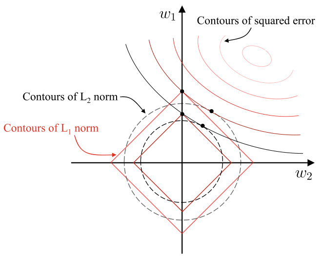
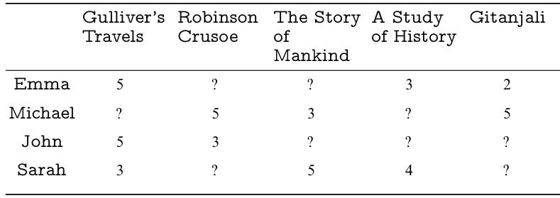

# Feature Selection and Sparse Learning  

## 11.1  Subset Search and Evaluation  

Watermelons can be described by many attributes, such as color ,  root ,  sound ,  texture , and  surface , but experienced peo- ple can determine the ripeness with only the  root  and  sound information. In other words, not all attributes are equally important for the learning task. In machine learning, attributes are also called  features . Features that are useful for the current learning task are called  relevant features , and those useless ones are called  irrelevant features . The process of selecting relevant features from a given feature set is called  feature selection .  

Feature selection is an important step of  data preprocessing that often needs to be done before training the learners. The reasons for feature selection are twofold. Firstly, the curse of dimensionality is a common issue in practical learning prob- lems due to the large number of features. If we can identify the relevant features, then the subsequent learning process will deal with a much lower dimensionality, and hence the curse of dimensionality is alleviated. From this point of view, fea- ture selection shares a similar motivation with dimensionality reduction, as discussed in Chap.  10 . Secondly, eliminating irrel- evant features often reduces the difficulty of learning because the learner is more likely to discover the truth without being distracted by irrelevant information.  

It is worth noting that the feature selection process must not discard important features. Otherwise, the performance of subsequent learning will be hurt by information loss. Further- more, for the same data set, the important features are often different for different learning tasks, and hence when we say some features are ‘‘irrelevant’’, we refer to a specific learning task. There is another category of features called  redundant fea- tures , whose information can be derived from other features. For example, considering a cubic object, if the features  base length  and  base width  are known, then  base area  is a redun- dant feature since it can be calculated from  base length  and base width . Since redundant features usually provide no addi- tional information, removing them can reduce the workload of the learning process. However, in some cases, the redundant features can make the learning easier. For example, suppose the task is to estimate the volume of a cubic, then it will become eas- ier if using the redundant feature  base area . More specifically, if a redundant feature happens to be an  intermediate concept  of the learning task, then it is a helpful redundant feature. For ease of discussion, we assume all data sets in this chapter contain no redundant feature, and all essential information is available in the given features.  

When there is no prior domain knowledge, we need to eval- uate all possible feature subsets to select the one that con- tains all essential information. However, this is computation- ally impractical due to the combinatorial explosion. A more practical method is to generate a  candidate subset  of features and then evaluate its quality, and then, based on the evalu- ation result, generate the next candidate subset. This process continues until we cannot find any better candidate subsets. There are two questions in this process: how to generate the next candidate subset of features based on the current eval- uation result and how to evaluate the quality of a candidate subset of features.  

The first question leads to the  subset search  problem. Given a feature set    $\{a_{1},a_{2},.\,.\,.\,,a_{d}\}$  , we can consider every feature as a candidate subset, and then evaluate these  $d$   single-feature sub- sets. Suppose  $\{a_{2}\}$   is optimal, then it is the selected set in the first round. After that, we add one more feature to the selected set of the previous round to generate    $d-1$   two-feature can- didate subsets. Among them, suppose the optimum is    $\{a_{2},a_{4}\}$  , and it is better than    $\{a_{2}\}$  , then it is the selected set of the current round. The candidate subset generation process stops when the optimal    $(k+1)$  -feature subset in the    $(k+1)\mathrm{th}$   round is not better than the selected set of the previous round, and the previously selected  $k$  -feature subset is returned as the outcome of feature selection. Such an incremental approach of adding relevant features is called  forward search . Similarly, if we start with a complete feature set and gradually remove irrelevant features, then it is called  backward search . Moreover, we can combine the forward and backward approaches into  bidirec- tional search  to gradually select relevant features (once selected, these features are always kept in the subsequent rounds) and remove irrelevant features.  

All of the above are greedy approaches since they only con- side r the optimal set in the current round.Forexample,suppose  $a_{5}$   is better than    $a_{6}$   in the 3rd round, then we have the selected set    $\{a_{2},a_{4},a_{5}\}$  . However, it is possible that, in the 4th round,  $\{a_{2},a_{4},a_{6},a_{8}\}$   is better than any  $\{a_{2},a_{4},a_{5},a_{i}\}$  . Unfortunately, such problems are unavoidable unless we do an exhaustive search.  

The second question leads to the  subset evaluation  problem. Given a data set    $D$  , where the proportion of the  i th class in    $D$  is  $p_{i}$     $(i\,=\,1,2,.\,.\,.\,,|\mathcal{Y}|)$  . For ease of discussion, let us a ume all features are discrete. Then, given a feature subset  A , the feature values split  $D$   into    $V$   subsets    $\{D^{1},D^{2},.\,.\,.\,,D^{V}\}$  , whe e each subset includes the samples taking the same values on  A . After that, we can compute the information gain of the feature subset  $A$  :  

Suppose that each feature has    $\nu$  possible values, then    $V=\nu^{\left|A\right|}$    is potentially very large. Hence, in practice, we often reuse the evaluation results from the previous round of subset search as a start point.  

$$
{\mathrm{Gain}}(A)={\mathrm{End}}(D)-\sum_{\nu=1}^{V}{\frac{|D^{\nu}|}{|D|}}{\mathrm{End}}(D^{\nu}),
$$  

See Sect. 4.2.1 for informationentropy.  

where the information entropy   $\operatorname{End}(D)$   is defined as  

$$
\operatorname{End}(D)=-\sum_{k=1}^{|y|}p_{k}\log_{2}p_{k}.
$$  

The larger the information gain   ${\mathrm{Gain}}(A)$   is, the more useful information the feature subset    $A$   contains for classification. Therefore, we can use the training set    $D$   to evaluate every can- didate feature subset.  

Many  diversity measures , after some modifications, can be used for evaluating feature subsets, e.g., disagreement measure and correlation coefficient. See Sect.  8.5.2 .  

More generally, the feature subset    $A$   partitions the data set  $D$  , where each partition corresponds to a value assignment of    $A$  . Since the label information    $Y$   gives the ground truth partitions of    $D$  , we can evaluate    $A$   by checking the difference between these two partitions. The smaller the difference, the better the subset  $A$  . Information gain is only one of the options to measure the difference, and any methods that can measure the difference between two partitions can be used here.  

Putting a feature subset search method and a subset evalu- ation method together gives a feature selection method. When we combine forward search with information entropy, it looks similar to decision trees. Actually, decision trees can be used for feature selection as well, where the set of splitting features is the selected feature subset. Other feature selection methods essentially combine, either explicitly or implicitly, one or more subset search and subset evaluation methods, though not that apparent as decision tree-based feature selection.  

Commonly used feature selection methods can be roughly classified into three categories, namely  filter ,  wrapper , and  embedding  methods.  

## 11.2  Filter Methods  

Filter methods select features without considering the subse- quent learners, and hence they act like ‘‘filters’’before the train- ing process.  

Relief(Relevant Features)(KiraandRendell 1992 )isawell- known filter feature selection method, which incorporates a relevance statistic to measure feature importance. This statis- tic is a vector in which each component corresponds to the importance of an original feature, and thus the importance of a feature subset is determined by the sum of the corresponding components in the vector. To select a feature subset, we select features with a component greater than a user-specified thresh- old    $\tau$  . Alternatively, we can specify the number of features    $k$  , and then select the features corresponding to the    $k$   largest com- ponents.  

The key of Relief is to determine the relevance statistics for a given training set    $\{(\pmb{x}_{1},y_{1}),(\pmb{x}_{2},y_{2}),.\,.\,.\,,(\pmb{x}_{m},y_{m})\}$  . Relief starts by finding two nearest neighbors  $\mathbf{\Delta}x_{i,n h}$   and  $\mathbf{\Delta}x_{i,n m}$   for each sample  $\pmb{x}_{i}$  , where the first one, known as a  near-hit , has the same class label as  $\pmb{x}_{i}$  , while the second one, known as a  near- miss , has a different class label. Then, the relevance statistics component of feature  $j$   is  

$$
\delta^{j}=\sum_{i}-\mathrm{{diff}}(x_{i}^{j},x_{i,\mathrm{nh}}^{j})^{2}+{\mathrm{diff}}(x_{i}^{j},x_{i,\mathrm{nm}}^{j})^{2},
$$  

where    $x_{a}^{j}$    is the value of feature    $j$   of sample    $\scriptstyle{\mathbf{x}}_{a}$  .   $\mathrm{diff}(x_{a}^{j},x_{b}^{j})$  dependsonthetypeoffeature  $j$  :when  $j$   isdiscrete,  $\mathrm{diff}(x_{a}^{j},x_{b}^{j})=$  0if  $x_{a}^{j}=x_{b}^{j}$      and1otherwise;when  $j$  iscontinuous,  $\mathrm{diff}(x_{a}^{j},x_{b}^{j})=

$   $\left|x_{a}^{j}-x_{b}^{j}\right|$   given t  $x_{a}^{j}$    and  $x_{b}^{j}$    are normalized to  [ 0 ,  1 ] .  

From ( 11.3 ), we see that, for feature  $j$  , if the distance from

  $\pmb{x}_{i}$   to its near-hit  $\mathbf{\boldsymbol{x}}_{i,\mathrm{\scriptsize{nh}}}$   is shorter than the distance to its near- miss  $\mathbf{\boldsymbol{x}}_{i,\mathrm{nm}}$  , then feature  $j$  is said to be useful for distinguishing different classes, and hence the relevance statistics component of feature  $j$   is increased; otherwise, if the distance from  $\pmb{x}_{i}$   to its near-hit  $\mathbf{\boldsymbol{x}}_{i,\mathrm{nh}}$   is greater than the distance to its near-miss  $\mathbf{\boldsymbol{x}}_{i,\mathrm{nm}}$  , then feature  $j$   is considered as useless for distinguishing different classes, and hence the relevance statistics component of feature  $j$   is decreased. By averaging the results calculated on all samples, we obtain the relevance statistics components of all features, where a higher value indicates a better discriminative ability.  

The calculation of relevance statistics in Relief is implicitly related to the idea of metric learning. See Sect.  10.6  for metric learning.  

The index  $i$   in ( 11.3 ) indicates samples used for averaging. In practice, Relief only needs to average over a sampled subset rather than the entire data set (Kira and Rendell  1992 ). The computational complexity of Relief is linear to the number of sampling and the number of the original features, and hence it is a highly efficient filter feature selection method.  

Relief was originally designed for binary classification pro b- lems, and its variant Relief-F (Kononenko  1994 ) can handle multiclass classification proble s. Given a data set  $D$   with    $|y|$  classes. For a sample  $\pmb{x}_{i}$   of class  k    $(k\in\{1,2,.\,.\,.\,,|\mathcal{Y}|\})$  , Relief-F starts by finding the near-hit  $\mathbf{\Delta}x_{i,n h}$   from class  $k$   samples, and then find a near-miss from each class other than    $k$  , denoted by  $\boldsymbol{x}_{i,l,n m}\left(l=1,2,\ldots,|\mathcal{y}|\,;l\neq k\right)$  . Accordingly, the relevance statistics component of feature  $j$   becomes  

$$
\delta^{j}=\sum_{i}-\mathrm{{diff}}\left(x_{i}^{j},x_{i,\mathrm{{nh}}}^{j}\right)^{2}+\sum_{l\neq k}\left(p_{l}\times{\mathrm{diff}}\left(x_{i}^{j},x_{i,l,\mathrm{{nm}}}^{j}\right)^{2}\right),
$$  

where  $p_{l}$   is the proportion of class    $l$   samples in the data set    $D$  .  

## 11.3  Wrapper Methods  

Unlike filter methods, which do not consider the subsequent learners, wrapper methods directly use the performance of sub- sequent learners as the evaluation metric for feature subsets. In other words, wrapper methods aim to find the most useful fea- ture subset ‘‘tailored’’ for the given learner.  

Generally speaking, wrapper methods are usually better than filter methods in terms of the learner’s final performance since the feature selection is optimized for the given learner. However, wrapper methods are often much more computa- tionally expensive since they train the learner multiple times during the feature selection.  

The Las Vegas method and the Monte Carlo method are two randomized methods named after gambling cities. Their main difference is that, when there is a time constraint, the Las Vegas method will give a satisfactory solution or give no solution, whereas the Monte Carlo method always gives a solution, though not necessarily satisfy the requirements. Both methods can give a satisfactory solution when there is no time constraint.  

Las Vegas Wrapper (LVW) (Liu and Setiono  1996 ) is a typical wrapper method. It searches feature subsets using a randomized strategy under the framework of the Las Vegas method, and the subsets are evaluated based on the final classi- ficationerror.PseudocodeofLVWisgivenin  .  Algorithm 11.1  

Line  8  of  .  Algorithm 11.1  estimates the error of learner    $\mathfrak{L}$  using cross-validation on the feature subset    $A^{\prime}$  . If the error of  $A^{\prime}$    is smaller than the error of the current feature subset    $A^{*}$  , or their errors are comparable but the size of    $A^{\prime}$    is smaller, then  $A^{\prime}$    is set as the new optimal subset.  

It is worth noting that each randomly generated subset is evaluated by training the learner one more time, which is com- putationally expensive. Hence, LVW introduces a parameter    $T$  to limit the number of iterations. However, when the number of original features is large (i.e.,    $|A|$   is large), LVW may run for a long time if we set    $T$   to a large number. In other words, LVW may not produce a solution if there is a constraint on the running time.  

Use cross-validation to estimate the error of the learner on    $A^{\prime}$  .  

Stop if there is no update in    $T$  

## 11.4  Embedded Methods and  $\mathsf{L}_{1}$   Regularization  

The feature selection process and the learner training process are clearly separated in both filter methods and wrapper meth- ods. By contrast, embedded methods unify the feature selection process and the learner training process into a joint optimiza- tion process, that is, the features are automatically selected during the training.  

Gi ata set    $D~=~\{(x_{1},y_{1}),(x_{2},y_{2}),.\,.\,,(x_{m},y_{m})\}$  , where  $\pmb{x}\,\in\,\mathbb{R}^{d}$   ∈   and  $y\,\in\,\mathbb{R}$  . Taking a simple linear regression model as an example, suppose the squared error is used as the loss function, then the optimization objective is  

$$
\operatorname*{min}_{\mathbf{w}}~\sum_{i=1}^{m}(y_{i}-\mathbf{w}^{\top}\pmb{x}_{i})^{2}.
$$  

Equation ( 11.5 ) can easily overfit the data when there is a large number of features but a small number of samples. To alleviate overfitting, we can introduce a regularization term to ( 11.5 ). If we use  $\mathrm{L}_{2}$   regularization, then we have  

$$
\operatorname*{min}_{\mathbf{w}}\ \sum_{i=1}^{m}(y_{i}-\mathbf{w}^{\top}\pmb{x}_{i})^{2}+\lambda\left\|\mathbf{w}\right\|_{2}^{2}.
$$  

In 1943, A. Tikhonov published ridge regression in the journal Proceedings of the USSR Academy of Sciences . To acknowledge its author, ridge regression is also called Tikhonov regression  and   $\mathrm{L}_{2}$  regularization is also called Tikhonov reguarlization .  

where  $\lambda\,>\,0$   is the regularization parameter. Equation ( 11.6 ) is called  ridge regression  (Tikhonov and Arsenin  1977 ), which significantly reduces the risk of overfitting by introducing   $\mathrm{L}_{2}$  regularization.  

We can also replace   $\mathrm{L}_{2}$   norm with  $\mathrm{L}_{p}$   norm. For example, when  $p=1$   (i.e.,   $\mathrm{L}_{1}$   norm), we have  

$$
\operatorname*{min}_{\mathbf{w}}\ \sum_{i=1}^{m}(y_{i}-\mathbf{w}^{\top}\pmb{x}_{i})^{2}+\lambda\left\|\mathbf{w}\right\|_{1},
$$  

which is known as Least Absolute Shrinkage and Selection Operator (LASSO) (Tibshirani  1996 ).  

Though both   $\mathrm{L}_{1}$   and   $\mathrm{L}_{2}$   regularization can help reduce the risk of overfitting, the former enjoys an extra benefit:   $\mathrm{L}_{1}$   norm is more likely to result in a  sparse  solution than  $\mathrm{L}_{2}$   norm, that is, fewer non-zero components in    $\mathbf{w}$  .  

It seems that  $\mathrm{L}_{0}$   norm is a natural choice for inducing sparsity on  w  (i.e., minimize the number of non-zero components in  w ). However,  $\mathbf{L}_{0}$   norm is discontinuous, which makes the optimization difficult, and hence it is often approximated by   $\mathrm{L}_{1}$  norm.  

That is, those features corresponding to non-zero components of  w  

To see the difference between  $\mathrm{L}_{1}$   and  $\mathrm{L}_{2}$   norms, let us look at an intuitive example. Suppose  $\pmb{x}$   has only two features, then, for both ( 11.6 ) and ( 11.7 ), the solution  w  has two components  $w_{1}$   and    $w_{2}$  . Using these two components as two axes, we plot the  contours  of the first terms in ( 11.6 ) and ( 11.7 ), that is, con- necting the points with an equal squared error in the space of  $(w_{1},w_{2})$  . Then, we plot the contours for  $\mathrm{L}_{1}$   norm and   $\mathrm{L}_{2}$   norm, respectively, that is, connecting the points with equal   $\mathrm{L}_{1}$   norm and connecting the points with equal  $\mathrm{L}_{2}$   norm. The plotted con- tours are illustrated in    $\circ$   Figure 11.1 . The solutions of ( 11.6 ) and ( 11.7 ) need to make a trade-off between the squared error term and the regularization term. In other words, the solutions lie on the intersections between the contours of the squared error term and the regularization term. From  .  Figure 11.1 , we can see that, when using   $\mathrm{L}_{1}$   norm, the intersections often lie on the axes, that is, either    $w_{1}$   or    $w_{2}$   is 0. By contrast, when using   $\mathrm{L}_{2}$   norm, the intersections often lie in a quadrant, that is, neither  $w_{1}$   nor  $w_{2}$   is 0. In other words,   $\mathrm{L}_{1}$   norm is more likely to result in a sparse solution than  $\mathrm{L}_{2}$   norm.  

A sparse solution  w  implies that only the original features corresponding to non-zero components of  w  are included in the final model. Hence, a model trained with  $\mathrm{L}_{1}$   regularization is likely to use only some of the original features. In other words, the learning method based on  $\mathrm{L}_{1}$   regularization is an embed- ded feature selection method that unifies the process of feature selection and the process of training.  

The  $\mathrm{L}_{1}$   regularization problem can be solved by Proximal Gradient Descent (PGD) (Combettes and Wajs  2005 ). More specifically, let  $\nabla$  denote the differential operator, and we con- sider the optimization objective  

$$
\operatorname*{min}_{\pmb{x}}\ f(\pmb{x})+\lambda\left\|\pmb{x}\right\|_{1}.
$$  

  
Fig. 11.1 It is easier to obtain sparse solutions using  $\mathrm{L}_{1}$   regularization than using  $\mathrm{L}_{2}$   regularization  

$\operatorname{If}f(x)$   is differentiable and    $\nabla f$   sati e    $L$  -Lipschitz condi- tion, that is, there exists a constant  $L>0$   0 such that  

$$
\left\|\nabla f(\pmb{x}^{\prime})-\nabla f(\pmb{x})\right\|_{2}\leqslant L\left\|\pmb{x}^{\prime}-\pmb{x}\right\|_{2}\ \,(\forall\pmb{x},\pmb{x}^{\prime}).
$$  

Then, in the vicinity of  $\pmb{x}_{k},f(\pmb{x})$   can be approximated by the second-order Taylor expansion as  

$$
\begin{array}{l}{{\displaystyle\hat{f}({\pmb x})\simeq f({\pmb x}_{k})+\langle\nabla f({\pmb x}_{k}),{\pmb x}-{\pmb x}_{k}\rangle+\frac{L}{2}\left\|{\pmb x}-{\pmb x}_{k}\right\|^{2}}}\\ {{\displaystyle\qquad=\frac{L}{2}\left\|{\pmb x}-\left({\pmb x}_{k}-\frac{1}{L}\nabla f({\pmb x}_{k})\right)\right\|_{2}^{2}+\mathrm{const},}}\end{array}
$$  

where    $\langle\cdot,\cdot\rangle$  is the inner product and const is a constant inde- pendent of    $\pmb{x}$  . The minimum of ( 11.10 ) is obtained at    $\pmb{x}_{k+1}$  :  

$$
{\pmb x}_{k+1}={\pmb x}_{k}-\frac{1}{L}\nabla f({\pmb x}_{k}).
$$  

Therefore,ifweminimize  $f(x)$  with gradient descent method, then each step of gradient descent iteration is equivalent to min- imizing the quadratic function  ${\hat{f}}({\pmb x})$  . Similarly, extending this idea to ( 11.8 ) gives  

$$
{\pmb x}_{k+1}=\arg\operatorname*{min}_{{\pmb x}}\frac{L}{2}\left\|{\pmb x}-\left({\pmb x}_{k}-\frac{1}{L}\nabla f({\pmb x}_{k})\right)\right\|_{2}^{2}+\lambda\left\|{\pmb x}\right\|_{1},
$$  

that is, each gradient descent iteration takes the minimization of   $\mathrm{L}_{1}$   norm into account.  

For ( 11.12 ), we can first calculate  $\begin{array}{r}{z=\pmb{x}_{k}-\frac{1}{L}\nabla f(\pmb{x}_{k})}\end{array}$   − , and then solve  

$$
\begin{array}{l}{\displaystyle\mathsf{i n\;s o v e}}\\ {\displaystyle\pmb{x}_{k+1}=\arg\operatorname*{min}_{\pmb{x}}\frac{L}{2}\left\|\pmb{x}-\pmb{z}\right\|_{2}^{2}+\lambda\left\|\pmb{x}\right\|_{1}.}\end{array}
$$  

Exercise  11.8 .  

Let    $x^{i}$    denote the  i th component of    $\pmb{x}$  . Then, by expanding the components of    $\pmb{x}$   in ( 11.13 ), we find out that there is no term in  e form of    $x^{i}x^{j}$     $(i\neq j)$  ), which means that the components of  x  are not interfering with each other. Hence, ( 11.13 ) has a closed-form solution  

$$
x_{k+1}^{i}=\left\{\begin{array}{l l}{z^{i}-\lambda/L,}&{\lambda/L<z^{i};}\\ {0,}&{\left|z^{i}\right|\leqslant\lambda/L;}\\ {z^{i}+\lambda/L,}&{z^{i}<-\lambda/L,}\end{array}\right.
$$  

where    $x_{k+1}^{i}$    and  $z^{i}$  are the  i th component of    $\pmb{x}_{k+1}$  and  $z$  , respec- + tively. Therefore, PGD can quickly solve LASSO or any other models that are based on  $\mathrm{L}_{1}$   norm.  

## 11.5  Sparse Representation and Dictionary Learning  

With the input factors reduced, the ‘‘input-output’’ relations within the learned model become more clear.  

We can consider the data set    $D$   as a matrix, in which each row corresponds to a sample, and each column corresponds to a feature. Feature selection assumes that the features are  sparse , which means that many columns of the matrix are irrelevant to the learning problem. By identifying and removing these columns, we can obtain a smaller matrix that is easier to learn. It also reduces the computation and storage overheads and improves the interpret ability of the learned model.  

Now, let us consider another kind of sparsity: there are many zero elements in the matrix    $D$  , but the zero elements do not lie in the whole rows or columns. Such data is quite common in practice. For example, in document classification problems, each document is a sample, and each word within is a feature with the frequency as its value. In other words, each row in the matrix    $D$   corresponds to a document, and each column corresponds to a word. The intersection of a row and a column is the frequency of the word in the document. How many columns are we talking about here? Taking English as an example, according to the Oxford English Dictionary, there are 171 ,  476 words, which correspond to 171 ,  476 columns in the matrix. Even if we consider only the most important words, as in the Oxford 3000 list, there are still 3000 columns. However, since most of these words do not appear in a single typical document, every row in the matrix contains a large number of zero elements, and the zero elements of different documents often appear in quite different columns.  

The above sparse representation can benefit some learning tasks. For example, an important reason that the linear sup- port vector machine performs well on text classification tasks is that the sparse representation of word frequencies makes most problems linearly separable. Meanwhile, sparse repre- sentations will lead to less storage overheads since there are efficient methods to store the sparse matrix.  

See Sects.  6.3  and  12.4 .  

Is it possible to convert a dense data set    $D$   (i.e., a typical non-sparse data set) into a sparse representation to take its advantages? It is worth noting that the sparse representation we are looking for is ‘‘appropriately sparse’’rather than ‘‘overly sparse’’. For example, using the Oxford 3000 list may give a use- ful representation that is appropriately sparse, whereas using the Oxford English Dictionary may produce a less useful and overly sparse representation.  

Of course, in real-world learning problems, such as image classification, there is no Oxford 3000 list available, and hence we need to learn such a  dictionary . The dictionary can convert samples from a dense representation to a sparse representa- tion that leads to an easier learning problem as well as a sim- pler model. The process of constructing an appropriate dictio- nary is called  dictionary learning , also known as  sparse coding . However, the two names have slightly different emphases: dic- tionary learning emphasizes the process of learning the dictio- nary, while sparse coding emphasizes the process of converting samples to sparse representations. Since both are done in the same process of optimization, we do not distinguish them in this book, and both are called dictionary learning.  

Dictionary is also called a codebook .  

Dictionary learning is also known as  codebook learning .  

Given a data set  $\{\pmb{x}_{1},\pmb{x}_{2},.\,.\,.\,,\pmb{x}_{m}\}$  , the simplest form of dic- tionary learning is  

$$
\operatorname*{min}_{\mathbf{B},\pmb{\alpha}_{i}}\ \sum_{i=1}^{m}\|\pmb{x}_{i}-\mathbf{B}\pmb{\alpha}_{i}\|_{2}^{2}+\lambda\sum_{i=1}^{m}\|\pmb{\alpha}_{i}\|_{1}\,,
$$  

where  $\mathbf{B}\in\mathbb{R}^{d\times k}$    is the dictionary matrix,  $k$   is t bulary size, which is usually specified b r, and  $\pmb{\alpha}_{i}\in\mathbb{R}^{k}$   ∈   is the sparse represe tion of sample  $\mathbf{\dot{x}}_{i}\in\mathbb{R}^{d}$   ∈ . In ( 11.15 ), the first term seeks for  ${\pmb{\alpha}}_{i}$   that can reconstruct  $\pmb{x}_{i}$  , and the second term seeks for    ${\pmb{\alpha}}_{i}$   that is sparse.  

Compared to LASSO, ( 11.15 ) is more complicated since it not only needs to learn  ${\pmb{\alpha}}_{i}$  , which is similar to    $\mathbf{w}$   in ( 11.7 ), but also the dictionary matrix  B . However, as inspired by LASSO, we can solve ( 11.15 ) with alternating optimization.  

In the first step of alternating optimization, we fix the dictio- nary    $\mathbf{B}$   to optimize  ${\pmb{\alpha}}_{i}$  . By expanding ( 11.15 ) as the components of  ${\pmb{\alpha}}_{i}$  , we find out that there is no cross-term like  $\alpha_{i}^{u}\alpha_{i}^{\nu}$     $(u\neq\nu)$  , and hence, similar to LASSO, we can find  ${\pmb{\alpha}}_{i}$   for each sample  

$$
\operatorname*{min}_{\pmb{\alpha}_{i}}\ \|\pmb{x}_{i}-\mathbf{B}\pmb{\alpha}_{i}\|_{2}^{2}+\lambda\,\|\pmb{\alpha}_{i}\|_{1}\,.
$$  

In the second step, we initialize with  ${\pmb{\alpha}}_{i}$   to optimize the dic- tionary    $\mathbf{B}$  , that is, ( 11.15 ) becomes  

$$
\operatorname*{min}_{\mathbf{B}}\ \ \|\mathbf{X}-\mathbf{B}\mathbf{A}\|_{F}^{2}\,,
$$  

$\mathbf{X}=(x_{1},x_{2},\hdots,x_{m})\in\mathbb{R}^{d\times m}$  ,    ${\bf A}=({\pmb\alpha}_{1},{\pmb\alpha}_{2},.\,.\,.\,,{\pmb\alpha}_{m})\in$   $\mathbb{R}^{k\times m}$  , and    $\|\!\cdot\!\|_{F}$   is the Frobenius norm. There are different methods to solve ( 11.17 ), and a frequently used one is K- SVD (Aharon et al.  2006 ), which takes a column-wise updating strategy. Let  $\pmb{b}_{i}$   denote the  i th column of the dictionary matrix

  $\mathbf{B}$  , and  ${\pmb\alpha}^{i}$    denote the  i th row of the sparse representation matrix

  $\mathbf{A}$  , then ( 11.17 ) can be rewritten as  

$$
\begin{array}{r l}&{\displaystyle\operatorname*{min}_{\mathbf{B}}~~\|\mathbf{X}-\mathbf{B}\mathbf{A}\|_{F}^{2}=\operatorname*{min}_{b_{i}}~~\left\|\mathbf{X}-\sum_{j=1}^{k}b_{j}\pmb{\alpha}^{j}\right\|_{F}^{2}}\\ &{\displaystyle\qquad\qquad\qquad\qquad=\operatorname*{min}_{b_{i}}~~\left\|\left(\mathbf{X}-\sum_{j\neq i}b_{j}\pmb{\alpha}^{j}\right)-b_{i}\pmb{\alpha}^{i}\right\|_{F}^{2}}\\ &{\displaystyle\qquad\qquad\qquad=\operatorname*{min}_{b_{i}}~~\left\|\mathbf{E}_{i}-b_{i}\pmb{\alpha}^{i}\right\|_{F}^{2}.\qquad\qquad(1)}\end{array}
$$  

When updating the  i th column of the dictionary matrix,    $\mathbf{E}_{i}=

$   $\mathbf{X}-\sum_{j\neq i}b_{j}\pmb{\alpha}^{j}$   is fixed since all other columns are fixed. Hence, ̸=

 ( 11.18 ) is, theoretically, minimized by finding the orthogonal vectors corresponding to the largest singular values of    $\mathbf{E}_{i}$  . How- ever, since the singular value decomposition of    $\mathbf{E}_{i}$   updates both  $\pmb{b}_{i}$   and  ${\pmb\alpha}^{i}$  , it may break the sparsity of  A . To avoid this, K-SVD takes some special treatments for    $\mathbf{E}_{i}$   and    ${\pmb\alpha}^{i}$  : before the singu- lar value decomposition, we keep only the non-zero elements of  ${\pmb\alpha}^{i}$  , and, for    $\mathbf{E}_{i}$  , we keep only the product terms of    $\pmb{b}_{i}$   and the non-zero elements of    ${\pmb\alpha}^{i}$  ; by doing so, the sparsity obtained in the first step is preserved.  

After initializing the dictionary matrix    $\mathbf{B}$  , repeating the above two steps gives the final dictionary    $\mathbf{B}$   and a sparse rep- resentation    ${\pmb{\alpha}}_{i}$   for each sample  $\pmb{x}_{i}$  . The above dictionary learn- ing process has a user-specified parameter    $k$   that controls the vocabulary size, which relates to the sparseness.  

## 11.6  Compressed Sensing  

In real-world applications, we often need to recover the full information from the partially available information. Tak- ing telecommunication as an example, we convert analog sig- nals into digital signals. According to the Nyquist sampling theorem, if the sampling rate is more than twice the analog signal’s highest frequency, then the sampled digital signal con- tains all information in the analog signal. That is, we can fully reconstruct the original analog signals from the converted dig- ital signals. However, the sampled digital signal is often com- pressed for ease of transmission and storage, which may lead to information loss. Besides, there could be more information loss during the transmission, e.g., packet loss. In such cases, the information is not received in full, then can we still fully reconstruct the original signal? One solution to such problems is  compressed sensing  (Donoho  2006 ; Candès et al.  2006 ).  

Also known as  compressive sensing .  

Suppose there is a discrete signal  $\pmb{x}$   with a length  $m$  , then, by sampling at a rate much lower than the sampling rate required by the Nyquist sampling theorem, we obtain a sampled signal  $\pmb{y}$   with a length  n  $(n\ll m)$  :  

$$
\pmb{y}=\pmb{\Phi}\pmb{x},
$$  

where    $\Phi\in\mathbb{R}^{n\times m}$    is the measurement matrix of signal  $\pmb{x}$  , which determines the sampling rate and how the sampled signal is constructed.  

The measurement value  $\pmb{y}$   can be easily calculated with the discrete signal    $\pmb{x}$   and the measurement matrix    $\Phi$  . However, can a receiver recover the original signal  $\pmb{x}$   from the received measurement value and measurement matrix?  

In general, the a wer is ‘‘no’’. Since  $n\ll m$  , ( 11.19 ), which consists of  ${\pmb y},{\pmb x}$  , and   , must be an under-determined equation whose numerical solution is difficult to find.  

Suppose there   linear transformation    $\pmb{\Psi}\,\in\,\mathbb{R}^{m\times m}$    that can represent  $\pmb{x}$   as  $\Psi s$  , then  $y$   can be expressed by  

$$
\begin{array}{r}{\pmb{y}=\pmb{\Phi}\pmb{\Psi}\pmb{s}=\pmb{\mathrm{A}}\pmb{s},}\end{array}
$$  

where  $\mathbf{A}=\Phi\Psi\in\mathbb{R}^{n\times m}$  . If we can recover  $\pmb{S}$   from  $\pmb{y}$  , then the signal  $\pmb{x}$   can be recovered by  $\pmb{x}=\pmb{\Psi s}$  .  

At first glance, ( 11.20 ) is not helpful since the inverse prob- lem (i.e., recovering the signal  $\pmb{S}$  ) is still under- determined. Interestingly, however, the inverse problem can be easily solved if  $\pmb{S}$   is sparse! It is because the sparsity significantly reduces the impacts of unknown factors. When  $\pmb{S}$   is sparse,    $\pmb{\Psi}$  in ( 11.20 ) is called a sparse basis, and  A  acts like a dictionary that converts the signal to a sparse representation.  

In many applications, we can obtain sparse  $\pmb{S}$  . For example, the digital signals of image or audio are usually non-sparse in the time domain, but they can be converted to sparse signals in the frequency domain using mathematical transforms, such as Fourier transform, cosine transform, and wavelet transform.  

Unlike feature selection and sparse representation, com- pressed sensing focuses on how to recover the original signal from the partially observed samples via the inherent sparsity of the signal. It is commonly agreed that compressed sens- ing has two stages: the  sensing and measurement  stage and the reconstruction and recovery  stage. The sensing and measure- ment stage focuses on obtaining a sparse representation of the original signal via methods such as Fourier transform, wavelet transform, as well as dictionary learning and sparse coding that have been introduced in Sect.  11.5 . Many of these tech- niques have already been developed in other fields, such as sig- nal processing, before compressed sensing was proposed. The reconstruction and recovery stage focuses on reconstructing the original signal from the partial observations by exploiting the sparsity property. This stage is the heart of compressed sensing, and we usually refer to this part when talking about compressed sensing.  

The theories behind compressed sensing are a bit complex. Hence, we only briefly introduce the Restricted Isometry Prop- erty (RIP) (Candès  2008 ).  

For a    $n\times m$     $(n\ll m)$   ma ix  A , we say  A  satisfies the    $k$  - restricted isometry property (  $k$  -RIP) if there exists a constant  $\delta_{k}\in(0,1)$   such that  

$$
(1-\delta_{k})\,\|s\|_{2}^{2}\leqslant\|\mathbf{A}_{k}s\|_{2}^{2}\leqslant(1+\delta_{k})\,\|s\|_{2}^{2}
$$  

holds for every vector  $\pmb{S}$  and submatrix  $\mathbf{A}_{k}\in\mathbb{R}^{n\times k}$    of  A . In such cases, the sparse signal  s  can be almost fully reconstructed from  $\pmb{y}$  , and subsequently  $\pmb{x}$  :  

$$
\begin{array}{r l}&{\underset{s}{\operatorname*{min}}\ \ \lVert s\rVert_{0}}\\ &{\mathrm{s.t.}\ \ y=\mathbf{A}s.}\end{array}
$$  

However, since ( 11.22 ) involves the minimization of   $\mathrm{L}_{0}$  norm, it is an NP-hard problem. Fortunately, under certain conditions, minimizing  $\mathbf{L}_{0}$   norm shares the same solution with minimizing   $\mathrm{L}_{1}$   norm (Candès et al.  2006 ). Hence, in practice, we solve  

$$
\begin{array}{c}{\operatorname*{min}_{\boldsymbol{s}}\ \ \|\boldsymbol{s}\|_{1}}\\ {\mathrm{s.t.}\ \ y=\mathbf{A}\boldsymbol{s},}\end{array}
$$  

which means the compressed sensing problem is solved as an  $\mathrm{L}_{1}$   norm minimization problem. For example, ( 11.23 ) can be converted to a form that is equivalent to LASSO, which can then be solved by proximal gradient descent, that is, using Basis Pursuit De-Noising (Chen et al.  1998 ).  

The techniques for reconstructing full information from partial information have important uses in many real-world applications. For example, by collecting the ratings provided by readers, an online book store can infer the preferences of readers, which can then be used for personalized recommen- dations. However, the preference information is only partially available since none of the readers has read all books, and none of the books has been read by all users.  .  Table 11.1  gives an example of ratings provided by four readers. The ratings are processed into a 1− 5 scale, from the least to the most preferred. Because readers only rate the books they read, the table con- tains many unknown values.  

Considering the ratings in  $^{\circ}$   Table 11.1  as a partially avail- able signal, is it possible to recover the original signal via the mechanism of compressed sensing?  

Recall that a pre-requisite of recovering an under-sampled signal via compressed sensing is that the signal has a sparse rep- resentation. Then, do the readers’preference data have a sparse representation? The answer is ‘‘yes’’. In general, the ratings depend on many factors such as genre, author, and bookbind- ing; for ease of discussion, suppose the ratings in  .  Table 11.1 are only about the genre. In our example,  Gulliver’s Trav- els  and  Robinson Crusoe  are novel books;  The Story of Mankind  and  A Study of History  are history books;  Gitan- jali  is a poem book. Typically, books with the same genre are likely to have the same readers. With this assumption, books can be grouped by genre, where the number of groups is far less than the number of books. In other words, the signal in .  Table 11.1  is sparse in terms of genre. Hence, the mecha- nism of compressed sensing should be applicable to the rating recovery problem.  

  

The above problem can be solved with the matrix completion technique (Candès and Recht  2009 ) as follows:  

min rank ( X ) X  

where  X  is the sparse signal to be recovered; rank  $(\mathbf{X})$   is the rank of the matrix  $\mathbf{X}$  ;  A  is the observed signal, e.g., the rating matrix in  $\circ$   Table 11.1 ;  $\Omega$   is the set of subscript index pairs    $(i,j)$   of the non-missing (i.e., not ‘‘?’’) elements    $(\mathbf{A})_{i j}$   in  A . The constraint in ( 11.24 ) states that the elements    $(\mathbf{X})_{i j}$   in the recovered matrix  $\mathbf{X}$   must have the same values as the corresponding elements in the observed matrix    $\mathbf{A}$  .  

Similar to ( 11.22 ), ( 11.24 ) is an NP-hard problem. The con- vex hull of rank  $(\mathbf{X})$   on the set    $\{\mathbf{X}\in\mathbb{R}^{m\times n}:\|\mathbf{X}\|_{F}^{2}\leqslant1\}$   is the nuclear norm  of  X :  

Nuclear norm is also known as trace norm .  

$$
\|\mathbf{X}\|_{*}=\sum_{j=1}^{\operatorname*{min}\{m,n\}}\sigma_{j}(\mathbf{X}),
$$  

where    $\sigma_{j}(\mathbf{X})$   is the singular value of    $\mathbf{X}$  . Equation ( 11.25 ) states that the nuclear norm of a matrix is the sum of its singular val- ues. Therefore, we can find an approximate solution of ( 11.24 ) by minimizing the nuclear norm of the matrix:  

$$
\begin{array}{c}{\underset{\mathbf{X}}{\operatorname*{min}}\ \ \lVert\mathbf{X}\rVert_{*}}\\ {\mathrm{s.t.}\ \ (\mathbf{X})_{i j}=(\mathbf{A})_{i j},\ (i,j)\in\Omega.}\end{array}
$$  

See Appendix  B.3  for SDP.  

Since ( 11.26 ) is a convex optimization problem, it can be solved with Semidefinite Programming (SDP). Theoretical studies show that, under certain conditions, if r  $(\mathbf{A})=r$  d    $n\ll m$  , then  A  can be perfectly recovered from  $O(m r\log^{2}m)$   observed elements (Recht  2011 ).