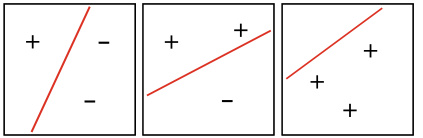
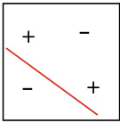

# Computational Learning Theory  

## 12.1  Basic Knowledge  

As the name suggests,  computational learning theory  is about ‘‘learning’’by ‘‘computation’’and is the theoretical foundation of machine learning. It aims to analyze the difficulties of learn- ingproblems,provides theoretical guarantees for learning al go- rithms, and guides the algorithm design based on theoretical analysis.  

Given a data set    $D\ =\ \{(x_{1},y_{1}),(x_{2},y_{2}),.\,.\,.\,,(x_{m},y_{m})\},$  where  $x_{i}\;\in\;\mathcal{X}.$  . In t cus on binary classifica- tion problems (i.e.,  $y_{i}\in\mathcal{Y}=\{-1,+1\}$   ∈  = {−  + } ) unless otherwise ated. Suppose there is an underlying unknown distribution  over  D all samples in    $\mathcal{X},$  , and all samples in    $D$   are drawn independently from the distribution  $\mathcal{D}$  , that is,  i . i . d .  samples.  

Let  $h$   be a mapping from  $\mathcal{X}$   to    $y$  , and its generalization error is  

$$
E(h;\,\mathcal{D})=P_{x\sim\mathcal{D}}(h(x)\neq y).
$$  

The empirical error of  $h$   over    $D$   is  

$$
\widehat{E}(h;D)=\frac{1}{m}\sum_{i=1}^{m}\mathbb{I}(h(\pmb{x}_{i})\neq y_{i}).
$$  

Since    $D$   contains  i . i . d .  samples drawn from    $\mathcal{D}$  , the expec- tation of the empirical error of    $h$   equals to the generalization erro  it is clear from context, we abbreviate    $E(h;\mathcal{D})$  and    $\widehat{E}(h;D)$   ;  as    $E(h)$   and    $\widehat{E}(h)$   , respectively. The maximum error we can tolerate for a learned model, also known as the error parameter , is an upper bound of    $E(h)$  , denoted by  $\epsilon$  , where  $E(h)\leqslant\epsilon$  .  

The rest of this chapter studies the gap between the empir- ical error and the generalization error. A mapping    $h$   is said to be consistent with    $D$   if the empirical error of    $h$   on the data set  $D$   is 0. For any two mappings    $h_{1},h_{2}\in\mathcal{X}\to\mathcal{Y}$  , their difference can be measured by the  disagreement  

$$
d(h_{1},h_{2})=P_{x\sim\mathcal{D}}(h_{1}(\pmb{x})\neq h_{2}(\pmb{x})).
$$  

For ease of reference, we list a few frequently used inequal- ities below  

Jensen’s inequality : for every convex function  $f(x)$  , we have  

$$
f(\mathbb{E}(x))\leqslant\mathbb{E}(f(x)).
$$  

• Hoeffding’s inequality  (Hoeffding  1963 ): if    $x_{1},x_{2},\dots,x_{m}$  are    $m$   independent random variables with  $0\leqslant x_{i}\leqslant1$  , then, for any  $\epsilon>0$  , we have  

$$
\begin{array}{l}{\displaystyle P\left(\frac{1}{m}\sum_{i=1}^{m}x_{i}-\frac{1}{m}\sum_{i=1}^{m}\mathbb{E}(x_{i})\geqslant\epsilon\right)\leqslant\exp(-2m\epsilon^{2}),}\\ {\quad\quad\quad\quad\quad\quad\quad\quad\quad\quad\quad\quad\quad\quad(12)}\\ {\displaystyle P\left(\left|\frac{1}{m}\sum_{i=1}^{m}x_{i}-\frac{1}{m}\sum_{i=1}^{m}\mathbb{E}(x_{i})\right|\geqslant\epsilon\right)\leqslant2\exp(-2m\epsilon^{2}).}\end{array}
$$  

• McDiarmid’sinequality  (McDiarmid 1989 ):if  $x_{1}$  ,  $x_{2},\ldots,x_{m}$  are  $m$   independent random variables, and for any   $1\leq i\leq$   $m$  , the function  $f$   satisfies  

$$
\operatorname*{sup}_{x_{1},\ldots,x_{m},x_{i}^{\prime}}\left\vert f(x_{1},\ldots,x_{m})-f(x_{1},\ldots,x_{i-1},x_{i}^{\prime},x_{i+1},\ldots,x_{m})\right\vert\leqslant c_{i},
$$  

then, for any  $\epsilon>0$  , we have  

$$
P(f(x_{1},.\,.\,,x_{m})-\mathbb{E}(f(x_{1},.\,.\,,x_{m}))\geqslant\epsilon)\leqslant\exp\left({\frac{-2\epsilon^{2}}{\sum_{i}c_{i}^{2}}}\right),
$$  

$$
P(|f(x_{1},\ldots,x_{m})-\mathbb{E}(f(x_{1},\ldots,x_{m}))|\geqslant\epsilon)\leqslant2\exp\left({\frac{-2\epsilon^{2}}{\sum_{i}c_{i}^{2}}}\right).
$$  

## 12.2  PAC Learning  

Probably Approximately Correct (PAC) learning theory (Valiant  1984 ) is one of the most fundamental components of computational learning theory.  

Let    $c$   denote a  concept , which provides a mapping from the sample space    $\mathcal{X}$  to the label space    $y,$  , and    $c$   determines the ground-truth label  $y$   of the sample  $\pmb{x}$  . A concept    $c$   is said to be a target concept if    $c({\pmb x})=y$   holds for every sample    $(x,y)$  . The set of all target concepts that we wish to learn is called a  concept class , denoted by    $\mathcal{C}$  .  

The set of all possible concepts for a given learning algo- rithm    $\mathfrak{L}$   is called a  hypothesis space , denoted by    $\mathcal{H}$  . Since the ground-truth concept class is unknown to learning algorithms,  $\mathcal{H}$   and  $\mathcal{C}$   are usually different. A learning algorithm constructs  $\mathcal{H}$  by collecting all concepts that are believed to be the target con- cepts. Since it is unknown whether the collected concepts are ground-truth target concepts,    $h\in{\mathcal{H}}$   is referred to as a  hypoth- esis , which provides a mapping from the sample space    $\mathcal{X}$  to the label space  $y$  .  

If    $c\,\in\,{\mathcal{H}}$  , then    $\mathcal{H}$   contains a hypothesis that can correctly classify all instances, and such a learning problem is said to be separable  or  consistent  with respect to the learning algorithm  $\mathfrak{L}$  . If    $c\notin\mathcal{H}$  ∈ H , then  $\mathcal{H}$   does not contain any hypothesis that can correctly classify all instances, and such a learning problem is said to be  non-separable  or  inconsistent  with respect to the learning algorithm  L .  

See Sect.  1.4 . In general, the fewer the training samples, the higher the randomness.  

Given a training set    $D$  , we wish the learning algorithm    $\mathfrak{L}$  can learn a hypothesis    $h$   that is close to the target concept    $c$  . Readers may wonder why not learn the exact target concept  $c?$  The reason is that the machine learning process is subject to many factors. For example, since the training set    $D$  usually con- tains finite samples, there often exist many  equivalent hypothe- ses  that cannot be distinguished by learning algorithms on    $D$  . Also, there exists some randomness when sampling    $D$   from    $\mathcal{D}$  , and hence the hypotheses learned from different equal-sized training sets could be different. Therefore, instead of learning the exact target concept    $c$  , we wish to learn a hypothesis  $h$   with an error bounded by a given value with high confidence, that is, a hypothesis that is probably approximately correct (i.e., PAC). Let   $1-\delta$   denote the confidence, and we have the formal definition as follows:  

Definition 12.1  ( PAC Identify ) A learning algorithm    $\mathfrak{L}$   is said to PAC identify the concept class    $\mathcal{C}$  from the hypothesis space  $\mathcal{H}$   if, for any    $c\,\in\,{\mathcal{C}}$   and distribution    $\mathcal{D}$  , an  $\epsilon,\delta\ \in\ (0,1)$  , the learning algorithm    $\mathfrak{L}$   outputs a hypothesis  $h\in{\mathcal{H}}$   ∈ H  satisfying  

$$
P(E(h)\leqslant\epsilon)\geqslant1-\delta.
$$  

Such a learning algorithm    $\mathfrak{L}$   has a probability of at least  $1-\delta$   of learning an approximation of the target concept    $c$   with an error of at most  $\epsilon$  . Following Definition  12.1 , we can further define the following:  

The sample size  $m$   is related to the error  $\epsilon$  , the confidence  $1-\delta$  , the complexity of data  $\mathrm{size}(x)$  , and the complexity of target concept size ( c ) .  

Definition 12.2  ( PAC Learnable ) A target concept class  $\mathcal{C}$   is said to be PAC learnable with respect to the hypothesis space    $\mathcal{H}$   if there exists a learning  gorithm  L  such that, for any    $\epsilon,\delta\ \in$   $(0,1)$   and distribution , the learning algorithm  can PAC  D  L identify the concept class    $\mathcal{C}$   from the hypothesis space    $\mathcal{H}$   for any  $m\geqslant\mathrm{poly}(1/\epsilon,1/\delta$  ,  size ( x ),    $\mathrm{size}(c))$  , where poly  $(\cdot,\cdot,\cdot,\cdot)$   is a polynomial function and    $m$   is the number of  i . i . d .  training samples drawn from the distribution    $\mathcal{D}$  .  

For learning algorithms, it is necessary to consider the run- ning time complexity. Hence, we further define:  

Definition 12.3  (  $P A C$  Learning Algorithm ) A concept class    $\mathcal{C}$   is said to be efficiently PAC learnable by its PAC learning algo- rithm    $\mathfrak{L}$   if  $\mathcal{C}$   is PAC learnable by  L  within a polynomial time poly  $(1/\epsilon,1/\delta$  ,  size  $({\pmb x})$  ,  size ( c )) .  

Suppose the learning algorithm  L  processes each sample with a constant time, then the running time complexity is equiv- alent to the sample complexity, and we could focus only on the sample complexity:  

Definition 12.4  ( Sample Complexity ) The sample complexity of a PAC learning algorithm    $\mathfrak{L}$   is the smallest sample size    $m\,\geqslant$  p  $\mathrm{poly}(1/\epsilon,1/\delta,\,\mathrm{size}(x),\,\mathrm{size}($   $(c)$  )  required by    $\mathfrak{L}$  .  

PAC learning provides a formal framework for describing the learning ability of learning algorithms, and many important questions can be discussed theoretically under this framework. For example, what are the requirements for learning a good model for a given learning problem? What are the conditions for an algorithm to learn effectively? How many training sam- ples are required to learn a good model?  

A hypothesis space  $\mathcal{H}$   includes all possible output hypothe- ses of a learning algorithm  L ,and a key element of PAC learning is the complexity of    $\mathcal{H}$  . If the hypothesis space is the same as the concept class (i.e.,  $\mathcal{H}=\mathcal{C}$  ), then  $\mathcal{C}$   is said to be  properly  $P A C$  learnable  with respect to  $\mathcal{H}$  . Intuitively, it means the ability of the learning algorithm properly matches the learning problem. However, it is impractical to assume that  ${\mathcal{H}}={\mathcal{C}}$   since we do   not know the concept class for real problems, let alone some learning algorithm  L  with    $\mathcal{H}$   is exact    $\mathcal{C}.$  . Therefore, it is more realistic to study the cases when the hypothesis space and the concept class are different (i.e.,    ${\mathcal{H}}\neq{\mathcal{C}}$  ). In general, a larger    $\mathcal{H}$  is more likely to contain the target concept we are looking for, though the larger hypothesis space also makes it more difficult to find the target concept.    $\mathcal{H}$   is called a  finite hypothesis space if    $|{\mathcal{H}}|$   is finite, and an  infinite hypothesis space  otherwise.  

## 12.3  Finite Hypothesis Space  

### 12.3.1  Separable Case  

In separable cases, the target concept    $c$   is in the hypothesis space    $\mathcal{H}$   (i.e.,    $c\in\mathcal{H}$  ). Then, given a  aining set    $D$   with size    $m$  , how can we find a hypothesis from  satisfying the constraint  H of a given error parameter?  

It is natural to come up with the following learning strategy. Since the labels of the samples in    $D$   are assigned by the target ncept    $c\in\mathcal H$  , any hypotheses that misclassify any samples in  $D$   must not be the target concept    $c$  . Hence, we simply eliminate all hypotheses that are inconsistent with    $D$   and keep the rest. When the training set    $D$   is sufficiently large, we can keep elim- inating inconsistent hypotheses from  $\mathcal{H}$   until there is only one   hypothesis left, which must be the target concept    $c$  . In practice, however, since the training data is usually limited, we may end up with more than one hypothesis that is consistent with  $D$  , and we cannot distinguish them without additional information.  

Given that the training data is limited, how many samples do we need to learn a good approximation of the target concept  $c?$   For PAC learning, we say a training set    $D$   is sufficient for a learning algorithm    $\mathfrak{L}$   if  $\mathfrak{L}$   can find an    $\epsilon$  -approximation of the target concept with a probability of at least   $1-\delta$  .  

We first estimate the probability of having a hypothesis that performs perfectly on the training set but still with a general- ization error greater than    $\epsilon$  . Suppose the generalization error of a hypothesis  $h$   is greater than  $\epsilon$  , then, for any    $i.i.d$  .  sample  $(x,y)$   drawn from the distribution    $\mathcal{D}$  , we have  

$$
\begin{array}{r l}&{P(h(\pmb{x})=y)=1-P(h(\pmb{x})\neq y)}\\ &{\qquad\qquad\qquad=1-E(h)}\\ &{\qquad\qquad\qquad<1-\epsilon.}\end{array}
$$  

Since  $D$   contains    $m$   samples independently drawn from    $\mathcal{D}$  , the probability that  $h$   and    $D$   are consistent is given by  

$$
\begin{array}{r l r}&{}&{P((h(\pmb{x}_{1})=y_{1})\wedge\ldots\wedge(h(\pmb{x}_{m})=y_{m}))=(1-P(h(\pmb{x})\neq y))^{m}}\\ &{}&{<(1-\epsilon)^{m}.\qquad(12.}\end{array}
$$  

Though we do not know which  ypothesis    $h\,\in\,{\mathcal{H}}$   will be the output by the learning algorithm  L , we only need to ensure that the total probability of having any hypotheses that are consistent with    $D$   and have generalization errors greater than  $\epsilon$   is not greater than  δ . That is, ensuring the total probability  

$$
\begin{array}{c}{{P(h\in\mathcal{H}:E(h)>\epsilon\wedge\widehat{E}(h)=0)<|\mathcal{H}|\,(1-\epsilon)^{m}}}\\ {{<|\mathcal{H}|\,e^{-m\epsilon}}}\end{array}
$$  

is not greater than  $\delta$  , that is,  

$$
\left|{\mathcal{H}}\right|e^{-m\epsilon}\leqslant\delta.
$$  

Hence, we have  

$$
m\geqslant\frac{1}{\epsilon}(\ln|\mathcal{H}|+\ln\frac{1}{\delta}),
$$  

which shows that every finite hypothesis space    $\mathcal{H}$   is PAC learn- able, and the required sample size is given by ( 12.14 ). As the number of samples increases, the generalization error of the output hypothesis  $h$   converges toward 0 at a convergence rate of    $\dot{O}({\textstyle\frac{1}{m}})$  .  

### 12.3.2  Non-separable Case  

For difficult learning problems, the target concept    $c$   is usually not in the hypothesis space  $\mathcal{H}$  . Suppose    $\overleftarrow{\overleftarrow{E}}(h)\neq0$   ̸=  0 for any    $h\in{\mathcal{H}}$  , that is, every hypothesis in  misclassifies at least one training  H example, then, from Hoeffding’s inequality, we have:  

Lemma 12.1  Let   $D$   be a training set containing m samples inde-  drawn from a distribution  $\mathcal{D}$  . Then, for any   $h\in{\mathcal{H}}$   and  $0<\epsilon<1$  , we have  

$$
\begin{array}{r l}&{P(\widehat{E}(h)-E(h)\geqslant\epsilon)\leqslant\exp(-2m\epsilon^{2}),}\\ &{P(E(h)-\widehat{E}(h)\geqslant\epsilon)\leqslant\exp(-2m\epsilon^{2}),}\\ &{P\left(\big|E(h)-\widehat{E}(h)\big|\geqslant\epsilon\right)\leqslant2\exp(-2m\epsilon^{2}).}\end{array}
$$  

Corollary 12.1  Let D be a training set containing m samples inde- pendently drawn from a distribution    $\mathcal{D}$  . Then, for any   $h\in{\mathcal{H}}$   and  $0<\epsilon<1$  , the following holds with a probability of at least    $1-\delta$  :  

$$
\widehat{E}(h)-\sqrt{\frac{\ln(2/\delta)}{2m}}\leqslant E(h)\leqslant\widehat{E}(h)+\sqrt{\frac{\ln(2/\delta)}{2m}}.
$$  

Corollary  12.1  shows that, for a large  $m$  , the empirical error of  $h$   is a good approximation to its generalization error. For finite hypothesis spaces, we have  

Theorem 12.1  Let  be a finite hypothesis space. Then, for any  H  $h\in{\mathcal{H}}$   and  $0<\delta<1$  , we have  

$$
P\left(\left|E(h)-\widehat{E}(h)\right|\leqslant\sqrt{\frac{\ln\left|\mathcal{H}\right|+\ln(2/\delta)}{2m}}\right)\geqslant1-\delta.
$$  

Proof  Let    $h_{1},h_{2},.\ldots,h_{|\mathcal{H}|}$   denote the hypotheses in    $\mathcal{H}$  , and we have  

$$
\begin{array}{r l}&{P(\exists h\in\mathcal{H}:\big|E(h)-\widehat{E}(h)\big|>\epsilon)}\\ &{\ =P\left(\big(\big|E_{h_{1}}-\widehat{E}_{h_{1}}\big|>\epsilon\right)\vee\ldots\vee\big(\big|E_{h_{|\mathcal{H}|}}-\widehat{E}_{h_{|\mathcal{H}|}}\big|>\epsilon\big)\right)}\\ &{\leqslant\displaystyle\sum_{h\in\mathcal{H}}P(\big|E(h)-\widehat{E}(h)\big|>\epsilon).}\end{array}
$$  

From ( 12.17 ), we have  

$$
\sum_{h\in\mathcal{H}}P(\left\vert E(h)-\widehat{E}(h)\right\vert>\epsilon)\leqslant2\left\vert\mathcal{H}\right\vert\exp(-2m\epsilon^{2}),
$$  

which proves ( 12.19 ) by letting    $\delta=2\left\vert\mathcal{H}\right\vert\exp(-2m\epsilon^{2})$  .  

That is to find the best hypothesis in  $\mathcal{H}$  .  

A learning algorithm    $\mathfrak{L}$   cannot learn an    $\epsilon$  -approximation of the target concept    $c$   if    $c\notin\mathcal{H}$  owever, for a given hypothesis space    $\mathcal{H}$  , the hypothesis  h  $h\,\in\,{\mathcal{H}}$   ∈ H  with the smallest generaliza- tion error is still a reasonably good target. In other words, instead of targeting at    $c$  , we find an    $\epsilon$  -approximation of    $h$  , i.e., arg  $\begin{array}{r}{\operatorname*{min}_{h\in\mathcal{H}}E(h)}\end{array}$  . This approach generalizes PAC learning to agnostic learning  in which    $c\notin\mathcal{H}$  ∈ H . Accordingly, we define  

Definition 12.5  ( Agnostic PAC learnable ) A hypothesis space  $\mathcal{H}$  is said to be agnostic PAC learnable if there exists a learning algorithm    $\mathfrak{L}$   such that, for any    $\epsilon$  ,  $\delta\in(0,1)$   and distribution    $\mathcal{D}$  , the learning algorithm    $\mathfrak{L}$   outputs a hypothesis    $h\in{\mathcal{H}}$   satisfying  

$$
P(E(h)-\operatorname*{min}_{h^{\prime}\in\mathcal{H}}~E(h^{\prime})\leqslant\epsilon)\geqslant1-\delta,
$$  

for any    $m\;\geqslant\;\mathrm{poly}(1/\epsilon,1/\delta,\mathrm{size}(x),\mathrm{size}(c))$  , where    $m$   is the number of  i . i . d .  training samples drawn from the distribution  $\mathcal{D}$  .  

Similar to PAC learnable, a hypothesis space    $\mathcal{H}$  is said to be efficiently agnostic PAC learnable by its agnostic PAC learn- ing algorithm    $\mathfrak{L}$   if    $\mathcal{H}$   is agnostic PAC learnable by    $\mathfrak{L}$   within a polynomial time po  $\mathrm{\boldsymbol{y}}(1/\epsilon,\,1/\delta,\,\mathrm{size}(\pmb{x}),\,\mathrm{size}(c))$  . The sample complexity of the learning algorithm    $\mathfrak{L}$   is the smallest sample size    $m$   satisfying the above requirements.  

## 12.4  VC Dimension  

Hypothesis spaces in real-world applications are usually infi- nite, such as all intervals in the real domain and all hyperplanes in the    $\mathbb{R}^{d}$    space. To study the learnability of such cases, we need to measure the complexity of hypothesis spaces. A gen- eral approach is to consider the  Vapnik− Chervonenkis dimen- sion  (VC dimension) (Vapnik and Chervonenkis  1971 ). We first introduce three concepts:  growth function ,  dichotomy , and  shat- tering .  

Given a hypothesis space    $\mathcal{H}$   and a   instances    $D\;=\;$   $\{\pmb{x}_{1},\pmb{x}_{2},.\,.\,.\,,\pmb{x}_{m}\}$  , where each hypothesis  $h\in{\mathcal{H}}$   ∈  can label every H instance in  $D$  . The labeling result is denoted by  

$$
h|_{D}=\{(h(\pmb{x}_{1}),h(\pmb{x}_{2}),.\dots,h(\pmb{x}_{m}))\},
$$  

any element of which is called a  dichotomy . The number of dichotomies generated by the hypotheses in  $\mathcal{H}$   over    $D$   increases as  m  increases.  

Definition 12.6  F    $m\in\mathbb{N}$   , the growth function    $\Pi_{\mathcal{H}}(m)$   of a hypothesis space  is defined as  H  

For example, in binary classification problems, there are at most 4 dichotomies given 2 instances, and 8 dichotomies given 3 instances.  

$\mathbb{N}$   is the natural number domain.  

$$
\Pi_{{\mathcal{H}}}(m)=\operatorname*{max}_{\{\pmb{x}_{1},\ldots,\pmb{x}_{m}\}\subseteq{\mathcal{X}}}\ |\{(h(\pmb{x}_{1}),\ldots,h(\pmb{x}_{m}))\ |\ h\in{\mathcal{H}}\}|\,.
$$  

The growth function    $\Pi_{\mathcal{H}}(m)$   gives the largest number of dichotomies that the hypothesis space    $\mathcal{H}$   can generate over m  instances. The more dichotomies, the more representation power, that is, the better adaptability to learning problems. The growth function describes the representation power of a hypothesis space  $\mathcal{H}$  , which also reflects the complexity of the   hypothesis space. We can now use a growth function to present the relationship between the empirical error and the general- ization error:  

Theorem 12.2  For any  $m\in\mathbb{N}$  ,    $0<\epsilon<1$  , and   $h\in{\mathcal{H}}$  , we have  

$$
P\left(\left|E(h)-\widehat{E}(h)\right|>\epsilon\right)\leqslant4\Pi_{\mathcal{H}}(2m)\exp\left(-\frac{m\epsilon^{2}}{8}\right).
$$  

The proof can be found in Vapnik and Chervonenkis ( 1971 ).  

Different hypotheses in  $\mathcal{H}$   may generate identical or different dichotomies over  $D$  . The number of dichotomies could be finite even for an infinite hypothesis space    $\mathcal{H}$  ; for example, there are at most  $2^{m}$    dichotomiesover  $m$  instances.Wesaythatahypothesis space    $\mathcal{H}$   can  shatter  a data set    $D$   if    $\mathcal{H}$   can generate all possible dichotomies of    $D$  , that is,    $\Pi_{{\mathcal{H}}}(m)=2^{m}$  .  

We can now formally define the VC dimension as follows:  

Definition 12.7  The VC dimension of a hypothesis space    $\mathcal{H}$   is the size of the largest instance set  $D$   shattered by    $\mathcal{H}$  :  

$$
\mathbf{V}\mathbf{C}({\mathcal{H}})=\operatorname*{max}\{m:\Pi_{{\mathcal{H}}}(m)=2^{m}\}.
$$  

$\mathrm{V}\mathrm{C}({\mathcal{H}})=d$   says that there exists an instance set    $D$   of size  $d$   that can be shattered by  $\mathcal{H}$  . However, it does not mean every   instance set    $D$   of size  $d$  can be shattered by  $\mathcal{H}$  . Some readers may have recognized that the definition of the VC dimension does not involve the underlying data distribution  $\mathcal{D}!$   In other words,   the VC dimension of a hypothesis space  $\mathcal{H}$   can be calculated   even if the data distribution is unknown.  

In general, we can calculate the VC dimension of    $\mathcal{H}$   as fol- lows: the VC dimension of    $\mathcal{H}$   is    $d$   if there exists an instance set of size    $d$   shattered by    $\mathcal{H}$   while there is no instance set of size  $d+1$   shattered by    $\mathcal{H}$  . We illustrate the calculation of the VC dimension with the following two examples:  

nterval  $[a,b]$  intherealdomain )Let  ${\mathcal{H}}=\{h_{[a,b]}:$     $a,b\in\mathbb{R},a\leqslant b\}$   ∈ denote the set of all closed intervals in the real domain  X  $\mathcal{X}=\mathbb{R}$   = . For every    $x\ \in\ \mathcal{X},$   we have    $h_{[a,b]}(x)\;=\;+1$  if    $x\ \in\ [a,b]$  otherw  $h_{[a,b]}(x)\;=\;-1$  . Letting    $x_{1}~=~0.5$   $x_{2}\;=\;1.5$   $\{x_{1},x_{2}\}$  }    shattered by the hypothes  $\{h_{[0,1]},h_{[0,2]},h_{[1,2]},h_{[2,3]}\}$  { [ ] [ ] [ ] [ ] }  from  H , hence the VC dimension of  H is at least 2. However, the  $h_{[a,b]}\in\mathcal{H}$   that can generate the dichotomy  {  $\{(x_{3},+),\,(x_{4},-),\,(x_{5},+)\}$   +  −  + }  for a data set containing any 3 instance  $\{x_{3},x_{4},x_{5}\}$  , where    $x_{3}<x_{4}<x_{5}$  . Hence, the VC dimension of  is 2.  H  

Example 12.2  ( Linear separators in the 2- dimensional real plane ) Let  $\mathcal{H}$   denote the set of all linear separators in the 2-dimensional real plane    $\mathcal{X}=\mathbb{R}^{2}$  . From    $^{\circ}$   Figure 12.1  we see that there exists a data set of size 3 shattered by    $\mathcal{H}$  , whereas there is no instance set of size 4 shattered by  $\mathcal{H}$  . Hence, the VC dimension of the hypothesis space  $\mathcal{H}$   of all linear separators in the 2-dimensional real plane is 3.  

From Definition  12.7 , we see the following relationship between the VC dimension and the growth function (Sauer 1972 ):  

Lemma 12.2  If the VC dimension of a hypothesis space    $\mathcal{H}$   is   $d$  , then, for any  $m\in\mathbb{N}$  , we have  

  

$2^{3}{=}8$  

  

$2^{4}{=}16$  Fig. 12.1 The VC dimension of the hypothesis space of all linear separators in the 2-dimensional real plane is 3  

$$
\Pi_{\mathcal{H}}(m)\leqslant\sum_{i=0}^{d}{\binom{m}{i}}.
$$  

Proof  We will proceed by induction. The theorem holds when  $m\:=\:1$  , and    $d\;=\;0$   $d\,=\,1$  . Hypothesizing that the the- orem holds for  (  $(m-1,d-1)$   −  −  and    $(m\mathrm{~-~}1,d)$  . Letting    $D=$   $\{\pmb{x}_{1},\pmb{x}_{2},.\,.\,.\,,\pmb{x}_{m}\}$   and    $D^{\prime}=\{\pmb{x}_{1},\pmb{x}_{2},.\,.\,.\,,\pmb{x}_{m-1}\}$  , we have  

$$
\begin{array}{r l}&{\mathcal{H}_{\vert D}=\{(h(\pmb{x}_{1}),h(\pmb{x}_{2}),\ldots,h(\pmb{x}_{m}))\mid h\in\mathcal{H}\},}\\ &{\mathcal{H}_{\vert D^{\prime}}=\{(h(\pmb{x}_{1}),h(\pmb{x}_{2}),\ldots,h(\pmb{x}_{m-1}))\mid h\in\mathcal{H}\}.}\end{array}
$$  

Since every hypothesis  $h\in{\mathcal{H}}$   classifies  $\pmb{x}_{m}$   as either  $+1$   or    $^{-1}$  , every sequence appeared in    ${\mathcal{H}}_{|D^{\prime}}$   will appear in    $\mathcal{H}_{{|D}}$   once or twice. Let    ${\mathcal{H}}_{D^{\prime}|D}$   denote the set of sequences from    ${\mathcal{H}}_{|D^{\prime}}$   that appear twice in  $\mathcal{H}_{|D}$  , that is,  

$$
\begin{array}{r l}&{\mathcal{H}_{D^{\prime}|D}=\{(y_{1},y_{2},\ldots,y_{m-1})\in\mathcal{H}_{|D^{\prime}}\mid\exists h,h^{\prime}\in\mathcal{H},}\\ &{\qquad\quad(h(\pmb{x}_{i})=h^{\prime}(\pmb{x}_{i})=y_{i})\wedge(h(\pmb{x}_{m})\neq h^{\prime}(\pmb{x}_{m})),\ 1\leqslant i\leqslant m-1\}.}\end{array}
$$  

Since the sequences in  ${\mathcal{H}}_{D^{\prime}|D}$   appear twice in    $\mathcal{H}_{|D}$   but once in  ${\mathcal{H}}|D^{\prime}$  , we have  

$$
\left|\mathcal{H}_{|D}\right|=\left|\mathcal{H}_{|D^{\prime}}\right|+\left|\mathcal{H}_{D^{\prime}|D}\right|.
$$  

For the data set  D   of size  $m-1$   − 1, we have, from the induction assumption,  

$$
\big|\mathcal{H}_{|D^{\prime}}\big|\leqslant\Pi_{\mathcal{H}}(m-1)\leqslant\sum_{i=0}^{d}{\binom{m-1}{i}}.
$$  

Let    $\boldsymbol{Q}$   denote the set of instances shattered by    ${\mathcal{H}}_{D^{\prime}|D}$  . From the definition of    ${\mathcal{H}}_{D^{\prime}|D}$  , we kno  that  $\mathcal{H}_{|D}$   can shatter    $\mathcal{Q}\cup\{\pmb{x}_{m}\}$  . Since the VC dimension of    $\mathcal{H}$  is  $d$  ,the largest possible VCd i men- sion of    ${\mathcal{H}}_{D^{\prime}|D}$   is    $d-1$  . Therefore, we have  

$$
\left|\mathcal{H}_{D^{\prime}|D}\right|\leqslant\Pi_{\mathcal{H}}(m-1)\leqslant\sum_{i=0}^{d-1}{\binom{m-1}{i}}.
$$  

From ( 12.25 )− ( 12.27 ), we have  

$$
\textstyle{\binom{m-1}{-1}}=0.
$$  

$$
\begin{array}{r l}&{|\mathcal{H}_{|D}|\leqslant\displaystyle\sum_{i=0}^{d}\binom{m-1}{i}+\sum_{i=0}^{d-1}\binom{m-1}{i}}\\ &{\quad=\displaystyle\sum_{i=0}^{d}\left(\binom{m-1}{i}+\binom{m-1}{i-1}\right)}\\ &{\quad=\displaystyle\sum_{i=0}^{d}\binom{m}{i}.}\end{array}
$$  

From the arbitrariness of data set    $D$  , Lemma  12.2  follows.  

From Lemma  12.2 , we can calculate the upper bound of the growth function:  

Corollary 12.2  If the VC dimension of a hypothesis space  $\mathcal{H}$  is   $d$  ,   then, for any integer  $m\geqslant d$  , we have  

$e$   is Euler’s number.  

$m\geqslant d.$  .  

$$
\Pi_{\mathcal{H}}(m)\leqslant\left(\frac{e\cdot m}{d}\right)^{d}.
$$  

Proof  

$$
\begin{array}{r l}&{\Pi_{\mathcal{H}}(m)\overset{\mathcal{L}}{\leq}\binom{m}{d}}\\ &{\qquad\qquad\leqslant\sum_{i=0}^{d}\binom{m}{i}\binom{m}{d}^{d-i}}\\ &{\qquad\qquad=\binom{m}{d}\sum_{i=0}^{d}\binom{m}{i}\left(\frac{d}{m}\right)^{i}}\\ &{\qquad\qquad\leqslant\binom{m}{d}\sum_{i=0}^{d}\binom{m}{i}\left(\frac{d}{m}\right)^{i}}\\ &{\qquad\qquad=\binom{m}{d}\left(1+\frac{d}{m}\right)^{m}}\\ &{\qquad\qquad\leqslant\binom{e:m}{m}^{d}\,.}\end{array}
$$  

From Corollary  12.2  and Theorem  12.2 , we have the gen- eralization error bound in terms of the VC dimension, also known as the VC bound:  

Theorem 12.3  If the VC dimension of a hypothesis space  $\mathcal{H}$   is   $d$  , then, for any  $m>d$  ,  $\delta\in(0,1)$  , and   $h\in{\mathcal{H}}$  , we have  

$$
P\left(\big|E(h)-\widehat{E}(h)\big|\leqslant\sqrt{\frac{8d\ln\frac{2e m}{d}+8\ln\frac{4}{\delta}}{m}}\right)\geqslant1-\delta.
$$  

Proof  Setting 4  $\begin{array}{r l r}{4\Pi_{\mathcal{H}}(2m)\exp(-\frac{m\epsilon^{2}}{8})\!\!\!}&{{}\leqslant}&{\!\!\!4(\frac{2e m}{d})^{d}\exp(-\frac{m\epsilon^{2}}{8})\!\!\!}&{{}=}\end{array}$   $\delta$  , we have  

$$
\epsilon=\sqrt{\frac{8d\ln\frac{2e m}{d}+8\ln\frac{4}{\delta}}{m}},
$$  

which completes the proof by substituting the above equation into Theorem  12.2 . □  

From Theorem  12.3 , the generalization error bound in ( 12.29 ) is dependent only on the sample size    $m$   and converges toward 0 at a convergence rate of    $O({\frac{-1}{\sqrt{m}}})$  . Since the VC bound is independent of the data distribution  $\mathcal{D}$   and the data set    $D$  , it is  distribution-free  and  data-independent .  

Let  $h$   denote the hypothesis output by a learning algorithm

  $\mathfrak{L}$  . Then, we say    $\mathfrak{L}$   satisfies the Empirical Risk Minimization

 (ERM) principle if  

$$
\widehat{E}(h)=\operatorname*{min}_{h^{\prime}\in\mathcal{H}}~\widehat{E}(h^{\prime}).
$$  

Then, we have the following theorem:  

Theorem 12.4  Every hypothesis space    $\mathcal{H}$   with a finite VC dimen- sion is (agnostic) PAC learnable.  

Proof  Suppose    $\mathfrak{L}$   is a learning algorithm satisfying the ERM principle, and  $h$   is the hypothesis output by    $\mathfrak{L}$  . Let    $g$   be the hypothesis with the smallest generalization error in    $\mathcal{H}$  , that is,  

$$
E(g)=\operatorname*{min}_{h\in{\mathcal{H}}}~E(h).
$$  

Letting  

$$
\delta^{\prime}=\frac{\delta}{2},
$$  

$$
\sqrt{\frac{(\ln2/\delta^{\prime})}{2m}}=\frac{\epsilon}{2}.
$$  

From Corollary  12.1 , the following holds with a probability of at least   $1-\delta/2$  :  

$$
\widehat{E}(g)-\frac{\epsilon}{2}\leqslant E(g)\leqslant\widehat{E}(g)+\frac{\epsilon}{2}.
$$  

Setting  

$$
\sqrt{\frac{8d\ln\frac{2e m}{d}+8\ln\frac{4}{\delta^{\prime}}}{m}}=\frac{\epsilon}{2},
$$  

then, from Theorem  12.3 , we have  

$$
P\left(E(h)-\widehat{E}(h)\leqslant\frac{\epsilon}{2}\right)\geqslant1-\frac{\delta}{2}.
$$  

Hence, the following holds with a probability of at least   $1-\delta$  :  

$$
\begin{array}{l}{E(h)-E(g)\leqslant\widehat{E}(h)+\displaystyle\frac{\epsilon}{2}-\left(\widehat{E}(g)-\frac{\epsilon}{2}\right)}\\ {=\widehat{E}(h)-\widehat{E}(g)+\epsilon}\\ {\leqslant\epsilon.}\end{array}
$$  

We can solve    $m$   from ( 12.32 ) and ( 12.34 ). Then, from the arbi- trariness of  $\mathcal{H}$  , we have Theorem  12.4 . □  

## 12.5  Rademacher Complexity  

From Sect.  12.4 , we see that the VC bound is distribution-free and data-independent (i.e., it is valid for any data distribu- tion), which makes the analysis of generalization error bound ‘‘universal’’. However, since it does not take the data set into account, the VC bound is generally loose, especially for ‘‘poor’’ data distributions that are far from the typical situation in learning problems.  

Rademacher complexity  is named after the German mathematician H. Rademacher (1892− 1969).  

Rademacher complexity  presents another characterization of the complexity of the hypothesis space, and the difference from the VC dimension lies in consideration of data distribu- tion in some sense.  

Given a data set    $D=\{({\pmb x}_{1},y_{1}),({\pmb x}_{2},y_{2}),.\,.\,.\,,({\pmb x}_{m},y_{m})\}$  , the empirical error of a hypothesis  h  is given by  

$$
\begin{array}{c}{\displaystyle\widehat E(h)=\frac{1}{m}\sum_{i=1}^{m}\mathbb{I}(h(\pmb{x}_{i})\neq y_{i})}\\ {\displaystyle=\frac{1}{m}\sum_{i=1}^{m}\frac{1-y_{i}h(\pmb{x}_{i})}{2}}\\ {\displaystyle=\frac{1}{2}-\frac{1}{2m}\sum_{i=1}^{m}y_{i}h(\pmb{x}_{i}),}\end{array}
$$  

where    $\begin{array}{r}{\frac{1}{m}\sum_{i=1}^{m}y_{i}h(\pmb{x}_{i})}\end{array}$    represents the consistency between the = predicted values  $h(\pmb{x}_{i})$   and the ground-truth labels    $y_{i}$  . It takes the maximum value 1 if  $h(\pmb{x}_{i})=y_{i}$   for all    $i\in\{1,2,.\,.\,.\,,m\}$  . In other words, the hypothesis with the smallest empirical error is  

$$
\mathop{\operatorname{arg\,max}}_{h\in\mathcal{H}}\frac{1}{m}\sum_{i=1}^{m}y_{i}h(\pmb{x}_{i}).
$$  

In practice, however, the data set may have been corrupted by some noises, that is, the label  $y_{i}$   of sample    $(x_{i},y_{i})$   is affected by some random factors and is no longer the ground-truth label of  $\pmb{x}_{i}$  . In such cases, sometimes it is better to select a hypothesis that has considered the influence of random noises, rather than the best hypothesis over the training set.  

We introduce the Rademacher random variable    $\sigma_{i}$  , which takes value  $+1$   or    $^{-1}$   with an equal probability of 0 . 5. With  $\sigma_{i}$  , we rewrite ( 12.37 ) as  

$$
\operatorname*{sup}_{h\in\mathcal{H}}\frac{1}{m}\sum_{i=1}^{m}\sigma_{i}h(\pmb{x}_{i}).
$$  

We consider all hypotheses in    $\mathcal{H}$   and take the expectation over ( 12.38 ) as  

It is likely that we cannot find the maximum value since  $\mathcal{H}$   is infinite. Hence, we replace the maximum by the supremum.  

$$
\mathbb{E}_{\pmb{\sigma}}\left[\operatorname*{sup}_{h\in\mathcal{H}}\frac{1}{m}\sum_{i=1}^{m}\sigma_{i}h(\pmb{x}_{i})\right],
$$  

where    $\pmb{\sigma}\ =\ \{\sigma_{1},\sigma_{2},.\,.\,.\,,\sigma_{m}\}$  . Equation ( 12.39 ) takes value in

 [ 0 ,  1 ]  and expresses the representation power of the hypothesis

  $\mathcal{H}$  . For example, ( 12.39 ) equals to 0 when    $|\mathcal{H}|=1$  , that is, there is only one hyp hesis in    $\mathcal{H}$  ; ( 12.39 ) equals to 1 when    $|{\mathcal{H}}|=2^{m}$  and  $\mathcal{H}$   shatters  D , that is, for any    $\pmb{\sigma}$  , there exists a hypothesis such th  $h(\pmb{x}_{i})=\sigma_{i}$     $(i=1,2,.\ldots,m)$  .  

Let  F  $\mathcal{F}\colon\mathcal{Z}\rightarrow\mathbb{R}$   :  Z  →  be a real-valued function space, and    $Z=$   $\{z_{1},z_{2},.\ldots,z_{m}\}$    a set of    $i.i.d$  .  in ances where  $z_{i}~\in~\mathcal{Z}$  . By replacing  and  in ( 12.39 ) with  and , respectively, we  X  H  Z  F have  

Definition 12.8  The empirical Rademacher complexity of a function space    $\mathcal{F}$   with respect to    $Z$   is defined as  

$$
\widehat{R}_{Z}(\mathcal{F})=\mathbb{E}_{\pmb{\sigma}}\left[\operatorname*{sup}_{f\in\mathcal{F}}\frac{1}{m}\sum_{i=1}^{m}\sigma_{i}f(z_{i})\right].
$$  

The empirical Rademacher complexity measures the corre- lation between the function space    $\mathcal{F}$  and the random noise in the data set  $Z$  . To analyze the correlation between    $\mathcal{F}$  and    $\mathcal{D}$   over  $\mathcal{Z}$  , we can take the expectation over the data set    $Z$   with  m i . i . d . samples drawn from    $\mathcal{D}$  :  

Definition 12.9  TheRa de mac her complexity of a function space  $\mathcal{F}$   with respect to a distribution    $\mathcal{D}$  over    $\mathcal{Z}$   is defined as  

$$
R_{m}({\mathcal{F}})=\mathbb{E}_{Z\subseteq{\mathcal{Z}}:|Z|=m}\left[{\widehat{R}}_{Z}({\mathcal{F}})\right].
$$  

Based on the Rademacher complexity, we can define the generalization error bound of function space  $\mathcal{F}$   (Mohri et al.   2012 ):  

Theorem 12.5  Let  $\mathcal{F}\colon\mathcal{Z}\to[0,1]$  be a real-valued function space,   nd   $Z=\{z_{1},z_{2},.\ldots,z_{m}\}$   be a set of i . i . d .  samples drawn from D  over  Z . Then, for any    $\delta\in(0,1)$   and  $f\in{\mathcal{F}},$   the following holds with a probability of at least    $1-\delta$  :  

$$
\begin{array}{l l}{\displaystyle\mathbb{E}\left[f(z)\right]\leqslant\frac{1}{m}\sum_{i=1}^{m}f(z_{i})+2R_{m}(\mathcal{F})+\sqrt{\frac{\ln(1/\delta)}{2m}},}\\ {\displaystyle\mathbb{E}\left[f(z)\right]\leqslant\frac{1}{m}\sum_{i=1}^{m}f(z_{i})+2\widehat{R}_{Z}(\mathcal{F})+3\sqrt{\frac{\ln(2/\delta)}{2m}}.}\end{array}
$$  

Proof  Letting  

$$
\begin{array}{r l}&{\widehat{E}_{Z}(f)=\displaystyle\frac{1}{m}\sum_{i=1}^{m}f(z_{i}),}\\ &{\Phi(Z)=\displaystyle\operatorname*{sup}_{f\in\mathcal{F}}\mathbb{E}[f]-\widehat{E}_{Z}(f),}\end{array}
$$  

and let    $Z^{\prime}$    be another data set that is the same as    $Z$   except for one instance. Suppose that  $z_{m}\,\in\,Z$   and    $z_{m}^{\prime}\in Z^{\prime}$    ∈  are the two different instances. Then, we have  

$$
\begin{array}{r l}&{\Phi(Z^{\prime})-\Phi(Z)=\left(\underset{f\in\mathcal{F}}{\operatorname*{sup}}\mathbb{E}[f]-\widehat{E}_{Z^{\prime}}(f)\right)-\left(\underset{f\in\mathcal{F}}{\operatorname*{sup}}\mathbb{E}[f]-\widehat{E}_{Z}(f)\right)}\\ &{\qquad\qquad\leqslant\underset{f\in\mathcal{F}}{\operatorname*{sup}}\widehat{E}_{Z}(f)-\widehat{E}_{Z^{\prime}}(f)}\\ &{\qquad\qquad=\underset{f\in\mathcal{F}}{\operatorname*{sup}}\frac{f(z_{m})-f(z_{m}^{\prime})}{m}}\\ &{\qquad\qquad\leqslant\frac{1}{m}.}\end{array}
$$  

Similarly, we have  

$$
\begin{array}{r}{\Phi(Z)-\Phi(Z^{\prime})\leqslant\displaystyle\frac{1}{m},}\\ {\left|\Phi(Z)-\Phi(Z^{\prime})\right|\leqslant\displaystyle\frac{1}{m}.}\end{array}
$$  

According to McDiarmid’s inequality ( 12.7 ), for a  $\delta\in(0,1)$  , the following holds with a probability of at least 1  $1-\delta$   − :  

$$
\Phi(Z)\leqslant\mathbb{E}_{Z}[\Phi(Z)]+{\sqrt{\frac{\ln(1/\delta)}{2m}}},
$$  

where the upper bound of    $\mathbb{E}_{Z}[\Phi(Z)]$   is given by  

$$
\begin{array}{r l}&{\mathbb{E}_{Z}[q(\Phi|Z)]=\mathbb{E}_{Z}\left[\underset{y\in\mathcal{Y}}{\operatorname*{sup}}e(y|t)-\hat{\lambda}_{Z}(t)\right]}\\ &{=\mathbb{E}_{Z}\left[\underset{y\in\mathcal{Y}}{\operatorname*{sup}}e(\hat{\lambda}_{Z}|\hat{\mu}_{Y}(t)-\hat{\lambda}_{Z}(t)\right]}\\ &{\qquad\leqslant\mathbb{E}_{Z}\left[\underset{y\in\mathcal{Y}}{\operatorname*{sup}}\hat{\lambda}_{Z}(t)-\hat{\lambda}_{Z}(t)\right]}\\ &{\qquad=\mathbb{E}_{Z}\left[\underset{y\in\mathcal{Y}}{\operatorname*{sup}}\frac{1}{m}\sum_{i=1}^{m}\gamma_{i}(t_{i})-f_{Z}(t_{i})\right]}\\ &{\qquad=\mathbb{E}_{Z}\left[\underset{y\in\mathcal{Y}}{\operatorname*{sup}}\frac{1}{m}\sum_{i=1}^{m}\gamma_{i}(t_{i})-f_{Z}(t_{i})\right]}\\ &{\qquad\leqslant\mathbb{E}_{Z}\left[\underset{y\in\mathcal{Y}}{\operatorname*{sup}}\frac{1}{m}\sum_{i=1}^{m}\gamma_{i}(t_{i})\right]}\\ &{\qquad\leqslant\mathbb{E}_{Z}\left[\underset{y\in\mathcal{Y}}{\operatorname*{sup}}\frac{1}{m}\sum_{i=1}^{m}\gamma_{i}(t_{i})\right]+\mathbb{E}_{Z}\left[\underset{y\in\mathcal{Y}}{\operatorname*{sup}}\frac{1}{m}\sum_{i=1}^{m}-\alpha(t_{i})\right]}\\ &{\qquad=\mathbb{E}_{Z}\left[\underset{y\in\mathcal{Y}}{\operatorname*{sup}}\frac{1}{m}\sum_{i=1}^{m}\alpha(t_{i})\right]}\\ &{\qquad=2\mathbb{E}_{Z}\left[\underset{y\in\mathcal{Y}}{\operatorname*{sup}}\frac{1}{m}\sum_{i=1}^{m}\gamma_{i}(t_{i})\right]}\end{array}
$$  

Using Jensen’s inequality ( 12.4 ) and the convexity of the supremum function.  

$\sigma_{i}$   and    $-\sigma_{i}$   follow the same distribution.  

The above gives the proof of ( 12.42 ). From Definition  12.9 , we know that changing one instance in  $Z$   will change the value  $\widehat{R}_{Z}(\mathcal{F})$  F  at most   $1/m$  . According to McDiarmid’s inequal- ity ( 12.7 ), the following holds with a probability of at least  $1-\delta/2$   − 2:  

$$
R_{m}(\mathcal{F})\leqslant\widehat{R}_{Z}(\mathcal{F})+\sqrt{\frac{\ln(2/\delta)}{2m}}.
$$  

Then, from ( 12.44 ), the following holds with a probability of at least   $1-\delta/2$  :  

$$
\Phi(Z)\leqslant\mathbb{E}_{Z}[\Phi(Z)]+{\sqrt{\frac{\ln(2/\delta)}{2m}}}.
$$  

Hence, the following holds with a probability of at least   $1-\delta$  :  

$$
\Phi(Z)\leqslant2\widehat{R}_{Z}(\mathcal{F})+3\sqrt{\frac{\ln(2/\delta)}{2m}}.
$$  

The above gives the proof of ( 12.43 ).  

Since  $\mathcal{F}$   in Theorem  12.5  is a real-valued function over the interval  [ 0 ,  1 ] , Theorem  12.5  is applicable to regression prob- lems only. For binary classification problems, we have the fol- lowing theorem:  

Theorem 12.6  Let  $\mathcal{H}:\mathcal{X}\rightarrow\{-1,+1\}$   be a hypothesis space an    $D=\{\pmb{x}_{1},\pmb{x}_{2},.\,.\,.\,,\pmb{x}_{m}\}$   be a set of i . i . ances drawn from  D over  X . Then, for any    $\delta\,\in\,(0,1)$  nd h  $h\in{\mathcal{H}},$   ∈ H , the following holds with a probability of at least  $1-\delta$   − :  

$$
\begin{array}{l}{E(h)\leqslant\widehat{E}(h)+R_{m}(\mathcal{H})+\sqrt{\displaystyle\frac{\ln(1/\delta)}{2m}},}\\ {E(h)\leqslant\widehat{E}(h)+\widehat{R}_{D}(\mathcal{H})+3\sqrt{\displaystyle\frac{\ln(2/\delta)}{2m}}.}\end{array}
$$  

Proof  Let  $\mathcal{H}$  be a hypothesis space of binary classification pro b- lems. By letting  $\mathcal{Z}=\mathcal{X}\times\{-1,+1\}$  ,    $h\in{\mathcal{H}}$   can be transformed   to  

$$
f_{h}(z)=f_{h}(x,y)=\mathbb{I}(h(x)\neq y),
$$  

which transforms the hypothesis space  $\mathcal{H}$  with an output domain of    $\{-1,+1\}$   to a function space    $\mathcal{F}_{\mathcal{H}}=\{f_{h}:h\in\mathcal{H}\}$   with an out- put domain of  [ 0 ,  1 ] . From Definition  12.8 , we have  

$$
\begin{array}{r l r}{\lefteqn{\tilde{R}_{Z}(\mathcal{F}_{n})=\mathbb{E}_{\sigma}\left[\underset{y\in\mathcal{F}_{n}}{\operatorname*{sup}}\frac{1}{m}\sum_{i=1}^{n}\sigma_{i}y_{i}(\boldsymbol{x}_{i},y_{i})\right]}}\\ &{=\mathbb{E}_{\sigma}\left[\underset{y\in\mathcal{F}_{n}}{\operatorname*{sup}}\frac{1}{m}\sum_{i=1}^{n}\sigma_{i}(\boldsymbol{\mu}_{i}(\boldsymbol{x}_{i}),y_{i})\right]}\\ &{=\mathbb{E}_{\sigma}\left[\underset{y\in\mathcal{F}_{n}}{\operatorname*{sup}}\frac{1}{m}\sum_{i=1}^{n}\sigma_{i}-\frac{y_{i}(\boldsymbol{x}_{i})}{m}\boldsymbol{\mu}_{i}(\boldsymbol{x}_{i})\right]}\\ &{=\frac{1}{2}\mathbb{E}_{\sigma}\left[\frac{1}{m}\sum_{i=1}^{n}\sigma_{i}+\underset{y\in\mathcal{F}_{n}}{\operatorname*{sup}}\frac{1}{m}\sum_{i=1}^{n}(-\gamma_{i}\sigma_{i}\boldsymbol{\mu}_{i}(\boldsymbol{x}_{i}))\right]}\\ &{=\frac{1}{2}\mathbb{E}_{\sigma}\left[\underset{y\in\mathcal{F}_{n}}{\operatorname*{sup}}\frac{1}{m}\sum_{i=1}^{n}(-\gamma_{i}\sigma_{i}\boldsymbol{\mu}_{i}(\boldsymbol{x}_{i}))\right]}\\ &{=\frac{1}{2}\mathbb{E}_{\sigma}\left[\underset{y\in\mathcal{F}_{n}}{\operatorname*{sup}}\frac{1}{m}\sum_{i=1}^{n}(\boldsymbol{\mu}_{i}(\boldsymbol{x}_{i}))\right]}\\ &{=\frac{1}{2}\mathbb{E}_{\sigma}\left[\underset{y\in\mathcal{F}_{n}}{\operatorname*{sup}}\frac{1}{m}\sum_{i=1}^{n}(\boldsymbol{\mu}_{i}(\boldsymbol{x}_{i}))\right]}\\ &{=\frac{1}{2}\tilde{R}_{\sigma}(\boldsymbol{\mu}_{i}).}&{\mathrm{~(1)~}}\end{array}
$$  

Taking the expectation of ( 12.50 ) gives  

$$
R_{m}(\mathcal{F}_{\mathcal{H}})=\frac{1}{2}R_{m}(\mathcal{H}).
$$  

From( 12.50 ),( 12.51 ),andTheorem  12.5 ,wehaveTheorem  12.6 proved. □  

Theorem  12.6  gives the generalization error bound based on the Rademacher complexity, also known as the Rademacher bound. In comparison with Theorem  12.3 , the VC bound is distribution-free and data-independent, whereas the Rademacher bound depends on the distribution  $\mathcal{D}$   in ( 12.47 ) and the data set  $D$   in ( 12.48 ). In other words, the Rademacher bound depends on the data distribution of the specific learning problem. The Rademacher bound is generally tighter than the VC bound since it is ‘‘tailored’’ for the specific learning prob- lem.  

For the Rademacher complexity and the growth function, we have  

Theorem 12.7  TheRa de mac her complexity  $R_{m}({\mathcal{H}})$  andthegrowth See Mohri et al. ( 2012 ) for proof. function    $\Pi_{\mathcal{H}}(m)$   of a hypothesis space    $\mathcal{H}$   satisfy  

$$
R_{m}({\mathcal{H}})\leqslant{\sqrt{\frac{2\ln\Pi_{{\mathcal{H}}}(m)}{m}}}.
$$  

From ( 12.47 ), ( 12.52 ), and Corollary  12.2 , we have  

$$
E(h)\leqslant\widehat{E}(h)+\sqrt{\frac{2d\ln\frac{e m}{d}}{m}}+\sqrt{\frac{\ln(1/\delta)}{2m}}.
$$  

In other words, we can derive the VC bound from the Rademacher complexity and the growth function.  

## 12.6  Stability  

The generalization error bound, based on either the VC dimen- sion or Rademacher complexity, is independent of the specific learning algorithm. Hence, the analysis applies to all learning algorithms and enables us to study the nature of learning prob- lem s without considering specific design of learning algorithms. However, if we wish the analysis to be algorithm-dependent, then we need to take a different approach, and one direction is stability analysis.  

As the name suggests, the  stability  of an algorithm concerns about whether a minor change of the input will cause a signif- icant change in the output. The input of learning algorithms is a data set, so we need to define the changes on data sets.  

adatas  $D=\{z_{1}=(x_{1},y_{1}),z_{2}=(x_{2},y_{2}),\ldots,z_{m}=$   $(x_{m},y_{m})\}$  } where  $\pmb{x}_{i}\ \in\ \mathcal{X}$  . d .  in  dis- tribution  D  and  $y_{i}\ \in\ \{-1,+1\}$   ∈ } . Let  H  $\mathcal{H}:\mathcal{X}\rightarrow\ \{-1,+1\}$   :  X  →{−  + }  be a hypothesis space, and  $\mathfrak{L}_{D}\,\in\,\mathcal{H}$   ∈ H  be the hy othesis learned by a learning algorithm  L  on the training set  D . Then, we consider the following changes on    $D$  :  

• Let    $D^{\backslash i}$    denote the set    $D$   with the  i th sample    $z_{i}$   excluded, that is,  

$$
D^{\backslash i}=\{z_{1},z_{2},.\,.\,.\,,z_{i-1},z_{i+1},.\,.\,.\,,z_{m}\},
$$  

• Let    $D^{i}$    denote the set  $D$   with the  i th sample  $z_{i}$   replaced with  $z_{i}^{\prime}$  , that is,  

$$
D^{i}=\{z_{1},z_{2},\dots,z_{i-1},z_{i}^{\prime},z_{i+1},\dots,z_{m}\},
$$  

where    $z_{i}^{\prime}\,=\,(x_{i}^{\prime},y_{i}^{\prime})$    , and    $\pmb{x}_{i}^{\prime}$    follows distribution    $\mathcal{D}$   and is independent of    $D$  .  

A loss function    $\ell(\mathfrak{L}_{D}(\pmb{x}),y)\,:\,y\times y\,\to\,\mathbb{R}^{+}$  , abbreviated as    $\ell(\mathfrak{L}_{D},z)$  , characterizes the difference between the predicted label    ${\mathfrak{L}}_{D}({\pmb x})$   and the ground-truth label    $y$  . We now introduce several types of loss with respect to the hypothesis    $\mathfrak{L}_{D}$  asfollows:  

Generalization loss:  

$$
\begin{array}{r}{\ell(\mathfrak{L},D)=\mathbb{E}_{x\in\mathcal{X},z=(x,y)}\left[\ell(\mathfrak{L}_{D},z)\right];}\end{array}
$$  

Empirical loss:  

$$
\widehat{\ell}(\mathfrak{L},D)=\frac{1}{m}\sum_{i=1}^{m}\ell(\mathfrak{L}_{D},z_{i});
$$  

Leave-one-out loss:  

$$
\ell_{\mathrm{loc}}(\mathfrak{L},D)=\frac{1}{m}\sum_{i=1}^{m}\ell(\mathfrak{L}_{D^{\backslash i}},z_{i}).
$$  

We define the  uniform stability  as follows:  

Definition 12.10  A learning algorithm    $\mathfrak{L}$   is said to satisfy the  $\beta$  -uniform stability with respect to loss function    $\ell$  if, for any  $x\in\mathcal X$  and  $\boldsymbol{z}=(x,y)$  ,    $\mathfrak{L}$   satisfies  

$$
\left|\ell(\mathfrak{L}_{D},z)-\ell(\mathfrak{L}_{D^{\backslash i}},z)\right|\leqslant\beta,\ i=1,2,\ldots,m.
$$  

If a learning algorithm    $\mathfrak{L}$   satisfies the    $\beta$  -uniform stability with respect to a loss function    $\ell$  , then  

$$
\begin{array}{r l}&{\left|\ell(\mathfrak{L}_{D},z)-\ell(\mathfrak{L}_{D^{i}},z)\right|}\\ &{\leqslant\left|\ell(\mathfrak{L}_{D},z)-\ell(\mathfrak{L}_{D^{\backslash i}},z)\right|+\left|\ell(\mathfrak{L}_{D^{i}},z)-\ell(\mathfrak{L}_{D^{\backslash i}},z)\right|}\\ &{\leqslant2\beta,}\end{array}
$$  

which means that the stability of excluding an instance implies the stability of replacing an instance.  

If the loss function  $\ell$  is bounded as   $0\leqslant\ell(\mathfrak{L}_{D},z)\leqslant M$   for all  $D$   and  $\boldsymbol{z}=(x,y)$  , then, we have [Bousquet and Elisseeff ( 2002 )]  

Theorem 12.8  Given a data set  $D$   with m i . i . d .  instances drawn from the distribution  $\mathcal{D}$  . If a learning algorithm  L  satisfies the    $\beta$  - uniform stability with respect to a loss function    $\ell$  upper bounded by   $M$  , then, for any  $m\geqslant1$   and    $\delta\,\in\,(0,1)$  , the following holds with a probability of at least    $1-\delta$  :  

$$
\begin{array}{r l}&{\ell(\mathfrak{L},\mathcal{D})\leqslant\widehat{\ell}(\mathfrak{L},D)+2\beta+(4m\beta+M)\sqrt{\frac{\ln(1/\delta)}{2m}},}\\ &{\ell(\mathfrak{L},\mathcal{D})\leqslant\ell_{\mathrm{lco}}(\mathfrak{L},D)+\beta+(4m\beta+M)\sqrt{\frac{\ln(1/\delta)}{2m}}.}\end{array}
$$  

Theorem  12.8  shows the generalization error bound of the learning algorithm  $\mathfrak{L}$   derived from the stability analysis. From ( 12.58 ), we see the convergence rate between the empirical error and the generalization error is  $\beta\sqrt{m}$  . When    $\beta=O({\textstyle{\frac{1}{m}}})$  , the con- vergence rate becomes    $O({\frac{1}{\sqrt{m}}})$  , which is consistent with those of VC bound and Rademacher bound in comparisons with Theorems  12.3  and  12.6 .  

The stability analysis of learning algorithm focuses on  $|\widehat{\ell}(\mathfrak{L},D)\,-\,\ell(\mathfrak{L},\dot{D})|$   − | , wher analysis of the hypoth s is space considers sup  $\operatorname*{sup}_{h\in\mathcal{H}}|\widehat{E}(h){-}E(\dot{h})|$  ∈ H |  − | .Inotherwords, the stability analysis does not necessarily consider every hypo th- esis in , but only analyzes the generalization error bound of  H the output hypothesis  $\mathfrak{L}_{D}$   based on the properties (stability) of L . So, what is the relationship between stability and learnabil- ity?  

To ensure the generalization ability of as table learning al go- rithm    $\mathfrak{L}$  , we must assume    $\beta\sqrt{m}\rightarrow0$  , that is, the empirical loss converges to the generalization loss; otherwise, learnability can hardly be discussed. For ease of computation, letting    $\textstyle{\beta\overset{\cdot}{=}\frac{1}{m}}$  and substituting into ( 12.58 ), we have  

$$
\ell(\mathfrak{L},\mathcal{D})\leqslant\widehat{\ell}(\mathfrak{L},D)+\frac{2}{m}+(4+M)\sqrt{\frac{\ln(1/\delta)}{2m}}.
$$  

Minimizing empirical error and minimizing empirical loss are sometimes different since there exist some poor loss functions    $\ell$  such that minimizing the loss does not minimize the empirical error. For ease of discussion, this chapter assumes that minimizing the loss always minimizes the empirical error.  

Given a loss function  $\ell$  , a learning algorithm    $\mathfrak{L}$   is an ERM learning algorithm satisfying the ERM principle if its output hypothesis minimizes the empirical loss. We have the following theorem on stability and learnability:  

Theorem 12.9  If an ERM learning algorithm  L  is stable, then the hypothesis space    $\mathcal{H}$   is learnable.  

Proof  Let  $g$   be the hypothesis with the minimum generalization loss in  $\mathcal{H}$  , that is,  

$$
\ell(g,{\mathcal{D}})={\underset{h\in{\mathcal{H}}}{\operatorname*{min}}}\ \ \ell(h,{\mathcal{D}}).
$$  

Letting  

$$
\begin{array}{l}{{\displaystyle\epsilon^{\prime}=\frac{\epsilon}{2},}}\\ {{\displaystyle\frac{\delta}{2}=2\exp\left(-2m(\epsilon^{\prime})^{2}\right),}}\end{array}
$$  

then, from Hoeffding’s inequality ( 12.6 ), the following holds with a probability of at least   $1-\delta/2$   when    $\begin{array}{r}{m\geqslant\frac{2}{\epsilon^{2}}\ln\frac{4}{\delta}}\end{array}$  :  

$$
\left|\ell(g,{\mathcal{D}})-\widehat{\ell}(g,D)\right|\leqslant\frac{\epsilon}{2}.
$$  

For ( 12.60 ), by setting  

$$
\frac{2}{m}+(4+M)\sqrt{\frac{\ln(2/\delta)}{2m}}=\frac{\epsilon}{2},
$$  

we have    $m\,=\,O(\textstyle{\frac{1}{\epsilon^{2}}}\ln{\frac{1}{\delta}})$  . Hence, the following holds with a probability of at least   $1-\delta/2$  :  

$$
\ell(\mathcal{L},\mathcal{D})\leqslant\widehat{\ell}(\mathcal{L},D)+\frac{\epsilon}{2}.
$$  

Therefore, the following holds with a probability of at least  $1-\delta$  :  

$$
\begin{array}{l}{\ell(\mathfrak{L},\mathcal{D})-\ell(g,\mathcal{D})\leqslant\widehat{\ell}(\mathfrak{L},D)+\displaystyle\frac{\epsilon}{2}-\left(\widehat{\ell}(g,D)-\frac{\epsilon}{2}\right)}\\ {\leqslant\widehat{\ell}(\mathfrak{L},D)-\widehat{\ell}(g,D)+\epsilon}\\ {\leqslant\epsilon,}\end{array}
$$  

which proves Theorem  12.9 .  

Readers may wonder, why we can derive the learnability of a hypothesis space from the stability of a learning algorithm. Learning algorithm and hypothesis space are very different things. However, it is worth noting that stability is not irrel- evant to hypothesis space as they are indeed connected by a loss function    $\ell$  according to the definition of stability.