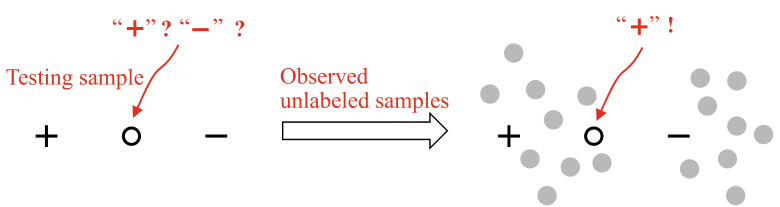
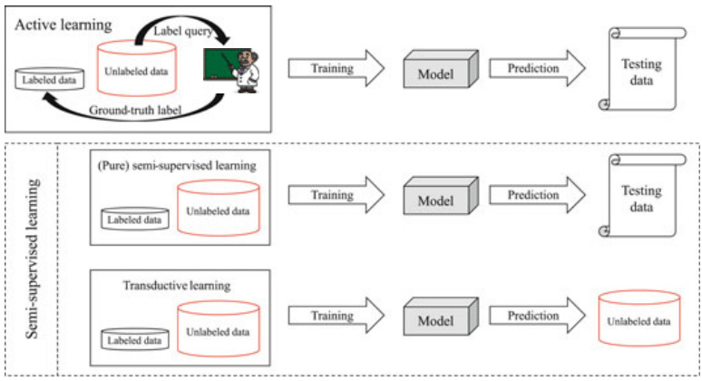
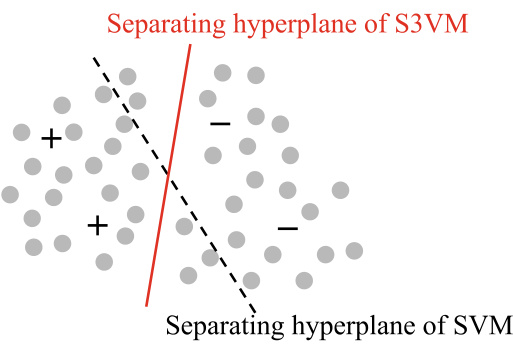
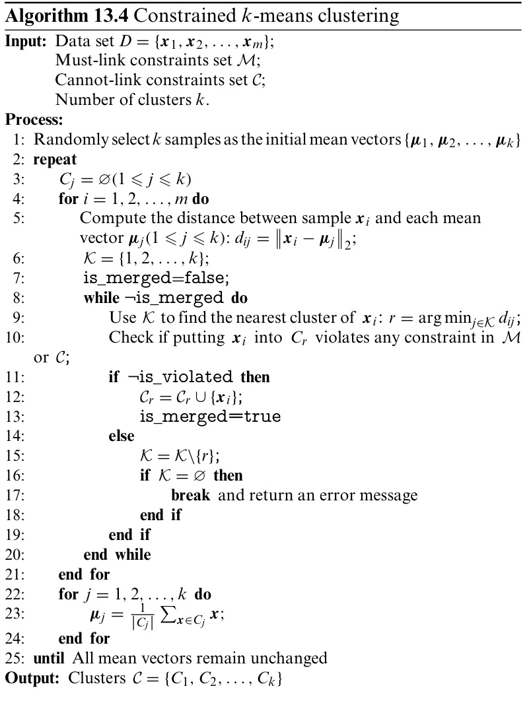
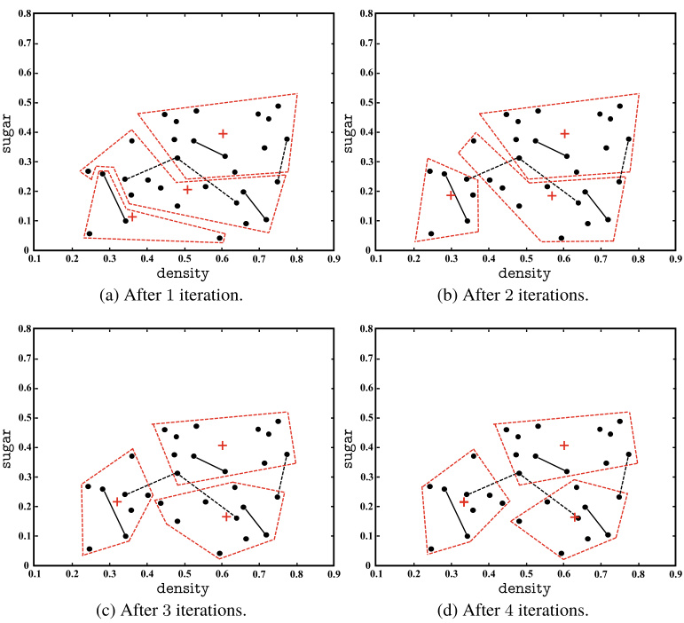
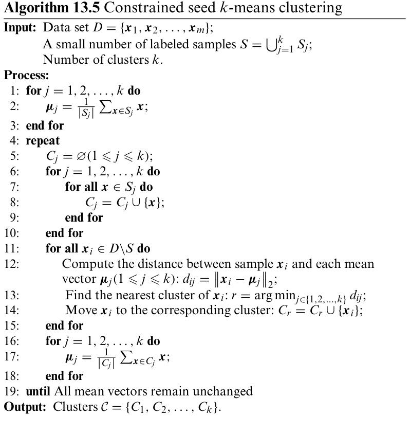

# Semi-Supervised Learning  

## 13.1  Unlabeled Samples  

We come to the watermelon field during the harvest season, and the ground is covered with many watermelons. The melon farmer brings a handful of melons and says that they are all ripe melons, and then points at a few melons in the ground and says that these are not ripe, and they would take a few more days to grow up. Based on this information, can we build a model to determine which melons in the field are ripe for picking? For sure, we can use the ripe and unripe watermelons told by the farmers as positive and negative samples to train a classifier. However, is it too few to use only a handful of melons as training samples? Can we use all the watermelons in the field as well?  

mally, we have a data set    $D_{l}=\{({\pmb x}_{1},y_{1})$  ,   $(x_{2},y_{2}),\ldots,

$   $(x_{l},y_{l})\}$  }  with l  labeledsamples, where the labels,  ripe  or unripe , des, we hav  another data set    $D_{u}\;=\;\{\pmb{x}_{l+1}$  ,

  $-x_{l+2},.\,.\,.\,,x_{l+u}\}$  − } containing u  unlabeled samples without labels, + + where  $l\ll u$   ≪ . If we use traditional supervised learning methods, then we can only use  $D_{l}$  and have to discard all information in  $D_{u}$  . In this case, the generalization ability of a learned model may not be satisfactory when    $D_{l}$   is small. So, can    $D_{u}$   be used in the process of building the model?  

A straightforward approach is to label all samples in    $D_{u}$  before learning, that is, we ask the farmers to check all water- melons in the field. Other than this labor-intensive approach, is there a ‘‘cheaper’’ way?  

For example, we can train an SVM model with  $D_{l}$  and select the unlabeled sample that is closest to the classification hyperplane for query.  

One alternative is that we can use    $D_{l}$   to train a model first, take this model to pick a watermelon in the field, ask the farmer whether it is ripe, then add this newly obtained labeled sample to  $D_{l}$   to retrain a model, and then pick a melon again  . . . . Since we only select the most useful watermelons to improve the per- formance of the model, the labeling cost is greatly reduced. This kind of learning paradigm is called  active learning , and its goal is to use as few  query  as possible to get the best performance, that is, to ask the farmer as few times as possible.  

Active learning introduces additional expert knowledge and interactions to transform some unlabeled samples into labeled samples, but can we use unlabeled samples to improve the generalization performance without interacting with experts? Though it sounds unrealistic, the answer is ‘‘yes’’!  

Although the unlabeled samples do not contain label infor- mation, they contain information about the data distribution,  

  
Fig. 13.1 An illustration of utilizing unlabeled samples. The gray dots on the right-hand side are unlabeled samples  

whichcanbenefit the modelingif the samplesare independently drawn from the same data distribution as the labeled samples. .  Figure 13.1  gives an intuitive illustration: when the testing sample lies between a positive sample and a negative sample, we can hardly tell which class it belongs to; however, if we can observe the unlabeled samples, we are confident that it belongs to the positive class.  

When a learner can automatically improve its performance by learning from unlabeled samples without external inter- actions, it is called  semi-supervised learning . Semi-supervised learning is highly demanded by real-world applications,sincein practice we can easily collect a large number of unlabeled sam- ples, but ‘‘labeling’’ them is costly. For example, in computer- aided medical image analysis, we can obtain a large number of medical images, whereas it is impractical to ask medical experts to mark all lesions. The phenomenon of ‘‘limited labeled data, abundant unlabeled data’’ is even more common on the Inter- net. For example, when building Web page recommendation models, it is generally required to request users to label Web pages that they are interested in. However, users are generally unwilling to spend time labeling Web pages, and therefore, only a few labeled Web pages are available. Nevertheless, there are countless Web pages on the Internet that can be used as unla- beled data. As we will see later, semi-supervised learning pro- vides a solution for utilizing the ‘‘cheap’’ unlabeled samples.  

To utilize unlabeled samples, we must make some assump- tions to connect the underlying data distribution disclosed by the unlabeled samples to the labels. A common choice is the clustering assumption , which assumes that the data contains clustering structures, and the samples within the same cluster belong to the same class.  .  Figure 13.1  shows an example of the use of the clustering assumption in exploiting unlabeled samples, where the samples to be predicted and the positive samples are brought together by the unlabeled samples, lead- ing to the conclusion that the testing sample is more likely to be classified as positive, compared with the far separated negative samples. Another commonly used assumption is the  manifold The concept of  manifold  is the basis of manifold learning. See Sect.  10.5 .  

As the clustering assumption considers the class labels, it is mostly for classification problems.  

assumption , which assumes that the samples are distributed on a manifold structure where neighboring samples have similar output values. On the one hand, the degree of ‘‘neighboring’’ is usually described by ‘‘similarity’’, and therefore the mani- fold assumption can be seen as an extension of the clustering assumption. It is worth noting that the manifold assumption has no limit on the output value, so it can be used for more types of learning tasks. In fact, no matter we use the clustering assumption or manifold assumption, it essentially assumes that ‘‘similar samples have similar outputs’’.  

Semi-supervised learning can be further categorized into pure semi-supervised learning  and  transductive learning , where the former assumes the unlabeled samples are not the test sam- ples, and the latter assumes the unlabeled samples are exactly the test samples on which the generalization performance is optimized. In other words, pure semi-supervised learning takes an  open-world assumption , that is, the model we wish to learn can be applied to any unobserved samples. By con- trast, transductive learning takes a  closed-world assumption , that is, the model only predicts the observed unlabeled samples. .  Figure 13.2  illustrates the difference between active learning, pure semi-supervised learning, and transductive learning. Pure semi-supervised learning and transductive learning are often jointly called semi-supervised learning, which is the term used in the rest of the book unless otherwise stated.  

  
Fig. 13.2 Active learning, (pure) semi-supervised learning, and transductive learning  

## 13.2  Generative Methods  

Generative methods , which are directly based on certain gen- erative models, assume that all samples, labeled or unlabeled, are ‘‘generated’’from the same underlying model. This assump- tion enables us to connect the unlabeled samples to the learning objective, where the labels of unlabeled samples are treated as missing parameters that can be estimated with maximum likeli- hood estimation using the EM algorithm. The main difference among generative methods lies in the underlying assumptions made by their generative models, that is, different assumptions of the underlying model lead to different generative methods.  

Gi  $\pmb{x}$  th its ground-truth class label  $y\in\mathcal{Y}_{:}$  , where  Y  $y=\{1,2,.\,.\,.\,,N\}$   = { }  is the set of all possible classes. We assume that the sample is generated by a Gaussian mixture model in which each Gaussian mixture component corresponds to a class. In other words, the sample is generated based on the following probability density function:  

$$
p(\pmb{x})=\sum_{i=1}^{N}\alpha_{i}\cdot p(\pmb{x}\mid\pmb{\mu}_{i},\pmb{\Sigma}_{i}),
$$  

$\alpha_{i}\geqslant0$   is the mixture co icien d    $\begin{array}{r}{\sum_{i=1}^{N}\alpha_{i}=1;p(\pmb{x}\mid}\end{array}$   = =  $\pmb{\mu}_{i},\pmb{\Sigma}_{i})$   is the probability of the sample  x  belonging to the  i th Gaussian mixture component;  $\pmb{\mu}_{i}$   and  $\pmb{\Sigma}_{i}$   are the parameters of the    $i$  th Gaussian mixture component.  

Let  $f(x)~\in~y$   denote the predicted label of    $\pmb{x}$  , and    $\Theta\ \in$   $\{1,2,\dotsc,N\}$   denote the Gaussian mixture components that  $\pmb{x}$  belongs to. Maximizing the posterior probability, we have  

See Sect.  7.6  for the EM algorithm.  

This assumption implies the one-to-one relationship between mixture components and classes.  

See Sect.  9.4  for Gaussian mixture models.  

$$
\begin{array}{r l}&{f(\pmb{x})=\underset{j\in y}{\arg\operatorname*{max}}\,p(y=j\mid\pmb{x})}\\ &{\quad=\underset{j\in y}{\arg\operatorname*{max}}\,\displaystyle\sum_{i=1}^{N}p(y=j,\Theta=i\mid\pmb{x})}\\ &{\quad=\underset{j\in y}{\arg\operatorname*{max}}\,\displaystyle\sum_{i=1}^{N}p(y=j\mid\Theta=i,\pmb{x})\cdot p(\Theta=i\mid\pmb{x}),}\end{array}
$$  

where  

$$
p(\Theta=i\mid\pmb{x})=\frac{\alpha_{i}\cdot p(\pmb{x}\mid\pmb{\mu_{i}},\pmb{\Sigma_{i}})}{\sum_{i=1}^{N}\alpha_{i}\cdot p(\pmb{x}\mid\pmb{\mu_{i}},\pmb{\Sigma_{i}})}
$$  

is the posterior probability that    $\pmb{x}$   being generated by the  i th Gaussian mixture component, where    $p(y\,=\,j\,\mid\,\Theta\,=\,i,\pmb{x})$   is the probability of    $\pmb{x}$   belonging to class  $j$   and is generated by the  i th Gaussian mixture component. Since we assume that each class corresponds to one Gaussian mixture component,  $p(y\,=\,j\;\mid\;\Theta\,=\,i,\pmb{x})$   only depends on the Gaussian mixture component    $\Theta$   that    $\pmb{x}$   belongs to, which means, we can simply rewriteitas  $p(y=j\mid\Theta=i)$  instead.Without loss of generality, we can assume that the  i th class corresponds to the  i th Gaussian mixture component, that is,  $p(y=j\mid\Theta=i)=1$   if and only if  $i=j$  , and  $p(y=j\mid\Theta=i)=0$   otherwise.  

We notice that estimating    $p(y\,=\,j\;\mid\;\Theta\,=\,i,\pmb{x})$   in ( 13.2 ) requires the label of    $\pmb{x}$  , and hence we can only use the labeled samples. However,  $p(\Theta=i\mid\pmb{x})$   does not involve the label, and hence it can be expected to have a more accurate estimation with the help of a large amount of unlabeled samples, that is, the estimation of ( 13.2 ) could be more accurate with unlabeled samples. This shows how the unlabeled samples can improve classification performance.  

Semi-supervised learning usually assumes that the number of unlabeled samples is much larger than that of labeled samples, though this assumption is not necessary.  

See Sect.  9.4  for the EM algorithm on Mixture-of-Gaussian clustering.  

Parameters could be initialized by the labeled samples.  

Givenalabeleddataset  $D_{l}=\{(\pmb{x}_{1},y_{1}),(\pmb{x}_{2},y_{2}),.\dots,(\pmb{x}_{l},y_{l})\}$  n unl ta set  $D_{u}=\{\pmb{x}_{l+1},\pmb{x}_{l+2},.\,.\,.\,,\pmb{x}_{l+u}\}$   = { here + + +  $l\ll u$   ≪  and  l  $l+u=m$   +  = . Assuming that all samples are  $i.i.d$  .  and are generated by the same Gaussian mixture model. Then, we use maximum likelihood estimation to estimate the parameters  $\{(\alpha_{i},\mu_{i},\Sigma_{i})\mid1\leqslant i\leqslant N\}$   of the Gaussian mixture model, and the log-likelihood of    $D_{l}\cup D_{u}$   is formed as  

$$
\begin{array}{l}{{L L(D_{l}\cup D_{u})=\displaystyle\sum_{(\pmb{x}_{j},\pmb{y}_{j})\in D_{l}}\ln\left(\displaystyle\sum_{i=1}^{N}\alpha_{i}\cdot p(\pmb{x}_{j}\mid\pmb{\mu}_{i},\pmb{\Sigma}_{i})\cdot p(y_{i}\mid\Theta=i,\pmb{x}_{j})\right)}}\\ {{\displaystyle\qquad+\displaystyle\sum_{\pmb{x}_{j}\in D_{u}}\ln\left(\displaystyle\sum_{i=1}^{N}\alpha_{i}\cdot p(\pmb{x}_{j}\mid\pmb{\mu}_{i},\pmb{\Sigma}_{i})\right).\qquad\qquad(13.4)}}\end{array}
$$  

There are two terms in ( 13.4 ): a supervised term based on labeled data set    $D_{l}$   and an unsupervised term based on unla- beled data set  $D_{u}$  . The parameter estimation of Gaussian mix- ture model can be done using the EM algorithm with the fol- lowing iterative update rules:  

• E-step: compute the probabilities of an unlabeled sample  $\pmb{x}_{j}$  belonging to each Gaussian mixture component based on the current model parameters:  

$$
\gamma_{j i}=\frac{\alpha_{i}\cdot p(\pmb{x}_{j}\mid\pmb{\mu}_{i},\pmb{\Sigma}_{i})}{\sum_{i=1}^{N}\alpha_{i}\cdot p(\pmb{x}_{j}\mid\pmb{\mu}_{i},\pmb{\Sigma}_{i})};
$$  

• M-step: update the model parameters based on    $\gamma_{j i}$  , where    $l_{i}$  is the number of labeled samples belonging to the    $i$  th class:  

$$
\pmb{\mu}_{i}=\frac{1}{\sum_{\pmb{x}_{j}\in D_{u}}\gamma_{j i}+l_{i}}\left(\sum_{\pmb{x}_{j}\in D_{u}}\gamma_{j i}\pmb{x}_{j}+\sum_{(\pmb{x}_{j},y_{j})\in D_{l}\setminus y_{j}=i}\pmb{x}_{j}\right),
$$  

$$
\begin{array}{l}{\displaystyle\Sigma_{i}=\frac{1}{\sum_{\boldsymbol{x}_{j}\in D_{u}}\gamma_{j i}+l_{i}}\bigg(\sum_{\boldsymbol{x}_{j}\in D_{u}}\gamma_{j i}(\boldsymbol{x}_{j}-\boldsymbol{\mu}_{i})(\boldsymbol{x}_{j}-\boldsymbol{\mu}_{i})^{\top}}\\ {\displaystyle\quad+\sum_{(\boldsymbol{x}_{j},\boldsymbol{y}_{j})\in D_{l}\setminus\boldsymbol{y}_{j}=i}(\boldsymbol{x}_{j}-\boldsymbol{\mu}_{i})(\boldsymbol{x}_{j}-\boldsymbol{\mu}_{i})^{\top}\bigg),}\\ {\displaystyle\alpha_{i}=\frac{1}{m}\left(\sum_{\boldsymbol{x}_{j}\in D_{u}}\gamma_{j i}+l_{i}\right).}\end{array}
$$  

By repeating the above process until convergence, we obtain the model parameters for classifying new samples using ( 13.3 ) and ( 13.2 ).  

Other variants of generative methods can be derived by replacing the Gaussian mixture model by other models in the above process, such as mixture of experts models (Miller and Uyar  1997 ) and naïve Bayes models (Nigam et al.  2000 ). Gen- erative methods are simple and easy to implement and can outperform other semi-supervised learning methods when the labeled samples are extremely limited. However, such meth- ods heavily rely on accurate model assumptions, that is, the assumed generative model must match the ground-truth data distribution; otherwise, incorporating the unlabeled samples can even reduce the generalization performance (Cozman and Cohen  2002 ). Unfortunately, it is often difficult to make an accurate model assumption without sufficiently reliable domain knowledge.  

## 13.3  Semi-Supervised SVM  

Semi-Supervised Support VectorMachine (S3VM) isthe exten- sion of SVM for semi-supervised learning. Compared to the standard SVM, which aims to find the separating hyperplane with the maximum margin, S3VM aims to find a separating hyperplane that not only separates the labeled samples but also lies in a low-density region of all samples. As illustrated in  .  Figure 13.3 , the assumption here is  low-density separation , which is an extension of the clustering assumption under linear separating hyperplanes.  

A well-known S3VM is Transductive Support Vector Machine(TSVM)(Joachims 1999 ),which is designed for binary classification problems. TSVM considers all possible label  

  
Fig. 13.3 S3VM and low-density separation (  $"+"$   and ‘‘ − ’’ are, respectively, the labeled positive samples and the labeled negative samples; gray dots are the unlabeled samples)  

assignments of unlabeled samples, that is, it temporarily treats each unlabeled sample as a positive or negative sample during optimization. By examining unlabeled samples with all possi- ble label assignments, TSVM aims to find a separating hyper- plane that maximizes the margin for both labeled samples and unlabeled samples with label assignment. Once the separating hyperplane is determined, the final label assignment for the unlabeled sample is its prediction.  

ven a labeled data set    $D_{l}\ =\ \{(x_{1},y_{1})$   $(\pmb{x}_{2}$  ,  $y_{2}),\ldots,(x_{l},y_{l})\}$  }  and an unlabeled d t  $D_{u}\ =\ \{{\pmb x}_{l+1}$  = { , +  ${\pmb x}_{l+2},\dots,{\pmb x}_{l+u}\}$  , where    $y_{i}\,\in\,\{-1,+1\}$  ,  l  $l\ll u$   ≪ , and    $l+u=m$  The learning objective of TSVM is to predict the labels  ˆ  $\hat{\textbf{y}}=$   =  $(\hat{y}_{l+1},\hat{y}_{l+2},\dots,\hat{y}_{l+u}),\hat{y}_{i}\in\{-1,+1\}$   ˆ  ˆ  ˆ  ∈{−  + } , for all samples in  $D_{u}$   such + + + that  

$$
\begin{array}{r l r}&{\displaystyle\operatorname*{min}_{\mathbf{w},b,\hat{\mathbf{y}},\boldsymbol{\xi}}~\frac{1}{2}\left\|\mathbf{w}\right\|_{2}^{2}+C_{l}\displaystyle\sum_{i=1}^{l}\xi_{i}+C_{u}\sum_{i=l+1}^{m}\xi_{i}}&\\ &{\quad\mathrm{s.t.}~y_{i}(\mathbf{w}^{\top}\pmb{x}_{i}+b)\geqslant1-\xi_{i},~i=1,2,\ldots,l,}&\\ &{\quad\quad\hat{y}_{i}(\mathbf{w}^{\top}\pmb{x}_{i}+b)\geqslant1-\xi_{i},~i=l+1,l+2,\ldots,m,}&\\ &{\quad\quad\xi_{i}\geqslant0,~i=1,2,\ldots,m,}&{(1}\end{array}
$$  

where    $(\mathbf{w},b)$   determines the separating hyperplane;    $\pmb{\xi}$   is the slack vector, where  $\xi_{i}$   $\cdot\left(i=1,2,\ldots,l\right)$   corresponds to the loss of each labeled sample, and  $\xi_{i}$     $(i=l+1,l+2,.\,.\,.\,,m)$   cor- responds to the loss of each unlabeled sample;    $C_{l}$   and    $C_{u}$   are user-specified trade-off parameters to balance the importance of model complexity, labeled samples, and unlabeled samples.  

Trying out all possible label assignments of unlabeled sam- ples is an exhaustive process that is only feasible for a small number of unlabeled samples. In practice, more efficient opti- mization strategies are usually needed.  

TSVM takes an iterative local search strategy to find an approximate solution of ( 13.9 ). To be specific, it first learns an SVM from the labeled samples by ignoring any terms or constraints in ( 13.9 ) that involving    $C_{u}$   or  $\hat{\pmb{y}}$  . Then, the learned SVM produces the label assignment by predicting all unlabeled samples, where the predictions are called  pseudo-labels . Substi- tuting the obtained  $\hat{\pmb{y}}$   into ( 13.9 ) gives a standard SVM learning problem, from which we obtain an updated separating hyper- plane and an updated slack vector. Since the pseudo-labels may not be accurate yet, we set    $C_{u}$   to a value smaller than    $C_{l}$   such that the labeled samples have larger weights than the unlabeled samples. After that, TSVM finds two unlabeled samples that have different label assignments and are likely to be incorrectly labeled. Then, by swapping the labels of these two samples, we can obtain the updated separating hyperplane and slack vec- tor from ( 13.9 ) and repeat this process. After each iteration, we increase the influence of unlabeled samples by increasing  $C_{u}$   gradually, and the iteration repeats until    $C_{u}\,=\,C_{l}$  . Once converged, the obtained SVM not only gives labels of unla- beled samples but can also predict unobserved samples. The pseudocode of TSVM is given in  $\circ$   Algorithm 13.1 .  

Algorithm 13.1  Transductive support vector machine Input:  Labeled data set    $D_{l}=\{(\pmb{x}_{1},y_{1})$   $(x_{2},y_{2}),\ldots,(x_{l},y_{l})\},$  ; Unlabeled data set  $D_{u}=\{x_{l+1},x_{l+2},.\,.\,.\,,x_{l+u}\}$   { } ; + + + Trade-off parameters  $C_{l}$   and  $C_{u}$  . Process: 1:  Train a   $\mathbf{SVM}_{l}$   using    $D_{l}$  ; 2:  Use  $\mathbf{SVM}_{l}$  to predict the samples in  $D_{u}$  to get ˆ =  $(\hat{y}_{l+1},\hat{y}_{l+2},.\,.\,.\,,\hat{y}_{l+u})$  ; + + + 3:  Initia  $C_{u}\ll C_{l}$  ; 4:  while  $C_{u}<C_{l}$   do 5: Solve ( 13.9 ) using  $D_{l},\,D_{u},\,\hat{y},\,C_{l},$   $C_{u}$   to get    $(\mathbf{w},b)$   and    $\pmb{\xi}$  ;  $\hat{\pmb{y}}$   is known at this point. 6: whi  $\exists\{i,j\mid(\hat{y}_{i}\hat{y}_{j}<0)\land(\xi_{i}>0)\land(\xi_{j}>0)\land(\xi_{i}+\xi_{j}>2)\}$   ˆ  ∧  ∧  ∧  + }  do 7:  $\hat{y}_{i}=-\hat{y}_{i}$  ˆ ; Adjust  $\hat{y}_{i}$   and  $\hat{y}_{j}$  . 8:  = −ˆ ; 9: Solve ( 13.9 ) again using    $D_{l},\,D_{u},\,\hat{y},\,C_{l},\,C_{u}$   $C_{u}$   to get    $(\mathbf{w},b)$   and  $\pmb{\xi}$  ; 10: end while 11:  $C_{u}=\operatorname*{min}\{2C_{u},\,C_{l}\}.$  . Increase the influence of 12:  end while unlabeled samples. Output:  Predictions of the unlabeled samples:    $\hat{\mathbf{y}}=(\hat{y}_{l+1},\hat{y}_{l+2},.\,.\,.\,,\hat{y}_{l+u})$  + + + .  

The learning process of TSVM may suffer from the class imbalance problem,in which the number of samples in one class is far more than the number of samples in the other class. To alleviate this problem, we can slightly adjust .  Algorithm 13.1 . Specifically, we split the term    $C_{u}$  in the opti- mization objective to    $C_{u}^{+}$    and    $C_{u}^{-}$  , which correspond to unla- See Sect.  3.6  for class imbalance problem and the motivation of ( 13.10 ).  

beled samples with positive and negative pseudo-labels, respec- tively. Then, TSVM is initialized with  

$$
C_{u}^{+}=\frac{u_{-}}{u_{+}}C_{u}^{-},
$$  

where    $u_{+}$   and    $u_{-}$  are the number of unlabeled samples with positive and negative pseudo-labels, respectively.  

In lines   $_{6-10}$  10 of    $^{\circ}$  Algorithm 13.1 , the label assignments  $\hat{y}_{i}$   and  $\hat{y}_{j}$   of two unlabeled samples  $\pmb{x}_{i}$   and  $\pmb{x}_{j}$  are likely to be incorrect if  $\hat{y}_{i}$   and  $\hat{y}_{j}$   are different and the corresponding slack riables satisfy    $\xi_{i}+\xi_{j}>2$  ; in such a case, the values of  $\hat{y}_{i}$   and  $\hat{y}_{j}$   need to be swapped, and ( 13.9 ) is optimized again such that the objective value of ( 13.9 ) decreases after each iteration.  

See Joachims ( 1999 ) for the proof of convergence  

The iterative updating process is an expensive large-scale optimization problem because the algorithm iterates over each pair of unlabeled samples that are likely to be incorrectly labeled. Hence, one research focus of S3VM is the design of efficient optimization strategies, such as LDS (Chapelle and Zien  2005 ), which uses gradient descent on graph kernel func- tions, and meanS3VM (Li et al.  2009 ), which uses label mean estimation.  

## 13.4  Graph-Based Semi-Supervised Learning  

Training data sets can often be encoded into a graph structure, in which each node corresponds to a sample, and an edge con- nects two nodes if their corresponding samples are highly simi- lar (or correlated). The  strength  of an edge indicates the degree of similarity (or correlation). Imagine that the nodes of labeled samples are colored, and the nodes of unlabeled samples are uncolored. Then, semi-supervised learning is like the process of spreading the ‘‘color’’ over the graph. Since a graph corre- sponds to a matrix, we can derive and analyze semi-supervised learning algorithms via matrix operations.  

Givenalabeleddataset  $D_{l}=\{(\pmb{x}_{1},y_{1}),(\pmb{x}_{2},y_{2}),.\dots,(\pmb{x}_{l},y_{l})\}$   unl  set  $D_{u}=\{\pmb{x}_{l+1},\pmb{x}_{l+2},.+.\,.\,,\pmb{x}_{l+u}\}$   = { } , w + + +  $l\ll u$   ≪  and  l  $l+u=m$   +  = . We start by constructing a graph  $G=$   =  $(V,E)$   from    $D_{l}\cup D_{u}$  , where    $V=\{\pmb{x}_{1},.\,.\,.\,,\pmb{x}_{l},\pmb{x}_{l+1},.\,.\,.\,,\pmb{x}_{l+u}\}$  is the node set and  E  is the edge set; the edge set  E  can be rep- resented as an  affinity matrix  which is often defined based on the Gaussian function:  

$$
(\mathbf{W})_{i j}={\left\{\begin{array}{l l}{\exp\left({\frac{-\left\|x_{i}-x_{j}\right\|_{2}^{2}}{2\sigma^{2}}}\right),}&{{\mathrm{if~}}i\neq j;}\\ {0,}&{{\mathrm{otherwise}},}\end{array}\right.}
$$  

where  $i,j\in\{1,2,.\,.\,.\,,m\}$  , and  $\sigma\,>\,0$   is a user-specified band- width parameter of Gaussian function.  

From graph    $G\,=\,(V,E)$  , we aim to lea functi  $f:V\to\mathbb{R}$  with a classification rule  $y_{i}=\mathrm{sign}(f(\pmb{x}_{i}))$   = , where  $y_{i}\in\{-1,+1\}$   ∈{−  + } . Intuitively, similar samples share similar labels, and hence we can define an  energy function  (Zhu et al. 2003 ) with respect to  $f$  :  

$$
{\begin{array}{r l}&{E(f)={\frac{1}{2}}\displaystyle\sum_{i=1}^{m}\sum_{j=1}^{m}(\mathbf{W})_{i j}(f(\mathbf{x}_{i})-f(\mathbf{x}_{j}))^{2}}\\ &{\quad={\frac{1}{2}}\left(\displaystyle\sum_{i=1}^{m}d_{i}f^{2}(\mathbf{x}_{i})+\displaystyle\sum_{j=1}^{m}d_{j}f^{2}(\mathbf{x}_{j})-2\displaystyle\sum_{i=1}^{m}\sum_{j=1}^{m}(\mathbf{W})_{i j}f(\mathbf{x}_{i})f(\mathbf{x}_{j})\right)}\\ &{\quad=\displaystyle\sum_{i=1}^{m}d_{i}f^{2}(\mathbf{x}_{i})-\displaystyle\sum_{i=1}^{m}\sum_{j=1}^{m}(\mathbf{W})_{i j}f(\mathbf{x}_{i})f(\mathbf{x}_{j})}\\ &{\quad=f^{\top}(\mathbf{D}-\mathbf{W})f,\eqno(13.}\end{array}}
$$  

Minimizing the energy function gives the optimal result.  

$\pmb{f}=(\pmb{f}_{l};\pmb{f}_{u})$   $f_{l}=(f(\pmb{x}_{1});f(\pmb{x}_{2});...;f(\pmb{x}_{l}))$   and  $f_{u}\;=\;(f(\pmb{x}_{l+1});f(\pmb{x}_{l+2});\ldots;f(\pmb{x}_{l+u}))$   = + ; + ;  ; +  are the predictions of function  $f$   on the labeled and unlabeled samples, respectively;  $\mathbf{D}=\mathrm{diag}(d_{1},d_{2},\ldots,d_{l+u})$   is a diagonal matrix in which the diagonal elem t    $\begin{array}{r}{d_{i}=\sum_{j=1}^{l+u}(\mathbf{W})_{i j}}\end{array}$   is the sum of the  i th row of matrix  W .  

$y_{i}\;(i=1,2,.\,.\,.\,,l)$   for lab s and satisfy    $\pmb{\Delta}f=\mathbf{0}$   for unlabeled samples,where  $\pmb{\Delta}=\mathbf{D-W}$   = −  isa Laplacianmatrix .For W  and  D , we partition the matrix by the  l th row and the  l th col- umn and group the elements into four blocks:  $\mathbf{W}=\left[\!\!{\mathbf{W}}_{l l}\ \mathbf{W}_{l u}\right]$  and    $\mathbf{D}=\left[\!\!\begin{array}{c c}{\mathbf{D}_{l l}\!\!}&{\mathbf{0}_{l u}}\\ {\mathbf{0}_{u l}\!\!}&{\mathbf{D}_{u u}}\end{array}\!\!\right].$  . Then, ( 13.12 ) can be rewritten as  $\begin{array}{r l r}{\lefteqn{E(f)=(\pmb{f}_{l}^{\top}\pmb{f}_{u}^{\top})\left(\left[\!\!\begin{array}{l l}{\mathbf{D}_{l l}}&{\mathbf{0}_{l u}}\\ {\mathbf{0}_{u l}}&{\mathbf{D}_{u u}}\end{array}\!\!\right]-\left[\!\!\begin{array}{l l}{\mathbf{W}_{l l}}&{\mathbf{W}_{l u}}\\ {\mathbf{W}_{u l}}&{\mathbf{W}_{u u}}\end{array}\!\!\right]\right)\left[\pmb{f}_{l}\right]}}\\ &{}&{(13.13)}\\ &{}&{=\pmb{f}_{l}^{\top}(\mathbf{D}_{l l}-\mathbf{W}_{l l})\pmb{f}_{l}-2\pmb{f}_{u}^{\top}\mathbf{W}_{u l}\pmb{f}_{l}+\pmb{f}_{u}^{\top}(\mathbf{D}_{u u}-\mathbf{W}_{u u})\pmb{f}_{u}.}\end{array}$  

By setting    $\begin{array}{r}{\frac{\partial E(f)}{\partial f_{u}}=\mathbf{0}}\end{array}$  , we have  

$$
f_{u}=(\mathbf{D}_{u u}-\mathbf{W}_{u u})^{-1}\mathbf{W}_{u l}f_{l}.
$$  

Let  

$$
\begin{array}{r l}&{\mathbf{P}=\mathbf{D}^{-1}\mathbf{W}=\left[\begin{array}{l l}{\mathbf{D}_{l l}^{-1}}&{\mathbf{0}_{l u}}\\ {\mathbf{0}_{u l}}&{\mathbf{D}_{u u}^{-1}}\end{array}\right]\left[\mathbf{W}_{l l}\ \mathbf{W}_{l u}\right]}\\ &{\quad=\left[\mathbf{D}_{l l}^{-1}\mathbf{W}_{l l}\ \mathbf{D}_{l l}^{-1}\mathbf{W}_{l u}\right],}\\ &{\quad=\left[\mathbf{D}_{u u}^{-1}\mathbf{W}_{u l}\ \mathbf{D}_{u u}^{-1}\mathbf{W}_{u u}\right],}\end{array}
$$  

we have    $\mathbf{P}_{u u}=\mathbf{D}_{u u}^{-1}\mathbf{W}_{u u}$   and    ${\bf P}_{u l}={\bf D}_{u u}^{-1}{\bf W}_{u l}.$  . Then, ( 13.15 ) can be rewritten as  

$$
\begin{array}{r l}&{\pmb{f}_{u}=(\mathbf{D}_{u u}(\mathbf{I}-\mathbf{D}_{u u}^{-1}\mathbf{W}_{u u}))^{-1}\mathbf{W}_{u l}\pmb{f}_{l}}\\ &{\quad\quad=(\mathbf{I}-\mathbf{D}_{u u}^{-1}\mathbf{W}_{u u})^{-1}\mathbf{D}_{u u}^{-1}\mathbf{W}_{u l}\pmb{f}_{l}}\\ &{\quad\quad=(\mathbf{I}-\mathbf{P}_{u u})^{-1}\mathbf{P}_{u l}\pmb{f}_{l}.}\end{array}
$$  

By using the label information of    $D_{l}$   as  $f_{l}=(y_{1};y_{2};.\,.\,;y_{l})$  and substituting it into ( 13.17 ), we have  $f_{u}$  , which is then used to predict the unlabeled samples.  

The above process is a  label propagation  method for binary classification. Next, we introduce another label propagation method (Zhou et al.  2004 ) that is applicable to multiclass clas- sification.  

ppose  $y_{i}~\in~y$  We sta    $G\,=$   $(V,E)$  from  $D_{l}\cup D_{u}$  ∪, where $V=\{\pmb{x}_{1},.\,.\,.\,,\pmb{x}_{l},.\,.\,.\,,\pmb{x}_{l+u}\}$  = {} is the+ node set and  E  is the edge set. The weight matrix  W  of the edge set    $E$   is the same as ( 13.11 ).    ${\bf D}\,=\,\mathrm{diag}(d_{1},d_{2},.\,.\,.\,,d_{l+u})$   is a diagonal matrix in wh  $\begin{array}{r}{d_{i}=\sum_{j=1}^{l+u}(\mathbf{W})_{i j}}\end{array}$  = is the sum of the  i th row of  W . We define a  (  $(l+u)\times^{.}|y|$   +  × | Y |  non- negative label matrix  $\mathbf{F}=(\mathbf{F}_{1}^{\top},\mathbf{F}_{2}^{\top},\dots,\mathbf{F}_{l+u}^{\top})^{\top}$  , where the  i th + w  $\mathbf{F}_{i}=((\mathbf{F})_{i1},\,(\mathbf{F})_{i2},\,.\,.\,,\,(\mathbf{F})_{i|y|})$   is the label vector of sample  $\pmb{x}_{i}$  , and  n ru  $y_{i}=\arg\operatorname*{max}_{1\leqslant j\leqslant|\mathcal{Y}|}(\mathbf{F})_{i j}$  .  

For  $i=1,2,\dots,m$   and  $j=1,2,\dots,|\mathcal{Y}|$  , we initialize    $\mathbf{F}$   as Y  

$$
\mathbf{F}(0)=(\mathbf{Y})_{i j}={\left\{\begin{array}{l l}{1,}&{{\mathrm{if~}}(1\leqslant i\leqslant l)\land(y_{i}=j);}\\ {0,}&{{\mathrm{otherwise}},}\end{array}\right.}
$$  

where the first    $l$   rows of    $\mathbf{Y}$   refer to the label vectors of the    $l$  labeled samples.  

We construct a label propagation matrix  $\mathbf{S}=\mathbf{D}^{-{\frac{1}{2}}}\mathbf{W}\mathbf{D}^{-{\frac{1}{2}}}$  based on    $\mathbf{W}$  , where  $\begin{array}{r}{\mathbf{D}^{-\frac{1}{2}}\;=\;\mathrm{diag}\left(\frac{1}{\sqrt{d_{1}}},\frac{1}{\sqrt{d_{2}}},\,\cdot\,\cdot\,,\,\frac{1}{\sqrt{d_{l+u}}}\right)}\end{array}$  	 . Then, we have the iterative formula  

$$
\mathbf{F}(t+1)=\alpha\mathbf{S}\mathbf{F}(t)+(1-\alpha)\mathbf{Y},
$$  

where    $\alpha\ \in\ (0,1)$   is a user-specified parameter for balancing the importance of the label propagation term    $\mathbf{SF}(t)$   and the initialization term    $\mathbf{Y}$  . Iterating ( 13.19 ) until convergence, we have  

$\mathbf{F}^{*}=\operatorname*{lim}_{t\to\infty}\mathbf{F}(t)=(1-\alpha)(\mathbf{I}-\alpha\mathbf{S})^{-1}\mathbf{Y},$  (13.20)  

which can be used to obtain the labels    $(\hat{y}_{l+1},\hat{y}_{l+2},.\,.\,.\,,\hat{y}_{l+u})$   of + + + unlabeled samples. The pseudocode of the algorithm is given in  $^{\circ}$   Algorithm 13.2 .  

$$
\begin{aligned}
&\text { Algorithm 13.2 Iterative label propagation }\\
&\text { Input: Labeled data set } D_l=\left\{\left(x_1, y_1\right),\left(x_2, y_2\right), \ldots,\left(x_l, y_l\right)\right\} \text {; }\\
&\text { Unlabeled data set } D_u=\left\{\boldsymbol{x}_{l+1}, \boldsymbol{x}_{l+2}, \ldots, \boldsymbol{x}_{l+u}\right\} \text {; }\\
&\text { Graph construction parameter } \sigma \text {; }\\
&\text { Trade-off parameter } \alpha \text {. }\\
&\text { Process: }\\
&\text { Use (13.11) and parameter } \sigma \text { to obtain } \mathbf{W} \text {; }\\
&\text { Use } \mathbf{W} \text { to construct the label propagation matrix } \mathbf{S}=\mathbf{D}^{-\frac{1}{2}} \mathbf{W D}^{-\frac{1}{2}} \text {; }\\
&\text { Initialize } \mathbf{F}(0) \text { according to (13.18); }\\
&t=0 \text {; }\\
&\text { repeat }\\
&\mathbf{F}(t+1)=\alpha \mathbf{S F}(t)+(1-\alpha) \mathbf{Y} ;\\
&t=t+1 \text {; }\\
&\text { until Converged to } \mathbf{F}^*\\
&\text { for } i=l+1, l+2, \ldots, l+u \text { do }\\
&\hat{y}_i=\arg \max _{1 \leqslant j \leqslant|\mathcal{Y}|}\left(\mathbf{F}^*\right)_{i j} .\\
&\text { end for }\\
&\text { Output: Predictions of the unlabeled samples: } \hat{\boldsymbol{y}}=\left(\hat{y}_{l+1}, \hat{y}_{l+2}, \ldots, \hat{y}_{l+u}\right) \text {. }
\end{aligned}
$$

Note that  $^{\circ}$   Algorithm 13.2  corresponds to the following regularization framework:  

$$
\operatorname*{min}_{\mathbf{F}}\;\;\frac{1}{2}\left(\sum_{i,j=1}^{l+u}(\mathbf{W})_{i j}\left\|\frac{1}{\sqrt{d_{i}}}\mathbf{F}_{i}-\frac{1}{\sqrt{d_{j}}}\mathbf{F}_{j}\right\|^{2}\right)\!+\!\mu\sum_{i=1}^{l}\|\mathbf{F}_{i}-\mathbf{Y}_{i}\|^{2}\,,
$$  

where  $\mu>0$   is the regularization parameter. Considering that the labeled samples are limited while there are many unla- beled samples, we can introduce the   $\mathrm{L}_{2}$   regularization term  $\begin{array}{r}{\mu\sum_{i=l+1}^{l+u}\|\mathbf{F}_{i}\|^{2}}\end{array}$  = +    of unla les to alleviate the over- fitting problem. When  μ  $\textstyle\mu~=~{\frac{1-\alpha}{\alpha}}$  , the optimal solution of ( 13.21 )equals to the converged solution  $\mathbf{F}^{*}$  of  .  Algorithm 13.2 .  

The second term of ( 13.21 ) forces the predicted labels of labeled samples to be similar to the ground-truth labels, and the first term forces nearby samples to have similar labels, that is, the basic semi-supervised learning assumption that we have exploited for ( 13.12 ). The only difference is that ( 13.21 ) works for discrete class labels, whereas ( 13.12 ) considers continuous output.  

The concepts in graph-basedsemi-supervised learning meth- ods are well-defined, and the algorithms’properties can be eas- ily analyzed from the matrix operations. However, such meth- ods also have some deficiencies. Firstly, the memory cost can be very high since the calculations involve matrics of size    $O(m^{2})$  for a sample size of    $O(m)$  , that is, it is difficult to apply such algorithms to large-scale problems. Secondly, the graphs are constructed from the training samples, making it challenging to identify the positions of new samples. Hence, with new samples arrived, we need to re-construct the graph and redo the label propagation, or introduce an extra prediction mechanism, such as joining    $D_{l}$   and    $D_{u}$   (labeled by label propagation) to train a classifier (e.g., SVM) for predicting new samples.  

## 13.5  Disagreement-Based Methods  

Disagreement is also called diversity.  

Unlike the previously introduced methods that utilize unla- beled samples via a single learner,  disagreement-based methods train multiple learners and the  disagreement  between learners is crucial for the exploitation of unlabeled data.  

Co-training  (Blum and Mitchell  1998 ) is a representative disagreement-based method. Since it was originally designed for  multi-view  data, it is also a representative method for  multi- view learning . Before introducing co-training, let us first take a look at the multi-view data.  

In many real-world applications, a data object can have multiple  attribute sets , where each attribute set provides a  view of the data object. For example, a movie can have different attribute sets such as the attribute set about the visual images, the attribute set about the audio, the attribute set about the sub- titles, and the attribute set about the online reviews. For ease of discussion, we consider only the visual and audio attribute sets. Then,  movie clip can be represented as a sample    $(\langle x^{1},x^{2}\rangle,y)$  where  $\pmb{x}^{i}$    is the feature vector of the sample in view  i . Let  $\pmb{x}^{1}$  denote the feature vector in the visual view, and  $\scriptstyle{\boldsymbol{x}}^{2}$    denote the feature vector in the audio view. Let  $y$   denote the label, indi- cating the  genre  of movies, such as  action  and  romance . Then, data in the form of    $(\langle x^{1},x^{2}\rangle,y)$   is called multi-view data.  

Suppose that different views are  compatible , that is, they share the same output space    $y.$   Let    $y^{1}$    denote the label space for visual information, and  $y^{2}$    denote the label space for   audio information. Then, we have  $y=y^{1}=y^{2}$  . For exam-   oth label spaces must be on ,  romance }  rather than  $\bar{y}^{\mathrm{{l}}}\,=\,\{\mathsf{a c t i o n}$  ,  romance }  and  Y  $y^{2}=$    = { literary ,  horror } . Under the above assumption, there are many benefits of explicitly considering multiple views. For example, it is hard to tell the genre  of a movie when we only see two people looking at each other visually. However, it is likely to be a  romance  movie if we also hear the phrase ‘‘ I love you ’’ from the audio. On the other hand, if both the visual and the audio information sug- gest  action , then putting them together, it is very likely to be an  action  movie. Under the assumption of  compatibility , the above example shows that the  complementarity  between differ- ent views is useful for constructing learners.  

Co-training can exploit the  compatibility  and  complemen- tarity  of multi-view data. Suppose that the data has two suffi- cient and conditionally independent views, where ‘‘sufficient’’ means that every view contains enough information to produce an optimal learner, and ‘‘conditionally independent’’ means that two views are independent given the class labels. Under this setting, there is a simple approach to utilize unlabeled samples. We first use the labeled samples to train a classifier on each view and then use each classifier to predict the pseudo- labels of the unlabeled samples that the classifier is most confi- dent with. After that, we supply the unlabeled samples with pseudo-labels to the other classifiers as labeled samples for retraining  . . . . Such a ‘‘learning from each other and progress- ing together’’process repeats until convergence, that is, no more changes in both classifiers or the predefined maximum num- ber of iterations is reached. The pseudocode of the algorithm is given in  .  Algorithm 13.3 . The computational cost would be very high if we consider the classification confidence of all unlabeled samples in each round.Therefore,BlumandMitchell ( 1998 ) created a pool of unlabeled samples that are drawn and replenished in each round. The estimation of classification con- fidence depends on the base learning algorithm  L . For example, it can be obtained from the posterior probability of naïve Bayes classifier or the margin in SVM.  

Though co-training looks simple, theoretical studies (Blum andMitchell 1998 )showed that the generalization performance of weak classifiers can be boosted to arbitrary high using unla- beled samples given that the views are sufficient and condi- tionally independent. In practice, however, since the views rarely hold conditional independence, the improvement in per- formance is often not that significant as in theory. Notably, the performance of weak learners can still be considerably improved even with weaker conditions (Zhou and Li  2010 ).  

Co-training was originally designed for multi-view data, but some variants have been developed for single-view data. In these variants, different learners are realized by different algorithms (Goldman and Zhou  2000 ), different data sam- pling (Zhou and Li  2005b ), or even different parameter set- tings(ZhouandLi 2005a ).Theperformancecanstillbeimproved in these variants by utilizing unlabeled samples. Later on, the- oretical studies revealed that multi-view data is unnecessary  

  

Hence, such methods are called disagreement-based methods .  

for such algorithms; instead, as long as the weak learners have a significant disagreement (or difference), exchanging pseudo- labels can improve generalization performance (Zhou and Li 2010 ). In other words, different views, different algorithms, dif- ferent data sampling, and different parameter settings are just possible ways for generating differences, not necessary condi- tions.  

By choosing the suitable base learners, disagreement-based methodsare less affected by model assumptions,non-convexity of loss function, and data scale problems. These simple and effective methods have a solid theoretical foundation and a broad scope of applications. To use them, we need to train multiple learners with significant differences and acceptable performance, but when there are very limited labeled samples, especially when the data does not have multiple views, it is not easy to do without ingenious design.  

## 13.6  Semi-Supervised Clustering  

Clustering is a typical unsupervised learning problem in which we do not rely on supervision information. In practice, how- ever, we often have access to some additional supervision infor- mation, which can be utilized to obtain better clustering results via  semi-supervised clustering .  

Typically, there are two kinds of supervision information in clustering tasks. The first kind is  must-link  and  cannot-link constraints, where must-link means the samples must belong to the same cluster, and cannot-link means the samples must not belong to the same cluster. The second kind of supervision information refers to a small number of labeled samples.  

Constrained  $k$  -means (Wagstaff et al.  2001 ) is a representa- tive semi-supervised clustering algorithm that utilizes supervi- sion information in the form of must-link and cannot-link con- straints. Given a data set    $D=\{\pmb{x}_{1},\pmb{x}_{2},.\,.\,.\,,\pmb{x}_{m}\}$  , a must-link set

  $\mathcal{M}$  , and a cannot-link set    $\mathcal{C}$  , where    $(\pmb{x}_{i},\pmb{x}_{j})\in\mathcal{M}$   means  $\pmb{x}_{i}$   and

  $\pmb{x}_{j}$   must be in the same cluster and    $(\pmb{x}_{i},\pmb{x}_{j})\in\mathcal{C}$  means  $\pmb{x}_{i}$  and  $\pmb{x}_{j}$  must not be in the same cluster. Constrained  k -means, which is an extension of  $k$  -means, ensures that the constraints in    $\mathcal{M}$   and  $\mathcal{C}$   are satisfied during the clustering process; otherwise it will return an error when the constraints are violated. The pseu- docode of constrained  $k$  -means is given in    $^{\circ}$   Algorithm 13.4 . Taking the watermelon data set 4 . 0 as an example, suppose that must-link constraints exist for the sample pairs  ${\pmb x}_{4}$   and  $x_{25},x_{12}$  and  $x_{20},x_{14}$   $\pmb{x}_{17}$  , and cannot-link constraints exist for the sample pairs    $\pmb{x}_{2}$   and  $x_{21},x_{13}$   and  $x_{23},x_{19}$   and    $\pmb{x}_{23}$  , that is,  

See Sect.  10.6 .  

See Sect.  9.4.1  for    $k$  -means.  

$$
\begin{array}{r l r}&{}&{\mathcal{M}=\{(\pmb{x}_{4},\pmb{x}_{25}),\,(\pmb{x}_{25},\pmb{x}_{4}),\,(\pmb{x}_{12},\pmb{x}_{20}),\,(\pmb{x}_{20},\pmb{x}_{12}),\,(\pmb{x}_{14},\pmb{x}_{17}),\,(\pmb{x}_{17},\pmb{x}_{14})\},}\\ &{}&{\mathcal{C}=\{(\pmb{x}_{2},\pmb{x}_{21}),\,(\pmb{x}_{21},\pmb{x}_{2}),\,(\pmb{x}_{13},\pmb{x}_{23}),\,(\pmb{x}_{23},\pmb{x}_{13}),\,(\pmb{x}_{19},\pmb{x}_{23}),\,(\pmb{x}_{23},\pmb{x}_{19})\}.}\end{array}
$$  

We set  $k=3$   as the number of clusters and randomly pick  $x_{6},x_{12}$  , and  $\pmb{x}_{27}$   as the initial mean vectors. Under this setting, .  Figure 13.4  shows the results of the constrained    $k$  -means clustering after different iterations. Since the mean vectors do not change after the 5th iteration (compared to the 4th itera- tion), we have the final clustering result  

Initialize  $k$   empty clusters.  

Update the mean vectors.  

  

$$
\begin{array}{r l}&{C_{1}=\{x_{3},x_{5},x_{7},x_{9},x_{13},x_{14},x_{16},x_{17},x_{21}\};}\\ &{C_{2}=\{x_{6},x_{8},x_{10},x_{11},x_{12},x_{15},x_{18},x_{19},x_{20}\};}\\ &{C_{3}=\{x_{1},x_{2},x_{4},x_{22},x_{23},x_{24},x_{25},x_{26},x_{27},x_{28},x_{29},x_{30}\}.}\end{array}
$$  

The labels here refer to  cluster labels  rather than  class labels .  

Supervision information also exists in the form of a small number of labeled samples. Given a data set  $D=\{\pmb{x}_{1},\pmb{x}_{2},.\,.\,.\,,$   $\scriptstyle{\boldsymbol{x}}_{m}\}$   a ll set of labeled samples    $\textstyle S\,=\,\bigcup_{j=1}^{k}S_{j}\,\subset\,D,$  , = where  $S_{j}\ \ne\ \emptyset$  is the set of samples in the  j th cluster. It is straightforward to use such supervision information: we can use the labeled samples as the  seeds  to initialize the  $k$   centroids of the    $k$  -means algorithm, and these seeds are retained in their  

  
Fig. 13.4 Results of the constrained  $k$  -means algorithm after different iter- ations on the watermelon data set 4 .    $k=3$  . The symbols ‘‘ • ’’ and  $"+"$  represent, respectively, the samples and the mean vectors. The must-link con- straints and the cannot-link constraints are, respectively, represented by the solid lines and the dashed lines. The red dashed lines show the clusters  

clusters during the learning process. Such a procedure gives the Constrained Seed  $k$  -means (Basu et al.  2002 ), as illustrated in .  Algorithm 13.5 .  

Taking the watermelon data set 4 . 0 as an example, suppose that the following samples are labeled and set as the seeds:  

$$
S_{1}=\{x_{4},x_{25}\},\;S_{2}=\{x_{12},x_{20}\},\;S_{3}=\{x_{14},x_{17}\},
$$  

.  Figure 13.5 showstheresultsoftheconstrainedseed  $k$  -means clustering after different iterations. As the mean vectors do not change after the 4th iteration (compared to the 3rd iteration), we have the final clustering result  

$$
\begin{array}{r l}&{C_{1}=\{\pmb{x}_{1},\pmb{x}_{2},\pmb{x}_{4},\pmb{x}_{22},\pmb{x}_{23},\pmb{x}_{24},\pmb{x}_{25},\pmb{x}_{26},\pmb{x}_{27},\pmb{x}_{28},\pmb{x}_{29},\pmb{x}_{30}\};}\\ &{C_{2}=\{\pmb{x}_{6},\pmb{x}_{7},\pmb{x}_{8},\pmb{x}_{10},\pmb{x}_{11},\pmb{x}_{12},\pmb{x}_{15},\pmb{x}_{18},\pmb{x}_{19},\pmb{x}_{20}\};}\\ &{C_{3}=\{\pmb{x}_{3},\pmb{x}_{5},\pmb{x}_{9},\pmb{x}_{13},\pmb{x}_{14},\pmb{x}_{16},\pmb{x}_{17},\pmb{x}_{21}\}.}\end{array}
$$  

$S\subset D,|S|\ll|D|.$  

Initialize the cluster centroids using labeled samples.  

Initialize the  $k$   clusters using labeled samples.  

Update the mean vectors.  

