# Probabilistic Graphical Models  

## 14.1  Hidden Markov Model  

A learner makes inference when it predicts the ripeness of watermelon based on information such as  texture , color , and  root . However, the inference is more than just prediction. For example, when we eat a ripe watermelon and try to infer the shape of its  root reversely, it is also inference.  

Bayesian networks are often used when explicit causal relationships exist between variables. Markov networks are often used when correlations exist between variables while explicit causal relationships are difficult to obtain.  

See Sect.  7.5  for static Bayesian network.  

The most important problem in machine learning is to estimate and infer the value of unknown variables(e.g.,classlabel)based on the observed evidence (e.g., training samples). Probabilis- tic models provide a framework that considers learning prob- lems as computing the probability distributions of variables. In probabilistic models, the process of inferring the distribu- tions of unknown variables conditioned on known variables is called  inference . More specifically, let    $Y$  denote the set of target variables,    $O$   denote the set of observable variables, and  $R$   denote the set of other variables. Then,  generative  models consider the joint distribution    $P(Y,R,O)$  , while  discrimina- tive  models consider the conditional distribution    $P(Y,R\mid O)$  . Given the values of a set of observed variables,inferenceaimsto ob ditional probability    $P(Y\mid O)$   from    $P(Y,R,O)$  or  $P(Y,R\mid O)$  .  

It is impractical to eliminate    $R$   by probability marginal- ization since the computational complexity is prohibitive. For example, it costs at least    $O(2^{\vert Y\vert+\vert R\vert})$   operations even if each variable has just two possible values. Besides, the learning pro- cess of probabilistic models, that is, estimating the parameters of variable distributions from the data set,is not easy since there are often complex relationships between variables. Hence, we must develop a methodology to concisely represent the rela- tionships between variables for the study of efficient learning and inference.  

Probabilistic Graphical Models (PGM) are a family of probabilistic models that represent the relationships between variables with graph structures, in which, each node (also known as vertex) represents one or a set of random variables and each link (also known as edge) between two nodes rep- resents the probabilistic relationship between the variables. Depending on the properties of edges, probabilistic graphical models can be roughly divided into two categories. The first category is called directed graphical models or Bayesian net- works,which employ Directed A cyclic Graphs(DAG)torepre- sent the dependence between variables. The second category is called undirected graphical models or Markov networks, which employ undirected graphs to represent the dependence between variables.  

The simplest  dynamic Bayesian network  is Hidden Markov Model (HMM), a well-known directed graphical model com- monly used for modeling time-series data and has been widely used in speech recognition and natural language processing.  

As illustrated in  $^{\circ}$   Figure 14.1 , there are two sets of vari- ables in an HMM. The first set of variables are state variables  $\{y_{1},y_{2},.\,.\,.\,,y_{n}\}$  , where    $y_{i}~\in~y$   represents the system state at  

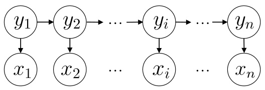  
Fig. 14.1 The graph structure of HMM  

the  i th time point. The state variables are usually assumed to be hidden and unobserved, hence they are also called  hidden variables . The second set of variables are observed variables  $\{x_{1},x_{2},.\,.\,.\,,x_{n}\}$  , where  $x_{i}\in\mathcal{X}$  represents the observation at the i th time point. In HMM, the system changes between different states    $\{s_{1},s_{2},.\ldots,s_{N}\}$  , and hence the state space  $y$   is usually a discrete space with    $N$   possible values. The observed variables  $x_{i}$  , however, can be either discrete or continuous. For ease of discussion, we assume that the observed variables are discrete, i.e.,  $\mathcal{X}=\{o_{1},o_{2},.\,.\,.\,,o_{M}\}$  .  

The directed links in    $^{\circ}$   Figure 14.1  represent the depen- dence between variables. For each time point, the value of an observed variable only depends on the state variable, that is,  $x_{t}$   is solely determined by  $y_{t}$  . Meanwhile, the state  $y_{t}$   at time point  $t$   only depends on the state    $y_{t-1}$   at time point    $t-1$   and is independent of the previous    $t-2$   states. Such a model is known as  Markov chain , in which the system state at the next time point does not depend on any previous states but the cur- rent state. Under this dependence setting, the joint probability of all variables is  

$$
P(x_{1},y_{1},\dots,x_{n},y_{n})=P(y_{1})P(x_{1}\mid y_{1})\prod_{i=2}^{n}P(y_{i}\mid y_{i-1})P(x_{i}\mid y_{i}).
$$  

In addition to the structure information, an HMM has three more sets of parameters  

5  State transition probabilities:the probabilities that the model changes between states, usually denoted by matrix    $\textbf{A}=$   $[a_{i j}]_{N\times N}$  , where  

$$
a_{i j}=P(y_{t+1}=s_{j}\mid y_{t}=s_{i}),\quad1\leqslant i,j\leqslant N
$$  

indicates the probability that the next state is    $s_{j}$   when the current state is  $s_{i}$   at time point    $t$  .  

5  Output observation probabilities:the probabilities of ob ser- vations based on the current state, usually denoted by matrix  $\mathbf{B}=[b_{i j}]_{N\times M}$  , where  

$$
b_{i j}=P(x_{t}=o_{j}\mid y_{t}=s_{i}),\quad1\leqslant i\leqslant N,1\leqslant j\leqslant M
$$  

indicates the probability of observing    $o_{j}$   when the current state is    $s_{i}$   at time point    $t$  .  

5  Initial state probabilities: the probability of each state that appears at the initial time point, usually denoted by    $\pi=$   $(\pi_{1},\pi_{2},.\,.\,.\,,\pi_{N})$  , where  

$$
\pi_{i}=P(y_{1}=s_{i}),\quad1\leqslant i\leqslant N
$$  

indicates the probability that the initial state is    $s_{i}$  .  

The above three sets of parameters together with the state space  $y$   and the observation space    $\mathcal{X}$  determine an HMM, usu- ally denoted by    $\boldsymbol{\lambda}=[\mathbf{A},\mathbf{B},\pi]$  . Given an HMM    $\lambda$  , it generates the observed sequence    $\{x_{1},x_{2},.\,.\,.\,,x_{n}\}$   by the following pro- cess:  

(1) Set    $t=1$   and select the initial state  $y_{1}$   based on the initial state probability  $\pi$  ;

 (2) Select the value of the observed variable    $x_{t}$   based on the state variable    $y_{t}$   and the output observation probability matrix    $\mathbf{B}$  ;

 (3) Transition to the next state    $y_{t+1}$   based on the current state  $y_{t}$   and the state transition probability matrix    $\mathbf{A}$  ;

 (4) If    $t<n$  , set    $t=t+1$   and return to step (2); otherwise, stop.  

$y_{t}\in\{s_{1},s_{2},.\,.\,.\,,s_{N}\}$   and    $x_{t}\in\{o_{1},o_{2},.\,.\,.\,,o_{M}\}$   are the state and observation at time point  t , respectively.  

There are three fundamental problems when applying HMM in practice:  

5  Given a model    $\boldsymbol{\lambda}=[\mathbf{A},\mathbf{B},\pi]$  , how can we effectively cal- culate the probability    $P(\mathbf{x}\mid\lambda)$   for generating the observed sequence  $\mathbf{x}=\{x_{1},x_{2},.\,.\,.\,,x_{n}\}?$   In other words, how to eval- uate the matching degree between a model and an observed sequence? 5  Given a model  $\boldsymbol{\lambda}=[\mathbf{A},\mathbf{B},\pi]$   and an observed sequence  $\mathbf{X}=$   $\{x_{1},x_{2},.\,.\,.\,,x_{n}\}$  , how can we find the best state sequence  $\mathbf{y}=\{y_{1},y_{2},.\,.\,.\,,y_{n}\}$   that matches  $\mathbf{x}?$   In other words, how to infer the hidden states from the observed sequence? 5  Given an observed sequence  $\mathbf{x}=\{x_{1},x_{2},.\,.\,.\,,x_{n}\}$  , how can we adjust the model parameter    $\lambda\:=\:[{\bf A},\,{\bf B},\,\pi]$   such that the probability    $P(\mathbf{x}\mid\lambda)$   of observing the given sequence is maximized? In other words, how to train the model such that it can better describe the observed data?  

The above problems are critical in real-world applications. For example, in many tasks, we need to estimate the most likely value of the current observation    $x_{n}$   based on the pre- viously observed sequence  $\{x_{1},x_{2},\dots,x_{n-1}\}$  ; this problem can be solved by finding    $P(\mathbf{x}\mid\lambda)$  , that is, the first listed problem. In speech recognition problems, the observations are audio signals, the hidden states are spoken texts, and the task is to infer the most likely state sequence (i.e., spoken texts) based on the observed sequence (i.e., audio signals), that is, the sec- ond listed problem. In many applications, manually specifying model parameters is becoming impractical, and hence model parameters need to be learned from data, that is, the third listed problem. Fortunately, thanks to the conditional independence given in ( 14.1 ), all of the three listed problems can be solved efficiently.  

## 14.2  Markov Random Field  

Markov Random Field (MRF) is a typical Markov network and a well-known undirected graphical model. In MRF, each node represents one or a set of variables, and the edges between nodes represent the variable dependence. Besides, there is a set of  potential functions , also known as  factors , which are non- negative real-valued functions defined over variable subsets mainly for defining probability distribution functions.  

A simple MRF is illustrated in  .  Figure 14.2 . A subset of nodes in the graph is called a  clique  if there exists a link between any two nodes. We say a clique is a  maximal clique  if adding any extra node makes it no longer a clique; in other words, a maxi- mal clique is a clique that is not contained in any other cliques. For example, the cliques in    $^{\circ}$   Figure 14.2  are    $\{x_{1},x_{2}\}$  ,    $\{x_{1},x_{3}\}$  ,  $\{x_{2},\,x_{4}\},\;\{x_{2},\,x_{5}\},\;\{x_{2},\,x_{6}\},\;\{x_{3},\,x_{5}\},\;\{x_{5},\,x_{6}\},$  , and    $\{x_{2},x_{5},x_{6}\}$  , which are also maximal cliques except    $\{x_{2},x_{5}\}$  ,    $\{x_{2},x_{6}\}$  , and  $\{x_{5},x_{6}\};\{x_{1},x_{2},x_{3}\}$   is not a clique since there is no link between  $x_{2}$   and  $x_{3}$  . We notice that every node appears in at least one maximal clique.  

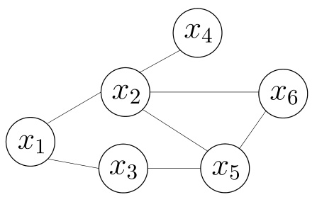  

Fig. 14.2 A simple MRF  

In MRF, the joint probability of multiple variables can be decomposed into the product of multiple factors based on the cliques, and each factor corresponds to one clique. To be spe- cific, let  $\mathbf{x}\,=\,\{x_{1},x_{2},.\,.\,.\,,x_{n}\}$   denote the set of    $n$   variables,    $\mathcal{C}$  denote the set of all cliques, and  $\mathbf{x}_{\mathcal{Q}}$   denote the set of variables in clique    $Q\in{\mathcal{C}}$  , then the joint probability    $P(\mathbf{x})$   is defined as  

$$
P(\mathbf{x})=\frac{1}{Z}\prod_{Q\in\mathcal{C}}\psi_{Q}(\mathbf{x}_{Q}),
$$  

where    $\psi_{Q}$   is the potential function that captures the depen- dence between variables in clique    $\begin{array}{r}{\mathcal{Q};\,Z\,=\,\sum_{\mathbf{x}}\prod_{Q\in\mathcal{C}}\psi_{Q}(\mathbf{x}_{Q})}\end{array}$   ∈ C is the normalization factor that ensures  $P(\mathbf{x})$   is a properly defined probability. In practice, it is often difficult to calcu- late    $Z$  exactly, but we usually do not need the exact value.  

When there are many variables,the number of cliques can be quite large. For example, every pair of linked variables forms a clique, and hence there will be many terms multiplied in ( 14.2 ), leading to high computational cost. We notice that, if clique    $\boldsymbol{Q}$  is not a maximal clique, then it is contained in a maximal clique

  $\boldsymbol{\mathcal{Q}}^{*}$  (i.e.,  $\mathbf{x}_{\mathcal{Q}}\subseteq\mathbf{x}_{\mathcal{Q}^{\ast}})$  . Hence, the dependence be en variables

  $\mathbf{x}_{Q}$  is not only encoded in the potential function  $\psi_{Q}$  , but also the potential function    $\psi_{Q^{*}}$  . Therefore, it is also possible to define the joint probability    $P(\mathbf{x})$   based on the maximal cliques. Let    $\mathcal{C}^{*}$  denote the set of all maximal cliques, we have  

$$
P(\mathbf{x})=\frac{1}{Z^{\ast}}\prod_{Q\in\mathcal{C}^{\ast}}\psi_{Q}(\mathbf{x}_{Q}),
$$  

where    $\begin{array}{r}{Z^{*}\;=\;\sum_{\mathbf{x}}\prod_{Q\in\mathcal{C}^{*}}\psi_{Q}(\mathbf{x}_{Q})}\end{array}$    is the normalization factor. ∈ C Taking  .  Figure 14.2  as an example, the joint probability    $P(\mathbf{x})$  can be defined as  

$$
P({\bf x})=\frac{1}{Z}\psi_{12}(x_{1},x_{2})\psi_{13}(x_{1},x_{3})\psi_{24}(x_{2},x_{4})\psi_{35}(x_{3},x_{5})\psi_{256}(x_{2},x_{5},x_{6}),
$$  

where the potential function    $\psi_{256}(x_{2},x_{5},x_{6})$   is defined over the maximal clique    $\{x_{2},x_{5},x_{6}\}$  . Since we have    $\psi_{256}(x_{2},x_{5},x_{6})$  , there is no need to construct the potential functions for the cliques    $\{x_{2},x_{5}\},\{x_{2},x_{6}\}$  , and    $\{x_{5},x_{6}\}$  .  

See Sect.  7.5.1 .  

How can we obtain  conditional independence  in MRF? We still utilize the concept of  separation . As illustrated in  $^{\circ}$   Figure 14.3 , the path connecting a node in the node set    $A$  to a node in node set  $B$   passes through the node set    $C$  , and we say    $C$   is a  separating set  that separates    $A$   and    $B$  . For MRF, we have the  global Markov property : two subsets of variables are conditionally independent given a separating set of these two subsets.  

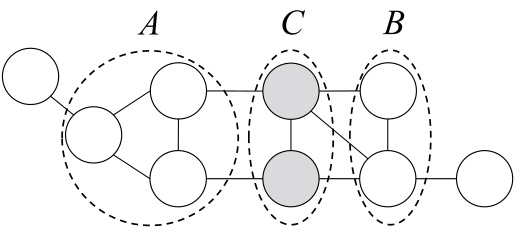  
Fig. 14.3 The node set    $C$   separates the node set  $A$   and the node set    $B$  

Taking    $\circ$   Figure 14.3  as an example, let    $\mathbf{X}_{A},\;\mathbf{X}_{B}$  , and    $\mathbf{x}_{C}$  denote the sets of variables for    $A,B,$  , and    $C$  , respectively. Then,  $\mathbf{X}_{A}$   and  $\mathbf{X}_{B}$   are conditionally independent given  $\mathbf{X}_{C}$  , denoted by  $\mathbf{x}_{A}\perp\mathbf{x}_{B}\mid\mathbf{x}_{C}$  .  

Now, let us do a simple verification. For ease of discussion, let  $A,B$     $C$   correspond to single variables    $x_{A}$  ,    $x_{B}$  , and    $x_{C}$  , respectively.Then,  $\circ$   Figure 14.3 issimplifiedto  .  Figure 14.4 .  

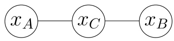  
Fig. 14.4 A simplified version of  $\circ$   Figure 14.3  

From ( 14.2 ), the joint probability of the variables in .  Figure 14.4  is given by  

$$
P(x_{A},x_{B},x_{C})=\frac{1}{Z}\psi_{A C}(x_{A},x_{C})\psi_{B C}(x_{B},x_{C}).
$$  

According to the definition of conditional probability, we have  

$$
{\begin{array}{r l}&{P(x_{A},x_{B}\mid x_{C})={\frac{P(x_{A},x_{B},x_{C})}{P(x_{C})}}={\frac{P(x_{A},x_{B},x_{C})}{\sum_{x_{A}^{\prime}}\sum_{x_{B}^{\prime}}P(x_{A}^{\prime},x_{B}^{\prime},x_{C})}}}\\ &{\qquad\qquad={\frac{{\frac{1}{Z}}\psi_{A C}(x_{A},x_{C})\psi_{B C}(x_{B},x_{C})}{\sum_{x_{A}^{\prime}}\sum_{x_{B}^{\prime}}{\frac{1}{Z}}\psi_{A C}(x_{A}^{\prime},x_{C})\psi_{B C}(x_{B}^{\prime},x_{C})}}}\\ &{\qquad\qquad={\frac{\psi_{A C}(x_{A},x_{C})}{\sum_{x_{A}^{\prime}}\psi_{A C}(x_{A}^{\prime},x_{C})}}\cdot{\frac{\psi_{B C}(x_{B},x_{C})}{\sum_{x_{B}^{\prime}}\psi_{B C}(x_{B}^{\prime},x_{C})}}.}\end{array}}
$$  

$$
\begin{array}{l}{P(x_{A}\mid x_{C})=\frac{P(x_{A},x_{C})}{P(x_{C})}=\frac{\sum_{x_{B}^{\prime}}P(x_{A},x_{B}^{\prime},x_{C})}{\sum_{x_{A}^{\prime}}\sum_{x_{B}^{\prime}}P(x_{A}^{\prime},x_{B}^{\prime},x_{C})}}\\ {\ \ \ \ \ \ \ \ \ \ \ \ \ =\frac{\sum_{x_{B}^{\prime}}\frac{1}{Z}\psi_{A C}(x_{A},x_{C})\psi_{B C}(x_{B}^{\prime},x_{C})}{\sum_{x_{A}^{\prime}}\sum_{x_{B}^{\prime}}\frac{1}{Z}\psi_{A C}(x_{A}^{\prime},x_{C})\psi_{B C}(x_{B}^{\prime},x_{C})}}\\ {\ \ \ \ \ \ \ \ \ \ \ \ =\frac{\psi_{A C}(x_{A},x_{C})}{\sum_{x_{A}^{\prime}}\psi_{A C}(x_{A}^{\prime},x_{C})}.}\end{array}
$$  

From ( 14.5 ) and ( 14.6 ), we have  

$$
P(x_{A},x_{B}\mid x_{C})=P(x_{A}\mid x_{C})P(x_{B}\mid x_{C}),
$$  

that is,    $x_{A}$   and    $x_{B}$   are conditionally independent given    $x_{C}$  .  

From the global Markov property, we can derive the fol- lowing two useful corollaries:  

The set of parents, children, and children’s parents is called the Markov blanket  of a variable.  

5  Local Markov property : a variable is conditionally indepen- dent of other variables given its adjacent variables. For- mally, we have    ${\bf x}_{\nu}\perp{\bf x}_{V\setminus n^{*}(\nu)}\bigm|{\bf x}_{n(\nu)}$  , where    $V$   is the set of all nodes in the graph,  n  $n(\nu)$   are the adjacent nodes of node  $\nu$   in the graph, and    $n^{*}(\nu)=n(\nu)\cup\{\nu\}$  . 5  Pairwise Markov property : two non-adjacent variables are conditionally independent given all other variables. For- ally, we have    $\mathbf{x}_{u}\perp\mathbf{x}_{\nu}\mid\mathbf{X}_{V\setminus\left\langle u,\nu\right\rangle}$   $\langle u,\nu\rangle\notin E$  ∈ , where    $u$  and  $\nu$   are two nodes in the graph, and  V  and  E  are, respectively, the set of all nodes and the set of all edges in the graph.  

Now, let us take a look at the potential functions in MRF. A potential function    $\psi_{Q}(\mathbf{x}_{Q})$   describes the dependence between a set of variables  $\mathbf{x}_{\mathcal{Q}}$  . It should be a non-negative function that returns a large value when the variables take preferred values. For example, suppose that all variables in    $\circ$  Figure 14.4  are binary variables, and the potential functions are  

$$
\begin{array}{r l}&{\phi_{A C}(x_{A},x_{C})=\left\{\begin{array}{l l}{1.5,}&{\mathrm{if~}x_{A}=x_{C};}\\ {0.1,}&{\mathrm{otherwise},}\end{array}\right.}\\ &{\phi_{B C}(x_{B},x_{C})=\left\{\begin{array}{l l}{0.2,}&{\mathrm{if~}x_{B}=x_{C};}\\ {1.3,}&{\mathrm{otherwise},}\end{array}\right.}\end{array}
$$  

then th odel  biased towards    $x_{A}~=~x_{C}$   and    $x_{B}\;\neq\;x_{C}$  that is,  x  $x_{A}$   and  x  $x_{C}$   are positively correlated, while  x  $x_{B}$   and  x  $x_{C}$  are negatively correlated. From ( 14.2 ), we know that the joint probability would be high when the variable assignments sat- isfy  $x_{A}=x_{C}$   and  $x_{B}\neq x_{C}$  .  

Tosatisfythenon-negativity,we often use exponential fun c- tions to define potential functions  

$$
\psi_{\mathscr{Q}}(\mathbf{x}_{\mathscr{Q}})=e^{-H_{\mathscr{Q}}(\mathbf{x}_{\mathscr{Q}})}.
$$  

$H_{\mathcal{Q}}(\mathbf{x}_{\mathcal{Q}})$   is real-valued function defined on variable  $\mathbf{x}_{Q}$  , usually in the form of  

$$
H_{\mathcal{Q}}(\mathbf{x}_{\mathcal{Q}})=\sum_{u,\nu\in\mathcal{Q},u\neq\nu}\alpha_{u\nu}x_{u}x_{\nu}+\sum_{\nu\in\mathcal{Q}}\beta_{\nu}x_{\nu},
$$  

where    $a_{u v}$   and  $\beta_{\nu}$   are parameters. In ( 14.9 ), the first term con- siders pairs of nodes and the second term considers individual nodes.  

## 14.3  Conditional Random Field  

Conditional Random Field (CRF) is a discriminative undi- rected graphical model. In Sect.  14.1 , we mentioned that gen- erative models consider joint distributions, while discrimina- tive models consider conditional distributions. The previously introduced HMM and MRF are examples of generative mod- els, and now we introduce CRF as an example of discriminative models.  

We can regard CRF as MRF with observed values, or as an extension of logistic regression. See Sect.  3.3 .  

CRF aims to model the conditional probability of mul- tiple variables given some observed values. To be specific, CRF c al probability model    $P(\mathbf{y}\mid\mathbf{x})$  , where  $\textbf{x}=~\{x_{1},x_{2},.\,.\,.\,,x_{n}\}$   = { }  is the observed sequence, and  $\mathbf{y}=\{y_{1},y_{2},.\,.\,.\,,y_{n}\}$   is the corresponding label sequence. Note that the label variable  $\mathbf{y}$   can be structural, that is, there are some correlations among its components. For example, in part- of-speech tagging problems, the observations are natural lan- guage sentences (i.e., sequences of words), and the labels are sequences of part-of-speech tags, as shown in  .  Figure 14.5 (a). In syntactic analysis, the output labels are parse trees, as shown in  .  Figure 14.5 (b).  

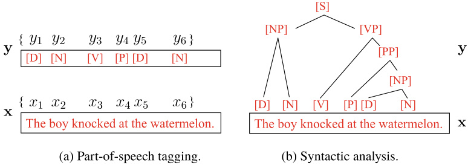  
Fig. 14.5 The part-of-speech tagging problem and the syntactic analysis problem in natural language processing  

Let    $G=\langle V,E\rangle$  be an undirected graph in which each node corresponds to one component in the label vector  $\mathbf{y}$  , where    $y_{\nu}$   is the component corresponding to node  $\nu$  , and let  $n(\nu)$   denote the adjacent nodes of node  $\nu$  . Then, we say    $(\mathbf{y},\mathbf{x})$   forms a CRF if every label variable  $y_{\nu}$  in graph    $G$   satisfies the Markov property  

$$
P(y_{\nu}\mid\mathbf{x},\mathbf{y}_{V\setminus\{\nu\}})=P(y_{\nu}\mid\mathbf{x},\mathbf{y}_{n(\nu)}),
$$  

Theoretically, the structure of graph    $G$   can be arbitrary as long as it encodes the conditional independence between label variables. In practice, however, especially when modeling label sequences, the most common structure is the chain structure,  

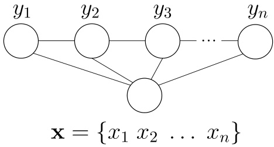  
Fig. 14.6 The graph structure of chain-structured CRF  

as illustrated in    $^{\circ}$   Figure 14.6 . Such a CRF is called  chain- structured   $C R F$  , which is the focus of the rest of our discussions.  

Similar to how joint probability is defined in MRF, CRF defines conditional probability  $P(\mathbf{y}\mid\mathbf{x})$   according to the poten- tial functions and cliques in the graph structure. Given an observed sequence  $\mathbf{X}$  ,thechain-structuredCRFin  .  Figure 14.6 mainly contains two types of cliques about label variables, that is, one for single label variable    $\{y_{i}\}$   and the other for adjacent label variables  $\{y_{i-1},y_{i}\}$  . With appropriate potential functions, we can define conditional probability like ( 14.2 ). In CRF, by using exponential potential functions and introducing  feature functions , the conditional probability is defined as  

$$
P(\mathbf{y}\mid\mathbf{x})=\frac{1}{Z}\exp\left(\sum_{j}\sum_{i=1}^{n-1}\lambda_{j}t_{j}(y_{i+1},y_{i},\mathbf{x},i)+\sum_{k}\sum_{i=1}^{n}\mu_{k}s_{k}(y_{i},\mathbf{x},i)\right),
$$  

where    $t_{j}(y_{i+1},y_{i},\mathbf{x},i)$   is the  transition feature function  defined on two adjacent labels in the observed sequence, describing the relationship between the two adjacent labels as well as measur- ing the impact of the observed sequence on them;    $s_{k}(y_{i},\mathbf{x},i)$  is the  status feature function  defined on the label index    $i$   in the observed sequence, describing the impact of the observed sequence on the label variable;    $\lambda_{j}$   and  $\mu_{k}$   are parameters;    $Z$   is the normalization factor that ensures ( 14.11 ) to be a properly defined probability.  

We also need to define appropriate feature functions, which are usually real-valued functions that describe empirical prop- erties that are likely or expected to be held about the data. Taking the part-of-speech tagging in  $^{\circ}$   Figure 14.5  (a) as an example, we can employ the following transition feature func- tion:  

$$
t_{j}(y_{i+1},y_{i},\mathbf x,i)=\left\{\!\!\begin{array}{l l}{1,\quad\mathrm{if}\ y_{i+1}=[P],\:y_{i}=[V]\mathrm{~and~}x_{i}={}^{\circ}k n o c k^{\circ};}\\ {0,\quad\mathrm{otherwise},}\end{array}\right.
$$  

which says the labels  $y_{i}$   and  $y_{i+1}$   are likely to be  $[V]$   and    $[P]$  when the  i th observation    $x_{i}$   is the word ‘‘knock’’. We can also employ the following status feature function:  

$$
s_{k}(y_{i},\mathbf{x},i)={\left\{\begin{array}{l l}{1,}&{{\mathrm{if~}}y_{i}=\left[V\right]{\mathrm{~and~}}x_{i}={}^{\ast}k n o c k^{\ast};}\\ {0,}&{{\mathrm{otherwise}},}\end{array}\right.}
$$  

which says that the label  $y_{i}$   is likely to be    $[V]$   if the observation  $x_{i}$   is the word ‘‘knock’’.  

By comparing ( 14.11 ) and ( 14.2 ), we can observe that both CRF and MRF define the probabilities using potential func- tions on cliques. The difference is that CRF models conditional probabilities, whereas MRF models joint probabilities.  

## 14.4  Learning and Inference  

Given the joint probability distributions defined on proba- bilistic graphical models, we can infer the  marginal distribu- tion  or  conditional distribution  of the target variables. We have encountered conditional distributions previously. For exam- ple, in HMM, we infer the conditional probability distribution of an observed sequence  x  given certain parameter    $\lambda$  . By con- trast, marginal distribution refers to probabilities obtained by summing out or integrating out irrelevant variables. Taking Markov networks as an example, the joint distribution of vari- ables is expressed as the product of maximal cliques’ potential functions, and therefore, finding the distribution of variable    $x$  given parameter    $\Theta$   is equivalent to integrating out irrelevant variables in the joint distribution, known as  marginalization .  

In probabilistic graphical models, we also need to deter- mine the parameters of distributions by parameter estimation(i.e., parameter learning), which is often solved via maximum likelihood estimation or maximum a posteriori estimation. If we consider the parameters as variables to be inferred, then the parameter estimation process is similar to the inference pro- cess, that is, it can be absorbed into the inference problem. Hence, we mainly discuss the inference methods for the rest of our discussions.  

To be specific, suppose that the set of variables    $\mathbf{x}=\{x_{1},x_{2}$  ,  $\cdot\cdot\,,x_{N}\}$   in a graphical model can be divided into two disjoint variable sets    $\mathbf{X}_{E}$   and    ${\bf X}_{F}$  , then the inference problem is about findingthe marginalprobability  $P({\bf x}_{F})$   orthe conditionalprob- ability    $P(\mathbf{x}_{F}\mid\mathbf{x}_{E})$  . From the definition of conditional proba- bility, we have  

$$
P(\mathbf{x}_{F}\mid\mathbf{x}_{E})={\frac{P(\mathbf{x}_{E},\mathbf{x}_{F})}{P(\mathbf{x}_{E})}}={\frac{P(\mathbf{x}_{E},\mathbf{x}_{F})}{\sum_{\mathbf{x}_{F}}P(\mathbf{x}_{E},\mathbf{x}_{F})}},
$$  

where the joint probability  $P(\mathbf{x}_{E},\mathbf{x}_{F})$   can be obtained from the probabilistic graphical model. Hence, the core of the inference problem is how to efficiently compute the marginal distribu- tion, that is  

$$
P(\mathbf{x}_{E})=\sum_{\mathbf{x}_{F}}P(\mathbf{x}_{E},\mathbf{x}_{F}).
$$  

There are two types of inference methods for probabilistic graphical models: exact inference methods and approximate inference methods. Exact inference methods compute the exact values of marginal distributions or conditional distributions. However, such methods are often impractical since their com- putational complexity increases exponentially to the number of maximal cliques. By contrast, approximate inference methods find approximate solutions with tractable time complexity and are more practical in real-world applications. The rest of this section introduces two representative exact inference methods, and we will introduce approximate inference methods in the next section.  

### 14.4.1  Variable Elimination  

Exact inference methods are essentially a kind of dynamic pro- gramming methods. Such methods attempt to reduce the cost of computing the target probability by exploiting the condi- tional independence encoded by the graphical model. Among them,  variable elimination  is the most intuitive one and is the basis of other exact inference methods.  

We demonstrate variable elimination with the directed graph- ical model in  .  Figure 14.7  (a).  

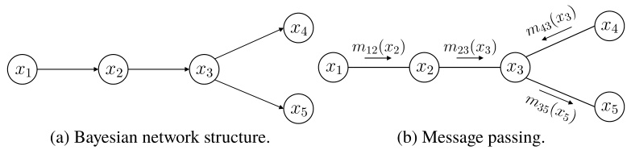  
Fig. 14.7 The process of variable elimination and message passing  

Suppose that the inference objective is to compute the marginal probability    $P(x_{5})$  . To compute it, we only need to eliminate the variables    $\{x_{1},\,x_{2},\,x_{3},\,x_{4}\}$   by summation, that is  

$$
{\begin{array}{r l}&{P(x_{5})=\displaystyle\sum_{x_{4}}\sum_{x_{3}}\sum_{x_{2}}\sum_{x_{1}}P(x_{1},x_{2},x_{3},x_{4},x_{5})}\\ &{\qquad\qquad=\displaystyle\sum_{x_{4}}\sum_{x_{3}}\sum_{x_{2}}\sum_{x_{1}}P(x_{1})P(x_{2}\mid x_{1})P(x_{3}\mid x_{2})P(x_{4}\mid x_{3})P(x_{5}\mid x_{3}).}\end{array}}
$$  

(14.14) directed graphical model.  

By doing the summations in the order of    $\{x_{1},x_{2},x_{4},x_{3}\}$  , we have  

$$
{\begin{array}{r}{P(x_{5})=\displaystyle\sum_{x_{3}}P(x_{5}\mid x_{3})\sum_{x_{4}}P(x_{4}\mid x_{3})\sum_{x_{2}}P(x_{3}\mid x_{2})\sum_{x_{1}}P(x_{1})P(x_{2}\mid x_{1})}\\ {=\displaystyle\sum_{x_{3}}P(x_{5}\mid x_{3})\sum_{x_{4}}P(x_{4}\mid x_{3})\sum_{x_{2}}P(x_{3}\mid x_{2})m_{12}(x_{2}),\quad(14.15)}\end{array}}
$$  

where  $m_{i j}(x_{j})$   is an intermediate result in the summation, the subscript  $i$   indicates that the term is the summation result with respect to  $x_{i}$  , and the subscript  $j$   indicates other variables in the term. We notice that    $m_{i j}(x_{j})$   is a function of    $x_{j}$  . By repeating the process, we have  

$$
{\begin{array}{r l}&{P(x_{5})=\displaystyle\sum_{x_{3}}P(x_{5}\mid x_{3})\sum_{x_{4}}P(x_{4}\mid x_{3})m_{23}(x_{3})}\\ &{\quad\quad=\displaystyle\sum_{x_{3}}P(x_{5}\mid x_{3})m_{23}(x_{3})\sum_{x_{4}}P(x_{4}\mid x_{3})}\\ &{\quad\quad=\displaystyle\sum_{x_{3}}P(x_{5}\mid x_{3})m_{23}(x_{3})m_{43}(x_{3})}\\ &{\quad\quad=m_{35}(x_{5}).}\end{array}}
$$  

$m_{35}(x_{5})$   is a function of    $x_{5}$   and only depends on the value of  $x_{5}$  .  

The above method also applies to undirected graphical models. For example, if we ignore the directions of the edges in  $\circ$   Figure 14.7  (a) and consider it as an undirected graphical model, then we have  

$$
P(x_{1},x_{2},x_{3},x_{4},x_{5})=\frac{1}{Z}\psi_{12}(x_{1},x_{2})\psi_{23}(x_{2},x_{3})\psi_{34}(x_{3},x_{4})\psi_{35}(x_{3},x_{5}),
$$  

where    $Z$   is the normalization factor. The marginal distribution  $P(x_{5})$   is given by  

$$
\begin{array}{l}{{P(x_{5})=\displaystyle\frac{1}{Z}\sum_{x_{3}}\psi_{35}(x_{3},x_{5})\sum_{x_{4}}\psi_{34}(x_{3},x_{4})\sum_{x_{2}}\psi_{23}(x_{2},x_{3})\sum_{x_{1}}\psi_{12}(x_{1},x_{2})}}\\ {{{}~~~~~~~~~~~~~~~~~~~~~~~~~=\displaystyle\frac{1}{Z}\sum_{x_{3}}\psi_{35}(x_{3},x_{5})\sum_{x_{4}}\psi_{34}(x_{3},x_{4})\sum_{x_{2}}\psi_{23}(x_{2},x_{3})m_{12}(x_{2})}}\\ {{{}~~~~~~~~~~~~~~~~~~~~~~~~~={{}}\cdots}}\\ {{{}~~~~~~~~~~~~~~~~~~~~~~~~~={\displaystyle\frac{1}{Z}m_{35}(x_{5})}.}\end{array}\quad(14)
$$  

By using the distributive law of multiplication to addition, variable elimination converts the problem of calculating sum- mations of products of multiple variables to the problem of alternately calculating summations and products of some of the variables. Doing so simplifies the calculations by restrict- ing the summations and products to local regions that involve only some of the variables.  

Nevertheless, variable elimination has a clear disadvan- tage: there is a considerable amount of redundancy in the calculations of multiple marginal distributions. Taking the Bayesian network in    $^{\circ}$   Figure 14.7  (a) as an example, if we compute  $P(x_{4})$   after computing    $P(x_{5})$  , then the calculations of  $m_{12}(x_{2})$   and  $m_{23}(x_{3})$   are repetitive when the summation order is    $\{x_{1},x_{2},x_{5},x_{3}\}$  .  

### 14.4.2  Belief Propagation  

Also known as the  sum-product algorithm.  

The  belief propagation  algorithm avoid repetitive calculations by considering the summation operations in variable elimina- tion as a process of message passing. In variable elimination, a variable    $x_{i}$   is eliminated by the summation operation  

$$
m_{i j}(x_{j})=\sum_{x_{i}}\psi(x_{i},y_{j})\prod_{k\in n(i)\backslash j}m_{k i}(x_{i}),
$$  

where    $n(i)$   are the adjacent nodes of    $x_{i}$  . In belief propagation, however, the operation is considered as passing the message  $m_{i j}(x_{j})$   from    $x_{i}$  to    $x_{j}$  . By doing so, the variable elimination pro- cess in ( 14.15 ) and ( 14.16 ) becomes a message passing process, as illustrated in  $\circ$   Figure 14.7  (b). We see that each message passing operation involves only    $x_{i}$   and its adjacent nodes, and hence the calculations are restricted to local regions.  

In belief propagation, a node starts to pass messages after receiving the messages from all other nodes. The marginal dis- tribution of a node is proportional to the product of all received messages, that is  

$$
P(x_{i})\propto\prod_{k\in n(i)}m_{k i}(x_{i}).
$$  

Taking  $^{\circ}$   Figure 14.7  (b) as an example,    $x_{3}$   must receive the messages from    $x_{2}$   and    $x_{4}$   before it passes the message to    $x_{5}$  , and the message  $m_{35}(x_{5})$   that    $x_{3}$   passes to    $x_{5}$   is exactly    $P(x_{5})$  .  

When there is no cycle in the graph, belief propagation can compute marginal distributions of all variables via the follow- ing two steps:  

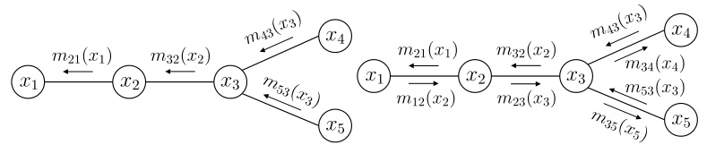  

5  Select a root node, and then pass messages from all leaf nodes to the root node until the root node has received messages from all adjacent nodes; 5  Pass messages from the root node toward leaf nodes until all leaf nodes have received messages.  

Taking  .  Figure 14.7  (a) as an example, let  $x_{1}$   be the root node, and    $x_{4}$   and  $x_{5}$   be the leaf nodes. The two steps of message passing are illustrated in    $\circ$   Figure 14.8 , where each edge has two messages on it with different directions. From the messages and ( 14.20 ), we have the marginal probabilities of all variables.  

## 14.5  Approximate Inference  

Exact inference methods are usually computationally expen- sive, and hence we often use approximate inference methods in practice. Roughly speaking, there are two types of approxi- mate inference methods, namely sampling, which accomplishes approximation by stochastic methods,and deterministic approx- imations, represented by variational inference.  

### 14.5.1  MCMC Sampling  

In many tasks, we are interested in probability distributions just because we need them to calculate some expectations for decision-making.Taking the Bayesian network in  .  Figure 14.7 (a) as an example, the goal of inference could be finding the expectation of  $x_{5}$  . It turns out that, sometimes, it can be more efficient to calculate or approximate the expectations directly without finding the probability distributions first.  

The above idea motivates the sampling methods. Suppose our objective is to find the expectation of the function  $f(x)$   with respect to the probability density function  $p(x)$  

$$
\mathbb{E}_{p}[f]=\int f(x)p(x)d x.
$$  

Or a distribution related to  $p(x)$  .  

We can approximate the objective expectation    $\mathbb{E}[f]$   by sam- pling a set of samples    $\{x_{1},x_{2},.\,.\,.\,,x_{N}\}$   from    $p(x)$   and then com- pute the mean of  $f(x)$   on these samples  

$$
\hat{f}=\frac{1}{N}\sum_{i=1}^{N}f(x_{i}),
$$  

According to the law of large numbers, we can obtain an accu- rate approximation from the  i . i . d .  samples    $\{x_{1},x_{2},.\,.\,.\,,x_{N}\}$  by large-scale sampling. The problem here is how to sam- ple? For example, in probabilistic graphical models, how can we efficiently obtain samples from the probability distribution described by the graphical model?  

One of the most commonly used sampling techniques for probabilistic graphical models is the Markov Chain Monte Carlo (MCMC) method. Given the probability density func- on  $p(x)$   of a contin ous variable    $x\in X$  , the probability that x  lies in the interval  A  is  

$$
P(A)=\int_{A}p(x)d x.
$$  

If  $\cdot f:X\mapsto\mathbb{R}$  , then the expectation of  $f(x)$   is given by  

$$
p(f)=\mathbb{E}_{p}[f(X)]=\int_{x}f(x)p(x)d x.
$$  

However, the integration in ( 14.24 ) is not easy to compute when  $x$   is not univariate but a high-dimensional multivariate variable  $\mathbf{X}$   that follows a complex distribution. Hence, MCMC first con- structs some  i . i . d .  samples    $\mathbf{x}_{1},\mathbf{x}_{2},\ldots,\mathbf{x}_{N}$   that follow the dis- tribution  $p$  , and then obtains an unbiased estimate of ( 14.24 ) as  

$$
\tilde{p}(f)=\frac{1}{N}\sum_{i=1}^{N}f(\mathbf{x}_{i}).
$$  

Nevertheless, constructing  i . i . d .  samples that follow the dis- tribution  $p$   can still be difficult if the probability density func- tion  $p(\mathbf{x})$   is complex. The key idea of MCMC is to generate samples by constructing a ‘‘Markov chain with stationary dis- tribution  $p^{*}.$   To be specific, by letting the Markov chain run for a sufficiently long time (i.e., converged to a stationary distri- bution), the generated samples approximately follow the dis- tribution  $p$  . How do we know if the Markov chain has arrived at a stationary state? We say a Markov chain    $T$  has arrived at a stationary state with a stationary distribution  $p(\mathbf{x}^{t})$   once the following stationary condition is met at time point    $t$  :  

$$
p(\mathbf{x}^{t})T(\mathbf{x}^{t-1}\mid\mathbf{x}^{t})=p(\mathbf{x}^{t-1})T(\mathbf{x}^{t}\mid\mathbf{x}^{t-1}),
$$  

where    $T(\mathbf{x}^{\prime}\mid\mathbf{x})$   is the state transition proba ity (i.e., the prob- ability of transitioning from state    $\mathbf{X}$   to state  $\mathbf{X}^{\prime}$  ), and  $p(\mathbf{x}^{t})$   is the distribution at time point    $t$  .  

In short, MCMC starts by constructing a Markov chain and let it converge to the stationary distribution, which is exactly the posterior distribution of the parameters to be estimated. Then, it uses the Markov chain to generate the desired samples for further estimations. A vital step in this process is construct- ing the state transition probabilities of the Markov chain, and different construction methods lead to different MCMC algo- rithms.  

The Metropolis− Hastings (MH) algorithm is an important representative of MCMC methods, which approximates the stationary distribution  $p$   via  reject sampling . The MH algo- rithm is given in    $^{\circ}$   Figure 14.1 . In each round, the MH algo- rithm draws a candidate state sample    $\mathbf{x}^{*}$  based on the sample  $\mathbf{X}^{t-1}$    of the last round, where    $x^{*}$  has a certain probability of being ‘‘rejected’’. Once  $\mathbf{x}^{*}$  converged to a stationary state, from ( 14.26 ), we have  

The Metropolis− Hastings algorithm is named after the original authors Metropolis et al. ( 1953 ) and Hastings ( 1970 ), who extended the algorithm to a general form afterwards.  

$$
p(\mathbf{x}^{t-1})\mathcal{Q}(\mathbf{x}^{*}\mid\mathbf{x}^{t-1})\mathcal{A}(\mathbf{x}^{*}\mid\mathbf{x}^{t-1})=p(\mathbf{x}^{*})\mathcal{Q}(\mathbf{x}^{t-1}\mid\mathbf{x}^{*})\mathcal{A}(\mathbf{x}^{t-1}\mid x^{*}),
$$  

where    $\begin{array}{r l}{\mathcal{Q}(\mathbf{x}^{*}}&{{}|\ \ \mathbf{x}^{t-1})}\end{array}$   is the user-specified prior probability,  $A(\mathbf{x}^{*}\;\mid\;\mathbf{x}^{t-1})$   is the probability of accepting    $\mathbf{x}^{*}$  , and    $Q(\mathbf{x}^{\ast}\mid$   ${\bf x}^{t-1})A({\bf x}^{*}\mid{\bf x}^{t-1})$   is the state transition probability from state  $\mathbf{X}^{t-1}$    to state  $\mathbf{x}^{*}$  . To arrive at the stationary state, we just need to set the acceptance probability to  

$$
A(\mathbf{x}^{*}\mid\mathbf{x}^{t-1})=\operatorname*{min}\left(1,\frac{p(\mathbf{x}^{*})Q(\mathbf{x}^{t-1}\mid\mathbf{x}^{*})}{p(\mathbf{x}^{t-1})Q(\mathbf{x}^{*}\mid\mathbf{x}^{t-1})}\right).
$$  

Repeat enough times to arrive at the stationary distribution.  

According to ( 14.28 ).  

In practice, we often discard the samples in the beginning of the list since we wish to use samples generated from the stationary distribution. See Sect.  7.5.3  for Gibbs sampling.  

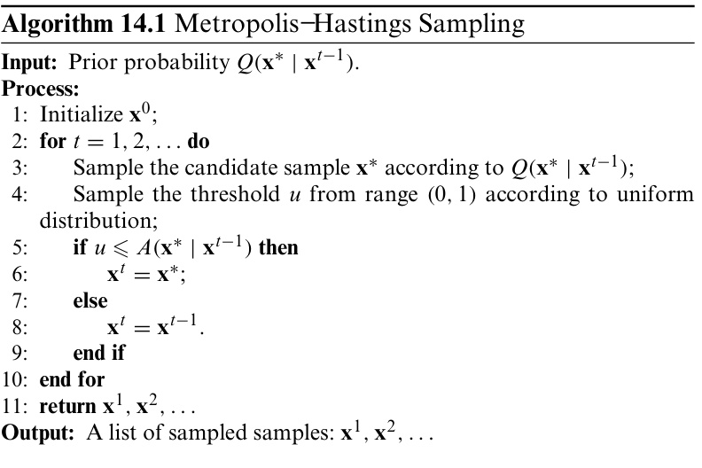  

Gibbs sampling is sometimes considered as a special case of the MH algorithm, since it also obtains samples using Markov chains with the target sampling distribution    $p(\mathbf{x})$   as the sta- tionary distribution. Specifically, let    $\mathbf{x}=\{x_{1},x_{2},.\,.\,.\,,x_{N}\}$   be the set of variables, and  $p(\mathbf{x})$   be the objective distribution, then the Gibbs sampling algorithm generates samples by repeating the following steps after initializing    $\mathbf{X}$  :

 (1) Select a variable  $x_{i}$   either randomly or according to a cer- tain ordering;

 (2)  bility  $p(x_{i}\mid\mathbf{X}_{\overline{{i}}})$  , where  $\mathbf{X}_{\bar{i}}^{-}=\mathbf{\Phi}$     $\{x_{1},x_{2},.\,.\,.\,,x_{i-1},x_{i+1},.\,.\,.\,,x_{N}\}$  { }  is the current value of  x − + excluding  $x_{i}$  ;

 (3) Sample a new value of    $x_{i}$   from    $p(x_{i}\mid\mathbf{X}_{\overline{{i}}})$   and replace the original value.  

### 14.5.2  Variational Inference  

Variational inference  approximates complex distributions with simple and known distributions. It restricts the type of the approximate distribution, such that the approximate posterior distribution is locally optimal with a deterministic solution.  

Before introducing the details of variational inference, let us see a concise way of representing graphical models— plate nota- tion (Buntine 1994 ). Figure  14.9 gives an example.  $^{\circ}$   Figure 14.9  (a) shows that there are    $N$  variables    $\{x_{1},x_{2},\ldots,$   $x_{N}\}$   dependent on the variable  z . In  .  Figure 14.9  (b), the plate notation compactly describes the same relationship, where multiple variables independently generated by the same mech- anism are placed in the same rectangle (plate), which allows nesting, and there is a label  $N$   indicating the number of repeti-  

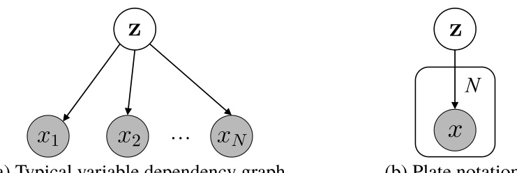  

tions. Observable or known variables are usually shaded, e.g.,  $x$   in  $\circ$   Figure 14.9 . The plate notation provides a very concise way of representing variable relationships in various learning problems.  

In  .  Figure 14.9  (b), the probability density function of all observable variables    $x$   is  

$$
p(\mathbf{x}\mid\Theta)=\prod_{i=1}^{N}\sum_{\mathbf{z}}p(x_{i},\mathbf{z}\mid\Theta),
$$  

which has the corresponding log-likelihood function  

$$
\ln p(\mathbf{x}\mid\Theta)=\sum_{i=1}^{N}\ln\left\{\sum_{\mathbf{z}}p(x_{i},\mathbf{z}\mid\Theta)\right\},
$$  

where  $\mathbf{x}=\{x_{1},x_{2},.\,.\,.\,,x_{N}\}$  ,    $\Theta$   includes the parameters of the distributions that  $\mathbf{X}$   and    $\mathbf{z}$   follow.  

Generally speaking, the inference and learning task in .  Figure 14.9  is mainly estimating the hidden variable z  and the distr ution parameter variable    $\Theta$  , that is, finding  $p(\mathbf{z}\mid\mathbf{x},\Theta)$  and   .  

The parameters of graphical models are often estimated by maximum likelihood estimation. For ( 14.30 ), we can apply the EMalgorith IntheE-step,weinfer  $p(\mathbf{z}\mid\mathbf{x},\Theta^{t})$  bytheparam- eter variable  $\Theta^{t}$    at time point    $t$  , and then compute the joint like- lihood fun on    $p(\mathbf{x},\mathbf{z}\mid\Theta)$  . In the M-step, we use the cu parameter  $\Theta^{t}$    obtained in the E-step to find the parameter  $\Theta^{t+1}$  of the next time point by optimizing the function  $\mathcal{Q}(\Theta;\Theta^{t})$  

$$
\begin{array}{l}{{\displaystyle\Theta^{t+1}=\arg\operatorname*{max}_{\boldsymbol{\Theta}}Q(\boldsymbol{\Theta};\,\Theta^{t})}}\\ {{\displaystyle\qquad=\arg\operatorname*{max}_{\boldsymbol{\Theta}}\sum_{\mathbf{z}}p(\mathbf{z}\mid\mathbf{x},\Theta^{t})\ln p(\mathbf{x},\mathbf{z}\mid\boldsymbol{\Theta}).}}\end{array}
$$  

where  $\mathcal{Q}(\Theta;\Theta^{t})$   is actually the expectation of the joint log-   likelihood function   $\ln p(\mathbf{x},\mathbf{z}\mid\Theta)$   with respect to the distribu- tion  $p(\mathbf{z}\mid\mathbf{x},\Theta^{t})$  . It approximates the log-likelihood function when the distribution    $p(\mathbf{z}\mid\mathbf{x},\Theta^{t})$   equals to he ground-truth posterior distribution of the hidden variable  z . Hence, the EM algorithm estimates not only the parameter    $\Theta$   but also the dis- tribution of the hidden variable    $\mathbf{z}$  .  

Note that  $p(\mathbf{z}\mid\mathbf{x},\Theta^{t})$   is not necessarily the ground-truth distribution of    $\mathbf{z}$   but only an approximate distribution. Let    $q(\mathbf{z})$  denote the approximate distribution, we can derive  

$$
\ln p(\mathbf{x})=\mathcal{L}(q)+\mathrm{KL}(q\|p),
$$  

where  

$$
\mathcal{L}(q)=\int q(\mathbf{z})\ln\left\{\frac{p(\mathbf{x},\mathbf{z})}{q(\mathbf{z})}\right\}d\mathbf{z},
$$  

$$
\mathrm{KL}(q\|p)=-\int q(\mathbf{z})\ln\frac{p(\mathbf{z}\mid\mathbf{x})}{q(\mathbf{z})}d\mathbf{z}.
$$  

See Appendix  C.3  for the KL divergence.  

To make the notation uncluttered, we abbreviate  $q_{i}(\mathbf{z}_{i})$  as  $q_{i}$  .  

const is a constant.  

Inpractice,however,it maybe difficult to nd  $p(\mathbf{z}\mid\mathbf{x},\Theta^{t})$  in the E-step due to the intractable multivariate  z , and this is when variational inference comes in handy. We typically assume that  $\mathbf{z}$   follows the distribution  

$$
q(\mathbf{z})=\prod_{i=1}^{M}q_{i}(\mathbf{z}_{i}).
$$  

In other words, we assume that we can decompose the complex multivariate variable  $\mathbf{z}$   into a series of independent multivariate variables    $\mathbf{z}_{i}$  . With this assumption, the distribution    $q_{i}$   can be made simple or has a good structure. For example, suppose    $q_{i}$  is an  exponential family  distribution, then we have  

$$
{\begin{array}{l}{{\displaystyle{\mathcal{L}}({\boldsymbol{q}})=\int\prod_{i}q_{i}\left\{\ln p(\mathbf{x},\mathbf{z})-\sum_{i}\ln q_{i}\right\}d\mathbf{z}}\ ~}\\ {{\displaystyle~~~~~~~~=\int q_{j}\left\{\int\ln p(\mathbf{x},\mathbf{z})\prod_{i\neq j}q_{i}d\mathbf{z}_{i}\right\}d\mathbf{z}_{j}-\int q_{j}\ln q_{j}d\mathbf{z}_{j}+\mathrm{const}}\ ~}\\ {{\displaystyle~~~~~~~~=\int q_{j}\ln{\tilde{p}}(\mathbf{x},\mathbf{z}_{j})d\mathbf{z}_{j}-\int q_{j}\ln q_{j}d\mathbf{z}_{j}+\mathrm{const}},~~~~~~~~~~(14.2)}\end{array}}
$$  

where  

$$
\begin{array}{r}{\ln\tilde{p}(\mathbf{x},\mathbf{z}_{j})=\mathbb{E}_{i\neq j}[\ln p(\mathbf{x},\mathbf{z})]+\mathrm{const},}\end{array}
$$  

$$
\mathbb{E}_{i\neq j}[\ln p(\mathbf{x},\mathbf{z})]=\int\ln p(\mathbf{x},\mathbf{z})\prod_{i\neq j}q_{i}d\mathbf{z}_{i}.
$$  

Since we are interested in    $q_{j}$  , we can maximize    $\mathcal{L}(q)$   with    $q_{i\neq j}$  fix We notice that ( 14.36 )  $-\mathrm{KL}(q_{j}\parallel\tilde{p}(\mathbf{x},\mathbf{z}_{j}))$  , that is,  $\mathcal{L}(q)$   is maximized when  $q_{j}=\tilde{p}(\mathbf{x},\mathbf{z}_{j})$   = ˜ . Hence, the optimal distribution  $q_{j}^{\ast}$    that the variable subset  $\mathbf{z}_{j}$   follows should satisfy  

$$
\ln q_{j}^{*}(\mathbf{z}_{j})=\mathbb{E}_{i\neq j}[\ln p(\mathbf{x},\mathbf{z})]+\mathrm{const},
$$  

so we have  

$$
q_{j}^{*}(\mathbf{z}_{j})=\frac{\exp\left(\mathbb{E}_{i\neq j}[\ln p(\mathbf{x},\mathbf{z})]\right)}{\int\exp\left(\mathbb{E}_{i\neq j}[\ln p(\mathbf{x},\mathbf{z})]\right)d\mathbf{z}_{j}}.
$$  

In other words, with the assumption ( 14.35 ), ( 14.40 ) provides the best approximation to the ground-truth distribution of the variable subset    $\mathbf{z}_{j}$  .  

With the assumption ( 14.35 ), we can often find a closed form solution to    $\mathbb{E}_{i\neq j}[\ln p(\mathbf{x},\mathbf{z})]$   by properly partitioning vari- able subsets    $\mathbf{z}_{j}$   and selecting the distribution that    $q_{i}$   follows; hence the hidden variable    $\mathbf{z}$   can be inferred efficiently by ( 14.40 ). From ( 14.38 ), we observe that the estimation of the dis- tribution  $\boldsymbol{q}_{j}^{*}$    of  $\mathbf{z}_{j}$   not only considers  $\mathbf{z}_{j}$  but also  $\mathbf{Z}_{i\neq j}$  . Since this is achieved by finding the expectation of the joint log-likelihood function   $\ln p(\mathbf{x},\mathbf{z})$   with respect to  $\mathbf{Z}_{i\neq j}$  , such a method is also called the  mean field  method.  

When applying variational inference in practice, the most important thing is to find the proper hidden variable decompo- sition and the proper distribution hypothesis of each subset of hidden variables. With the hidden variable decomposition and distribution hypotheses, the parameter estimation and infer- ence of probabilistic graphical models can be made by the EM algorithm and the consideration of ( 14.40 ). Clearly, the per- formance of variational inference is subject to the quality of hidden variable decomposition and distribution hypotheses.  

## 14.6  Topic Model  

Topic model  is a family of generative directed graphical models mainly used for modeling discrete data, e.g., text corpus. As represented by Latent Dirichlet Allocation (LDA), topic mod- els have been widely used in information retrieval and natural language processing.  

There are three key concepts in topic models, namely  word , document , and  topic . A  word  is the basic discrete unit in the data, e.g., an English word in text processing. A  document  is a data object, such as a paper or a Web page, containing a set of words without considering the ordering of words. Such a representation is known as  bag-of-words . Topic models apply  

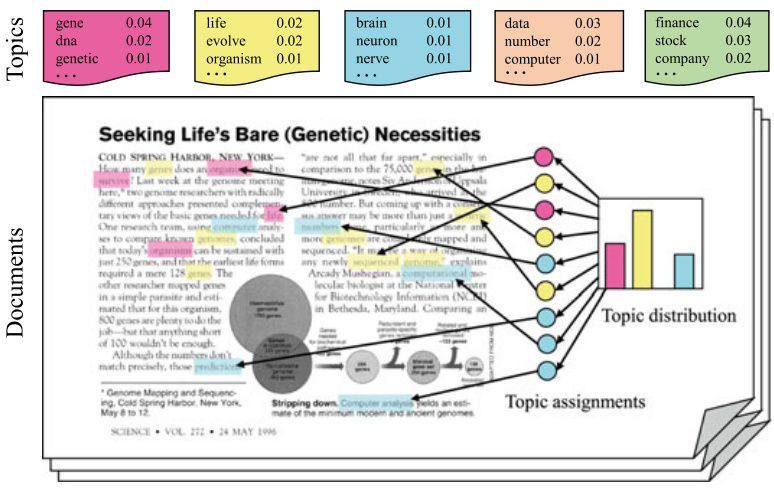  
Fig. 14.10 An illustration of the document generation process of LDA  

to any data objects that can be described by bag-of-words. A  topic  describes a concept represented by a series of related words together with the probabilities that they appear in the concept.  

.  Figure 14.10 provides an intuitive example of topic model. A topic is like a box containing those words with high proba- bility to appear under the concept of the topic. Suppose that we have a data set of    $T$   documents on  $K$   topics, where all words in the documents are from a dictionary of    $N$   distinct words. The data set (i.e., collection of documents) is denoted by    $T\times N$  - dimensional vectors    $\mathbf{W}\,=\,\{\mathbf{w}_{1},\mathbf{w}_{2},.\,.\,.\,,\mathbf{w}_{T}\}$  , where    $w_{t,n}$   (i.e., he  n th component of    ${\bf w}_{t}\,\in\,\mathbb{R}^{N}$  ) is the frequency of the wo n  appeared in the document    $t$  . The topics are denoted by  K  $N$  -dimensional vectors    $\beta_{k}$     $(k=1,2,.\ldots,K)$  , where    $\beta_{k,n}$   (i.e., the  n th com onent of  $\beta_{k}\in\mathbb{R}^{N}$  ) is the frequency of the word    $n$  in the topic  k .  

Some words are usually excluded, such as  stop words .  

See Appendix  C.1.6  for Dirichlet distribution.  

In practice, we can obtain the word frequency vectors    $\mathbf{w}_{i}$   $(i=1,2,.\ldots,T)$   by counting the words in documents, though we do not know which topic is mentioned in which document. LDA assumes that each document contains multiple topics that can be modeled by a generative model. More specifically, let  $\Theta_{t}\,\in\,\mathbb{R}^{K}$    denote the proportion of eac topic in document    $t$  , and  $\Theta_{t,k}$   denote the proportion of topic  k  in document    $t$  . Then, LDA assumes a document    $t$   is ‘‘generated’’ by the following steps:  

(1) Randomly draw a topic distribution    $\Theta_{t}$   from a Dirichlet distribution with parameter    $_{\alpha}$  ;

 (2) Generate    $N$   words for document    $t$   by the following steps: (a) Obtain a topic assignment  $z_{t,n}$   according to topic dis- tribution    $\Theta_{t}$   for each word    $n$   in document    $t$  ;  

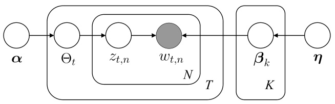  
Fig. 14.11 The plate notation of LDA  

(b) Generate a word through random sampling according to the word frequency distribution    $\beta_{k}$   corresponding to topic assignment  $z_{t,n}$  .  

The above document generation process is illustrated in .  Figure 14.10 . Note that a generated document will have dif- ferent proportions of topics (step 1), and each word in the doc- ument comes from a topic (step 2b) generated according to the topic distribution (step 2a).  

The plate notation in    $\circ$   Figure 14.11  describes the rela- tionships between variables, where word frequency    $w_{t,n}$   is the only observed variable that depends on topic assignment    $z_{t,n}$  and the corresponding word frequency distribution    $\beta_{k}$  . The topic assignment  $z_{t,n}$   depends on topic distribution  $\Theta_{t}$  , which depends on a parameter  $_{\alpha}$  . The word frequency distribution    $\beta_{k}$  depends on a parameter    $\pmb{\eta}$  . Then, the probability distribution of LDA is  

$$
\begin{array}{l}{p(\mathbf{W},\mathbf{z},\boldsymbol{\beta},\boldsymbol{\Theta}\mid\alpha,\boldsymbol{\eta})=}\\ {\;\;\;\;\;\prod_{t=1}^{\top}p(\Theta_{t}\mid\alpha)\prod_{i=1}^{K}p(\beta_{k}\mid\boldsymbol{\eta})\left(\prod_{n=1}^{N}P(w_{t,n}\mid z_{t,n},\beta_{k})P(z_{t,n}\mid\Theta_{t})\right),}\end{array}
$$  

where    $p(\Theta_{t}\mid\alpha)$   is usually s  to a  $K$  sional Dirichlet dis bution with a parameter  α , and  $p(\beta_{k}\mid\eta)$   |  is usually set  an  N -dimensional Dirichlet distribution with a parameter  η . For example  

$$
p(\Theta_{t}\mid\alpha)=\frac{\Gamma(\sum_{k}\alpha_{k})}{\prod_{k}\Gamma(\alpha_{k})}\prod_{k}\Theta_{t,k}^{\alpha_{k}-1},
$$  

where    $\Gamma(\cdot)$   is the Gamma function. Clearly,    $_{\alpha}$   and    $\eta$   in ( 14.41 ) are the model parameters to be determined.  

Given a data set    $\mathbf{W}\,=\,\{\mathbf{w}_{1},\mathbf{w}_{2},.\,.\,.\,,\mathbf{w}_{T}\}$  , the parameters of LDA can be estimated by maximum likelihood estimation, that is, finding  $_{\alpha}$   and    $\eta$   by maximizing the log-likelihood  

See Appendix  C.1.5  for Gamma function. The word frequencies in training documents.  

$$
L L(\alpha,\boldsymbol{\eta})=\sum_{t=1}^{\top}\ln p(\mathbf{w}_{t}\mid\alpha,\boldsymbol{\eta}).
$$  

ever, it is difficult to solve ( 14.43 ) directly since  $p(\mathbf{w}_{t}\mid$   $\alpha,\eta)$   is not easy to compute. In practice, we often use varia- tional inference to find an approximate solution.  

Once    $_{\alpha}$   and    $\pmb{\eta}$   are found, we can use word frequency    $w_{t,n}$  to infer the topic structure of a document, that is, inferring    $\Theta_{t}$  ,  $\beta_{k}$  , and    $z_{t,n}$   by solving  

$$
p(\mathbf{z},\beta,\boldsymbol{\Theta}\mid\mathbf{W},\alpha,\eta)=\frac{p(\mathbf{W},\mathbf{z},\beta,\boldsymbol{\Theta}\mid\alpha,\eta)}{p(\mathbf{W}\mid\alpha,\eta)}.
$$  

Similarly, ( 14.44 ) is hard to solve since    $p(\mathbf{w}\mid\alpha,\eta)$   is not easy to compute. In practice, Gibbs sampling or variational inference is often employed to find an approximate solution.