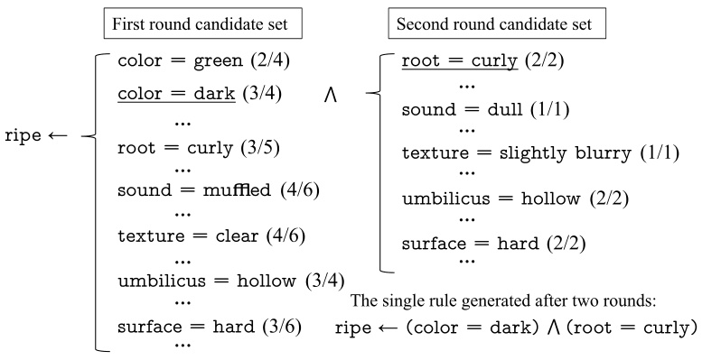
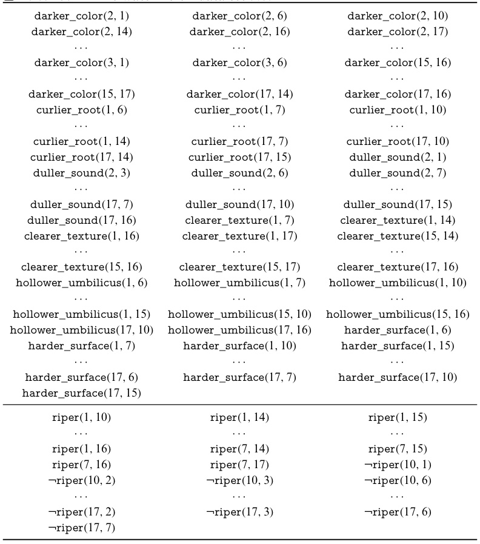
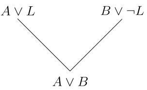

# Rule Learning  

## 15.1  Basic Concepts  

Broadly speaking, all predictive models can be seen as one or a set of rules. In rule learning, we refer to logic rules with the term ‘‘logic’’ omitted.  

In machine learning,  rules  usually refer to logic rules in the form of ‘‘if  . . . ,  then  . . . ’’ that can describe regular patterns or domain concepts with clear semantics (Fürnkranz et al.  2012 ). Rule learning  is about learning a set of rules from training data for predicting unseen samples.  

Formally, a rule is in the form of  

$$
\oplus\leftarrow\mathbf{f}_{1}\land\mathbf{f}_{2}\land\cdot\cdot\cdot\land\mathbf{f}_{L},
$$  

In formal logic, a  literal  is an atomic formula (atom) or its negation.  

where the right-hand side of implication symbol   $^{**}\gets^{**}$   is called the  antecedent  or  body  of the rule, and the left-hand side is called the  consequent  or  head  of the rule. The body is a  conjunc- tion  of  literals  $\mathbf{f}_{k}$  , where   $^{**}\wedge^{**}$  represents ‘‘AND’’. Each literal    $\mathbf{f}_{k}$  is a Boolean express n on a feature, e.g.,  (  $({\mathsf{c o l o r}}={\mathsf{d a r k}})$   or ¬ ( root  =  straight ) .  L  is the length of rul ndicating the num- ber of literals in the rule body. The head  ⊕ consists of literals representing decisions or concepts, e.g.,  ripe . Such logic rules are also known as  $i f$  -then rules .  

Compared to  black boxes , such as neural networks and support vector machines, the decision process of rule learn- ing is more intuitive and transparent, leading to better inter- pretability. Besides, most human knowledge can be concisely described and represented by formal logic. For example, a piece of knowledge like ‘‘the father of father is grandfather’’ is difficult to be expressed by numerical functions, but it can be conveniently expressed by a first-order logic formula ‘‘ grandfather  $(X,\,Y)\gets\mathtt{f a t h e r}(X,Z)\wedge\mathtt{f a t h e r}(Z,\,Y)^{\ast}$  . Hence, we can easily introduce domain knowledge into rule learning. The abstraction ability of logic rules leads to significant advan- tages in dealing with some highly complex AI problems. For example, in question answering systems, we may have many or even infinite possible answers, and performing abstraction and reasoning using logic rules will bring apparent convenience.  

Suppose we learned the following rule set    $\mathcal{R}$   from the water- melon data set:  

Rule  $\mathsf{l}\colon\mathsf{r i p e\gets(r o o t=c u r l y)}\wedge\mathsf{(u m b i l c u s=h o l l o w)}$  Rule 2: ¬ripe $\leftarrow$ (texture $=$ blurry).  

The watermelon data set 2 . 0 is given in  $^{\circ}$   Table 4.1 .  

Rule 1 has a length of 2, and it classifies samples by checking the valuation  (or truth-value assignment) of two literals. A sample (e.g., sample 1 in the watermelon data set 2 . 0) that satisfies the rule body is said to be  covered  by the rule. However, not being covered by rule 1 does not imply the watermelon is  unripe . We classify a watermelon as  unripe  if it is covered by rules with the head ‘‘ ¬ ripe ’’ (e.g., rule 2).  

Each rule in the rule set can be seen as a submodel, and the rule set is an ensemble of submodels. When a sample is cov- ered by multiple rules with different classification outcomes, we say there is a  conflict , which can be resolved by  conflict resolu- tion . Common conflict resolution strategies include (weighted) voting, ordering, and meta-rule methods. The voting strat- egy returns the most agreed prediction. The ordering strategy defines a preference order over the rule set, and the highest- ordered rule is used when there is a conflict; the corresponding rule learning process is called  ordered rule  learning or  priority rule  learning. The meta-rule method defines a set of  meta-rules based on domain knowledge for resolving conflicts, that is, rules about rules, e.g., ‘‘Choosing the rule with the minimum length when there is a conflict.’’  

See Chap.  8  for ensemble learning.  

The rules learned from training data may be unable to cover all unseen samples. For example, the rule set  $\mathcal{R}$   can-   not classify samples with ‘‘ root    $=$   curly ’’, o amples with ‘‘ umbilicus  $=$  slightly hollow ’’ and ‘‘ texture  =  clear ’’. Such cases are common when the number of features is large. Hence, rule learning algorithms often set a  default rule  that handles uncovered samples, e.g., a default rule for    $\mathcal{R}$   could be ‘‘all water- melons not covered by rule 1 and rule 2 are  unripe .’’  

Rules can be divided into two classes by the expressive power of formal languages:  propositional rule  and  first-order rule . A propositional rule is a plain statement consisting of propositional atoms  and logical connectors such as  conjunc- tion    $(\wedge)$  ,  disjunction    $(\vee)$  ,  negation    $(\neg)$  , and  implication    $(\leftarrow)$  . For example, the rule set    $\mathcal{R}$   is a propositional rule set, where root    $=$   curly  and  umbilicus    $=$   hollow  are propositional atoms. By contrast, the basic elements of first-order rules are  atomic formulas  that describe the features or relations of objects. For example, the predicate  father  $(X,\,Y)$   is an atomic formula that describes the father− son relationship. The succes- sor function    $\sigma(X)=X+1$   is also an atomic formula. Let the predicate  $N(X)$   $X$  is a natura umber’’, and  $\forall X$   denote ‘‘holds for all  $X^{\ast}$  ’’,  $\exists Y$   denote ‘‘exists  Y  such that’’, then we can write the statement ‘‘all natural numbers incremented by 1 are natural numbers’’as  $\forall X\exists Y(N(Y)\leftarrow N(X)\land(Y=\sigma(X)))$  , or more concisely,    $\forall X(N(\sigma(X))\leftarrow N(X))$  . Such a rule i called first-order rule, where  X  and  Y  are logic variables,  ∀ (‘‘for all’’) and  ∃ (‘‘exists’’) are  quantifiers  that specify the quantity of specimens in the domain of discourse that satisfy the rule. First-order rules are also called  relational rules  since they can express complex relations between objects. Taking the water- melon data set as an example, if we simply use the names of features as predicates to define the relations between their val- ues and samples, then propositional rule set    $\mathcal{R}$  can be rewritten as the following first-order rule set  $\mathcal{R}^{\prime}$  :  

Rule   $\mathsf{l}\colon\mathsf{r i p e}(X)\gets\mathsf{r o o t}(X,$  ,  curly )  ∧ umbilicus (  $X$  ,  hollow ) ; Rule 2: ¬ripe $(X)\leftarrow$ texture( $X$ , blurry).  

From the perspective of formal language, propositional rules are special cases of first-order rules, and hence first-order rule learning is more complicated than propositional rule learning.  

## 15.2  Sequential Covering  

Rule learning aims to find a rule set that can cover as many sam- ples as possible. The most straightforward approach is  sequen- tial covering , which induces one rule at a time: every time a rule is learned, all samples covered by it are removed from the training set, and the learning process repeats with the remain- ing samples in the training set. Such a strategy is also called separate-and-conquer , since only part of the training set is pro- cessed in each round.  

Let us take a closer look at sequential covering with propo- sitional rule learning. The body of a propositional rule con- sists of Boolean functions for testing the feature values (e.g., col  $\mathtt{o r}=\mathtt{g r e e}$  green and sugar    $\leqslant0.2)$  ,and the head of rule is the class label. The core of sequential covering is how to learn individual rules from the training set. Given a rule head    $\oplus$  , rule learning is a search problem of finding the optimal set of literals for the rule body. Formally, when given a positive data set and a negative data set, the learning task is to induce the optimal rule r  based on the candidate literal set  $\mathcal{F}=\{\mathbf{f}_{k}\}$  . In propositional   rule learning, a candidate literal is a Boolean expression in the form of ‘‘ R ( feature i ,  feature  $i,j$  ) ’’, where feature  $i$   is the  i th fea- ture, feature  $i,j$  is the  j th candidate value of feature i , and    $R(x,y)$  is a binary Boolean function that tests whether    $x$  and    $y$   satisfy relation    $R$  .  

The simplest approach is to start with an empty rule   $"\oplus\leftarrow"$  with the positive class as the rule head and then iterate over every candidate value of every feature: the rule can be con- structed by conjunctively adding them to the rule body as lit- erals. Once the current rule covers only positive samples, we return the rule and remove the covered samples from the train- ing set, and then induce the next rule with the remaining sam- ples.  

Taking the watermelon training set 2 . 0 as an example, we generate the literals  ripe  and  color  $=$  green  from the sample 1:  

$$
\mathtt{r i p e}\gets(\mathtt{c o l o r}=\mathtt{g r e e n}).
$$  

This rule covers the samples 1, 6, 10, and 17, where two of them are positive and the rests are negative. Since the rule does  

not meet the requirement ‘‘covering only positive samples’’, we replace the proposition with another atomic proposition about feature  color  (e.g.,    ${\mathsf{c o l o r}}={\mathsf{d a r k}}$  ). However, the new rule still fails to meet the requirement, hence we fallback to  color  $=$  green  and try to add a propositional atom about other features, e.g.,  root  $=$  curly:  

For ease of discussion, we do not consider literals of negative atoms in the rest of this chapter, that is, we only consider candidate literals in the form of f  but not    $\neg\mathbf{f}$  .  

$$
\mathsf{r i p e}\gets(\mathsf{c o l o r}=\mathsf{g r e e n})\wedge(\mathsf{r o o t}=\mathsf{c u r l y}),
$$  

which still covers negative sample 17. Therefore, we replace the second proposition with another atomic proposition about this feature, e.g.,  root  $=$   slightly curly :  

$$
\mathtt{r i p e}\gets(\mathtt{c o l o r}=\mathtt{g r e e n})\wedge(\mathtt{r o o t}=\mathtt{s l i g h t l y\ c u r l y}),
$$  

which finally excludes negative samples and satisfies the require- ment of ‘‘covering only positive samples’’, though it covers only one positive sample. We keep this rule and remove the covered sample 6 and then use the rest 9 samples as the updated training set. By repeating this process, we have  

Rule  $\mathsf{l}\colon\mathsf{r i p e}\gets(\mathsf{c o l o r}=\mathsf{g r e e n})\wedge(\mathsf{r o o t}=\mathsf{s l i g h t l y\ c u r l y})$  ; Rul  $\mathsf{e\,2}\colon\mathsf{r i p e}\gets(\mathsf{c o l o r}=\mathsf{g r e e n})\wedge(\mathsf{s o u n d}=\mathsf{m u f l i e c t}$  ) ; R  $\mathsf{u l e\;3\!:r i p e\gets(c o l o r=d a r k)\land(r o o t=c u r l y)};$  ; Rule 4:  ripe  $\leftarrow$  ( color  =  dark )  $\wedge$  ( texture  $=$  slightly blurry ),  

which is a rule set covering all positive samples but none of the negative samples, and this is the output of sequential covering.  

When there are many features and candidate values, the above exhaustive search becomes infeasible due to the combi- natorial explosion. Therefore, in practice, we often take either a top-down  strategy or a  bottom-up  strategy. The  top-down  strat- egy, also called the  generate-then-test  method, starts with a general rule and gradually adds more literals to reduce the coverage of samples until the pre-specified conditions are met. Such a process is known as  specialization  of rules. The bottom- up strategy, also called the  data-driven  method, starts with a specialized rule and gradually removes literals to increase the coverage of samples until the pre-specified conditions are met. Such a process is known as  generalization  of rules. The top- down strategy, which searches for rules from high coverage to low coverage, often generates rules with better generalization and noise-tolerance than the rules generated by the bottom- up strategy, though the bottom-up strategy is more suitable with limited training samples. In practice, propositional rule learning often takes the top-down strategy, whereas first-order rule learning, which deals with more complex hypothesis space, often takes the bottom-up strategy.  

For example, an empty rule without any features is a general rule that covers all samples.  

For example, a rule generated from all the feature values of a sample is a specialized rule that covers only this sample.  

The watermelon data set 2 . 0 is given in the first part of  $\circ$   Table 4.2 .  

Let us see a demonstration of the top-down strategy using the watermelon training set 2 . 0. We start with an empty rule ‘‘ ripe    $\leftarrow^{\ast}$  , and then gradually add each ‘‘feature    $=$   value’’ as a propositional atom to the empty rule for consideration. Suppose the quality of a rule is measured by its accuracy on the training set, and let    $n/m$   be the accuracy of the new rule obtained by adding a proposition, where    $n$   is the number of positive samples in the    $m$   samples covered. As illustrated in .  Figure 15.1 , both  color  $=$   dark  and  umbilicus  $=$  hollow have achieved the highest accuracy   $3/4$   in the first round.  

Adding the first encountered literal  color  $=$  dark  to the empty rule, gives  

$$
\mathtt{r i p e}\gets(\mathtt{c o l o r}=\mathtt{d a r k}).
$$  

Then, the samples covered by the above rule are used as the training set in the second round, in which, we find that adding any of the five literals in  $^{\circ}$   Figure 15.1  can achieve an accuracy of   $100\%$  . By choosing the literal  root  $=$  curly , which locates first and covers the most samples, we have  

$$
\mathtt{r i p e}\gets(\mathtt{c o l o r}=\mathtt{d a r k})\wedge(\mathtt{r o o t}=\mathtt{c u r l y}).
$$  

The rule induction process needs criteria for evaluating the quality of rules. For example, in the above example, we first consider the accuracy of rules. With the same accuracy, we further consider the sample coverage, followed by the order of propositions. Such criteria can be varied according to different learning problems.  

The above example is greedy to consider only one ‘‘optimal’’ literal in each round, and such an approach can easily lead to local optimum. To alleviate this problem, we can take a more  

  
Fig. 15.1 Taking the top-down strategy to generate single rules from the watermelon data set 2 . 0  

gentle approach such as  beam search , which adds the best    $b$  literals in the current round to the candidate literal set of the next round. Taking  .  Figure 15.1  as an example, if we  $b=2$  , then both literals that have achieved an accuracy of 3  $3/4$  4 in the first round are kept for the second round; after the second round, we obtain the following rule, which not only achieves an accuracy of   $100\%$   but also covers 3 positive samples:  

$$
\mathsf{r i p e}\gets\mathsf{(u m b i l c u s=h o l l o w)}\land\mathsf{(r o o t=c u r l y)}.
$$  

Due to the simplicity and effectiveness of sequential cov- ering, it is the basis for almost all rule learning algorithms. Sequential covering can be easily extended to multiclass prob- lems by considering each class in turn: when learning rules for class    $c$  , considering all class    $c$   samples as positive and the rest samples as negative.  

## 15.3  Pruning Optimization  

Rule induction is essentially a greedy search process that needs a mechanism to alleviate the risk of overfitting, and one com- mon approach is  pruning . Like decision tree learning, pruning can take place during the rule generation (i.e.,  pre-pruning ) or after the rules have been generated (i.e.,  post-pruning ). Whether pruning is needed or not is usually decided by com- paring the performance of the rule or rule set before and after adding/removing its literals and rules, respectively.  

Pruning can also be decided by statistical significance test. For example, CN2 (Clark and Niblett  1989 ) performs pre- pruning by assuming that the predictive performance of the rule set must be significantly better than that of simply mak- ing predictions according to the posterior probability distri- bution exhibited by the training set. For ease of calculation, CN2 employs Likelihood Ratio Statistics (LRS). Let    $m_{+}$   and  $m_{-}$  denote, respectively, the number of positive samples and the number of negative samples in the training set; let  $\hat{m}_{+}$   and +  $\hat{m}_{-}$  denote, respectively, the number of positive and negative − samples covered by the rule set. Then, LRS can be defined as  

See Sect.  4.3  for decision tree pruning.  

See Sect.  2.4  for statistical significance test.  

$$
\begin{array}{r}{\mathrm{LRS}=2\cdot\left(\hat{m}_{+}\log_{2}\frac{(\frac{\hat{m}_{+}}{\hat{m}_{+}+\hat{m}_{-}})}{(\frac{m_{+}}{m_{+}+m_{-}})}+\hat{m}_{-}\log_{2}\frac{(\frac{\hat{m}_{-}}{\hat{m}_{+}+\hat{m}_{-}})}{(\frac{m_{-}}{m_{+}+m_{-}})}\right),}\end{array}
$$  

which is essentially a measure of information. To be specific, LRS measures the difference between the distribution of sam- ples covered by the rule (set) and the empirical distribution of all the training samples: a larger LRS implies that the predic- tions made by the rule (set) are more likely to be different from the predictions made by simply conjecturing based on the ratio of positive/negative samples in the training set; and a smaller LRS implies that the performance of the rule (set) is more likely to be by chance. In real-world applications with a large amount of data, the LRS threshold is often set to a large value (e.g., 0 . 99) for stopping the growth of rule (set).  

In rule learning, they are often called  growing set  and  pruning set .  

A widely used approach of post-pruning is the Reduced Error Pruning (REP) (Brunk and Pazzani  1991 ), which takes the following procedure: split samples into a training set and a validation set, and then do multiple rounds of pruning on the rule set    $\mathcal{R}$   learned from the training set; in each round, use the validation set to find the best rule set by evaluating all possible pruning operations, such as deleting a literal from the rule body, deleting the last one or multiple literals in the rule, and deleting the entire rule. The above procedure repeats until pruning no longer improves the performance on the validation set.  

Though REP is often effective (Brunk and Pazzani  1991 ), it has a complexity of    $O(m^{4})$   for  m  training samples. Incremental REP(IREP)(FürnkranzandWidmer 1994 )managedtoreduce the complexity to    $O(m\log^{2}m)$   with the following procedure: before generating a rule, the current data set is split into a training set and a validation set; then, a rule    $\mathbf{r}$   is generated from the training set and is immediately pruned by REP on the validation set to get  $\mathbf{r}^{\prime}$  ; remove all samples covered by    $\mathbf{r}^{\prime}$    and repeat the above process on the remaining samples. IREP is more efficient since it only prunes one rule at a time, whereas REP prunes the entire rule sets.  

RIPPER stands for Repeated Incremental Pruning to Produce Error Reduction, which is named JRIP in WEKA.  

Given the number of repeti- tions  $k$   in  $\circ$   Algorithm 15.1 , RIPPER is also called RIPPER  $k$  , e.g., RIPPER5 means  $k=5$  .  

Better performance can often be achieved by combining pruning with other post-process techniques for rule-set opti- mization. Taking the well-known rule learning algorithm RIP- PER (Cohen  1995 ) as an example, it can achieve both bet- ter generalization performance and faster learning speed than many decision tree algorithms, and the secrete behind it is combing pruning with post-processing optimization.  

The pseudocode of RIPPER is given in    $^{\circ}$   Algorithm 15.1 . RIPPER starts by generating rule set    $\mathcal{R}$   based on the pruning mechanism of IREP\* (Cohen  1995 ).   $\scriptstyle{\mathrm{IREP}}^{*}$   improves IREP by replacing the evaluation heuristic of accuracy in IREP with  $\frac{\hat{m}_{+}\bar{+(m_{-}}\hat{-m}_{-})}{m_{+}\bar{+m_{-}}}$  , pruning each single rule by deleting multiple lit- + + − erals from the end of the body, and performing a last-time pruning with IREP on the entire rule set that has been learned. The post-processing mechanism in RIPPER aims to further improve the performance after the pruning for every single rule has been done. To this end, RIPPER generates two variants for each rule  $\mathbf{r}_{i}\in\mathcal{R}$  

•  $\mathbf{r}_{i}^{\prime}$  : use   $\scriptstyle{\mathrm{IREP}}^{*}$   to generate a  replacement rule    $\mathbf{r}_{i}^{\prime}$    from the samples covered by  $\mathbf{r}_{i}$  ;

 •  $\mathbf{r}_{i}^{\prime\prime}$  : specialize  $\mathbf{r}_{i}$   by adding literals, and then use IREP\* to generate a  revised rule  $\mathbf{r}_{i}^{\prime\prime}$  .  

$$
\begin{aligned}
&\text { Algorithm 15.1 RIPPER }\\
&\text { Input: The data set } D \text {; }\\
&\text { The number of repetitions } k \text {. }\\
&\text { Process: }\\
&\mathcal{R}=\operatorname{IREP}^*(D)\\
&i=0 \text {; }\\
&\text { repeat }\\
&\mathcal{R}^*=\operatorname{PostOpt}(\mathcal{R}) \text {; }\\
&D_i=\operatorname{NotCovered}\left(\mathcal{R}^*, D\right) \text {; }\\
&\mathcal{R}_i=\operatorname{IREP}^*\left(D_i\right) \text {; }\\
&\mathcal{R}=\mathcal{R}^* \cup \mathcal{R}_i \text {; }\\
&i=i+1 .\\
&\text { until } i=k\\
&\text { Output: Rule set } \mathcal{R} \text {. }
\end{aligned}
$$

Generate rule set based on IREP\*.  

Post-processing. Remove covered samples.  

After that,  $\mathbf{r}_{i}^{\prime}$    and  $\mathbf{r}_{i}^{\prime\prime}$    are added to  $\mathcal{R}$   without    $\mathbf{r}_{i}$  , giving  $\mathcal{R}^{\prime}$   and  ${\mathcal{R}}^{\prime\prime}$  , respectively. Then, the rule sets    $\mathcal{R}$  ,  $\mathcal{R}^{\prime}$    and  ${\mathcal{R}}^{\prime\prime}$    are compared and the optimal one is kept as  $\mathcal{R}^{*}$  . This process is denoted by  $\mathrm{postOpt}(\mathcal{R})$   in line  4  of    $^{\circ}$  Algorithm 15.1 ,  

Why would the optimization strategy of RIPPER work? The reason is simple: the rules are generated under a particular order in the initial  $\mathcal{R}$   ignoring the subsequently learned rules, and in this way, a greedy approach can easily be stuck at a local optimum. The post-processing optimization of RIPPER alleviates the locality problem of greedy approach by revisiting  $\mathcal{R}$   at the end to achieve a better performance (Fürnkranz et al. 2012 ).  

## 15.4  First-Order Rule Learning  

Due to the limitation of the expressive power of propositional logic, propositional rule learning can hardly handle more com- plex  relations  between objects, although such relation infor- mation is crucial in many applications. For example, when we pick watermelons in a supermarket, it can be difficult to describe all watermelons with precise feature values: how green is  $\mathtt{c o l o r}=\mathtt{g r e e n}$   and how dull is  sound  $={\tt d u l l?}$   A more practi- cal way is to compare watermelons. For example, ‘‘watermelon 1 is riper than watermelon   $2^{\ast}$  since ‘‘watermelon 1 has a greener color  and curlier  root  than watermelon   $2^{\ast}$  . However, such an argument is beyond the expressive power of propositional logic, and hence we need to employ the first-order rule learning.  

Let us define the following concepts for our watermelon data:  

• darkness of  color :  dark    $>\mathtt{g r e e n}>\mathtt{l i g h t}$  ;

 • curliness of  root :  curly  $>$   slightly curly  $>$   straight ;

 • dullness of  sound :  dull  $>$   muffled    $>$   crisp ;

 • clearness of  texture :  clear    $>$   slightly blurry    $>$   blurry ;

 • hollowness of  umbilicus :  hollow  $>$   slightly hollow  $>$  flat ;

 • hardness of  surface :  hard    $>$   soft .  

Such rules are also called first-order logic clause.  

With these concepts, we convert the watermelon data set 2 . 0 to the watermelon data set 5 . 0 as shown in Table  15.1 . Data in such a format is called  relational data , which describes the relations between samples. The atomic formulas, such as darker _ color  and  curlier _ root , that are converted from the original features are called  background knowledge . The atomic formulas, such as  riper  and  ¬ riper , that are converted from the class labels are called relational data  examples . From the watermelon data set 5 . 0, we can learn first-order rules, such as  

( ∀ X ,  ∀ Y )( riper ( X , )  ← curlier _ root  $(X,\,Y)$   ∧ hollower _ umbilicus  $(X,\,Y))$  .  

Though the above first-order rule is still in the form of ( 15.1 ), the head and body of the rule are first-order logic expres- sions. riper  $(\cdot,\cdot)$  , curlier _ root  $(\cdot,\cdot)$  ,and hollower _ umbilicus  $(\cdot,\cdot)$  are predicates describing relations, and the individual objects ‘‘watermelon   $1^{\ast}$   and ‘‘watermelon  $2^{\ast}$   are replaced with logic variables    $X$   and    $Y$  . The universal quantifier    $\forall$  indicates that the rule holds for all individual objects in the domain. Since all variables in first-order rules are quantified by the universal quantifier, we omit the quantifiers in subsequent discussions when the context is clear.  

First-order rules have strong expressive power. For exam- ple, recursion can be concisely expressed as  

$$
\begin{array}{r}{\mathrm{\tt~rper}(X,\,Y)\leftarrow\mathrm{\tt~rper}(X,Z)\land\mathrm{\tt~rper}(Z,\,Y).}\end{array}
$$  

  

Another advantage of first-order rules over propositional rules is the ability to incorporate domain knowledge. In proposi- tional rule learning or even in general statistical learning, there are two typical approaches for incorporating domain knowl- edge: using domain knowledge to construct new features on top ofcurrentfeatures,ordesignamechanismaccordingtodomain knowledge (e.g., regularization) to constrain the hypothesis space. However, in practice, not all domain knowledge can be easily included through reconstructing features or introduc- ing regularization. For example, suppose we obtain a chem- ical compound    $X$   composed of unknown chemical elements, and wish to find how    $X$   is reacted with known chemical com- pound    $Y$  . To this end, we repeat the reaction multiple times, and each time, we analyze the constituent elements from the outcome. Though we know nothing about the properties of the unknown chemical elements, some general chemical prin- ciples are available as domain knowledge, such as metal atoms Statistical learning are generally based on attribute-value  representation, whose expressive power is equivalent to propositional logic. Such learning approa- ches can be collectively called propositional learning .  

produce ionic bond and hydrogen atoms share covalent bond, as well as some possible reactions between known chemical ele- ments. With such domain knowledge, it is relatively easy to find the reaction formula between    $X$  and    $Y$  , and we can also infer the properties of    $X$  or even discover new chemical molecules or elements. Such kind of domain knowledge is common in real-world applications, but it can hardly be utilized in propo- sitional learning.  

Onefamousfirst-order rule learning algorithm,FOIL(First- Order Inductive Learner) (Quinlan  1990 ), follows the sequen- tial covering framework and takes a top-down inductive strat- egy. FOIL is similar to the propositional rule learning discussed in Sect.  15.2 , but it needs to consider more variable combina- tions due to the existence of logic variables in the first-order setting. Taking the watermelon data set 5 . 0 as an example, we start with an empty rule for the concept  riper  $(X,\,Y)$  

$$
\mathtt{r i p e r}(X,\,Y)\gets.
$$  

Then, we consider combinations of all possible predicates and variables as candidate literals, which must include at least one variable that have already appeared in the rule; otherwise the literal would be meaningless. In this example, we consider the following candidate literals:  

darker _ color  $(X,\,Y)$  , darker _ color  $(Y,X)$  , darker _ color  $(X,Z)$  , darker _ color  $(Z,X)$  , darker _ color  $(Y,Z)$  , darker _ color ( Z ,  Y ), darker _ color  $(X,X)$  , darker _ color ( Y ,  Y ), curlier _ root  $(X,\,Y)$  , duller _ sound ( X ,  Y ),  

FOIL selects literals by evaluating the  FOIL gain  

$$
\mathrm{F}_{-}\mathrm{Gain}=\hat{m}_{+}\times\left(\log_{2}\frac{\hat{m}_{+}}{\hat{m}_{+}+\hat{m}_{-}}-\log_{2}\frac{m_{+}}{m_{+}+m_{-}}\right),
$$  

See Sect. 4.2.1 for informationgain used in decision trees.  

where    $m_{+}$   and    $m_{-}$  are, respectively, the number of positive samples and negative samples that are covered by the original rule;  $\hat{m}_{+}$   and  $\hat{m}_{-}$  are, respectively, the number of positive sam- + − ples and negative samples that are covered by the new rule after adding a literal. Unlike information gain used in decision trees, FOIL gain considers only the information of positive samples and uses the coverage of positive samples of the new rule as weight. The reason is that the number of positive samples in relational data is often far fewer than the number of negative samples, and hence we pay more attention to positive samples.  

For our example in the watermelon data set 5 . 0, the new rule can cover 16 positive samples and 2 negative samples by adding either  darker _ color  $(X,\,Y)$   or  hollower _ umbilicus  $(X,\,Y)$   to the empty rule. The corresponding FOIL gain is   $16\times(\log_{2}{\frac{16}{18}}-$   $\textstyle\log_{2}{\frac{25}{50}})\ =\ 13.28$  28. Suppose we choose  darker _ color  $(X,\,Y)$  , then we have  

Essentially, this is due to class imbalance. See Sect.  3.6 .  

$$
\mathrm{\bf~rper}(X,\,Y)\gets\mathrm{\bf~darker\_color}(X,\,Y).
$$  

Because the rule still covers 2 negative samples  riper ( 15 ,  1 ) and  riper ( 15 ,  6 ) , FOIL grows the length of the rule body as propositional rule learning does, and adds the final one to the rule set. At the end, FOIL optimizes the rule set with pruning.  

FOIL can produce recursive rules if we allow the target predicate to appear in candidate literals. Besides, the rule set is often more concise if we allow negation literals (i.e., f ).  

FOIL sits somewhere between the propositional rule learn- ing and inductive logic programming, which will be discussed in the next section. The expressive power of FOIL is still limited since its top-down strategy does not support function symbols and nested expressions; however, FOIL converts propositional rule learning directly to first-order rule learning by operations such as replacing constants representing objects with logic vari- ables, and therefore, FOIL is often more efficient than typical inductive logic programming methods.  

## 15.5  Inductive Logic Programming  

Inductive Logic Programming (ILP) gives stronger expressive power to machine learning systems by supporting function symbols and allowing nested expressions in first-order rule learning. Besides, ILP can be seen as using machine learning techniques to induce logic programs from background knowl- edge. The learned  rules  can be directly used in logic program- ming languages (i.e. PROLOG).  

Nevertheless, the nesting of functions and logic expressions also brings great challenges to computing. For example, given unary predicate    $P$   and unary function  $f$  , we can construct infi- nite number of literals such as    $P(X)$  ,    $P(f(X))$   and    $P(f(f(X)))$  . Then, the number of candidate atomic formulas becomes infi- nite. As a result, top-down strategies such as FOIL and propo- sitional logic rule learning will fail, since we cannot enumerate all candidate literals when growing the rule. Moreover, the cal- culation of FOIL gain needs to calculate the coverage of rules, and this becomes infeasible after introducing function symbols and nested expressions.  

### 15.5.1  Least General Generalization  

ILPtakesabottom-up strategy which directly uses the grounded facts  of one or more positive samples as the bottom rules, and then gradually generalizes the rules to improve the coverage. The generalization operation could be deleting literals from the rule body or replacing constants with logic variables.  

The watermelon data set 5 . 0 is in  $\circ$   Table 15.1 .  

Here the numbers are the  ID  of watermelons.  

Taking the watermelon data set 5 . 0 as an example. For ease of discussion, suppose  riper  $(X,\,Y)$   only depends on the rela- tions involving    $(X,\,Y)$  . Then, the bottom rules of positive sam- ples  riper ( 1 ,  10 )  and  riper ( 1 ,  15 )  are, respectively  

$\mathbf{\pi}\mathbf{per}(1,10)\gets\mathbf{curler\_root}(1,10)\land\mathbf{curler\_sound}(1,10)$  ∧ hollower _ umbilicus ( 1 , )    $\wedge$  harder _ surface ( 1 , ) ; ripe  $\mathfrak{r}(1,15)\leftarrow$  curlier _ root ( 1 , )  ∧ hollower _ umbilicus ( 1 , ) harder _ surface ( 1 ,  15 ).  

The above two rules have limited generalization abilities since they only describe two specific relational data samples. Hence, we wish to convert such specific rules to rules that are more general. To achieve this goal, Least General Generaliza- tion (LGG) (Plotkin  1970 ) is the most fundamental technique.  

Given first-order formulas  $\mathbf{r}_{1}$   and  $\mathbf{r}_{2}$  , LGG starts by finding all literals that have the same predicate, and then checks each pair of constants at the same position in the literals: if the two constants are the same, then they remain unchanged, denoted by   $\mathbf{LGG}(t,\,t)\,=\,t_{\mathrm{z}}$  ; otherwise, the constants are replaced by a new variable that also applies to all other places in the formulas. For example, if the two different constants are  $s$   and    $t$   and the new variable is    $V$  , then we have   $\operatorname{LGG}(s,\,t)=V$  , which mea s whenever  $s$   or    $t$   appears in the formula, we replace it by  V . Let us take the two rules in the above as an example and LGG would start by comparing  riper ( 1 ,  10 )  and  riper ( 1 ,  15 ) ; since ‘  $"10"\neq"15"$  ,  constants are replaced with    $Y$  ,  d all pairs of ‘‘10’’ and ‘‘15’’ in    $\mathbf{r}_{1}$   and    $\mathbf{r}_{2}$   are replaced with  Y . Then, we have  

$\mathtt{r i p e r}(1,\,Y)\gets\mathtt{c u r l i e r\_r o o t}(1,\,Y)\wedge\mathtt{d u l e r\_s o u n d}(1,\,10)$  ∧ hollower _ umbilicus ( 1 , )    $\wedge$  harder _ surface ( 1 , ) ; rip  $\mathfrak{o e r}(1,\,Y)\gets$  curlier _ root ( 1 ,  $Y_{.}$  )  ∧ hollower _ umbilicus ( 1 , ) ∧ harder _ surface  $(1,\,Y)$  .  

After that, LGG ignores all literals with different predicates in both formulas  $\mathbf{r}_{1}$   and  $\mathbf{r}_{2}$  . Because the LGG cannot special- ize to a formula  $\mathbf{r}$   when the LGG contains a predicate that does not present in the formula  r . In our example, the literal duller _ sound ( 1 ,  10 )  is ignored, gives the LGG  

riper  $\cdot(1,\,Y)\leftarrow$  curlier _ root ( 1 , )  ∧ hollower _ umbilicus ( X , 2 ) ∧ harder _ surface ( 1 ,  Y ).  

We see that ( 15.4 ) can only decide whether watermelon 1 is better than the others. To improve its generalization ability, suppose we have another bottom rule about watermelon 2  

$$
\begin{array}{r l}&{\mathtt{r i p e r}(2,10)\leftarrow\mathtt{d a r k e r\_c o l o r}(2,10)\land\mathtt{c u r l i e r\_r o o t}(2,10)}\\ &{\qquad\qquad\land\mathtt{d u l l e r\_s o u n d}(2,10)\land\mathtt{h o l l o w e r\_u m b i l i c u s}(2,10)}\\ &{\qquad\qquad\land\mathtt{h a r d e r\_s u r f a c e}(2,10),}\end{array}
$$  

then we can find the LGG of ( 15.4 ) and ( 15.5 ). We notice that the constant   $^{\ast}10^{\ast}$   and variable   $\sp\alpha Y\sp\ast$   appear in the same posi- tion of the literals  riper ( 2 ,  10 )  and  riper  $(1,\,Y)$  . Hence, we let  $\mathrm{LGGG}(10,\,Y)\,=\,\,Y_{2}$   and replace all pairs of   $^{\ast}10^{\ast}$   and   $^{\ast}Y^{\ast}$   in the formulas with    $Y_{2}$  . Finally, by letting   $\operatorname{LGG}(2,1)=X$   and deleting all literals that do not have a common predicate in both formulas, we have the following rule without any constant:  

riper  $(X,\,Y_{2})\leftarrow$  curlier _ root ( X , 2 )  ∧ hollower _ umbilicus  $(X,\,Y_{2})$  ∧ harder _ surface  $(X,\,Y_{2})$  .  

The above example only considers literals without negation  $(\neg)$  . In fact, LGG is able to perform more complex generaliza- tion operations. Besides, we assumed that the bottom rules of  $\operatorname{rper}(X,\,Y)$   only includes relations about    $(X,\,Y)$  , but there are often other useful relations in background knowledge as well. Therefore, many ILP systems take different approaches to select bottom rules, where the most commonly used one is Rel- ative Least General Generalization (RLGG) (Plotkin  1971 ). When computing LGG, RLGG takes background knowledge into consideration by setting the bottom rule of sample    $e$   as  $e\gets K$  , where    $K$   is the conjunction of all atoms in background knowledge.  

It is easy to prove that LGG is the most specialized formula among all first-order formulas that can specialize to  $\mathbf{r}_{1}$   and  $\mathbf{r}_{2}$  : there is no first-order formula    $\mathbf{r}^{\prime}$    that can specialize to both    $\mathbf{r}_{1}$  and  $\mathbf{r}_{2}$   while can also generalize to the LGG of    $\mathbf{r}_{1}$   and  $\mathbf{r}_{2}$  .  

In many ILP systems, after obtaining the LGG, we add it to the rule set just like an individual rule, and then optimize the rule set using the techniques that we introduced in earlier sections, such as post-pruning.  

### 15.5.2  Inverse Resolution  

Induction was mathematically proved to be the inverse of deduction by W. S. Jevons, who was the British economist and logician in the nineteenth century.  

In logic,  deduction  and  induction  are fundamental approaches that humans use to understand the world. Roughly speak- ing, deduction infers specific phenomenons from general rules, whereas induction summarizes general rules from specific ob ser- vations. The poofs of mathematical theorems are representa- tive examples of applying deduction, whereas machine learning falls into induction category. In 1965, logician J. A. Robinson proposed that the deductive reasoning in first-order logic can be described by a simple rule, that is, the famous  resolution principle  (Robinson  1965 ). Two decades later, computer scien- tists S. Muggleton and W. Buntine proposed  inverse resolution (Muggleton and Buntine  1988 ) for inductive reasoning, which played an important role in the development of ILP.  

Using the resolution principle, we can link first-order logic rules with background knowledge for simplification; whereas using inverse resolution, we can develop new concepts and rela- tions from background knowledge. Next, we take the simpler propositional reasoning as an example to demonstrate how res- olution principle and inverse resolution work.  

Suppose logic expressions    $C_{1}$   and    $C_{2}$   hold, containing com- plementary literals  $L_{1}$   and    $L_{2}$  , respectively; without loss of gen- erality, letting  $L=L_{1}=\neg L_{2}$  ,    $C_{1}=A\lor L$  , and    $C_{2}=B\lor\lnot L$  The resolution princi e tells that we can obtain  resolvent C  $C=$   =  $A\lor B$   by eliminating  L  using deductive reasoning. If we define the deletion operation on disjunctive normal form as  

$$
(A\lor B)-\{B\}=A,
$$  

then the resolution process can be expressed as  

$$
C=(C_{1}-\{L\})\vee(C_{2}-\{\neg L\}),
$$  

abbreviated by  

$$
C=C_{1}\cdot C_{2}.
$$  

.  Figure 15.2  provides an illustrating example of the reso- lution principle.  

Oppositely, inverse resolution is about how to obtain    $C_{j}$   $(i\neq j)$   given    $C$   and    $C_{i}$  . Suppose that we wish to find    $C_{2}$   given  $C$   and    $C_{1}$  , then the inverse resolution process is  

$$
C_{2}=(C-(C_{1}-\{L\}))\vee\{\neg L\}.
$$  

How can we conduct inverse resolution in practice? Mug- gleton ( 1995 ) defined four complete inverse resolution opera- tions. Let rule  $p\gets q$   be an equivalent expression of  $p\lor\neg q$  , let lowercase letters be atomic literals, and let uppercase letters be logic clauses consisting of conjunctions, then the four inverse resolution operations are  

$$
\begin{array}{r l}&{\frac{p\leftarrow A\land B\qquad q\leftarrow A}{p\leftarrow q\land B\qquad q\leftarrow A}.}\\ &{\frac{p\leftarrow A\land B\qquad p\leftarrow A\land q}{q\leftarrow B\qquad p\leftarrow A\land q}.}\\ &{\frac{p\leftarrow A\land B\qquad p\leftarrow A\land C}{q\leftarrow B\qquad p\leftarrow A\land q\qquad q\leftarrow C}.}\\ &{\frac{p\leftarrow A\land B\qquad q\leftarrow A\land C}{p\leftarrow r\land B\qquad r\leftarrow A\qquad q\leftarrow r\land C}.}\end{array}
$$  

Here,  $\frac{X}{Y}$    represents ‘‘  $X$   implies    $Y^{\ast}$  , which is wr en as    $X\vdash Y$  in formal logic. In the above rules, a clause in  X  is either the resolvent of    $Y$  or an equivalent term of a clause in    $Y$  ; the new literals appear in    $Y$   can be seen as new propositions learned via induction.  

Both resolution and inverse resolution can be easily extended to first-order logic. Unlike propositional logic, the resolution and inverse resolution of first-order logic often need unification and substitution operations.  

Substitution  refers to substituting the variables in logic expressions with other terms. For example, by substituting  $C\;=$   darker _ color  $(X,\,Y)$   ∧ duller _ sound  $(X,\,Y)$   with    $\theta\ =$   $\{1/X,2/Y\}$  , we have    $C^{\prime}=C\theta={\tt d a r k e r\_c o l o r}(1,2)\wedge{}$  duller _ sound ( 1 ,  2 ) , where    $\{X,\,Y\}$   is called the domain of  θ . Similar to substitutions in algebra, we also have  composition of sub- stitutions  and  inverse substitution . For example, we first use  $\theta=\{Y/X\}$   t substitute    $X$   with    $Y$  , and then use    $\lambda=\{1/Y\}$  to substitute  Y  with 1. Such a composition of substitution is denoted by    $\theta\circ\lambda$  , and the inverse substitution is denoted by  $\theta^{-1}=\{X\dot{/}Y\}$  .  

Unification  refers to making two or more logic expressions equal by variable substitutions. For example, given two logic expressions    ${\cal A}\,=\,\mathrm{darker\_c o l o r}(1,X)$   and    $B\,=$   darker _ color  $(Y,2)$  , we can apply    $\theta\,=\,\{2/X,1/Y\}$   such that    $A\theta\,=\,B\theta\,=$  

  
Fig. 15.2 An example of the resolution principle  

darker _ color  $(1,2)$  ; in such case, we say that    $A$   and    $B$   are  unifi- able  and    $\theta$   is the  unifier  of    $A$   and    $B$  . Let    $\delta$   be the unifier of a set of first-order logic expressions    $W$  , then we say    $\delta$   is the Most General Unifier (MGU) of    $W$   if there exists a substitu- tion    $\lambda$   for any unifier    $\theta$   of    $W$   such that    $\theta=\delta\circ\lambda$  . MGU is also called the  most general substitution , which is one of the most important concepts of ILP. For example, the logic expressions darker _ color  $(1,\,Y)$   and  darker _ color  $(X,\,Y)$   can be unified by both    $\theta_{1}=\{1/X\}$   and    $\theta_{2}=\{1/X,2/Y\}$  , where only    $\theta_{1}$   is their MGU.  

When resolving first-order logical clauses, we need to use unification to search complementary terms    $L_{1}$   and    $L_{2}$  . Given two first-order logic exp ssions    $C_{1}=A\!\lor\!L_{1}$     $C_{2}=B\sqrt{L_{2}}$  , if there exists an unifier  θ  such that  $L_{1}\theta=\neg L_{2}\theta$   = ¬ , then we can resolve the expressions as  

$$
C=(C_{1}-\{L_{1}\})\theta\vee(C_{2}-\{L_{2}\})\theta.
$$  

Similarly, we can perform inverse resolution of first-order logic by extending( 15.9 )withunifier.Basedon( 15.8 ),wedefine  $C_{1}=C/C_{2}$   and    $C_{2}=C/C_{1}$   as  resolution quotients , and then the objective of inverse resolution is to find resolution quotient  $C_{2}$   given    $C$   and    $C_{1}$  . For    $L_{1}\in C_{1}$  , suppose    $\phi_{1}$   is a substitution such that  

For  $C=A\lor B$  , we have    $A\vdash C$  and  $\exists B(C=A\lor B)$   equivalent.  

$$
(C_{1}-\{L_{1}\})\phi_{1}\vdash C,
$$  

where the domain of    $\phi_{1}$   is all variables in    $C_{1}$  , denoted by vars  $(C_{1})$  . The purpose of    $\phi_{1}$   is to make the corresponding lit- erals in    $C_{1}\mathrm{~-~}\{L_{1}\}$   a  $C$   $\phi_{2}$   a substitution with the domain vars  $(L_{1})\,{-}\,\mathrm{var}(C_{1}\,{-}\,\{L_{1}\}),L_{2}$  −  −{ } the literal to be eliminated from the resolution quotient  $C_{2},\theta_{2}$   be a substi- tution with the domain vars  $(L_{2})$  , and both    $\phi_{1}$   and    $\phi_{2}$   operate on    $L_{1}$   suc at    $\neg L_{1}\phi_{1}\circ\phi_{2}=L_{2}\theta_{2}$  . Then,    $\phi_{1}\circ\phi_{2}\circ\theta_{2}$   is the MGU of  ¬  $\neg L_{1}$   and  $L_{2}$  . If we denote the composition of substi- tutions    $\phi_{1}\circ\phi_{2}$   as    $\theta_{1}$   an denote    $\theta_{2}^{-1}$  as the inverse substitution of    $\theta_{2}$  , then we have    $(\neg L_{1}\theta_{1})\theta_{2}^{-1}=L_{2}$  . Therefore, like ( 15.9 ), the first-order inverse resolution can be represented as  

$$
C_{2}=(C-(C_{1}-\{L_{1}\})\theta_{1}\vee\{\neg L_{1}\theta_{1}\})\theta_{2}^{-1}.
$$  

In first-order inverse resolution, the choices of    $L_{1},L_{2},\theta_{1}$  , and  $\theta_{2}$   are usually not unique, and hence other decision criteria are required, such as coverage, accuracy, and information entropy.  

Taking the watermelon data set 5 . 0 as an example, suppose we have already obtained the following rules:  

$$
\begin{array}{r l}&{C_{1}=\mathbf{ripper}(1,X)\gets\mathbf{curlver\_root}(1,X)\wedge\mathbf{clauseer\_extrap}(1,X)}\\ &{C_{2}=\mathbf{ripper}(1,Y)\gets\mathbf{curlver\_root}(1,Y)\wedge\mathbf{duller\_sound}(1,Y).}\end{array}
$$  

We recognize that the rules are in the forms of  $p\leftarrow A\land B$   and  $p\leftarrow A\land C$  , therefore, we can perform inverse resolution via intra-construction in ( 15.12 ). Since the predicates in both    $C_{1}$  and    $C_{2}$   are binary, we invent a new binary predicate    $q(M,N)$  to represent the generalized information in our new rule. Then, from ( 15.12 ), we have  

$$
C^{\prime}=\tt r i p e r(1,Z)\gets\tt c u r l i e r\_r o o t(1,Z)\wedge q(M,N).
$$  

The other two terms at the bottom of ( 15.12 ) are the resolu- tion quotients of    $C_{1}/C^{\prime}$    and    $C_{2}/C^{\prime}$  , respectively. For    $C_{1}/C^{\prime}$  , we have th hoices curlier _ root  $(1,Z)$   and    $\neg q(M,N)$   for eliminating  $L_{1}$   from    $C^{\prime}.\ q$   is a newly invented predicate, and sooner or later, we need to learn a new rule    $q(M,N)\gets\!\!?$   to define it. According to the Occam’s razor principle, the fewer rules are better given the same expressive power, we therefore,  $\neg q(M,N)$   b  $L_{1}$   we h  $L_{2}\;=\;q(1,S)$  ,  $\phi_{1}~=~\{X/Z\}$   = { } ,  $\phi_{2}~=~\{1/M,X/N\}$   = { } , and  θ  $\theta_{2}~=~\{X/S\}$   = { } . By simple calculation, we can obtain that the resolution quo- tient for    $C_{1}/C^{\prime}$    is    $q(1,S)\gets$  clearer _ texture  $(1,S)$  . Similarly, we can find the resolution quotient for    $C_{2}/C^{\prime}$    is    $q(1,\,T)\;\gets\;$  duller _ sound  $(1,T)$  .  

See Sect.  1.4  for the Occam’s razor principle.  

An important ability of inverse resolution is inventing new predicates, which potentially correspond to new knowledge that does not exist in sample features or background knowl- edge. Such an ability is important for knowledge discovery and refinement. Nevertheless, the actual semantics of automatically invented predicates, e.g., whether  $q$   means  fresher ,  sweeter , or more sun exposure  can only be decided by users based on further understanding of the task domain.  

In the above example, we only showed how to perform inverse resolution based on two rules. In practice, ILP systems often take a bottom-up strategy to generate a set of rules, which are further processed by inverse resolution and the LGG.