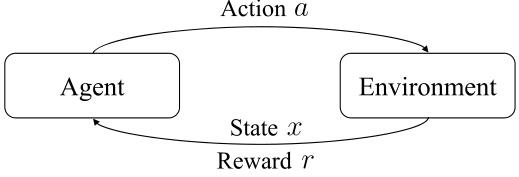
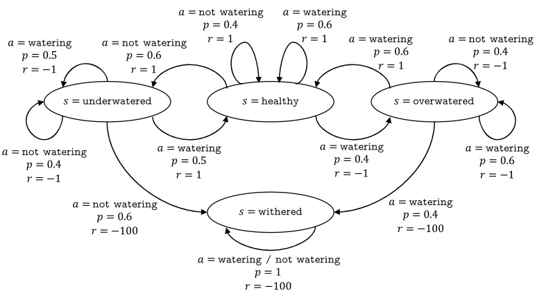
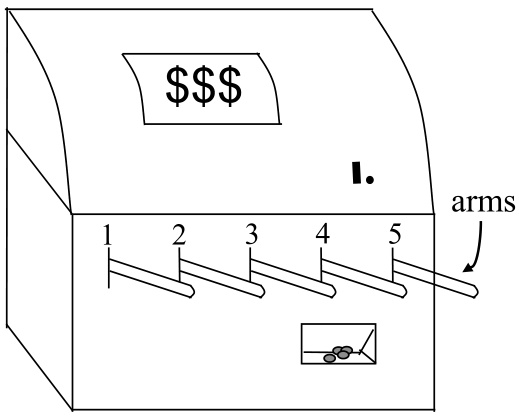
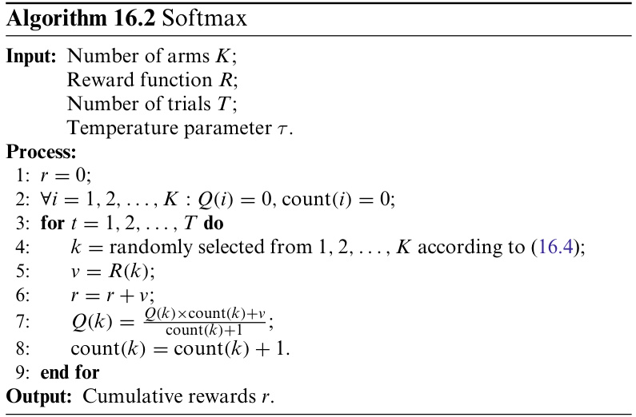
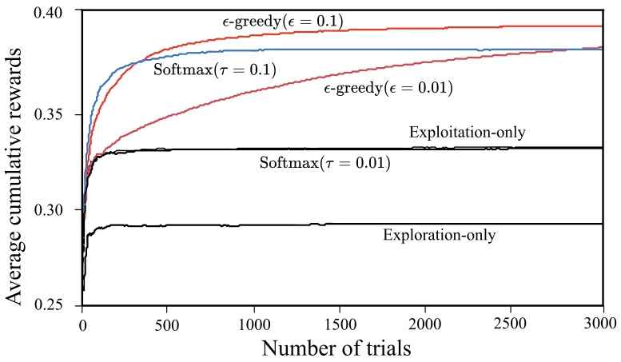
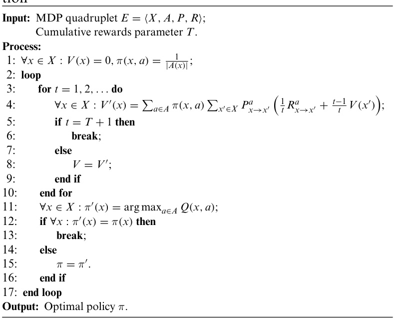
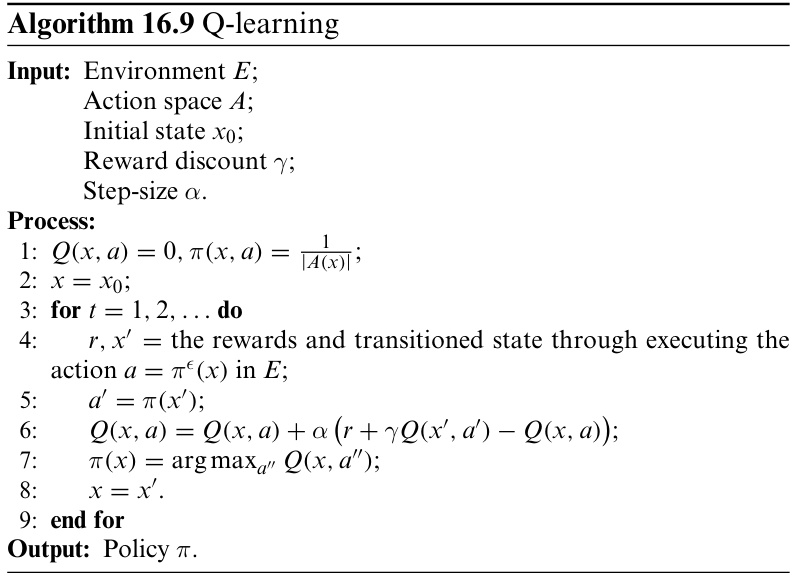
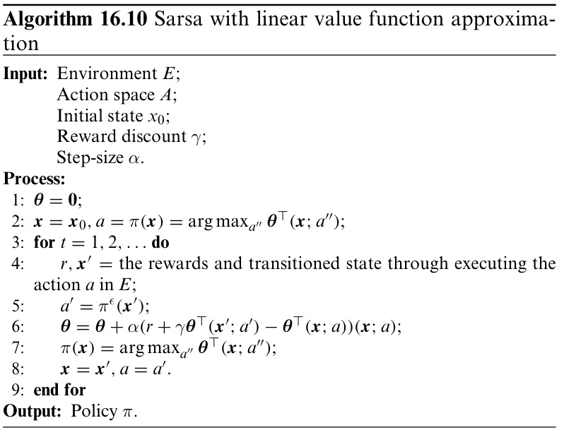

# Reinforcement Learning  

## 16.1  Task and Reward  

Planting watermelon involves many steps, such as seed selec- tion, regular watering, fertilization, weeding, and insect con- trol. We usually do not know the quality of the watermelons until harvesting. If we consider the harvesting of ripe water- melons as a reward for planting watermelons, then we do not receive the final reward immediately after each step of plant- ing, e.g., fertilization. We do not even know the exact impact of the current action on the final reward. Instead, we only receive feedback about the current status, e.g., the watermelon seedling looks healthier. After planting watermelons many times and exploring different planting methods, we may finally come up with a good strategy for planting watermelons. Such a process, when abstracted, is called  reinforcement learning .  

As illustrated in  .  Figure 16.1 , we usually use Markov Decision Process (MDP) to describe reinforcement learning problems: an agent is in an environment  $E$   with a state space  $X$  , where each state  $x\in X$  is a description of the environment per- ceived by the agent, e.g., the growing trend of the watermelon seedling in watermelon planting. The actions that the agent can perform form an action space    $A$  . For example, in watermelon planting, the actions include watering, using different types of fertilizers, and applying different types of pesticides. When an action    $a\in A$   is performe  on the current state    $x$  , the under- lying transition function  P  will transit the environment from the current state to another with a certain probability, e.g., watering a dehydrated seedling may or may not recover it to a healthy state. After the transition from one state to another, the environment sends the agent a reward based on the under- lying  reward  function    $R$  , e.g.,    $+1$   for healthy seedling,    $-10$  for withered seedling, and    $+100$   for harvesting a ripe water- melon. In short, reinforcement learning involves a quadruplet  $E=\langle X,A,P,R\rangle$  , where    $P:X\times A\times X\mapsto\mathbb{R}$   gives the state transition probability, and    $R\,:\,X\times A\times X\,\mapsto\,\mathbb{R}$   gives the reward. In some applications, the reward function may only depend on state transitions, that is,    $R:X\times X\mapsto\mathbb{R}$  .  

  
Fig. 16.1 A diagram of reinforcement learning  

  
Fig. 16.2 The MDP of watering watermelons  

.  Figure 16.2  provides an example showing the MDP of watering watermelons. In this example, we have four states (i.e.,  healthy ,  underwatered ,  overwatered  and  withered ) and two actions (i.e.,  watering ,  not watering ). After each transi- tion, the agent receives a reward of 1 if the state is  healthy and a reward of    $^{-1}$   if the state is  underwatered  or  overwa- tered . The state can be recovered to  healthy  by  watering  or not watering . When the seedling is  withered , it is unrecov- erable, and the agent receives the minimum reward value of  $-100$  . The arro s in  .  Figure 16.2  represent state transitions, where  $a,p$  , and  r  are, respectively, the action, the state transi- tion probability, and the reward. We can easily figure out that the optimal strategy is to take the action  watering  in the state healthy , the action  not watering  in the state  overwatered , the action  watering  in the state  underwatered , and any actions in the state  withered .  

The agent has no direct control of the state transition or reward. It can only influence the environment by taking actions and perceive the environment by observing transited states and returned rewards. For example, in the watermelon planting problem, the environment is the natural world in which water- melons grow; in a chess game, the environment is the chess- board and the opponent; in robot control, the environment is the body of the robot and the physical world.  

By interacting with the environment, the agent tries to learn a  policy  $\pi$   that can select the action    $a=\pi(x)$   at state    $x$  . For example, when the agent observes the state  underwatered , it takes the action  watering . There are two ways of representing policies. The first one is representing policies with functions  $\pi:X\mapsto A$  , and we often use this representation for deter- ministic policies. The other one is representing policies with probabilities  $\pi:X\times A\mapsto\mathbb{R}$  , and we often use this representa- tion for stochastic policies. For the probability representation,  $\pi(x,a)$   is the probability of choosing the action    $a$   at state    $x$  , and we must ensure  $\textstyle\sum_{a}\pi(x,a)=1$  

The quality of policy is measured by the cumulative rewards of executing this policy in the long term. For example, a policy that leads to a  withered  seedling may accumulate only a small amount of reward, whereas a policy that leads to a  ripe  water- melon can accumulate a large amount of reward. The objective of reinforcement learning is to find a policy that maximizes the long-term cumulative rewards. There are different ways to cal- culate cumulative rewards, and the commonly used ones are    $T$  - step cumulative rewards    $\begin{array}{r}{\mathbb{E}[\frac{1}{T}\sum_{t=1}^{\top}r_{t}]}\end{array}$    and    $\gamma$  - discounted cumu- = lativ rewards    $\mathbb{E}[\sum_{t=0}^{+\infty}\gamma^{t}r_{t+1}]$  , where  $r_{t}$   is the reward at step    $t$  = + and  E  is the expectation with respect to all random variables.  

Readers may have recognized the differences between rein- forcement learning and supervised learning. If we consider ‘‘states’’ and ‘‘actions’’, respectively, as ‘‘samples’’ and ‘‘labels’’ in supervised learning,then‘‘policies’’correspondto‘‘classifiers’’ (for discrete actions) or ‘‘regressors’’ (for continuous actions), and hence the two learning paradigms are somewhat similar. The main difference is that there are no labeled samples in reinforcement learning. In other words, there is no supervised information that tells the agent which action it should take with the given state. Instead, the agent has to wait for the outcome and then ‘‘reflects’’its previous actions. From this perspective, reinforcement learning can be seen as supervised learning with time-delayed labels.  

## 16.2  K -Armed Bandit  

### 16.2.1  Exploration Versus Exploitation  

Unlike common supervised learning,the final amount of rewards in reinforcement learning is only observed after multiple actions. Let us start our discussion with the simplest case: we maximize the reward of each step, that is, consider only one step at a time. Note that reinforcement learning and supervised learning are still quite different even in this simplified scenario since the agent needs to try out different actions to collect the respective outcomes. In other words, there is no training data that tells the agent which actions to take.  

To maximize the one-step reward, we need to consider two aspects: find the reward corresponding to each action and take the highest-rewarded action. If the reward of each action is a definite value, then we can find the highest-rewarded action by trying out all actions. In practice, however, the reward of action is usually a random variable sampled from a probabil- ity distribution, and hence we cannot accurately determine the mean reward only in one trial.  

The above one-step reinforcement learning scenario corresponds to a theoretical model called    $K$  - armed bandit . As illustrated in  .  Figure 16.3 , there are  $K$   arms in the K-armed bandit. After inserting a coin, the player can pull an arm, and the machine will return some coins at a certain probability (of this arm) that is unknown to the player. The player’s objective is to develop a policy that maximizes the cumulative reward, that is, more coins.  

If we only want to know the expected reward of each arm, then we can employ the  exploration-only  method: equally allo- cate the pulling opportunities to the arms (i.e., pull each arm in turn), and then calculate the average number of coins returned by each arm as the approximation of expectation. In contrast, if we only want to take the highest-rewarded action, then we can employ the  exploitation-only  method: pull the currently best arm (i.e., the one with the highest average reward), or randomly choose one when there are multiple best arms. By comparing these two methods, we see that the  exploration-only method can estimate the reward of each arm reasonably well at the cost of losing many opportunities to pull the optimal arm, whereas the  exploitation-only  method is likely to miss the optimal arm since it does not have a good estimation of the expected reward of each arm. Therefore, we are unlikely to maximize the cumulative rewards using either method.  

  
Fig. 16.3 An example of    $K$  -armed bandit  

Actually,  exploration  (i.e., estimating the quality of each arm) and  exploitation  (i.e., choosing the currently best arm) are conflicted since the total number of trials (i.e., pulling opportunities) is fixed. In other words, improving one aspect will weaken the other, and such a situation is known as the Exploration-Exploitation dilemma  in reinforcement learning. To maximize the cumulative rewards, we need to make a good trade-off between exploration and exploitation.  

### 16.2.2    $\epsilon$  -Greedy  

The    $\epsilon$  -greedy method makes a trade-off between exploration and exploitation based on a probability value. In each trial, it chooses exploration (i.e., randomly select an arm) with a probability of    $\epsilon$   or chooses exploitation (i.e., select the arm with the highest reward at the moment, or randomly select from tied arms with the highest reward) with the probability of   $1-\epsilon$  .  

Formally, let    $Q(k)$   denote the average reward of arm    $k$  . By pulling the arm    $k$   for    $n$   times, we obtain a series of rewards  $\nu_{1},\nu_{2},.\ldots,\nu_{n}$  , and the average reward is given by  

$$
Q(k)={\frac{1}{n}}\sum_{i=1}^{n}\nu_{i}.
$$  

Instead of using ( 16.1 ) to calculate the average of  $n$   rewards, we can also calculate the average incrementally by updating  $Q(k)$   after each trial. Let the subscripts denote the number of trials, and we have    $Q_{0}(k)\,=\,0$   at the initial  For every  $n\geqslant1$  ,    $Q_{n-1}(k)$   is the average reward after  $n-1$   − 1 trials, and the average reward, after the  n th trial with a reward of    $\nu_{n}$  , is updated to  

We will use ( 16.3 ) in Sect.  16.4.2  

$$
\begin{array}{l}{\displaystyle Q_{n}(k)=\frac{1}{n}\left((n-1)\times Q_{n-1}(k)+\nu_{n}\right)}\\ {\displaystyle\qquad=Q_{n-1}(k)+\frac{1}{n}\left(\nu_{n}-Q_{n-1}(k)\right).}\end{array}
$$  

In this way, we only need to record two values no matter how many trials we run, that is, the number of completed trials  $n\!-\!1$   and the most recent average reward    $Q_{n-1}(k)$  . The    $\epsilon\cdot$  -greedy algorithm is given in  $\circ$   Algorithm 16.1 .  

When the rewards of arms are highly uncertain (e.g., wide probability distribution),we need more explorations(i.e.,larger

  $\epsilon$  ). In contrast, when the rewards of arms have low uncertainty

 (e.g., concentrated probability distribution), we can obtain good approximations with a small number of trials, and hence a small    $\epsilon$   is sufficient. In practice, we usually let    $\epsilon$   be a small constant, such as 0 . 1 or 0 . 01. As the number of trials increases, we get a more accurate estimation of the rewards of all arms and eventually no longer need exploration. In such cases, we can let  $\epsilon$   decrease as the number of trials increases, e.g., letting  $\epsilon=1/\sqrt{t}$  .  

# Algorithm 16.1  ϵ -greedy  

Input:  Number of arms    $K$  ; Reward function    $R$  ; Number of trials    $T$  ; Exploration probability    $\epsilon$  . Process: 1:    $r=0$  ; 2:    $\forall i=1,2,\ldots,K:Q(i)=0$  ,  $(i)=0$  ; 3:  for  $t=1,2,\dots,T$   =  do 4: if  rand  $()<\epsilon$   then 5:  $k=$   uniformly and randomly selected from   $1,2,\dots,K$  ; 6: else 7:  $k=\arg\operatorname*{max}_{i}Q(i);$  8: end if 9:  $\nu=R(k)$  ; 10: r  =  r  +  v ; 11:  $\begin{array}{r}{Q(k)=\frac{Q(k)\times\mathrm{count}(k)+\nu}{\mathrm{count}(k)+1}}\end{array}$  ; + 12:  $\mathrm{count}(k)=\mathrm{count}(k)+1$  . 13:  end for Output:  Cumulative rewards  $r$  .  

$\boldsymbol{\mathcal{Q}}(i)$   and   $\mathrm{count}(i)$   are, respectively, the average rewards of arm    $i$  and the number of times arm    $i$   is chosen. Generate a random number from  [ 0 ,  1 ] .  

The reward of the current trial.  

( 16.2 ) updates the average reward.  

### 16.2.3  Softmax  

The  Softmax  algorithm makes a trade-off between exploration and exploitation based on the current average rewards. The basic idea is that arms with similar average rewards should have similar probabilities to be chosen,and arms with higher average rewards than the others should have higher probabilities to be chosen.  

The Softmax algorithm allocates the probabilities of being chosen based on the Boltzmann distribution  

$$
P(k)=\frac{e^{\frac{Q(k)}{\tau}}}{\sum_{i=1}^{K}e^{\frac{Q(i)}{\tau}}},
$$  

where    $\boldsymbol{\mathcal{Q}}(i)$   is the average reward of the current arm, and    $\tau>0$  is known as  temperature . A smaller    $\tau$   makes the arms with high average rewards more likely to be chosen. Softmax moves towards exploitation-only  as  $\tau$   approaches 0 and moves towards exploration-only  as  $\tau$  approaches the positive infinity. The Soft- max algorithm is given in    $\circ$   Algorithm 16.2 .  

The choice between  $\epsilon$  -greedy and Softmax mainly depends on the specific applications. To understand their difference, let us take a look at an intuitive example. Considering the fol- lowing 2-armed bandit: the arm 1 returns a reward of 1 at a probability of 0 . 4 and returns a reward of 0 at a probability of 0 . 6, and the arm 2 returns a reward of 1 at a probability of 0 . 2 and returns a reward of 0 at a probability 0 . 8. For this 2-armed  $\tau$   is a parameter used in line  4 .  

$\boldsymbol{\mathcal{Q}}(i)$   and count  $(i)$   are, respectively, the average rewards of arm  $i$   and the number of times arm  $i$   is chosen.  

The reward of the current trial.  

( 16.2 ) updates the average reward.  

  

bandit,  $^{\circ}$   Figure 16.4  shows the cumulative rewards of differ- ent algorithms under different parameter settings, where each curve is the average result of 1000 repeated experiments. We can observe that the curve of Softmax almost overlaps with the curve of  exploitation-only  when  $\tau=0.01$  .  

  
Fig. 16.4 The performance comparison of different algorithms on the 2- armed bandit  

For multi-step reinforcement learning problems with dis- crete state space and discrete action space, a straightforward approach is to consider the action selection of each state as a  $K$  -armed bandit problem, where the cumulative rewards in the reinforcement learning problem replace the reward function in the    $K$  -armed bandit problem, that is, applying bandit algo- rithms to each state: we keep records of the number of trails and the current cumulative rewards for each state, and decide the action based on the bandit algorithm. However, there are limitations in such an approach since it does not consider the structural information in the MDP of reinforcement learning. As we will see in Sect.  16.3 , there are better methods once we take advantage of the properties of MDP.  

## 16.3  Model-Based Learning  

We start our discussions on multi-step reinforcement learning problems with the scenario of  known model , that is, the quadru- plet    $E=\langle X,A,P,R\rangle$  in MDP is known. In other words, the agent has already modeled the environment and can simulate the environment exactly or approximately.We call such a learn- ing task  model-based learning . Here, the probability of transi- tion from state    $x$   to state    $x^{\prime}$    via action    $a$   is known, denoted by  $P_{x\rightarrow x^{\prime}}^{a}$  , and the reward is also known, denoted by    $R_{x\rightarrow x^{\prime}}^{a}$  . For → → ease of discussion, we assume both the state space  X  and the action space    $A$   be finite. For general model-based reinforce- ment learning, we need to consider how to learn the environ- ment model and how to learn the policy in the model. Here, we only discuss the latter, given that the environment model is known.  

We will discuss  unknown model in Sect.  16.4 .  

We will discuss infinite space in Sect.  16.5 .  

### 16.3.1  Policy Evaluation  

With the known model, we can estimate the expected cumula- tive rewards of using policy    $\pi$  . Let the function    $V^{\pi}(x)$   denote the cumulative rewards of using policy    $\pi$   from the starting state  $x$  , and the function    $Q^{\pi}(x,a)$   denote the cumulative rewards of using policy  $\pi$   after taking action    $a$   at state  $x$  . Here, we call    $V(\cdot)$  the  state value function  representing the cumulative rewards for a given state, and    $\boldsymbol{\mathcal{Q}}(\cdot)$   the  state-action value function  represent- ing the cumulative rewards for a given state-action pair.  

From the definition of cumulative rewards, we have the state value functions  

$$
\left\{\begin{array}{l l}{V_{T}^{\pi}(x)=\mathbb{E}_{\pi}\left[\frac{1}{T}\sum_{t=1}^{\top}r_{t}\mid x_{0}=x\right],}&{T\mathrm{-step~cummultiave~rewards};}\\ {V_{\gamma}^{\pi}(x)=\mathbb{E}_{\pi}\left[\sum_{t=0}^{+\infty}\gamma^{t}r_{t+1}\mid x_{0}=x\right],}&{\gamma\mathrm{~-discontinuity~cummultiave~rewards}.}\end{array}\right.
$$  

To keep our discussion concise, we omit the type of above two cumulative rewards in subsequent discussions when the context is clear. Let    $x_{0}$   denote the initial state,    $a_{0}$   denote the first action performed on the initial state, and    $t$   denote the number of steps for    $T$  -step cumulative rewards. Then, we have the state-action value functions  

$$
\begin{array}{r}{\left\{Q_{T}^{\pi}(x,a)=\mathbb{E}_{\pi}\left[\frac{1}{T}{\sum_{t=1}^{\top}}r_{t}\mid x_{0}=x,a_{0}=a\right];\right.}\\ {\left.Q_{\gamma}^{\pi}(x,a)=\mathbb{E}_{\pi}\left[{\sum_{t=0}^{+\infty}}\gamma^{t}r_{t+1}\mid x_{0}=x,a_{0}=a\right].\right.}\end{array}
$$  

Such recursive equations are known as Bellman equations.  

Expanded using the law of total probability.  

Since MDP possesses the Markov property, that is, the state at the next step only depends on the current state rather than any previous states, and therefore, the value function has a simple form of recursion. Specifically, for    $T$  -step cumulative rewards, we have  

$$
\begin{array}{l}{{V_{T}^{*}(x)=\mathbb{E}_{x}\displaystyle\left[\frac{1}{T}\sum_{t=1}^{T}r_{t}\mid x_{0}=x\right]}}\\ {{\displaystyle\qquad=\mathbb{E}_{x}\displaystyle\left[\frac{1}{T}r_{1}+\frac{T-1}{T}\frac{1}{T-1}\sum_{t=1}^{T}r_{t}\mid x_{0}=x\right]}}\\ {{\displaystyle\qquad=\sum_{a\in\mathcal A}\pi(x,a)\sum_{x\in\mathcal A}p_{x\to x^{\prime}}^{a}\left(\frac{1}{T}R_{x\to x^{\prime}}^{a}\right.}}\\ {{\displaystyle\qquad+\left.\frac{T-1}{T}\mathbb{E}_{x}\left[\frac{1}{T}\!-\!\sum_{t=1}^{T-1}r_{t}\mid x_{0}=x^{\prime}\right]\right)}}\\ {{\displaystyle\qquad=\sum_{a\in\mathcal A}\pi(x,a)\sum_{x\in\mathcal A}p_{x\to x^{\prime}}^{a}\left(\frac{1}{T}R_{x\to x^{\prime}}^{a}+\frac{T-1}{T}V_{T-1}^{*}(x^{\prime})\right).}}\end{array}
$$  

Similarly, for  $\gamma$  -discounted cumulative rewards, we have  

$$
V_{\gamma}^{\pi}(x)=\sum_{a\in A}\pi(x,a)\sum_{x^{\prime}\in X}P_{x\rightarrow x^{\prime}}^{a}(R_{x\rightarrow x^{\prime}}^{a}+\gamma\,V_{\gamma}^{\pi}(x^{\prime})).
$$  

Note that we can expand using the law of total probability because    $P$   and    $R$   are known.  

Readers may have recognized that the above calculations of value functions using recursive equations are essentially a kind of dynamic programming. For    $V_{T}^{\pi}$  , we can imagine that the recursion continues until it reaches the initial starting point. In other words, from the initial value    $V_{0}^{\pi}$    of the value function, we can calculate the one-step rewards    $V_{1}^{\pi}$    of every state in one iteration. Then, from the one-step rewards, we can calculate the two-step cumulative rewards    $V_{2}^{\pi}$  , and so on. Such a procedure is shown in    $\circ$   Algorithm 16.3 , and it takes only    $T$   iterations to precisely calculate the value function of    $T$  -step cumulative rewards.  

$$
\begin{aligned}
&{\text { Algorithm 16.3 } T \text {-step cumulative rewards-based policy evalu- }}\\
&\text { ation }\\
&\text { Input: MDP quadruplet } E=\langle X, A, P, R\rangle \text {; }\\
&\text { Evaluating policy } \pi \text {; }\\
&\text { Cumulative rewards parameter } T \text {. }\\
&\text { Process: }\\
&\forall x \in X: V(x)=0\\
&\text { for } t=1,2, \ldots \text { do }\\
&\forall x \in X: V^{\prime}(x)=\sum_{a \in A} \pi(x, a) \sum_{x^{\prime} \in X} P_{x \rightarrow x^{\prime}}^a\left(\frac{1}{t} R_{x \rightarrow x^{\prime}}^a+\frac{t-1}{t} V\left(x^{\prime}\right)\right) ;\\
&\text { if } t=T+1 \text { then }\\
&\text { break; }\\
&\text { else }\\
&V=V^{\prime} .\\
&\text { end if }\\
&\text { end for }\\
&\text { Output: State value functions } V \text {. }
\end{aligned}
$$ 

There is also a similar algorithm for    $V_{\gamma}^{\pi}$    since  $\gamma^{t}$   approaches 0 when  $t$   is large. To this end, we just need to modify line 3 of  $^{\circ}$   Algorithm 16.3  based on ( 16.8 ). Besides, the algorithm may iterate for quite many rounds, and therefore, we need to set a stopping criterion, e.g., set a threshold  $\theta$   and stop the algorithm when the change of value function after one iteration is smaller than  $\theta$  . Accordingly,    $t=T+1$   in line  4  of    $^{\circ}$   Algorithm 16.3 is replaced by  

$V(x)$   is the cumulative rewards of    $x$  . ( 16.7 ) updates the value function. We write in this format so that the    $T$  -step cumulative rewards and the    $\gamma$  -discounted cumulative rewards can be considered under the same algorithmic framework.  

See Exercise  16.2 .  

$$
\operatorname*{max}_{x\in X}\left|\,V(x)-V^{\prime}(x)\,\right|<\theta.
$$  

With the state value functions    $V$  , we can calculate the state- action value functions  

$$
\begin{array}{r}{\left\{Q_{T}^{\pi}(x,a)=\sum_{x^{\prime}\in X}P_{x\rightarrow x^{\prime}}^{a}(\frac{1}{T}R_{x\rightarrow x^{\prime}}^{a}+\frac{T-1}{T}V_{T-1}^{\pi}(x^{\prime}));\right.}\\ {\left.Q_{\gamma}^{\pi}(x,a)=\sum_{x^{\prime}\in X}P_{x\rightarrow x^{\prime}}^{a}(R_{x\rightarrow x^{\prime}}^{a}+\gamma V_{\gamma}^{\pi}(x^{\prime})).\right.}\end{array}
$$  

### 16.3.2  Policy Improvement  

After evaluating the cumulative rewards of a policy, we natu- rally wish to improve it if it is not the optimal one. An ideal policy should maximize the cumulative rewards  

$$
\pi^{*}=\arg\operatorname*{max}_{\pi}\sum_{x\in X}V^{\pi}(x).
$$  

A reinforcement learning problem could have more than one optimal policy, and the value function    $V^{*}$  corresponding to the optimal policies is called the optimal value function  

$$
\forall x\in X:V^{*}(x)=V^{\pi^{*}}(x).
$$  

Note that    $V^{*}$  in ( 16.12 ) is the value function of the optimal policies only if it imposes no constraint on the policy space. For example, for discrete state space and discrete action space, the policy space is the combination of all actions over all states, containing    $\mathsf{\tilde{l}}_{A}\vert^{|X|}$    different policies. However, once there are constraints on the policy space, then the policies that break the constraints are illegitimate policies whose value functions are not the optimal value function even if they have the highest cumulative rewards.  

Since the cumulative rewards of the optimal value function are maximized, we can make some small adjustments to the Bellman equations ( 16.7 ) and ( 16.8 ), that is, change the sum- mation over actions to selecting the best action  

$$
\begin{array}{r}{\left\{\begin{array}{l l}{V_{T}^{*}(x)=\operatorname*{max}_{a\in\mathcal{A}}\!\sum_{x^{\prime}\in X}\!P_{x\to x^{\prime}}^{a}(\frac{1}{T}R_{x\to x^{\prime}}^{a}+\frac{T-1}{T}V_{t-1}^{*}(x^{\prime}));}\\ {V_{\gamma}^{*}(x)=\operatorname*{max}_{a\in\mathcal{A}}\!\sum_{x^{\prime}\in X}\!P_{x\to x^{\prime}}^{a}(R_{x\to x^{\prime}}^{a}+\gamma V_{\gamma}^{*}(x^{\prime})).}\end{array}\right.}\end{array}
$$  

In other words,  

$$
V^{*}(x)=\operatorname*{max}_{a\in A}Q^{\pi^{*}}(x,a).
$$  

Substituting it into ( 16.10 ), we have the optimal state-action value function  

$$
\begin{array}{r}{\left\{\begin{array}{l l}{\!\!Q_{T}^{*}(x,a)=\sum_{x^{\prime}\in X}\!\!P_{x\to x^{\prime}}^{a}(\frac{1}{T}R_{x\to x^{\prime}}^{a}+\frac{T-1}{T}\operatorname*{max}_{a^{\prime}\in A}Q_{T-1}^{*}(x^{\prime},a^{\prime});}\\ {\!\!Q_{\gamma}^{*}(x,a)=\sum_{x^{\prime}\in X}\!\!P_{x\to x^{\prime}}^{a}(R_{x\to x^{\prime}}^{a}+\gamma\operatorname*{max}_{a^{\prime}\in A}Q_{\gamma}^{*}(x^{\prime},a^{\prime})).}\end{array}\right.}\end{array}
$$  

The above equations about the optimal value functions are called the Bellman optimality equations, whose unique solu- tions are the optimal value functions.  

The Bellman optimality equations suggest a method for improving non-optimal policies, that is, changing the action chosen by the policy to the currently best action. Clearly, doing so will improve the quality of policies. Let  $\pi^{\prime}$    denote the pol- icy with changed action, and    $Q^{\pi}(x,\pi^{\prime}(x))\geqslant V^{\pi}(x)$   denote the condition of action change. Taking the    $\gamma$  -discounted cumula- tive rewards as an example, from ( 16.10 ), we have the recursive inequality  

$$
\begin{array}{r l}&{V^{\pi}(x)\leqslant Q^{\pi}(x,\pi^{\prime}(x))}\\ &{\quad\quad=\displaystyle\sum_{x^{\prime}\in X}P_{x\rightarrow x^{\prime}}^{\pi^{\prime}(x)}(R_{x\rightarrow x^{\prime}}^{\pi^{\prime}(x)}+\gamma V^{\pi}(x^{\prime}))}\\ &{\quad\leqslant\displaystyle\sum_{x^{\prime}\in X}P_{x\rightarrow x^{\prime}}^{\pi^{\prime}(x)}(R_{x\rightarrow x^{\prime}}^{\pi^{\prime}(x)}+\gamma Q^{\pi}(x^{\prime},\pi^{\prime}(x^{\prime})))}\\ &{\quad=\cdots.}\\ &{\quad=V^{\pi^{\prime}}(x).}\end{array}
$$  

Since the value function is monotonically increasing with respect to every improvement made on the policy, we can safely improve the current policy  $\pi$   to  

$$
\pi^{\prime}(x)=\arg\operatorname*{max}_{a\in A}Q^{\pi}(x,a)
$$  

until    $\pi^{\prime}$    and    $\pi$   remain the same, and hence the Bellman opti- mality equation is achieved, that is, the optimal policy is found.  

### 16.3.3  Policy Iteration and Value Iteration  

The previous two subsections discussed how to evaluate the value function of a policy, as well as how to improve a policy to the optimum. Joining them gives the method for finding the optimal solution: start with an initial policy (usually a random policy), and then alternately iterate through policy evaluation and policy improvement until the policy converges with no more changes. Such a method is known as  policy iteration .  

Algorithm 16.4    $T$  -step cumulative rewards-based policy itera- tion  

$|A(x)|$   is the number of all possible actions under state  $x$  . ( 16.7 ) updates the value function.  

( 16.10 ) calculates    $\boldsymbol{\mathcal{Q}}$  .  

See Exercise  16.3 .  

  

.  Algorithm 16.4  shows the pseudocode of policy iteration, which improves  .  Algorithm 16.3  by adding policy improve- ment. Similarly, we can derive the policy iteration algorithm based on    $\gamma\cdot$  -discounted cumulative rewards. Policy iteration algorithms are often time-consuming since they need to re- evaluate policies after each policy improvement.  

From ( 16.16 ), we see that the policy improvement and the value function improvement are equivalent. Therefore, we can improve policy via value function improvement, that is, from ( 16.13 ), we have  

$$
\left\{\begin{array}{l l}{V_{T}(x)=\operatorname*{max}_{a\in A}\!\sum_{x^{\prime}\in X}\!P_{x\to x^{\prime}}^{a}\left(\frac{1}{T}R_{x\to x^{\prime}}^{a}+\frac{T-1}{T}V_{T-1}(x^{\prime})\right);}\\ {V_{\gamma}(x)=\operatorname*{max}_{a\in A}\!\sum_{x^{\prime}\in X}\!P_{x\to x^{\prime}}^{a}\left(R_{x\to x^{\prime}}^{a}+\gamma V_{\gamma}(x^{\prime})\right).}\end{array}\right.
$$  

This gives the value iteration algorithm,asshownin    $\circ$   Algorithm 16.5 .  

tion Input:  MDP quadruplet  $E=\langle X,A,P,R\rangle$  ; Cumulative rewards parameter  T ; Convergence threshold    $\theta$  . Process: 1:    $\forall x\in X:V(x)=0$  ; 2:  for    $t=1,2,\ldots.$   do ( 16.18 ) updates the value 3:  $\begin{array}{r}{\forall x\in X:V^{\prime}(x)=\operatorname*{max}_{a\in A}\sum_{x^{\prime}\in X}P_{x\rightarrow x^{\prime}}^{a}\,\Big(\frac{1}{t}R_{x\rightarrow x^{\prime}}^{a}+\frac{t-1}{t}\,V(x^{\prime})\Big);}\end{array}$  function. 4:  $\mathbf{if}\,\operatorname*{max}_{x\in X}\left|V(x)-V^{\prime}(x)\right|<\theta$   then 5: break ; 6: else 7:  $V=V^{\prime}$  . 8: end if 9:  end for ( 16.10 ) calculates    $\boldsymbol{Q}$  . Output:  Policy    $\pi(x)=\arg\operatorname*{max}_{a\in A}Q(x,a).$  

When    $\gamma$  -discounted cumulative rewards are used, we just need to replace line 3 of    $^{\circ}$   Algorithm 16.5  with  

$$
\forall x\in X:V^{\prime}(x)=\mathrm{max}_{a\in A}{\sum_{x^{\prime}\in X}}P_{x\rightarrow x^{\prime}}^{a}\left(R_{x\rightarrow x^{\prime}}^{a}+\gamma\,V(x^{\prime})\right).
$$  

From the above algorithms, we see that reinforcement learning problems with known models can be regarded as dynamic programming-based optimization. Unlike supervised learning, there is no generalization considered but just finding the best action for each state.  

## 16.4  Model-Free Learning  

In real-world reinforcement learning problems, it is often dif- ficult to obtain state transition probabilities and reward func- tions of the environment, and it can even be difficult to know the number of possible states. When the environment model is unknown, we call the learning task  model-free learning , which is much more difficult than learning with known models.  

### 16.4.1  Monte Carlo Reinforcement Learning  

In model-free learning, the first problem faced by policy iter- ation algorithms is that policies become unevaluable since we cannot apply the law of total probability without knowledge about the model. As a result, the agent has to try actions and observe state transitions and rewards. Inspired by    $K$  -armed  

See Sect.  14.7  for Monte Carlo methods. We have seen the MCMC method in Sect.  14.5.1 bandit, a straightforward replacement of policy evaluation is to approximate the expected cumulative rewards by averaging over the cumulative rewards of multiple samplings, and such an approach is called Monte Carlo Reinforcement Learning (MCRL). Since the number of samplings must be finite, the method is more suitable for reinforcement learning problems with    $T$  -step cumulative rewards.  

The other difficulty is that policy iteration algorithms only estimate the value function    $V$  , but the final policy is obtained from the state-action value function    $\mathcal{Q}$  . Converting    $V$   to    $\boldsymbol{Q}$   is easy when the model is known, but it can be difficult when the model is unknown. Therefore, the target of our estimation is no longer    $V$   but    $\boldsymbol{Q}$  , that is, estimating the value function for every state-action pair.  

Besides, when the model is unknown, the agent can only start from the initial state (or initial state set) to explore the environment, and hence policy iteration algorithms are not applicable since they need to estimate every individual state. For example, the exploration of watermelon planting can only start from sowing but not other states. As a result, we can only gradually discover different states during the exploration and estimate the value functions of state-action pairs.  

Putting them all together, when the model is unknown, we start from the initial state and take a policy for sampling. That is, by executing the policy for    $T$   steps, we obtain a trajectory  

$$
\langle x_{0},a_{0},r_{1},x_{1},a_{1},r_{2},\dots,x_{T-1},a_{T-1},r_{T},x_{T}\rangle.
$$  

Then, for each state-action pair in the trajectory, we sum up its subsequent rewards as a sample of its cumulative rewards.Once we have multiple trajectories, we take the average cumulative rewards for each state-action pair as an estimate of the state- action value function.  

To obtain a reliable estimation of value functions, we need many different trajectories. However, if our policy is determin- istic, then we will end up with identical trajectories since the policy will always select the same action for the same state. We recognize that this is similar to the problem in the  exploitation- only  method of    $K$  -armed bandit, and therefore, we can learn from the idea of exploration-exploitation trade-off. Taking    $\epsilon$  - greedy method as an example, it selects an action at random with probability    $\epsilon$   and the current best action with probabil- ity   $1-\epsilon$  . We call the deterministic policy    $\pi$   as  original policy , and the policy of applying the  $\epsilon$  -greedy method on the original policy is denoted by  

$$
\pi^{\epsilon}(x)=\left\{\!\!\begin{array}{l l}{{\pi(x),}}&{{\mathrm{with~probability}\,1-\epsilon;}}\\ {{\mathrm{Uniformly~and~randomly}}}&{{}}\\ {{\mathrm{select~an~action~from}\,A}}&{{\mathrm{with~probability}\,\epsilon.}}\end{array}\!\!\right.
$$  

For the original policy    $\pi=\arg\operatorname*{max}_{a}Q(x,a)$   that maximizes the value function, the current best action has a probability of  $\begin{array}{r}{1-\epsilon+\frac{\epsilon}{|A|}}\end{array}$    to be selected in the    $\epsilon$  -greedy policy    $\pi^{\epsilon}$  , and each | | non-optimal action has a probability of  $\frac{\epsilon}{|A|}$    to be selected. In | | this way, there is a chance for every action to be selected, and hence we can obtain different trajectories.  

Assuming there is only one best action.  

After Monte Carlo-based policy evaluation, we also need policy improvement as we had in policy iteration algorithms. Recall that we exploited the monotonicity revealed by ( 16.16 ) to improve policy using the current best action.Foranyoriginal policy  $\pi$  , its    $\epsilon$  -greedy policy    $\pi^{\epsilon}$    equally allocates the probability  $\epsilon$   to all actions, and therefore, we have    $Q^{\pi}(x,\pi^{\prime}(x))\geqslant V^{\pi}(x)$  for the original policy    $\pi^{\prime}$    that maximizes the value function. Hence, ( 16.16 ) still holds, and we can use the same policy improvement method.  

The pseudocode of the above procedure is given in .  Algorithm 16.6 . Since the evaluation and improvement are on the same policy, the algorithm is called the  on-policy  Monte Carlo reinforcement learning algorithm. The algorithm com- putes the average reward incrementally by updating the value function using all state-action pairs in the trajectory once sam- pled.  

Input:  Environment    $E$  ; Action space  $A$  ; Initial state  $x_{0}$  ; Number policy steps    $T$  . Process: 1:    $Q(x,a)=0$  ,  $(x,a)=0$  ,  $\begin{array}{r}{\pi(x,a)=\frac{1}{|A(x)|}}\end{array}$  ; | | 2:  for  $s=1,2,\ldots$  do 3: Obtain a trajectory by executing the policy    $\pi$   in  $E$  : 4:  $\begin{array}{r l}&{\langle x_{0},a_{0},r_{1},x_{1},a_{1},r_{2},\dots,x_{T-1},a_{T-1},r_{T},x_{T}\rangle;}\\ &{\mathbf{for}\;t=0,1,\dots,T-1\;\mathbf{do}}\\ &{\qquad R=\frac{1}{T-t}\sum_{i=t+1}^{\top}r_{i};}\\ &{\qquad Q(x_{t},a_{t})=\frac{Q(x_{t},a_{t})\times\mathrm{count}(x_{t},a_{t})+R}{\mathrm{count}(x_{t},a_{t})+1};}\\ &{\qquad\mathrm{count}(x_{t},a_{t})=\mathrm{count}(x_{t},a_{t})+1;}\end{array}$  5: 7: 8: end for 9: For each seen state  $x$  :  $\pi(x)={\left\{\begin{array}{l l}{\operatorname{arg\,max}_{a^{\prime}}Q(x,a^{\prime}),}&{{\mathrm{~with~probability}}\ 1-\epsilon}\\ {{\mathrm{Uniformly~and~randomly}}}\\ {{\mathrm{select~an~action~from}}\ A,}&{{\mathrm{~with~probability}}\ \epsilon.}\end{array}\right.}$  ; 10:  end for Output:  Policy  π .  

By default, the action is chosen with uniform probability.  

Sample the  s th trajectory.  

For each state-action pair, compute the cumulative rewards of the trajectory. ( 16.2 ) updates the average reward.  

Obtain the policy from the value function.  

The on-policy Monte Carlo reinforcement learning algo- rithm produces an    $\epsilon$  -greedy policy. However, introducing the  $\epsilon$  -greedy policy is just for the convenience of policy evaluation rather than using it as the final policy. The one we wish to improve is indeed the original (non    $\epsilon\cdot$  -greedy) policy. Then, is it possible to use    $\epsilon$  -greedy only in policy evaluation and improve the original policy in policy improvement? The answer is ‘‘yes’’.  

Suppose we sample trajectories using two different policies  $\pi$   and    $\pi^{\prime}$  , where the difference is that the same state-action pair has different probabilities of being sampled. In general, the expectation of function  $f$   over probability distribution  $p$   is given by  

$$
\mathbb{E}[f]=\int_{x}p(x)f(x)d x,
$$  

which can be approximated using the samples    $\{x_{1},x_{2},.\ldots,x_{m}\}$  obtained from the probability distribution  $p$  , that is  

$$
\hat{\mathbb{E}}[f]=\frac{1}{m}\sum_{i=1}^{m}f(x_{i}).
$$  

Suppose we introduce another distribution    $q$  , then the expec- tation of function  $f$   over the probability distribution    $p$   can be equivalently written as  

$$
\mathbb{E}[f]=\int_{x}q(x){\frac{p(x)}{q(x)}}f(x)d x,
$$  

The method of estimating the expectation of distribution using the samples of another distribution is known as importance sampling .  

which can be seen as the expectation of    ${\frac{p(x)}{q(x)}}f(x)$   over the dis- tribution    $q$  , and hence can be estimated using the samples  $\{x_{1}^{\prime},x_{2}^{\prime},\ldots,x_{m}^{\prime}\}$   drawn from    $q$  

$$
\hat{\mathbb{E}}[f]=\frac{1}{m}\sum_{i=1}^{m}\frac{p(x_{i}^{\prime})}{q(x_{i}^{\prime})}f(x_{i}^{\prime}).
$$  

Back to our original problem, using the sampled trajectory of the policy    $\pi$   to evaluate    $\pi$   is actually estimating the expecta- tion of the cumulative rewards  

$$
Q(x,a)=\frac{1}{m}\sum_{i=1}^{m}R_{i},
$$  

where    $R_{i}$   is the cumulative rewards from the state    $x$   to the end of the  i th trajectory. If we evaluate the policy    $\pi$   using the trajectories sampled from the policy    $\pi^{\prime}$  , then we just need to add weights to the cumulative rewards, that is  

$$
Q(x,a)=\frac{1}{m}\sum_{i=1}^{m}\frac{P_{i}^{\pi}}{P_{i}^{\pi^{\prime}}}R_{i},
$$  

where    $P_{i}^{\pi}$    and    $P_{i}^{\pi^{\prime}}$  are the two probabilities of producing the i th trajectory by the two policies. Given a trajectory    $\langle x_{0},a_{0}$  ,  $r_{1},.\,.\,,x_{T-1},a_{T-1},r_{T},x_{T}\rangle$  , its probability of being produced by the policy  $\pi$   is given by  

$$
P^{\pi}=\prod_{i=0}^{T-1}\pi(x_{i},a_{i})P_{x_{i}\rightarrow x_{i+1}}^{a_{i}}.
$$  

Though the state transition probability    $P_{x_{i}\rightarrow x_{i+1}}^{a_{i}}$    appears in + ( 16.27 ), ( 16.24 ) only needs the ratio of the two probabilities  

$$
{\frac{P^{\pi}}{P^{\pi^{\prime}}}}=\prod_{i=0}^{T-1}{\frac{\pi(x_{i},a_{i})}{\pi^{\prime}(x_{i},a_{i})}}.
$$  

If  $\pi$   is a deterministic policy and    $\pi^{\prime}$    is its    $\epsilon$  -greedy policy, then

  $\pi(x_{i},a_{i})$   is always 1 for  $a_{i}=\pi(x_{i})$   and    $\pi^{\prime}(x_{i},a_{i})$   is either  $\frac{\epsilon}{|A|}$    or | |

  $\begin{array}{r}{1-\epsilon+\frac{\epsilon}{|A|}}\end{array}$  , and hence we can evaluate the policy    $\pi$  . The  off- | | policy  Monte Carlo reinforcement learning algorithm is given in  $^{\circ}$   Algorithm 16.7 .  

$$
\begin{aligned}
&\text { Algorithm 16.7 Off-policy Monte Carlo reinforcement learning }\\
&\text { Input: Environment } E \text {; }\\
&\text { Action space } A \text {; }\\
&\text { Initial state } x_0 \text {; }\\
&\text { Number policy steps } T \text {. }\\
&\text { Process: } \square\\
&Q(x, a)=0, \operatorname{count}(x, a)=0, \pi(x, a)=\frac{1}{|A(x)|} ;\\
&\text { for } s=1,2, \ldots \text { do }\\
&\text { Obtain a trajectory by executing the } \epsilon \text {-greedy policy } \pi \text { in } E \text { : }\\
&\left\langle x_0, a_0, r_1, x_1, a_1, r_2, \ldots, x_{T-1}, a_{T-1}, r_T, x_T\right\rangle \text {; }\\
&p_i= \begin{cases}1-\epsilon+\epsilon /|A|, & a_i=\pi\left(x_i\right) ; \\ \epsilon /|A|, & a_i \neq \pi\left(x_i\right) ;\end{cases}\\
&\text { for } t=0,1, \ldots, T-1 \text { do }\\
&R=\frac{1}{T-t}\left(\sum_{i=t+1}^{\top} r_i\right) \prod_{i=t+1}^{T-1} \frac{\mathbb{I}\left(a_i=\pi\left(x_i\right)\right)}{p_i} ;\\
&Q\left(x_t, a_t\right)=\frac{Q\left(x_t, a_t\right) \times \operatorname{count}\left(x_t, a_t\right)+R}{\operatorname{count}\left(x_t, a_t\right)+1} ;\\
&\operatorname{count}\left(x_t, a_t\right)=\operatorname{count}\left(x_t, a_t\right)+1 ;\\
&\text { end for }\\
&\pi(x)=\arg \max _{a^{\prime}} Q\left(x, a^{\prime}\right) .\\
&\text { end for }\\
&\text { Output: Policy } \pi \text {. }
\end{aligned}
$$

### 16.4.2  Temporal Difference Learning  

When the model is unknown, Monte Carlo reinforcement learning algorithms use trajectory sampling to overcome the difficulty in policy evaluation. Such algorithms update value functions after each trajectory sampling.Incontrast,thedynamic programming-based policy iteration and value iteration algo- rithms update value functions after every step of policy exe- cution. Comparing these two approaches, we see that Monte Carlo reinforcement learning algorithms are far less efficient, mainly because they do not take advantage of the MDP struc- ture. We now introduce Temporal Difference (TD) learning, which enables efficient model-free learning by joining the ideas of dynamic programming and Monte Carlo methods.  

Essentially,Monte Carlo reinforcement learning algorithms approximate the expected cumulative rewards by taking the average across different trials. The averaging operation is in batch mode, which means state-action pairs are updated together after sampling an entire trajectory. To improve effi- ciency, we can make this updating process incremental. For state-action pair    $(x,a)$  , suppose we have estimated the value function    $\begin{array}{r}{Q_{t}^{\pi}(x,a)=\frac{1}{t}\sum_{i=1}^{\top}r_{i}}\end{array}$    based on the    $t$   state-a m- = ples, then, similar to ( 16.3 ), after we obtained the  (  $(t+1)$   + -th sample  $r_{t+1}$  , we have  

$$
Q_{t+1}^{\pi}(x,a)=Q_{t}^{\pi}(x,a)+\frac{1}{t+1}(r_{t+1}-Q_{t}^{\pi}(x,a)),
$$  

which increments    $Q_{t}^{\pi}(x,a)$   by  $\begin{array}{r}{\frac{1}{t+1}(r_{t+1}-Q_{t}^{\pi}(x,a))}\end{array}$  . More gen- erally, by replacing  $\frac{1}{t{+}1}$  cient    $\alpha_{t+1}$  , we can write t increment as  $\alpha_{t+1}(r_{t+1}^{}-Q_{t}^{\pi}(x,a))$   − . In practice, we often set  $\alpha_{t}$  + + to a small positive value  $\alpha$  . If we expand    $Q_{t}^{\pi}(x,a)$   to the sum of step-wise cumulative rewards, then the sum of the coefficients is 1, that is, letting    $\alpha_{t}=\alpha$   does not change the fact that    $Q_{t}$   is the sum of cumulative rewards. The larger the step-size  α  is, the more important the later cumulative rewards are.  

Taking    $\gamma$  -discounted cumulative rewards as an example, suppose we use dynamic programming and state-action func- tions, which are convenient when the model is unknown. Then, from ( 16.10 ), we have  

$$
\begin{aligned}
Q^\pi(x, a) & =\sum_{x^{\prime} \in X} P_{x \rightarrow x^{\prime}}^a\left(R_{x \rightarrow x^{\prime}}^a+\gamma V^\pi\left(x^{\prime}\right)\right) \\
& =\sum_{x^{\prime} \in X} P_{x \rightarrow x^{\prime}}^a\left(R_{x \rightarrow x^{\prime}}^a+\gamma \sum_{a^{\prime} \in A} \pi\left(x^{\prime}, a^{\prime}\right) Q^\pi\left(x^{\prime}, a^{\prime}\right)\right) .
\end{aligned}
$$

With cumulative sum, we have  

$$
Q_{t+1}^{\pi}(x,a)=Q_{t}^{\pi}(x,a)\!+\!\alpha(R_{x\to x^{\prime}}^{a}\!+\!\gamma Q_{t}^{\pi}(x^{\prime},a^{\prime})\!-\!Q_{t}^{\pi}(x,a)),
$$  

where  $x^{\prime}$    is the state transitioned from the state    $x$   after executing the action  $a$  , and    $a^{\prime}$    is the action for    $x^{\prime}$    selected by the policy    $\pi$  .  

With ( 16.31 ), value functions are updated after each action, as shown in  $\circ$   Algorithm 16.8 . Each update on value functions requires to know the previous  s tate, the previous  a ction, the r eward, the current  s tate, and the  a ction to be executed. Putting the initials together gives the algorithm name  Sarsa  (Rummery and Niranjan  1994 ). Sarsa is an on-policy algorithm, in which both the evaluation (line 6) and the execution (line 5) use the  $\epsilon$  -greedy policy.  

By modifying Sarsa to an off-policy algorithm, we have the Q-Learning algorithm (Watkins and Dayan  1992 ), as shown in  $^{\circ}$   Algorithm 16.9 , in which the evaluation (line 6) uses the original policy and the execution (line 4) uses the  $\epsilon$  -greedy pol- icy.  

$$
\begin{aligned}
&\text { Algorithm 16.8 Sarsa }\\
&\text { Input: Environment } E \text {; }\\
&\text { Action space } A \text {; }\\
&\text { Initial state } x_0\\
&\text { Reward discount } \gamma \text {; }\\
&\text { Step-size } \alpha \text {. }\\
&\text { Process: }\\
&Q(x, a)=0, \pi(x, a)=\frac{1}{|A(x)|}\\
&x=x_0, a=\pi(x)\\
&\text { for } t=1,2, \ldots \text { do }\\
&r, x^{\prime}=\text { the rewards and transitioned state through executing the }\\
&\text { action } a \text { in } E \text {; }\\
&a^{\prime}=\pi^\epsilon\left(x^{\prime}\right)\\
&Q(x, a)=Q(x, a)+\alpha\left(r+\gamma Q\left(x^{\prime}, a^{\prime}\right)-Q(x, a)\right) ;\\
&\pi(x)=\arg \max _{a^{\prime \prime}} Q\left(x, a^{\prime \prime}\right)\\
&x=x^{\prime}, a=a^{\prime} \text {. }\\
&\text { end for }\\
&\text { Output: Policy } \pi \text {. }
\end{aligned}
$$

By default, the action is chosen with uniform probability.  

One-step execution approach. The    $\epsilon$  -greedy policy of the original policy. ( 16.31 ) updates the value function.  

## 16.5  Value Function Approximation  

Our previous discussions assumed finite state space with each state assigned an index. The value function is a  tabular value function  of the finite state space, that is, it can be represented as an array with the  i th element in the array as the output value for the input  $i$  , and modifying the value of a state does not affect the values of other states. In practical reinforcement learning problems, however, the state space is often continuous with an  

  

infinite number of states. To solve this problem, what should we do?  

Intuitively, we can discretize the continuous state space into a finite state space and then apply the previously introduced techniques. Unfortunately, it is difficult to discretize the state space effectively, especially before we have explored the state space.  

As a workaround, we can try to model the value function in continuous state space directly. Suppose the state space is an  $n$  -dimensional real-valued space    $X=\mathbb{R}^{n}$  , whose state values cannot be recorded with a tabular value function. Let us start with a simple case in which the value function is represented as a linear function of states (Busoniu et al.  2010 ):  

$$
V_{\boldsymbol{\theta}}({\pmb x})={\pmb\theta}^{\top}{\pmb x},
$$  

where    $\pmb{x}$   is the state vector, and    $\pmb{\theta}$   is the parameter vector. Such a value function cannot precisely record the value of every state as we did for the finite state space, and hence solving such a value function is called  value function approximation .  

We wish that the value function learned from ( 16.32 ) can approximate the ground-truth value function    $V^{\pi}$    as precise as possible, and we often measure the difference using the least squares error  

$$
E_{\theta}=\mathbb{E}_{{\pmb x}\sim\pi}\left[(V^{\pi}({\pmb x})-V_{\theta}({\pmb x}))^{2}\right],
$$  

where    $\mathbb{E}_{x\sim\pi}$   is the expectation over the states sampled from the policy    $\pi$  .  

We can use a gradient descent method to minimize the error. Finding the negative derivative of the error, we have  

$$
\begin{array}{l}{\displaystyle-\frac{\partial E_{\theta}}{\partial\pmb{\theta}}=\mathbb{E}_{\pmb{x}\sim\pi}\left[2(V^{\pi}(\pmb{x})-V_{\pmb{\theta}}(\pmb{x}))\frac{\partial V_{\pmb{\theta}}(\pmb{x})}{\partial\theta}\right]}\\ {\displaystyle\qquad=\mathbb{E}_{\pmb{x}\sim\pi}\left[2(V^{\pi}(\pmb{x})-V_{\pmb{\theta}}(\pmb{x}))\pmb{x}\right],}\end{array}
$$  

from which we have the update rule of individual samples  

$$
\pmb{\theta}=\pmb{\theta}+\alpha(V^{\pi}(\pmb{x})-V_{\pmb{\theta}}(\pmb{x}))\pmb{x}.
$$  

Though we do not know the ground-truth value function  $V^{\pi}$    of the policy, we can learn from temporal difference learn- ing: based on    $V^{\pi}({\pmb x})=r+\gamma V^{\pi}({\pmb x}^{\prime})$  , we substitute the current estimated value function for the ground-truth value function, that is  

$$
\begin{array}{r l}&{\pmb{\theta}\,=\pmb{\theta}+\alpha(r+\gamma V_{\pmb{\theta}}(\pmb{x}^{\prime})-V_{\pmb{\theta}}(\pmb{x}))\pmb{x}}\\ &{\quad\quad=\pmb{\theta}+\alpha(r+\gamma\pmb{\theta}^{\top}\pmb{x}^{\prime}-\pmb{\theta}^{\top}\pmb{x})\pmb{x},}\end{array}
$$  

where  ${\pmb x}^{\prime}$    is the state at the next moment.  

Temporal difference learning requires the state-action value function to obtain the policy. A simple approach is to apply  $\pmb{\theta}$   to the joint vector of states and actions. For example, we can add one more dimension to the state vector for storing the action indices, that is, replacing    $\pmb{x}$   in ( 16.32 ) with    $(x;a)$  . Another approach is to encode actions with  $0/1$   to get the vector  $\pmb{a}=(0;.\,.\,;1;.\,.\,.\,;0)$  , where   $^{\ast1^{\ast}}$   indicates the selected action. Then, we combine  $\pmb{a}$   with the state vector into    $(x;a)$  , and use it to replace  $\pmb{x}$   in ( 16.32 ). By doing so, the linear approximation is done on the state-action value function.  

By replacing the value function in the Sarsa algorithm with linear value function, we have the Sarsa algorithm with linear value function approximation, as shown in  .  Algorithm 16.10 . Similarly, we can derive the Q-Learning algorithm with linear value function approximation. We can also easily replace the linear learner in ( 16.32 ) with other learning methods, e.g., ker- nel methods for non-linear value function approximation.  

## 16.6  Imitation Learning  

In classic reinforcement learning settings, the only feedback information received by the agent is the cumulative rewards after making multiple decisions. In real-world applications, however, we can often obtain some examples of how human experts make decisions. For example, we may ask experienced The  $\epsilon$  -greedy policy of the original policy. ( 16.36 ) updates the parameters.  

  

farmers to demonstrate how to plant watermelons. Learning from such demonstrations is called  imitation learning .  

Also known as  apprenticeship learning ,  learning from demonstration , and  learning by watching . This learning paradigm has a connection to learning from instruction . See Sect.  1.5 .  

### 16.6.1  Direct Imitation Learning  

The multi-step decision process in reinforcement learning faces a huge search space, and hence it is not easy to use the cumu- lative rewards to learn the appropriate decisions made many steps ago. Such a difficulty, however, can be well alleviated by directly imitating the state-action pairs provided by human experts, and we call it  direct imitation learning  (a.k.a. behavior cloning).  

Suppose that human experts have supplied us a set of trajectories    $\{\tau_{1},\tau_{2},\dots,\tau_{m}\}$  , where each trajectory includes a sequence of states and actions  

$$
\tau_{i}=\langle s_{1}^{i},a_{1}^{i},s_{2}^{i},a_{2}^{i},.\,.\,.\,.\,,s_{n_{i}+1}^{i}\rangle,
$$  

where  $n_{i}$   is the number of transitions in the  i th trajectory. Such information tells the agent what to do under each state, and therefore, we can use supervised learning to learn the policy that matches the trajectory data obtained from human experts.  

We can extract the state-action pairs from all trajectories to make a new data set  

$$
D=\{(s_{1},a_{1}),\,(s_{2},a_{2}),\,.\,.\,,\,(s_{\sum_{i=1}^{m}n_{i}},\,a_{\sum_{i=1}^{m}n_{i}})\},
$$  

which encodes states as features and actions as labels. Then, from data set  $D$  , we can learn a policy model using either classi- fi cation algorithms for discrete actions or regression algorithms for continuous actions. The agent can use the learned policy model to set the initial policy, which is then further improved by reinforcement learning techniques.  

### 16.6.2  Inverse Reinforcement Learning  

In many applications, it is often challenging to design the reward function, but we may inversely derive the reward func- tion from the examples provided by human experts, and we call it  inverse reinforcement learning  (Abbeel and   $\mathrm{Ng\2004)}$  .  

In inverse reinforcement learning, the state space    $X$  and the action space  $A$   are known, and we also have a trajectory data set    $\{\tau_{1},\tau_{2},.\ldots,\tau_{m}\}$   just like we have in direct imitation learning. The basic idea of inverse reinforcement learning is as follows: letting the agent take the actions that are consistent with the provided examples is equivalent to finding the optimal policy in the environment of a reward function, where the optimal policy produces the same trajectories as the provided examples. In other words, we look for a reward function such that the provided samples are optimal and then use this reward function to train the policy in reinforcement learning.  

Suppose that the reward function can be represented as a linear function of states, that is,    $R({\pmb x})={\bf w}^{\top}{\pmb x}$  . Then, the cumu- lative rewards of policy    $\pi$   can be written as  

$$
\begin{array}{r l}&{\rho^{\pi}=\mathbb{E}\left[\displaystyle\sum_{t=0}^{+\infty}\gamma^{t}R(\pmb{x}_{t})\mid\pi\right]=\mathbb{E}\left[\displaystyle\sum_{t=0}^{+\infty}\gamma^{t}\mathbf{w}^{\top}\pmb{x}_{t}\mid\pi\right]}\\ &{\quad=\mathbf{w}^{\top}\mathbb{E}\left[\displaystyle\sum_{t=0}^{+\infty}\gamma^{t}\pmb{x}_{t}\mid\pi\right],}\end{array}
$$  

which is the inner product of the coefficients    $\mathbf{w}$   and the expec- tation of the weighted sum of state vectors.  

Let  ${\bar{\pmb{x}}}^{\pi}$    denoteth pec t ation of state vectors    $\mathbb{E}[\sum_{t=0}^{+\infty}\gamma^{t}{\pmb x}_{t}\ |$   |  $\pi]$  . The expectation  ¯  ${\bar{\pmb{x}}}^{\pi}$    can be approximated using the Monte = Carlo method: the example trajectories can be seen as a sam- pling of the optimal policy, and hence we can calculate the weighted sum of states in each example trajectory and then take the average, denoted by  $\Bar{\b{x}}^{*}$  . Then, for the optimal reward function    $\bar{R(\pmb{x})}^{\top}\!=\,\mathbf{w}^{*\top}\pmb{x}$   and the expectation  ${\bar{\pmb{x}}}^{\pi}$    produced by any other policies, we have  

$$
\mathbf{w}^{*}{}^{\top}{\bar{\mathbf{x}}}^{*}-\mathbf{w}^{*}{}^{\top}{\bar{\mathbf{x}}}^{\pi}=\mathbf{w}^{*}{}^{\top}({\bar{\mathbf{x}}}^{*}-{\bar{\mathbf{x}}}^{\pi})\geqslant0.
$$  

If we can calculate    $(\bar{\pmb x}^{*}-\bar{\pmb x}^{\pi})$  −¯  for every policy, then we can solve  

$$
\begin{array}{r l}{{\mathbf w}^{*}=\arg\operatorname*{max}_{{\mathbf w}}}&{\operatorname*{min}_{\pi}{\mathbf w}^{\top}(\bar{{\mathbf x}}^{*}-\bar{{\mathbf x}}^{\pi})}\\ {\mathrm{s.t.}}&{\|{\mathbf w}\|\leqslant1.}\end{array}
$$  

Since it is difficult to obtain all policies, an alternative approach is to start with a random policy and use it to find a better reward function iteratively. The reward function is then used to find a better policy. This process continues until we have the reward function and policy that fit the example trajectories. The pseudocode of the above procedure is given in  $\circ$   Algorithm 16.11 . In the step of finding a better reward function, the minimization in ( 16.39 ) should only include the previously learned policies instead of all policies.  

